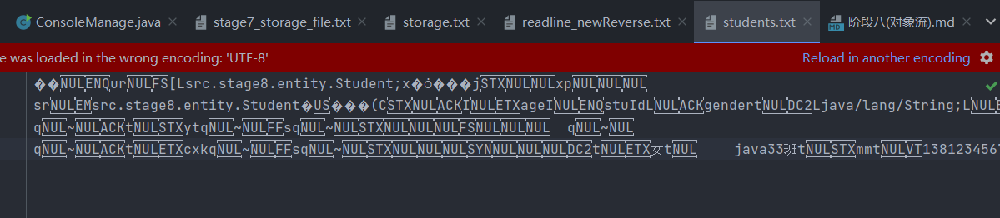

```java
package src.stage8;


import src.stage8.entity.Student;
import src.stage8.entity.StudentList;
import src.stage8.utils.Parsing;
import src.stage8.utils.ScannerUtils;

import java.io.*;

/**
 * @description: 小练习阶段三
 * @author: wuguidong@cskaoyan.onaliyun.com
 **/

public class ConsoleManage {
    private Parsing parsing = new Parsing();
    String storageFileName="students.txt";
    //学生列表对象 需要在这个类中使用，所以作为它的成员变量
    //默认的长度是10
    private StudentList sls = new StudentList(10,storageFileName);
    Student student;
    //默认无参构造里，
    public ConsoleManage() throws IOException {
        //初始化
//        加几个Student对象作为数组的初始值
        //new object
        File file=new File(storageFileName);
        //judge file is null?
        if (file.length()==0){
            System.out.println("反序列化失败，文件为空");
        }
        else
        {
            //  not null
            //new obejct and write
            ObjectInputStream objectInputStream = new ObjectInputStream(new FileInputStream(file));
            try {
                //read student[]
                //  read object
                Student[] students= (Student[]) objectInputStream.readObject();
                //for   -> sls
                for (Student s:students){
                    if (s!=null) {
                        //add
                        sls.readStudent(s);
                    }
                }
            } catch (ClassNotFoundException e) {
                e.printStackTrace();
            }finally {
                objectInputStream.close();
            }

        }


    }

    //查找指定 字符串 对应的值 如 stuID="xxx" , return xxx;
    public String[] find(String S, String findName) {
        //return 数组 value [0] 代表 value . value[1] 代表剩余字符串。
        String[] values = new String[2];
        //发现第一次出现的位置 + 本身长度 为 值的出现位置
        int key = S.indexOf(findName);
        //出现位置后面的第一个，的位置
        int endNumber = S.indexOf(",");
        //得到value
        values[0] = S.substring(key + findName.length() + 1, endNumber - 1);
        //截取 xxx 并且 返回当前xxx ，后面的子串
        //如果没有， 返回null;
        values[1] = S.substring(endNumber + 1);
        return values;
    }

    public static void main(String[] args) throws IOException {
        ConsoleManage cm = new ConsoleManage();
        cm.start();
    }

    /**
     * test 初始值
     */
    public  void addTest(){
        Student s1 = new Student(3, "张三", "男", "Java31th", 128, "18888888888");
        Student s2 = new Student(1, "李四", "女", "Java31th", 28, "17777777777");
        Student s3 = new Student(7, "yt", "女", "Java31th", 45, "17777777777");
        Student s4 = new Student(9, "cxk", "女", "Java31th", 28, "17777777777");
        Student s5 = new Student(19, "mm", "女", "Java31th", 5, "17777777777");
        Student s6 = new Student(6, "xgk", "女", "Java31th", 15, "17777777777");
        //调用方法 加进数组中
        sls.readStudent(s1);
        sls.readStudent(s2);
        sls.readStudent(s3);
        sls.readStudent(s4);
        sls.readStudent(s5);
        sls.readStudent(s6);
    }
    public void start() {
//        addTest();
        //该标志指示循环是否继续进行,即是否仍然输出菜单
        boolean loopFlag = true;
        while (loopFlag) {
            //调用方法,输出菜单
            showMenu();
            //键盘录入 选择对应功能
            int input = src.stage5.utils.ScannerUtils.getMenuByScanner();
            switch (input) {
                case 1:
                    consoleGetAllStudent(sls.getAllStudent());
                    break;
                case 2:
                    consoleCreateStudent();
                    break;
                case 3:
                    consoleDeleteStudent();
                    break;
                case 4:
                    consoleUpdateStudent();
                    break;
                case 5:
                    consoleRetrieveStudent();
                    break;
                case 6:
                    consoleSortStudentList();
                    break;
                case 7:
                    int quitFlag = src.stage5.utils.ScannerUtils.getFlagByScanner();
                    if (quitFlag == 1) {
                        loopFlag = false;
                        System.out.println("感谢使用本系统！");
                        break;
                    }
                    System.out.println("欢迎继续使用！");
                    break;
            }
        }
    }

    //排序学生
    private void consoleSortStudentList() {
        //首先，获取对象sls;
        Student[] allStudent = sls.getAllStudent();
        //选择操作
        int chooseNumber = src.stage5.utils.ScannerUtils.chooseNumber();
        //根据年龄排序
        if (chooseNumber == 1) {
            //sls.age 冒泡比较，
            //在原先的基础上排序

            //sout
            consoleGetAllStudent(sls.sortAge());
        }
        if (chooseNumber == 2) {
            //根据学号大小排序
            //sls.id 冒泡比较
            //sout
            consoleGetAllStudent(sls.sortId());
        }

    }


    //    //冒泡排序
//    public Student[] BubbleSort(Student []){
//
//        return
//    }
    private void consoleRetrieveStudent() {
        //首先要通过键盘录入获得一个学号
        int targetStuId = src.stage5.utils.ScannerUtils.getStuIdByScanner();
        Student targetStudent = sls.retrieveStudent(targetStuId);
        if (targetStudent == null) {
            System.out.println("未查找到该学号的学生!");
            return;
        }
        System.out.println("学号\t姓名\t性别\t\t年级\t\t年龄\t\t电话号码");
        targetStudent.printStudent();
    }

    private void consoleUpdateStudent() {
        //首先要通过键盘录入获得一个学号
        int targetStuId = src.stage5.utils.ScannerUtils.getStuIdByScanner();
        //用对象来查找修改
        if (sls.judgeStuIdExist(targetStuId)) {
            //学号存在,可以修改
            Student updateStu = ScannerUtils.getStudentInstanceByScanner(sls);
            /*
            由于工具类做出了修改 已经无需再去判断学号是否重复了
            这里一定会正常录入一个Student对象
            if (updateStu == null){
                //表示用户再次录入了重复的学号
                System.out.println("该学号已存在!");
                return;
            }*/
            if (sls.updateStudent(targetStuId, updateStu)) {
                System.out.println("学生信息修改成功!");
                return;
            }
        }
        //学号不存在,无法修改
        System.out.println("学生信息修改失败!");
    }

    private void consoleDeleteStudent() {
        //首先要通过键盘录入获得一个学号
        int targetStuId = src.stage5.utils.ScannerUtils.getStuIdByScanner();
        //用对象来删除
        if (sls.deleteStudent(targetStuId)) {
            //方法返回true 表示删除成功
            System.out.println("学号为:" + targetStuId + "的学生已经删除成功！");
        } else {
            //方法返回false，表示未找到
            System.out.println("学号为:" + targetStuId + "的学生未找到！");
        }

    }

    private void consoleGetAllStudent(Student[] allStudent) {
        System.out.println("---------------------------学生列表---------------------------");
        //调用方法获取学生对象数组
//        Student[] allStudent = sls.getAllStudent();
        if (allStudent.length == 0) {
            //没有记录!
            System.out.println("没有学生信息记录!");
        } else {
            System.out.println("学号\t姓名\t性别\t年级\t\t年龄\t\t电话号码");
            for (int i = 0; i < allStudent.length; i++) {
                allStudent[i].printStudent();
            }
        }
    }

    private void consoleCreateStudent() {
        System.out.println("---------------添加学生信息-------------------");
        //调用工具类中的方法,得到一个学生对象
        //该方法如果返回null 表示输入的学号是重复的
        Student s = ScannerUtils.getStudentInstanceByScanner(sls);
        //学号重复应该结束方法，友好提示用户
        /*if (s == null) {
            System.out.println("您输入的学号已重复，请重新输入!");
            return;
        }*/
        //将该对象放进sls对象的数组中
        if (sls.createStudent(s)) {
            //方法返回true 表示存入学生信息成功
            System.out.println("存入信息成功!");
        } else {
            System.out.println("存入失败,可能是数组空间已满!");
        }
    }

    private void showMenu() {
        System.out.println("\n-----------------王道Java学生管理系统-----------------\n");
        System.out.println("                   1.学 生 列 表");
        System.out.println("                   2.增 加 学 生");
        System.out.println("                   3.删 除 学 生");
        System.out.println("                   4.修 改 学 生");
        System.out.println("                   5.查 询 学 生");
        System.out.println("                   6.排序学生");
        System.out.println("                   7.退 出 系 统\n");
    }

}
```

```java
package src.stage8.utils;

/**
 * 类<code>Doc</code>用于：TODO
 *parsing String
 * @author 12824
 * @version 1.0
 * @date 2021-07-03
 */
public class Parsing {
    /**
     *
     * @param targetName 解析字段名 key
     * @param sourceString 源字串；
     * @return value
     */
    public String parsing(String targetName,String sourceStrings){
        //去除“‘”
        String sourceString=sourceStrings.replaceAll("'", "");
        //serch sTRING
        String serchString=targetName+"=";
        //后移距离
        int lenth=serchString.length();
        int targetnameIndex=sourceString.indexOf(serchString);
        if (targetnameIndex == -1) {
            return null;
        }
        //目标起始位置
        int targetIndex=sourceString.indexOf(serchString)+lenth;

        int end=sourceString.indexOf(",",targetIndex);
        String S=sourceString.substring(targetIndex, end);
        //截取target value 字符串
        return S;
    }
}
```

```java
package src.stage8.utils;


import src.stage8.entity.Student;
import src.stage8.entity.StudentList;

import java.util.Scanner;

/**
 * @description: 键盘录入工具类
 * @author: wuguidong@cskaoyan.onaliyun.com
 **/

public class ScannerUtils {
    //需要一个Scanner对象,用来做键盘录入,用static修饰保证该对象唯一
    private static final Scanner sc = new Scanner(System.in);

    //私有化构造方法
    private ScannerUtils() {
    }


    /*//根据键盘录入,封装成一个Student对象并返回
    public static Student getStudentInstanceByScanner() {
        //为了避免Scanner有异常错误,全部采用nextLine()接收字符串,然后转换类型
        System.out.print("请输入要录入学生的学号：");
        String tempStringStuId = sc.nextLine();
        int stuId = Integer.parseInt(tempStringStuId);
        System.out.print("请输入要录入学生的姓名：");
        String name = sc.nextLine();
        System.out.print("请输入要录入学生的性别：");
        String gender = sc.nextLine();
        System.out.print("请输入要录入学生的班级：");
        String grade = sc.nextLine();
        System.out.print("请输入要录入学生的年龄：");
        String tempStringAge = sc.nextLine();
        int age = Integer.parseInt(tempStringAge);
        System.out.print("请输入要录入学生的电话号码：");
        String phoneNum = sc.nextLine();

        //创建对象,并返回
        return new Student(stuId, name, gender, grade, age, phoneNum);
    }*/

    //根据键盘录入,封装成一个Student对象并返回，但是要对学号做唯一性校验
    //需要传入使用的StudentList对象，进行校验
    public static Student getStudentInstanceByScanner(StudentList sls) {
        //为了避免Scanner有异常错误,全部采用nextLine()接收字符串,然后转换类型
        int stuId = 0;
        while (true) {
            System.out.print("请输入合法的学号，要求大于0的整数并且不重复：");
            String tempStringStuId = sc.nextLine();
            try {

                stuId = Integer.parseInt(tempStringStuId);
            }catch (NumberFormatException e){
                System.out.println("解析异常。");
            }
            //调用成员方法来判断stuId是否重复
            if (!sls.judgeStuIdRedundant(stuId)) {
                //不允许学号重复，友好提示用户做出修改
                System.out.println("学号已重复请重新录入！");
                continue;
            }
            if (!judgeStuIdLegal(stuId)) {
                //不允许学号小于0，友好提示用户做出修改
                System.out.println("学号必须大于0，请重新录入！");
                continue;
            }
            break;
        }
        String name;
        while (true) {
            System.out.print("请输入合法的姓名，长度在1到5之间：");
            name = sc.nextLine();
            if (!judgeNameLegal(name)) {
                //名字不合法，友好提示用户
                System.out.println("名字的长度必须在1到5之间，请重新输入！");
                continue;
            }
            break;
        }

        String gender;
        while (true) {
            System.out.print("请输入合法的性别，男和女之间选择：");
            gender = sc.nextLine();
            if (!judgeGenderLegal(gender)) {
                //性别不合法
                System.out.println("性别必须在男女之间选择！请重新录入！");
                continue;
            }
            break;
        }

        String grade;
        while (true) {
            System.out.print("请输入合法的班级，必须以xx班结尾：");
            grade = sc.nextLine();
            if (!judgeGradeLegal(grade)) {
                //班级不合法
                System.out.println("班级必须以xx班结尾，请重新录入！");
                continue;
            }
            break;
        }

        int age = 0;
        while (true) {
            System.out.print("请输入合法的年龄，必须在1到150之间：");
            String tempStringAge = sc.nextLine();
            try {

                age = Integer.parseInt(tempStringAge);
       
            }catch (NumberFormatException e){
                System.out.println("解析异常。");
            }
            if (!judgeAgeLegal(age)) {
                //年龄不合法
                System.out.println("年龄必须在1到150之间！请重新录入！");
                continue;
            }
            break;
        }

        String phoneNum;
        while (true) {
            System.out.print("请输入要录入学生的电话号码，手机号的长度必须是11为，且开头是138,158,136,188：");
            phoneNum = sc.nextLine();
            if (!judgePhoneNumLegal(phoneNum)) {
                System.out.println("手机号有误，请重新输入！");
                continue;
            }
            break;
        }
        //创建对象,并返回
        return new Student(stuId, name, gender, grade, age, phoneNum);
    }

    private static boolean judgePhoneNumLegal(String phoneNum) {

        String[] arr = {"138", "158", "136", "188"};
        if (phoneNum.length() != 11) {
            return false;
        }
        boolean flag = false;
        for (int i = 0; i < arr.length; i++) {
            if (phoneNum.startsWith(arr[i])) {
                flag = true;
            }
        }
        return flag;
    }

    private static boolean judgeAgeLegal(int age) {
        if (age > 0 && age < 150) {
            return true;
        } else {
            return false;
        }
    }

    private static boolean judgeGradeLegal(String grade) {
        if (grade.endsWith("班")) {
            return true;
        } else {
            return false;
        }
    }

    private static boolean judgeGenderLegal(String gender) {
        if ("男".equals(gender) || "女".equals(gender)) {
            return true;
        } else {
            return false;
        }
    }

    private static boolean judgeNameLegal(String name) {
        if (name.length() > 1 && name.length() <= 5) {
            return true;
        } else {
            return false;
        }
    }

    private static boolean judgeStuIdLegal(int stuId) {
        return stuId > 0;
    }

    public static int getStuIdByScanner() {
        int id=0;
        System.out.println("请输入要录入的学号：");
        try {

             id= Integer.parseInt(sc.nextLine());
        }catch (NumberFormatException e){
            System.out.println("解析异常。");
        }
        return id;
    }

    public static int getMenuByScanner() {
        int i = 0;
        while (true) {
            System.out.print("请选择功能(1-6)：");
            try {
                i = Integer.parseInt(sc.nextLine());
            }catch (NumberFormatException e){
                System.out.println("解析异常。");
            }
            if (i <= 0 || i > 6) {
                continue;
            }
            break;
        }
        return i;
    }

    public static int getFlagByScanner() {
        int i = 0;
        while (true) {
            System.out.println("确认退出吗（1/2）：");
            try {
                i = Integer.parseInt(sc.nextLine());

            }catch (NumberFormatException e){
                System.out.println("解析异常。");
            }
            if (i !=1 && i != 2) {
                continue;
            }
            break;
        }
        return i;
    }
    public static int chooseNumber(){
        int i = 0;
        while (true) {
            System.out.println("确认排序方式（1(年龄)/2(学号)）：");
            try {

                i = Integer.parseInt(sc.nextLine());
            }catch (NumberFormatException e){
                System.out.println("解析异常。");
            }
            if (i !=1 && i != 2) {
                continue;
            }
            break;
        }
        return i;
    }
}
```

```java
package src.stage8.entity;

/**
 * @description: 学生实体类
 * @author: wuguidong@cskaoyan.onaliyun.com
 **/

import java.io.Serializable;

/**
 * 分包，分功能，代码应该写在哪里？
 *
 *
 */
public class Student implements Serializable {
    private int stuId; //学号
    private String name; //姓名
    private String gender; //性别
    private String grade; //班级
    private int age; //年龄
    private String phoneNum; //手机号

    @Override
    public String toString() {
        return "Student{" +
                "stuId=" + stuId +
                ", name='" + name + '\'' +
                ", gender='" + gender + '\'' +
                ", grade='" + grade + '\'' +
                ", age=" + age +
                ", phoneNum='" + phoneNum + '\'' +
                ",}";
    }
//提供get、set方法


    public int getStuId() {
        return stuId;
    }

    public void setStuId(int stuId) {
        this.stuId = stuId;
    }

    public String getName() {
        return name;
    }

    public void setName(String name) {
        this.name = name;
    }

    public String getGender() {
        return gender;
    }

    public void setGender(String gender) {
        this.gender = gender;
    }

    public String getGrade() {
        return grade;
    }

    public void setGrade(String grade) {
        this.grade = grade;
    }

    public int getAge() {
        return age;
    }

    public void setAge(int age) {
        this.age = age;
    }

    public String getPhoneNum() {
        return phoneNum;
    }

    public void setPhoneNum(String phoneNum) {
        this.phoneNum = phoneNum;
    }

    //提供构造方法

    public Student(int stuId, String name, String gender, String grade, int age, String phoneNum) {
        this.stuId = stuId;
        this.name = name;
        this.gender = gender;
        this.grade = grade;
        this.age = age;
        this.phoneNum = phoneNum;
    }

    public Student() {
    }

    //打印学生信息的方法
    public void printStudent() {
        System.out.println(this.stuId + "\t\t" + this.name + "\t" + this.gender + "\t\t" + this.grade + "\t" + this.age + "\t\t\t" + this.phoneNum);

    }
}
```

```java
package src.stage8.entity;

import java.io.*;
import java.util.Arrays;

/**
 * @description: 存学生对象的类，包括对这些对象的操作
 * @author: wuguidong@cskaoyan.onaliyun.com
 **/

public class StudentList {
    BufferedWriter writer = null;
    private Student[] studs;
    String storageFileName;

    //为了方便明确的知道数组中有多少有效的学生对象,需要一个指示器
    //需要一个静态成员
    private static int count = 0;

    //构造方法
    public StudentList(int stuNums,String storageFileName) {

        this.studs = new Student[stuNums];
        this.storageFileName=storageFileName;
    }

    //私有化无参构造,禁止无参创建对象导致数组未初始化
    private StudentList() {
    }

    @Override
    public String toString() {
        return "StudentList{" +
                "studs=" + Arrays.toString(studs) + ", count=" + count +
                '}';
    }


    //更新student list学生信息
    public void updateFile() {
        //new obejct and write
        ObjectOutputStream objectInputStream = null;
        try {
            objectInputStream = new ObjectOutputStream(new FileOutputStream(storageFileName));
            //write student[]
            objectInputStream.writeObject(studs);
        } catch (IOException e) {
            e.printStackTrace();
        }finally {
            try {
                assert objectInputStream != null;
                objectInputStream.close();
            } catch (IOException e) {
                e.printStackTrace();
            }
        }

    }
//该类需要完成对studs数组的增删改查 四个基本操作，并且可以打印输出所有学生的信息

    //新增学生信息
    public boolean createStudent(Student s) {
        //该方法为新增学生信息，而不是修改或者覆盖，也就是说只有当数组中有null的位置的时候才能新增学生
        //遍历数组，找到null的位置
        for (int i = 0; i < studs.length; i++) {
            if (studs[i] == null) {
                //找到第一个等于null的位置的下标i
                //把方法的参数学生对象 装入数组中
                studs[i] = s;
                //输出提示语句：存入学生信息成功！
                //System.out.println("存入学生信息成功！");
                StudentList.count++;
                //update;
                updateFile();
                return true; //表示存入成功
            }
        }
        //程序执行到这里还没结束，表示数组满了，不能装了，提示用户，并返回false
        //System.out.println("数组已满，无法存入学生信息！");
        return false;
    }

    /**
     * read student don't storage
     *
     * @return
     */
    public boolean readStudent(Student s) {
        //该方法为新增学生信息，而不是修改或者覆盖，也就是说只有当数组中有null的位置的时候才能新增学生
        //程序执行到这里还没结束，表示数组满了，不能装了，提示用户，并返回false
        if (s!=null&&count<studs.length){
            studs[count]=s;
            count++;
            return true;
        }
        System.out.println("存取出错，数组满或读取为空");
        return false;
    }

    //删除学生信息，实质上是把某个学生对象的引用置为null
    //该方法需要传入一个学号 作为删除的依据
    public boolean deleteStudent(int targetStuId) {
        //遍历数组，通过学号找到该学生对象
        for (int i = 0; i < studs.length; i++) {
            //跳过为null的元素
            if (studs[i] == null) {
                continue;
            }
            //查找
            if (studs[i].getStuId() == targetStuId) {
                //找到了，把该元素置为null
                studs[i] = null;
                //删除元素后，不要忘记了把静态变量数组的长度-1
                StudentList.count--;
                updateFile();
                return true;
            }
        }
        //程序执行到这里，说明通过id没有找到元素
        return false;
    }

    //修改某个学生信息
    //根据学号查到学生,然后键盘录入学生对象,替代它
    public boolean updateStudent(int targetStuId, Student updateStu) {
        //如果用户再次录入已存在的学号，会传入一个nullStudent对象
        if (updateStu == null) {
            //无需赋值
            return false;
        }
        //遍历数组，通过学号找到该学生对象
        for (int i = 0; i < studs.length; i++) {
            //跳过为null的元素
            if (studs[i] == null) {
                continue;
            }
            //查找
            if (studs[i].getStuId() == targetStuId) {
                //找到了这个学号的学生,修改它
                studs[i] = updateStu;
                //更新文件
                updateFile();
                return true;
            }
        }
        //没找到对应学号的学生
        return false;
    }

    //查找某个学生
    public Student retrieveStudent(int targetStuId) {
        //先查看targetStuId是否存在
        int targetIndex = getIndex(targetStuId);
        if (targetIndex == -1) {
            //学号不存在
            return null;
        }
        return studs[targetIndex];
    }

    //返回装有全部有效学生信息的数组
    //不会返回null
    public Student[] getAllStudent() {
        //如果当前数组为null或者长度为0 返回长度为0的数组
        if (studs == null || studs.length == 0) {
            return new Student[0];
        }
        //程序执行到这里 数组都是正常的数组了
        //这里需要剔除数组中等于null的元素,然后把有效学生对象放入数组
        Student[] returnStuds = new Student[StudentList.count]; //count表示有效对象个数
        //注意学生数组的有效长度是根据returnStuds来定的，所以最多只能遍历它长度的数组
        //但是又需要全部遍历整个存学生的数组，需要用嵌套for循环
        int start = 0;
        for (int i = 0; i < returnStuds.length; i++) {
            for (int j = start; j < studs.length; j++) {
                if (studs[j] != null) {
                    returnStuds[i] = studs[j];
                    start = j + 1;
                    break;
                }
            }
        }
        return returnStuds;
    }

    //对学号进行校验，返回一个布尔类型的取值，true表示学号可以使用
    //false表示学号已重复禁止使用
    public boolean judgeStuIdRedundant(int targetStuId) {
        //遍历studs数组，但是要注意数组中是null的元素
        for (int i = 0; i < studs.length; i++) {
            if (studs[i] == null) {
                continue;
            }
            if (studs[i].getStuId() == targetStuId) {
                //表示学号已重复
                return false;
            }
        }
        //只要不从if中结束方法，说明学号还未重复
        return true;
    }

    //提供一个方法用来查找数组中是否存在对应的学号
    public boolean judgeStuIdExist(int targetStudId) {
        //遍历数组
        for (int i = 0; i < studs.length; i++) {
            if (studs[i] == null) {
                continue;
            }
            if (studs[i].getStuId() == targetStudId) {
                return true;
            }
        }
        return false;
    }

    //通过传入的学号查找下标,该方法私有,供内部使用
    private int getIndex(int targetStuId) {
        int targetIndex = -1;
        for (int i = 0; i < studs.length; i++) {
            if (studs[i] == null) {
                continue;
            }
            if (studs[i].getStuId() == targetStuId) {
                targetIndex = i;
            }
        }
        return targetIndex;
    }

    //对年龄从小到大排序
    public Student[] sortAge() {
        Student[] s = getAllStudent();
        int len = s.length;
        for (int i = 0; i < len - 1; i++) {
            for (int j = 0; j < len - 1 - i; j++) {
                if (s[j].getAge() > s[j + 1].getAge()) {        // 相邻元素两两对比
                    Student temp = s[j + 1];        // 元素交换
                    s[j + 1] = s[j];
                    s[j] = temp;
                }
            }
        }
        return s;
    }

    //对学号从小到大排序
    public Student[] sortId() {
        Student[] s = getAllStudent();
        int len = s.length;
        for (int i = 0; i < len - 1; i++) {
            for (int j = 0; j < len - 1 - i; j++) {
                if (s[j].getStuId() > s[j + 1].getStuId()) {        // 相邻元素两两对比
                    Student temp = s[j + 1];        // 元素交换
                    s[j + 1] = s[j];
                    s[j] = temp;
                }
            }
        }
        return s;
    }
    //冒泡

}
```




