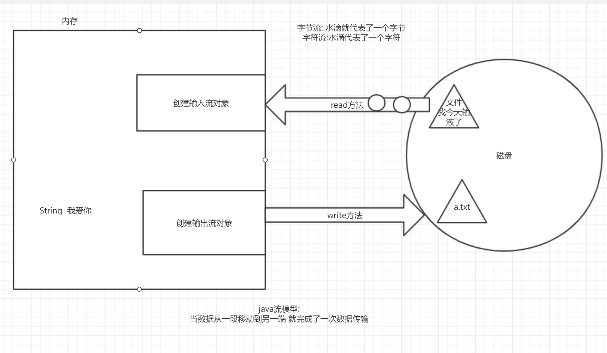
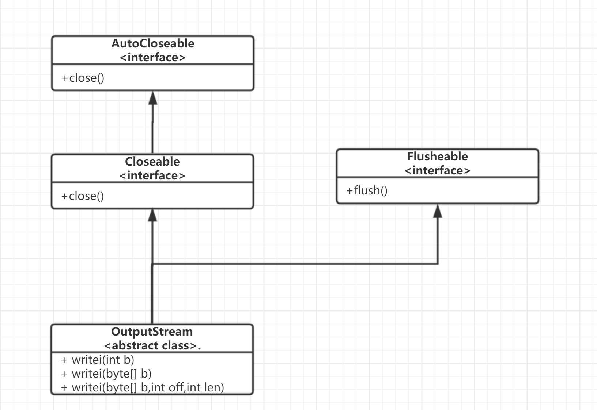
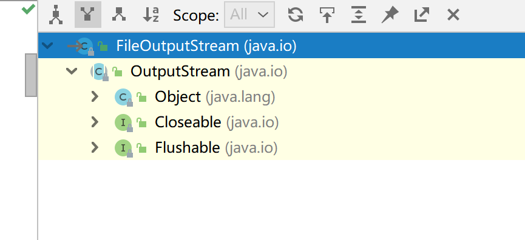

# io概述(掌握)

## **什么是IO**

- i:input 输入
- o:output 输出

## 为什么有io

- 把数据保存到磁盘Output
- 把文件数据读取到内存Input
- 内存有限,就存在io交互

## java中如何实现io功能

- 通过流的方式(Stream)



## io分类

### 按照流向分(以内存为参照)

- 输入流 input 外设→内存
- 输出流 output  内存→外设

### 按照数据类型分

- 字节流  按照一个字节一个字节进行传输 1B=8bit 0000 0000
- 字符流  一连串的字符序列 (一种文化符号 宝, ABC , の)

## 4个基类

- 字节输出流 OutputStream
- 字节输入流 InputStream
- 字符输出流  Writer
- 字符输入流  Reader

由这4个基类派生的子类,都是以其父类名作为后缀的 

FileOutputStream

FileInputStream

## 什么时候该用什么流

文本数据,字符流去处理

非文本数据,字节流去处理 不知道什么类型就用字节流(字节流是万能的)

# 字节流(重点)

## 字节输出流

### 基类

**OutputStream**

此抽象类是表示输出字节流的所有类的超类

继承关系



成员方法

| void           | close()        关闭此输出流并释放与此流有关的所有系统资源。  |
| -------------- | ------------------------------------------------------------ |
| void           | flush()        刷新此输出流并强制写出所有缓冲的输出字节。    |
| void           | write(byte[] b)        将 b.length 个字节从指定的 byte 数组写入此输出流。 |
| void           | write(byte[] b,  int off, int len)       将指定 byte 数组中从偏移量 off 开始的  len 个字节写入此输出流。 |
| abstract  void | write(int b)        将指定的字节写入此输出流。               |

### 具体子类

#### FileOutputStream 

继承关系



构造方法

| FileOutputStream(File file)        创建一个向指定 File 对象表示的文件中写入数据的文件输出流。 |
| ------------------------------------------------------------ |
| FileOutputStream(File file,  boolean append)       创建一个向指定 File  对象表示的文件中写入数据的文件输出流。 |
| FileOutputStream(String name)        创建一个向具有指定名称的文件中写入数据的输出文件流。 |
| FileOutputStream(String name,  boolean append)       创建一个向具有指定 name 的文件中写入数据的输出文件流。 |

demo

```java
package com.cskaoyan.bytestream.out;

import java.io.File;
import java.io.FileOutputStream;
import java.io.IOException;

/**
 * @description:
 * @author: songtao@cskaoyan.onaliyun.com
 **/

public class Demo1 {
    public static void main(String[] args) throws IOException {
        //| FileOutputStream(File file)       
        // 创建一个向指定 File 对象表示的文件中写入数据的文件输出流。
        File file = new File("a.txt");
        FileOutputStream outputStream = new FileOutputStream(file);
        // 传String 文件名
        FileOutputStream outputStream1 = new FileOutputStream("b.txt");
    }
}

```

成员方法:

| void | write(byte[] b)        将 b.length 个字节从指定 byte 数组写入此文件输出流中。 |
| ---- | ------------------------------------------------------------ |
| void | write(byte[] b,  int off, int len)       将指定 byte 数组中从偏移量 off 开始的  len 个字节写入此文件输出流。 |
| void | write(int b)        将指定字节写入此文件输出流。             |

**注意**

**write 的常规协定是：向输出流写入一个字节。要写入的字节是参数 b 的八个低位。b 的 24 个高位将被忽略。 **

怎么写数据

write Demo

```java
package com.cskaoyan.bytestream.out;

import java.io.FileOutputStream;
import java.io.IOException;

/**
 * @description: write方法
 * @author: songtao@cskaoyan.onaliyun.com
 **/

public class Demo2 {
    public static void main(String[] args) throws IOException {
        // 创建字节输出流对象
        FileOutputStream out = new FileOutputStream("a.txt");
        // 写数据 write方法
        // write(int b)
        //out.write(97);

        // write(byte[] b)
        String s= "hello world";
        byte[] bytes = s.getBytes();
        //out.write(bytes);
        // write(byte[] b,int off,int len)
        out.write(bytes, 0, bytes.length);
        // 关闭资源close
        out.close();
    }
}

```


### 注意事项(重要)

- 创建字节输出流对象发生了什么?

  - 创建字节输出流之前,jvm会到操作系统中找文件是否存在
  - 如果不存在,帮我们创建
  - 如果存在,会覆盖掉

- 怎么去实现换行功能?

  - ```java
    package com.cskaoyan.bytestream.out;
    
    import java.io.FileOutputStream;
    import java.io.IOException;
    
    /**
     * @description:
     * @author: songtao@cskaoyan.onaliyun.com
     **/
    
    public class Demo3 {
        public static void main(String[] args) throws IOException {
            // 实现换行功能
            // 第一种 win 的换行符  \r\n 
            // 第二种 系统默认换行符
            // 创建输出流对象
            FileOutputStream out = new FileOutputStream("a.txt");
            // 写点数据
            out.write(97);
    
            // 换行
            //out.write("\r\n".getBytes());
            out.write(System.lineSeparator().getBytes());
            // 写点数据
            out.write(98);
    
            // close
            out.close();
            // a
            // b
            // ab
        }
    }
    
    ```

- 如何实现文件追加?(借助构造方法)

  - append - 如果为 true，则将字节写入文件末尾处，而不是写入文件开始处 

  - ```java
        public static void main(String[] args) throws IOException {
            // 创建可以追加的输出流对象
            FileOutputStream out = new FileOutputStream("a.txt", true);
            // write
            out.write(99);
            // close
            out.close();
        }
    ```

- 为什么要close?

  - io资源是操作系统资源,我们的jvm不能回收,所以只能通过close方法显式的去释放资源
  - 不属于jvm的资源 都要close

- 怎么异常处理

  - 第一种 传统的try catch

  - ```java
    package com.cskaoyan.bytestream.out;
    
    import java.io.FileNotFoundException;
    import java.io.FileOutputStream;
    import java.io.IOException;
    
    /**
     * @description: 异常处理
     * @author: songtao@cskaoyan.onaliyun.com
     **/
    // try-with-resources
    public class Demo5 {
        public static void main(String[] args)  {
            // 创建输出流对象
            FileOutputStream out = null;
            try {
                out = new FileOutputStream("a.txt");
                // 写数据
                out.write("hello".getBytes());
            } catch (FileNotFoundException e) {
                e.printStackTrace();
            } catch (IOException e) {
                e.printStackTrace();
            }finally {
                //close
                try {// 判断是否为null
                    if (out != null) {
                        out.close();
                    }
                } catch (IOException e) {
                    e.printStackTrace();
                }
            }
    
        }
    }
    
    ```

  - 第二种

  - 

## 字节输入流

### 基类

### 具体子类

# 字符流(重点)

# 其他流(了解)

# 总结

