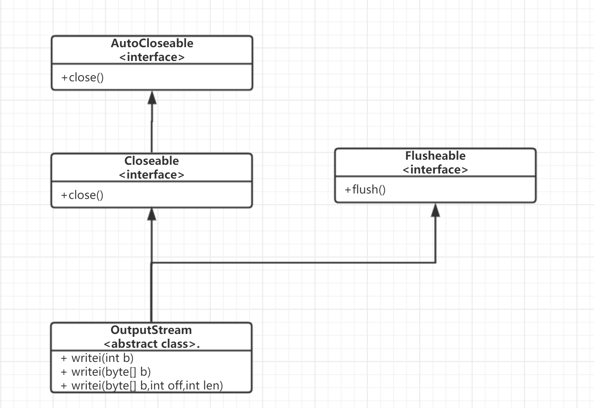
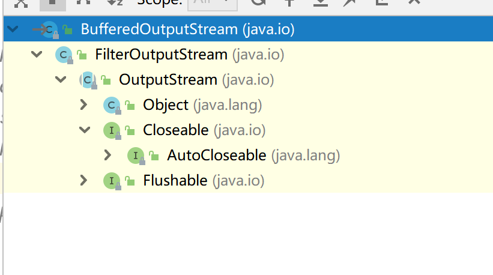
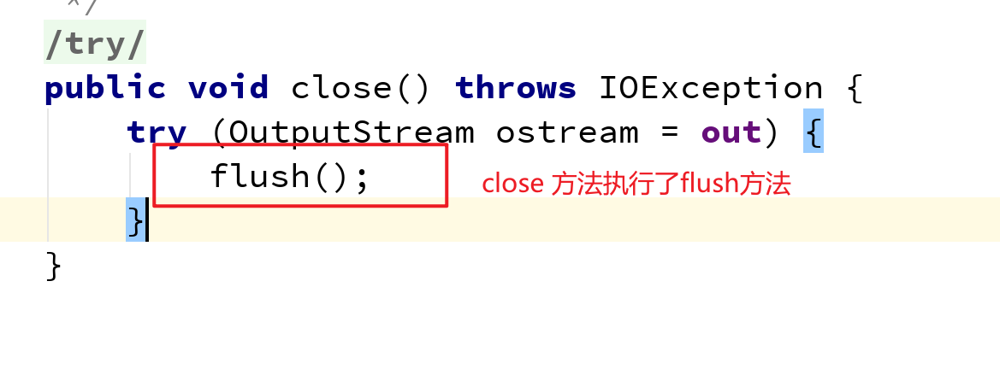
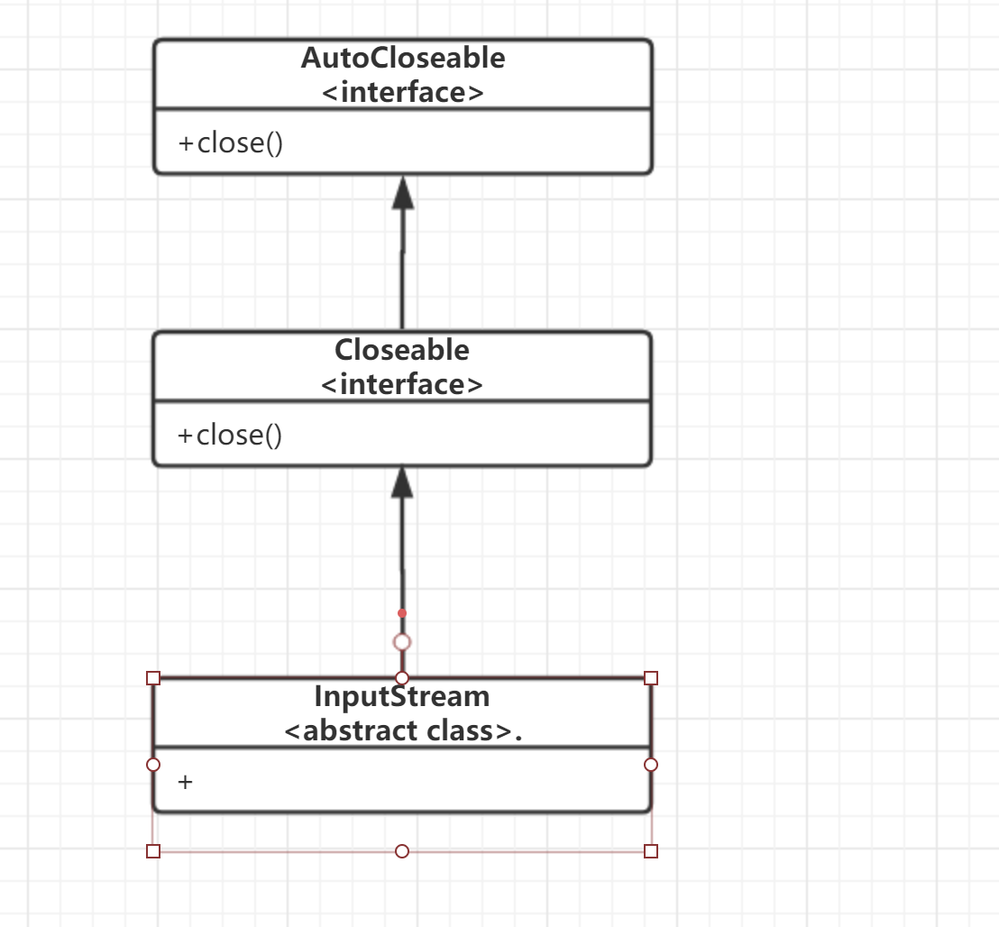
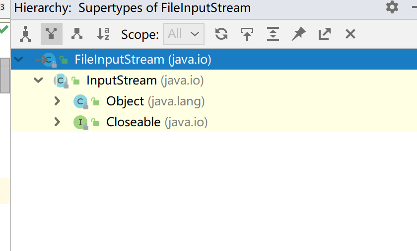
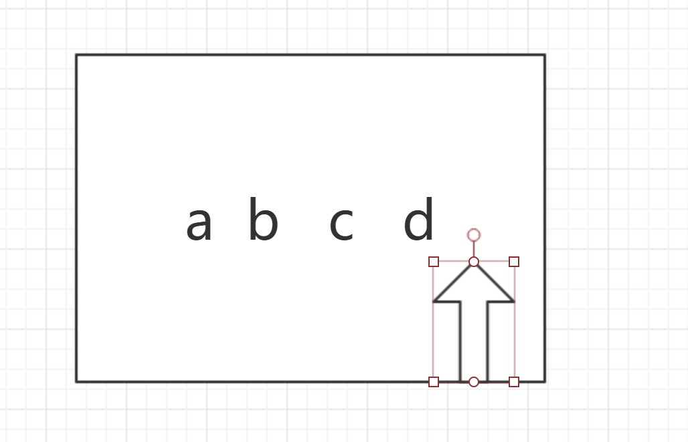
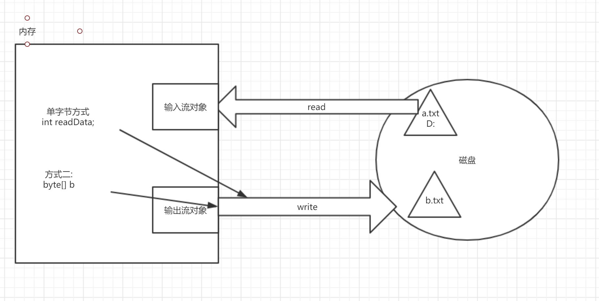

# io概述(掌握)

## **什么是IO**

- i:input 输入
- o:output 输出

## 为什么有io

- 把数据保存到磁盘Output
- 把文件数据读取到内存Input
- 内存有限,就存在io交互

## java中如何实现io功能

- 通过流的方式(Stream)


## io分类

### 按照流向分(以内存为参照)

- 输入流 input 外设→内存
- 输出流 output  内存→外设

### 按照数据类型分

- 字节流  按照一个字节一个字节进行传输 1B=8bit 0000 0000
- 字符流  一连串的字符序列 (一种文化符号 宝, ABC , の)

## 4个基类

- 字节输出流 OutputStream
- 字节输入流 InputStream
- 字符输出流  Writer
- 字符输入流  Reader

由这4个基类派生的子类,都是以其父类名作为后缀的 

FileOutputStream

FileInputStream

## 什么时候该用什么流

文本数据,字符流去处理

非文本数据,字节流去处理 不知道什么类型就用字节流(字节流是万能的)

# 字节流(重点)

## 字节输出流

### 基类

**OutputStream**

此抽象类是表示输出字节流的所有类的超类

继承关系



成员方法

| void           | close()        关闭此输出流并释放与此流有关的所有系统资源。  |
| -------------- | ------------------------------------------------------------ |
| void           | flush()        刷新此输出流并强制写出所有缓冲的输出字节。    |
| void           | write(byte[] b)        将 b.length 个字节从指定的 byte 数组写入此输出流。 |
| void           | write(byte[] b,  int off, int len)       将指定 byte 数组中从偏移量 off 开始的  len 个字节写入此输出流。 |
| abstract  void | write(int b)        将指定的字节写入此输出流。               |

### 具体子类

#### FileOutputStream 

继承关系


构造方法

| FileOutputStream(File file)        创建一个向指定 File 对象表示的文件中写入数据的文件输出流。 |
| ------------------------------------------------------------ |
| FileOutputStream(File file,  boolean append)       创建一个向指定 File  对象表示的文件中写入数据的文件输出流。 |
| FileOutputStream(String name)        创建一个向具有指定名称的文件中写入数据的输出文件流。 |
| FileOutputStream(String name,  boolean append)       创建一个向具有指定 name 的文件中写入数据的输出文件流。 |

demo

```java
package com.cskaoyan.bytestream.out;

import java.io.File;
import java.io.FileOutputStream;
import java.io.IOException;

/**
 * @description:
 * @author: songtao@cskaoyan.onaliyun.com
 **/

public class Demo1 {
    public static void main(String[] args) throws IOException {
        //| FileOutputStream(File file)       
        // 创建一个向指定 File 对象表示的文件中写入数据的文件输出流。
        File file = new File("a.txt");
        FileOutputStream outputStream = new FileOutputStream(file);
        // 传String 文件名
        FileOutputStream outputStream1 = new FileOutputStream("b.txt");
    }
}

```

成员方法:

| void | write(byte[] b)        将 b.length 个字节从指定 byte 数组写入此文件输出流中。 |
| ---- | ------------------------------------------------------------ |
| void | write(byte[] b,  int off, int len)       将指定 byte 数组中从偏移量 off 开始的  len 个字节写入此文件输出流。 |
| void | write(int b)        将指定字节写入此文件输出流。             |

**注意**

**write 的常规协定是：向输出流写入一个字节。要写入的字节是参数 b 的八个低位。b 的 24 个高位将被忽略。 **

怎么写数据

write Demo

```java
package com.cskaoyan.bytestream.out;

import java.io.FileOutputStream;
import java.io.IOException;

/**
 * @description: write方法
 * @author: songtao@cskaoyan.onaliyun.com
 **/

public class Demo2 {
    public static void main(String[] args) throws IOException {
        // 创建字节输出流对象
        FileOutputStream out = new FileOutputStream("a.txt");
        // 写数据 write方法
        // write(int b)
        //out.write(97);

        // write(byte[] b)
        String s= "hello world";
        byte[] bytes = s.getBytes();
        //out.write(bytes);
        // write(byte[] b,int off,int len)
        out.write(bytes, 0, bytes.length);
        // 关闭资源close
        out.close();
    }
}

```


### 注意事项(重点)

- 创建字节输出流对象发生了什么?

  - 创建字节输出流之前,jvm会到操作系统中找文件是否存在
  - 如果不存在,帮我们创建
  - 如果存在,会覆盖掉

- 怎么去实现换行功能?

  - ```java
    package com.cskaoyan.bytestream.out;
    
    import java.io.FileOutputStream;
    import java.io.IOException;
    
    /**
     * @description:
     * @author: songtao@cskaoyan.onaliyun.com
     **/
    
    public class Demo3 {
        public static void main(String[] args) throws IOException {
            // 实现换行功能
            // 第一种 win 的换行符  \r\n 
            // 第二种 系统默认换行符
            // 创建输出流对象
            FileOutputStream out = new FileOutputStream("a.txt");
            // 写点数据
            out.write(97);
    
            // 换行
            //out.write("\r\n".getBytes());
            out.write(System.lineSeparator().getBytes());
            // 写点数据
            out.write(98);
    
            // close
            out.close();
            // a
            // b
            // ab
        }
    }
    
    ```

- 如何实现文件追加?(借助构造方法)

  - append - 如果为 true，则将字节写入文件末尾处，而不是写入文件开始处 

  - ```java
        public static void main(String[] args) throws IOException {
            // 创建可以追加的输出流对象
            FileOutputStream out = new FileOutputStream("a.txt", true);
            // write
            out.write(99);
            // close
            out.close();
        }
    ```

- 为什么要close?

  - io资源是操作系统资源,我们的jvm不能回收,所以只能通过close方法显式的去释放资源
  - 不属于jvm的资源 都要close

- 怎么异常处理

  - 第一种 传统的try catch

  - ```java
    package com.cskaoyan.bytestream.out;
    
    import java.io.FileNotFoundException;
    import java.io.FileOutputStream;
    import java.io.IOException;
    
    /**
     * @description: 异常处理
     * @author: songtao@cskaoyan.onaliyun.com
     **/
    // try-with-resources
    public class Demo5 {
        public static void main(String[] args)  {
            // 创建输出流对象
            FileOutputStream out = null;
            try {
                out = new FileOutputStream("a.txt");
                // 写数据
                out.write("hello".getBytes());
            } catch (FileNotFoundException e) {
                e.printStackTrace();
            } catch (IOException e) {
                e.printStackTrace();
            }finally {
                //close
                try {// 判断是否为null
                    if (out != null) {
                        out.close();
                    }
                } catch (IOException e) {
                    e.printStackTrace();
                }
            }
    
        }
    }
    
    ```

  - 第二种  try-with-resourses

  - ```java
    //语法
    try(资源,实现AutoCloseable接口){
        // 代码
    }catch{
        
    }finally{
        
    }
    特点:当try代码块中的代码执行完  会自动close
    ```

  - Demo

  - ```java
    package com.cskaoyan.bytestream.out;
    
    import java.io.FileNotFoundException;
    import java.io.FileOutputStream;
    import java.io.IOException;
    
    /**
     * @description: 异常处理方式二
     * @author: songtao@cskaoyan.onaliyun.com
     **/
    
    public class Demo1 {
        public static void main(String[] args) {
            try(FileOutputStream out = new FileOutputStream("a.txt");){
                // write data
                out.write(97);
                
            } catch (FileNotFoundException e) {
                e.printStackTrace();
            } catch (IOException e) {
                e.printStackTrace();
            }
        }
    }
    
    ```

  - ```java
    package com.cskaoyan.bytestream.out;
    
    /**
     * @description:
     * @author: songtao@cskaoyan.onaliyun.com
     **/
    
    public class Demo2 {
        public static void main(String[] args) {
            try(A a = new A()){
                a.call();
            } catch (Exception e) {
                e.printStackTrace();
            }
        }
    }
    
    // 定义一个类  实现AutoCloseable接口
    class A implements AutoCloseable{
        public void call() {
            System.out.println("执行了call方法");
        }
    
        @Override
        public void close() throws Exception {
            System.out.println("执行了close方法");
        }
    }
    ```


#### 字节缓冲输出流BufferedOutputStream

该类实现缓冲的输出流。通过设置这种输出流，应用程序就可以将各个字节写入底层输出流中，而不必针对每次字节写入调用底层系统

继承关系



构造方法

| BufferedOutputStream(OutputStream out)        创建一个新的缓冲输出流，以将数据写入指定的底层输出流。 默认缓冲区大小为8KB |
| ------------------------------------------------------------ |
| BufferedOutputStream(OutputStream out,  int size)       创建一个新的缓冲输出流，以将具有指定缓冲区大小的数据写入指定的底层输出流。 |

注意:

像这种需要底层流最为参数的叫做包装流,而这个参数叫做底层流

原因是因为需要底层流的功能

demo

```java
package com.cskaoyan.bytestream.buff;

import java.io.BufferedOutputStream;
import java.io.File;
import java.io.FileOutputStream;
import java.io.IOException;

/**
 * @description:
 * @author: songtao@cskaoyan.onaliyun.com
 **/

public class Demo1 {
    public static void main(String[] args) throws IOException {
        // 构造方法
        BufferedOutputStream bo =
                new BufferedOutputStream(new FileOutputStream(new File("a.txt")));
        //
        BufferedOutputStream bufferedOutputStream = 
                new BufferedOutputStream(new FileOutputStream("a.txt"),1024);
    }
}

```

成员方法

3个write方法

write demo

```java
package com.cskaoyan.bytestream.buff;

import java.io.BufferedOutputStream;
import java.io.FileOutputStream;
import java.io.IOException;

/**
 * @description:
 * @author: songtao@cskaoyan.onaliyun.com
 **/

public class Demo2 {
    public static void main(String[] args) throws IOException {
        // 创建缓冲输出流对象
        BufferedOutputStream bo =
                new BufferedOutputStream(new FileOutputStream("a.txt"));
        // write
        bo.write("hello world".getBytes());
        // flush
        //bo.flush();
        bo.close();
    }
}

```



**注意**

- 如果没有执行flush方法  数据会在缓冲区当中 并不会写入底层流当中
- 一定要close  close里面执行了flush方法
- 哪些流需要flush?
  - <font color=red>所有带缓冲区的输出流 都要flush</font>


**装饰器设计模式**(了解)

在原有类的基础上扩展一点新的功能

例子:

抽象基类:Beverage

子类:MilkTea

基础款  加冰  

小料: 加椰果   加珍珠的   布丁


```java
package com.cskaoyan.bytestream.decorate;

/**
 * @description:
 * @author: songtao@cskaoyan.onaliyun.com
 **/

// 定义抽象基类  饮料类
public abstract class Beverage {
    // 该方法表示加小料
    abstract void add();
}

// 定义子类  奶茶类
class MilkTea extends Beverage{

    @Override
    void add() {
        System.out.println("老板,来杯奶茶,加冰!");
    }
}

// 定义一个装饰器类
class Decorate extends Beverage{
    // 定义一个成员变量
    Beverage beverage;

    public void setBeverage(Beverage beverage) {
        this.beverage = beverage;
    }

    @Override
    void add() {
        beverage.add();
    }
}

//定义小料类
class DecorateA extends Decorate{
    @Override
    void add() {
        super.add();
        // 加椰果
        addYg();
    }

    private void addYg() {
        System.out.println("再加点椰果!");
    }
}

class DecorateB extends Decorate{
    @Override
    void add() {
        super.add();
        // 加珍珠
        addZz();
    }

    private void addZz() {
        System.out.println("再加点珍珠!");
    }
}


package com.cskaoyan.bytestream.decorate;

/**
 * @description: 测试类
 * @author: songtao@cskaoyan.onaliyun.com
 **/

public class Demo {
    public static void main(String[] args) {
        // 创建一个基础款的奶茶
        System.out.println("基础款---------");
        MilkTea milkTea = new MilkTea();
        milkTea.add();
        System.out.println("加小料-------");
        DecorateA decorateA = new DecorateA();
        decorateA.setBeverage(milkTea);
        decorateA.add();
        System.out.println("-------------");
        DecorateB decorateB = new DecorateB();
        decorateB.setBeverage(decorateA);
        decorateB.add();
    }
}

```


练习:

包装BufferedInputStream , 扩展功能 , 把大写转换为小写字符   ABC →  abc

怎么做呢?

继承FilterInputStream  重写read方法  read()  ,  read(byte[] b, int off, int len)


```java 
package com.cskaoyan.bytestream.decorate;

import java.io.*;

/**
 * @description: 大写转小写
 * @author: songtao@cskaoyan.onaliyun.com
 **/

public class Demo2 {
    public static void main(String[] args) throws IOException{
        // 包装BufferedInputStream
        BufferedInputStream br = new BufferedInputStream(new FileInputStream("a.txt"));
        LowerCaseInputStream lowerCaseInputStream = new LowerCaseInputStream(br);
        //int readData = lowerCaseInputStream.read();
        //System.out.println(((char) readData));
        //int readData2 = lowerCaseInputStream.read();
        //System.out.println(((char) readData2));

        // 字节数组
        byte[] bytes = new byte[1024];
        int readCount = lowerCaseInputStream.read(bytes, 0, bytes.length);
        System.out.println(new String(bytes,0,readCount));
        // close
        lowerCaseInputStream.close();
    }
}

class LowerCaseInputStream extends FilterInputStream{

    /**
     * Creates a <code>FilterInputStream</code>
     * by assigning the  argument <code>in</code>
     * to the field <code>this.in</code> so as
     * to remember it for later use.
     *
     * @param in the underlying input stream, or <code>null</code> if
     *           this instance is to be created without an underlying stream.
     */
    protected LowerCaseInputStream(InputStream in) {
        super(in);
    }
    // 目标就是改造 重写read方法  把读到的大写 字符 修改成小写的  返回

    //重写read()

    @Override
    public int read() throws IOException {
        int readData = super.read();
        // 大写 → 小写
        //char c = Character.toLowerCase(((char) readData));

        return (readData == -1 ? -1: ((byte) Character.toLowerCase(((char) readData))));
    }

    @Override
    public int read(byte[] b, int off, int len) throws IOException {
        int readCount = super.read(b, off, len);
        // 关键是处理字节数组b
        for (int i = off; i < off + len; i++) {
            b[i] = ((byte) Character.toLowerCase(((char) b[i])));
        }
        return readCount;
    }
}
```


利用缓冲流去实现文件复制

```java
package com.cskaoyan.bytestream.buff;

import java.io.*;

/**
 * @description:
 * @author: songtao@cskaoyan.onaliyun.com
 **/

public class Demo4 {
    public static void main(String[] args) throws IOException {
        // 创建缓冲输入流
        BufferedInputStream br =
                new BufferedInputStream(new FileInputStream("D:\\aa.mp4"));
        // 创建缓冲输出流
        BufferedOutputStream bo =
                new BufferedOutputStream(new FileOutputStream("copy_aa.mp4"));
        // 边读边写
        // 单字节
        long start = System.currentTimeMillis();
        //int readData;
        //while ((readData = br.read()) != -1) {
        //    bo.write(readData);
        //}
        // 字节数组
        int readCount;
        byte[] bytes = new byte[1024];
        while ((readCount = br.read(bytes)) != -1) {
            bo.write(bytes, 0, readCount);
        }
        long end = System.currentTimeMillis();
        System.out.println("耗时" + (end - start) + "ms");

        // close
        bo.close();
        br.close();
    }
}

```


## 字节输入流

### 基类

InputStream

继承关系



成员方法

| abstract  int | read()        从输入流中读取数据的下一个字节。               |
| ------------- | ------------------------------------------------------------ |
| int           | read(byte[] b)        从输入流中读取一定数量的字节，并将其存储在缓冲区数组 b 中。 |
| int           | read(byte[] b,  int off, int len)       将输入流中最多 len 个数据字节读入 byte 数组。 |

注意:

从输入流中读取数据的下一个字节。返回 0 到 255 范围内的 int 字节值。如果因为已经到达流末尾而没有可用的字节，则返回值 -1。在输入数据可用、检测到流末尾或者抛出异常前，此方法一直阻塞。


### 具体子类

#### FileInputStream

继承关系



构造方法:

| FileInputStream(File file)        通过打开一个到实际文件的连接来创建一个 FileInputStream，该文件通过文件系统中的  File 对象 file 指定。 |
| ------------------------------------------------------------ |
| FileInputStream(String name)        通过打开一个到实际文件的连接来创建一个 FileInputStream，该文件通过文件系统中的路径名  name 指定。 |

```java
        // File file
        FileInputStream inputStream = new FileInputStream(new File("a.txt"));
        // String 文件名
        FileInputStream inputStream1 = new FileInputStream("a.txt");
```

成员方法

3个read方法

对于read(byte[] b)  读入缓冲区的字节总数，如果因为已经到达文件末尾而没有更多的数据，则返回 -1。



```java
package com.cskaoyan.bytestream.in;

import java.io.FileInputStream;
import java.io.IOException;

/**
 * @description: read
 * @author: songtao@cskaoyan.onaliyun.com
 **/
/*
    读取数据的步骤
    1.创建字节输入流对象
    2.read方法读取数据
    3.close
 */
public class Demo2 {
    public static void main(String[] args) throws IOException {
        //1.创建字节输入流对象
        FileInputStream in = new FileInputStream("a.txt");
        //2.read方法读取数据
        // 读取单个字节
        // readData 表示的是读取的字节值
        //readSingle(in);
        // 读取多个字节 字节数组
        byte[] bytes = new byte[4];
        int readCount = in.read(bytes);
        System.out.println(readCount);
        System.out.println(new String(bytes,0,readCount));
        // abcd
        int readCount2 = in.read(bytes);
        System.out.println(readCount2);
        System.out.println(new String(bytes,0,readCount2));
        // efcd
        //3.close
        in.close();
    }

    private static void readSingle(FileInputStream in) throws IOException {
        int readData = in.read();
        System.out.println((readData));
        int readData2 = in.read();
        System.out.println((readData2));
        int readData3 = in.read();
        System.out.println((readData3));
        int readData4 = in.read();
        System.out.println((readData4));
        int readData5 = in.read();
        System.out.println((readData5));
    }
}

```

**循环读取**

```java
package com.cskaoyan.bytestream.in;

import java.io.FileInputStream;
import java.io.IOException;

/**
 * @description: 循环读取
 * @author: songtao@cskaoyan.onaliyun.com
 **/

public class Demo3 {
    public static void main(String[] args) throws IOException {
        // 方式一
        // 创建输入流对象
        // while true 形式去读取
        FileInputStream in = new FileInputStream("a.txt");
        //readWhile1(in);


        // 方式二 推荐
        // 单字节形式
        //readWhile2(in);
        // 多字节
        int readCount; // 表示读取的字节个数
        byte[] bytes = new byte[1024];
        while ((readCount = in.read(bytes)) != -1) {
            System.out.println(new String(bytes,0,readCount));
        }

        //close
        in.close();
    }

    private static void readWhile2(FileInputStream in) throws IOException {
        int readData;
        while ((readData = in.read()) != -1) {
            System.out.println(((char) readData));
        }
    }

    private static void readWhile1(FileInputStream in) throws IOException {
        while (true) {
            int readData = in.read();

            if (readData == -1) {
                break;
            }
            System.out.println(((char) readData));
        }
    }
}

```


#### BufferedInputStream

继承关系


构造方法

| BufferedInputStream(InputStream in)        创建一个 BufferedInputStream 并保存其参数，即输入流  in，以便将来使用。默认缓冲区大小8KB |
| ------------------------------------------------------------ |
| BufferedInputStream(InputStream in,  int size)       创建具有指定缓冲区大小的 BufferedInputStream  并保存其参数，即输入流 in，以便将来使用。 |

成员方法:

3个read方法

demo

```java
package com.cskaoyan.bytestream.buff;

import java.io.BufferedInputStream;
import java.io.FileInputStream;
import java.io.IOException;

/**
 * @description: 缓冲输入流
 * @author: songtao@cskaoyan.onaliyun.com
 **/

public class Demo3 {
    public static void main(String[] args) throws IOException {
        // 创建输入流对象
        BufferedInputStream bi =
                new BufferedInputStream(new FileInputStream("a.txt"));
        // read 读取数据
        //int readData = bi.read();
        //System.out.println(readData);
        byte[] bytes = new byte[1024];
        int readCount = bi.read(bytes);
        System.out.println(new String(bytes,0,readCount));
        // close
        bi.close();
    }
}

```


## 利用字节流实现文件复制

思路:



### 文本文件

```java
package com.cskaoyan.bytestream.ex;

import java.io.FileInputStream;
import java.io.FileOutputStream;
import java.io.IOException;

/**
 * @description: 文件复制
 * @author: songtao@cskaoyan.onaliyun.com
 **/

public class Demo1 {
    public static void main(String[] args) throws IOException {
        // 创建字节输入流对象
        FileInputStream in = new FileInputStream("a.txt");
        // 创建字节输出流对象
        FileOutputStream out = new FileOutputStream("D:\\b.txt");
        // 边读边写
        // 单字节 耗时2ms
        long start = System.currentTimeMillis();
        //copy1(in, out);

        //多字节  耗时0ms
        byte[] bytes = new byte[1024];
        int readCount;
        while ((readCount = in.read(bytes)) != -1) {
            // 写数据
            out.write(bytes,0,readCount);
        }
        long end = System.currentTimeMillis();
        System.out.println("耗时"+(end-start)+"ms");
        // close
        in.close();
        out.close();
    }

    private static void copy1(FileInputStream in, FileOutputStream out) throws IOException {
        int readData;
        while ((readData = in.read()) != -1) {
            // 写数据
            out.write(readData);
        }
    }
}

```


### 图片文件

```java
package com.cskaoyan.bytestream.ex;

import java.io.FileInputStream;
import java.io.FileNotFoundException;
import java.io.FileOutputStream;
import java.io.IOException;

/**
 * @description: 图片文件复制
 * @author: songtao@cskaoyan.onaliyun.com
 **/

public class Demo2 {
    public static void main(String[] args) {
        // 创建输入流对象
        FileInputStream in = null;
        // 创建输出流对象
        FileOutputStream out = null;
        try {
            in = new FileInputStream("D:\\mm.jpg");
            out = new FileOutputStream("copy_mm.jpg");
            // 边读边写
            long start = System.currentTimeMillis();
            // 单字节 耗时127ms

            //copy1(in, out);

            // 多字节
            byte[] bytes = new byte[1024];
            int readCount;
            while ((readCount = in.read(bytes)) != -1) {
                out.write(bytes, 0, readCount);
            }
            long end = System.currentTimeMillis();
            System.out.println("耗时"+(end-start)+"ms");
        } catch (FileNotFoundException e) {
            e.printStackTrace();
        } catch (IOException e) {
            e.printStackTrace();
        }finally {
            // close

            try {
                if (out != null) {
                    out.close();
                }
                if (in != null) {
                    in.close();
                }
            } catch (IOException e) {
                e.printStackTrace();
            }
        }

    }

    private static void copy1(FileInputStream in, FileOutputStream out) throws IOException {
        int readData;
        while ((readData = in.read()) != -1) {
            out.write(readData);
        }
    }
}

```

### 视频复制

```java
package com.cskaoyan.bytestream.ex;

import java.io.FileInputStream;
import java.io.FileNotFoundException;
import java.io.FileOutputStream;
import java.io.IOException;

/**
 * @description: 图片文件复制
 * @author: songtao@cskaoyan.onaliyun.com
 **/

public class Demo3 {
    public static void main(String[] args) {
        // 创建输入流对象
        FileInputStream in = null;
        // 创建输出流对象
        FileOutputStream out = null;
        try {
            in = new FileInputStream("D:\\aa.mp4");
            out = new FileOutputStream("copy_aa.mp4");
            // 边读边写
            long start = System.currentTimeMillis();
            // 单字节 耗时10993msms

            //copy1(in, out);

            // 多字节  耗时22ms
            byte[] bytes = new byte[1024];
            int readCount;
            while ((readCount = in.read(bytes)) != -1) {
                out.write(bytes, 0, readCount);
            }
            long end = System.currentTimeMillis();
            System.out.println("耗时"+(end-start)+"ms");
        } catch (FileNotFoundException e) {
            e.printStackTrace();
        } catch (IOException e) {
            e.printStackTrace();
        }finally {
            // close

            try {
                if (out != null) {
                    out.close();
                }
                if (in != null) {
                    in.close();
                }
            } catch (IOException e) {
                e.printStackTrace();
            }
        }

    }

    private static void copy1(FileInputStream in, FileOutputStream out) throws IOException {
        int readData;
        while ((readData = in.read()) != -1) {
            out.write(readData);
        }
    }
}

```

问题:

为啥单字节 多字节效率上差别这么大?

举例:

我在京东买了5件商品, 我家离快递站有10公里 

按照单字节的方式: 快递小哥一次给我送1个商品  100公里

按照字节数组方式:东哥说了 我们都是兄弟  给每个兄弟配一个五菱  5个商品一下放到车里 只需要1次就能完成配送 20公里.


# 字符流(重点)

## 为什么有字符流

- 用字节流读取英文字符和数字
  - 没有啥问题
- 用字节流读取中文字符
  - 有可能有问题 (不同的编码表,一个字符组成的单位不同)

## 编解码

### 一个字符是如何存储在计算机中的

基于某个编码表 与之对应的编码值(整数值) 存储到计算机中的

### 编码

基于某个编码表,把字符数据转化为编码值存储到计算机中的 ( 把人看懂的东西转为计算机看懂的东西)

### 解码

基于某个编码表 ,把计算机中存储的编码值转为字符数据的过程(把计算机看懂的东西转为人看懂的东西)

### 编码表(了解)

ASCII：美国标准信息交换码。
用一个字节的7位可以表示。0000 0000 - 0111 1111
ISO8859-1：拉丁码表。欧洲码表
用一个字节的8位表示。0000 0000 - 1111 1111

GB2312：中国的中文编码表。2个字节表示一个中文字符
GBK：中国的中文编码表升级，融合了更多的中文文字符号。
GB18030：GBK的取代版本
BIG-5码 ：通行于台湾、香港地区的一个繁体字编码方案，俗称“大五码”。

Unicode：国际标准码，融合了多种文字。(理论 能够融合所有国家的文化符号)

UTF-8：可变长度来表示一个字符。
UTF-8不同，它定义了一种“区间规则”，这种规则可以和ASCII编码保持最大程度的兼容：

它将Unicode编码为00000000-0000007F的字符，用单个字节来表示  0111  1111  =  7F
它将Unicode编码为00000080-000007FF的字符用两个字节表示 
它将Unicode编码为00000800-0000FFFF的字符用3字节表示 

1字节 0xxxxxxx 
2字节 110xxxxx 10xxxxxx 
3字节 1110xxxx 10xxxxxx 10xxxxxx 

utf-16:

jvm使用的编码表，用2个字节来编解码

char : 2 字节

**工作中常用的编码表**

- ASCII
- ISO8859-1
- gbk
- utf-8 3个字节代表一个中文

**默认编码表**

- Win 默认gbk编码
- idea 默认UTF-8

## java中的编解码

```java
package com.cskaoyan.charstream.encode;

import java.io.UnsupportedEncodingException;

/**
 * @description:
 * @author: songtao@cskaoyan.onaliyun.com
 **/

public class Demo2 {
    public static void main(String[] args) throws UnsupportedEncodingException {
        String s = "什么是快乐星球";
        // 编码
        byte[] utfEncode = s.getBytes();

        // 解码
        // String(byte[] bytes)
        // 过使用平台的默认字符集解码指定的 byte 数组，构造一个新的 String。
        //String s1 = new String(utfEncode);
        //System.out.println(s1);
        // String(byte[] bytes, String charsetName)
        //通过使用指定的 charset 解码指定的 byte 数组，构造一个新的 String
        String gbkStr = new String(utfEncode, "Utf-8");
        System.out.println(gbkStr);
    }
}

```

**乱码问题**

- 产生的本质原因 编码与解码的不一致

**解决乱码问题**

- 要么使编码一致
- 要么使解码一致

注意:

操作系统中的ANSI编码其实就是操作系统默认的编码表, win中 GBK

## 字符流的本质(重点)


中文编码表:

你     0x001

日文编码表

の    0x001


## 字符输出流

### 基类

Writer

写入字符流的抽象类

继承关系


成员方法

| void           | write(char[] cbuf)        写入字符数组。                     |
| -------------- | ------------------------------------------------------------ |
| abstract  void | write(char[] cbuf,  int off, int len)       写入字符数组的某一部分。 |
| void           | write(int c)        写入单个字符。                           |
| void           | write(String str)        写入字符串。                        |
| void           | write(String str,  int off, int len)       写入字符串的某一部分。 |

注意:

- write(int c)  写入单个字符。要写入的字符包含在给定整数值的 16 个低位中，16 高位被忽略


### 具体子类

#### 转换流OutputStreamWriter

OutputStreamWriter 是字符流通向字节流的桥梁：可使用指定的 [`charset`](../../java/nio/charset/Charset.html)  将要写入流中的字符编码成字节。它使用的字符集可以由名称指定或显式给定，否则将接受平台默认的字符集。

继承关系


构造方法

| OutputStreamWriter(OutputStream out)        创建使用默认字符编码的 OutputStreamWriter。 |
| ------------------------------------------------------------ |
| OutputStreamWriter(OutputStream out,  String charsetName)        创建使用指定字符集的 OutputStreamWriter。 |

```java
package com.cskaoyan.charstream.transf;

import java.io.FileOutputStream;
import java.io.IOException;
import java.io.OutputStreamWriter;

/**
 * @description:
 * @author: songtao@cskaoyan.onaliyun.com
 **/

public class Demo1 {
    public static void main(String[] args) throws IOException {
        //使用默认字符集
        OutputStreamWriter out =
                new OutputStreamWriter(new FileOutputStream("a.txt"));
        // 使用指定的字符集
        OutputStreamWriter out2 = 
                new OutputStreamWriter(new FileOutputStream("a.txt"), "GBk");
    }
}

```

成员方法

5个write方法

```java
package com.cskaoyan.charstream.transf;

import java.io.FileOutputStream;
import java.io.IOException;
import java.io.OutputStreamWriter;

/**
 * @description:
 * @author: songtao@cskaoyan.onaliyun.com
 **/

public class Demo2 {
    public static void main(String[] args) throws IOException {
        // 5个write方法
        // 创建字符输出流对象
        OutputStreamWriter out = new OutputStreamWriter(new FileOutputStream("a.txt"));
        // 写数据
        String s = "大郎,来喝药";
        // 字符串转字符数组
        //write2(out, s);

        // 特有的 写字符串
        out.write(s,0,s.length());
        // close
        out.close();
    }

    private static void write2(OutputStreamWriter out, String s) throws IOException {
        char[] chars = s.toCharArray();
        //write1(out, chars);
        out.write(chars);
        out.flush();
    }

    private static void write1(OutputStreamWriter out, char[] chars) throws IOException {
        for (int i = 0; i < chars.length; i++) {
            out.write(chars[i]);
        }
    }
}

```


## 字符输入流

### 基类

Reader

用于读取字符流的抽象类

继承关系


成员方法

| int           | read()        读取单个字符。                                 |
| ------------- | ------------------------------------------------------------ |
| int           | read(char[] cbuf)        将字符读入数组。                    |
| abstract  int | read(char[] cbuf,  int off, int len)       将字符读入数组的某一部分。 |

注意:

read() 作为整数读取的字符，范围在 0 到 65535 之间 (0x00-0xffff)，如果已到达流的末尾，则返回 -1 


### 具体子类

#### InputStreamReader

InputStreamReader 是字节流通向字符流的桥梁：它使用指定的 [`charset`](../../java/nio/charset/Charset.html)  读取字节并将其解码为字符。它使用的字符集可以由名称指定或显式给定，或者可以接受平台默认的字符集。 

继承关系


构造方法

| InputStreamReader(InputStream in)        创建一个使用默认字符集的 InputStreamReader。 |
| ------------------------------------------------------------ |
| InputStreamReader(InputStream in, String charsetName)        创建使用指定字符集的 InputStreamReader。 |

成员方法:

3个read方法

| read()  单个字符                                |
| ----------------------------------------------- |
| read(char[] c )   字符数组                      |
| read(char[] c,int off ,int len)  字符数组的部分 |


# 其他流(了解)

# 总结

