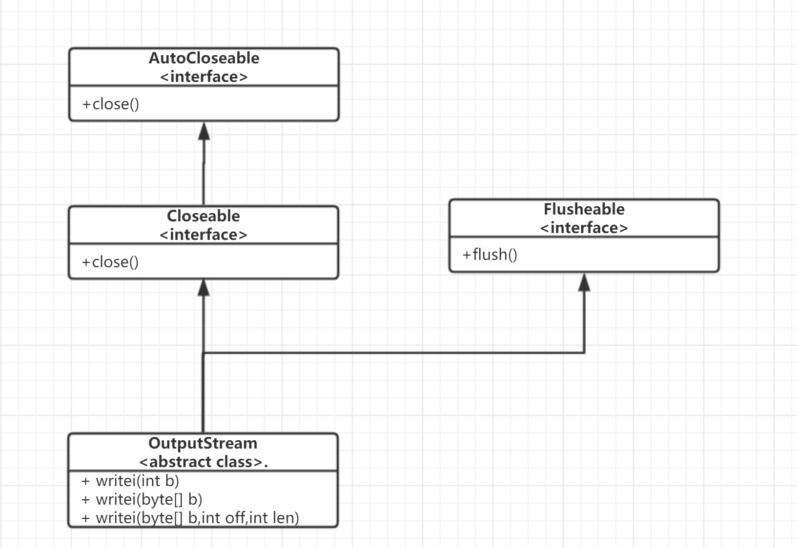
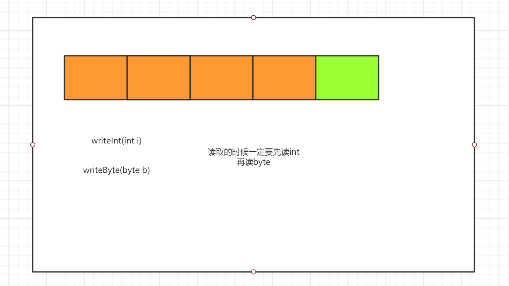

[TOC]


# io概述(掌握)

## **什么是IO**

- i:input 输入
- o:output 输出

## 为什么有io

- 把数据保存到磁盘Output
- 把文件数据读取到内存Input
- 内存有限,就存在io交互

## java中如何实现io功能

- 通过流的方式(Stream)


## io分类

### 按照流向分(以内存为参照)

- 输入流 input 外设→内存
- 输出流 output  内存→外设

### 按照数据类型分

- 字节流  按照一个字节一个字节进行传输 1B=8bit 0000 0000
- 字符流  一连串的字符序列 (一种文化符号 宝, ABC , の)

## 4个基类

- 字节输出流 OutputStream
- 字节输入流 InputStream
- 字符输出流  Writer
- 字符输入流  Reader

由这4个基类派生的子类,都是以其父类名作为后缀的 

FileOutputStream

FileInputStream

## 什么时候该用什么流

文本数据,字符流去处理

非文本数据,字节流去处理 不知道什么类型就用字节流(字节流是万能的)

# 字节流(重点)

## 字节输出流

### 基类

**OutputStream**

此抽象类是表示输出字节流的所有类的超类

继承关系



成员方法

| void           | close()        关闭此输出流并释放与此流有关的所有系统资源。  |
| -------------- | ------------------------------------------------------------ |
| void           | flush()        刷新此输出流并强制写出所有缓冲的输出字节。    |
| void           | write(byte[] b)        将 b.length 个字节从指定的 byte 数组写入此输出流。 |
| void           | write(byte[] b,  int off, int len)       将指定 byte 数组中从偏移量 off 开始的  len 个字节写入此输出流。 |
| abstract  void | write(int b)        将指定的字节写入此输出流。               |

### 具体子类

#### FileOutputStream 

继承关系


构造方法

| FileOutputStream(File file)        创建一个向指定 File 对象表示的文件中写入数据的文件输出流。 |
| ------------------------------------------------------------ |
| FileOutputStream(File file,  boolean append)       创建一个向指定 File  对象表示的文件中写入数据的文件输出流。 |
| FileOutputStream(String name)        创建一个向具有指定名称的文件中写入数据的输出文件流。 |
| FileOutputStream(String name,  boolean append)       创建一个向具有指定 name 的文件中写入数据的输出文件流。 |

demo

```java
package com.cskaoyan.bytestream.out;

import java.io.File;
import java.io.FileOutputStream;
import java.io.IOException;

/**
 * @description:
 * @author: songtao@cskaoyan.onaliyun.com
 **/

public class Demo1 {
    public static void main(String[] args) throws IOException {
        //| FileOutputStream(File file)       
        // 创建一个向指定 File 对象表示的文件中写入数据的文件输出流。
        File file = new File("a.txt");
        FileOutputStream outputStream = new FileOutputStream(file);
        // 传String 文件名
        FileOutputStream outputStream1 = new FileOutputStream("b.txt");
    }
}

```

成员方法:

| void | write(byte[] b)        将 b.length 个字节从指定 byte 数组写入此文件输出流中。 |
| ---- | ------------------------------------------------------------ |
| void | write(byte[] b,  int off, int len)       将指定 byte 数组中从偏移量 off 开始的  len 个字节写入此文件输出流。 |
| void | write(int b)        将指定字节写入此文件输出流。             |

**注意**

**write 的常规协定是：向输出流写入一个字节。要写入的字节是参数 b 的八个低位。b 的 24 个高位将被忽略。 **

怎么写数据

write Demo

```java
package com.cskaoyan.bytestream.out;

import java.io.FileOutputStream;
import java.io.IOException;

/**
 * @description: write方法
 * @author: songtao@cskaoyan.onaliyun.com
 **/

public class Demo2 {
    public static void main(String[] args) throws IOException {
        // 创建字节输出流对象
        FileOutputStream out = new FileOutputStream("a.txt");
        // 写数据 write方法
        // write(int b)
        //out.write(97);

        // write(byte[] b)
        String s= "hello world";
        byte[] bytes = s.getBytes();
        //out.write(bytes);
        // write(byte[] b,int off,int len)
        out.write(bytes, 0, bytes.length);
        // 关闭资源close
        out.close();
    }
}

```


### 注意事项(重点)

- 创建字节输出流对象发生了什么?

  - 创建字节输出流之前,jvm会到操作系统中找文件是否存在
  - 如果不存在,帮我们创建
  - 如果存在,会覆盖掉

- 怎么去实现换行功能?

  - ```java
    package com.cskaoyan.bytestream.out;
    
    import java.io.FileOutputStream;
    import java.io.IOException;
    
    /**
     * @description:
     * @author: songtao@cskaoyan.onaliyun.com
     **/
    
    public class Demo3 {
        public static void main(String[] args) throws IOException {
            // 实现换行功能
            // 第一种 win 的换行符  \r\n 
            // 第二种 系统默认换行符
            // 创建输出流对象
            FileOutputStream out = new FileOutputStream("a.txt");
            // 写点数据
            out.write(97);
    
            // 换行
            //out.write("\r\n".getBytes());
            out.write(System.lineSeparator().getBytes());
            // 写点数据
            out.write(98);
    
            // close
            out.close();
            // a
            // b
            // ab
        }
    }
    
    ```

- 如何实现文件追加?(借助构造方法)

  - append - 如果为 true，则将字节写入文件末尾处，而不是写入文件开始处 

  - ```java
        public static void main(String[] args) throws IOException {
            // 创建可以追加的输出流对象
            FileOutputStream out = new FileOutputStream("a.txt", true);
            // write
            out.write(99);
            // close
            out.close();
        }
    ```

- 为什么要close?

  - io资源是操作系统资源,我们的jvm不能回收,所以只能通过close方法显式的去释放资源
  - 不属于jvm的资源 都要close

- 怎么异常处理

  - 第一种 传统的try catch

  - ```java
    package com.cskaoyan.bytestream.out;
    
    import java.io.FileNotFoundException;
    import java.io.FileOutputStream;
    import java.io.IOException;
    
    /**
     * @description: 异常处理
     * @author: songtao@cskaoyan.onaliyun.com
     **/
    // try-with-resources
    public class Demo5 {
        public static void main(String[] args)  {
            // 创建输出流对象
            FileOutputStream out = null;
            try {
                out = new FileOutputStream("a.txt");
                // 写数据
                out.write("hello".getBytes());
            } catch (FileNotFoundException e) {
                e.printStackTrace();
            } catch (IOException e) {
                e.printStackTrace();
            }finally {
                //close
                try {// 判断是否为null
                    if (out != null) {
                        out.close();
                    }
                } catch (IOException e) {
                    e.printStackTrace();
                }
            }
    
        }
    }
    
    ```

  - 第二种  try-with-resourses

  - ```java
    //语法
    try(资源,实现AutoCloseable接口){
        // 代码
    }catch{
        
    }finally{
        
    }
    特点:当try代码块中的代码执行完  会自动close
    ```

  - Demo

  - ```java
    package com.cskaoyan.bytestream.out;
    
    import java.io.FileNotFoundException;
    import java.io.FileOutputStream;
    import java.io.IOException;
    
    /**
     * @description: 异常处理方式二
     * @author: songtao@cskaoyan.onaliyun.com
     **/
    
    public class Demo1 {
        public static void main(String[] args) {
            try(FileOutputStream out = new FileOutputStream("a.txt");){
                // write data
                out.write(97);
                
            } catch (FileNotFoundException e) {
                e.printStackTrace();
            } catch (IOException e) {
                e.printStackTrace();
            }
        }
    }
    
    ```

  - ```java
    package com.cskaoyan.bytestream.out;
    
    /**
     * @description:
     * @author: songtao@cskaoyan.onaliyun.com
     **/
    
    public class Demo2 {
        public static void main(String[] args) {
            try(A a = new A()){
                a.call();
            } catch (Exception e) {
                e.printStackTrace();
            }
        }
    }
    
    // 定义一个类  实现AutoCloseable接口
    class A implements AutoCloseable{
        public void call() {
            System.out.println("执行了call方法");
        }
    
        @Override
        public void close() throws Exception {
            System.out.println("执行了close方法");
        }
    }
    ```


#### 字节缓冲输出流BufferedOutputStream

该类实现缓冲的输出流。通过设置这种输出流，应用程序就可以将各个字节写入底层输出流中，而不必针对每次字节写入调用底层系统

继承关系


构造方法

| BufferedOutputStream(OutputStream out)        创建一个新的缓冲输出流，以将数据写入指定的底层输出流。 默认缓冲区大小为8KB |
| ------------------------------------------------------------ |
| BufferedOutputStream(OutputStream out,  int size)       创建一个新的缓冲输出流，以将具有指定缓冲区大小的数据写入指定的底层输出流。 |

注意:

像这种需要底层流最为参数的叫做包装流,而这个参数叫做底层流

原因是因为需要底层流的功能

demo

```java
package com.cskaoyan.bytestream.buff;

import java.io.BufferedOutputStream;
import java.io.File;
import java.io.FileOutputStream;
import java.io.IOException;

/**
 * @description:
 * @author: songtao@cskaoyan.onaliyun.com
 **/

public class Demo1 {
    public static void main(String[] args) throws IOException {
        // 构造方法
        BufferedOutputStream bo =
                new BufferedOutputStream(new FileOutputStream(new File("a.txt")));
        //
        BufferedOutputStream bufferedOutputStream = 
                new BufferedOutputStream(new FileOutputStream("a.txt"),1024);
    }
}

```

成员方法

3个write方法

write demo

```java
package com.cskaoyan.bytestream.buff;

import java.io.BufferedOutputStream;
import java.io.FileOutputStream;
import java.io.IOException;

/**
 * @description:
 * @author: songtao@cskaoyan.onaliyun.com
 **/

public class Demo2 {
    public static void main(String[] args) throws IOException {
        // 创建缓冲输出流对象
        BufferedOutputStream bo =
                new BufferedOutputStream(new FileOutputStream("a.txt"));
        // write
        bo.write("hello world".getBytes());
        // flush
        //bo.flush();
        bo.close();
    }
}

```


**注意**

- 如果没有执行flush方法  数据会在缓冲区当中 并不会写入底层流当中
- 一定要close  close里面执行了flush方法
- 哪些流需要flush?
  - <font color=red>所有带缓冲区的输出流 都要flush</font>


**装饰器设计模式**(了解)

在原有类的基础上扩展一点新的功能

例子:

抽象基类:Beverage

子类:MilkTea

基础款  加冰  

小料: 加椰果   加珍珠的   布丁


```java
package com.cskaoyan.bytestream.decorate;

/**
 * @description:
 * @author: songtao@cskaoyan.onaliyun.com
 **/

// 定义抽象基类  饮料类
public abstract class Beverage {
    // 该方法表示加小料
    abstract void add();
}

// 定义子类  奶茶类
class MilkTea extends Beverage{

    @Override
    void add() {
        System.out.println("老板,来杯奶茶,加冰!");
    }
}

// 定义一个装饰器类
class Decorate extends Beverage{
    // 定义一个成员变量
    Beverage beverage;

    public void setBeverage(Beverage beverage) {
        this.beverage = beverage;
    }

    @Override
    void add() {
        beverage.add();
    }
}

//定义小料类
class DecorateA extends Decorate{
    @Override
    void add() {
        super.add();
        // 加椰果
        addYg();
    }

    private void addYg() {
        System.out.println("再加点椰果!");
    }
}

class DecorateB extends Decorate{
    @Override
    void add() {
        super.add();
        // 加珍珠
        addZz();
    }

    private void addZz() {
        System.out.println("再加点珍珠!");
    }
}


package com.cskaoyan.bytestream.decorate;

/**
 * @description: 测试类
 * @author: songtao@cskaoyan.onaliyun.com
 **/

public class Demo {
    public static void main(String[] args) {
        // 创建一个基础款的奶茶
        System.out.println("基础款---------");
        MilkTea milkTea = new MilkTea();
        milkTea.add();
        System.out.println("加小料-------");
        DecorateA decorateA = new DecorateA();
        decorateA.setBeverage(milkTea);
        decorateA.add();
        System.out.println("-------------");
        DecorateB decorateB = new DecorateB();
        decorateB.setBeverage(decorateA);
        decorateB.add();
    }
}

```


练习:

包装BufferedInputStream , 扩展功能 , 把大写转换为小写字符   ABC →  abc

怎么做呢?

继承FilterInputStream  重写read方法  read()  ,  read(byte[] b, int off, int len)


```java 
package com.cskaoyan.bytestream.decorate;

import java.io.*;

/**
 * @description: 大写转小写
 * @author: songtao@cskaoyan.onaliyun.com
 **/

public class Demo2 {
    public static void main(String[] args) throws IOException{
        // 包装BufferedInputStream
        BufferedInputStream br = new BufferedInputStream(new FileInputStream("a.txt"));
        LowerCaseInputStream lowerCaseInputStream = new LowerCaseInputStream(br);
        //int readData = lowerCaseInputStream.read();
        //System.out.println(((char) readData));
        //int readData2 = lowerCaseInputStream.read();
        //System.out.println(((char) readData2));

        // 字节数组
        byte[] bytes = new byte[1024];
        int readCount = lowerCaseInputStream.read(bytes, 0, bytes.length);
        System.out.println(new String(bytes,0,readCount));
        // close
        lowerCaseInputStream.close();
    }
}

class LowerCaseInputStream extends FilterInputStream{

    /**
     * Creates a <code>FilterInputStream</code>
     * by assigning the  argument <code>in</code>
     * to the field <code>this.in</code> so as
     * to remember it for later use.
     *
     * @param in the underlying input stream, or <code>null</code> if
     *           this instance is to be created without an underlying stream.
     */
    protected LowerCaseInputStream(InputStream in) {
        super(in);
    }
    // 目标就是改造 重写read方法  把读到的大写 字符 修改成小写的  返回

    //重写read()

    @Override
    public int read() throws IOException {
        int readData = super.read();
        // 大写 → 小写
        //char c = Character.toLowerCase(((char) readData));

        return (readData == -1 ? -1: ((byte) Character.toLowerCase(((char) readData))));
    }

    @Override
    public int read(byte[] b, int off, int len) throws IOException {
        int readCount = super.read(b, off, len);
        // 关键是处理字节数组b
        for (int i = off; i < off + len; i++) {
            b[i] = ((byte) Character.toLowerCase(((char) b[i])));
        }
        return readCount;
    }
}
```


利用缓冲流去实现文件复制

```java
package com.cskaoyan.bytestream.buff;

import java.io.*;

/**
 * @description:
 * @author: songtao@cskaoyan.onaliyun.com
 **/

public class Demo4 {
    public static void main(String[] args) throws IOException {
        // 创建缓冲输入流
        BufferedInputStream br =
                new BufferedInputStream(new FileInputStream("D:\\aa.mp4"));
        // 创建缓冲输出流
        BufferedOutputStream bo =
                new BufferedOutputStream(new FileOutputStream("copy_aa.mp4"));
        // 边读边写
        // 单字节
        long start = System.currentTimeMillis();
        //int readData;
        //while ((readData = br.read()) != -1) {
        //    bo.write(readData);
        //}
        // 字节数组
        int readCount;
        byte[] bytes = new byte[1024];
        while ((readCount = br.read(bytes)) != -1) {
            bo.write(bytes, 0, readCount);
        }
        long end = System.currentTimeMillis();
        System.out.println("耗时" + (end - start) + "ms");

        // close
        bo.close();
        br.close();
    }
}

```


## 字节输入流

### 基类

InputStream

继承关系


成员方法

| abstract  int | read()        从输入流中读取数据的下一个字节。               |
| ------------- | ------------------------------------------------------------ |
| int           | read(byte[] b)        从输入流中读取一定数量的字节，并将其存储在缓冲区数组 b 中。 |
| int           | read(byte[] b,  int off, int len)       将输入流中最多 len 个数据字节读入 byte 数组。 |

注意:

从输入流中读取数据的下一个字节。返回 0 到 255 范围内的 int 字节值。如果因为已经到达流末尾而没有可用的字节，则返回值 -1。在输入数据可用、检测到流末尾或者抛出异常前，此方法一直阻塞。


### 具体子类

#### FileInputStream

继承关系


构造方法:

| FileInputStream(File file)        通过打开一个到实际文件的连接来创建一个 FileInputStream，该文件通过文件系统中的  File 对象 file 指定。 |
| ------------------------------------------------------------ |
| FileInputStream(String name)        通过打开一个到实际文件的连接来创建一个 FileInputStream，该文件通过文件系统中的路径名  name 指定。 |

```java
        // File file
        FileInputStream inputStream = new FileInputStream(new File("a.txt"));
        // String 文件名
        FileInputStream inputStream1 = new FileInputStream("a.txt");
```

成员方法

3个read方法

对于read(byte[] b)  读入缓冲区的字节总数，如果因为已经到达文件末尾而没有更多的数据，则返回 -1。


```java
package com.cskaoyan.bytestream.in;

import java.io.FileInputStream;
import java.io.IOException;

/**
 * @description: read
 * @author: songtao@cskaoyan.onaliyun.com
 **/
/*
    读取数据的步骤
    1.创建字节输入流对象
    2.read方法读取数据
    3.close
 */
public class Demo2 {
    public static void main(String[] args) throws IOException {
        //1.创建字节输入流对象
        FileInputStream in = new FileInputStream("a.txt");
        //2.read方法读取数据
        // 读取单个字节
        // readData 表示的是读取的字节值
        //readSingle(in);
        // 读取多个字节 字节数组
        byte[] bytes = new byte[4];
        int readCount = in.read(bytes);
        System.out.println(readCount);
        System.out.println(new String(bytes,0,readCount));
        // abcd
        int readCount2 = in.read(bytes);
        System.out.println(readCount2);
        System.out.println(new String(bytes,0,readCount2));
        // efcd
        //3.close
        in.close();
    }

    private static void readSingle(FileInputStream in) throws IOException {
        int readData = in.read();
        System.out.println((readData));
        int readData2 = in.read();
        System.out.println((readData2));
        int readData3 = in.read();
        System.out.println((readData3));
        int readData4 = in.read();
        System.out.println((readData4));
        int readData5 = in.read();
        System.out.println((readData5));
    }
}

```

**循环读取**

```java
package com.cskaoyan.bytestream.in;

import java.io.FileInputStream;
import java.io.IOException;

/**
 * @description: 循环读取
 * @author: songtao@cskaoyan.onaliyun.com
 **/

public class Demo3 {
    public static void main(String[] args) throws IOException {
        // 方式一
        // 创建输入流对象
        // while true 形式去读取
        FileInputStream in = new FileInputStream("a.txt");
        //readWhile1(in);


        // 方式二 推荐
        // 单字节形式
        //readWhile2(in);
        // 多字节
        int readCount; // 表示读取的字节个数
        byte[] bytes = new byte[1024];
        while ((readCount = in.read(bytes)) != -1) {
            System.out.println(new String(bytes,0,readCount));
        }

        //close
        in.close();
    }

    private static void readWhile2(FileInputStream in) throws IOException {
        int readData;
        while ((readData = in.read()) != -1) {
            System.out.println(((char) readData));
        }
    }

    private static void readWhile1(FileInputStream in) throws IOException {
        while (true) {
            int readData = in.read();

            if (readData == -1) {
                break;
            }
            System.out.println(((char) readData));
        }
    }
}

```


#### BufferedInputStream

继承关系


构造方法

| BufferedInputStream(InputStream in)        创建一个 BufferedInputStream 并保存其参数，即输入流  in，以便将来使用。默认缓冲区大小8KB |
| ------------------------------------------------------------ |
| BufferedInputStream(InputStream in,  int size)       创建具有指定缓冲区大小的 BufferedInputStream  并保存其参数，即输入流 in，以便将来使用。 |

成员方法:

3个read方法

demo

```java
package com.cskaoyan.bytestream.buff;

import java.io.BufferedInputStream;
import java.io.FileInputStream;
import java.io.IOException;

/**
 * @description: 缓冲输入流
 * @author: songtao@cskaoyan.onaliyun.com
 **/

public class Demo3 {
    public static void main(String[] args) throws IOException {
        // 创建输入流对象
        BufferedInputStream bi =
                new BufferedInputStream(new FileInputStream("a.txt"));
        // read 读取数据
        //int readData = bi.read();
        //System.out.println(readData);
        byte[] bytes = new byte[1024];
        int readCount = bi.read(bytes);
        System.out.println(new String(bytes,0,readCount));
        // close
        bi.close();
    }
}

```


## 利用字节流实现文件复制

思路:


### 文本文件

```java
package com.cskaoyan.bytestream.ex;

import java.io.FileInputStream;
import java.io.FileOutputStream;
import java.io.IOException;

/**
 * @description: 文件复制
 * @author: songtao@cskaoyan.onaliyun.com
 **/

public class Demo1 {
    public static void main(String[] args) throws IOException {
        // 创建字节输入流对象
        FileInputStream in = new FileInputStream("a.txt");
        // 创建字节输出流对象
        FileOutputStream out = new FileOutputStream("D:\\b.txt");
        // 边读边写
        // 单字节 耗时2ms
        long start = System.currentTimeMillis();
        //copy1(in, out);

        //多字节  耗时0ms
        byte[] bytes = new byte[1024];
        int readCount;
        while ((readCount = in.read(bytes)) != -1) {
            // 写数据
            out.write(bytes,0,readCount);
        }
        long end = System.currentTimeMillis();
        System.out.println("耗时"+(end-start)+"ms");
        // close
        in.close();
        out.close();
    }

    private static void copy1(FileInputStream in, FileOutputStream out) throws IOException {
        int readData;
        while ((readData = in.read()) != -1) {
            // 写数据
            out.write(readData);
        }
    }
}

```


### 图片文件

```java
package com.cskaoyan.bytestream.ex;

import java.io.FileInputStream;
import java.io.FileNotFoundException;
import java.io.FileOutputStream;
import java.io.IOException;

/**
 * @description: 图片文件复制
 * @author: songtao@cskaoyan.onaliyun.com
 **/

public class Demo2 {
    public static void main(String[] args) {
        // 创建输入流对象
        FileInputStream in = null;
        // 创建输出流对象
        FileOutputStream out = null;
        try {
            in = new FileInputStream("D:\\mm.jpg");
            out = new FileOutputStream("copy_mm.jpg");
            // 边读边写
            long start = System.currentTimeMillis();
            // 单字节 耗时127ms

            //copy1(in, out);

            // 多字节
            byte[] bytes = new byte[1024];
            int readCount;
            while ((readCount = in.read(bytes)) != -1) {
                out.write(bytes, 0, readCount);
            }
            long end = System.currentTimeMillis();
            System.out.println("耗时"+(end-start)+"ms");
        } catch (FileNotFoundException e) {
            e.printStackTrace();
        } catch (IOException e) {
            e.printStackTrace();
        }finally {
            // close

            try {
                if (out != null) {
                    out.close();
                }
                if (in != null) {
                    in.close();
                }
            } catch (IOException e) {
                e.printStackTrace();
            }
        }

    }

    private static void copy1(FileInputStream in, FileOutputStream out) throws IOException {
        int readData;
        while ((readData = in.read()) != -1) {
            out.write(readData);
        }
    }
}

```

### 视频复制

```java
package com.cskaoyan.bytestream.ex;

import java.io.FileInputStream;
import java.io.FileNotFoundException;
import java.io.FileOutputStream;
import java.io.IOException;

/**
 * @description: 图片文件复制
 * @author: songtao@cskaoyan.onaliyun.com
 **/

public class Demo3 {
    public static void main(String[] args) {
        // 创建输入流对象
        FileInputStream in = null;
        // 创建输出流对象
        FileOutputStream out = null;
        try {
            in = new FileInputStream("D:\\aa.mp4");
            out = new FileOutputStream("copy_aa.mp4");
            // 边读边写
            long start = System.currentTimeMillis();
            // 单字节 耗时10993msms

            //copy1(in, out);

            // 多字节  耗时22ms
            byte[] bytes = new byte[1024];
            int readCount;
            while ((readCount = in.read(bytes)) != -1) {
                out.write(bytes, 0, readCount);
            }
            long end = System.currentTimeMillis();
            System.out.println("耗时"+(end-start)+"ms");
        } catch (FileNotFoundException e) {
            e.printStackTrace();
        } catch (IOException e) {
            e.printStackTrace();
        }finally {
            // close

            try {
                if (out != null) {
                    out.close();
                }
                if (in != null) {
                    in.close();
                }
            } catch (IOException e) {
                e.printStackTrace();
            }
        }

    }

    private static void copy1(FileInputStream in, FileOutputStream out) throws IOException {
        int readData;
        while ((readData = in.read()) != -1) {
            out.write(readData);
        }
    }
}

```

问题:

为啥单字节 多字节效率上差别这么大?

举例:

我在京东买了5件商品, 我家离快递站有10公里 

按照单字节的方式: 快递小哥一次给我送1个商品  100公里

按照字节数组方式:东哥说了 我们都是兄弟  给每个兄弟配一个五菱  5个商品一下放到车里 只需要1次就能完成配送 20公里.


# 字符流(重点)

## 为什么有字符流

- 用字节流读取英文字符和数字
  - 没有啥问题
- 用字节流读取中文字符
  - 有可能有问题 (不同的编码表,一个字符组成的单位不同)

## 编解码

### 一个字符是如何存储在计算机中的

基于某个编码表 与之对应的编码值(整数值) 存储到计算机中的

### 编码

基于某个编码表,把字符数据转化为编码值存储到计算机中的 ( 把人看懂的东西转为计算机看懂的东西)

### 解码

基于某个编码表 ,把计算机中存储的编码值转为字符数据的过程(把计算机看懂的东西转为人看懂的东西)

### 编码表(了解)

ASCII：美国标准信息交换码。
用一个字节的7位可以表示。0000 0000 - 0111 1111
ISO8859-1：拉丁码表。欧洲码表
用一个字节的8位表示。0000 0000 - 1111 1111

GB2312：中国的中文编码表。2个字节表示一个中文字符
GBK：中国的中文编码表升级，融合了更多的中文文字符号。
GB18030：GBK的取代版本
BIG-5码 ：通行于台湾、香港地区的一个繁体字编码方案，俗称“大五码”。

Unicode：国际标准码，融合了多种文字。(理论 能够融合所有国家的文化符号)

UTF-8：可变长度来表示一个字符。
UTF-8不同，它定义了一种“区间规则”，这种规则可以和ASCII编码保持最大程度的兼容：

它将Unicode编码为00000000-0000007F的字符，用单个字节来表示  0111  1111  =  7F
它将Unicode编码为00000080-000007FF的字符用两个字节表示 
它将Unicode编码为00000800-0000FFFF的字符用3字节表示 

1字节 0xxxxxxx 
2字节 110xxxxx 10xxxxxx 
3字节 1110xxxx 10xxxxxx 10xxxxxx 

utf-16:

jvm使用的编码表，用2个字节来编解码

char : 2 字节

**工作中常用的编码表**

- ASCII
- ISO8859-1
- gbk
- utf-8 3个字节代表一个中文

**默认编码表**

- Win 默认gbk编码
- idea 默认UTF-8

## java中的编解码

```java
package com.cskaoyan.charstream.encode;

import java.io.UnsupportedEncodingException;

/**
 * @description:
 * @author: songtao@cskaoyan.onaliyun.com
 **/

public class Demo2 {
    public static void main(String[] args) throws UnsupportedEncodingException {
        String s = "什么是快乐星球";
        // 编码
        byte[] utfEncode = s.getBytes();

        // 解码
        // String(byte[] bytes)
        // 过使用平台的默认字符集解码指定的 byte 数组，构造一个新的 String。
        //String s1 = new String(utfEncode);
        //System.out.println(s1);
        // String(byte[] bytes, String charsetName)
        //通过使用指定的 charset 解码指定的 byte 数组，构造一个新的 String
        String gbkStr = new String(utfEncode, "Utf-8");
        System.out.println(gbkStr);
    }
}

```

**乱码问题**

- 产生的本质原因 编码与解码的不一致

**解决乱码问题**

- 要么使编码一致
- 要么使解码一致

注意:

操作系统中的ANSI编码其实就是操作系统默认的编码表, win中 GBK

## 字符流的本质(重点)


中文编码表:

你     0x001

日文编码表

の    0x001


## 字符输出流

### 基类

Writer

写入字符流的抽象类

继承关系


成员方法

| void           | write(char[] cbuf)        写入字符数组。                     |
| -------------- | ------------------------------------------------------------ |
| abstract  void | write(char[] cbuf,  int off, int len)       写入字符数组的某一部分。 |
| void           | write(int c)        写入单个字符。                           |
| void           | write(String str)        写入字符串。                        |
| void           | write(String str,  int off, int len)       写入字符串的某一部分。 |

注意:

- write(int c)  写入单个字符。要写入的字符包含在给定整数值的 16 个低位中，16 高位被忽略


### 具体子类

#### 转换流OutputStreamWriter

OutputStreamWriter 是字符流通向字节流的桥梁：可使用指定的 [`charset`](../../java/nio/charset/Charset.html)  将要写入流中的字符编码成字节。它使用的字符集可以由名称指定或显式给定，否则将接受平台默认的字符集。

继承关系


构造方法

| OutputStreamWriter(OutputStream out)        创建使用默认字符编码的 OutputStreamWriter。 |
| ------------------------------------------------------------ |
| OutputStreamWriter(OutputStream out,  String charsetName)        创建使用指定字符集的 OutputStreamWriter。 |

```java
package com.cskaoyan.charstream.transf;

import java.io.FileOutputStream;
import java.io.IOException;
import java.io.OutputStreamWriter;

/**
 * @description:
 * @author: songtao@cskaoyan.onaliyun.com
 **/

public class Demo1 {
    public static void main(String[] args) throws IOException {
        //使用默认字符集
        OutputStreamWriter out =
                new OutputStreamWriter(new FileOutputStream("a.txt"));
        // 使用指定的字符集
        OutputStreamWriter out2 = 
                new OutputStreamWriter(new FileOutputStream("a.txt"), "GBk");
    }
}

```

成员方法

5个write方法

```java
package com.cskaoyan.charstream.transf;

import java.io.FileOutputStream;
import java.io.IOException;
import java.io.OutputStreamWriter;

/**
 * @description:
 * @author: songtao@cskaoyan.onaliyun.com
 **/

public class Demo2 {
    public static void main(String[] args) throws IOException {
        // 5个write方法
        // 创建字符输出流对象
        OutputStreamWriter out = new OutputStreamWriter(new FileOutputStream("a.txt"));
        // 写数据
        String s = "大郎,来喝药";
        // 字符串转字符数组
        //write2(out, s);

        // 特有的 写字符串
        out.write(s,0,s.length());
        // close
        out.close();
    }

    private static void write2(OutputStreamWriter out, String s) throws IOException {
        char[] chars = s.toCharArray();
        //write1(out, chars);
        out.write(chars);
        out.flush();
    }

    private static void write1(OutputStreamWriter out, char[] chars) throws IOException {
        for (int i = 0; i < chars.length; i++) {
            out.write(chars[i]);
        }
    }
}

```


#### 简化流FileWriter

用来写入字符文件的便捷类

继承关系


构造方法:

| FileWriter(File file)        根据给定的 File 对象构造一个 FileWriter 对象。 |
| ------------------------------------------------------------ |
| FileWriter(File file,  boolean append)       根据给定的 File 对象构造一个 FileWriter 对象。 |
| FileWriter(String fileName)        根据给定的文件名构造一个 FileWriter 对象。 |
| FileWriter(String fileName,  boolean append)       根据给定的文件名以及指示是否附加写入数据的 boolean 值来构造  FileWriter 对象。 |

成员方法:

5个write方法

```java
package com.cskaoyan.charstream;

import java.io.FileWriter;
import java.io.IOException;

/**
 * @description: 简化流
 * @author: songtao@cskaoyan.onaliyun.com
 **/

public class Demo2 {
    public static void main(String[] args) throws IOException {
        // 直接传文件名
        FileWriter fileWriter = new FileWriter("a.txt");
        // write
        //fileWriter.write("我秃了 也变强了");
        String s = "臭宝,我今天学习了";
        fileWriter.write(s,0,2);
        // flush
        fileWriter.flush();
        //close
        fileWriter.close();
    }
}

```


#### **缓冲流BufferedWriter**

将文本写入字符输出流，缓冲各个字符，从而提供单个字符、数组和字符串的高效写入

继承关系


构造方法

| BufferedWriter(Writer out)        创建一个使用默认大小输出缓冲区的缓冲字符输出流。(默认缓冲区为16KB) |
| ------------------------------------------------------------ |
| BufferedWriter(Writer out,  int sz)       创建一个使用给定大小输出缓冲区的新缓冲字符输出流 |

成员方法:

5个write方法  +  newLine() 写入一个行分隔符。

```java
package com.cskaoyan.charstream;

import java.io.BufferedWriter;
import java.io.FileWriter;
import java.io.IOException;

/**
 * @description: BufferedWriter
 * @author: songtao@cskaoyan.onaliyun.com
 **/

public class Demo5 {
    public static void main(String[] args) throws IOException {
        // 创建输出流对象
        BufferedWriter br = new BufferedWriter(new FileWriter("a.txt"));
        // write
        br.write("哈哈哈哈哈");
        // newLine() 换行
        br.newLine();
        br.write("嘿嘿嘿嘿嘿嘿嘿");
        br.flush();
        br.close();
    }
}

```


## 字符输入流

### 基类

Reader

用于读取字符流的抽象类

继承关系


成员方法

| int           | read()        读取单个字符。                                 |
| ------------- | ------------------------------------------------------------ |
| int           | read(char[] cbuf)        将字符读入数组。                    |
| abstract  int | read(char[] cbuf,  int off, int len)       将字符读入数组的某一部分。 |

注意:

read() 作为整数读取的字符，范围在 0 到 65535 之间 (0x00-0xffff)，如果已到达流的末尾，则返回 -1 


### 具体子类

#### InputStreamReader

InputStreamReader 是字节流通向字符流的桥梁：它使用指定的 [`charset`](../../java/nio/charset/Charset.html)  读取字节并将其解码为字符。它使用的字符集可以由名称指定或显式给定，或者可以接受平台默认的字符集。 

继承关系


构造方法

| InputStreamReader(InputStream in)        创建一个使用默认字符集的 InputStreamReader。 |
| ------------------------------------------------------------ |
| InputStreamReader(InputStream in, String charsetName)        创建使用指定字符集的 InputStreamReader。 |

成员方法:

3个read方法

| read()  单个字符                                |
| ----------------------------------------------- |
| read(char[] c )   字符数组                      |
| read(char[] c,int off ,int len)  字符数组的部分 |

```java
package com.cskaoyan.charstream;

import java.io.FileInputStream;
import java.io.IOException;
import java.io.InputStreamReader;

/**
 * @description:
 * @author: songtao@cskaoyan.onaliyun.com
 **/

public class Demo1 {
    public static void main(String[] args) throws IOException {
        // 创建一个输入流对象
        InputStreamReader in =
                new InputStreamReader(new FileInputStream("a.txt"));
        // read
        //int readData = in.read();
        //System.out.println(((char) readData));
        // 多个字符
        char[] chars = new char[1024];
        // 表示读取到的字符的个数
        int readCount;
        while ((readCount = in.read(chars)) != -1) {
            System.out.println(new String(chars,0,readCount));
        }
        // close
        in.close();
    }
}

```

#### 简化流FileReader

用来读取字符文件的便捷类

继承关系


构造方法:

| FileReader(File file)        在给定从中读取数据的 File 的情况下创建一个新 FileReader。 |
| ------------------------------------------------------------ |
| FileReader(String fileName)        在给定从中读取数据的文件名的情况下创建一个新 FileReader |

成员方法:

3个read方法:

```java
package com.cskaoyan.charstream;

import java.io.FileReader;
import java.io.IOException;

/**
 * @description:
 * @author: songtao@cskaoyan.onaliyun.com
 **/

public class Demo3 {
    public static void main(String[] args) throws IOException {
        // 创建FileReader对象
        FileReader reader = new FileReader("a.txt");
        // read
        //int readData = reader.read();
        //System.out.println(((char) readData));
        // 多个字符
        char[] chars = new char[1024];
        int readCount = reader.read(chars);
        System.out.println(new String(chars,0,readCount));
        // close
        reader.close();

    }
}

```

#### 转换流 VS 简化流

- 使用角度上看 简化流比转化流更方便
- 继承关系上看,简化流是转化流的直接子类
- 编解码角度上看,简化流不能指定编解码,只能使用默认的编解码,对于转化流来讲 可以指定编解码(最重要的区别)

```java
package com.cskaoyan.charstream;

import java.io.FileInputStream;
import java.io.FileReader;
import java.io.IOException;
import java.io.InputStreamReader;

/**
 * @description:
 * @author: songtao@cskaoyan.onaliyun.com
 **/

public class Demo4 {
    public static void main(String[] args) throws IOException {
        // 简化流读取
        //read1();
        // 转化流读取
        InputStreamReader in =
                new InputStreamReader(
                        new FileInputStream("aa.txt"),"gbk");
        // read
        char[] chars = new char[1024];
        int readCount = in.read(chars);
        System.out.println(new String(chars,0,readCount));
        in.close();
    }

    private static void read1() throws IOException {
        FileReader reader = new FileReader("aa.txt");
        //read
        char[] chars = new char[1024];
        int readCount = reader.read(chars);
        System.out.println(new String(chars,0,readCount));
        // close
        reader.close();
    }
}

```


#### 缓冲流BufferedReader

从字符输入流中读取文本，缓冲各个字符，从而实现字符、数组和行的高效读取

继承关系


构造方法

| BufferedReader(Reader in)        创建一个使用默认大小输入缓冲区的缓冲字符输入流。 |
| ------------------------------------------------------------ |
| BufferedReader(Reader in,  int sz)       创建一个使用指定大小输入缓冲区的缓冲字符输入流。 |

成员方法

3个read方法  +  readLine()

| String | readLine()        读取一个文本行。                           |
| ------ | ------------------------------------------------------------ |
| 注意   | 包含该行内容的字符串，不包含任何行终止符，如果已到达流末尾，则返回 <font color=red>null</font> |

```java
package com.cskaoyan.charstream;

import java.io.BufferedReader;
import java.io.FileReader;
import java.io.IOException;

/**
 * @description: BufferedReader
 * @author: songtao@cskaoyan.onaliyun.com
 **/

public class Demo6 {
    public static void main(String[] args) throws IOException {
        // 创建输入流对象
        BufferedReader br = new BufferedReader(new FileReader("a.txt"));
        // read方法读取数据
        //int readData = br.read();
        //System.out.println(((char) readData));
        // readLine
        //read1(br);
        //循环读
        String line;
        while ((line = br.readLine()) != null) {
            System.out.println(line);
        }
        // close
        br.close();
    }

    private static void read1(BufferedReader br) throws IOException {
        String s = br.readLine();
        System.out.println(s);
    }
}

```

### 用字符流去复制文件

文本文件

```java
package com.cskaoyan.charstream;

import java.io.*;

/**
 * @description: 复制文件
 * @author: songtao@cskaoyan.onaliyun.com
 **/

public class Demo7 {
    public static void main(String[] args) throws IOException {
        // 创建输入流对象
        InputStreamReader inputStreamReader =
                new InputStreamReader(new FileInputStream("a.txt"));
        // 创建输出流对象
        OutputStreamWriter out =
                new OutputStreamWriter(new FileOutputStream("b.txt"));
        // 边读边写
        int readData;
        while ((readData = inputStreamReader.read()) != -1) {
            out.write(readData);
        }
        //close
        inputStreamReader.close();
        out.close();
    }
}

```

非文本文件

```java
package com.cskaoyan.charstream;

import java.io.*;

/**
 * @description: 复制文件
 * @author: songtao@cskaoyan.onaliyun.com
 **/

public class Demo7 {
    public static void main(String[] args) throws IOException {
        // 创建输入流对象
        InputStreamReader inputStreamReader =
                new InputStreamReader(new FileInputStream("a.txt"));
        // 创建输出流对象
        OutputStreamWriter out =
                new OutputStreamWriter(new FileOutputStream("b.txt"));
        // 边读边写
        int readData;
        while ((readData = inputStreamReader.read()) != -1) {
            out.write(readData);
        }
        //close
        inputStreamReader.close();
        out.close();
    }
}

```


# 其他流(了解)

## 数据流

练习:

向文件当中写入1000 , 3.14 看一下能否成功?

```java
不能写入
```


### DataInputStream

数据输入流允许应用程序以与机器无关方式从底层输入流中读取基本 Java 数据类型

构造方法:

DataInputStream(InputStream in)

成员方法:

每一个java基本数据类型都有1个read方法与之对应 比如 读取int   readInt()

```java
package com.cskaoyan.otherstream;

import java.io.DataInputStream;
import java.io.FileInputStream;
import java.io.IOException;

/**
 * @description:
 * @author: songtao@cskaoyan.onaliyun.com
 **/

public class Demo3 {
    public static void main(String[] args) throws IOException {
        // 读取java中的数据类型
        DataInputStream in = new DataInputStream(new FileInputStream("b.txt"));
        // read
        // readInt()
        int i = in.readInt();
        System.out.println(i);
        // readDouble()
        double v = in.readDouble();
        System.out.println(v);
        // readBoolean
        boolean b = in.readBoolean();
        System.out.println(b);
        in.close();
    }
}

```


### DataOutputStream

数据输出流允许应用程序以适当方式将基本 Java 数据类型写入输出流中。然后，应用程序可以使用数据输入流将数据读入。

构造方法

DataOutputStream(OutputStream out)        创建一个新的数据输出流，将数据写入指定基础输出流。

成员方法:

每一种java基本数据类型都有1个write方法与之对应  比如 写入int方法   writeInt(int i)

```java
package com.cskaoyan.otherstream;

import java.io.DataOutputStream;
import java.io.FileOutputStream;
import java.io.IOException;

/**
 * @description:
 * @author: songtao@cskaoyan.onaliyun.com
 **/

public class Demo2 {
    public static void main(String[] args) throws IOException {
        // 创建数据输出流对象
        DataOutputStream out = new DataOutputStream(new FileOutputStream("b.txt"));
        // 用不同的类型的write方法写数据
        // 写1000 writeInt(int v)
        out.writeInt(1000);
        // 写3.14
        out.writeDouble(3.14);
        // true
        out.writeBoolean(true);
        // close
        out.close();
    }
}

```

```java
package com.cskaoyan.otherstream;

import java.io.*;

/**
 * @description:
 * @author: songtao@cskaoyan.onaliyun.com
 **/

public class Demo4 {
    public static void main(String[] args) throws IOException {
        write();
        read();
    }

    private static void read() throws FileNotFoundException, IOException {
        DataInputStream dis = new DataInputStream(
                new FileInputStream("dos.txt"));
        byte b = dis.readByte();
        System.out.println(b);
        short s = dis.readShort();
        System.out.println(s);
        int i = dis.readInt();
        System.out.println(i);
        long l = dis.readLong();
        System.out.println(l);
        float f = dis.readFloat();
        System.out.println(f);
        double d = dis.readDouble();
        System.out.println(d);
        char ch = dis.readChar();
        System.out.println(ch);
        boolean bb = dis.readBoolean();
        System.out.println(bb);
        dis.close();
    }

    private static void write() throws IOException {
        DataOutputStream dos = new DataOutputStream(new FileOutputStream(
                "dos.txt"));
        dos.writeByte(1);
        dos.writeShort(20);
        dos.writeInt(300);
        dos.writeLong(4000);
        dos.writeFloat(12.34f);
        dos.writeDouble(12.56);
        dos.writeChar('a');
        dos.writeBoolean(true);
        dos.close();
    }

}

```

注意:

按照什么样的方式去写  那么就要按照相同的方式去读取



## 打印流

**打印流的核心思想**

把不同的数据类型都转换成了字符串  写的就是字符串

练习:

定义一个类 Printer  

4个方法

 printInt(int i)    写int类型的数据

 printIntLn(int i)  写int类型的数据 在加上换行

printDouble(double d) 写double类型的额数据到文件

printDoubleLn(double d) 写double类型的数据  再换行

```java
package com.cskaoyan.otherstream;

import java.io.FileOutputStream;
import java.io.IOException;
import java.io.OutputStream;

/**
 * @description: print思想
 * @author: songtao@cskaoyan.onaliyun.com
 **/

/*
定义一个类 Printer

4个方法

 printInt(int i)    写int类型的数据

 printIntLn(int i)  写int类型的数据 在加上换行

printDouble(double d) 写double类型的额数据到文件

printDoubleLn(double d) 写double类型的数据  再换行
 */
public class Demo5 {
    public static void main(String[] args) throws IOException{
        Printer printer = new Printer(new FileOutputStream("a.txt"));
        // 写入int 1000
        printer.printIntLn(1000);
        printer.printDouble(3.14);
        // close
        printer.close();
    }
}

class Printer{
    // 定义一个成员变量
    OutputStream outputStream;

    public Printer(OutputStream outputStream) {
        this.outputStream = outputStream;
    }

    // 成员方法
    public void printInt(int a) throws IOException {
        // int  转字符串
        String s = String.valueOf(a);
        // 利用out去写入数据到文件当中
        outputStream.write(s.getBytes());
    }

    public void printIntLn(int a) throws IOException {
        String s = String.valueOf(a);
        outputStream.write(s.getBytes());
        // 再写入一个换行符
        outputStream.write(System.lineSeparator().getBytes());
    }

    public void printDouble(double d) throws IOException {
        // double →  字符串
        String s = String.valueOf(d);
        // write
        outputStream.write(s.getBytes());
    }

    public void printDoubleLn(double d) throws IOException {
        // double →  字符串
        String s = String.valueOf(d);
        // write
        outputStream.write(s.getBytes());
        // 换行符
        outputStream.write(System.lineSeparator().getBytes());
    }
    public void close() throws IOException {
        outputStream.close();
    }


}
```


### 字节打印流PrintStream

`PrintStream` 为其他输出流添加了功能，使它们能够方便地打印各种数据值表示形式

继承关系


构造方法:

| PrintStream(File file)        创建具有指定文件且不带自动行刷新的新打印流。 |
| ------------------------------------------------------------ |
| PrintStream(OutputStream out)        创建新的打印流。        |
| PrintStream(OutputStream out,  boolean autoFlush)            |

PrintStream(String fileName)        创建具有指定文件名称且不带自动行刷新的新打印流。

成员方法:

每个java数据类型都有一个print方法

```java
package com.cskaoyan.otherstream;

import java.io.IOException;
import java.io.PrintStream;

/**
 * @description: PrintStream
 * @author: songtao@cskaoyan.onaliyun.com
 **/

public class Demo6 {
    public static void main(String[] args) throws IOException {
        // 创建字节打印流对象
        PrintStream printStream = new PrintStream("a.txt");
        // 向文件中写数据  利用相应的print方法
        printStream.println(1000);
        // close
        printStream.close();

    }
}

```


### 字符打印流PrintWriter

向文本输出流打印对象的格式化表示形式

继承关系


构造方法

| PrintWriter(File file)        使用指定文件创建不具有自动行刷新的新 PrintWriter。 |
| ------------------------------------------------------------ |
| PrintWriter(OutputStream out)        根据现有的 OutputStream 创建不带自动行刷新的新 PrintWriter。 |
| PrintWriter(OutputStream out,  boolean autoFlush)       通过现有的 OutputStream 创建新的  PrintWriter。 |
| PrintWriter(String fileName)        创建具有指定文件名称且不带自动行刷新的新 PrintWriter。 |
| PrintWriter(Writer out)        创建不带自动行刷新的新 PrintWriter。 |
| PrintWriter(Writer out,  boolean autoFlush)       创建新 PrintWriter。 |

成员方法:

各种print方法

**打印流的4个特点**

- 只能操作目的地,不能操作数据来源
  - 没有相应的输入流与之对应
- 可以操作任意类型的数据
  - 原理就是把不同类型转化为了字符串去处理
- 如果启动了自动刷新功能 就会自动刷新
  - 如果为 true，则 println、printf 或 format 方法将刷新输出缓冲区
  - 为什么能够自动刷新
  - 
  - 
  - 
- 能够操作文件的流
  - 传的参数可以是文件对象 文件名

### 标准输入输出流

**System.out**

- 标准输出流
- 默认的输出设备  显示器
- 本质是一个字节打印流

**System.in**

- 标准输入流
- 默认的输入设备  键盘
- 本质是一个普通的字节输入流

练习:

利用System.in  以及 BufferedReader 模拟  Scanner 当中的nextLine方法

```java
package com.cskaoyan.otherstream;

import java.io.BufferedReader;
import java.io.IOException;
import java.io.InputStreamReader;

/**
 * @description: 模拟scanner
 * @author: songtao@cskaoyan.onaliyun.com
 **/

/*
利用System.in  以及 BufferedReader 模拟  Scanner 当中的nextLine方法
 */
public class Demo9 {
    public static void main(String[] args) throws IOException {
        // 创建一个BufferedReader对象
        // 问题:我们需要一个Reader 字符输入流作为参数
        // 能用的就是System.in  本质是一个普通的字节输入流InputStream
        // 思路:字节流 字符流的桥梁就是转换流
        BufferedReader br =
                new BufferedReader(new InputStreamReader(System.in));
        // 就可以利用readLine方法了
        //read1(br);

        // 可以重复输入   当输入值为"gun" 结束循环
        String line;
        while ((line = br.readLine()) != null) {
            System.out.println(line);
            // 约定1个结束标记 作为结束符
            if (line.equals("gun")) {
                break;
            }
        }

        // close
        br.close();
    }

    private static void read1(BufferedReader br) throws IOException {
        String s = br.readLine();
        System.out.println(s);
    }
}

```


## 对象流(序列化流 反序列化流)

序列化:

把对象数据转为为二进制数据 持久化存储的过程

反序列化:

把二进制数据还原为对象数据的过程

```java
Student s = new Student("zs",20)
```


### 序列化流ObjectOutputStream

ObjectOutputStream 将 Java 对象的基本数据类型和图形写入 OutputStream

继承关系


构造方法:

ObjectOutputStream(OutputStream out)        创建写入指定 OutputStream 的 ObjectOutputStream。

成员方法:

| void | writeObject(Object obj)        将指定的对象写入 ObjectOutputStream。 |
| ---- | ------------------------------------------------------------ |
|      |                                                              |

```java
package com.cskaoyan.otherstream;

import java.io.*;

/**
 * @description: 序列化
 * @author: songtao@cskaoyan.onaliyun.com
 **/

public class Demo10 {
    public static void main(String[] args) throws IOException, ClassNotFoundException {
        // 把学生对象信息写入文件
        serialize();
        // 反序列化
        // 创建一个反序列流对象
        ObjectInputStream in =
                new ObjectInputStream(new FileInputStream("aa.txt"));
        // readObject方法
        Student student = (Student) in.readObject();
        System.out.println(student);
        // close
        in.close();
    }

    private static void serialize() throws IOException {
        // 创建一个学生对象
        Student student = new Student("张三", 20,99);
        // 创建序列化流对象
        ObjectOutputStream out =
                new ObjectOutputStream(new FileOutputStream("aa.txt"));
        // writeObject(Object obj) 写入对象信息
        out.writeObject(student);
        // close
        out.close();
    }
}

class Student implements Serializable {
    // 定义成员变量
    String name;
    int age;
    boolean gender;
    // serialVersionUID  名字要一致
    static final long serialVersionUID = -2898402714175754521l;

    // 添加1个分数
    transient int score;

    public Student(String name, int age, int score) {
        this.name = name;
        this.age = age;
        this.score = score;
    }

    @Override
    public String toString() {
        return "Student{" +
                "name='" + name + '\'' +
                ", age=" + age +
                ", gender=" + gender +
                ", score=" + score +
                '}';
    }
}
```

注意:

- 要想实习序列化功能 必须要实现Serializable接口
- Serializable接口 是一个空接口  起到一个标记的作用
- 如果在Student类中添加1个成员变量 还能否正常读取
  - 要使得2个serialVersionUID保持一致
- 如果类中成员变量信息 不想被序列化  这时候 使用关键字  transient


异常:

- java.io.NotSerializableException   没有实现Serializable接口
- java.io.InvalidClassException: com.cskaoyan.otherstream.Student; local class incompatible: stream classdesc serialVersionUID = -2898402714175754521, local class serialVersionUID = -1896616544424779089     类中的信息发生改变

### 反序列化流ObjectInputStream

ObjectInputStream 对以前使用 ObjectOutputStream 写入的基本数据和对象进行反序列化

继承关系


构造方法

ObjectInputStream(InputStream in)

成员方法:

readObject()


# 总结


| 类型     | 字节输出流           | 字节输入流          | 字符输出流         | 字符输入流        |
| -------- | -------------------- | ------------------- | ------------------ | ----------------- |
| 基类     | OutputStream         | InputStream         | Writer             | Reader            |
| 文件相关 | FileOutputStream     | FileInputStream     | FileWriter         | FileReader        |
| 缓冲流   | BufferedOutputStream | BufferedInputStream | BufferedWriter     | BufferedReader    |
| 转换流   |                      |                     | OutputStreamWriter | InputStreamReader |
| 数据流   | DataOutputStream     | DataInputStream     |                    |                   |
| 打印流   | PrintStream          |                     | PrintWriter        |                   |
| 对象流   | ObjectOutputStream   | ObjectInputStream   |                    |                   |
|          |                      |                     |                    |                   |

