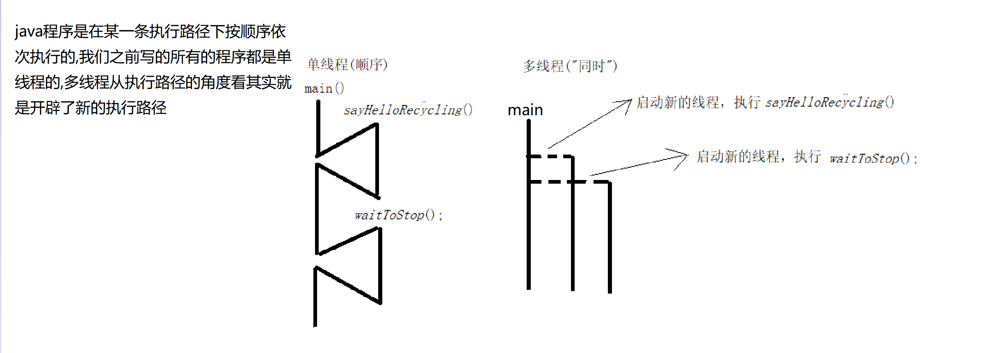
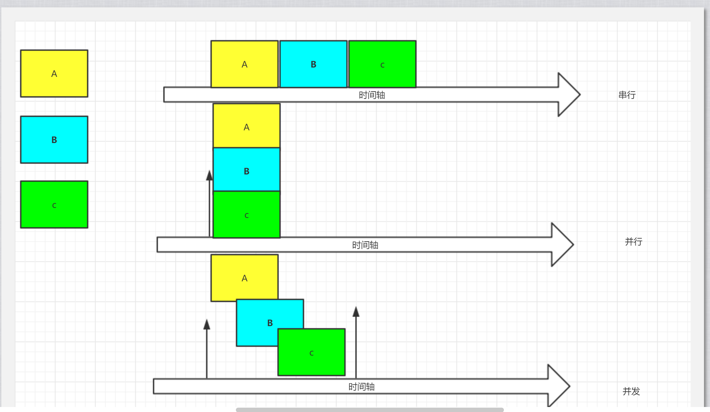
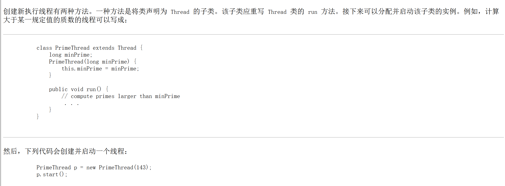
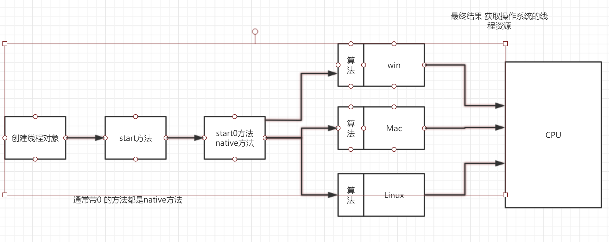
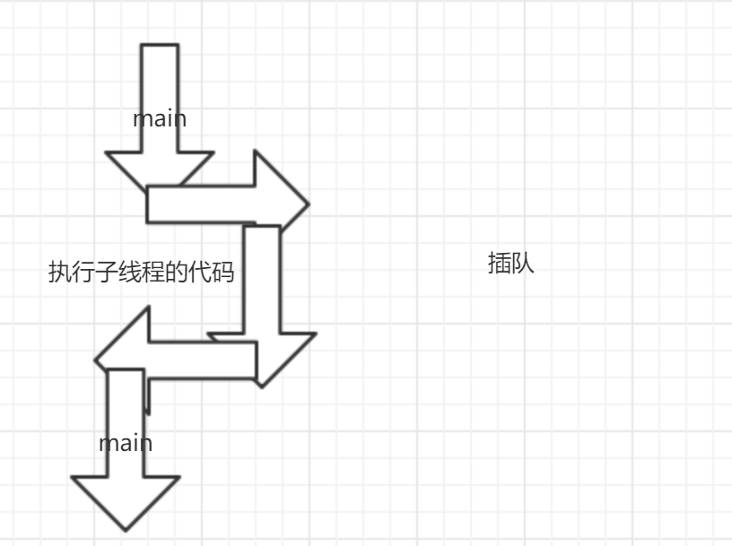

# 操作系统基本概念(掌握)

引入例子

```java
package com.cskaoyan.introduction;

import java.util.Scanner;
import java.util.concurrent.TimeUnit;

/**
 * @description:
 * @author: songtao@cskaoyan.onaliyun.com
 **/

/*
假如我要实现如下功能
程序不停地在屏幕上输出一句问候的语句(比如“你好”)
“同时”，当我通过键盘输入固定输入的时候，程序停止向屏幕输出问候的语句(比如说输入gun)
 */
public class Demo {
    public static boolean flag = true;
    public static void main(String[] args) {
        System.out.println("say hello before");
        sayHelloRecycling();
        System.out.println("say hello after");
        System.out.println("stop before");
        waitToStop();
        System.out.println("stop after");

    }

    private static void waitToStop() {
        // 创建一个Scanner对象
        Scanner scanner = new Scanner(System.in);
        while (flag){
            String s = scanner.nextLine();
            // 判断输入的值是否为gun
            if (s.equals("gun")) {
                flag = false;
                break;
            }
        }
    }

    private static void sayHelloRecycling() {
        while (flag) {
            System.out.println("你好");
            // 让程序暂停几秒
            try {
                TimeUnit.SECONDS.sleep(3);
            } catch (InterruptedException e) {
                e.printStackTrace();
            }
        }
    }
}

```

用多线程修改

```java
package com.cskaoyan.introduction;

import java.util.Scanner;
import java.util.concurrent.TimeUnit;

/**
 * @description:
 * @author: songtao@cskaoyan.onaliyun.com
 **/

/*
假如我要实现如下功能
程序不停地在屏幕上输出一句问候的语句(比如“你好”)
“同时”，当我通过键盘输入固定输入的时候，程序停止向屏幕输出问候的语句(比如说输入gun)
 */
public class Demo2 {
    public static boolean flag = true;
    public static void main(String[] args) {
        System.out.println("say hello before");
        sayHelloRecycling();
        System.out.println("say hello after");
        System.out.println("stop before");
        waitToStop();
        System.out.println("stop after");

    }

    private static void waitToStop() {

        new Thread(){
            @Override
            public void run() {
                Scanner scanner = new Scanner(System.in);
                while (flag){
                    String s = scanner.nextLine();
                    // 判断输入的值是否为gun
                    if (s.equals("gun")) {
                        flag = false;
                        break;
                    }
                }
            }
        }.start();

        // 创建一个Scanner对象

    }

    private static void sayHelloRecycling() {
        new Thread(){
            @Override
            public void run() {
                while (flag) {
                    System.out.println("你好");
                    // 让程序暂停几秒
                    try {
                        TimeUnit.SECONDS.sleep(3);
                    } catch (InterruptedException e) {
                        e.printStackTrace();
                    }
                }
            }
        }.start();


    }
}

```




**进程**

- 计算机程序在某个数据集合上的运行活动,进程是操作系统进行资源调度与分配的基本单位
- 简单理解,正在运行的程序或者软件 


**线程**

- 进程中有多个子任务 , 每一个子任务就是一个线程.从执行路径的角度去看 ,一条新的执行路径就是一个线程
- 线程是CPU进行资源调度与分配的基本单位
- 举例: 迅雷下载电影 下载3个电影  每个下载任务 都是迅雷进程的一个线程


**进程与线程的关系**

- 线程是依赖于进程而存在的
- 一个进程最少有1个线程
- 线程之间共享进程资源


**串行 并行 并发**

- 串行:一个任务接一个任务的按顺序执行
- 并行:在同一个时间点,多个任务同时执行
- 并发:在同一个时间段内,多个任务同时执行



# java程序的运行(掌握)

## java命令运行原理

java命令  + 主类类名

- java命令创建一个jvm进程
- jvm进程会去创建一个线程,叫做主线程   main
- 会去执行main线程里的main方法

## jvm多线程还是单线程的

jvm是多线程的,还有1个垃圾回收线程负责回收垃圾

```java
        while (true) {
            int[] ints = new int[1024];
        }
```


# 多线程的实现方式一:继承Thread(重点)

## 文档示例

*线程* 是程序中的执行线程。Java 虚拟机允许应用程序并发地运行多个执行线程



## 步骤

- 继承Thread类
- 重写run方法
- 创建子类对象
- 通过start方法去启动线程

```java
package com.cskaoyan.implone;

/**
 * @description: 多线程的实现方式一
 * @author: songtao@cskaoyan.onaliyun.com
 **/

/*
- 继承Thread类
- 重写run方法
- 创建子类对象
- 通过start方法去启动线程
 */
public class Demo1 {
    public static void main(String[] args) {
        // 创建子类对象
        MyThread myThread = new MyThread();
        // start启动线程
        myThread.start();
    }
}

// 继承Thread类
class MyThread extends Thread{
    //重写run方法

    @Override
    public void run() {
        // run方法中写我们的代码
        System.out.println("子线程开启了!");
    }
}
```

```java
package com.cskaoyan.implone;

import java.util.concurrent.TimeUnit;

/**
 * @description:
 * @author: songtao@cskaoyan.onaliyun.com
 **/

public class Demo2 {
    public static void main(String[] args) {
        // 创建子类对象
        MyThread2 myThread2 = new MyThread2();
        // start
        myThread2.start();
        // 主线程当中打印10个数
        for (int i = 0; i < 10; i++) {
            System.out.println(i);
            try {
                TimeUnit.SECONDS.sleep(1);
            } catch (InterruptedException e) {
                e.printStackTrace();
            }
        }
        // 1.0-99   0-99
        // 2.交替打印(乱序)
    }
}

// 继承Thread
class MyThread2 extends Thread{
    // 重写run方法

    @Override
    public void run() {
        for (int i = 0; i < 10; i++) {
            System.out.println(i);
            try {
                TimeUnit.SECONDS.sleep(1);
            } catch (InterruptedException e) {
                e.printStackTrace();
            }
        }
    }
}
```

## 注意事项(重点)

- 谁才代表了一个线程?

  - Thread对象或其子类对象才代表一个线程

- 为什么我们的代码要写在run方法当中?

  - 因为在run方法的代码才会运行在子线程当中,我们想要我们的代码运行在子线程中 就必须要把我们的代码写在run方法当中.

- 启动线程我们用的是start方法 为什么不用run方法?

  - ```java
    使用start方法的结果:
    main start
    main end
    0
    1
    2
    3
    4
    5
    6
    7
    8
    9
        
    使用run方法的结果:
    main start
    0
    1
    2
    3
    4
    5
    6
    7
    8
    9
    main end
        
    package com.cskaoyan.implone;
    
    /**
     * @description:
     * @author: songtao@cskaoyan.onaliyun.com
     **/
    
    public class Demo3 {
        public static void main(String[] args) {
            System.out.println("main start");
            MyThread3 myThread3 = new MyThread3();
    
            // start
            myThread3.start();
            myThread3.run();
            System.out.println("main end");
            //  start num  end
            //  start end  num
        }
    }
    
    class MyThread3 extends Thread{
    
        @Override
        public void run() {
            for (int i = 0; i < 10; i++) {
                System.out.println(i);
            }
        }
    }
    ```

  - run方法并不能开启一个线程 , 在这里仅仅是一个普通方法调用  而start方法才会开启线程

- start方法的执行

  - 

- 线程可以多次启动吗?

  - java.lang.IllegalThreadStateException  对于同一个线程对象 多次调用了start方法

- run方法中调用别的方法,调用的这个方法也运行在子线程当中

  - ```java
    package com.cskaoyan.implone;
    
    /**
     * @description:
     * @author: songtao@cskaoyan.onaliyun.com
     **/
    
    public class Demo4 {
        public static void main(String[] args) {
            // 创建线程对象
            MyThread4 myThread4 = new MyThread4();
    
            // start
            myThread4.start();
        }
    }
    
    //继承Thread
    class MyThread4 extends Thread{
        // run
    
        @Override
        public void run() {
            for (int i = 0; i <10; i++) {
                System.out.println(i);
            }
            call();
        }
    
        private void call() {
            System.out.println("执行了call方法!");
        }
    }
    ```

## 获取线程名称

| String | getName()        返回该线程的名称。 |
| ------ | ----------------------------------- |
|        |                                     |

**默认线程名**

Thread-0----------0     Thread就代表了Thread类   第一个0 就代表了线程编号

```java
package com.cskaoyan.implone;

/**
 * @description: 获取线程名称
 * @author: songtao@cskaoyan.onaliyun.com
 **/

public class Demo5 {
    public static void main(String[] args) {
        // 创建子类对象
        MyThread5 t1 = new MyThread5();
        MyThread5 t2 = new MyThread5();
        // start
        t1.start();
        t2.start();
    }
}

// 继承Thread
class MyThread5 extends Thread{
    // run

    @Override
    public void run() {
        for (int i = 0; i < 10; i++) {
            // 获取线程名称
            System.out.println(getName() + "----------" +i);
        }
    }
}
```

**设置线程名称**

| void | setName(String name)        改变线程名称，使之与参数 name 相同。 |
| ---- | ------------------------------------------------------------ |
|      |                                                              |

```java
package com.cskaoyan.implone;

/**
 * @description: 获取线程名称
 * @author: songtao@cskaoyan.onaliyun.com
 **/

public class Demo5 {
    public static void main(String[] args) {
        // 创建子类对象
        MyThread5 t1 = new MyThread5();
        //MyThread5 t2 = new MyThread5();
        // start
        // setName(String name)
        t1.setName("UZI");
        t1.start();
        //t2.start();
    }
}

// 继承Thread
class MyThread5 extends Thread{
    // run

    @Override
    public void run() {
        for (int i = 0; i < 10; i++) {
            // 获取线程名称
            System.out.println(getName() + "----------" +i);
        }
    }
}
```

通过构造方法去设置线程名

Thread(String name)

```java
package com.cskaoyan.implone;

/**
 * @description: 通过Thread构造方法去设置线程名称
 * @author: songtao@cskaoyan.onaliyun.com
 **/

public class Demo6 {
    public static void main(String[] args) {
        // 创建线程对象
        MyThread6 t1 = new MyThread6("风宝");
        // 开启线程
        t1.start();
    }
}

// 继承Thread
class MyThread6 extends Thread{
    public MyThread6(String name) {
        this.setName(name);
    }

    // run

    @Override
    public void run() {
        for (int i = 0; i < 10; i++) {
            // 获取线程名称
            System.out.println(getName() + "----------" +i);
        }
    }
}
```

**如何获取主线程名称**

| static Thread | currentThread()        返回对当前正在执行的线程对象的引用 |
| ------------- | --------------------------------------------------------- |
|               |                                                           |

```java
package com.cskaoyan.implone;

/**
 * @description: 通过Thread构造方法去设置线程名称
 * @author: songtao@cskaoyan.onaliyun.com
 **/

public class Demo6 {
    public static void main(String[] args) {
        // 创建线程对象
        MyThread6 t1 = new MyThread6("风宝");
        // 开启线程

        t1.start();
        // 如何获取主线程名称
        // static Thread currentThread()
        // 返回对当前正在执行的线程对象的引用
        Thread thread = Thread.currentThread();
        String name = thread.getName();
        System.out.println(name);
    }
}

// 继承Thread
class MyThread6 extends Thread{
    public MyThread6(String name) {
        this.setName(name);
    }

    // run

    @Override
    public void run() {
        for (int i = 0; i < 10; i++) {
            // 获取线程名称
            System.out.println(getName() + "----------" +i);
        }
    }
}
```


# 线程的调度方式(掌握)

## 线程的2种调度方式

**线程调度**

- 线程调度指的是系统为线程分配CPU处理权的一个过程

**协同式线程调度方式**

- 线程的执行时间由线程本身决定,当该线程完成了自己的工作 会向系统报告切换到另一个线程
- 实现方式简单 缺点:线程执行时间不可控

**抢占式线程调度方式**

- 线程执行时间由系统决定,不由线程本身决定
- 线程执行时间可控

**java中采用的是抢占式线程调度方式**

# 线程的优先级(了解)

**操作系统的优先级**

- 静态优先级
- 动态优先级
  - 正在执行的线程 会随着执行时间的延长而降低优先级
  - 正在等待的线程,会随着等待时间的延长而升高优先级
- 静态+动态

**java当中的优先级**

| static int | MAX_PRIORITY        线程可以具有的最高优先级。 10    |
| ---------- | ---------------------------------------------------- |
| static int | MIN_PRIORITY        线程可以具有的最低优先级。     1 |
| static int | NORM_PRIORITY        分配给线程的默认优先级。     5  |

**如何获取 修改线程优先级**

获取

| int  | getPriority()        返回线程的优先级。 |
| ---- | --------------------------------------- |
|      |                                         |

设置

| void | setPriority(int newPriority)        更改线程的优先级。 |
| ---- | ------------------------------------------------------ |
|      |                                                        |

```java
package com.cskaoyan.implone;

/**
 * @description: 线程优先级
 * @author: songtao@cskaoyan.onaliyun.com
 **/

public class Demo7 {
    public static void main(String[] args) {
        // 创建线程对象
        MyThread7 myThread7 = new MyThread7();
        myThread7.setName("吴彦祖");
        // start
        myThread7.start();
        // 获取默认的优先级  5
        //int priority = myThread7.getPriority();
        //System.out.println(priority);
        // 设置优先级
        myThread7.setPriority(Thread.MIN_PRIORITY);
        int minPriority = myThread7.getPriority();
        System.out.println(minPriority);
    }
}

class MyThread7 extends Thread{
    // run

    @Override
    public void run() {
        for (int i = 0; i < 10; i++) {
            System.out.println(getName() + "------ " +i);
        }
    }
}
```

**java中的优先级是否有用?**

java中的优先级没啥用

java中的优先级仅仅是一种建议,改变的只是静态优先级

 java官方： 线程优先级并非完全没有用，我们Thread的优先级，它具有(统计意义,从概率的角度看)，总的来说，高优先级的线程 占用的cpu执行时间多一点，低优先级线程，占用cpu执行时间，短一点

```java
package com.cskaoyan.implone;

/**
 * @description:
 * @author: songtao@cskaoyan.onaliyun.com
 **/

public class Demo8 {
    public static void main(String[] args) {
        // 创建2个线程对象
        MyThread8 t1 = new MyThread8();
        MyThread8 t2 = new MyThread8();
        // 设置名字
        t1.setName("彭于晏");
        t2.setName("送终鸡");
        // 设置优先级
        t1.setPriority(Thread.MAX_PRIORITY);
        t2.setPriority(1);
        // start
        t1.start();
        t2.start();
        // 打印结果?? 彭于晏先打印10个数   宋仲基再打印10个数

    }
}

class MyThread8 extends Thread{
    //run

    @Override
    public void run() {
        for (int i = 0; i < 10; i++) {
            System.out.println(getName() + "------- " + i);
        }
    }
}


彭于晏------- 0
送终鸡------- 0
彭于晏------- 1
送终鸡------- 1
送终鸡------- 2
送终鸡------- 3
彭于晏------- 2
送终鸡------- 4
送终鸡------- 5
送终鸡------- 6
送终鸡------- 7
送终鸡------- 8
送终鸡------- 9
彭于晏------- 3
彭于晏------- 4
彭于晏------- 5
彭于晏------- 6
彭于晏------- 7
彭于晏------- 8
彭于晏------- 9

```


# 线程的控制API(掌握)

## 线程休眠sleep

| static void | sleep(long millis)        在指定的毫秒数内让当前正在执行的线程休眠（暂停执行,阻塞），此操作受到系统计时器和调度程序精度和准确性的影响 |
| ----------- | ------------------------------------------------------------ |
|             |                                                              |

```java
package com.cskaoyan.api;

import java.util.concurrent.TimeUnit;

/**
 * @description: sleep
 * @author: songtao@cskaoyan.onaliyun.com
 **/

public class SleepDemo {
    public static void main(String[] args) {
        // 创建线程对象
        ThreadSleep threadSleep = new ThreadSleep();
        // start
        threadSleep.start();
    }
}

class ThreadSleep extends Thread{
    @Override
    public void run() {
        for (int i = 0; i < 10; i++) {
            System.out.println(getName()+"----"+i);
            // sleep(毫秒)
            try {
                Thread.sleep(2000);
                // 2者等效
                //TimeUnit.SECONDS.sleep(1);
            } catch (InterruptedException e) {
                e.printStackTrace();
            }
        }
    }
}
```


## 线程合并(加入)join

| void | join()        等待该线程终止。 |
| ---- | ------------------------------ |
|      |                                |

**谁等待?**

- 主线程在等待,join这个代码在哪个线程上执行,哪个线程就等待

**等待谁?**

- 等待的子线程,等待的就是调用了join的这个线程


```java
没加join的执行结果:
main start
0
Thread-0-----0
1
Thread-0-----1
2
Thread-0-----2
end main
Thread-0-----3
Thread-0-----4
Thread-0-----5
Thread-0-----6
Thread-0-----7
Thread-0-----8
Thread-0-----9
    
加上join的执行结果:
main start
Thread-0-----0
Thread-0-----1
Thread-0-----2
Thread-0-----3
Thread-0-----4
Thread-0-----5
Thread-0-----6
Thread-0-----7
Thread-0-----8
Thread-0-----9
0
1
2
end main
    
package com.cskaoyan.api;

/**
 * @description: join
 * @author: songtao@cskaoyan.onaliyun.com
 **/

public class JoinDemo {
    public static void main(String[] args) {
        System.out.println("main start");
        // 创建线程对象
        JoinThread joinThread = new JoinThread();

        // start
        joinThread.start();
        // 调用join
        try {
            joinThread.join();
        } catch (InterruptedException e) {
            e.printStackTrace();
        }
        // 主线程中打印3个数
        for (int i = 0; i < 3; i++) {
            System.out.println(i);
            try {
                Thread.sleep(1000);
            } catch (InterruptedException e) {
                e.printStackTrace();
            }
        }
        System.out.println("end main");
    }
}

class JoinThread extends Thread{
    // run

    @Override
    public void run() {
        for (int i = 0; i < 10; i++) {
            System.out.println(getName() + "-----" + i);
            try {
                Thread.sleep(1000);
            } catch (InterruptedException e) {
                e.printStackTrace();
            }
        }
    }
}

```



## 线程礼让yield

| static void | yield()        暂停当前正在执行的线程对象，并执行其他线程。 |
| ----------- | ----------------------------------------------------------- |
|             |                                                             |

需求:启动2个线程 分别打印10个数  要求你打印1个1  我打印1个1 一次类推


```java
package com.cskaoyan.api;

/**
 * @description: 礼让线程
 * @author: songtao@cskaoyan.onaliyun.com
 **/

public class YieldDemo {
    public static void main(String[] args) {
        // 创建线程对象
        YieldThread t1 = new YieldThread();
        YieldThread t2 = new YieldThread();
        t1.setName("A");
        t2.setName("B");
        // start
        t1.start();
        t2.start();
    }
}

class YieldThread extends Thread{
    // run


    @Override
    public void run() {
        for (int i = 0; i < 10; i++) {
            System.out.println(getName()+"-------"+i);
            // 执行yield方法 暂停当前正在执行的线程对象，并执行其他线程。
            Thread.yield();
            // java 种采用的抢占式线程调度方式
            // 虽然线程A放弃了CPU的执行权 但是下一轮的CPU的竞争 A仍然能够参与
        }
    }
}
```


## 守护线程daemon

线程的分类:

- 用户线程
- 守护线程

| void | setDaemon(boolean on)        将该线程标记为守护线程或用户线程。 |
| ---- | ------------------------------------------------------------ |
|      |                                                              |

注意:

- 将该线程标记为守护线程或用户线程。<font color=red>当正在运行的线程都是守护线程时，Java 虚拟机退出。</font> 
- 该方法必须在启动线程前调用。 (要在start前调用)
- java.lang.IllegalThreadStateException   没有在start前调用
- 垃圾回收线程是守护线程

```java
package com.cskaoyan.api;

/**
 * @description: 守护线程
 * @author: songtao@cskaoyan.onaliyun.com
 **/

public class DaemonDemo {
    public static void main(String[] args) {
        // 创建线程对象
        DaemonThread daemonThread = new DaemonThread();
        daemonThread.setName("A");
        // setDaemon(true)
        daemonThread.setDaemon(true);
        daemonThread.start();
        // 主线程中打印3个数

        for (int i = 0; i < 3; i++) {
            System.out.println(i);
            try {
                Thread.sleep(1000);
            } catch (InterruptedException e) {
                e.printStackTrace();
            }
        }
    }
}

class DaemonThread extends Thread{
    // run

    @Override
    public void run() {
        for (int i = 0; i < 10; i++) {
            System.out.println(getName() + "-----" + i);
            try {
                Thread.sleep(1000);
            } catch (InterruptedException e) {
                e.printStackTrace();
            }
        }
    }
}

执行结果:
0
A-----0
1
A-----1
2
A-----2
A-----3
后面的数字并没有打印
```


## 中断线程interrupt/stop

# 线程状态转换图(掌握)

# 多线程的实现方式二:实现Runnable接口(重点)

# Thread VS Runnable

# 多线程数据安全问题(重点)

## 产生数据安全问题的原因

# 解决数据安全问题(重点)

## synchronized

### synchronized同步代码块

### 同步方法

### 静态方法

## lock

# 死锁(了解)

## 什么是死锁

## 产生死锁的情况(场景)

## 解决死锁

### 方式一

### 方式二

# 生产者消费者模型(了解)

# 线程间通信(等待唤醒机制)(重点)

wait

notify

# 完整的线程状态转换图(重点)

# 线程工具(掌握)

## 线程池

### 3种线程池

### 多线程的实现方式三:实现Callable接口

## 定时器与定时任务

### 定时器Timer

### 定时任务TimerTask