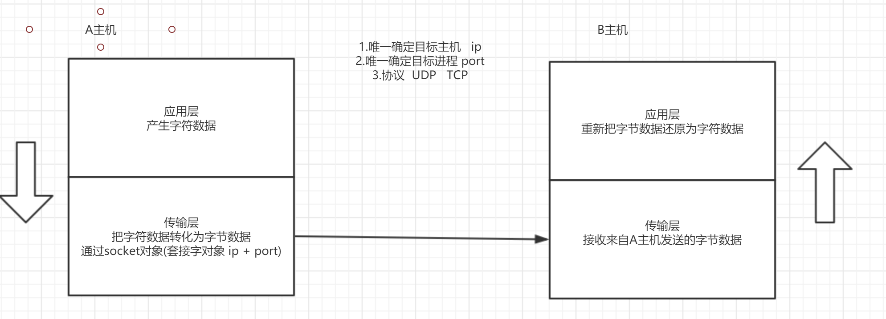
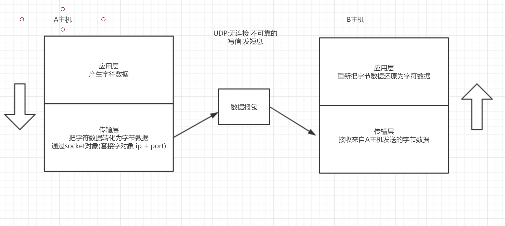
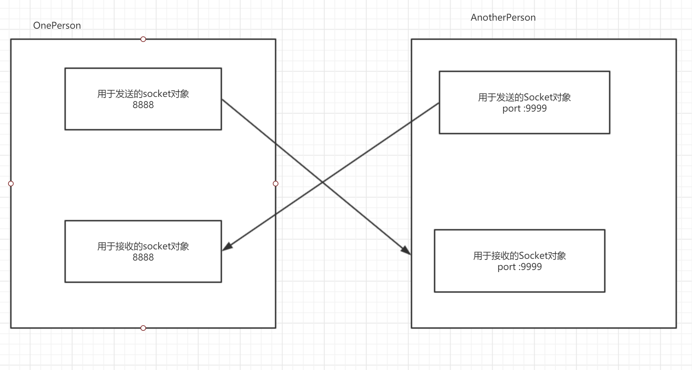
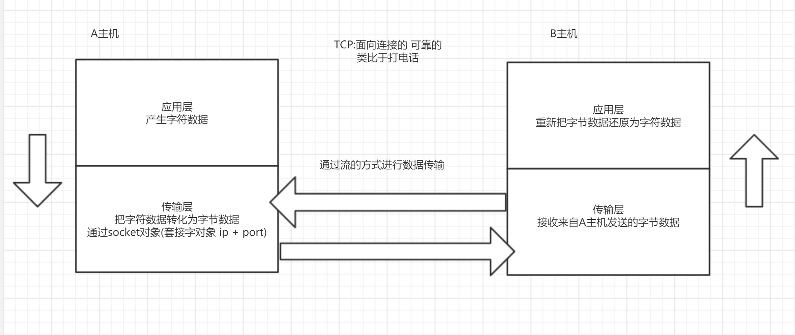
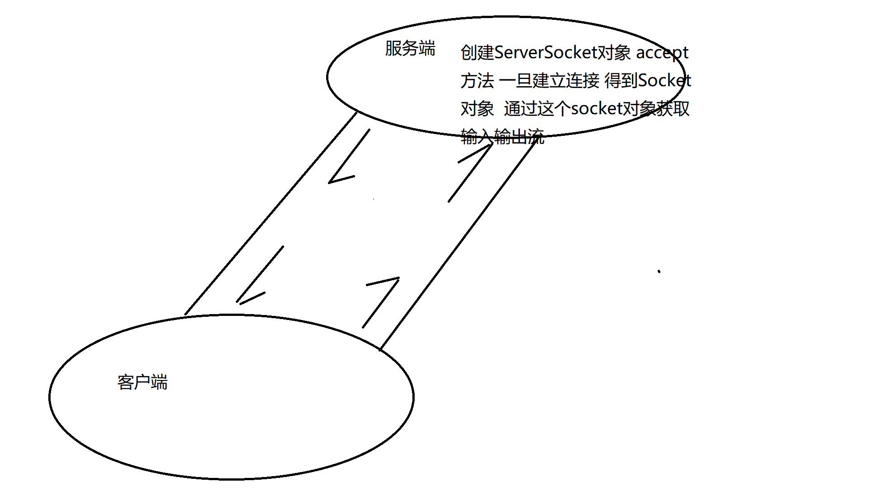
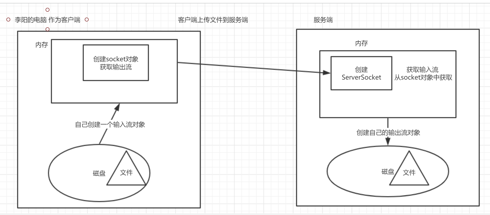

# 原理



# UDP编程



## 发送端步骤

- 创建用于发送端的DUP的socket对象
- 创建用于发送的数据报包
- send方法去发送数据报包
- 关闭资源


## 接收端步骤

- 创建用于接收的UDP的socket对象
- 创建用于接收的数据报包
- receive方法接收数据报包
- 解析数据报包
- 关闭资源

## DatagramSocket

此类表示用来  发送  和 接收  数据报包的套接字。

构造方法

DatagramSocket(int port)        创建数据报套接字并将其绑定到本地主机上的指定端口。

成员方法

| void | receive(DatagramPacket p)        从此套接字接收数据报包。 |
| ---- | --------------------------------------------------------- |
| void | send(DatagramPacket p)        从此套接字发送数据报包。    |

## DatagramPacket

此类表示数据报包

构造方法

| DatagramPacket(byte[] buf,  int offset, int length)       构造  DatagramPacket，用来接收长度为 length  的包，在缓冲区中指定了偏移量。 |
| ------------------------------------------------------------ |
| DatagramPacket(byte[] buf,  int offset, int length, InetAddress address, int port)        构造数据报包，用来将长度为 length 偏移量为 offset  的包发送到指定主机上的指定端口号。 |

成员方法

| byte[] | getData()        返回数据缓冲区。                       |
| ------ | ------------------------------------------------------- |
| int    | getLength()        返回将要发送或接收到的数据的长度。   |
| int    | getOffset()        返回将要发送或接收到的数据的偏移量。 |


## 例子

### v1

```java 
package com.cskaoyan.udp.v1;

import java.io.IOException;
import java.net.DatagramPacket;
import java.net.DatagramSocket;

/**
 * @description: 接收端
 * @author: songtao@cskaoyan.onaliyun.com
 **/

public class Receiver {
    public static void main(String[] args) throws IOException {
        // - 创建用于接收的UDP的socket对象
        DatagramSocket datagramSocket = new DatagramSocket(9999);
        //- 创建用于接收的数据报包
        // DatagramPacket(byte[] buf,  int offset, int length)
        byte[] bytes = new byte[1024];
        DatagramPacket receivePacket = new DatagramPacket(bytes, 0, bytes.length);
        //- receive方法接收数据报包
        System.out.println("receive before");
        datagramSocket.receive(receivePacket);
        System.out.println("receive after");

        //- 解析数据报包
        // 数据在包里面
        byte[] data = receivePacket.getData();
        int offset = receivePacket.getOffset();
        int length = receivePacket.getLength();
        System.out.println(new String(data,offset,length));
        //- 关闭资源
        datagramSocket.close();
    }
}


package com.cskaoyan.udp.v1;

import java.io.IOException;
import java.net.DatagramPacket;
import java.net.DatagramSocket;
import java.net.InetAddress;

/**
 * @description: 发送端
 * @author: songtao@cskaoyan.onaliyun.com
 **/

public class Sender {
    public static void main(String[] args) throws IOException {
        // 来自应用层的数据
        String s = "hello udp";

        // - 创建用于发送端的DUP的socket对象
        DatagramSocket datagramSocket = new DatagramSocket(8888);
        //- 创建用于发送的数据报包
        // DatagramPacket(byte[] buf,  int offset, int length,
        // InetAddress address, int port)
        byte[] bytes = s.getBytes();
        InetAddress targetIp = InetAddress.getByName("127.0.0.1");
        int port = 9999;
        DatagramPacket sendPacket =
                new DatagramPacket(bytes, 0, bytes.length, targetIp, port);
        //- send方法去发送数据报包
        datagramSocket.send(sendPacket);
        //- 关闭资源
        datagramSocket.close();
    }
}

```

v2

```java
package com.cskaoyan.udp.v2;

import com.cskaoyan.util.NetworkUtils;

import java.io.IOException;
import java.net.DatagramPacket;
import java.net.DatagramSocket;

/**
 * @description: 接收端
 * @author: songtao@cskaoyan.onaliyun.com
 **/

public class Receiver {
    public static void main(String[] args) throws IOException {
        // 创建用于接收的socket对象
        DatagramSocket datagramSocket = new DatagramSocket(11111);
        // 创建用于接收的数据报包
        DatagramPacket receivePacket = NetworkUtils.getReceivePacket();
        // receive方法接收
        datagramSocket.receive(receivePacket);
        // 解析
        String msg = NetworkUtils.parsePacket(receivePacket);
        System.out.println(msg);
        // close
        datagramSocket.close();
    }
}


package com.cskaoyan.udp.v2;

import com.cskaoyan.util.NetworkUtils;

import java.io.IOException;
import java.net.DatagramPacket;
import java.net.DatagramSocket;

/**
 * @description: 发送端
 * @author: songtao@cskaoyan.onaliyun.com
 **/

public class Sender {
    public static void main(String[] args) throws IOException {
        // 创建用于发送的socket对象
        DatagramSocket datagramSocket = new DatagramSocket(12306);
        // 创建用于发送的数据报包
        DatagramPacket sendPacket =
                NetworkUtils.getSendPacket("那我走?", "127.0.0.1", 11111);
        // send方法发送包
        datagramSocket.send(sendPacket);
        // close
        datagramSocket.close();
    }
}

```

v4

Sender 发给Receiver  Receiver发给Sender

```java
package com.cskaoyan.udp.v4;

import com.cskaoyan.util.NetworkUtils;

import java.io.IOException;
import java.net.DatagramPacket;
import java.net.DatagramSocket;
import java.net.SocketAddress;
import java.util.Scanner;

/**
 * @description: 接收端
 * @author: songtao@cskaoyan.onaliyun.com
 **/

public class Receiver {
    public static void main(String[] args) throws IOException {
        // 创建用于接收的socket对象
        DatagramSocket datagramSocket = new DatagramSocket(9999);
        // 接盘接收数据
        Scanner scanner = new Scanner(System.in);
        while (true) {
            // 创建用于接收的数据报包
            DatagramPacket receivePacket = NetworkUtils.getReceivePacket();
            // receive
            datagramSocket.receive(receivePacket);
            // 解析数据报包
            String msg = NetworkUtils.parsePacket(receivePacket);
            SocketAddress socketAddress = receivePacket.getSocketAddress();
            System.out.println("Receiver接收到了来自"+socketAddress+"的消息: " + msg);
            // 下面是给Sender发送消息
            // 创建用于发送的数据报包 数据来源就是键盘输入
            String s = scanner.nextLine();
            DatagramPacket sendPacket = NetworkUtils.getSendPacket(s, "127.0.0.1", 8888);
            // send方法发送出去
            datagramSocket.send(sendPacket);
        }

    }
}


package com.cskaoyan.udp.v4;

import com.cskaoyan.util.NetworkUtils;

import java.io.BufferedReader;
import java.io.IOException;
import java.io.InputStreamReader;
import java.net.DatagramPacket;
import java.net.DatagramSocket;
import java.net.SocketAddress;

/**
 * @description: 发送端
 * @author: songtao@cskaoyan.onaliyun.com
 **/

public class Sender {
    public static void main(String[] args) throws IOException {
        // 创建用于发送的socket对象
        DatagramSocket datagramSocket = new DatagramSocket(8888);
        // 键盘接收数据
        BufferedReader br = new BufferedReader(new InputStreamReader(System.in));
        String msg;
        while ((msg = br.readLine()) != null) {

            // 把键盘输入的数据封装到数据报包里面
            DatagramPacket sendPacket = NetworkUtils.getSendPacket(msg, "127.0.0.1", 9999);
            // send方法发送出去
            datagramSocket.send(sendPacket);

            // 以上是发送的接收
            // 下面是接收数据
            // 获取一个用于接收的数据报包
            DatagramPacket receivePacket = NetworkUtils.getReceivePacket();
            // receive方法接收
            // receive方法是一个阻塞方法
            datagramSocket.receive(receivePacket);
            // 解析数据报包
            String s = NetworkUtils.parsePacket(receivePacket);
            // 获取数据 报包的ip地址
            SocketAddress socketAddress = receivePacket.getSocketAddress();
            System.out.println("接收到了来自"+socketAddress+"的消息: " + s);
        }
    }
}

```

v5:

利用多线程去实现聊天

一个线程专门用来发送数据  SendTask

一个线程专门接收数据     ReceiveTask

OnePerson

AnotherPerson



```java 
package com.cskaoyan.udp.v5;

import java.io.IOException;
import java.net.DatagramSocket;

/**
 * @description: 另一个人
 * @author: songtao@cskaoyan.onaliyun.com
 **/

public class AnotherPerson {
    public static void main(String[] args) throws IOException {
        // 创建UDP的socket对象
        DatagramSocket datagramSocket = new DatagramSocket(9999);
        // 创建线程并启动
        new Thread(new SendTask(datagramSocket,"127.0.0.1",8888)).start();
        new Thread(new ReceiveTask(datagramSocket)).start();
    }
}


package com.cskaoyan.udp.v5;

import java.io.IOException;
import java.net.DatagramSocket;

/**
 * @description: 一个人
 * @author: songtao@cskaoyan.onaliyun.com
 **/

public class OnePerson {
    public static void main(String[] args) throws IOException {
        // 创建UDP的socket对象
        DatagramSocket datagramSocket = new DatagramSocket(8888);
        // 创建线程并启动
        new Thread(new SendTask(datagramSocket,"127.0.0.1",9999)).start();
        new Thread(new ReceiveTask(datagramSocket)).start();
    }
}


package com.cskaoyan.udp.v5;

import com.cskaoyan.util.NetworkUtils;

import java.io.IOException;
import java.net.DatagramPacket;
import java.net.DatagramSocket;

/**
 * @description: 接收任务
 * @author: songtao@cskaoyan.onaliyun.com
 **/

public class ReceiveTask implements Runnable{
    // 成员变量
    DatagramSocket datagramSocket;

    public ReceiveTask(DatagramSocket datagramSocket) {
        this.datagramSocket = datagramSocket;
    }

    @Override
    public void run() {
        // 只干一件事情 接收数据 并打印
        while (true) {
            // 创建接收的数据报包
            DatagramPacket receivePacket = NetworkUtils.getReceivePacket();
            // receive方法接收数据
            try {
                datagramSocket.receive(receivePacket);
                // parse数据报包
                String receiveMsg = NetworkUtils.parsePacket(receivePacket);
                System.out.println(receiveMsg);
            } catch (IOException e) {
                e.printStackTrace();
            }
        }
    }
}


package com.cskaoyan.udp.v5;

import com.cskaoyan.util.NetworkUtils;

import java.io.IOException;
import java.net.DatagramPacket;
import java.net.DatagramSocket;
import java.net.UnknownHostException;
import java.util.Scanner;

/**
 * @description: 发送任务
 * @author: songtao@cskaoyan.onaliyun.com
 **/

public class SendTask implements Runnable{
    // 定义成员变量
    DatagramSocket datagramSocket;
    // 目标ip  port
    String ip;
    int port;

    public SendTask(DatagramSocket datagramSocket, String ip, int port) {
        this.datagramSocket = datagramSocket;
        this.ip = ip;
        this.port = port;
    }

    @Override
    public void run() {
        // 只干一件事情  发送消息
        Scanner scanner = new Scanner(System.in);
        while (true) {
            // 从键盘接收数据
            String sendMsg = scanner.nextLine();
            // 创建用于发送的数据报包
            try {
                DatagramPacket sendPacket = NetworkUtils.getSendPacket(sendMsg, ip, port);
                // 发送出去
                datagramSocket.send(sendPacket);
            } catch (UnknownHostException e) {
                e.printStackTrace();
            } catch (IOException e) {
                e.printStackTrace();
            }
        }
    }
}

```


**注意事项**

- 千万记得 先运行接收端  再运行发送端

# TCP编程





## 发送端(Client)

- 创建客户端的socket对象
- 通过socket对象获取输入输出流
- 通过输入 输出流 就可以读取 写入数据
- 关闭资源

## 接收端(Server)

- 创建服务端的socket对象   ServerSocket

- 通过accept方法建立连接 得到一个socket对象

- 获取输入 输出流

- 通过输入 输出流读取 写入数据

  

## Socket

此类实现客户端套接字

构造方法

Socket(String host,  int port)       创建一个流套接字并将其连接到指定主机上的指定端口号。

成员方法

| InputStream | getInputStream()        返回此套接字的输入流。 |
| ----------- | ---------------------------------------------- |
|             |                                                |

| OutputStream | getOutputStream()        返回此套接字的输出流。 |
| ------------ | ----------------------------------------------- |
|              |                                                 |

## ServerSocket

此类实现服务器套接字

构造方法

ServerSocket(int port)        创建绑定到特定端口的服务器套接字

成员方法:

| Socket | accept()        侦听并接受到此套接字的连接。 |
| ------ | -------------------------------------------- |
|        |                                              |

## 例子

v1 客户端发送消息   服务端接收消息

```java
package com.cskaoyan.tcp.v1;

import java.io.IOException;
import java.io.InputStream;
import java.net.InetAddress;
import java.net.ServerSocket;
import java.net.Socket;

/**
 * @description: 服务端
 * @author: songtao@cskaoyan.onaliyun.com
 **/

public class Server {
    public static void main(String[] args) throws IOException {
        // - 创建服务端的socket对象   ServerSocket
        // ServerSocket(int port)
        // 创建绑定到特定端口的服务器套接字
        ServerSocket serverSocket = new ServerSocket(8888);
        //- 通过accept方法建立连接 得到一个socket对象
        Socket client = serverSocket.accept();
        //- 获取输入 输出流
        // 获取客户端发送来的数据
        // getInputStream()
        InputStream in = client.getInputStream();
        //- 通过输入 输出流读取 写入数据
        byte[] bytes = new byte[1024];
        int readCount = in.read(bytes);
        String s = new String(bytes, 0, readCount);
        InetAddress inetAddress = client.getInetAddress();
        System.out.println("接收到了来自"+ inetAddress + "的消息: "+s);
    }
}


package com.cskaoyan.tcp.v1;

import java.io.IOException;
import java.io.OutputStream;
import java.net.Socket;

/**
 * @description: 客户端
 * @author: songtao@cskaoyan.onaliyun.com
 **/

public class Client {
    public static void main(String[] args) throws IOException {
        // - 创建客户端的socket对象
        // Socket(String host,  int port)
        // 创建一个流套接字并将其连接到指定主机上的指定端口号
        Socket socket = new Socket("127.0.0.1", 8888);
        //- 通过socket对象获取输入输出流
        // getOutPutStream
        OutputStream out = socket.getOutputStream();
        //- 通过输入 输出流 就可以读取 写入数据
        out.write("hello tcp".getBytes());
        //- 关闭资源
        socket.close();
    }
}

```


v2

客户端可以多次发送消息  服务端可以多次的接收消息

```java
package com.cskaoyan.tcp.v2;

import java.io.IOException;
import java.io.InputStream;
import java.net.ServerSocket;
import java.net.Socket;

/**
 * @description: 服务端
 * @author: songtao@cskaoyan.onaliyun.com
 **/

public class Server {
    public static void main(String[] args) throws IOException {
        // 创建服务端的socket对象
        ServerSocket serverSocket = new ServerSocket(8888);
        // accept方法 建立连接
        Socket client = serverSocket.accept();
        while (true) {

            // 获取输入流
            InputStream in = client.getInputStream();
            // read 数据
            byte[] bytes = new byte[1024];
            int readCount = in.read(bytes);
            // 打印一下
            System.out.println(new String(bytes,0,readCount));
        }
    }
}


package com.cskaoyan.tcp.v2;

import java.io.IOException;
import java.io.OutputStream;
import java.net.Socket;
import java.util.Scanner;

/**
 * @description: 客户端
 * @author: songtao@cskaoyan.onaliyun.com
 **/

public class Client {
    public static void main(String[] args) throws IOException {
        // 创建客户端的socket对象
        Socket socket = new Socket("127.0.0.1", 8888);
        // 通过键盘输入 Scanner对象
        Scanner scanner = new Scanner(System.in);
        while (true) {
            String msg = scanner.nextLine();
            // 获取输出流
            OutputStream out = socket.getOutputStream();

            // write方法写入数据
            out.write(msg.getBytes());
        }

    }
}

```

v3

在v1的基础上,客户端发送消息,服务端接收到消息并给以反馈

```java
package com.cskaoyan.tcp.v3;

import java.io.IOException;
import java.io.InputStream;
import java.io.OutputStream;
import java.net.InetAddress;
import java.net.ServerSocket;
import java.net.Socket;

/**
 * @description: 服务端
 * @author: songtao@cskaoyan.onaliyun.com
 **/

public class Server {
    public static void main(String[] args) throws IOException {
        // - 创建服务端的socket对象   ServerSocket
        // ServerSocket(int port)
        // 创建绑定到特定端口的服务器套接字
        ServerSocket serverSocket = new ServerSocket(8888);
        //- 通过accept方法建立连接 得到一个socket对象
        Socket client = serverSocket.accept();
        //- 获取输入 输出流
        // 获取客户端发送来的数据
        // getInputStream()
        InputStream in = client.getInputStream();
        //- 通过输入 输出流读取 写入数据
        byte[] bytes = new byte[1024];
        int readCount = in.read(bytes);
        String s = new String(bytes, 0, readCount);
        InetAddress inetAddress = client.getInetAddress();
        System.out.println("接收到了来自"+ inetAddress + "的消息: "+s);
        // 给客户端反馈消息
        // 获取输出流
        OutputStream out = client.getOutputStream();
        out.write("收到了消息".getBytes());
        client.close();
        serverSocket.close();
    }
}


package com.cskaoyan.tcp.v3;

import java.io.IOException;
import java.io.InputStream;
import java.io.OutputStream;
import java.net.Socket;

/**
 * @description: 客户端
 * @author: songtao@cskaoyan.onaliyun.com
 **/

public class Client {
    public static void main(String[] args) throws IOException {
        // - 创建客户端的socket对象
        // Socket(String host,  int port)
        // 创建一个流套接字并将其连接到指定主机上的指定端口号
        Socket socket = new Socket("127.0.0.1", 8888);
        //- 通过socket对象获取输入输出流
        // getOutPutStream
        OutputStream out = socket.getOutputStream();
        //- 通过输入 输出流 就可以读取 写入数据
        out.write("hello tcp".getBytes());

        // 接收来自服务端的反馈消息
        // 获取输入流
        InputStream in = socket.getInputStream();
        // 读取来自服务端的消息反馈
        byte[] bytes = new byte[1024];
        int readCount = in.read(bytes);
        String responseMsg = new String(bytes, 0, readCount);
        System.out.println(responseMsg);
        //- 关闭资源
        socket.close();
    }
}

```

v4

客户端上传文件到服务器



```java
package com.cskaoyan.tcp.v4;

import java.io.FileInputStream;
import java.io.IOException;
import java.io.InputStream;
import java.io.OutputStream;
import java.net.Socket;

/**
 * @description: 李阳的电脑
 * @author: songtao@cskaoyan.onaliyun.com
 **/

public class Client {
    public static void main(String[] args) throws IOException {
        // 创建一个自己的输入流对象 用来读取本地文件
        FileInputStream in = new FileInputStream("D:\\mm.jpg");
        // 创建客户端的socket对象
        Socket socket = new Socket("127.0.0.1", 12306);
        // 获取输出流对象
        OutputStream out = socket.getOutputStream();
        // 边读取边写
        byte[] bytes = new byte[1024];
        int readCount;
        while ((readCount = in.read(bytes)) != -1) {
            out.write(bytes,0,readCount);
        }
        System.out.println("upload done");
        // 结束标记
        socket.shutdownOutput();
        // 接收来自服务端的反馈
        // 获取输入流
        InputStream inputStream = socket.getInputStream();
        byte[] bytes1 = new byte[1024];
        // 读取服务端反馈
        int readCount2 = inputStream.read(bytes1);
        System.out.println(new String(bytes1,0,readCount2));
        // close
        socket.close();
        in.close();
    }
}


package com.cskaoyan.tcp.v4;

import java.io.FileOutputStream;
import java.io.IOException;
import java.io.InputStream;
import java.io.OutputStream;
import java.net.ServerSocket;
import java.net.Socket;

/**
 * @description: 服务端
 * @author: songtao@cskaoyan.onaliyun.com
 **/

public class Server {
    public static void main(String[] args) throws IOException {
        // 创建自己的输出流对象
        FileOutputStream out = new FileOutputStream("copy_mm.jpg");
        // 创建服务端socket对象
        ServerSocket serverSocket = new ServerSocket(12306);
        // accept方法
        Socket client = serverSocket.accept();
        // 获取输入流
        InputStream in = client.getInputStream();
        // 边读边写
        byte[] bytes = new byte[1024];
        int readCount;
        while ((readCount = in.read(bytes)) != -1) {
            out.write(bytes,0,readCount);
        }
        out.close();
        System.out.println("上传成功");
        // 给客户端一个反馈消息
        // 获取输出流
        OutputStream outputStream = client.getOutputStream();
        outputStream.write("successful!".getBytes());

    }
}

```


shutdownOutput()        禁用此套接字的输出流。

异常

- java.net.ConnectException: Connection refused: connect    先运行了客户端


