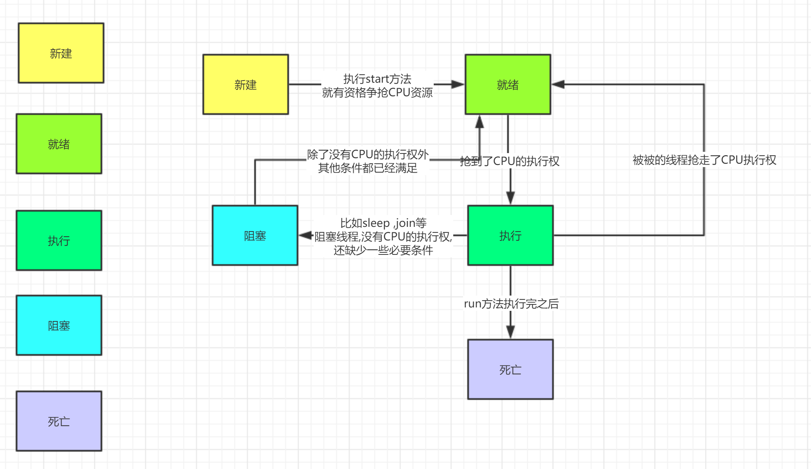

[TOC]


# 操作系统基本概念(掌握)

引入例子

```java
package com.cskaoyan.introduction;

import java.util.Scanner;
import java.util.concurrent.TimeUnit;

/**
 * @description:
 * @author: songtao@cskaoyan.onaliyun.com
 **/

/*
假如我要实现如下功能
程序不停地在屏幕上输出一句问候的语句(比如“你好”)
“同时”，当我通过键盘输入固定输入的时候，程序停止向屏幕输出问候的语句(比如说输入gun)
 */
public class Demo {
    public static boolean flag = true;
    public static void main(String[] args) {
        System.out.println("say hello before");
        sayHelloRecycling();
        System.out.println("say hello after");
        System.out.println("stop before");
        waitToStop();
        System.out.println("stop after");

    }

    private static void waitToStop() {
        // 创建一个Scanner对象
        Scanner scanner = new Scanner(System.in);
        while (flag){
            String s = scanner.nextLine();
            // 判断输入的值是否为gun
            if (s.equals("gun")) {
                flag = false;
                break;
            }
        }
    }

    private static void sayHelloRecycling() {
        while (flag) {
            System.out.println("你好");
            // 让程序暂停几秒
            try {
                TimeUnit.SECONDS.sleep(3);
            } catch (InterruptedException e) {
                e.printStackTrace();
            }
        }
    }
}

```

用多线程修改

```java
package com.cskaoyan.introduction;

import java.util.Scanner;
import java.util.concurrent.TimeUnit;

/**
 * @description:
 * @author: songtao@cskaoyan.onaliyun.com
 **/

/*
假如我要实现如下功能
程序不停地在屏幕上输出一句问候的语句(比如“你好”)
“同时”，当我通过键盘输入固定输入的时候，程序停止向屏幕输出问候的语句(比如说输入gun)
 */
public class Demo2 {
    public static boolean flag = true;
    public static void main(String[] args) {
        System.out.println("say hello before");
        sayHelloRecycling();
        System.out.println("say hello after");
        System.out.println("stop before");
        waitToStop();
        System.out.println("stop after");

    }

    private static void waitToStop() {

        new Thread(){
            @Override
            public void run() {
                Scanner scanner = new Scanner(System.in);
                while (flag){
                    String s = scanner.nextLine();
                    // 判断输入的值是否为gun
                    if (s.equals("gun")) {
                        flag = false;
                        break;
                    }
                }
            }
        }.start();

        // 创建一个Scanner对象

    }

    private static void sayHelloRecycling() {
        new Thread(){
            @Override
            public void run() {
                while (flag) {
                    System.out.println("你好");
                    // 让程序暂停几秒
                    try {
                        TimeUnit.SECONDS.sleep(3);
                    } catch (InterruptedException e) {
                        e.printStackTrace();
                    }
                }
            }
        }.start();


    }
}

```


**进程**

- 计算机程序在某个数据集合上的运行活动,进程是操作系统进行资源调度与分配的基本单位
- 简单理解,正在运行的程序或者软件 


**线程**

- 进程中有多个子任务 , 每一个子任务就是一个线程.从执行路径的角度去看 ,一条新的执行路径就是一个线程
- 线程是CPU进行资源调度与分配的基本单位
- 举例: 迅雷下载电影 下载3个电影  每个下载任务 都是迅雷进程的一个线程


**进程与线程的关系**

- 线程是依赖于进程而存在的
- 一个进程最少有1个线程
- 线程之间共享进程资源


**串行 并行 并发**

- 串行:一个任务接一个任务的按顺序执行
- 并行:在同一个时间点,多个任务同时执行
- 并发:在同一个时间段内,多个任务同时执行


**同步、异步 概念**

同步与异步描述的是被调用者的。 

如 A 调用 B：

 如果是同步，B 在接到 A 的调用后，会立即执行要做的事。A 的本次调用可以得到结 果。

 如果是异步，B 在接到 A 的调用后，不保证会立即执行要做的事，但是保证会去做，B 在做好了之后会通知 A。A 的本次调用得不到结果，但是 B 执行完之后会通知 A。

举例:

同步: 

我要去书店买一本java书,给老板打电话,有没有java书,老板说去看一下,此时电话没有挂断,不管老板找了多长时间,我都在电话的另一端等待老板给我,直到他找到了,拿起电话告诉我.

异步:

我要去书店买一本java书,给老板打电话,有没有java书,老板说去看一下,老板把电话挂断了.不管老板找了多长时间,直到他找到了 ,会打电话通知我找了了.

异步案例:


# java程序的运行(掌握)

## java命令运行原理

java命令  + 主类类名

- java命令创建一个jvm进程
- jvm进程会去创建一个线程,叫做主线程   main
- 会去执行main线程里的main方法

## jvm多线程还是单线程的

jvm是多线程的,还有1个垃圾回收线程负责回收垃圾

```java
        while (true) {
            int[] ints = new int[1024];
        }
```


# 多线程的实现方式一:继承Thread(重点)

## 文档示例

*线程* 是程序中的执行线程。Java 虚拟机允许应用程序并发地运行多个执行线程


## 步骤

- 继承Thread类
- 重写run方法
- 创建子类对象
- 通过start方法去启动线程

```java
package com.cskaoyan.implone;

/**
 * @description: 多线程的实现方式一
 * @author: songtao@cskaoyan.onaliyun.com
 **/

/*
- 继承Thread类
- 重写run方法
- 创建子类对象
- 通过start方法去启动线程
 */
public class Demo1 {
    public static void main(String[] args) {
        // 创建子类对象
        MyThread myThread = new MyThread();
        // start启动线程
        myThread.start();
    }
}

// 继承Thread类
class MyThread extends Thread{
    //重写run方法

    @Override
    public void run() {
        // run方法中写我们的代码
        System.out.println("子线程开启了!");
    }
}
```

```java
package com.cskaoyan.implone;

import java.util.concurrent.TimeUnit;

/**
 * @description:
 * @author: songtao@cskaoyan.onaliyun.com
 **/

public class Demo2 {
    public static void main(String[] args) {
        // 创建子类对象
        MyThread2 myThread2 = new MyThread2();
        // start
        myThread2.start();
        // 主线程当中打印10个数
        for (int i = 0; i < 10; i++) {
            System.out.println(i);
            try {
                TimeUnit.SECONDS.sleep(1);
            } catch (InterruptedException e) {
                e.printStackTrace();
            }
        }
        // 1.0-99   0-99
        // 2.交替打印(乱序)
    }
}

// 继承Thread
class MyThread2 extends Thread{
    // 重写run方法

    @Override
    public void run() {
        for (int i = 0; i < 10; i++) {
            System.out.println(i);
            try {
                TimeUnit.SECONDS.sleep(1);
            } catch (InterruptedException e) {
                e.printStackTrace();
            }
        }
    }
}
```

## 注意事项(重点)

- 谁才代表了一个线程?

  - Thread对象或其子类对象才代表一个线程

- 为什么我们的代码要写在run方法当中?

  - 因为在run方法的代码才会运行在子线程当中,我们想要我们的代码运行在子线程中 就必须要把我们的代码写在run方法当中.

- 启动线程我们用的是start方法 为什么不用run方法?

  - ```java
    使用start方法的结果:
    main start
    main end
    0
    1
    2
    3
    4
    5
    6
    7
    8
    9
        
    使用run方法的结果:
    main start
    0
    1
    2
    3
    4
    5
    6
    7
    8
    9
    main end
        
    package com.cskaoyan.implone;
    
    /**
     * @description:
     * @author: songtao@cskaoyan.onaliyun.com
     **/
    
    public class Demo3 {
        public static void main(String[] args) {
            System.out.println("main start");
            MyThread3 myThread3 = new MyThread3();
    
            // start
            myThread3.start();
            myThread3.run();
            System.out.println("main end");
            //  start num  end
            //  start end  num
        }
    }
    
    class MyThread3 extends Thread{
    
        @Override
        public void run() {
            for (int i = 0; i < 10; i++) {
                System.out.println(i);
            }
        }
    }
    ```

  - run方法并不能开启一个线程 , 在这里仅仅是一个普通方法调用  而start方法才会开启线程

- start方法的执行

  - 

- 线程可以多次启动吗?

  - java.lang.IllegalThreadStateException  对于同一个线程对象 多次调用了start方法

- run方法中调用别的方法,调用的这个方法也运行在子线程当中

  - ```java
    package com.cskaoyan.implone;
    
    /**
     * @description:
     * @author: songtao@cskaoyan.onaliyun.com
     **/
    
    public class Demo4 {
        public static void main(String[] args) {
            // 创建线程对象
            MyThread4 myThread4 = new MyThread4();
    
            // start
            myThread4.start();
        }
    }
    
    //继承Thread
    class MyThread4 extends Thread{
        // run
    
        @Override
        public void run() {
            for (int i = 0; i <10; i++) {
                System.out.println(i);
            }
            call();
        }
    
        private void call() {
            System.out.println("执行了call方法!");
        }
    }
    ```

## 获取线程名称

| String | getName()        返回该线程的名称。 |
| ------ | ----------------------------------- |
|        |                                     |

**默认线程名**

Thread-0----------0     Thread就代表了Thread类   第一个0 就代表了线程编号

```java
package com.cskaoyan.implone;

/**
 * @description: 获取线程名称
 * @author: songtao@cskaoyan.onaliyun.com
 **/

public class Demo5 {
    public static void main(String[] args) {
        // 创建子类对象
        MyThread5 t1 = new MyThread5();
        MyThread5 t2 = new MyThread5();
        // start
        t1.start();
        t2.start();
    }
}

// 继承Thread
class MyThread5 extends Thread{
    // run

    @Override
    public void run() {
        for (int i = 0; i < 10; i++) {
            // 获取线程名称
            System.out.println(getName() + "----------" +i);
        }
    }
}
```

**设置线程名称**

| void | setName(String name)        改变线程名称，使之与参数 name 相同。 |
| ---- | ------------------------------------------------------------ |
|      |                                                              |

```java
package com.cskaoyan.implone;

/**
 * @description: 获取线程名称
 * @author: songtao@cskaoyan.onaliyun.com
 **/

public class Demo5 {
    public static void main(String[] args) {
        // 创建子类对象
        MyThread5 t1 = new MyThread5();
        //MyThread5 t2 = new MyThread5();
        // start
        // setName(String name)
        t1.setName("UZI");
        t1.start();
        //t2.start();
    }
}

// 继承Thread
class MyThread5 extends Thread{
    // run

    @Override
    public void run() {
        for (int i = 0; i < 10; i++) {
            // 获取线程名称
            System.out.println(getName() + "----------" +i);
        }
    }
}
```

通过构造方法去设置线程名

Thread(String name)

```java
package com.cskaoyan.implone;

/**
 * @description: 通过Thread构造方法去设置线程名称
 * @author: songtao@cskaoyan.onaliyun.com
 **/

public class Demo6 {
    public static void main(String[] args) {
        // 创建线程对象
        MyThread6 t1 = new MyThread6("风宝");
        // 开启线程
        t1.start();
    }
}

// 继承Thread
class MyThread6 extends Thread{
    public MyThread6(String name) {
        this.setName(name);
    }

    // run

    @Override
    public void run() {
        for (int i = 0; i < 10; i++) {
            // 获取线程名称
            System.out.println(getName() + "----------" +i);
        }
    }
}
```

**如何获取主线程名称**

| static Thread | currentThread()        返回对当前正在执行的线程对象的引用 |
| ------------- | --------------------------------------------------------- |
|               |                                                           |

```java
package com.cskaoyan.implone;

/**
 * @description: 通过Thread构造方法去设置线程名称
 * @author: songtao@cskaoyan.onaliyun.com
 **/

public class Demo6 {
    public static void main(String[] args) {
        // 创建线程对象
        MyThread6 t1 = new MyThread6("风宝");
        // 开启线程

        t1.start();
        // 如何获取主线程名称
        // static Thread currentThread()
        // 返回对当前正在执行的线程对象的引用
        Thread thread = Thread.currentThread();
        String name = thread.getName();
        System.out.println(name);
    }
}

// 继承Thread
class MyThread6 extends Thread{
    public MyThread6(String name) {
        this.setName(name);
    }

    // run

    @Override
    public void run() {
        for (int i = 0; i < 10; i++) {
            // 获取线程名称
            System.out.println(getName() + "----------" +i);
        }
    }
}
```


# 线程的调度方式(掌握)

## 线程的2种调度方式

**线程调度**

- 线程调度指的是系统为线程分配CPU处理权的一个过程

**协同式线程调度方式**

- 线程的执行时间由线程本身决定,当该线程完成了自己的工作 会向系统报告切换到另一个线程
- 实现方式简单 缺点:线程执行时间不可控

**抢占式线程调度方式**

- 线程执行时间由系统决定,不由线程本身决定
- 线程执行时间可控

**java中采用的是抢占式线程调度方式**

# 线程的优先级(了解)

**操作系统的优先级**

- 静态优先级
- 动态优先级
  - 正在执行的线程 会随着执行时间的延长而降低优先级
  - 正在等待的线程,会随着等待时间的延长而升高优先级
- 静态+动态

**java当中的优先级**

| static int | MAX_PRIORITY        线程可以具有的最高优先级。 10    |
| ---------- | ---------------------------------------------------- |
| static int | MIN_PRIORITY        线程可以具有的最低优先级。     1 |
| static int | NORM_PRIORITY        分配给线程的默认优先级。     5  |

**如何获取 修改线程优先级**

获取

| int  | getPriority()        返回线程的优先级。 |
| ---- | --------------------------------------- |
|      |                                         |

设置

| void | setPriority(int newPriority)        更改线程的优先级。 |
| ---- | ------------------------------------------------------ |
|      |                                                        |

```java
package com.cskaoyan.implone;

/**
 * @description: 线程优先级
 * @author: songtao@cskaoyan.onaliyun.com
 **/

public class Demo7 {
    public static void main(String[] args) {
        // 创建线程对象
        MyThread7 myThread7 = new MyThread7();
        myThread7.setName("吴彦祖");
        // start
        myThread7.start();
        // 获取默认的优先级  5
        //int priority = myThread7.getPriority();
        //System.out.println(priority);
        // 设置优先级
        myThread7.setPriority(Thread.MIN_PRIORITY);
        int minPriority = myThread7.getPriority();
        System.out.println(minPriority);
    }
}

class MyThread7 extends Thread{
    // run

    @Override
    public void run() {
        for (int i = 0; i < 10; i++) {
            System.out.println(getName() + "------ " +i);
        }
    }
}
```

**java中的优先级是否有用?**

java中的优先级没啥用

java中的优先级仅仅是一种建议,改变的只是静态优先级

 java官方： 线程优先级并非完全没有用，我们Thread的优先级，它具有(统计意义,从概率的角度看)，总的来说，高优先级的线程 占用的cpu执行时间多一点，低优先级线程，占用cpu执行时间，短一点

```java
package com.cskaoyan.implone;

/**
 * @description:
 * @author: songtao@cskaoyan.onaliyun.com
 **/

public class Demo8 {
    public static void main(String[] args) {
        // 创建2个线程对象
        MyThread8 t1 = new MyThread8();
        MyThread8 t2 = new MyThread8();
        // 设置名字
        t1.setName("彭于晏");
        t2.setName("送终鸡");
        // 设置优先级
        t1.setPriority(Thread.MAX_PRIORITY);
        t2.setPriority(1);
        // start
        t1.start();
        t2.start();
        // 打印结果?? 彭于晏先打印10个数   宋仲基再打印10个数

    }
}

class MyThread8 extends Thread{
    //run

    @Override
    public void run() {
        for (int i = 0; i < 10; i++) {
            System.out.println(getName() + "------- " + i);
        }
    }
}


彭于晏------- 0
送终鸡------- 0
彭于晏------- 1
送终鸡------- 1
送终鸡------- 2
送终鸡------- 3
彭于晏------- 2
送终鸡------- 4
送终鸡------- 5
送终鸡------- 6
送终鸡------- 7
送终鸡------- 8
送终鸡------- 9
彭于晏------- 3
彭于晏------- 4
彭于晏------- 5
彭于晏------- 6
彭于晏------- 7
彭于晏------- 8
彭于晏------- 9

```


# 线程的控制API(掌握)

## 线程休眠sleep

| static void | sleep(long millis)        在指定的毫秒数内让当前正在执行的线程休眠（暂停执行,阻塞），此操作受到系统计时器和调度程序精度和准确性的影响 |
| ----------- | ------------------------------------------------------------ |
|             |                                                              |

```java
package com.cskaoyan.api;

import java.util.concurrent.TimeUnit;

/**
 * @description: sleep
 * @author: songtao@cskaoyan.onaliyun.com
 **/

public class SleepDemo {
    public static void main(String[] args) {
        // 创建线程对象
        ThreadSleep threadSleep = new ThreadSleep();
        // start
        threadSleep.start();
    }
}

class ThreadSleep extends Thread{
    @Override
    public void run() {
        for (int i = 0; i < 10; i++) {
            System.out.println(getName()+"----"+i);
            // sleep(毫秒)
            try {
                Thread.sleep(2000);
                // 2者等效
                //TimeUnit.SECONDS.sleep(1);
            } catch (InterruptedException e) {
                e.printStackTrace();
            }
        }
    }
}
```


## 线程合并(加入)join

| void | join()        等待该线程终止。 |
| ---- | ------------------------------ |
|      |                                |

**谁等待?**

- 主线程在等待,join这个代码在哪个线程上执行,哪个线程就等待

**等待谁?**

- 等待的子线程,等待的就是调用了join的这个线程


```java
没加join的执行结果:
main start
0
Thread-0-----0
1
Thread-0-----1
2
Thread-0-----2
end main
Thread-0-----3
Thread-0-----4
Thread-0-----5
Thread-0-----6
Thread-0-----7
Thread-0-----8
Thread-0-----9
    
加上join的执行结果:
main start
Thread-0-----0
Thread-0-----1
Thread-0-----2
Thread-0-----3
Thread-0-----4
Thread-0-----5
Thread-0-----6
Thread-0-----7
Thread-0-----8
Thread-0-----9
0
1
2
end main
    
package com.cskaoyan.api;

/**
 * @description: join
 * @author: songtao@cskaoyan.onaliyun.com
 **/

public class JoinDemo {
    public static void main(String[] args) {
        System.out.println("main start");
        // 创建线程对象
        JoinThread joinThread = new JoinThread();

        // start
        joinThread.start();
        // 调用join
        try {
            joinThread.join();
        } catch (InterruptedException e) {
            e.printStackTrace();
        }
        // 主线程中打印3个数
        for (int i = 0; i < 3; i++) {
            System.out.println(i);
            try {
                Thread.sleep(1000);
            } catch (InterruptedException e) {
                e.printStackTrace();
            }
        }
        System.out.println("end main");
    }
}

class JoinThread extends Thread{
    // run

    @Override
    public void run() {
        for (int i = 0; i < 10; i++) {
            System.out.println(getName() + "-----" + i);
            try {
                Thread.sleep(1000);
            } catch (InterruptedException e) {
                e.printStackTrace();
            }
        }
    }
}

```


## 线程礼让yield

| static void | yield()        暂停当前正在执行的线程对象，并执行其他线程。 |
| ----------- | ----------------------------------------------------------- |
|             |                                                             |

需求:启动2个线程 分别打印10个数  要求你打印1个1  我打印1个1 一次类推


```java
package com.cskaoyan.api;

/**
 * @description: 礼让线程
 * @author: songtao@cskaoyan.onaliyun.com
 **/

public class YieldDemo {
    public static void main(String[] args) {
        // 创建线程对象
        YieldThread t1 = new YieldThread();
        YieldThread t2 = new YieldThread();
        t1.setName("A");
        t2.setName("B");
        // start
        t1.start();
        t2.start();
    }
}

class YieldThread extends Thread{
    // run


    @Override
    public void run() {
        for (int i = 0; i < 10; i++) {
            System.out.println(getName()+"-------"+i);
            // 执行yield方法 暂停当前正在执行的线程对象，并执行其他线程。
            Thread.yield();
            // java 种采用的抢占式线程调度方式
            // 虽然线程A放弃了CPU的执行权 但是下一轮的CPU的竞争 A仍然能够参与
        }
    }
}
```


## 守护线程daemon

线程的分类:

- 用户线程
- 守护线程

| void | setDaemon(boolean on)        将该线程标记为守护线程或用户线程。 |
| ---- | ------------------------------------------------------------ |
|      |                                                              |

注意:

- 将该线程标记为守护线程或用户线程。<font color=red>当正在运行的线程都是守护线程时，Java 虚拟机退出。</font> 
- 该方法必须在启动线程前调用。 (要在start前调用)
- java.lang.IllegalThreadStateException   没有在start前调用
- 垃圾回收线程是守护线程

```java
package com.cskaoyan.api;

/**
 * @description: 守护线程
 * @author: songtao@cskaoyan.onaliyun.com
 **/

public class DaemonDemo {
    public static void main(String[] args) {
        // 创建线程对象
        DaemonThread daemonThread = new DaemonThread();
        daemonThread.setName("A");
        // setDaemon(true)
        daemonThread.setDaemon(true);
        daemonThread.start();
        // 主线程中打印3个数

        for (int i = 0; i < 3; i++) {
            System.out.println(i);
            try {
                Thread.sleep(1000);
            } catch (InterruptedException e) {
                e.printStackTrace();
            }
        }
    }
}

class DaemonThread extends Thread{
    // run

    @Override
    public void run() {
        for (int i = 0; i < 10; i++) {
            System.out.println(getName() + "-----" + i);
            try {
                Thread.sleep(1000);
            } catch (InterruptedException e) {
                e.printStackTrace();
            }
        }
    }
}

执行结果:
0
A-----0
1
A-----1
2
A-----2
A-----3
后面的数字并没有打印
```


## 中断线程interrupt/stop

| void | interrupt()        中断线程。 |
| ---- | ----------------------------- |
|      |                               |

如果线程在调用 Object 类的 wait()、wait(long) 或 wait(long, int) 方法，或者该类的 join()、join(long)、join(long, int)、sleep(long) 或 sleep(long, int) 方法过程中受阻，则其中断状态将被清除，它还将收到一个 InterruptedException。

```java
package com.cskaoyan.api;

/**
 * @description: 中断线程
 * @author: songtao@cskaoyan.onaliyun.com
 **/

public class StopThreadDemo {
    public static void main(String[] args) {
        // 创建线程对象
        StopThread stopThread = new StopThread();
        // start
        stopThread.start();
        // 主线程打印3个数
        for (int i = 0; i < 3; i++) {
            System.out.println(i);
            try {
                Thread.sleep(1000);
            } catch (InterruptedException e) {
                e.printStackTrace();
            }
        }
        // 调用interrupt方法  通过异常处理机制
        // 泼了一盆水 去唤醒 但是 并没有中断线程
        stopThread.interrupt();
    }
}

class StopThread extends Thread{
    //run

    @Override
    public void run() {
        for (int i = 0; i < 10; i++) {
            System.out.println(getName() + "-----" + i);
            try {
                Thread.sleep(1000);
            } catch (InterruptedException e) {
                //e.printStackTrace();
            }
        }
    }
}
```

stop

不是一个安全的方法 不推荐使用

```java
package com.cskaoyan.api;

/**
 * @description: 中断线程
 * @author: songtao@cskaoyan.onaliyun.com
 **/

public class StopThreadDemo {
    public static void main(String[] args) {
        // 创建线程对象
        StopThread stopThread = new StopThread();
        // start
        stopThread.start();
        // 主线程打印3个数
        for (int i = 0; i < 3; i++) {
            System.out.println(i);
            try {
                Thread.sleep(1000);
            } catch (InterruptedException e) {
                e.printStackTrace();
            }
        }
        // 调用interrupt方法  通过异常处理机制
        // 泼了一盆水 去唤醒 但是 并没有中断线程
        //stopThread.interrupt();
        stopThread.stop();
    }
}

class StopThread extends Thread{
    //run

    @Override
    public void run() {
        for (int i = 0; i < 10; i++) {
            System.out.println(getName() + "-----" + i);
            try {
                Thread.sleep(1000);
            } catch (InterruptedException e) {
                //e.printStackTrace();
            }
        }
    }
}
```

**如何安全的终止线程?**

练习:

需求:

主线程打印3个数

子线程打印10个数

定义boolean flag 去控制线程终止

当子线程终止的时候, 向文件当中输出一个中断标记, log.txt  当前时间 年月日  时分秒 + 子线程中断字符串 写入文件

```java
package com.cskaoyan.api;

import java.io.FileWriter;
import java.io.IOException;
import java.text.SimpleDateFormat;
import java.util.Date;

/**
 * @description: 安全终止线程
 * @author: songtao@cskaoyan.onaliyun.com
 **/

/*
主线程打印3个数

子线程打印10个数

定义boolean flag 去控制线程终止

当子线程终止的时候, 向文件当中输出一个中断标记,
 log.txt  当前时间 年月日  时分秒 + 子线程中断字符串 写入文件
 */
public class SecurityStop {
    public static void main(String[] args) {
        // 创建线程对象
        MyThread myThread = new MyThread();
        // 启动线程
        myThread.start();
        // 主线程打印3个数
        for (int i = 0; i < 3; i++) {
            System.out.println(i);
            try {
                Thread.sleep(1000);
            } catch (InterruptedException e) {
                e.printStackTrace();
            }
        }
        // 更改flag值
        myThread.flag = false;
    }
}

class MyThread extends Thread{
    boolean flag = true;
    // run

    @Override
    public void run() {
        for (int i = 0; i < 10; i++) {
            if (flag) {
                // flag为true表明没有被中断
                // 正常打印
                System.out.println(getName() + "------" + i);
                try {
                    Thread.sleep(1000);
                } catch (InterruptedException e) {
                    e.printStackTrace();
                }
            }else{
                // 说明子线程被中断
                // 向log.txt文件中输出中断信息
                // 创建输出流对象
                try {
                    FileWriter fileWriter = new FileWriter("log.txt");
                    // 写数据
                    SimpleDateFormat simpleDateFormat = new SimpleDateFormat("yyyy-MM-dd HH:mm:ss");
                    String dateStr = simpleDateFormat.format(new Date());
                    fileWriter.write(dateStr + " :" + "发生了中断");
                    fileWriter.write(System.lineSeparator());
                    fileWriter.flush();

                    // close
                    fileWriter.close();
                } catch (IOException e) {
                    e.printStackTrace();
                }
                // 保存数据的操作.....
            }

        }
    }
}
```


# 线程状态转换图(掌握)

**五种线程状态**

- 新建状态
  - 刚new出来的线程对象 还没有start方法
- 就绪状态
  - 执行了start方法 开启了线程 已经具备了抢夺CPU执行权的特点
- 执行状态
  - 线程抢夺到了CPU的执行权
- 阻塞状态
  - 在等待 
- 死亡状态
  - 当run方法执行完毕  



# 多线程的实现方式二:实现Runnable接口(重点)

## 文档示例


## 步骤

- 定义一个类实现Runnable接口
- 重写run方法
- 创建子类对象
- 创建Thread对象,并且把实现了Runnable接口的子类对象作为参数传递
- start方法启动线程

```java
package com.cskaoyan.impltwo;

/**
 * @description: Runnable
 * @author: songtao@cskaoyan.onaliyun.com
 **/

/*
- 定义一个类实现Runnable接口
- 重写run方法
- 创建子类对象
- 创建Thread对象,并且把实现了Runnable接口的子类对象作为参数传递
- start方法启动线程
 */
public class Demo1 {
    public static void main(String[] args) {
        // 创建子类对象
        MyRunnable myRunnable = new MyRunnable();
        // 创建Thread对象,并且把实现了Runnable接口的子类对象作为参数传递
        // Thread(Runnable target) 
        // 分配新的 Thread 对象。
        Thread thread = new Thread(myRunnable);
        // start方法启动线程
        thread.start();
    }
}

// 定义一个类实现Runnable接口
class MyRunnable implements Runnable{

    // 重写run方法
    @Override
    public void run() {
        System.out.println("执行了子线程");
    }
}
```

## 注意事项(重点)

- 为什么Runnable中的run方法会运行在子线程当中?

  - ```java
    class Thread{
        // 定义一个成员变量
        private Runnable target;
        // 右边这个target是我们通过Thread(Runnable target)传递过来的 
        // 并且在这里执行了赋值操作
        this.target = target;
        void run(){
            //先判断了 target是否为空
            if(target != null){
                // 执行target中的run方法
                target.run()
            }
        }
    }
    ```

- 谁才代表一个线程?

  - Thread类对象 或子类对象才代表一个线程

- 线程就是一个执行路径,跟执行路径上的代码有没有关系?

  - 没有任何关系
  - Runnable方式把执行路径(线程),和在线程上运行的代码(任务) 拆分开来  , 解耦

# Thread VS Runnable

- 实现步骤,方式需要4步,方式二需要5步
- 方式一的缺陷,单继承的局限性
- 方式二把任务和线程进行了解耦
- 方式二更便于数据共享

# 多线程数据安全问题(重点)

多线程仿真如下场景：
假设A电影院正在上映某电影，该电影有100张电影票可供出售，现在假设有3个窗口售票。请设计程序模拟窗口售票的场景。

分析：
3个窗口售票，互不影响，同时进行。 →  多线程的实现方式
3个窗口共同出售这100张电影票       →    3个窗口共享100张票

方式一去实现:

```java
package com.cskaoyan.datasecurity;

/**
 * @description:
 * @author: songtao@cskaoyan.onaliyun.com
 **/

/*
假设A电影院正在上映某电影，该电影有100张电影票可供出售，
现在假设有3个窗口售票。请设计程序模拟窗口售票的场景。

分析：
3个窗口售票，互不影响，同时进行。 →  多线程的实现方式
3个窗口共同出售这100张电影票       →    3个窗口共享100张票
 */
public class Demo1 {
    public static void main(String[] args) {
        // 创建 3个窗口(线程)并启动
        SellWindow t1 = new SellWindow();
        SellWindow t2 = new SellWindow();
        SellWindow t3 = new SellWindow();
        // setName(String name)
        t1.setName("A窗口");
        t2.setName("B窗口");
        t3.setName("C窗口");
        t1.start();
        t2.start();
        t3.start();
    }
}

// 方式一
class SellWindow extends Thread{
    // 定义100张票
    static int tickets = 100;
    // run

    @Override
    public void run() {
        // 卖票
        while (true){
            // 大于0才卖票
            if (tickets > 0) {
                System.out.println(getName()+"卖了第" + tickets-- + "票");
            }
        }
    }
}
```

方式二:更便于数据共享

```java
package com.cskaoyan.datasecurity;

/**
 * @description:
 * @author: songtao@cskaoyan.onaliyun.com
 **/

public class Demo2 {
    public static void main(String[] args) {
        // 创建窗口
        Window window = new Window();
        Thread t1 = new Thread(window);
        Thread t2 = new Thread(window);
        Thread t3 = new Thread(window);
        //启动
        t1.setName("A窗口");
        t2.setName("B窗口");
        t3.setName("C窗口");
        t1.start();
        t2.start();
        t3.start();
    }
}

//方式二
class Window implements Runnable{
    int tickets = 100;

    @Override
    public void run() {
        // 卖票
        while (true) {
            if (tickets > 0) {
                System.out.println(Thread.currentThread().getName() +
                        "卖了第" + tickets-- + "票");
            }
        }
    }
}
```

模拟真实的情况

```java
package com.cskaoyan.datasecurity;

/**
 * @description:
 * @author: songtao@cskaoyan.onaliyun.com
 **/

public class Demo2 {
    public static void main(String[] args) {
        // 创建窗口
        Window window = new Window();
        Thread t1 = new Thread(window);
        Thread t2 = new Thread(window);
        Thread t3 = new Thread(window);
        //启动
        t1.setName("A窗口");
        t2.setName("B窗口");
        t3.setName("C窗口");
        t1.start();
        t2.start();
        t3.start();
    }
}

//方式二
class Window implements Runnable{
    int tickets = 100;

    @Override
    public void run() {
        // 卖票
        while (true) {
            // 网络延迟
            try {
                Thread.sleep(200);
            } catch (InterruptedException e) {
                e.printStackTrace();
            }
            if (tickets > 0) {
                System.out.println(Thread.currentThread().getName() +
                        "卖了第" + tickets-- + "票");
            }
        }
    }
}
```

**产生的问题**

- 有重复的票

- 不存在的票 0    -1

- 

- 分析的过程

- ```java
  package com.cskaoyan.datasecurity;
  
  /**
   * @description:
   * @author: songtao@cskaoyan.onaliyun.com
   **/
  
  public class Demo2 {
      public static void main(String[] args) {
          // 创建窗口
          Window window = new Window();
          Thread t1 = new Thread(window);
          Thread t2 = new Thread(window);
          Thread t3 = new Thread(window);
          //启动
          t1.setName("A窗口");
          t2.setName("B窗口");
          t3.setName("C窗口");
          t1.start();
          t2.start();
          t3.start();
      }
  }
  
  //方式二
  class Window implements Runnable{
      int tickets = 100;
  
      @Override
      public void run() {
          // 卖票
          // 为什么会有重复的票
          // 假设A窗口抢到了CPU的执行权 tickets= 100
          // 假设此时B抢到了CPU的执行权 tickets =100
          // 此时C抢到了CPU的执行权 tickets=100
          
          // 分析为什么会有不存在的票?
          // 假设A抢到了CPU的执行权 此时tickets=1
          // 假设B抢到了CPU的执行权 此时tickets=1
          // 假设C也抢到了CPU的执行权 此时tickets=1
          while (true) {
  
              if (tickets > 0) {
                  // 网络延迟
                  try {
                      // A在此睡眠
                      // B在此睡眠
                      Thread.sleep(200);
                  } catch (InterruptedException e) {
                      e.printStackTrace();
                  }
                  // A线程进来
                  // B线程也能进来
                  System.out.println(Thread.currentThread().getName() +
                          "卖了第" + tickets-- + "票");
                  // tickets--是一个分3步的操作
                  // 1.取值 2.-1操作 3.重写赋值
  
                  // 会产生怎么样的结果?
                  // 最坏的结果
                  // A打印 A窗口卖了第1张票 此时还剩0
                  // B打印 B窗口卖了第0张票 此时还剩-1
                  // C打印 C窗口卖了第-1张票 此时还剩-2
              }
          }
      }
  }
  ```


## 产生数据安全问题的原因

- 多线程的运行环境
- 多线程数据共享
- 存在非原子操作
  - 什么是原子操作?  一个操作要么一下完成,要没不完成


# 解决数据安全问题(重点)

分析一下:

1.思路一:不让它发生线程切换 

不能实现,java当中采用的是抢占式的线程调度方式  无法控制线程切换

2.把非原子操作变成一个原子操作

**怎么把一个非原子操作变成一个原子操作?**

- 通过锁的概念
- 

## synchronized(同步的意思)

### synchronized同步代码块

语法

```java
synchronized(锁对象){
    // 对共享数据的访问
    // 同步代码 原子操作
}
```

```java
package com.cskaoyan.solve;

/**
 * @description: sync
 * @author: songtao@cskaoyan.onaliyun.com
 **/

public class Demo1 {
    public static void main(String[] args) {
        // 创建子类对象
        SellWindow sellWindow = new SellWindow();
        // 启动3个线程
        Thread t1 = new Thread(sellWindow);
        Thread t2 = new Thread(sellWindow);
        Thread t3 = new Thread(sellWindow);
        t1.setName("A");
        t2.setName("B");
        t3.setName("C");
        t1.start();
        t2.start();
        t3.start();
    }
}

class SellWindow implements Runnable{

    int tickets = 100;
    //Object obj = new Object();
    A a = new A();
    @Override
    public void run() {
        // 卖票
        while (true) {
            // synchronized(锁对象){
            //    // 对共享数据的访问
            //    // 同步代码 原子操作
            //}
            // 对象是谁?
            synchronized (a) {
                if (tickets > 0) {
                    try {
                        Thread.sleep(200);
                    } catch (InterruptedException e) {
                        e.printStackTrace();
                    }
                    System.out.println(Thread.currentThread().getName() +
                            "卖了第" + tickets-- + "票");
                }
            }

        }
    }
}

class A {

}
```

注意:

同步代码块中的锁对象可以是任意锁对象,但是一定要保证是同一个

### 同步方法

**同步方法中的锁对象就是this**

```java
package com.cskaoyan.solve;

/**
 * @description: sync
 * @author: songtao@cskaoyan.onaliyun.com
 **/

public class Demo2 {
    public static void main(String[] args) {
        // 创建子类对象
        SellWindow2 sellWindow = new SellWindow2();
        // 启动3个线程
        Thread t1 = new Thread(sellWindow);
        Thread t2 = new Thread(sellWindow);
        Thread t3 = new Thread(sellWindow);
        t1.setName("A");
        t2.setName("B");
        t3.setName("C");
        t1.start();
        t2.start();
        t3.start();
    }
}

class SellWindow2 implements Runnable {

    int tickets = 100;
    //Object obj = new Object();
    B b = new B();
    int i = 0;

    @Override
    public void run() {
        // 卖票
        while (true) {
            if (i % 2 == 0) {
                synchronized (this) {
                    if (tickets > 0) {
                        try {
                            Thread.sleep(200);
                        } catch (InterruptedException e) {
                            e.printStackTrace();
                        }
                        System.out.println(Thread.currentThread().getName() +
                                "卖了第" + tickets-- + "票");
                    }
                }
            } else {
                sell();
            }
            i++;


        }
    }

    private synchronized void sell() {

        if (tickets > 0) {
            try {
                Thread.sleep(200);
            } catch (InterruptedException e) {
                e.printStackTrace();
            }
            System.out.println(Thread.currentThread().getName() +
                    "卖了第" + tickets-- + "票");
        }
    }
}


class B{

}
```


### 静态方法

**静态方法中的锁对象是字节码文件对象**

```java
package com.cskaoyan.solve;

/**
 * @description: sync
 * @author: songtao@cskaoyan.onaliyun.com
 **/

public class Demo2 {
    public static void main(String[] args) {
        // 创建子类对象
        SellWindow2 sellWindow = new SellWindow2();
        // 启动3个线程
        Thread t1 = new Thread(sellWindow);
        Thread t2 = new Thread(sellWindow);
        Thread t3 = new Thread(sellWindow);
        t1.setName("A");
        t2.setName("B");
        t3.setName("C");
        t1.start();
        t2.start();
        t3.start();
    }
}

class SellWindow2 implements Runnable {

    static int tickets = 100;
    Object obj = new Object();
    //B b = new B();
    int i = 0;

    @Override
    public void run() {
        // 卖票
        while (true) {
            if (i % 2 == 0) {
                // 静态方法中的锁对象是其字节码文件对象  Class
                // 类名.class 跟 对象.getClass()
                synchronized (SellWindow2.class) {
                    if (tickets > 0) {
                        try {
                            Thread.sleep(200);
                        } catch (InterruptedException e) {
                            e.printStackTrace();
                        }
                        System.out.println(Thread.currentThread().getName() +
                                "卖了第" + tickets-- + "票");
                    }
                }
            } else {
                sell();
            }
            i++;


        }
    }

    private static synchronized void sell() {

        if (tickets > 0) {
            try {
                Thread.sleep(200);
            } catch (InterruptedException e) {
                e.printStackTrace();
            }
            System.out.println(Thread.currentThread().getName() +
                    "卖了第" + tickets-- + "票");
        }
    }
}


class B{

}
```


注意:

同步代码块的细节：
    a. synchronized代码块中的锁对象，可以是java语言中的任意对象(java语言中的任意一个对象，都可以充当锁的角色仅限于synchronized代码块中)：
        1)因为java中所有对象，内部都存在一个标志位，表示加锁和解锁的状态
        2)所以其实锁对象，就充当着锁的角色
        所谓的加锁解锁，其实就是设置随对象的标志位，来表示加锁解锁的状态。

​    b.  我们的代码都是在某一条执行路径(某一个线程中运行)，当某个线程执行到同步代码块时，
​        会尝试在当前线程中，对锁对象加锁
​        1） 此时，如果锁对象处于未加锁状态，jvm就会设置锁对象的标志位(加锁)，并在锁对象中记录，是哪个线程加的锁
​            然后，让加锁成功的当前线程，执行同步代码块中的代码

​        2） 此时，如果锁对象已经被加锁，且加锁线程不是当前线程，系统会让当前线程处于阻塞状态(等着)，
​            直到加锁线程，执行完了对共享变量的一组操作，并释放锁


​    c. 加锁线程何时释放锁？
​       当加锁线程，执行完了同步代码块中的代码(对共享变量的一组操作)，在退出同步代码块之前，
​       jvm自动清理锁对象的标志位，将锁对象变成未上锁状态(释放锁)

 千万要注意：
         a. 虽然，synchronized代码块，中的锁对象，可以是java语言中的任意对象
         b. 但是，在多线程运行环境下，想要让访问 同一个共享变量的， 多个synchronized代码块中的代码是原子操作
            注意，对同一个共享变量的访问，必须使用同一个锁对象。

## lock

`Lock` 接口 实现提供了比使用 `synchronized` 方法和语句可获得的更广泛的锁定操作

常用 ReentrantLock具体实现

**文档示例**


| void | lock()        获取锁。 |
| ---- | ---------------------- |
|      |                        |

| void | unlock()        释放锁。 |
| ---- | ------------------------ |
|      |                          |

```java
package com.cskaoyan.solve;

import java.util.concurrent.locks.Lock;
import java.util.concurrent.locks.ReentrantLock;

/**
 * @description: lock
 * @author: songtao@cskaoyan.onaliyun.com
 **/

public class Demo3 {
    public static void main(String[] args) {
        // 创建子类对象
        SellWindow3 sellWindow = new SellWindow3();
        // 启动3个线程
        Thread t1 = new Thread(sellWindow);
        Thread t2 = new Thread(sellWindow);
        Thread t3 = new Thread(sellWindow);
        t1.setName("A");
        t2.setName("B");
        t3.setName("C");
        t1.start();
        t2.start();
        t3.start();
    }
}

class SellWindow3 implements Runnable {

    int tickets = 100;
    Lock lock = new ReentrantLock();
    @Override
    public void run() {
        // 卖票
        while (true) {
            // lock()加锁
            lock.lock();

            try {
                if (tickets > 0) {
                    try {
                        Thread.sleep(200);
                    } catch (InterruptedException e) {
                        e.printStackTrace();
                    }
                    System.out.println(Thread.currentThread().getName() +
                            "卖了第" + tickets-- + "票");
                }
            } finally {

                // unlock()释放锁
                lock.unlock();
            }
        }

    }
}


```

# synchronized Vs Lock

- 语法上

  - ```java
    synchronized(锁对象){
        // 对共享数据的操作
    }
    ```

    

  - ```java
    lock();
        // 对共享的操作
    unlock();
    ```

- synchronized是一把隐式的锁 , 加锁 解锁是通过jvm修改锁对象的标志位

- lock是一把真正的锁,我们能够看见加锁解锁的过程

- 推荐使用synchronized


# 死锁(了解)

## 什么是死锁

死锁就是2个或以上线程争抢资源而造成的互相等待的现象叫做死锁


## 产生死锁的情况(场景)

```java
同步代码块嵌套
synchronized(A 锁){
   synchronized(B 锁){
       
   } 
}
```

模拟死锁

```java
package com.cskaoyan.dielock;

/**
 * @description: 死锁的情况
 * @author: songtao@cskaoyan.onaliyun.com
 **/

public class Demo {
    public static void main(String[] args) {
        // 创建子类对象
        DieLock dieLock = new DieLock(false);
        DieLock dieLock2 = new DieLock(true);
        Thread t1 = new Thread(dieLock);
        Thread t2 = new Thread(dieLock2);
        //start
        t1.start();
        t2.start();

    }
}

// 定义一个锁类
class MyLock {
    // 定义2把锁
    public static final Object objA = new Object();
    public static final Object objB = new Object();

}

class DieLock implements Runnable{

    boolean flag;

    public DieLock(boolean flag) {
        this.flag = flag;
    }

    @Override
    public void run() {
        if (flag) {
            synchronized (MyLock.objA) {
                // 说明了线程持有A锁
                System.out.println("if A");
                synchronized (MyLock.objB) {
                    System.out.println("if B");
                }
            }
        }else {
            synchronized (MyLock.objB) {
                // 说明了线程持有了B锁
                System.out.println("else B");
                synchronized (MyLock.objA) {
                    System.out.println("else A");
                }
            }
        }
    }
}
```

## 解决死锁

### 方式一

**更改加锁顺序**

```java
package com.cskaoyan.dielock;

/**
 * @description: 死锁的情况
 * @author: songtao@cskaoyan.onaliyun.com
 **/

public class Demo {
    public static void main(String[] args) {
        // 创建子类对象
        DieLock dieLock = new DieLock(false);
        DieLock dieLock2 = new DieLock(true);
        Thread t1 = new Thread(dieLock);
        Thread t2 = new Thread(dieLock2);
        //start
        t1.start();
        t2.start();

    }
}

// 定义一个锁类
class MyLock {
    // 定义2把锁
    public static final Object objA = new Object();
    public static final Object objB = new Object();

}

class DieLock implements Runnable{

    boolean flag;

    public DieLock(boolean flag) {
        this.flag = flag;
    }

    @Override
    public void run() {
        if (flag) {
            synchronized (MyLock.objA) {
                // 说明了线程持有A锁
                System.out.println("if A");
                synchronized (MyLock.objB) {
                    System.out.println("if B");
                }
            }
        }else {
            synchronized (MyLock.objA) {
                // 说明了线程持有了B锁
                System.out.println("else B");
                synchronized (MyLock.objB) {
                    System.out.println("else A");
                }
            }
        }
    }
}
```


### 方式二

把一个非原子操作变成一个原子操作 再加一把锁

```java
package com.cskaoyan.dielock;

/**
 * @description: 死锁的情况
 * @author: songtao@cskaoyan.onaliyun.com
 **/

public class Demo {
    public static void main(String[] args) {
        // 创建子类对象
        DieLock dieLock = new DieLock(false);
        DieLock dieLock2 = new DieLock(true);
        Thread t1 = new Thread(dieLock);
        Thread t2 = new Thread(dieLock2);
        //start
        t1.start();
        t2.start();

    }
}

// 定义一个锁类
class MyLock {
    // 定义2把锁
    public static final Object objA = new Object();
    public static final Object objB = new Object();
    // 新加了一把锁
    public static final Object objC = new Object();

}

class DieLock implements Runnable{

    boolean flag;

    public DieLock(boolean flag) {
        this.flag = flag;
    }

    @Override
    public void run() {
        if (flag) {
            synchronized (MyLock.objC) {
                synchronized (MyLock.objA) {
                    // 说明了线程持有A锁
                    System.out.println("if A");
                    synchronized (MyLock.objB) {
                        System.out.println("if B");
                    }
                }
            }

        }else {
            synchronized (MyLock.objC) {
                synchronized (MyLock.objB) {
                    // 说明了线程持有了B锁
                    System.out.println("else B");
                    synchronized (MyLock.objA) {
                        System.out.println("else A");
                    }
                }
            }

        }
    }
}
```


# 生产者消费者模型(了解)


# 线程间通信(等待唤醒机制)(重点)

wait

| void | wait()        在其他线程调用此对象的 notify() 方法或 notifyAll()  方法前，导致当前线程等待。 |
| ---- | ------------------------------------------------------------ |
|      |                                                              |

    1. 阻塞功能：
        当在某线程中，对象上.wait(), 在哪个线程中调用wait(), 导致哪个线程处于阻塞状态
        当某线程，因为调用执行某对象的wait(),而处于阻塞状态，我们说，该线程在该对象上阻塞。
    2. 唤醒条件
       当某线程，因为某对象A的wait(), 而处于阻塞状态时，如果要唤醒该线程，只能在其他线程中，
       再同一个对象(即对象A)上调用其notify()或notifyAll()
       即在线程的阻塞对象上，调用notify或notifyAll方法，才能唤醒，在该对象上阻塞的线程
    3. 运行条件
          当前线程必须拥有此对象监视器。
          监视器：指synchronized代码块中的锁对象
        即我们只能在，当前线程所持有的synchronized代码块汇中的，锁对象上调用wait方法，
        才能正常执行
        如果我不在同步代码块中调用就会有这样一个异常
        IllegalMonitorStateException
    4. 执行特征
          a.该线程发布(release)对此监视器的所有权
          b.等待(阻塞)
       注意：Thread的sleep方法，执行的时候：
            该线程不丢失任何监视器的所属权

面试题：
    Thread.sleep VS Object.wait()

1. 所属不同：
   a. sleep定义在Thread类，静态方法
   b. wait定义在 Object类中，非静态方法

2. 唤醒条件不同
   a. sleep: 休眠时间到
   b. wait: 在其他线程中，在同一个锁对象上，调用了notify或notifyAll方法

3. 使用条件不同：
   a. sleep 没有任何前提条件
   b. wait(), 必须当前线程，持有锁对象，锁对象上调用wait()

4. 休眠时，对锁对象的持有，不同：（最最核心的区别）
   a. 线程因为sleep方法而处于阻塞状态的时候，在阻塞的时候不会放弃对锁的持有
   b. 但是wait()方法，会在阻塞的时候，放弃锁对象持有

notify

| void | notify()        唤醒在此对象监视器上等待的单个线程。 |
| ---- | ---------------------------------------------------- |
|      |                                                      |

- 唤醒在此对象监视器上等待的单个线程。
- 如果所有线程都在此对象上等待，则会选择唤醒其中一个线程
- 选择是任意性的


**利用等待唤醒机制模拟生产者消费者模型**

```java
package com.cskaoyan.producer_consumer;

/**
 * @description: 蒸笼类
 * @author: songtao@cskaoyan.onaliyun.com
 **/

public class Box {
    // 定义成员变量
    Food food;
    // 定义方法
    // 生产包子的方法  只有生产者才会执行
    public void setFood(Food newFood){
        food = newFood;
        System.out.println(Thread.currentThread().getName()+
                "生产了"+food);
    }

    // 吃包子的方法  只有消费者才会执行
    public void eatFood(){
        // 如何表示包子被吃了
        System.out.println(Thread.currentThread().getName()+
                "吃了"+food);
        food = null;
    }

    // 定义一个判断蒸笼状态的方法
    public boolean isEmpty() {
        return food == null;
        // 为 true 蒸笼为空
        // false 蒸笼非空
    }

}

// 定义包子类
class Food{
    // 成员变量
    String name;
    int price;

    public Food(String name, int price) {
        this.name = name;
        this.price = price;
    }

    @Override
    public String toString() {
        return "Food{" +
                "name='" + name + '\'' +
                ", price=" + price +
                '}';
    }
}

package com.cskaoyan.producer_consumer;

/**
 * @description: 消费者
 * @author: songtao@cskaoyan.onaliyun.com
 **/

public class ConsumerTask implements Runnable{
    // 成员变量
    Box box;

    public ConsumerTask(Box box) {
        this.box = box;
    }

    @Override
    public void run() {
        while (true) {
            synchronized (box) {
                //判断蒸笼状态 是否为空
                if (box.isEmpty()) {
                    //如果为空 说明没有包子
                    //阻止自己拿包子
                    try {
                        box.wait();
                    } catch (InterruptedException e) {
                        e.printStackTrace();
                    }
                }else {
                    //如果非空 说明有包子
                    //吃包子
                    box.eatFood();
                    //通知生产者再生产 包子
                    box.notify();
                }

            }
        }
    }
}


package com.cskaoyan.producer_consumer;

import java.util.Random;

/**
 * @description: 生产者
 * @author: songtao@cskaoyan.onaliyun.com
 **/

public class ProducerTask implements Runnable{
    // 定义成员变量
    Box box;
    Random random;
    Food[] foods = {new Food("小笼包", 5),
            new Food("叉烧包", 15),new Food("蟹黄包", 30)};
    public ProducerTask(Box box) {
        this.box = box;
        random = new Random();
    }

    @Override
    public void run() {
        while (true) {
            synchronized (box) {
                // 判断蒸笼状态是否为空
                if (box.isEmpty()) {
                    //如果为空 说明没有包子
                    //生产包子 放入蒸笼
                    // nextInt(int bound)  [0,bound)
                    // index 表示数组下标
                    int index = random.nextInt(foods.length);
                    box.setFood(foods[index]);
                    //通知 消费者来吃
                    box.notify();
                }else{
                    //如果非空
                    //阻止自己再生产
                    try {
                        box.wait();
                    } catch (InterruptedException e) {
                        e.printStackTrace();
                    }
                }
            }

        }
    }
}


package com.cskaoyan.producer_consumer;

/**
 * @description: 测试
 * @author: songtao@cskaoyan.onaliyun.com
 **/

public class Demo {
    public static void main(String[] args) {
        // 创建蒸笼对象
        Box box = new Box();
        // 创建生产者任务
        ProducerTask producerTask = new ProducerTask(box);
        // 创建消费者任务
        ConsumerTask consumerTask = new ConsumerTask(box);
        // 创建线程对象
        Thread producerThread = new Thread(producerTask);
        Thread consumerThread = new Thread(consumerTask);

        producerThread.setName("生产者");
        consumerThread.setName("消费者");
        // start
        producerThread.start();
        consumerThread.start();
    }
}

```

第二版本 同步方法

```java
package com.cskaoyan.producer_consumer;

/**
 * @description:
 * @author: songtao@cskaoyan.onaliyun.com
 **/

public class Demo {
    public static void main(String[] args) {
        // 创建蒸笼对象
        Box box = new Box();
        // 创建生产者任务
        ProducerTask producerTask = new ProducerTask(box);
        // 创建消费者任务
        ConsumerTask consumerTask = new ConsumerTask(box);
        // 创建线程并启动
        Thread t1 = new Thread(producerTask);
        Thread t2 = new Thread(consumerTask);
        t1.setName("生产者");
        t2.setName("消费者");
        t1.start();
        t2.start();
    }
}


package com.cskaoyan.producer_consumer;

/**
 * @description: 蒸笼
 * @author: songtao@cskaoyan.onaliyun.com
 **/

public class Box {
    // 成员变量
    Food food;

    // 生产包子的方法 只有生产者会执行
    public synchronized void setFood(Food newFood) {
        // 判断蒸笼状态是否为空
        if (food == null) {
            //如果为空 说明没有包子
            //生产包子 放入蒸笼
            food = newFood;
            System.out.println(Thread.currentThread().getName()+
                    "生产了"+food);
            //通知 消费者来吃
            this.notify();
        }else {
            //如果非空
            //阻止自己再生产
            try {
                this.wait();
            } catch (InterruptedException e) {
                e.printStackTrace();
            }
        }


    }

    // 吃包子的方法  只有消费者会执行
    public synchronized void eatFood() {
        // 判断蒸笼状态 是否为空
        if (food == null) {
            //如果为空 说明没有包子
            //阻止自己拿包子
            try {
                this.wait();
            } catch (InterruptedException e) {
                e.printStackTrace();
            }
        }else{
            //如果非空 说明有包子
            //吃包子
            System.out.println(Thread.currentThread().getName()+
                    "吃了" + food);
            food = null;
            //通知生产者再生产 包子
            this.notify();
        }

    }

}

// 表示包子类
class Food{
    // 成员变量
    String name;
    int price;

    public Food(String name, int price) {
        this.name = name;
        this.price = price;
    }

    @Override
    public String toString() {
        return "Food{" +
                "name='" + name + '\'' +
                ", price=" + price +
                '}';
    }
}


package com.cskaoyan.producer_consumer;

/**
 * @description: 消费者
 * @author: songtao@cskaoyan.onaliyun.com
 **/

public class ConsumerTask implements Runnable{

    // Box
    Box box;

    public ConsumerTask(Box box) {
        this.box = box;
    }

    @Override
    public void run() {
        while (true) {
            // 消费者只吃包子
            box.eatFood();
        }
    }
}


package com.cskaoyan.producer_consumer;

import java.util.Random;

/**
 * @description: 生产者
 * @author: songtao@cskaoyan.onaliyun.com
 **/

public class ProducerTask implements Runnable{
    // 成员变量
    Box box;
    Food[] foods = {new Food("春风包子", 3),
        new Food("豆沙包", 1),new Food( "酱肉包", 2)};
    Random random;
    public ProducerTask(Box box) {
        this.box = box;
        random = new Random();
    }

    @Override
    public void run() {
        while (true) {
            // 只做1件事情 只生产包子
            int index = random.nextInt(foods.length);
            box.setFood(foods[index]);
        }
    }
}

```

**当有多个生产者 消费者的时候 出现了卡顿的现象 为什么?**

```java
假设生产者1抢到了CPU的执行权  此时蒸笼为空  生产者2  消费者1  消费者2 在阻塞
生产者1可以生产包子  放入蒸笼 通知消费者来吃 notify
假设消费者抢到了CPU的执行权 消费者吃包子 没有问题
假设如果是生产者2线程抢到了CPU的执行权  现在蒸笼非空  阻止自己再生产  wait
导致的结果 所以线程都在阻塞
    
    
如何解决?
notifyAll

虚假唤醒
唤醒了不该被唤醒的线程
为甚么程序没有出错?
假设生产者1抢到了CPU的执行权  此时蒸笼为空  生产者2  消费者1  消费者2 在阻塞
生产者1可以生产包子  放入蒸笼 通知消费者来吃 notifyAll
生产者2  消费者1  消费者2此时都被唤醒
假设生产者2抢到了CPU的执行权 判断蒸笼状态 非空  wait
消费者1  消费者2此时是醒着的 
消费者1  消费者2抢到了CPU的执行权 此时就会吃包子
    
```


# 完整的线程状态转换图(重点)


# 线程工具(掌握)

## 线程池

为什么有线程池?

```
之前创建线程都是new Thread()
run 方法执行完 就进入了死亡状态
想要再次利用 就要重新创建

```


### 3种线程池

```java
//JDK5提供了一Executors来产生线程池，有如下方法：
ExecutorService newCachedThreadPool()
// 1.会根据需要创建新线程，也可以自动删除，60s处于空闲状态的线程
// 2.线程数量可变，立马执行提交的异步任务（异步任务：在子线程中执行的任务）
ExecutorService newFixedThreadPool(int nThreads)
// 1.线程数量固定
// 2.维护一个无界队列（暂存已提交的来不及执行的任务）
// 3.按照任务的提交顺序，将任务执行完毕  
ExecutorService newSingleThreadExecutor()
// 1.单个线程
// 2.维护了一个无界队列（暂存已提交的来不及执行的任务）
// 3.按照任务的提交顺序，将任务执行完毕

```

newCachedThreadPool


newFiexedThreadPool


线程池的使用

Future<T> submit(Callable<T> task)
Future<?> submit(Runnable task)

shutdown()        启动一次顺序关闭，执行以前提交的任务，但不接受新任务

shutdownNow()        试图停止所有正在执行的活动任务，暂停处理正在等待的任务，并返回等待执行的任务列表。

**接口 Future**

`Future` 表示异步计算的结果。它提供了检查计算是否完成的方法，以等待计算的完成，并获取计算的结果。计算完成后只能使用  `get` 方法来获取结果，如有必要，计算完成前可以阻塞此方法

get()        如有必要，等待计算完成，然后获取其结果。


**提交Runnable的任务**

```java
package com.cskaoyan.threadpool;

import java.util.concurrent.ExecutorService;
import java.util.concurrent.Executors;

/**
 * @description:
 * @author: songtao@cskaoyan.onaliyun.com
 **/

public class Demo1 {
    public static void main(String[] args) {
        // 创建线程池
        ExecutorService pool = Executors.newFixedThreadPool(2);
        // 把任务提交到线程池
        // Future<?> submit(Runnable task)
        pool.submit(new MyTask());
        pool.submit(new MyTask());
        pool.submit(new MyTask());
        pool.submit(new MyTask());
        //pool.submit(new MyTask());
        // 关闭线程池
        //pool.shutdown();
        // shutdownNow()
        pool.shutdownNow();
    }
}

class MyTask implements Runnable{
//run
    @Override
    public void run() {
        for (int i = 0; i < 10; i++) {
            System.out.println(Thread.currentThread().getName()+"----"+i);
        }
    }
}
```


### 多线程的实现方式三:实现Callable接口

```java
package com.cskaoyan.threadpool;

import java.util.concurrent.*;

/**
 * @description: Callable
 * @author: songtao@cskaoyan.onaliyun.com
 **/

public class Demo2 {
    public static void main(String[] args) throws ExecutionException, InterruptedException {
        // 创建线程池
        ExecutorService pool = Executors.newFixedThreadPool(2);
        // 向线程池提交任务
        // Future<T> submit(Callable<T> task)
        Future future = pool.submit(new MyCallable());
        // 如何接受返回值
        System.out.println("get before");
        // get()方法是一个阻塞方法
        Object o = future.get();
        System.out.println(o);
        System.out.println("get after");
    }
}

class MyCallable implements Callable{

    @Override
    public Object call() throws Exception {
        for (int i = 0; i < 10; i++) {
            System.out.println(i);
        }
        Thread.sleep(3000);
        return "hello";
    }
}
```

不使用线程池

FutureTask(Callable<V> callable)        创建一个 FutureTask，一旦运行就执行给定的 Callable。

```java
package com.cskaoyan.threadpool;

import java.util.concurrent.Callable;
import java.util.concurrent.ExecutionException;
import java.util.concurrent.FutureTask;

/**
 * @description: 不用线程池实现Callable
 * @author: songtao@cskaoyan.onaliyun.com
 **/

public class Demo3 {
    public static void main(String[] args) throws ExecutionException, InterruptedException {
        // 创建FutureTask
        FutureTask futureTask = new FutureTask<>(new MyCallable2());
        // 创建线程对象
        Thread thread = new Thread(futureTask);
        // start
        thread.start();
        // 通过futureTask里面的get方法获取到异步计算的结果
        Object o = futureTask.get();
        System.out.println(o);
    }
}

class MyCallable2 implements Callable{
    // 重写call方法
    @Override
    public Object call() throws Exception {
        for (int i = 0; i < 10; i++) {
            System.out.println(i);
        }
        return "123";
    }
}
```

练习:

使用Callable方式  任务一: 计算1加到100的结果  任务二:计算1加到200的结果

```java
package com.cskaoyan.threadpool;

import java.util.concurrent.Callable;
import java.util.concurrent.ExecutionException;
import java.util.concurrent.FutureTask;

/**
 * @description: 计算和
 * @author: songtao@cskaoyan.onaliyun.com
 **/

public class Demo4 {
    public static void main(String[] args) throws ExecutionException, InterruptedException {
        // 创建一个FutureTask
        FutureTask<Integer> futureTask1 = new FutureTask<>(new MyCallableTask(100));
        FutureTask<Integer> futureTask2 = new FutureTask<>(new MyCallableTask(200));
        // 创建2个线程并启动
        Thread t1 = new Thread(futureTask1);
        Thread t2 = new Thread(futureTask2);
        t1.start();
        t2.start();
        // get方法获取结果
        Integer result1 = futureTask1.get();
        Integer result2 = futureTask2.get();
        System.out.println(result1);
        System.out.println(result2);
    }
}

class MyCallableTask implements Callable<Integer> {
    // 定义一个成员变量
    int num;

    public MyCallableTask(int num) {
        this.num = num;
    }

    @Override
    public Integer call() throws Exception {
        // call 方法中实习和的计算 并且返回结果
        int sum = 0;
        for (int i = 0; i <= num; i++) {
            sum += i;
        }

        return sum;
    }
}
```

**Callable VS Runnable**

- Runnable方式没有返回值  Callable的方式有返回值
- Runnable中实现的是run方法  Callable中实现的是call方法

## 定时器与定时任务

### 定时器Timer

一种工具，线程用其安排以后在后台线程中执行的任务。可安排任务执行一次，或者定期重复执行。


构造方法

| Timer()        创建一个新计时器。                            |
| ------------------------------------------------------------ |
| Timer(boolean isDaemon)        创建一个新计时器，可以指定其相关的线程作为守护程序运行。 |

进行调度的方法:

```java
schedule(TimerTask task, Date time)
schedule(TimerTask task, long delay, long period)
schedule(TimerTask task, Date firstTime, long period)
scheduleAtFixedRate(TimerTask task, long delay, long period)
```


### 定时任务TimerTask

抽象类

由 Timer 安排为一次执行或重复执行的任务

```java
package com.cskaoyan.timer;

import java.text.ParseException;
import java.text.SimpleDateFormat;
import java.util.Date;
import java.util.Timer;
import java.util.TimerTask;

/**
 * @description: 定时器
 * @author: songtao@cskaoyan.onaliyun.com
 **/

public class Demo1 {
    public static void main(String[] args) throws ParseException {
        // 创建一个定时器
        Timer timer = new Timer();
        // 定时器调度
        // schedule(TimerTask task, Date time)
        //schedule(TimerTask task, long delay, long period)
        //schedule(TimerTask task, Date firstTime, long period)
        //scheduleAtFixedRate(TimerTask task, long delay, long period)
        String date = "2021-07-02 11:40:30";
        SimpleDateFormat simpleDateFormat = new SimpleDateFormat("yyyy-MM-dd HH:mm:ss");
        Date  date1 = simpleDateFormat.parse(date);
        //timer.schedule(new Task(),date1);
        //timer.schedule(new Task(),3000, 5000);
        //timer.schedule(new Task(), date1, 3000);
        timer.scheduleAtFixedRate(new Task(), 5000, 3000);
        // 取消定时器
        try {
            Thread.sleep(15000);
        } catch (InterruptedException e) {
            e.printStackTrace();
        }
        timer.cancel();
    }
}

// 创建一个定时任务TimerTask
class Task extends TimerTask{

    @Override
    public void run() {
        //任务干什么
        System.out.println("BOOM! 爆炸了!!!");
    }
}
```


