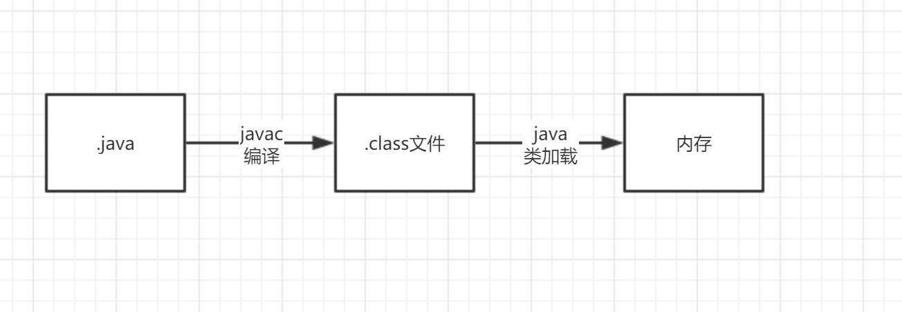
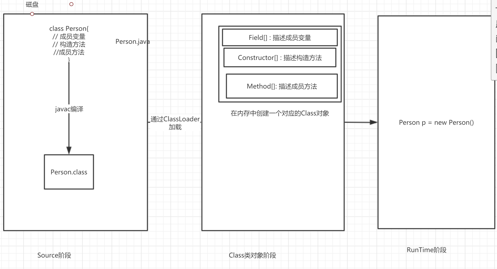
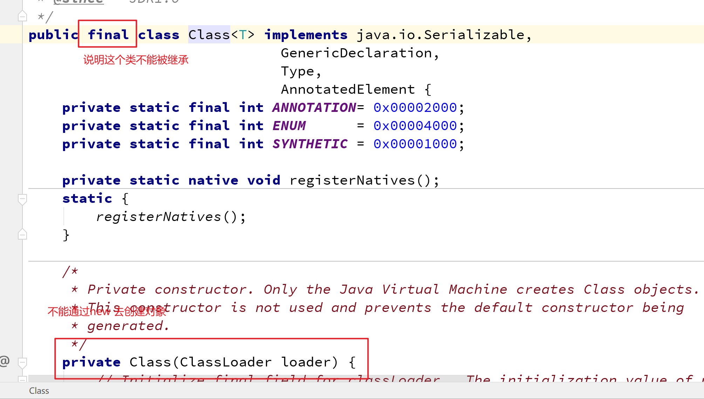
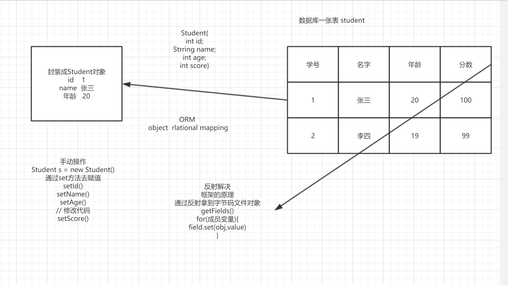

# 类加载



## 过程(了解)

**加载**

- 通过类加载器(ClassLoader)获取二进制字节流  在内存中创建一个java.lang.Class对象, 作为方法区中这个类的各个数据的访问入口

**连接**

- 验证

  - 保证类加载的正确性(验证是否是该类的字节码文件对象)
  - cafe babe "咖啡宝贝" magic number

- 准备

  - 为静态成员分配内存 并且赋默认初值

  - ```java
    static int a = 10;
    ```

    

- 解析

  - 把符号引用(编译原理)转化为直接引用(内存地址)

**初始化**

- 为静态成员赋初值  并且执行静态代码块中的内容

## 类加载器(了解)

功能:

获取二进制字节流的功能

**分类:**

- Bootstrap ClassLoader  根类加载器   加载java中的核心类  String  jdk1.8.0_271\jre\lib
- Extension ClassLoader   扩展类加载器   加载jre中的扩展目录的jar包    jdk1.8.0_271\jre\lib\ext
- System ClassLoader    系统/应用类加载器  加载我们自己写的类

## 类加载时机(重点)

- 实例化对象(new 对象)
- 访问类中的静态成员
- 调用类中的静态方法
- 加载某个类的子类的时候,会触发父类的加载
- java + 主类类名
- 反射 强制创建某个类或接口的Class对象

# java代码的3个阶段(了解)



# 反射机制(重点)

之前学习类 是观察类中的定义

## 什么是反射?

反射技术说白了就是获取运行时类当中的各种信息

## 如何获取字节码文件对象

字节码文件对象是反射技术的起点

**三种方式**

- Class.forName(全类名)
- 类名.class属性
- 创建一个对象  对象.getClass()

```java
package com.cskaoyan.cls;

import com.cskaoyan.domain.Stu;

/**
 * @description:
 * @author: songtao@cskaoyan.onaliyun.com
 **/

// 获取字节码文件对象的三种方式
public class Demo1 {
    public static void main(String[] args) throws ClassNotFoundException {
        // Class.forName()
        Class c1 = Class.forName("com.cskaoyan.domain.Stu");

        // 类名.class
        Class c2 = Stu.class;

        // c1和c2是一个东西吗
        System.out.println(c1 == c2);

        // 对象.getClass方法
        Stu stu = new Stu();
        Class c3 = stu.getClass();
        System.out.println(c1 == c3);
    }
}


```


**注意:**

通过3种方式获取的字节码文件对象都是同一个

类名.class方式不是完整的类加载  静态代码块中内容没有执行  推荐使用第一种方式

## 配置文件(Properties)

配置文件一般用来干什么?

一般用来放一些配置信息,数据库配置信息,第三方的一些账号信息 发邮件的  发短信的 

Properties

`Properties` 类表示了一个持久的属性集。`Properties`  可保存在流中或从流中加载。属性列表中每个键及其对应值都是一个字符串。


构造方法

Properties()        创建一个无默认值的空属性列表

成员方法

| void | load(InputStream inStream)        从输入流中读取属性列表（键和元素对）。 |
| ---- | ------------------------------------------------------------ |
| void | load(Reader reader)        按简单的面向行的格式从输入字符流中读取属性列表（键和元素对）。 |

| String | getProperty(String key)        用指定的键在此属性列表中搜索属性。 |
| ------ | ------------------------------------------------------------ |
|        |                                                              |

```java
package com.cskaoyan.config;

import java.io.FileInputStream;
import java.io.FileNotFoundException;
import java.io.IOException;
import java.util.Properties;

/**
 * @description:
 * @author: songtao@cskaoyan.onaliyun.com
 **/

public class Demo1 {
    public static void main(String[] args) throws IOException {
        //读取config文件
        // 创建一个properties对象
        Properties properties = new Properties();
        // load方法加载文件
        properties.load(new FileInputStream("config.properties"));
        // 读取
        String host = properties.getProperty("host");
        System.out.println(host);
        String user = properties.getProperty("user");
        System.out.println(user);
    }
}

```

配置文件连接数据库

```java
package com.cskaoyan.config;

import java.io.FileInputStream;
import java.sql.Connection;
import java.sql.DriverManager;
import java.sql.PreparedStatement;
import java.sql.ResultSet;
import java.util.Properties;

/**
 * @description:
 * @author: songtao@cskaoyan.onaliyun.com
 **/

public class Demo2 {
    public static void main(String[] args) throws Exception{
        // 不用配置文件连接数据库
        //String url = "jdbc:mysql://localhost:3306/test";
        //Connection connection = DriverManager.getConnection(url, "root", "123456");

        // 使用配置文件
        // 创建properties对象
        Properties properties = new Properties();
        // load加载文件
        properties.load(new FileInputStream("config.properties"));
        // 获取配置信息
        String url = properties.getProperty("url");
        String user = properties.getProperty("user");
        String password = properties.getProperty("password");
        Connection connection = DriverManager.getConnection(url, user, password);
        PreparedStatement preparedStatement = connection.prepareStatement("select * from user; ");
        // 执行查询操作
        ResultSet resultSet = preparedStatement.executeQuery();
        while (resultSet.next()) {
            int userId = resultSet.getInt("userId");
            String userName = resultSet.getString("userName");
            System.out.println(userId+ "---" +userName);
        }
        connection.close();
    }
}

```


字符流

```java
package com.cskaoyan.config;

import java.io.FileInputStream;
import java.io.IOException;
import java.io.InputStreamReader;
import java.util.Properties;

/**
 * @description:
 * @author: songtao@cskaoyan.onaliyun.com
 **/

public class Demo3 {
    public static void main(String[] args) throws IOException {
        // 创建Properties对象
        Properties properties = new Properties();
        //load(Reader reader)
        properties.load(new InputStreamReader(
                new FileInputStream("config.properties"),"GBK"));

        // getProperty
        String userName = properties.getProperty("userName");
        System.out.println(userName);

    }
}

```

注意:

- 配置文件里注释用#
- =可以替换为: 但是推荐使用=

## 关于Class



## 如何获取构造方法

获取所有构造方法

| Constructor<?>[] | getDeclaredConstructors()        返回 Constructor 对象的一个数组，这些对象反映此 Class  对象表示的类声明的所有构造方法。 |
| ---------------- | ------------------------------------------------------------ |
|                  |                                                              |

获取所有的public构造方法

| Constructor<?>[] | getConstructors()        返回一个包含某些 Constructor 对象的数组，这些对象反映此 Class  对象所表示的类的所有公共构造方法。 |
| ---------------- | ------------------------------------------------------------ |
|                  |                                                              |


获取单个构造方法

| Constructor<T> | getDeclaredConstructor(Class<?>... parameterTypes)        返回一个 Constructor 对象，该对象反映此 Class  对象所表示的类或接口的指定构造方法。 |
| -------------- | ------------------------------------------------------------ |
|                |                                                              |

| Constructor<T> | getConstructor(Class<?>... parameterTypes)        返回一个 Constructor 对象，它反映此 Class  对象所表示的类的指定公共构造方法。 |
| -------------- | ------------------------------------------------------------ |
|                |                                                              |

**实例化对象**

newInstance(Object... initargs)        使用此 Constructor  对象表示的构造方法来创建该构造方法的声明类的新实例，并用指定的初始化参数初始化该实例。

异常:

java.lang.IllegalAccessException    当我们去用私有的构造方法实例化对象的时候

```java
package com.cskaoyan.constructor;

import java.lang.reflect.Constructor;

/**
 * @description: 获取构造方法
 * @author: songtao@cskaoyan.onaliyun.com
 **/

public class Demo {
    public static void main(String[] args) throws Exception{
        // 获取字节码文件对象
        Class personCls = Class.forName("com.cskaoyan.domain.Person");
        // 获取所有的构造方法
        System.out.println("获取所有的构造方法");
        Constructor[] declaredConstructors = personCls.getDeclaredConstructors();
        for (Constructor constructor : declaredConstructors) {
            System.out.println(constructor);
        }
        // 获取所有的public的构造方法
        System.out.println("获取所有的public的构造方法----------");
        Constructor[] constructors = personCls.getConstructors();
        for (Constructor constructor : constructors) {
            System.out.println(constructor);
        }
        // 获取单个public构造方法
        System.out.println("取单个public构造方法-----------");
        Constructor constructor = personCls.getConstructor(int.class, String.class);
        System.out.println(constructor);
        // 获取单个的构造方法 去获取私用的构造方法
        System.out.println("取单个构造方法-----------");

        Constructor declaredConstructor = personCls.getDeclaredConstructor(int.class, String.class, boolean.class);
        System.out.println(declaredConstructor);

        // 利用构造方法去实例化对象
        System.out.println("利用构造方法去实例化对象");
        Object o = constructor.newInstance(20, "张三");
        System.out.println(o);

        // 利用私有的构造方法去实例化
        // 暴力破解    setAccessible(true)  忽略java语法检查
        declaredConstructor.setAccessible(true);
        Object o2 = declaredConstructor.newInstance(21, "李四", true);
        System.out.println(o2);
    }
}

```


## 如何获取成员变量

获取所有的成员变量

| Field[] | getDeclaredFields()        返回 Field 对象的一个数组，这些对象反映此 Class  对象所表示的类或接口所声明的所有字段。 |
| ------- | ------------------------------------------------------------ |
|         |                                                              |

获取所有的public的成员变量

| Field[] | getFields()        返回一个包含某些 Field 对象的数组，这些对象反映此 Class  对象所表示的类或接口的所有可访问公共字段。 |
| ------- | ------------------------------------------------------------ |
|         |                                                              |

获取指定的成员变量

| Field | getDeclaredField(String name)        返回一个 Field 对象，该对象反映此 Class  对象所表示的类或接口的指定已声明字段。 |
| ----- | ------------------------------------------------------------ |
|       |                                                              |

获取指定的public的成员变量

| Field | getField(String name)        返回一个 Field 对象，它反映此 Class  对象所表示的类或接口的指定公共成员字段。 |
| ----- | ------------------------------------------------------------ |
|       |                                                              |


给成员变量设置值 获取值

| Object | get(Object obj)        返回指定对象上此 Field 表示的字段的值。 |
| ------ | ------------------------------------------------------------ |
|        |                                                              |

| void | set(Object obj, Object value)        将指定对象变量上此 Field 对象表示的字段设置为指定的新值。 |
| ---- | ------------------------------------------------------------ |
|      |                                                              |

```java
package com.cskaoyan.field;

        import java.lang.reflect.Constructor;
        import java.lang.reflect.Field;

/**
 * @description: 获取成员变量
 * @author: songtao@cskaoyan.onaliyun.com
 **/

public class Demo {
    public static void main(String[] args) throws Exception{
        // 得到字节码文件对象
        Class personCls = Class.forName("com.cskaoyan.domain.Person");
        // 获取所有的成员变量
        System.out.println("获取所有的成员变量");
        Field[] declaredFields = personCls.getDeclaredFields();
        for (Field field : declaredFields) {
            System.out.println(field);
        }
        // 获取所有public的成员变量
        System.out.println("获取所有public的成员变量-----");
        Field[] fields = personCls.getFields();
        for (Field field : fields) {
            System.out.println(field);
        }
        // 获取单个的成员变量
        // Field getDeclaredField(String name)
        // 返回一个 Field 对象，该对象反映此 Class 对象所表示的类或接口的指定已声明字段。
        System.out.println("获取指定public的成员变量----------");
        Field name = personCls.getDeclaredField("name");
        System.out.println(name);

        System.out.println("获取指定成员变量--------");
        // 获取public的成员变量
        Field age = personCls.getField("age");
        System.out.println(age);
        // 给成员变量赋值  获取成员变量值-------
        System.out.println("给成员变量赋值  获取成员变量值-------");
        // 通过set方法
        // 创建对象
        Constructor declaredConstructor = personCls.getDeclaredConstructor();
        Object o = declaredConstructor.newInstance();
        age.set(o, 20);
        System.out.println(o);
        // get 方法
        Object o1 = age.get(o);
        System.out.println(o1);

    }
}


```


## 如何获取成员方法

获取所有的public的成员方法

| Method[] | getMethods()        返回一个包含某些 Method 对象的数组，这些对象反映此 Class  对象所表示的类或接口（包括那些由该类或接口声明的以及从超类和超接口继承的那些的类或接口）的公共 member 方法。 |
| -------- | ------------------------------------------------------------ |
|          |                                                              |


获取所有的成员方法

| Method[] | getDeclaredMethods()        返回 Method 对象的一个数组，这些对象反映此 Class  对象表示的类或接口声明的所有方法，包括公共、保护、默认（包）访问和私有方法，但不包括继承的方法。 |
| -------- | ------------------------------------------------------------ |
|          |                                                              |


获取单个的public的成员方法

| Method | getMethod(String name, Class<?>... parameterTypes)        返回一个 Method 对象，它反映此 Class  对象所表示的类或接口的指定公共成员方法。 |
| ------ | ------------------------------------------------------------ |
|        |                                                              |


获取单个的成员方法

| Method | getDeclaredMethod(String name, Class<?>... parameterTypes)        返回一个 Method 对象，该对象反映此 Class  对象所表示的类或接口的指定已声明方法。 |
| ------ | ------------------------------------------------------------ |
|        |                                                              |

如何调用方法

| Object | invoke(Object obj, Object... args)        对带有指定参数的指定对象调用由此 Method 对象表示的底层方法。 |
| ------ | ------------------------------------------------------------ |
|        |                                                              |

```java
package com.cskaoyan.method;

import java.lang.reflect.Constructor;
import java.lang.reflect.Method;

/**
 * @description:
 * @author: songtao@cskaoyan.onaliyun.com
 **/

public class Demo {
    public static void main(String[] args) throws Exception{
        // 获取字节码文件对象
        Class personCls = Class.forName("com.cskaoyan.domain.Person");
        // 获取所有的public的成员方法
        System.out.println("获取所有的public的成员方法--------");
        Method[] methods = personCls.getMethods();
        for (Method method : methods) {
            System.out.println(method);
        }
        // 获取所有的成员方法
        System.out.println("获取所有的成员方法--------");
        Method[] declaredMethods = personCls.getDeclaredMethods();
        for (Method method : declaredMethods) {
            System.out.println(method);
        }
        // 获取指定的public成员方法
        System.out.println("获取指定的public成员方法---------");
        Method eatMethod = personCls.getMethod("eat");
        System.out.println(eatMethod);
        // 获取指定的成员方法
        System.out.println("获取指定的成员方法---------");
        Method eatMethod2 = personCls.getDeclaredMethod("eat", String.class);
        System.out.println(eatMethod2);
        // 调用public方法
        // 创建一个对象
        Constructor declaredConstructor =
                personCls.getDeclaredConstructor();
        Object o = declaredConstructor.newInstance();
        eatMethod.invoke(o);
        // 调用非public
        eatMethod2.setAccessible(true);
        eatMethod2.invoke(o, "包子");
    }
}

```


# 补充了解(了解)

获取类的全类名  简单名

获取成员变量的权限修饰符 类型

获取成员方法的放回值类型  参数类型

获取这个类的父类  以及接口

```java
package com.cskaoyan.api;

/**
 * @description:
 * @author: songtao@cskaoyan.onaliyun.com
 **/

public class Demo {
    public static void main(String[] args) throws Exception{
        //使用字节码文件对象实例化
        Class c = Class.forName("com.cskaoyan.api.A");
        // 在这里能够实例化成功 本质上是借助了无参构造
        Object o = c.newInstance();
        System.out.println(o);
    }
}

class A {
    int a;

    public A(int a) {
        this.a = a;
    }

    public A() {
    }

    @Override
    public String toString() {
        return "A{" +
                "a=" + a +
                '}';
    }
}
```

```java
package com.cskaoyan.api;

/**
 * @description:
 * @author: songtao@cskaoyan.onaliyun.com
 **/

public class Demo2 {
    public static void main(String[] args) throws Exception{
        // 获取字节码文件对象
        //Class c = Class.forName("com.cskaoyan.domain.Person");
        Class c = Class.forName("java.lang.String");
        // 获取父类
        Class superclass = c.getSuperclass();
        System.out.println(superclass);
        // 获取接口
        Class[] interfaces = c.getInterfaces();
        for (Class i : interfaces) {
            System.out.println(i);
        }
    }
}

```

```java
package com.cskaoyan.api;

import java.lang.reflect.Field;
import java.lang.reflect.Method;
import java.lang.reflect.Modifier;

/**
 * @description:
 * @author: songtao@cskaoyan.onaliyun.com
 **/

public class Demo3 {
    public static void main(String[] args) throws Exception{
        // 获取字节码文件对象
        Class c = Class.forName("com.cskaoyan.domain.Person");
        // 获取全类名
        String name = c.getName();
        System.out.println(name);
        // 简单名
        String simpleName = c.getSimpleName();
        System.out.println("简单名 " + simpleName);
        // 获取权限修饰符
        Field[] declaredFields = c.getDeclaredFields();
        System.out.println(declaredFields[0]);
        int modifiers = declaredFields[0].getModifiers();
        System.out.println(modifiers);
        // 权限修饰符 int → 字符串
        String modifer = Modifier.toString(modifiers);
        System.out.println(modifer);
        // 获取成员方法 返回值类型
        Method[] declaredMethods = c.getDeclaredMethods();
        System.out.println(declaredMethods[1]);
        Class returnType = declaredMethods[1].getReturnType();
        System.out.println(returnType);
        // 获取方法的参数类型
        Class[] parameterTypes = declaredMethods[1].getParameterTypes();
        System.out.println(parameterTypes[0]);
    }
}

```


# 应用场景(了解)

一般用在框架当中



