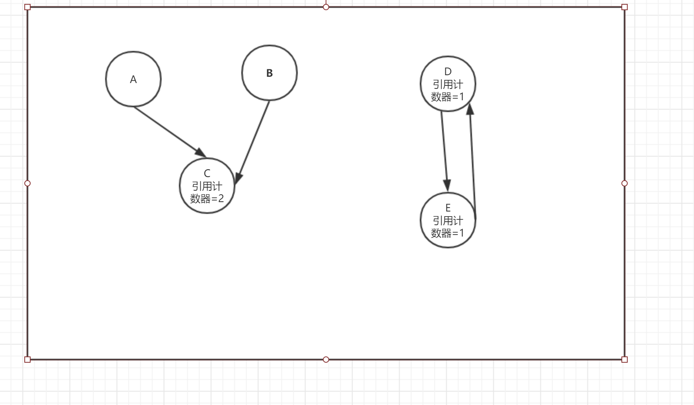
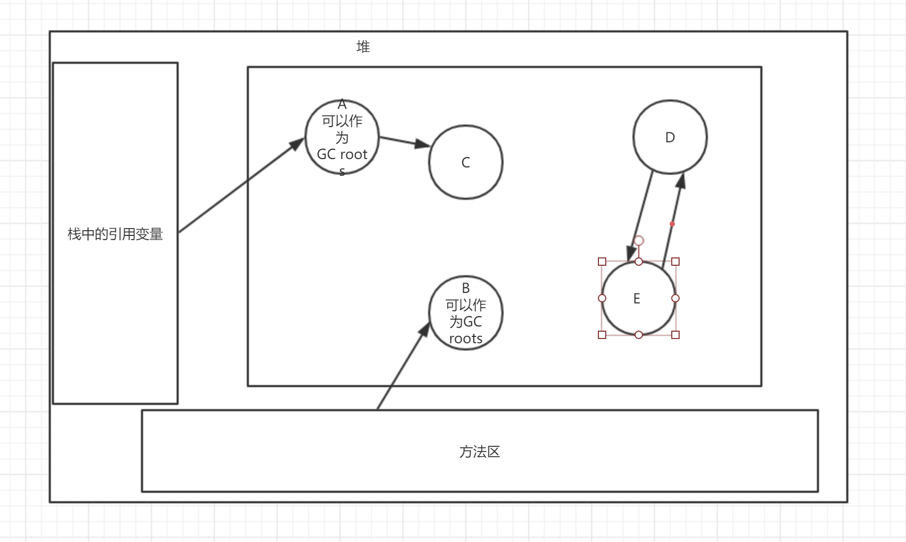
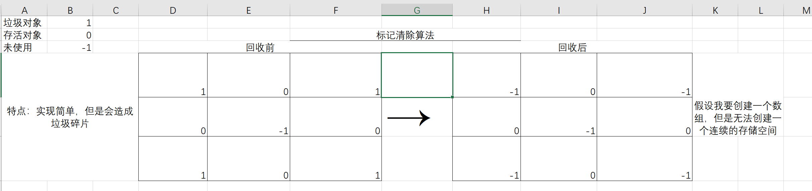
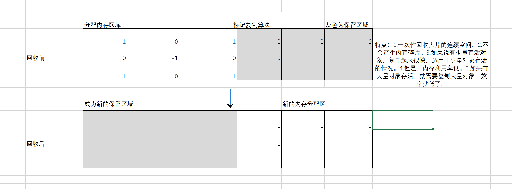
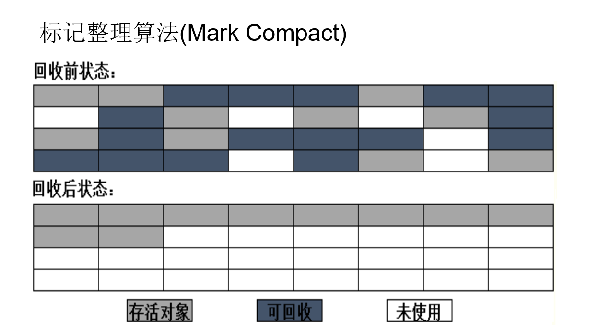
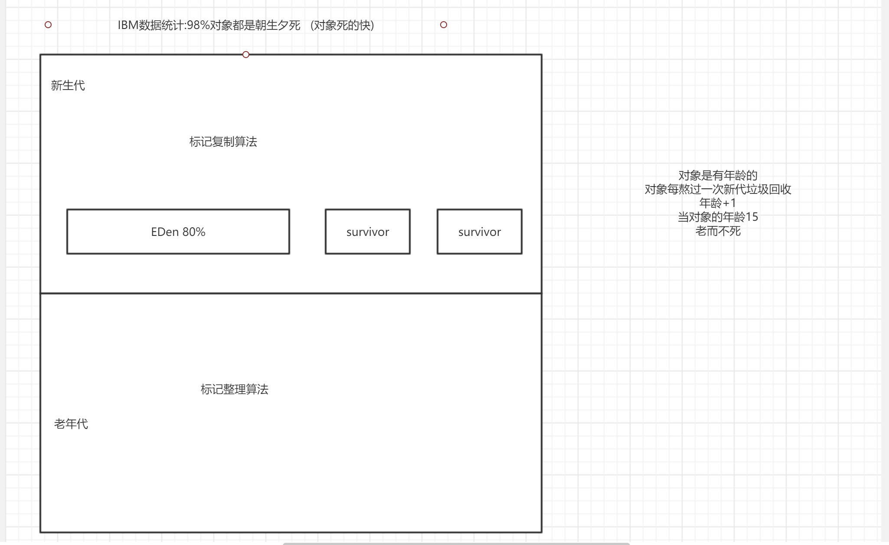

# 内存管理

## 显式的内存管理

内存管理 交给程序员管理 

分配  回收    C++

malloc()    free()

缺点:

- 内存泄漏
- 野指针

## 隐式的内存管理

内存管理交给系统  

优点：增加了程序的可靠性，减小了memory leak
缺点：无法控制GC的时间，耗费系统性能

# GC

## 谁是垃圾?

### 引用计数算法

无法解决循环引用的问题

### 根搜索算法

这个算法的基本思想是将一系列称为“GC Roots”的对象作为起始点
从这些节点开始向下搜索
搜索所走的路径称为引用链
当一个对象到所有的GC root之间没有任何引用链相连，时，就认为该对象变成了垃圾

GC Roots包含对象呢？
虚拟机栈中引用的对象
方法区中的静态属性引用的对象

解决循环引用问题

## 怎么回收垃圾?

### 标记清除算法

### 标记复制算法

### 标记整理(压缩)算法

### 分代收集算法

## 什么时候回收垃圾?

- 申请堆内存失败
- 程序进入休眠状态
- System.gc()手动回收

GC相关概念
Shallow size 
     就是对象本身占用的内存大小，也就是对象头加成员变量   
     占用内存大小的总和
Retained size 
     是该对象自己的shallow size 加上仅可以从该对象访问（直
     接或者间接访问）的对象的shallow size之和。
Retained size
     是该对象被GC之后所能回收的内存的总和。

