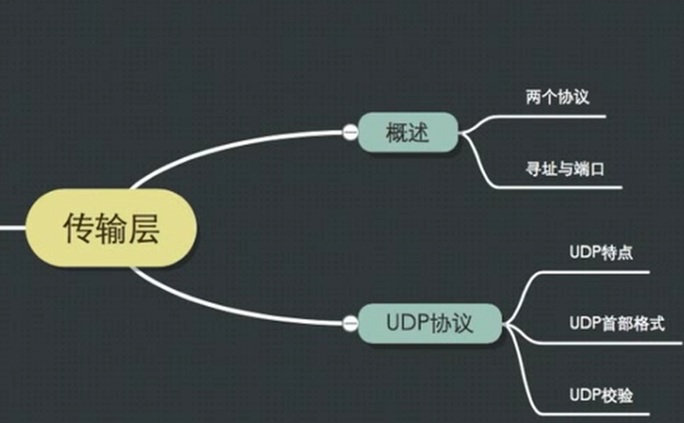
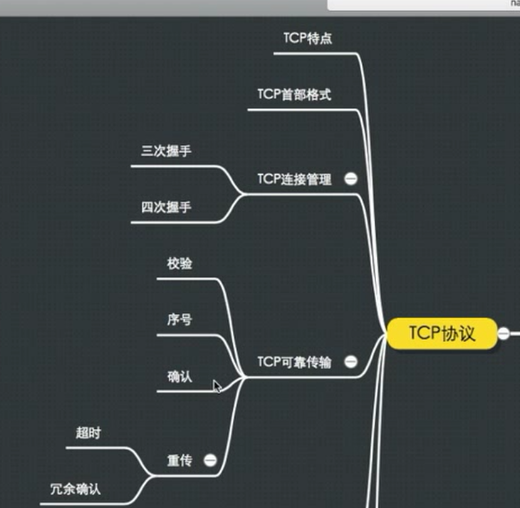
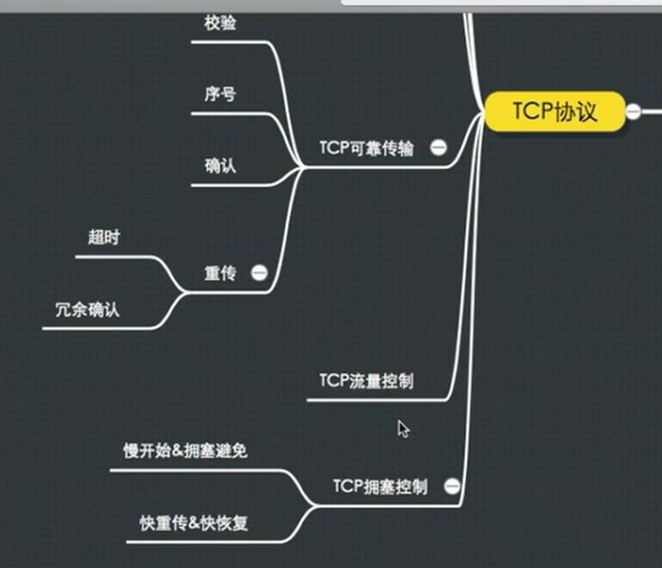

# Transfer Layer 

[python 实现 Transfer Layer](https://blog.csdn.net/sinat_38682860/article/details/82764554)

[c 实现Transfer Layer](https://blog.csdn.net/weixin_42167759/article/details/81255812)

查看本机的[sokect](https://blog.csdn.net/weixin_43056962/article/details/83752694)

[TCP 序列號 (Sequence Number, SEQ)](https://notfalse.net/26/tcp-seq)

## 脑图

