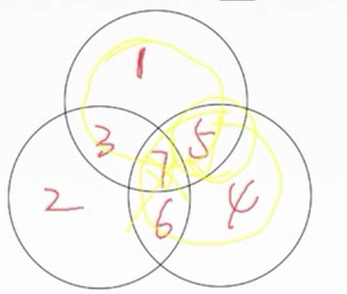

# data link layer

## 功能

### 为啥会有这些功能

​	想象一下，连接网络的时候，网络检测是不是需要连接管理?
​	之后，网络流量是不是要控制一下，毕竟快了无法识别数据，
​	还有物理层没有纠错功能，需要纠错功能功能，，在有限电视网络中，如果没有纠错，会导致重传太多，当然，也可以用路由器存储转发功能。
​	自然而然的，要实现上面的功能和比特流不可能一直发送吧，所以要封装成帧，从而实现透明传输

### 计算机网络中比特的检错与纠错是在链路层还是传输层？

解决：https://www.zhihu.com/question/298063335/answer/510272317

不同的应用采用不同的解决方法。

相似问题：[数据链路层有校验了，为什么网络层还要校验，运输层仍需要校验？](https://www.zhihu.com/question/20184058)

## 为啥会分层实现不同协议和功能，其中协议的功能重复？比如ddl 的 差错检测和 tcp的差错检车，还有ip的差错检测。

网络需求不一样。比如 ，看视屏 并不需要 完全的 数据无误，可以使用udp. 

传文件保证数据正确，所以使用tcp。

而分层实现不同功能可以使其应用更广泛。就像模块化一样的。可以选择自己需要的协议来达到需求与资源的最大化。

分层也为网络体系实现了简单化。

## 重要：相似问题：[数据链路层有校验了，为什么网络层还要校验，运输层仍需要校验？](https://www.zhihu.com/question/20184058)

数据链路层的差错检测保证了点对点的传送安全，但是路由器可能分片出错。

网络层确实没必要 ，网络层校验只是校验了头部。

translate layer 校验了全部。 

在ipv6中，net layer 已经不校验了。

还有一件事，这个应该也有历史因素，以前的设备出错高，可能处处校验。保证错误的数据不会占用数据链路流量，ip层校验出错就丢弃。现在出错降低，在两个传输结点中，如果通信质量好，就不需要校验了。

# 封装成帧

------

## 为啥会有最大传送单元MTU

作者：冬瓜哥已被Jin言
链接：https://www.zhihu.com/question/31460305/answer/161488126
来源：知乎
著作权归作者所有。商业转载请联系作者获得授权，非商业转载请注明出处。

其原因如下：首先，底层网络I/O控制器是按照一帧一帧向网线上传送数据的，该帧有一定大小限制，原因取决于传送链路的性质，有些链路连续传送大量用户数据之后，通信双方的时钟会变得不同步，导致问题。 另外，对于上行链路，会有多个计算机的数据帧排队等待传输，如果某个数据帧太大的话，那么其他数据帧等待的时间就会加长，导致体验变差，这就像一个十字路口的红绿灯，你可以让绿灯持续亮一小时，但是等红灯的人一定不愿意的，所以，公平，是限制帧长度的一个最重要的原因。 再者，网络I/O控制器需要从Host端主存中的缓冲区中取数据，缓冲区的大小是有限制的，Host主存资源有限，一般无法分配太大的缓冲区，只能将数据碎片化，一小份一小份的放置，并用环形队列追踪组织起来。另外，如果一次传送太大量的数据，一旦该数据中有一小部分被干扰，那么接收方的数据校验算法由于无法判断具体是哪里产生了错误以及如何修复错误，所以只能将这份数据全部丢弃，并通知发送方重传，这极度浪费了网络带宽资源。还有，如果一份数据太大，则接收方必须将该数据全部接收完之后，才会通知上游程序“有新数据到了请来处理”，这个延迟太大了，如果能将数据切片，一小片一小片传递，那么接收方的处理程序可以更快的拿到数据，虽然数据本身并不完整，但是程序可以经过设计，也跟着一点一点的处理数据，这样，形成类似流水线的过程，反而能够增加最终的数据处理速度。 至于为什么是1500字节，这个就得综合各种因素最终拍板，拍脑袋决定，当然你说定为2K不行么？行，你先进入标准组织，就可以试试。

[来源：为什么以太网mtu值被设定为1500?](https://www.zhihu.com/question/31460305)

------------

## 透明传输

个人理解，透明传输其实就是指无论是什么报文都可以传输，非透明传输就是指某些特殊字符不能传输，在计算机网络中，透明传输在数据链路层提到过，在数据链路层将网络层协议封装成帧时，会在首部和尾部分别添加SOH以及EOT这两个特殊字符，接收方是根据这两个字符来确定帧首和帧尾的，如果上层协议发送过来的数据(即链路层的数据部分)包含EOT，那么接收方在解析这个帧的时候就会误以为数据已经结束，所以，如果链路层对这种情况没有特殊处理，那么就可以理解链路层为非透明传输(因为无法传输EOT这个字符)，但是数据链路层通过对这个字符添加转移符(如果网络层数据中还存在转移符，就再添加一个转移符)的办法来使数据部分可以传输EOT字符，就实现了透明传输。本人网络小菜鸟，不知道表述是否清楚。。。

作者：环游世界的鱼
链接：https://www.zhihu.com/question/34774349/answer/95777816
来源：知乎
著作权归作者所有。商业转载请联系作者获得授权，非商业转载请注明出处。

> 比特填充法 和  违规编码法 是 常用的 实现透明传输的手段
>
> 字符技术和 字符填充 不常用

-------------

# 	差错控制

---------------

## 循环冗余检车编码crc

> CRC 冗余码  要比  生成 多项式 少一位 ， 也就是说 ，crc冗余码 位数等于生成多项式的位数。
>
> **crc 计算 过程：**
>
> ​	**生成检验编码：**
>
> ​		1.确定多项式位数 
>
> ​		2.位数n -1 为 冗余码的 位数
>
> ​		3.将全为0的冗余码 添加到  被检验编码的 后面
>
> ​		4.被检验编码和冗余码组成的编码与生成多项式做异或运算，得到冗余码位数的余数
>
> ​		5.将余数加在被检验编码末尾。
>
> ​	**接受后检验错误：**
>
> ​		组合编码和生成多项式做异或运算，如果为 0 ，则没错
>
> ​		余数不为0，则出错，丢弃。
>
> 理解：	
>
> ​		

----

## 纠错编码

#### 

> ​		**海明码检错距离与 纠错距离 和 码距的关系**
>
> 
>
> 码距需要的码距： d
>
> 检错需要的码距：d+1
>
> 纠错需要的码距：2d+1
>
> ---------
>
> **海明码纠错过程：**
>
> ​	1.**确定校验码位数**
>
> ​			
>
> 2.**确定海明码插入元数据的位置**
>
> ​			
>
> 3.**设置海明码的数据值**
>
> ​	
>
> 4.判断海明码的错误位置 并纠错。
>
> ​		
>
> ​		**如何判断错误的位数：**
>
> ​					**方式一：** 集合法
>
> ​		
>
> ​	**方式二**：矩阵法
>
> ​			

 

# 停止等待协议

## 脑图

