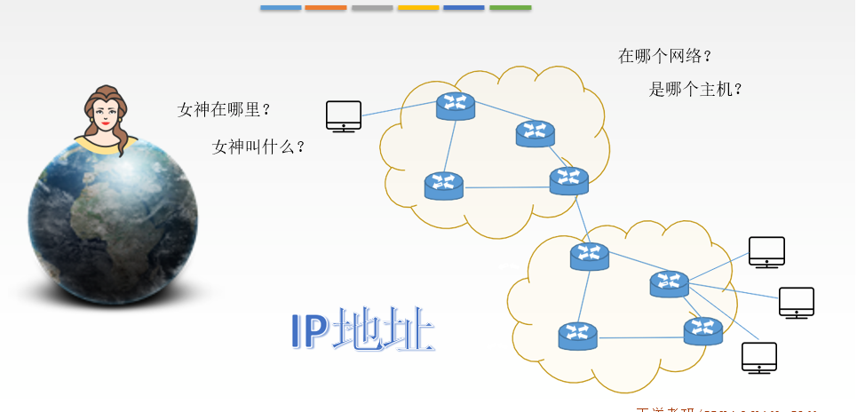
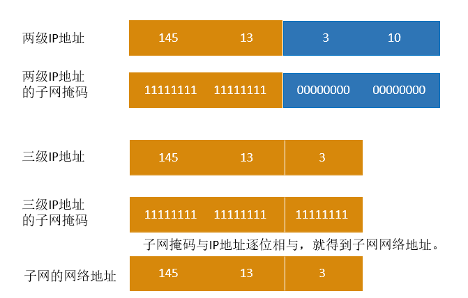

# 网络层

网络层 主要 是  ： 

构建异构网络 

选择路由

差错报告。

## 脑图

--------

[wireshark 抓包](https://blog.csdn.net/weixin_34205826/article/details/86012458?utm_medium=distribute.pc_relevant.none-task-blog-BlogCommendFromMachineLearnPai2-1.add_param_isCf&depth_1-utm_source=distribute.pc_relevant.none-task-blog-BlogCommendFromMachineLearnPai2-1.add_param_isCf)

### 题目没做

子网掩码？？？

没复习

## 网络层的功能

#### **网络层**

主要任务是把分组从源端传到目的端，为分组交换网上的不同主机提供通信服务。 网络层传输单位是数据报。

**功能一：路由选择与分组转**发 最佳路径

	

**功能一：路由选择与分组转****发** 最佳路径

**功能二：异构网络互联 **

**功能三：拥塞控制**

若所有结点都来不及接受 分组，而要丢弃大量分组 的话，网络就处于**拥塞**状 态。因此要采取一定措施， 缓解这种拥塞。

## IP数据报格式

## IP数据报分片

#### **最大传送单元****M****T****U**

链路层数据帧可封装数据的上限。 以太网的MTU是1500字节。

	

如果所传送的数据 报长度超过某链路 的MTU值？

#### **I****P****数据报格式**

#### **I****P****数据报分片例题**

## IPv4地址

#### **IP****地址**

#### **IP****编址的历史阶****段**

#### **分类的****IP****地址**

#### **互联网中的****I****P****地址**

#### **分类的****IP****地址**

#### **特殊****I****P****地址**

## 网络地址转换（NAT）

#### **私有****I****P****地址**

网络地址转换NAT（Network Address Translation）：在专用网连接到因特网的路由器上安装NAT软件，安装了NAT

软件的路由器叫**NAT****路由器**，它至少有一个有效的**外部全球****IP****地址**

## 子网划分 与[子网掩码](https://mp.weixin.qq.com/s/jAITB4o1nnO5M2wt0hDqjw)

#### **子网划****分**

## **子网掩码**

## 无分类编址CIDR

## DHCP协议

###### 主机如何获取ip地址？

**静态配置**

​	ip address 

​	子网掩码

​	默认网关

**动态配置**

​	 

### Dhcp协议

 

## ICMP协议

### ICMP差错报文

###  

### icmp询问报文

###  icmp应用

## IPv6

#### 为啥会有IPv6

 

#### ipv6的数据报格式

#### ipv6与ipv4区别

#### ipv6地址表示形式

#### ipv6基本地址类型

#### ipv6向ipv4过度的策略

#### 脑图

-----

## RIP（ROuting information protcol）协议和相关的路由向量算法

#### 路由选择协议分类回顾

#### RIP协议

RIP是一种分布式的基于**距离向量**的路由选择协议，是因特网的协议标准，最大优点是**简单**。

RIP协议要求网络中每一个路由器都维护**从它自己到其他每一个目的网络的唯一最佳距离记录**（即一组距离）。

距离：通常为“跳数”，即从源端口到目的端口所经过的路由器个数，经过一个路由器跳数+1。特别的，从一路 由器到直接连接的网络距离为1。RIP允许一条路由最多只能包含15个路由器，因此距离为**16**表示网络不可达。

RIP协议只适用于**小互联网**。

和哪些路由器交换信息？

在什么时候交换信息？

交换什么信息？

#### **RIP****协议和谁交换？多久交换一次？交换什么****？**

#### 距离向量算法

1.修改相邻路由器发来的RIP报文中**所有表****项**

对地址为X的相邻路由器发来的RIP报文，修改此报文中的所有项目：把“下一跳”字段中的地址改为X，并把

**所有的“距离”字段****+1**。

2.对修改后的RIP报文中的每一个项目，进行以下步骤：

1R1路由表中若没有Net3，则把该项目填入R1路由表

2R1路由表中若有Net3，则查看下一跳路由器地址：

若下一跳是X，则用收到的项目替换源路由表中的项目；

若下一跳不是X， 原来距离比从X走的距离远则更新，否则不作处理。

3.若**180s**还没收到相邻路由器X的更新路由表，则把X记为不可达的路由器，即把距离设置为16。

4.返回

#### **距离向量算法练习****1**

#### **距离向量算法练习****2**

#### **R****IP****协议的报文格式**

#### **RIP****协议好消息传得快，坏消息传得慢**

RIP的特点：当网络出现故障时，要经过比较长的时间 (例如数分钟) 才能将此信息传送到所有的路由器，“慢收敛”。

#### 脑图

## OSPF协议及链路状态算法

#### **OSPF****协议**

开放最短路径优先OSPF协议：“开放”标明OSPF协议不是受某一家厂商控制，而是**公开发表**的；“最短路径优先” 是因为使用了**Dijkstra**提出的**最短路径算法****SPF**。

OSPF最主要的特征就是使用分布式的**链路状态协议。**

OSPF的特点：

#### **链路状态路由算****法**	

**链路状态路由算****法**

1.每个路由器发现它的邻居结点【HELLO问候分组】，并了解邻居节点的网络地址。

2.设置到它的每个邻居的成本度量metric。

3.构造【DD数据库描述分组】，向邻站给出自己的链路状态数据库中的所有链路状态项目的摘要信息。

4.如果DD分组中的摘要自己都有，则邻站不做处理；如果有没有的或者是更新的，则发送【LSR链路状态请求分组】

请求自己没有的和比自己更新的信息。

5.收到邻站的LSR分组后，发送【LSU链路状态更新分组】进行更新。

6.更新完毕后，邻站返回一个【LSAck链路状态确认分组】进行确认。 只要一个路由器的链路状态发生变化：

7.泛洪发送【LSU链路状态更新分组】进行更新。

8.更新完毕后，其他站返回一个【LSAck链路状态确认分组】进行确认。

9.使用Dijkstra根据自己的链路状态数据库构造到其他节点间的最短路径。

#### **OSPF****的区****域**

#### **OS****PF****分组**

#### **OSPF****其他特****点**

1.每隔**30min**，要刷新一次数据库中的链路状态。

2.由于一个路由器的链路状态只涉及到与相邻路由器的连通状态，因而与整个互联网的规模并无直接关系。因 此当**互联网规模很大**时，OSPF 协议要比距离向量协议 RIP 好得多。

3.OSPF不存在坏消息传的慢的问题，它的**收敛速度很快**。

## BGP协议

## ip组播

#### **脑图时****刻**

## **移动****IP**  ---手机如何保证ip不变的

#### **移动****IP****相关概念**

移动IP技术是移动结点(计算机/服务器等)以**固定的网络****IP****地址**，实现跨越不同网段的**漫游**功能，并保证了

基于网络IP的网络权限在漫游过程中不发生任何改变。

移动结点 具有永久IP地址的移动设备。

归属代理（本地代理）一个移动结点的永久“居所”称为**归属网络**，在归属网络中代表移动节点执行移 动管理功能的实体叫做归属代理。

永久地址（归属地址/主地址）移动站点在归属网络中的原始地址。

外部代理（外地代理）在**外部网络**中帮助移动节点完成移动管理功能的实体称为外部代理。

转交地址（辅地址）可以是外部代理的地址或动态配置的一个地址。

#### **移动****IP**

#### **移动****I****P****通信过****程**

-----------

## 网络层设备

#### **路由器**

#### **输入端口对线路上收到的分组的处理**

输入端口中的查找和转发功能在路由器的交换功能中是最重要的。

#### **输出端口将交换结构传送来的分组发送到线****路**

若路由器处理分组的速率赶不上分组进入队列的速率，则队列的存储空间最终必定减少到零，这就使后面再进入

队列的分组由于没有存储空间而只能被丢弃。

**路由器中的输入或输出队列产生溢出是造成分组丢失的重要原因****。**

#### **三层设备的区****别**

**路由****器** 可以互联两个不同网络层协议的网段。

**网****桥** 可以互联两个物理层和链路层不同的网段。

**集线****器** 不能互联两个物理层不同的网段。

#### **路由表与路由转发**

路由表根据**路由选择算法**得出的，主要用途是路由选择，总用软件来实现

转发表由**路由表**得来，可以用软件实现，也可以用特殊的硬件来实现。转发表必须包含完成转发 功能所必需的信息，在转发表的每一行必须包含从要到达的目的网络到输出端口和某些MAC地址 信息的映射。

#### [路由表与转发表区别](https://www.zhihu.com/question/23328152)

