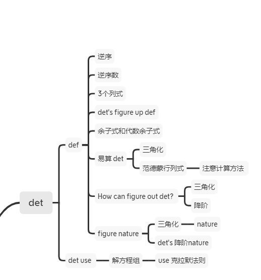
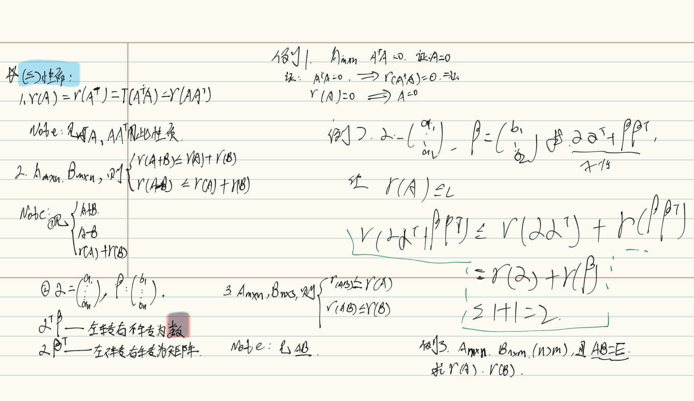

#   	det

## 脑图 

# matrix

## 脑图

 

###   逆矩阵性质 	

## 矩阵的秩

#### 定义       

#### 秩的求发

#### 性质

# vector

## 脑图

# equation set

## 脑图

### 例题

#### 解的结构与性质

#### 含参方程组的解的讨论。

----------------

# FIVE:特征值与特征向量

## 特征值与特征向量

## 矩阵相似

### 性质

### 实对称矩阵的性质

## 矩阵对角化

为啥m<n不行？

对角化干嘛用？

​		求lambda?

从视频20 节开始 ， 速度 搞了 一遍 ， 没做笔记 ， 后面再说。

