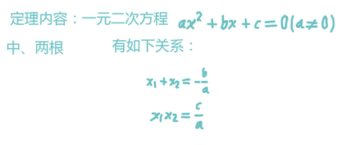
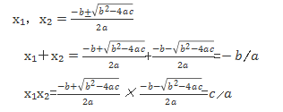

# 学习思路 在 总结 

### 如何学习 ？

目的 ： 应用 或 考试 

了解考试的 东西 

大脑形成 结构 

做题 应用 适应 

总结方式 。 

### 如何学：

第一遍 看大概的 内容 

第二遍 总结 内容  考纲 重点  思路  

第三遍 做题   考的题型 常用做题 思路

整理形成 架构 

# 学习速度和效率 时间的关系（避免 压力大间接性放弃）

重在效率 而不是 而不是 时间 。

每天充足的8H 就行。

要看书的时候 专注 且 think。

之后 留足休息时间

# 计算思路有问题

- 计算时 ，**考虑 符号 和 值 ，分别考虑**
- 计算 **列式子 写清楚**
- **乘除才能化简 ，加减 不行** 
- 分式的化简 一定是 **分母 和 分子** 才能 化简  且 在一个 **分式子** 中， **化简 确定 在分式中 ， 且 无 加减 限制 。 分子 与 分母 化简**

如果 后面 还出现这些问题 ，专门 找个 东西 来训练。

why error? :

- 初中 学习 的 时候 就 没有 学好 如何 做的 思路 ， 只是 凭 感觉 ， 所以 一直 不行 
- 如何 解决 ？ 
- 搞清楚 每次 出现 的 问题 ，并 记录 ， 理清 思路 ， 计算时 ，加上 思路 规则限制就行 了

# 做题 思路 

- 先分析 题意
- 分析能用的知识点 
- 找出 做题大概思路
- 计算 调整 
- 验证 ，

# 算数套路

ln2*x=xln2

运用等价无穷小 ：

判断是否是无穷小，分子分母 的问题 ，之后 在 算。

洛必达法则 

必须 分子分母 是 不定式。 

# 求 极限

- 直接求导
- 不定式 可以用 洛必达法则
- 无穷小 可以 用 等价 无穷 小 代换
- 夹逼定理 缩放

# 比较大小

可以 用 求极限 或者 拉格朗日中值定理 代换

# [一元二次方程解法](http://www.xinhuanet.com/science/2018-07/10/c_137311929.htm)

韦达定理

数学家弗朗索瓦·韦达于1615年在《论方程的识别与订正》一书中建立了方程根与系数的关系，由于韦达最早发现代数方程的根与系数之间有这种关系，因此，人们把这个关系称为韦达定理。

韦达定理最重要的贡献是对代数学的推进，它最早系统地引入代数符号，推进了方程论的发展，用字母代替未知数，指出了根与系数之间的关系。韦达定理指出：一元二次方程中两根的和等于它的一次项系数除以二次项系数所得的商的相反数；两根的积等于它的常数项除以二次项系数所得的商。

韦达定理在求根的对称函数、讨论二次方程根的符号、解对称方程组以及解一些有关二次曲线的问题都凸显出独特的作用。

接下来就让我们深入了解学习一下韦达定理，设一元二次方程ax²＋bx＋c=0中(a，b，c∈R，a≠0)，设此一元二次方程有两根x₁、x₂，有如下关系：

由一元二次方程求根公式如下：

韦达定理与根的判别式的关系更是密不可分。一元二次方程的根的判别式为：△=b2-4ac（a，b，c分别为一元二次方程的二次项系数，一次项系数和常数项）。

根的判别式是判定方程是否有实根的充要条件，韦达定理说明了根与系数的关系。无论方程有无实数根，实系数一元二次方程的根与系数之间适合韦达定理。判别式与韦达定理的结合，则更有效地说明与判定一元二次方程根的状况和特征。

韦达定理为数学中的一元方程的研究奠定了基础，对一元方程的应用创造开拓了广泛的发展空间。

已知两个根其中的一个，就可以代入韦达定理的关系式里求得另一个根，并且还可以用另一个关系式来检验。

假设现在有一个一元二次方程2x2－7x＋6=0，一个根等于2，求另外一个根为多少。

解法如下:

由一元二次方程的根与系数的关系，我们知道a=2，b=﹣7，c=6；由判别式△=49-4×2×6=1>0可知，此方程有两个不相等的实数根；那么我们就可设方程两个根分别为x₁、x₂，已知其中一个2。

根据韦达定理，可知①x₁x₂=6/2  ②x₁+ x₂=7/2

得出x₁=2，x₂=3/2

因韦达定理可快速求出两方程根的关系的特性，所以它在数学及实际生活中，运用十分广泛，在初等数学、解析几何、平面几何、方程论中均有体现。

# 计算不定积分

是否 可以化简

是否可以 利用 不定积分性质 分离 

是否 可以 利用 积分表 求 积分 

积分时注意 复合函数 的化简，看是否有 复合函数

 c ，不要忘了

最后 ，通过 求导 验证。

# 计算积分

根据做题思路 ，决定能否 计算 积分

- 基本公式 行不行
- 换元行不行
- 分部积分行不行。
- 有理函数积分？

# 积分的应用

在 应用中 ，可以 利用微分 方程 => 原函数 

 **注意 微分 方程 和 原函数 的 关系 和 表达式   ， 在 s- v 中 ， 做错 1 次 。 应该 s= | v dt  而不是** s=| v *t  dt

# 去|a|

运算 去 |a| 注意 加 +-号。 a 可能 为 + 或者 -

# 三角函数的积分和微分

三角函数的积分和微分的不同 ， 计算的时候 还 注意 ，。

1.如何 计算 积分 。

2. 通过 由 原函数 -》导数。

# 向量的数量积

#### 向量积右手定则使用bai方法如下：

右手除姆指外的四指du合并，姆指与其他四指垂直，zhi四指由daoA向量的方向握向B向量的方向，这时姆指的指向就是A，B向量向量积的方向。就是说，AB向量积的方向垂直于AB向量确定的平面。如下图所示：

向量积，数学中又称外积、叉积，物理中称矢积、叉乘，是一种在向量空间中向量的二元运算。与点积不同，它的运算结果是一个向量而不是一个标量。并且两个向量的叉积与这两个向量和垂直。其应用也十分广泛，通常应用于物理学光学和计算机图形学中。

扩展资料

向量积的代数规则

1、反交换律：a×b=-b×a

2、加法的分配律：a×（b+c）=a×b+a×c。

3、与标量乘法兼容：（ra）×b=a×（rb）=r（a×b）。

4、不满足结合律，但满足雅可比恒等式：a×（b×c）+b×（c×a）+c×（a×b）=0。

5、分配律，线性性和雅可比恒等式别表明：具有向量加法和叉积的R3构成了一个李代数。

6、两个非零向量a和b平行，当且仅当a×b=0。

参考资料：百度百科-向量积

# 关于四则运算出错问题 

在思路清晰 的 前提下，

草稿 清晰，不能存在看错 等问题 。

四则运算 出错 ， 及 使用 竖式计算

# 理解出现问题如何解决

看题 出现 关键词 

对比 记忆关键词如何 运行的 

寻找 不同。

# [符号的读法](http://ccckmit.wikidot.com/ma:symbol)

| 大寫 | 小寫 | 寫法    | 念法       | 提示                                         |
| ---- | ---- | ------- | ---------- | -------------------------------------------- |
| Α    | α    | alpha   | ʹæ lfə     |                                              |
| Β    | β    | beta    | ʹbetə      |                                              |
| Γ    | γ    | gamma   | ʹgæ mə     |                                              |
| Δ    | δ    | delta   | ʹdɛltə     |                                              |
| Ε    | ε    | epsilon | ʹepsɪlən   | 與Υυ 的區分在第一個音為 e                    |
| Ζ    | ζ    | zeta    | ʹzitə      |                                              |
| Η    | η    | eta     | ʹeɪtə      |                                              |
| Θ    | θ    | theta   | ʹθitə      |                                              |
| Ι    | ι    | iota    | aɪʹɔʊtə    | iota                                         |
| Κ    | κ    | kappa   | ʹkæ pə     |                                              |
| Λ    | λ    | lambda  | ʹlæ pə     |                                              |
| Μ    | μ    | mu      | ʹmjuə      |                                              |
| Ν    | ν    | nu      | ʹnju       |                                              |
| Ξ    | ξ    | xi      | ʹsaɪ       | cy, 為了與Ψψ 區分可念 k-si , 也有人念 zi     |
| Ο    | ο    | omicron | ʹɔʊmaɪkrən |                                              |
| Π    | π    | pi      | ʹpaɪ       | 有 py 與 ʹpaɪ 兩種念法                       |
| Ρ    | ρ    | rho     | ʹrɔʊ       |                                              |
| Σ    | σ    | sigma   | ʹsɪgmə     |                                              |
| Τ    | τ    | tau     | ʹtau       |                                              |
| Υ    | υ    | upsilon | ʹjupsɪlən  | 與 Ε ε 的區分在第一個音為 u 或 a             |
| Φ    | φ    | phi     | ʹfaɪ       | fy                                           |
| Χ    | χ    | chi     | ʹkaɪ       | ky                                           |
| Ψ    | ψ    | psi     | ʹpsaɪ      | cy, 為了與 Ξ ξ 區分可念 p-si, 也有人念 ʹpsaɪ |
| Ω    | ω    | omega   | ʹɔʊmɛgə    |                                              |

# 偏导数符号的正规读法是什么?

| ∂    | round  dor partial d |      |
| ---- | -------------------- | ---- |
|      |                      |      |

This is the partial derivative of *f* with respect to *x*. Here ∂ is a rounded *d* called the **partial derivative symbol**. To distinguish it from the letter *d*, ∂ is sometimes pronounced "tho" or "partial". 

——[Partial derivative](https://link.zhihu.com/?target=https%3A//en.wikipedia.org/wiki/Partial_derivative%23Notes)

作者：哭笑不得
链接：https://www.zhihu.com/question/22355447/answer/499143590
来源：知乎
著作权归作者所有。商业转载请联系作者获得授权，非商业转载请注明出处。

----

# 不定积分 在 数列 中 的 应用 公式 

别搞错 了 

f(1/n)

# 思路不唯一

当做不出题目的时候 ， 回去 检查 步骤 ，每一步都不一定是唯一的 。

根据 有的 想法 推导。

# 定积分

​	积分变量变换要变号。

# 研究函数

过程 

极限--连续--可导 --可微分 --定积分。

# 偏增量读法

偏导数bai的表示符号为：∂。∂读作round。 partial 

∂：是希腊du字母δ的古典写法,数学里只用作zhi表示偏dao导数的记号,在表示偏导数的时候,一般不念字母名称,中国人大多念作“偏”(例如 z对x的偏导数,念作“偏z偏x”）。

偏导定义：

当函数 z=f(x,y) 在 (x0,y0)的两个偏导数 f'x(x0,y0) 与 f'y(x0,y0)都存在时，我们称 f(x,y) 在 (x0,y0)处可导。如果函数 f(x,y) 在域 D 的每一点均可导，那么称函数 f(x,y) 在域 D 可导。

对应于域 D 的每一点 (x,y) ，必有一个对 x (对 y )的偏导数，因而在域 D 确定了一个新的二元函数，称为 f(x,y) 对 x (对 y )的偏导函数。

扩展资料：

x方向的偏导：设有二元函数 z=f(x,y) ，点(x0,y0)是其定义域D 内一点。把 y 固定在 y0而让 x 在 x0 有增量 △x ，相应地函数 z=f(x,y) 有增量（称为对 x 的偏增量）△z=f(x0+△x,y0)-f(x0,y0)。

https://zhidao.baidu.com/question/5313972.html

# 做题的逻辑性

做题前 想好 如何 做 ，

做的 时候 反馈 。

做完检查思路。

# 学习领悟

思考 比一直写 重要 ，

先要想好思路，或者确定大概的方向 。

做题 完了 检查 思路和 计算是否正确。

# [数学中定理 命题 推论等](https://zh.wikipedia.org/wiki/%E5%AE%9A%E7%90%86)

**定理**（英语：Theorem）是经过受[逻辑](https://zh.wikipedia.org/wiki/邏輯)限制的[证明](https://zh.wikipedia.org/wiki/證明)为真的[陈述](https://zh.wikipedia.org/wiki/陈述)。一般来说，在数学中，只有重要或有趣的陈述才叫定理。证明定理是[数学](https://zh.wikipedia.org/wiki/數學)的中心活动。一个定理陈述一个给定类的所有（全称）元素一种不变的关系，这些元素可以是无穷多，它们在任何时刻都无区别地成立，而没有一个例外。（例如：某些{\displaystyle a}是{\displaystyle x}，某些{\displaystyle a}是{\displaystyle y}，就不能算是定理）。

# 如何保证计算正确

一个复杂的题目，在思路正确的情况下，通过不同部分的组合 。形成正确的计算。

比如：
$$
-2x+3x
$$
分类：

​	符号计算 -1

​	数字计算 5

​	x的阶计算 x^2

思路： 化繁为简。