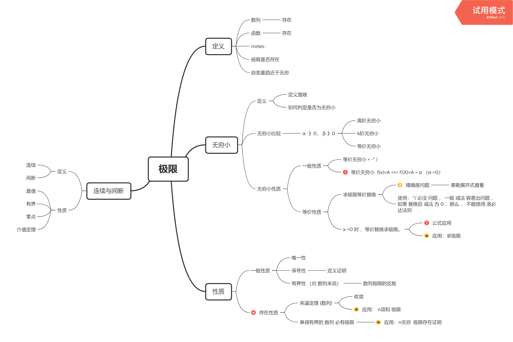
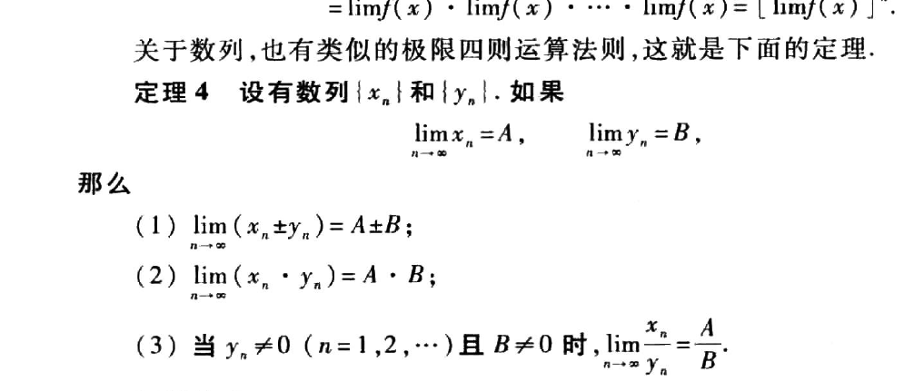
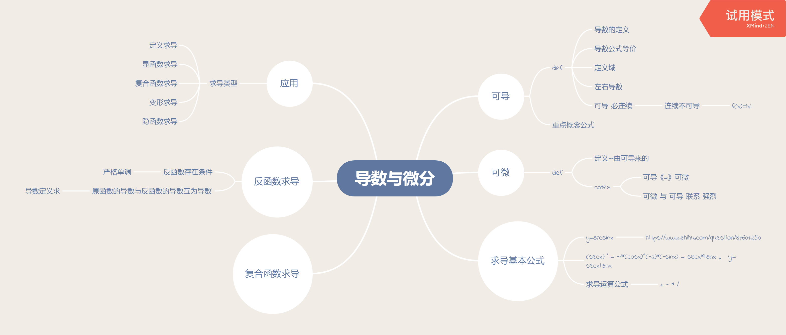

##           你  及m来源：https://www.bilibili.com/video/BV11t4y1Q7ui?from=search&seid=5183931275272466640

| 第一节 函数 | 2020年7月31日17:06:26 | 完成 未做笔记 |
| ----------- | --------------------- | ------------- |
|             |                       |               |
|             |                       |               |
|             |                       |               |

[TOC]

# 极限

## 脑图 

#### 问题1；[什么情况下求极限可以直接带入？](https://www.zhihu.com/question/51342013)

书上应该有这几条极限的运算法则：
![[公式]](https://www.zhihu.com/equation?tex=%5Clim+a+%3D+A%2C+%5Clim+b+%3D+B)
则
![[公式]](https://www.zhihu.com/equation?tex=%5Clim+%28a+%5Cpm+b%29+%3D+A+%5Cpm+B)
![[公式]](https://www.zhihu.com/equation?tex=%5Clim+ab+%3D+AB)
![[公式]](https://www.zhihu.com/equation?tex=B+%5Cne+0)时，![[公式]](https://www.zhihu.com/equation?tex=%5Clim+%5Cfrac%7Ba%7D%7Bb%7D+%3D+%5Cfrac%7BA%7D%7BB%7D)
对于连续函数f，f在A以及A的邻域有定义，有
![[公式]](https://www.zhihu.com/equation?tex=%5Clim+f%28a%29+%3D+f%28A%29)

#### 书上例子

#### 定义：

 

 

自变量-》无穷  3个 case

 

#### 2.无穷小 --重要

##### 层次（比较）

###### 高阶无穷小

###### k阶无穷小

同阶无穷小

等价无穷小-k阶无穷小的 特殊 解

#### 二。性质

##### 	一般性质：

保号性的证明：

##### 存在性质--重点

###### 准则1 

  

###### 型1 n项和求极限

 

 

###### 准则：

###### 极限数列的证明：

- 求数列注意递推关系；

- 根据极限存在准则能不能证明

- 有根号去根号

- 根号a*b<=(a+b)/2

    

  

----

##### 无穷小的性质

###### 一般：

---

###### 等价性质

----

###### 记：

###### 两个重要极限

·

---

##### 不定型极限	

###### case1

###### 等价无穷小应用：

- 先x->0 能否有等价代换的条件

- 乘法可以等价无穷小代换。加减法注意等价无穷小代换 精确度问题 ， 上下要是同阶无穷小。不是分式 替换 也要 同阶无穷小 否则出错。

- 是高阶无穷小的时候，应用洛必达法则。

- [等价无穷小的使用条件](https://kaoyan.wendu.com/m/2015/0109/73826.shtml)

   

###### [泰勒展开式理解精确度](https://zh.wikipedia.org/wiki/%E6%B3%B0%E5%8B%92%E5%85%AC%E5%BC%8F)

[如何理解精确度](https://zhuanlan.zhihu.com/p/149644676)

###### 等价无穷小例题：

###### case2:

通分

计算	

---

##### 连续与间断

###### 性质二：

----------------------------

-----------

--------

# 导数与微分

---

## 可导

### 定义

 

#### 例题

#### 定义域x

#### 左右导数

##### 例题

#### 可导性 必连续 

##### 例子

### 重点概念

---

## 可微

### 脑图

### 定义

### 注解

### 注解1

##### 证明

### 注解二

### 注解三

---

## 求导基本公式

### 求导公式

> 
>
> 

> 三角函数转换
>
> 

> ### 	三角函数

> 反三角函数
>
> 

##  利用反函数求导法则：

![[公式]](https://www.zhihu.com/equation?tex=%5Cbegin%7Balign%2A%7D+%5Cleft%28+%5Carcsin+x+%5Cright%29%5E%5Cprime++%26%3D+%5Cfrac%7B1%7D%7B%7B%7B%5Cleft%28+%5Csin+y+%5Cright%29%5E%5Cprime+%7D%7D%7D+%26%26%5Ccolor%7BRed%7D%7B%28%5Cfrac%7Bdx%7D%7Bdy%7D%3D%5Cfrac%7B1%7D%7B%5Cfrac%7Bdy%7D%7Bdx%7D%7D%29%7D+%5C%5C+%26+%3D+%5Cfrac%7B1%7D%7B%5Ccos+y%7D+++%26%26+%5Ccolor%7BRed%7D%7B%28%5Ccos+y%5Cge0%29%7D%5C%5C+%26%3D+%5Cfrac%7B1%7D%7B%7B%5Csqrt%7B1+%E2%80%93+%5Csin%5E2+y%7D+%7D%7D++%26%26%5Ccolor%7BRed%7D%7B%28y%3D%5Carcsin%28x%29%29%7D++%5C%5C+%26%3D+%5Cfrac%7B1%7D%7B%7B%5Csqrt%7B1+%E2%80%93+%7B%5Csin%5E2%7D%5Cleft%28+%7B%5Carcsin+x%7D+%5Cright%29%7D+%7D%7D+%26%26%5Ccolor%7BRed%7D%7B%28%5Csin++%5Cleft+%28+%7B%5Carcsin+x%7D+%5Cright+%29+%3Dx+%29%7D++%5C%5C+%26%3D+%5Cfrac%7B1%7D%7B%7B%5Csqrt%7B1+%E2%80%93+%7Bx%5E2%7D%7D%7D%7D+%5Cend%7Balign%2A%7D)

----

## 初等函数如何求导 

#### 四则求导法则

#### 复合函数求导法则

##### 例子：

#### 反函数求导

  

##### 证明

#### 求导类型：

## 定义求导 

##### 难题

 

 

##### 3 重点 隐函数求导-- 看成 复合函数

##### 参数方程求导

##### 

##### 分段函数求导数-重点

分段函数分段求导 

交汇点单独求导

##### 

##### 高阶导数

###### 和差化积公式的使用

###### 例子：

###### 公式法

例子：

#### 求导 总结

是否 是 初等函数 

是否 可以 转换成 初等函数 求导 

是否可以通过定义转换求导

通过 四则运算和函数复合求导 

遇到不是初等函数复合而成的 要转换函数 成初等函数。

 

## 常见题型+注意事项  

直接求导

求函数切线 和 切线方程 

### 

没写清除 出错。。。字问题 。 

计算出错 +1  +1 

不能凭借直觉来 硬算正确

test : 尝试 一次 2 次 检查

三角函数 公式 变换

--------

### [d*2y/d(x*2)  参数方程二阶导](https://zhidao.baidu.com/question/477914864.html?qbl=relate_question_4)

--------------

### 高数导数部分，求一点导数什么时候用定义，什么时候用求导法则求导函数，两者什么时候等同，什么时候不等呢?

1.首先回答为什么在一个点处的导数用定义

答: 因为判断在该点是否可导的充要条件是左右导数是否存在并且相等，只有满足如上条件，该点处的导数才会存在，出题人在此点出题，基本上思路就是让你判断该点是否可导，进而求解题目所问

2.再回答什么时候用求导法

答: 函数在一个区间上有意义，即可用求导法则，注意必须是给定的区间内才可以用，大多数情况下都可以用

3.两者什么时候相同，不同

答: 以分段函数为例子，如果函数在该点处的导数(用定义求)等于其所在区间的导数(用导数法则求)，即两者相同。如果不等，则不同。

作者：HAOLY
链接：https://www.zhihu.com/question/392923033/answer/1207356037
来源：知乎
著作权归作者所有。商业转载请联系作者获得授权，非商业转载请注明出处。

-------------                                                -------------

-------------------------------------------

---------------

# ------------------一元微分与应用 重要-------------------------

----

### 洛必达法则在求极限中的应用

x趋近于无穷或0

f(x) 和 F（x）无穷或0

这样的叫不定式子

可以应用洛必达法则。

## part 1 中值定理

### 序言：

#### 导数与 极值的关系

##### 例子：

### 应用：用导数求极值

> 求 
> $$
> f‘（x）=o
> $$
> 的x 为 极值存在可能点

> 判断 可以点 周围 的 导数 。
>
> 根据 定义 就可以 求出 极值点。

### rolle定理

> ## 解析：
>
> roll为啥要 
> $$
> f(x) 在（a,b） 内可导
> $$
> 保证曲线光滑 -->  导数存在 --》 及不出现 像 
> $$
> f(x)=|x|
> $$
>  的情况 ，让在 谷峰和谷底可导，及导数存在 ，极限值存在。

----------------------------

### 应用： 界值定理+rolle定理

 

#### 应用二：极限和导数的应用；

#### 如何证明 导数=0

#### 构造可用函数

##### 还原法

 

##### 做题总结：

当 不知道咋做的时候 ， 构造与 已知条件相似的结构 ，使其能利用 已知条件。

##### 分析法：

例子：

---

## lagrange定理

### 证明

### 用法

 

## cauchy定理

### 定义

----

### 用法1

#### 例子

### 用法2

#### 例子

### 用法3

#### 例子

### 问题

## 麦克劳林公式

> **麦克劳林公式** 是 **泰勒公式**的特殊形式 

> **注意** ：这个重新看视频 和 书 。

----

## 单调和极值

### 单调

#### 证明

#### 步骤

#### 例题

----

### 极值

#### 步骤

#### 例题

#### 第二充要条件

##### 证明

----

### 题型

#### 1.相关点判断 (运用保号性)

#### 2.不等式证明（重点）

**对于两个分式的处理（看可以用一个函数表示 来 处理）**

**对二阶导的利用**

#### note: 不等式证明： （利用中值定理） 

##### 例子1

##### 例子2

----

#### 3 方程的根

##### 零点定理

##### rolle定理 

##### 例题

零点定理

rolle 应用

##### 单调性

#### 4 凹凸性

##### 判别

##### 步骤

##### 例题

#### 5 渐近线

###### 例题

###### 铅直渐近线

###### 例题

###### 斜渐近线

###### 例子

------

## 常见题型+注意事项 

--------------------------

----

# 不定积分

## 注意：

**不定积分 为 所有 原函数的解 需要 +c**

## 1.定义

### 原函数

### 不定积分

## 2.性质

## 3.公式

### 3.1 基本公式

----

## 不定积分的积分法

### （一）换元积分法

#### 例子：

#### th1:

### 第二类换元法

#### 使用范围：

##### 无理=》有理

当没有办法使用第一类还原方法的时候

##### 平方和 平方差

##### 例子（重要 记）

## 两类重要函数的不定积分（有理函数和三角有理函数）

### 有理函数的积分

### 2.积分方法

### 三角 有理数 化不定积分

# 第5章 定积分

## 积分的概念和性质

### 定义 

1.有界

2.定积分

### 注意

记：

### 定积分的基本性质

### 定积分的基本概念的推广

## 第二节 基本理论

### 积分的基本理论

### 定理二

### 特殊性质

### 积分法 -记 重点

### 代换法

代换x.

## 第三 节 广义积分

注意：广义积分和 定积分是不同的两个概念。

### 0 定义

### 1 区间无限

#### 例题

#### 判别法

#### 

#### 例子

#### 定义2

#### 定义三

#### 判别法2

#### 伽马函数在定积分的应用

### 2 区间有限

  

#### 例子：

#### 区间有限 定义二

#### 判别法

##  定积的几何意义

  

  

------------

# 6 多元微分学

## 定义

### 极限

#### 一元

#### 二元

### 连续

####  一元

#### 多元

### 可导

#### 一元

#### 二元

### 可全微

#### 一元

#### 二元

## 二 关系

### 有界 闭区间上连续函数的性质：

 

### 连续 可偏导 可微 关系

### 偏导数

  

	

### 复合函数的偏导

 

#### 例子

#### 注意

#### 例子 继续

##  隐函数求导

## 求极值

#  7微分方程

-----------

-----------

# 8 重积分

## 定义

### 概述

#### 1

#### 2

#### 上述1 2 都是 解决不规则二元 的积分思想

### 二重积分 定义

### 二重积分

### note:

