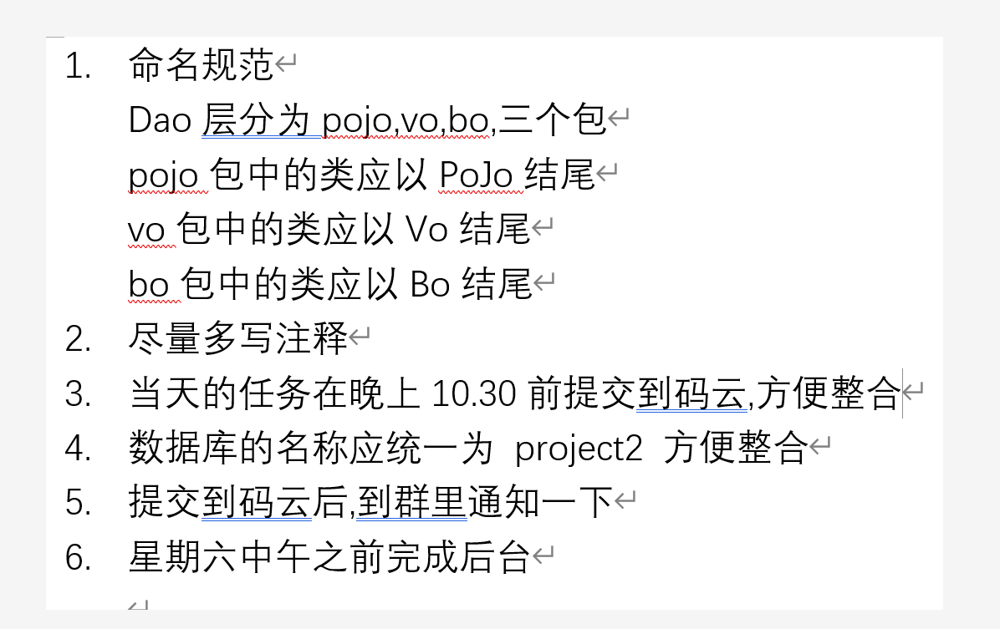

# project2

code:https://gitee.com/ytwotap/project2

## 代码规范

自己逆向工程的时候  ，在mapper下面按这个大类建包吧。如果后面有点问题再改 

## 资料:

服务器IP：182.92.235.201

【腾讯文档】33th项目进度表
https://docs.qq.com/sheet/DSmJ2b1FlV0VLYmpp

--来自百度网盘超级会员V5的分享
hi，这是我用百度网盘分享的内容~复制这段内容打开「百度网盘」APP即可获取 
链接:https://pan.baidu.com/s/1hJbfMaedsN0ZgXf1w6d_GA 
提取码:1vp1

## 环境搭建

swager

## 接口:

### 在现成的看看商品管理功能

需求:

看接口和请i去方式

出的数据

返回的东西

效果和功能

操作:查看现状和表

结果:和第一次差不多 但是有请求和相应数据库.

**先写好接口**

**相应goods表建立**

**实现相应的功能.**

接口

图片上传:

接受 -->mvc

随机存储-->以前util或mvc

-->service 存储

-->return 位置 -->设置静态页面访问.

存储路径问题->不能存储在本地

-->静态资源配置  1tomaot

-->**找云端库->存储在上面就行.**->实现上传

商品上传:

4个表 生成了

