# [索引]()

## 1. 介绍

**索引是一种可以帮助我们高效获取数据的数据结构**。类比于字典开头的索引目录。假如字典开头没有这个索引目录，那么我们去查字典需要一个字一个字的，效率很低。假如字典开头有这个索引目录，那么我们去查字典的时候，就可以先去查这个索引，然后定位到特定的页，然后去查询这个字，进而提高查询的效率。我们的MySQL里面的索引也是一样的功能。假如没有这个索引，我们去表中查询记录的时候，需要扫描整个表中的记录；假如有了索引存在，那我们去查询的时候，就可以先根据索引，定位到特定的行，进而缩小查询的范围，帮助我们提高查询的效率。

## 2. 索引的数据结构

常见的数据结构： 

链表 数组 

Map

 二叉树 

红黑树 

Hash表 

B树

 以上都是一些数据结构，那么究竟是哪种数据结构更加适合在数据库的索引中使用呢？

 [数据结构模拟网站](https://www.cs.usfca.edu/~galles/visualization/Algorithms.html)

### 链表

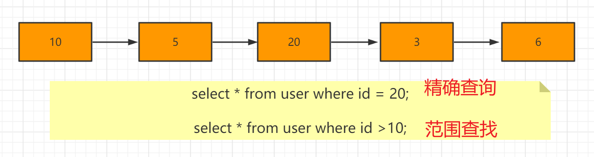


- 链表在进行精确查找的时候，还是需要遍历 整个链表，很不方便
- 进行范围查找的时候，也需要遍历整个链表，不太方便

### 数组


- 数组在进行精确查找的时候，需要遍历，效率较低。
- 数据在进行范围查找的时候，也需要遍历，效率较低。

### Map

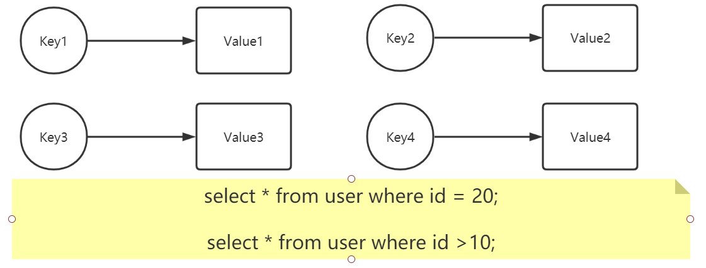

由于Map的底层是数据后者是链表或者是树，那么我们发现在使用map进行查找的时候，还是需要去查询map底层的数组或者是链表或者是树，既然是这样，为什么不直接使用数组、链表或者是树呢？上面已经说明了数组或者是链表是不太适合当索引这种数据结构的，综上所述，Map不适合当索引这种数据结构。

### Hash表 

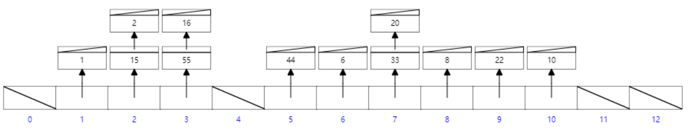

- 精确查找：`select * from user where id = 10;`进行精确查找的时候，可以快速的定位到这个槽点，从而可以快速的找到数据。
- 范围查找：`select * from user where id > 10;`在进行范围查找的时候，其实是不太方便的。去进行范围查找的时候，需要遍历整个Hash表。根本的原因：余数的大小和原数据的大小没有任何关系。

索引其实也可以采用Hash表这种数据结构。采用Hash表当做数据结构的叫做 `hash索引`。这个Hash索引呢，其实在MySQL设计的内部有使用，我们作为用户，一般情况下，MySQL不推荐我们使用Hash索引。

### 二叉树

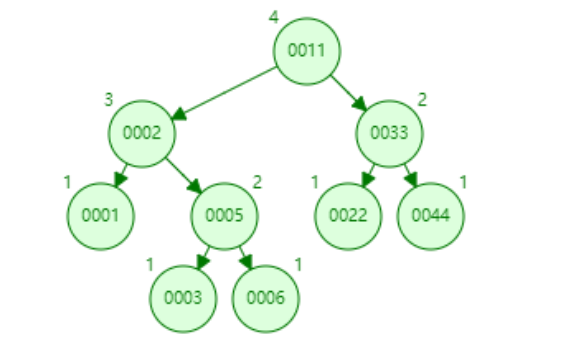

- 精确查找：`select * from user where id = 6`   我们发现，在进行精确查找的时候，二叉树的还是比较方便的
- 范围查找：`select * from user where id > 6;` 我们发现，如果采用二叉树这种数据结构进行范围查找的时候，也是比较方便的。

如果索引采取二叉树这种数据结构合适吗？

虽然我们在二叉树里面进行精确查找和范围查找的时候，比较方便，但是如果采用二叉树这种数据结构作为索引的话，假如数据量比较小，那么还是能够保证性能的，但是假如数据量很大的话，就会造成二叉树的高度比较高，高度高的话带来的问题其实就是查找效率降低。所以二叉树不太适当当做索引这种数据结构。

### 红黑树

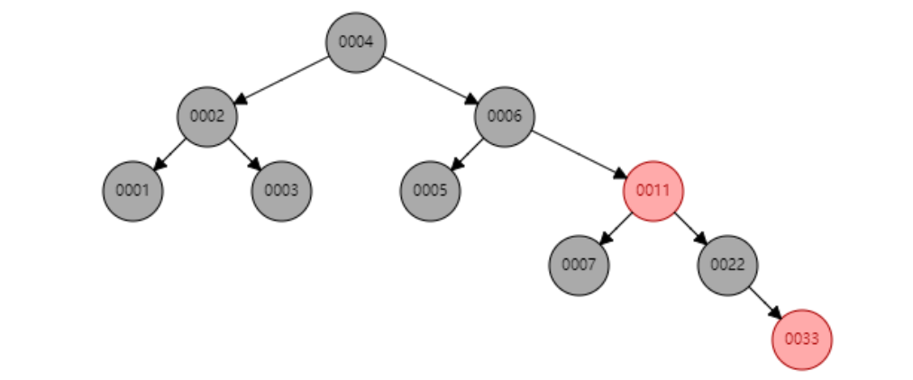

我们可以发现，红黑树和二叉树存在问题是一样的，因为一个节点只有两个孩子，或者说因为这个树只有两个叉，那么在我们需要存储大量的数据的时候，树的高度就会明显增高，这样就会带来查找效率的降低。所以红黑树这种数据结构也不太适合当索引

### [B树](../.././1-java基础知识/3-数据结构与算法/B-tree.md)


我们不难发现，B树去存储数据，树的高度会显著降低，这会提升我们的查询效率。

- 精确查找：我们发现，使用B树，在进行精确查找的时候还是很方便的。
- 范围查找：我们发现，使用B树，进行范围查找的时候，相对来说还是比较方便的。

索引采用的数据结构其实就是B+树，而B+树是在B树的基础之上去做的优化。

### [B+树(掌握)](../.././1-java基础知识/3-数据结构与算法/B+树.md)

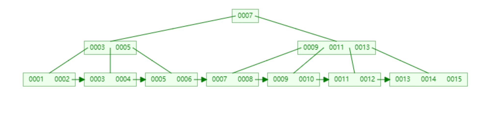

B+树在B树的基础之上，做了两个改变

- 改变一：把所有的非叶子节点中的key冗余在叶子节点中一份

- 改变二：把所有的非叶子节点用指针连接起来，形成一个从小到大排列的链表

- 改变三：所有的非叶子节点只存储Key，不存储Data

  所有的非叶子节点只存储key，不存储data，因为每一个节点的大小是固定的，这样就会导致一个节点里面存储的key变多，就会导致树的阶数变高，从而导致我们的树的高度降低。树的高度降低了以后，会提升我们查找的的效率。

有了以上两个 改变以后，那我们在进行精确查找的时候，很方便，我们在进行范围查找的时候，也很方便。并且这两种查询的方式，效率都很高。所有我们的MySQL索引采用的数据结构就是B+树。

## 3. 索引的实现

介绍索引具体实现之前，先介绍一下数据库的组成结构。为什么？ 因为索引的具体实现和不同的引擎有关。

### 3.0 数据库的组成结构


**连接器**：负责管理连接，权限的验证等。

**解析器**：首先MySQL需要知道你想做什么。因此需要对输入的SQL进行解析。首先进行词法分析，需要 识别出里面的字符串代表什么意思。比如 SELECT 代表查询，T 代表某张表，ID 代表某张表的列字段叫 id；之后进行语法分析，根据语法规则，判断输入的 sql 语句是否符合MySQL语法。 

**优化器**：经过解析之后，MySQL就知道你需要做什么事情了。但是在真正执行之前还需要经过优化器处 理。比如当表中存在多个索引的时候，选择哪个索引来使用。或者多表关联的时候，选择各个表的连接 先后顺序。

 **执行器**：开始执行之前首先确认对该表有无执行查询的权限。如果没有，则返回错误的信息提示。如果 有权限，则开始执行。首先根据该表的引擎类型，使用这个引擎提供的接口。比如查询某表，然后利用 某字段查找，如果没有添加索引，则调用引擎的接口取出第一行数据，判断结果是不是，如果不是，依 次再调用引擎的下一行数据，直至取出这个表中所有的数据。 如果该字段有索引，执行过程也大致相似， 所以具体的数据是保存在引擎中的。在MySQL中，常见的数据库引擎有MyISAM和InnoDB。

我们可以发现，`MySQL中数据是存放在存储引擎中的。所以数据存放的方式和存储引擎相关，不同的存储引擎有不同的数据存放的方式，我们在建立每一张表的时候，都需要给这个表指定存储引擎，如果没有指定，那么MySQL默认的存储引擎是InnoDB。在MySQL中，分为InnoDB和MyISAM两种存储引擎。`

### 3.1 MyISAM

MyISAM这种表使用的索引叫做**非聚集索引**。什么叫非聚集呢？其实就是指数据文件和索引文件是分开的。

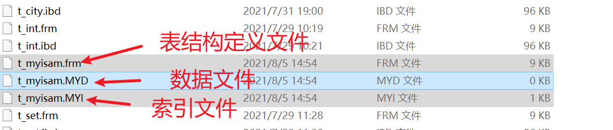

- 主键索引

  

  主键索引值的是根据主键这一列建立的索引树。

  在这个B+树中，key值就是主键值，data是 这个主键对应的这一行数据的地址值。

- 非主键索引

  非主键索引是指根据其他列建立的索引树。
  
  

### 3.2 InnoDB

InnoDB这种存储引擎使用的索引叫做聚集索引。什么叫聚集索引呢？就是数据文件和索引文件是在一起的，是一个文件。

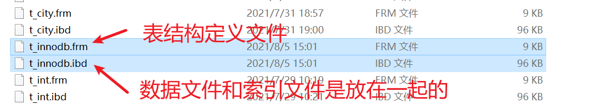

- 主键索引

  

  在InnoDB里面，主键索引和MyISAM里面的主键索引是一样的，都是拿主键的值当做B+树的key值。不同的是，在MyISAM存储引擎里面，data值是地址值。在InnoDB里面，不是地址值，就是这一行的数据。

- 非主键索引

  
  
  在InnoDB里面，非主键索引和MyISAM里面的非主键索引是一样的，都是拿其他普通索引列的值当做B+树的key值。不同的是，在MyISAM存储引擎中，data值是地址值，而在InnoDB里面，不是地址值，而是主键的值。

### 3.3 MyISAM和InnoDB的区别（面试会问）

1. InnoDB 支持事务，MyISAM不支持事务，对于 InnoDB 中的每条SQL语句都自动封装成事务，自提交，影响速度.
2. InnoDB 支持外键，MyISAM不支持外键
3. InnoDB 不保存表的行数，查询某张表的行数会全表扫描。MyISAM会保存整个表的行数，执行速度很快
4. InnoDB 支持表锁和行锁（默认），而 MyISAM支持表锁。
5. InnoDB 是聚集索引，数据文件和索引绑在一起。MyISAM是非聚集索引，索引和数据文件是分开的
6. InnoDB 表必须要有一个主键（如果用户不设置，那么引擎会自行设定一列当做主键），MyISAM则可以没有
7. InnoDB 的存储文件是 frm 和 ibd，而 MyISAM是 frm、myd、myi 三个文件。

**在工作中，如何去选择这两种存储引擎呢？**

如果这个表只有查询的需求，也就是这个表我们只用去读，不用去写，那么我们就可以使用MyISAM。如果这个表既要读，又要写，那么我们应该选择InnoDB作为存储引擎。因为MyISAM不支持事务，而InnoDB支持事务。


### 3.4 聚合索引和非聚合索引区别补充

**广义上**,索引的所有叶子结点存储的都是是最终的数据结点.InnoDB是聚集索引因为它的索引文件和数据文件是放在一起的可以通过索引直接找到数据，MyISAM是非聚集 索引因为它的数据文件和索引文件时分开的只能通过索引文件找到保存数的地址值。

**狭义上**讲InnoDB的主键索引称为聚集索引，而非主键索引称为非聚集索引。


## 4. 索引的语法

### 4.1 概况语法

换句话来说，也就是我们如何去创建索引呢？

语法:

```sql
#一般在建表的时候创建，一般会设为int而且是auto_increment 
#创建主键索引 
CREATE TABLE `user` ( 
    `id` int NOT NULL,
 	`name` varchar(255) NULL, 
    PRIMARY KEY (`id`), 
    INDEX `name_index`(`name`) USING BTREE 
);
    #在创建表以后添加索引 
    -- SQL标准语法
    alter table tableName add [unique] index indexName(columnName); 
    
    -- 方言
    create index indexName on tableName(columnName); 
    
    #删除索引 
    -- SQL标准语法
    alter table tableName drop index indexName; 
    -- 方言
    drop index indexName on tableName; 
    
    
    #查看索引 show index from tableName;
```

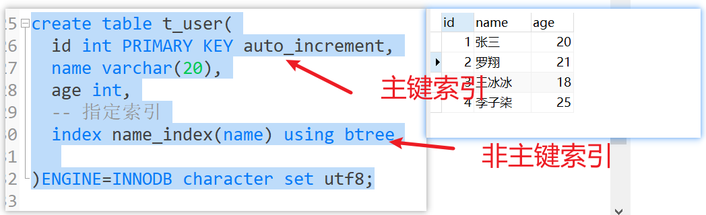


根据主键索引创建左边的索引树。			根据name这个索引创建右边的索引树。


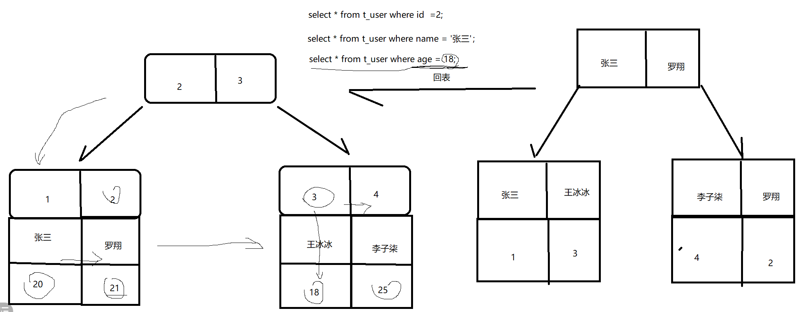


```sql
  select * from user where id = 2 
```

  这个sql语句会去查询主键索引树

  ```sql
  select * from t_user where name = '张三';
  ```

  这个sql语句会先去查询右边的非主键索引树，然后获取到主键的值，然后因为是select *，所以需要其他所有列的值，但是在我们的非主键索引中，没有其他列的值，所以需要根据主键去再查一遍主键索引树。这个过程叫做**回表**


###  4.2 使用索引(详细解释)

#### 创建索引:

```sql
create table t_user(
id int primary key auto_increment,
name varchar(20),
age int,
-- 指定索引
index name_index(name) using btree
)ENGINE=INNODB CHARACTER set utf8;

```

> note: 注意,上面会创建2个索引.除了指定的索引,还会根据主键创建主键.

##### 上面表创建的主键索引树:

(默认创建,使用B+树)

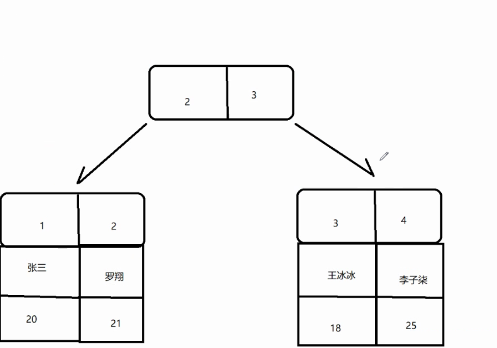

##### 非主键索引树:

```sql
#根据这个表达式创建非主键所引述
index name_index(name) using btree
```

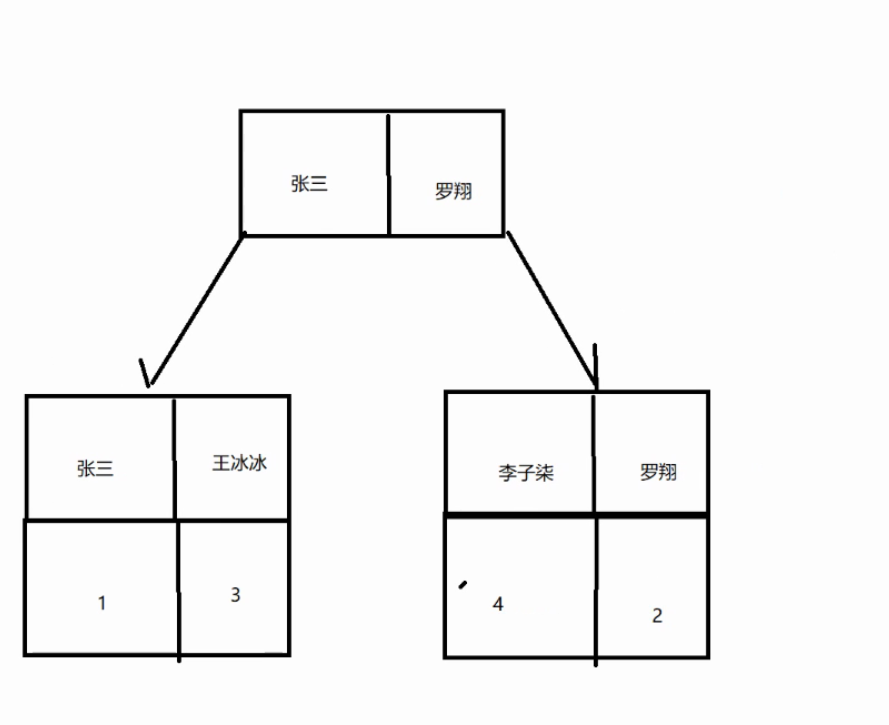

> note:非主键索引树data只有id.  通过**回表**,找到数据.即:非主键索引要找两次.

> **回表**:非主键索引找到**主键**,在根据主键索引找到对应数据.

##### 读取非索引:

遍历整个表.

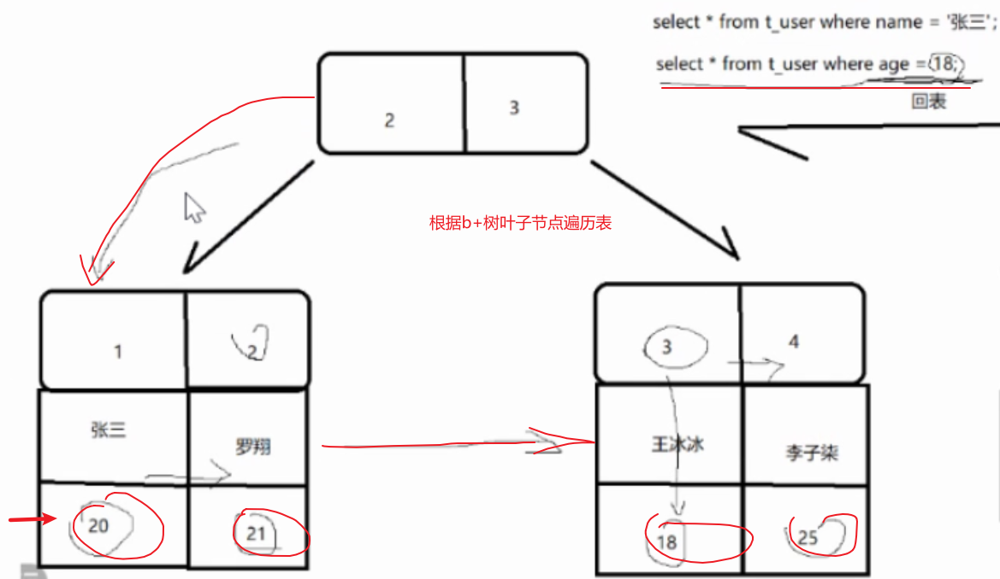

#### 添加索引

```sql

    #在创建表以后添加索引 
    -- SQL标准语法
    alter table tableName add [unique] index indexName(columnName); 
    
    -- 方言
    create index indexName on tableName(columnName); 
  
```


#### 删除索引

```
  
    #删除索引 
    -- SQL标准语法
    alter table tableName drop index indexName; 
    -- 方言
    drop index indexName on tableName; 

```


#### 查看索引


​    

    #查看索引 show index from tableName;

#### 联合索引

建立联合索引

```sql
create table t_user(
id int primary key auto_increment,
name varchar(20),
age int,
-- 联合索引
index name_index(name,age) using btree
)ENGINE=INNODB CHARACTER set utf8;

```

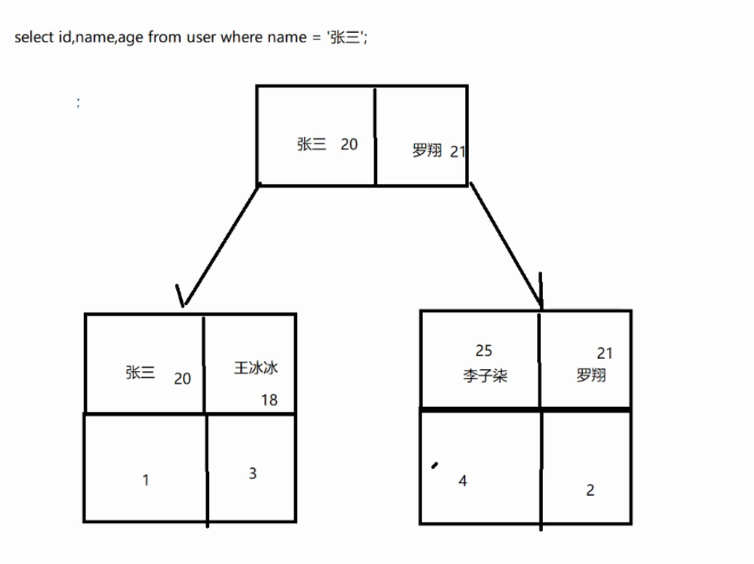

> note:联合索引解决回表问题,在innodb中用.
>
> MylSAM中不需要用,因为它数据和索引分开,索引是直接查数据地址值.


## 5. 面试题

1. 索引采用的是什么数据结构？为什么采用这种数据结构

   B+树

2. 数据库为什么定义主键，并且在MySQL中使用推荐使用主键自增的策略？

   因为数据库的存储引擎InnoDB是把数据存储在主键索引树中的，假如一个表是InnoDB存储引擎，假如他没有主键，那么理论上来说就没有办法存储数据。这个时候InnoDB会给我们维护一个默认的隐藏列来当做主键，方便我们去存储数据。

   为什么要使用主键自增的这种策略呢？

   因为使用主键自增的策略，在我们插入数据的时候，会对索引树的结构改变比较小，这样插入的效率就会比较高。

   

3. InnoDB和MyISAM有什么区别？什么情况下使用MyISAM？ 

4. 什么是回表？如何避免回表？

   假如我们需要去查询一行数据的时候，我们需要先根据非主键索引树去查询主键的值，然后再根据查询出来的主键的值去查询主键索引树，获取其他的列值，这种就叫做回表。

   - 尽量在写SQL语句的时候，我们不要写 select *，不要去查询我们业务中不需要的列

   - 建立联合索引也可以合理的规避这个回表的问题

     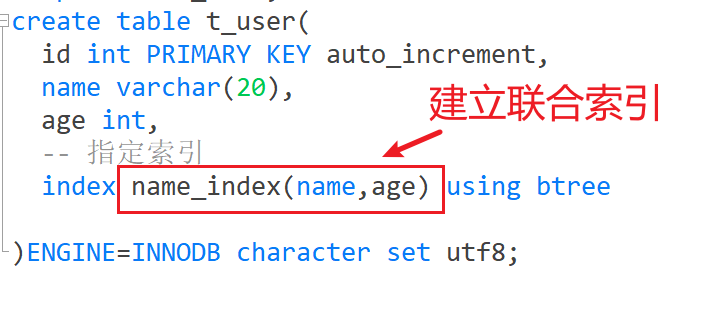

     

     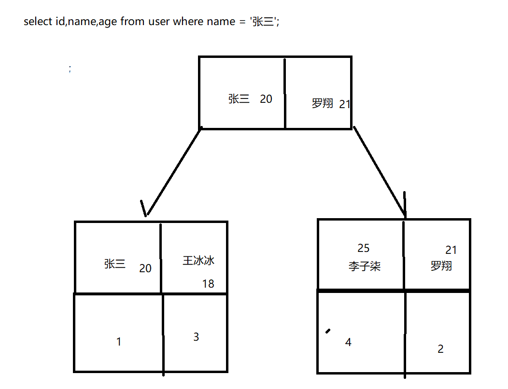


5. 索引性能这么好，是不是一个表建立的索引越多越好？

   我们去对一些列建立索引，我们可以发现，这些索引建了之后，可能会提高查询的效率。但是会很大程度上影响增、删、改的效率。因为一个索引对应一个索引树，假如你建立的索引越多，那么你需要维护的索引树就越多。当你去增删改数据的时候，就需要维护更多的索引树，这无疑会降低增删改的效率。所以一个表不是建的索引越多越好。


概念：

MySQL单表的性能瓶颈是多少呢？

阿里巴巴开发手册中指出，MySQL单表上限一般在500w-800w条数据左右。假如数据量超过了这个数的时候该怎么办呢？我们就可以考虑使用分表。分表其实就是我们可以把数据分到几个表里面来存。如何分表呢？一般是按照时间来分表。

分表后会有一些问题：

例如order by只能做到局部有序，还有例如group by只能做到单表分组。那么如何解决呢？

- 第一种方式我们可以自己通过代码来解决（不推荐的）
- 第二种方式其实就是目前有很多数据库的中间件，把这些分表分库之后的场景考虑到了，然后把公共的逻辑抽离出来了，我们可以使用这些中间件来解决（MyCat、Sharing-JDBC）

  文档:[分库分表中间件.md](./分库分表中间件.md)

我们一般一个表建立多少个索引比较合适呢？

一般认为，建立5条索引以内比较合适。但是这个数量没有标准，要根据业务场景来说。

