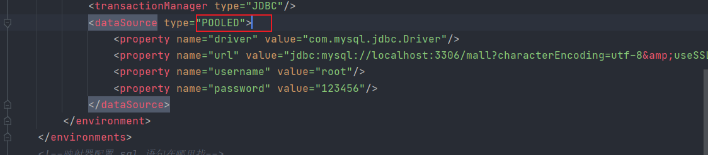

# Mybatis study note

> 相关连接:
>
> [mybatisx插件的使用](https://baomidou.com/guide/mybatisx-idea-plugin.html#%E5%8A%9F%E8%83%BD)
>
> [mybatis_动态代理实现.md](./mybatis_动态代理实现.md)
>
> [mybatis插件.md](./mybatis插件.md)

ref:collision:    [code](https://github.com/ytwotap/java-basics/tree/master/mybatis)

官网:github:https://github.com/mybatis/mybatis-3


ref:bookmark_tabs:https://mybatis.org/mybatis-3/zh/getting-started.html

----

ref:notebook:https://www.tutorialspoint.com/mybatis/index.html

:link::w3schoolhttps://www.w3cschool.cn/mybatis/mybatis-dyr53b5w.html 中文教程

:video_camera:https://www.bilibili.com/video/BV1NE411Q7Nx?from=search&seid=10243571549505600982 b站-idea 版本

> 
>
> 入门后官方文档理解。

# 第1部分 入门


## 1.1 什么是 MyBatis？

MyBatis 是一款优秀的持久层框架，它支持自定义 SQL、存储过程以及高级映射。MyBatis 免除了几乎所有的 JDBC 代码以及设置参数和获取结果集的工作。MyBatis 可以通过**简单的 XML 或注解**来**配置和映射原始类型、接口和 Java POJO（Plain Old Java Objects，普通老式 Java 对象）为数据库中的记录**。

### 1.1.1 什么是框架？

框架就是模板。好比一个简历模板，简历模板不是一个完整的简历，需要我们自己填充一些内容才能成为一个完整的简历

- 框架定义好了一些功能，这些功能是可用的。
- 框架中可以加入项目自己的功能，这些功能可以利用框架中已经写好的功能

框架是一个软件，是一个半成品软件，定义好了一些基础功能，需要加入你的功能就是完整的。
基础功能是可以重复使用的，是可以升级的

框架的特点：

- 框架一般不是全能的，不能做所有的事情
- 框架一般是针对某一个领域有效。特长在某一个方面，比如Mybatis做数据库操作强，但是不能做其他的事情
- 框架是一个软件

## 1.2 orm框架的基本思想

无论是用过的hibernate，mybatis，你会发现他们有一个共同点：

- 从配置文件(通常是XML配置文件中)得到 sessionfactory.
- 由sessionfactory 产生 session
- 在session 中完成对数据的增删改查和事务提交等.
- 在用完之后关闭session 。
- 在java 对象和 数据库之间有做mapping 的配置文件，也通常是xml 文件。

## 1.3  什么是ORM？

ORM = Object Relational Mapping,指对象关系映射，是一种为了解决面向对象与关系数据库互不匹配的现象的技术

**为什么需要使用Mybatis来替代JDBC，JDBC有什么优缺点？**
首先来回顾一下JDBC的代码

```java
class JDBCTest{
    public static void main(String[] args){
        
        // 声明变量
        Connection connection = null;
        Statement statement = null;
        ResultSet resultSet = null;
        
        List<User> userList = new ArrayList<User>();
        
        try{
            
            // 1. 注册驱动
            Class.forName("com.mysql.jdbc.Driver");
            // 2. 获取连接
            connection = DriverManager.getConnection("jdbc:mysql://localhost:3306/db1","root","123456");
            // 3. 创建Statement对象，构建请求报文
            statement = connection.createStatement();
            // 4. 执行sql语句，获取执行结果
            resultSet = statement.executeQuery("select * from user");
            // 5. 解析结果集
            while (resultSet.next()) {
                User user = new User();
                user.setId(resultSet.getInt("id"));
                user.setName(resultSet.getString("name"));
                user.setAge(resultSet.getInt("age"));
                userList.add(user);
            }
        }catch (Exception ex) {
            ex.printStackTrace();
        }finally{
            // 关闭资源
            if (connection!= null){
                try{
                    connection.close;
                }catch (Exception ex) {
                    ex.printStackTrace();
                }
            }
            if (statement!=null) {
                statement.close;
            }
            if (resultSet!= null) {
                resultSet.close;
            }
            
        }
        
    }
}
```

**使用JDBC的缺陷：**

1. 每次都要手动连接，释放资源，一方面耗费系统资源，一方面显得十分繁琐
2. sql语句，请求参数的封装，结果集的封装，均存在硬编码的问题，一旦业务需求发生变化，就需要对代码进行修改，十分笨重

使用DButils+连接池

```java
class DataSourceUtils {
    public static DataSource getDatasource(){
        // 创建C3p0数据源
        DataSource dataSource = new ComboPooledDatasource();
        // 设置参数
        dataSource.setDriverClass("com.mysql.jdbc.Driver");
        dataSource.setJdbcUrl("jdbc:mysql://localhost:3306/db1");
        dataSource.setUser("root");
        dataSource.setPassword("123456");
        return dataSource;
    }
}
```

使用DButis的缺陷：

- sql依然写在代码里面，和代码严重耦合，存在硬编码
- 结果集合的映射不那么智能
- 如果涉及到了多表联查的复杂sql映射，使用起来不是那么方便

## 1.4 Mybatis框架概述

Mybatis本是apache基金会的一个开源项目ibatis，2010年这个项目有apache迁移到了google code，并且改名为Mybatis。2013年11月代码迁移到了github
Mybatis是一个基于Java的持久层框架。持久层框架包括了Sql maps和Data Access Objects(DAOs)

### 1.4.1 **mybatis架构图**：


:link:https://mybatis.org/mybatis-3/zh/index.html

**重点操作:**


#### 动态映射


### 1.4.2 功能概况

与其他[对象关系映射](https://zh.wikipedia.org/wiki/对象关系映射)框架不同，MyBatis没有将[Java](https://zh.wikipedia.org/wiki/Java)[对象](https://zh.wikipedia.org/wiki/对象_(计算机科学))与[数据库](https://zh.wikipedia.org/wiki/数据库)表关联起来，而是**将Java方法与[SQL](https://zh.wikipedia.org/wiki/SQL)语句关联**。MyBatis允许用户充分利用[数据库](https://zh.wikipedia.org/wiki/数据库)的各种功能，例如**存储过程、[视图](https://zh.wikipedia.org/wiki/视图)、各种复杂的查询以及某数据库的专有特性。**如果要对遗留数据库、不规范的数据库进行操作，或者要完全控制SQL的执行，MyBatis是一个不错的选择。

与[JDBC](https://zh.wikipedia.org/wiki/JDBC)相比，MyBatis简化了相关代码：**SQL语句在一行代码中就能执行。****MyBatis提供了一个映射引擎，声明式的把SQL语句执行结果与对象树映射起来。**通过使用一种内建的类XML表达式语言，或者使用[Apache Velocity](https://zh.wikipedia.org/wiki/Apache_Velocity)集成的插件，SQL语句可以被动态的生成。

MyBatis与[Spring Framework](https://zh.wikipedia.org/wiki/Spring_Framework)和[Google Guice](https://zh.wikipedia.org/w/index.php?title=Google_Guice&action=edit&redlink=1)集成，这使开发者免于依赖性问题。

MyBatis支持声明式数据缓存（declarative data caching）。当一条SQL语句被标记为“可缓存”后，首次执行它时从数据库获取的所有数据会被存储在一段[高速缓存](https://zh.wikipedia.org/wiki/高速缓存)中，今后执行这条语句时就会从高速缓存中读取结果，而不是再次命中数据库。MyBatis提供了基于 Java HashMap 的默认缓存实现，以及用于与[OSCache](https://zh.wikipedia.org/w/index.php?title=OSCache&action=edit&redlink=1)、[Ehcache](https://zh.wikipedia.org/w/index.php?title=Ehcache&action=edit&redlink=1)、[Hazelcast](https://zh.wikipedia.org/w/index.php?title=Hazelcast&action=edit&redlink=1)和[Memcached](https://zh.wikipedia.org/wiki/Memcached)连接的默认连接器。MyBatis还提供[API](https://zh.wikipedia.org/wiki/API)供其他缓存实现使用。

:link:https://zh.wikipedia.org/wiki/MyBatis

### 1.4.3 历史

MyBatis项目继承自[iBATIS](https://zh.wikipedia.org/wiki/IBATIS) 3.0，其维护团队也包含[iBATIS](https://zh.wikipedia.org/wiki/IBATIS)的初创成员。

2010年5月19日项目创建。当时Apache [iBATIS](https://zh.wikipedia.org/wiki/IBATIS) 3.0发布，其开发团队宣布会在新的名字、新的站点中继续开发[[3\]](https://zh.wikipedia.org/wiki/MyBatis#cite_note-5)。

2013年11月10日，项目迁移到了[GitHub](https://zh.wikipedia.org/wiki/GitHub)。[[4\]](https://zh.wikipedia.org/wiki/MyBatis#cite_note-6)

### maven:

```xml
<dependency>
  <groupId>org.mybatis</groupId>
  <artifactId>mybatis</artifactId>
  <version>x.x.x</version>
</dependency>
```

maven版本来源:https://mvnrepository.com/artifact/org.mybatis/mybatis

## 1.5 持久层：

In [computer science](https://en.wikipedia.org/wiki/Computer_science), **persistence** refers to the characteristic of [state](https://en.wikipedia.org/wiki/State_(computer_science)) of a system that outlives (persists more than) the [process](https://en.wikipedia.org/wiki/Process_(computing)) that created it. This is achieved in practice by storing the state as data in [computer data storage](https://en.wikipedia.org/wiki/Computer_data_storage). Programs have to transfer data to and from storage devices and have to provide mappings from the native [programming-language](https://en.wikipedia.org/wiki/Programming_language) [data structures](https://en.wikipedia.org/wiki/Data_structure) to the storage device data structures.[[1\]](https://en.wikipedia.org/wiki/Persistence_(computer_science)#cite_note-1)

Picture editing programs or [word processors](https://en.wikipedia.org/wiki/Word_processor), for example, achieve [state](https://en.wikipedia.org/wiki/State_(computer_science)) persistence by saving their documents to [files](https://en.wikipedia.org/wiki/Computer_file).

> 简单理解，就是把数据放在数据库中，数据库一般存储在硬盘中。而不是放在内存中，内存不带电及失。
>
> 数据库：io文件
>
> 区别：Dao layer ; Service layer ; Controller layer.

:link:https://en.wikipedia.org/wiki/Persistence_(computer_science)

## 1.6 为啥要使用Mybatis

- 简化持久操作
- 方便
- 简化了JDBC的框架
- 简单
- **用的人多**

# 2 第一个Mybatis 程序

code:https://github.com/ytwotap/java-basics/tree/master/mybatis/mybatiscode

思路：了解作用-目的 -->搭建环境-->配置框架——>编写代码test

maven构建开发环境：https://www.jianshu.com/p/36a6ac0c8fa3

### 	1.4.1 环境搭建

1. 搭建数据库

2. 导入依赖

3. create a maven project

4. 配置Mybatis

   目录结构
   
   ```
   E:.
   ├─.idea
   │  └─libraries
   └─mybatiscode
       ├─.idea
       ├─src
       │  ├─main
       │  │  ├─java
       │  │  │  ├─mapping
       │  │  │  ├─pojo
       │  │  │  ├─server
       │  │  │  └─utils
       │  │  └─resources
       │  │      └─mapping
       │  └─test
       │      └─java
       │          ├─mapping
       │          └─server
       └─target
           ├─classes
           │  ├─mapping
           │  ├─pojo
           │  ├─server
           │  └─utils
           ├─generated-sources
           │  └─annotations
           ├─generated-test-sources
           │  └─test-annotations
           ├─maven-status
           │  └─maven-compiler-plugin
           │      └─compile
           │          └─default-compile
           └─test-classes
               ├─mapping
               └─server
   
   E:\githubdown\java-basics\mybatis>tree /f
   卷 document 的文件夹 PATH 列表
   卷序列号为 B0F1-CB20
   E:.
   ├─.idea
   │  │  .gitignore
   │  │  .name
   │  │  compiler.xml
   │  │  jarRepositories.xml
   │  │  misc.xml
   │  │  modules.xml
   │  │  mybatis.iml
   │  │  vcs.xml
   │  │  workspace.xml
   │  │
   │  └─libraries
   │          Maven__com_google_protobuf_protobuf_java_3_6_1.xml
   │          Maven__junit_junit_4_12.xml
   │          Maven__mysql_mysql_connector_java_8_0_15.xml
   │          Maven__org_hamcrest_hamcrest_core_1_3.xml
   │          Maven__org_mybatis_mybatis_3_5_6.xml
   │
   └─mybatiscode
       │  mybatiscode.iml
       │  pom.xml
       │
       ├─.idea
       │      .gitignore
       │      compiler.xml
       │      encodings.xml
       │      jarRepositories.xml
       │      misc.xml
       │      mybatiscode.iml
       │      uiDesigner.xml
       │      vcs.xml
       │      workspace.xml
       │
       ├─src
       │  ├─main
       │  │  ├─java
       │  │  │  ├─mapping
       │  │  │  │      UserMapper2.java
       │  │  │  │
       │  │  │  ├─pojo
       │  │  │  │      User.java
       │  │  │  │
       │  │  │  ├─server
       │  │  │  │      UseInformation.java
       │  │  │  │      UseInformationImpl.java
       │  │  │  │      UserDelete.java
       │  │  │  │      UserDeleteImpl.java
       │  │  │  │      UserLogin.java
       │  │  │  │      UserLoginImpl.java
       │  │  │  │      UserRegistered.java
       │  │  │  │      UserRegisteredmpl.java
       │  │  │  │
       │  │  │  └─utils
       │  │  │          MybatisUtils.java
       │  │  │
       │  │  └─resources
       │  │      │  jdbc.properties
       │  │      │  mybatis-config.xml
       │  │      │  UserMapper.xml
       │  │      │
       │  │      └─mapping
       │  │              UserMapper2.xml
       │  │
       │  └─test
       │      └─java
       │          ├─mapping
       │          │      UserMapperTest.java
       │          │
       │          └─server
       │                  UseInformationTest.java
       │                  UserDeleteTest.java
       │                  UserLoginTest.java
       │                  UserRegisteredTest.java
       │
       └─target
           ├─classes
           │  │  jdbc.properties
           │  │  mybatis-config.xml
           │  │  UserMapper.xml
           │  │
           │  ├─mapping
           │  │      UserMapper2.class
           │  │      UserMapper2.xml
           │  │
           │  ├─pojo
           │  │      User.class
           │  │
           │  ├─server
           │  │      UseInformation.class
           │  │      UseInformationImpl.class
           │  │      UserDelete.class
           │  │      UserDeleteImpl.class
           │  │      UserLogin.class
           │  │      UserLoginImpl.class
           │  │      UserRegistered.class
           │  │      UserRegisteredmpl.class
           │  │
           │  └─utils
           │          MybatisUtils.class
           │
           ├─generated-sources
           │  └─annotations
           ├─generated-test-sources
           │  └─test-annotations
           ├─maven-status
           │  └─maven-compiler-plugin
           │      └─compile
           │          └─default-compile
           │                  createdFiles.lst
           │                  inputFiles.lst
           │
           └─test-classes
               ├─mapping
               │      UserMapperTest.class
               │
               └─server
                       UseInformationTest.class
                       UserDeleteTest.class
                       UserLoginTest.class
                       UserRegisteredTest.class
   
   
   ```
   
   

##### 1.搭建数据库和对应javabean

数据库

```sql
Time: 0.009s
MySQL root@localhost:33th> desc user
+----------+-----------------+------+-----+---------+----------------+
| Field    | Type            | Null | Key | Default | Extra          |
+----------+-----------------+------+-----+---------+----------------+
| id       | int             | NO   | PRI | <null>  | auto_increment |
| username | varchar(30)     | NO   |     | <null>  |                |
| password | varchar(30)     | NO   |     | <null>  |                |
| headimg  | varchar(255)    | YES  |     | <null>  |                |
| age      | int             | YES  |     | <null>  |                |
| gendeer  | enum('鐢?,'濂?) | YES  |     | <null>  |                |
+----------+-----------------+------+-----+---------+----------------+

```

java bean

```java
package pojo;

/**
 * 类<code>Doc</code>用于：TODO
 * 创建的用户表
 * @author 12824
 * @version 1.0
 * @date 2021-08-03
 */
public class User {
    int id;
    int age;
    String username;
    String password;
    String headimg;
    String gendeer;


    @Override
    public String toString() {
        return "User{" +
                "id=" + id +
                ", age=" + age +
                ", username='" + username + '\'' +
                ", password='" + password + '\'' +
                ", headimg='" + headimg + '\'' +
                ", gendeer='" + gendeer + '\'' +
                '}';
    }

    public int getId() {
        return id;
    }

    public void setId(int id) {
        this.id = id;
    }

    public int getAge() {
        return age;
    }

    public void setAge(int age) {
        this.age = age;
    }

    public String getUsername() {
        return username;
    }

    public void setUsername(String username) {
        this.username = username;
    }

    public String getPassword() {
        return password;
    }

    public void setPassword(String password) {
        this.password = password;
    }

    public String getHeadimg() {
        return headimg;
    }

    public void setHeadimg(String headimg) {
        this.headimg = headimg;
    }

    public String getGendeer() {
        return gendeer;
    }

    public void setGendeer(String gendeer) {
        this.gendeer = gendeer;
    }
}
```

##### 2.导入依赖

```xml
<?xml version="1.0" encoding="UTF-8"?>
<project xmlns="http://maven.apache.org/POM/4.0.0"
         xmlns:xsi="http://www.w3.org/2001/XMLSchema-instance"
         xsi:schemaLocation="http://maven.apache.org/POM/4.0.0 http://maven.apache.org/xsd/maven-4.0.0.xsd">
    <modelVersion>4.0.0</modelVersion>

    <groupId>org.example</groupId>
    <artifactId>mybatiscode</artifactId>
    <packaging>pom</packaging>
    <version>1.0-SNAPSHOT</version>


    <properties>
        <maven.compiler.source>15</maven.compiler.source>
        <maven.compiler.target>15</maven.compiler.target>
    </properties>
    <dependencies>
        <dependency>
            <groupId>org.mybatis</groupId>
            <artifactId>mybatis</artifactId>
            <version>3.5.6</version>
        </dependency>
        <!--mysql连接数据库-->
        <dependency>
            <groupId>mysql</groupId>
            <artifactId>mysql-connector-java</artifactId>
            <version>8.0.15</version>
        </dependency>
        <dependency>
            <groupId>junit</groupId>
            <artifactId>junit</artifactId>
            <version>4.12</version>
            <scope>test</scope>
        </dependency>
    </dependencies>

</project>
```

##### 3.构建数据库操作Dao接口和Dao mapper映射文件

构建数据库操作Dao接口和Dao mapper映射文件，注意Dao接口和Mapper映射文件必须在同一级目录下面

- 如果把Mapper映射文件和Dao接口写在一起，那么需要在配置文件中加入配置，表示Maven文件编译的时候也去识别java目录中的xml文件

- 如果没有写在一起，那么需要在resources目录中新建和接口同名的包，然后把Mapper映射文件放到该目录下

  ```xml
  <build>
      <resources>
          <resource>
              <directory>src/main/java</directory>
              <includes>
                  <include>**/*.xml</include>
              </includes>
              <!--<filtering>true</filtering>-->
          </resource>
      </resources>
  </build>
  ```

  

> note: maven 项目 class 结构开始为root 根目录
>
> 

1. 

   ```java
   package com.cskaoyan.dao;
   
   import com.cskaoyan.vo.User;
   
   // 注意得是接口
   public interface UserDao {
   
       User selectById(Integer id);
   }
   
   ```

   构建Mapper映射文件

   ```xml
   <?xml version="1.0" encoding="UTF-8" ?>
   <!DOCTYPE mapper
           PUBLIC "-//mybatis.org//DTD Mapper 3.0//EN"
           "http://mybatis.org/dtd/mybatis-3-mapper.dtd">
   <!--此处写命名空间，一般Mapper文件-->
   <mapper namespace="com.cskaoyan.dao.UserDao">
       <select id="selectById" resultType="com.cskaoyan.vo.User">
             select * from user where id = #{id}
       </select>
   </mapper>
   ```

##### 4.定义Mybatis主配置文件

```xml
<?xml version="1.0" encoding="UTF-8" ?>
<!DOCTYPE configuration
        PUBLIC "-//mybatis.org//DTD Config 3.0//EN"
        "http://mybatis.org/dtd/mybatis-3-config.dtd">
<configuration>

    <!--日志输出-->
    <settings>
        <setting name="logImpl" value="STDOUT_LOGGING"/>
    </settings>
    <!--表示使用的是哪个环境的数据源-->
    <environments default="development">

        <!--声明数据源的环境名称-->
        <environment id="development">
            <!--声明事务管理器
            JDBC : 表示底层使用JDBC的connection对象的commit，rollback来管理事务
            Managed : 表示使用容器或者是其他的框架来管理事务，例如以后大家学习了Spring，就可以把事务交给Spring框架来管理
            -->
            <transactionManager type="JDBC"/>
            <!--表示底层使用的是PooledDatasource-->
            <dataSource type="POOLED">
                <!--表示底层使用的是配置数据库连接设置-->
                <property name="driver" value="com.mysql.jdbc.Driver"/>
                <property name="url" value="jdbc:mysql://localhost:3306/db2"/>
                <property name="username" value="root"/>
                <property name="password" value="123456"/>
            </dataSource>
        </environment>
    </environments>
    <mappers>
        <!--配置mapper文件的位置-->
        <mapper resource="com/cskaoyan/dao/UserDao.xml"/>
        <!--<package name="com.cskaoyan.dao"-->
    </mappers>
</configuration>
```


1. 书写测试类

   ```java
   package com.cskaoyan;
   
   import com.cskaoyan.dao.UserDao;
   import com.cskaoyan.vo.User;
   import org.apache.ibatis.io.Resources;
   import org.apache.ibatis.session.SqlSession;
   import org.apache.ibatis.session.SqlSessionFactory;
   import org.apache.ibatis.session.SqlSessionFactoryBuilder;
   import org.junit.Test;
   
   import java.io.IOException;
   import java.io.InputStream;
   
   public class MybatisTest {
   
       @Test
       public void testSelectById(){
   
           // 1. 读取配置文件
           String config = "mybatis-config.xml";
           InputStream resourceAsStream = null;
           try {
               resourceAsStream = Resources.getResourceAsStream(config);
           } catch (IOException e) {
               e.printStackTrace();
           }
   
           // 2. 创建sqlSessionFactoryBuilder对象
           SqlSessionFactoryBuilder sqlSessionFactoryBuilder = new SqlSessionFactoryBuilder();
           // 3. 创建sqlSessionFactory
           SqlSessionFactory sqlSessionFactory = sqlSessionFactoryBuilder.build(resourceAsStream);
           // 4. 创建sqlSession
           SqlSession sqlSession = sqlSessionFactory.openSession();
           // 5. 执行sql
           Object object = sqlSession.selectOne("com.cskaoyan.dao.UserDao.selectById", 1001);
   
           System.out.println(object);
   
   
           // 6. 关闭资源
           try {
               resourceAsStream.close();
           } catch (IOException e) {
               e.printStackTrace();
           }
           sqlSession.close();
   
       }
   
   }
   
   ```


##### 4.配置Mybatis

要使用 MyBatis， 只需将 [mybatis-x.x.x.jar](https://github.com/mybatis/mybatis-3/releases) 文件置于类路径（classpath）中即可。


如果使用 Maven 来构建项目，则需将下面的依赖代码置于 pom.xml 文件中：

```xml
<dependency>
  <groupId>org.mybatis</groupId>
  <artifactId>mybatis</artifactId>
  <version>x.x.x</version>
</dependency>
```

### 1.4.2 详解:

#### 从 XML 中构建 SqlSessionFactory

每个基于 MyBatis 的应用都是以一个 SqlSessionFactory 的实例为核心的。SqlSessionFactory 的实例可以通过 SqlSessionFactoryBuilder 获得。而 **SqlSessionFactoryBuilder** 则可以从 **XML 配置文件或一个预先配置的 Configuration 实例**来构建出 **SqlSessionFactory 实例**。


XML 配置文件中包含了对 MyBatis 系统的核心设置，包括获取数据库连接实例的数据源（DataSource）以及决定事务作用域和控制方式的事务管理器（TransactionManager）。后面会再探讨 XML 配置文件的详细内容，这里先给出一个简单的示例：

```xml
<?xml version="1.0" encoding="UTF-8" ?>
<!DOCTYPE configuration
        PUBLIC "-//mybatis.org//DTD Config 3.0//EN"
        "http://mybatis.org/dtd/mybatis-3-config.dtd">
<configuration>
    <!--加载连接数据库的基本信息文件-->
    <properties resource="jdbc.properties"/>
    <!--别名-->
<!--    <typeAliases>-->
<!--        <typeAlias alias="User" type="per.summer.MyBatis.model.User"/>-->
<!--    </typeAliases>-->
    <environments default="development">
        <environment id="development">
            <transactionManager type="JDBC"/>
            <dataSource type="POOLED">
                <property name="driver" value="${driver}" />
                <property name="url" value="${url}" />
                <property name="username" value="${username}" />
                <property name="password" value="${password}" />
            </dataSource>
        </environment>
    </environments>
<!--映射器配置 sql 语句在哪里找-->
    <mappers>
        <mapper resource="User.xml"/>
    </mappers>
</configuration>
```

当然，还有很多可以在 XML 文件中配置的选项，上面的示例仅罗列了最关键的部分。 注意 XML 头部的声明，它用来验证 XML 文档的正确性。environment 元素体中包含了事务管理和连接池的配置。mappers 元素则包含了一组映射器（mapper），这些映射器的 XML 映射文件包含了 SQL 代码和映射定义信息。

> note: 也可不适用xml, [具体看官方文档](https://mybatis.org/mybatis-3/zh/getting-started.html)


#### 从 SqlSessionFactory 中获取 SqlSession

既然有了 SqlSessionFactory，顾名思义，我们可以从中获得 SqlSession 的实例。SqlSession 提供了在数据库执行 SQL 命令所需的所有方法。你可以通过 SqlSession 实例来直接执行已映射的 SQL 语句。例如：

```
try (SqlSession session = sqlSessionFactory.openSession()) {
  Blog blog = (Blog) session.selectOne("org.mybatis.example.BlogMapper.selectBlog", 101);
}
```

诚然，这种方式能够正常工作，对使用旧版本 MyBatis 的用户来说也比较熟悉。但现在有了一种更简洁的方式——使用和指定语句的参数和返回值相匹配的接口（比如 BlogMapper.class），现在你的代码不仅更清晰，更加类型安全，还不用担心可能出错的字符串字面值以及强制类型转换。

例如：

```
try (SqlSession session = sqlSessionFactory.openSession()) {
  BlogMapper mapper = session.getMapper(BlogMapper.class);
  Blog blog = mapper.selectBlog(101);
}
```

现在我们来探究一下这段代码究竟做了些什么。

#### 探究已映射的 SQL 语句

现在你可能很想知道 SqlSession 和 Mapper 到底具体执行了些什么操作，但 SQL 语句映射是个相当广泛的话题，可能会占去文档的大部分篇幅。 但为了让你能够了解个大概，这里会给出几个例子。

在上面提到的例子中，一个语句既可以通过 XML 定义，也可以通过注解定义。我们先看看 XML 定义语句的方式，事实上 MyBatis 提供的所有特性都可以利用基于 XML 的映射语言来实现，这使得 MyBatis 在过去的数年间得以流行。如果你用过旧版本的 MyBatis，你应该对这个概念比较熟悉。 但相比于之前的版本，新版本改进了许多 XML 的配置，后面我们会提到这些改进。这里给出一个基于 XML 映射语句的示例，它应该可以满足上个示例中 SqlSession 的调用。

```xml
<?xml version="1.0" encoding="UTF-8" ?>
<!DOCTYPE mapper
        PUBLIC "-//mybatis.org//DTD Mapper 3.0//EN"
        "http://mybatis.org/dtd/mybatis-3-mapper.dtd">
<!--在命名空间 “org.mybatis.example.BlogMapper” 中
定义了一个名为 “selectBlog” 的映射语句，-->
<!--namespace 名字空间-->
<mapper namespace="mybatis">
    <!--id="selectUser"  sql 语句 名字-->
    <!--resultType="User" 返回值-->
    <select id="selectUser" resultType="User">
/*#id 需要传入的参数*/
        select * from User where id = #{id}
    </select>
</mapper>
```

为了这个简单的例子，我们似乎写了不少配置，但其实并不多。在一个 XML 映射文件中，可以定义无数个映射语句，这样一来，XML 头部和文档类型声明部分就显得微不足道了。文档的其它部分很直白，容易理解。 它在命名空间 “mybatis” 中定义了一个名为 “selectUser” 的映射语句，这样你就可以用全限定名 “mybatis.selectUser” 来调用映射语句了，就像上面例子中那样：

```java
Blog blog = (Blog) session.selectOne("org.mybatis.example.BlogMapper.selectBlog", 101);
```

**提示** **对命名空间的一点补充**

在之前版本的 MyBatis 中，**命名空间（Namespaces）**的作用并不大，是可选的。 但现在，随着命名空间越发重要，你必须指定命名空间。

命名空间的作用有两个，一个是利用更长的全限定名来将不同的语句隔离开来，同时也实现了你上面见到的接口绑定。就算你觉得暂时用不到接口绑定，你也应该遵循这里的规定，以防哪天你改变了主意。 长远来看，只要将命名空间置于合适的 Java 包命名空间之中，你的代码会变得更加整洁，也有利于你更方便地使用 MyBatis。

**命名解析：**为了减少输入量，MyBatis 对所有具有名称的配置元素（包括语句，结果映射，缓存等）使用了如下的命名解析规则。

- 全限定名（比如 “com.mypackage.MyMapper.selectAllThings）将被直接用于查找及使用。
- 短名称（比如 “selectAllThings”）如果全局唯一也可以作为一个单独的引用。 如果不唯一，有两个或两个以上的相同名称（比如 “com.foo.selectAllThings” 和 “com.bar.selectAllThings”），那么使用时就会产生“短名称不唯一”的错误，这种情况下就必须使用全限定名。

------

对于像 BlogMapper 这样的映射器类来说，还有另一种方法来完成语句映射。 它们映射的语句可以不用 XML 来配置，而可以使用 Java 注解来配置。比如，上面的 XML 示例可以被替换成如下的配置：

```
package org.mybatis.example;
public interface BlogMapper {
  @Select("SELECT * FROM blog WHERE id = #{id}")
  Blog selectBlog(int id);
}
```

使用注解来映射简单语句会使代码显得更加简洁，但对于稍微复杂一点的语句，Java 注解不仅力不从心，还会让你本就复杂的 SQL 语句更加混乱不堪。 因此，如果你需要做一些很复杂的操作，最好用 XML 来映射语句。

选择何种方式来配置映射，以及认为是否应该要统一映射语句定义的形式，完全取决于你和你的团队。 换句话说，永远不要拘泥于一种方式，你可以很轻松的在基于注解和 XML 的语句映射方式间自由移植和切换。

#### 作用域（Scope）和生命周期

后面看.

使用SqlSessionFactory获取sqlSession对象。一个 SqlSession对象代表和数据库的一次会话。

```java
//开启会话
SqlSession openSession =factory.openSession();
//关闭会话
openSession.close();
```


# 3 [Mybatis的动态代理](mybatis_动态代理实现.md)（核心）


动态代理相关: [动态代理.md](./动态代理.md)

### 3.1 如何使用Mybatis的动态代理

code:code:https://github.com/ytwotap/java-basics/tree/master/mybatis/mybatiscode

引入 ：UserDao文件有什么作用呢？只有接口，没有实现类

我们当前的使用方式是在代码里面直接写sql语句的路径，这种方式其实是很不灵活的，使用起来也很不方便，Mybatis给我们提供了UserDao接口可以帮助我们生成代理对象，我们通过直接调用接口中的方法，底层就是去调用代理对象里面生成的方法，通过这种方式来实现接口的调用

eg:

```java
@Test
    public void testSelectById(){

        SqlSession sqlSession = MybatisUtils.getSqlSession();
		
        // 获取代理对象
        UserDao mapper = sqlSession.getMapper(UserDao.class);

        User user = mapper.selectById(1003);

        System.out.println(user);

    }

```

**使用条件：**

- UserDao文件必须和UserDao.xml文件在同一级目录，且同名
- mapper配置文件中的namespace必须是接口的全限定名称
- mapper配置文件中<select><update><delete><insert>标签的id值必须对应UserDao文件中的方法名

### 3.2 Mybatis动态代理原理解析


如上图所示，我们存在以下的对应关系

- 接口的全限定名称和命名空间对应
- 接口的返回值类型和resultType值对应
- 接口的方法方法名称和<select>标签的id值对应
- 接口的参数名称和sql语句中取值的参数对应

Mybatis在工作的时候，会通过动态代理帮助我们生成一个代理对象，这个代理对象去访问数据库需要哪些参数呢？我们回顾一下之前通过Mybatis访问数据库的方法

```java
SqlSession sqlSession = sqlSessionFactory.openSession();
// 5. 执行sql
Object object = sqlSession.selectOne("com.cskaoyan.dao.UserDao.selectById", 1001);

System.out.println(object);
```

最核心的是上面第五步执行sql语句的这一步，在这一步中

- 我们需要命名空间，此处可以直接通过反射获取接口类的全限定名称
- 我们需要方法名称，此处可以通过反射获取到方法名
- 假如方法是返回参数是一个List，那么就会使用sqlSession的selectList方法
  - 假如是一个Integer或者是一个其他类型的参数，那么就去查看mapper配置文件中的标签，来判断是什么返回类型

### 3.3 源代码解析

动态代理起点,传入类对象.

```java
 mapper1 = sqlSession.getMapper(UserMapper2.class);
```


getmapper源代码:

去返回配置的getmapper.


configuration.getmapper 源代码:

```java
public <T> T getMapper(Class<T> type, SqlSession sqlSession) {
  return mapperRegistry.getMapper(type, sqlSession);
}
```

mapperRegistry.getMapper(type, sqlSession)


```java

  @SuppressWarnings("unchecked")
  public <T> T getMapper(Class<T> type, SqlSession sqlSession) {
      //动态代理proxy, 根据传入的类生成 类对象
    final MapperProxyFactory<T> mapperProxyFactory = (MapperProxyFactory<T>) knownMappers.get(type);
    if (mapperProxyFactory == null) {
      throw new BindingException("Type " + type + " is not known to the MapperRegistry.");
    }
    try {
        //类对象实例化
      return mapperProxyFactory.newInstance(sqlSession);
    } catch (Exception e) {
      throw new BindingException("Error getting mapper instance. Cause: " + e, e);
    }
  }
```

knownMappers.get(type)-->根据出传入的type在hashmp中找对应的MapperProxyFactory.

```java
  private final Map<Class<?>, MapperProxyFactory<?>> knownMappers = new HashMap<>();
```

# 4 [主文件配置](https://mybatis.org/mybatis-3/zh/configuration.html#environments)

官方指导:https://mybatis.org/mybatis-3/zh/configuration.html#environments

> note: 主配置文件是需要顺序的,顺序就是下面的 配置顺序

MyBatis 的配置文件包含了会深深影响 MyBatis 行为的设置和属性信息。 配置文档的顶层结构如下：

- configuration（配置）
  - [properties（属性）](https://mybatis.org/mybatis-3/zh/configuration.html#properties)
  - [settings（设置）](https://mybatis.org/mybatis-3/zh/configuration.html#settings)
  - [typeAliases（类型别名）](https://mybatis.org/mybatis-3/zh/configuration.html#typeAliases)
  - [typeHandlers（类型处理器）](https://mybatis.org/mybatis-3/zh/configuration.html#typeHandlers)
  - [objectFactory（对象工厂）](https://mybatis.org/mybatis-3/zh/configuration.html#objectFactory)
  - [plugins（插件）](https://mybatis.org/mybatis-3/zh/configuration.html#plugins)
  - environments（环境配置）
    - environment（环境变量）
      - transactionManager（事务管理器）
      - dataSource（数据源）
  - [databaseIdProvider（数据库厂商标识）](https://mybatis.org/mybatis-3/zh/configuration.html#databaseIdProvider)
  - [mappers（映射器）](https://mybatis.org/mybatis-3/zh/configuration.html#mappers)

### 属性（properties）

这些属性可以在外部进行配置，并可以进行动态替换。你既可以在典型的 Java 属性文件中配置这些属性，也可以在 properties 元素的子元素中设置。例如：

```xml
<properties resource="org/mybatis/example/config.properties">
  <property name="username" value="dev_user"/>
  <property name="password" value="F2Fa3!33TYyg"/>
</properties>
```

在公司中的使用:

```
<!--
1.开发环境 development 对应电脑
2.测试环境 test 测试服务器(其实就是把你的应用程序在一个测试服务器中运行起来)
3.beta环境 beta基本和生产环境没啥区别.
4.生成环境 prod正式环境 (其实就是你的应用程序子啊测试服务器上运行出来的)
-->
```

设置好的属性可以在整个配置文件中用来替换需要动态配置的属性值。比如:

```
<dataSource type="POOLED">
  <property name="driver" value="${driver}"/>
  <property name="url" value="${url}"/>
  <property name="username" value="${username}"/>
  <property name="password" value="${password}"/>
</dataSource>
```

这个例子中的 username 和 password 将会由 properties 元素中设置的相应值来替换。 driver 和 url 属性将会由 config.properties 文件中对应的值来替换。这样就为配置提供了诸多灵活选择。


### 设置（settings）

这是 MyBatis 中极为重要的调整设置，它们会改变 MyBatis 的运行时行为。 下表描述了设置中各项设置的含义、默认值等。

| 设置名  | 描述                                                  | 有效值                                                       | 默认值 |
| :------ | :---------------------------------------------------- | :----------------------------------------------------------- | :----- |
| logImpl | 指定 MyBatis 所用日志的具体实现，未指定时将自动查找。 | SLF4J \| LOG4J \| LOG4J2 \| JDK_LOGGING \| COMMONS_LOGGING\| STDOUT_LOGGING \| NO_LOGGING | 未设置 |


### 类型别名（typeAliases）

- 好处:
  - 减少代码
- 坏处
  - 代码可读性差

类型别名可为 Java 类型设置一个缩写名字。 它仅用于 XML 配置，意在降低冗余的全限定类名书写。例如：

```
<typeAliases>
  <typeAlias alias="Author" type="domain.blog.Author"/>
  <typeAlias alias="Blog" type="domain.blog.Blog"/>
  <typeAlias alias="Comment" type="domain.blog.Comment"/>
  <typeAlias alias="Post" type="domain.blog.Post"/>
  <typeAlias alias="Section" type="domain.blog.Section"/>
  <typeAlias alias="Tag" type="domain.blog.Tag"/>
</typeAliases>
```

当这样配置时，`Blog` 可以用在任何使用 `domain.blog.Blog` 的地方。

也可以指定一个包名，MyBatis 会在包名下面搜索需要的 Java Bean，比如：

```
<typeAliases>
  <package name="domain.blog"/>
</typeAliases>
```

#### 常见的 Java 类型内建的类型别名

下面是一些为**常见的 Java 类型内建的类型别名**。它们都是不区分大小写的，注意，为了应对原始类型的命名重复，采取了特殊的命名风格。

| 别名       | 映射的类型 |
| :--------- | :--------- |
| _byte      | byte       |
| _long      | long       |
| _short     | short      |
| _int       | int        |
| _integer   | int        |
| _double    | double     |
| _float     | float      |
| _boolean   | boolean    |
| string     | String     |
| byte       | Byte       |
| long       | Long       |
| short      | Short      |
| int        | Integer    |
| integer    | Integer    |
| double     | Double     |
| float      | Float      |
| boolean    | Boolean    |
| date       | Date       |
| decimal    | BigDecimal |
| bigdecimal | BigDecimal |
| object     | Object     |
| map        | Map        |
| hashmap    | HashMap    |
| list       | List       |
| arraylist  | ArrayList  |
| collection | Collection |
| iterator   | Iterator   |

### 环境配置（environments）

MyBatis 可以配置成适应多种环境，这种机制有助于将 SQL 映射应用于多种数据库之中， 现实情况下有多种理由需要这么做。例如，开发、测试和生产环境需要有不同的配置；或者想在具有相同 Schema 的多个生产数据库中使用相同的 SQL 映射。还有许多类似的使用场景。

**不过要记住：尽管可以配置多个环境，但每个 SqlSessionFactory 实例只能选择一种环境。**

- **每个数据库对应一个 SqlSessionFactory 实例**

为了指定创建哪种环境，只要将它作为可选的参数传递给 SqlSessionFactoryBuilder 即可。可以接受环境配置的两个方法签名是：

```java
SqlSessionFactory factory = new SqlSessionFactoryBuilder().build(reader, environment);
SqlSessionFactory factory = new SqlSessionFactoryBuilder().build(reader, environment, properties);
```

environments 元素定义了如何配置环境。

```xml
<environments default="development">
  <environment id="development">
    <transactionManager type="JDBC">
      <property name="..." value="..."/>
    </transactionManager>
    <dataSource type="POOLED">
      <property name="driver" value="${driver}"/>
      <property name="url" value="${url}"/>
      <property name="username" value="${username}"/>
      <property name="password" value="${password}"/>
    </dataSource>
  </environment>
</environments>
```

注意一些关键点:

- 默认使用的环境 ID（比如：default="development"）。
- 每个 environment 元素定义的环境 ID（比如：id="development"）。
- 事务管理器的配置（比如：type="JDBC"）。
- 数据源的配置（比如：type="POOLED"）。

默认环境和环境 ID 顾名思义。 环境可以随意命名，但务必保证默认的环境 ID 要匹配其中一个环境 ID。

### **事务管理器（transactionManager）**

```
<transactionManager type="MANAGED">
  <property name="closeConnection" value="false"/>
</transactionManager>
```

> 如果你正在使用 Spring + MyBatis，则没有必要配置事务管理器，因为 Spring 模块会使用自带的管理器来覆盖前面的配置。

### **数据源（dataSource）**(在mybatis配置数据库连接池(druid)的关键)

dataSource 元素使用标准的 JDBC 数据源接口来配置 JDBC 连接对象的资源。

- 大多数 MyBatis 应用程序会按示例中的例子来配置数据源。虽然数据源配置是可选的，但如果要启用延迟加载特性，就必须配置数据源。

有三种内建的数据源类型（也就是 type="[UNPOOLED|POOLED|JNDI]"）：

**UNPOOLED**– 这个数据源的实现会每次请求时打开和关闭连接。虽然有点慢，但对那些数据库连接可用性要求不高的简单应用程序来说，是一个很好的选择。 性能表现则依赖于使用的数据库，对某些数据库来说，使用连接池并不重要，这个配置就很适合这种情形。UNPOOLED 类型的数据源仅仅需要配置以下 5 种属性：

- `driver` – 这是 JDBC 驱动的 Java 类全限定名（并不是 JDBC 驱动中可能包含的数据源类）。
- `url` – 这是数据库的 JDBC URL 地址。
- `username` – 登录数据库的用户名。
- `password` – 登录数据库的密码。
- `defaultTransactionIsolationLevel` – 默认的连接事务隔离级别。
- `defaultNetworkTimeout` – 等待数据库操作完成的默认网络超时时间（单位：毫秒）。查看 `java.sql.Connection#setNetworkTimeout()` 的 API 文档以获取更多信息。

作为可选项，你也可以传递属性给数据库驱动。只需在属性名加上“driver.”前缀即可，例如：

- `driver.encoding=UTF8`

这将通过 DriverManager.getConnection(url, driverProperties) 方法传递值为 `UTF8` 的 `encoding` 属性给数据库驱动。

**POOLED**– 这种数据源的实现利用“池”的概念将 JDBC 连接对象组织起来，避免了创建新的连接实例时所必需的初始化和认证时间。 这种处理方式很流行，能使并发 Web 应用快速响应请求。

除了上述提到 UNPOOLED 下的属性外，还有更多属性用来配置 POOLED 的数据源：

- `poolMaximumActiveConnections` – 在任意时间可存在的活动（正在使用）连接数量，默认值：10
- `poolMaximumIdleConnections` – 任意时间可能存在的空闲连接数。
- `poolMaximumCheckoutTime` – 在被强制返回之前，池中连接被检出（checked out）时间，默认值：20000 毫秒（即 20 秒）
- `poolTimeToWait` – 这是一个底层设置，如果获取连接花费了相当长的时间，连接池会打印状态日志并重新尝试获取一个连接（避免在误配置的情况下一直失败且不打印日志），默认值：20000 毫秒（即 20 秒）。
- `poolMaximumLocalBadConnectionTolerance` – 这是一个关于坏连接容忍度的底层设置， 作用于每一个尝试从缓存池获取连接的线程。 如果这个线程获取到的是一个坏的连接，那么这个数据源允许这个线程尝试重新获取一个新的连接，但是这个重新尝试的次数不应该超过 `poolMaximumIdleConnections` 与 `poolMaximumLocalBadConnectionTolerance` 之和。 默认值：3（新增于 3.4.5）
- `poolPingQuery` – 发送到数据库的侦测查询，用来检验连接是否正常工作并准备接受请求。默认是“NO PING QUERY SET”，这会导致多数数据库驱动出错时返回恰当的错误消息。
- `poolPingEnabled` – 是否启用侦测查询。若开启，需要设置 `poolPingQuery` 属性为一个可执行的 SQL 语句（最好是一个速度非常快的 SQL 语句），默认值：false。
- `poolPingConnectionsNotUsedFor` – 配置 poolPingQuery 的频率。可以被设置为和数据库连接超时时间一样，来避免不必要的侦测，默认值：0（即所有连接每一时刻都被侦测 — 当然仅当 poolPingEnabled 为 true 时适用）。

**JNDI** – 这个数据源实现是为了能在如 EJB 或应用服务器这类容器中使用，容器可以集中或在外部配置数据源，然后放置一个 JNDI 上下文的数据源引用。这种数据源配置只需要两个属性：

- `initial_context` – 这个属性用来在 InitialContext 中寻找上下文（即，initialContext.lookup(initial_context)）。这是个可选属性，如果忽略，那么将会直接从 InitialContext 中寻找 data_source 属性。
- `data_source` – 这是引用数据源实例位置的上下文路径。提供了 initial_context 配置时会在其返回的上下文中进行查找，没有提供时则直接在 InitialContext 中查找。

和其他数据源配置类似，可以通过添加前缀“env.”直接把属性传递给 InitialContext。比如：

- `env.encoding=UTF8`

这就会在 InitialContext 实例化时往它的构造方法传递值为 `UTF8` 的 `encoding` 属性。

你可以通过实现接口 `org.apache.ibatis.datasource.DataSourceFactory` 来使用第三方数据源实现：

```
public interface DataSourceFactory {
  void setProperties(Properties props);
  DataSource getDataSource();
}
```

`org.apache.ibatis.datasource.unpooled.UnpooledDataSourceFactory` 可被用作父类来构建新的数据源适配器，比如下面这段插入 C3P0 数据源所必需的代码：

```
import org.apache.ibatis.datasource.unpooled.UnpooledDataSourceFactory;
import com.mchange.v2.c3p0.ComboPooledDataSource;

public class C3P0DataSourceFactory extends UnpooledDataSourceFactory {

  public C3P0DataSourceFactory() {
    this.dataSource = new ComboPooledDataSource();
  }
}
```

为了令其工作，记得在配置文件中为每个希望 MyBatis 调用的 setter 方法增加对应的属性。 下面是一个可以连接至 PostgreSQL 数据库的例子：

```
<dataSource type="org.myproject.C3P0DataSourceFactory">
  <property name="driver" value="org.postgresql.Driver"/>
  <property name="url" value="jdbc:postgresql:mydb"/>
  <property name="username" value="postgres"/>
  <property name="password" value="root"/>
</dataSource>
```

### 映射器（mappers）

，我们需要告诉 MyBatis 到哪里去找到这些语句。 在自动查找资源方面，Java 并没有提供一个很好的解决方案，所以最好的办法是直接告诉 MyBatis 到哪里去找映射文件。 你可以使用**相对于类路径的资源引用**，或**完全限定资源定位符**（包括 `file:///` 形式的 URL），或**类名和包名**等。例如：

```
<!-- 使用相对于类路径的资源引用 -->
<mappers>
  <mapper resource="org/mybatis/builder/AuthorMapper.xml"/>
  <mapper resource="org/mybatis/builder/BlogMapper.xml"/>
  <mapper resource="org/mybatis/builder/PostMapper.xml"/>
</mappers>
<!-- 使用完全限定资源定位符（URL） -->
<mappers>
  <mapper url="file:///var/mappers/AuthorMapper.xml"/>
  <mapper url="file:///var/mappers/BlogMapper.xml"/>
  <mapper url="file:///var/mappers/PostMapper.xml"/>
</mappers>
<!-- 使用映射器接口实现类的完全限定类名 -->
<mappers>
  <mapper class="org.mybatis.builder.AuthorMapper"/>
  <mapper class="org.mybatis.builder.BlogMapper"/>
  <mapper class="org.mybatis.builder.PostMapper"/>
</mappers>
<!-- 将包内的映射器接口实现全部注册为映射器 -->
<mappers>
  <package name="org.mybatis.builder"/>
</mappers>
```

这些配置会告诉 MyBatis 去哪里找映射文件，剩下的细节就应该是每个 SQL 映射文件了

### 类型处理器（typeHandlers）

MyBatis 在设置预处理语句（PreparedStatement）中的参数或从结果集中取出一个值时， 都会用类型处理器将获取到的值以合适的方式转换成 Java 类型。下表描述了一些默认的类型处理器。

| 类型处理器                   | Java 类型                       | JDBC 类型                                                    |
| :--------------------------- | :------------------------------ | :----------------------------------------------------------- |
| `BooleanTypeHandler`         | `java.lang.Boolean`, `boolean`  | 数据库兼容的 `BOOLEAN`                                       |
| `ByteTypeHandler`            | `java.lang.Byte`, `byte`        | 数据库兼容的 `NUMERIC` 或 `BYTE`                             |
| `ShortTypeHandler`           | `java.lang.Short`, `short`      | 数据库兼容的 `NUMERIC` 或 `SMALLINT`                         |
| `IntegerTypeHandler`         | `java.lang.Integer`, `int`      | 数据库兼容的 `NUMERIC` 或 `INTEGER`                          |
| `LongTypeHandler`            | `java.lang.Long`, `long`        | 数据库兼容的 `NUMERIC` 或 `BIGINT`                           |
| `FloatTypeHandler`           | `java.lang.Float`, `float`      | 数据库兼容的 `NUMERIC` 或 `FLOAT`                            |
| `DoubleTypeHandler`          | `java.lang.Double`, `double`    | 数据库兼容的 `NUMERIC` 或 `DOUBLE`                           |
| `BigDecimalTypeHandler`      | `java.math.BigDecimal`          | 数据库兼容的 `NUMERIC` 或 `DECIMAL`                          |
| `StringTypeHandler`          | `java.lang.String`              | `CHAR`, `VARCHAR`                                            |
| `ClobReaderTypeHandler`      | `java.io.Reader`                | -                                                            |
| `ClobTypeHandler`            | `java.lang.String`              | `CLOB`, `LONGVARCHAR`                                        |
| `NStringTypeHandler`         | `java.lang.String`              | `NVARCHAR`, `NCHAR`                                          |
| `NClobTypeHandler`           | `java.lang.String`              | `NCLOB`                                                      |
| `BlobInputStreamTypeHandler` | `java.io.InputStream`           | -                                                            |
| `ByteArrayTypeHandler`       | `byte[]`                        | 数据库兼容的字节流类型                                       |
| `BlobTypeHandler`            | `byte[]`                        | `BLOB`, `LONGVARBINARY`                                      |
| `DateTypeHandler`            | `java.util.Date`                | `TIMESTAMP`                                                  |
| `DateOnlyTypeHandler`        | `java.util.Date`                | `DATE`                                                       |
| `TimeOnlyTypeHandler`        | `java.util.Date`                | `TIME`                                                       |
| `SqlTimestampTypeHandler`    | `java.sql.Timestamp`            | `TIMESTAMP`                                                  |
| `SqlDateTypeHandler`         | `java.sql.Date`                 | `DATE`                                                       |
| `SqlTimeTypeHandler`         | `java.sql.Time`                 | `TIME`                                                       |
| `ObjectTypeHandler`          | Any                             | `OTHER` 或未指定类型                                         |
| `EnumTypeHandler`            | Enumeration Type                | VARCHAR 或任何兼容的字符串类型，用来存储枚举的名称（而不是索引序数值） |
| `EnumOrdinalTypeHandler`     | Enumeration Type                | 任何兼容的 `NUMERIC` 或 `DOUBLE` 类型，用来存储枚举的序数值（而不是名称）。 |
| `SqlxmlTypeHandler`          | `java.lang.String`              | `SQLXML`                                                     |
| `InstantTypeHandler`         | `java.time.Instant`             | `TIMESTAMP`                                                  |
| `LocalDateTimeTypeHandler`   | `java.time.LocalDateTime`       | `TIMESTAMP`                                                  |
| `LocalDateTypeHandler`       | `java.time.LocalDate`           | `DATE`                                                       |
| `LocalTimeTypeHandler`       | `java.time.LocalTime`           | `TIME`                                                       |
| `OffsetDateTimeTypeHandler`  | `java.time.OffsetDateTime`      | `TIMESTAMP`                                                  |
| `OffsetTimeTypeHandler`      | `java.time.OffsetTime`          | `TIME`                                                       |
| `ZonedDateTimeTypeHandler`   | `java.time.ZonedDateTime`       | `TIMESTAMP`                                                  |
| `YearTypeHandler`            | `java.time.Year`                | `INTEGER`                                                    |
| `MonthTypeHandler`           | `java.time.Month`               | `INTEGER`                                                    |
| `YearMonthTypeHandler`       | `java.time.YearMonth`           | `VARCHAR` 或 `LONGVARCHAR`                                   |
| `JapaneseDateTypeHandler`    | `java.time.chrono.JapaneseDate` | `DATE`                                                       |

# 补充:[Mapper XML Files](https://mybatis.org/mybatis-3/sqlmap-xml.html)

The true power of MyBatis is in the Mapped Statements. This is where the magic happens. For all of their power, the Mapper XML files are relatively simple. Certainly if you were to compare them to the equivalent JDBC code, you would immediately see a savings of 95% of the code. MyBatis was built to focus on the SQL, and does its best to stay out of your way.

The Mapper XML files have only a few first class elements (in the order that they should be defined):

- `cache` – Configuration of the cache for a given namespace.
- `cache-ref` – Reference to a cache configuration from another namespace.
- `resultMap` – The most complicated and powerful element that describes how to load your objects from the database result sets.
- `parameterMap` – Deprecated! Old-school way to map parameters. Inline parameters are preferred and this element may be removed in the future. Not documented here.
- `sql` – A reusable chunk of SQL that can be referenced by other statements.
- `insert` – A mapped INSERT statement.
- `update` – A mapped UPDATE statement.
- `delete` – A mapped DELETE statement.
- `select` – A mapped SELECT statement.

The next sections will describe each of these elements in detail, starting with the statements themselves.

具体看官网:https://mybatis.org/mybatis-3/zh/sqlmap-xml.html#insert_update_and_delete

# 5 Mybatis输入映射

输入映射就是mybatis 如何接受xml的参数的.

### 5.1 一个简单参数

接口

```java
// 传递单个参数
User selectUserByName(String name);
```

Mapper

```xml
    <!--注意，parameterType参数不是强制的，mybatis可以通过反射机制发现接口的参数的数据类型
        所以可以没有，一般我们也不写
    
     *     传一个简单参数
     *     什么是简单参数呢？基本类型+ String是简单参数
     *
     *     注意在写sql语句的时候，#{任意字符},v1是任意字符，可以不用是name，但是一般建议写参数名称
	-->
    <select id="selectUserByName" resultType="com.cskaoyan.vo.User">
        select * from user where name = #{v1}
    </select>
```

### 5.2 多个参数-使用@Param

接口

```java
// 传递多个参数
/**
 * 注意，传递多个参数的时候必须加上@Param注解，不然获取不到对应的值
 * Mybatis会报错
 * Mapper中 #{} 对应的是@Param注解对应的值
 */
List<User> selectListByNameOrAge(@Param(value = "name") String name,
                                 @Param(value = "age") Integer age);
```

Mapper

```xml
<select id="selectListByNameOrAge" resultType="com.cskaoyan.vo.User">
    select * from user where name = #{name} or age > #{age}
</select>
```

### 5.3 多个参数-使用对象

#### 5.3.1 加@Param注解

接口

```Java
// 使用对象传参
// 注意，使用对象传参的时候，假如对象前面加了@Param注解，那么在获取值的时候需要使用#{对象名称.field}
// 假如对象前面没有加@Param注解，那么在获取值的时候直接获取#{field}
List<User> selectListByUser(@Param(value = "user") User user);
```

Mapper

```xml
<select id="selectListByUser" resultType="com.cskaoyan.vo.User">
    select * from user where name = #{user.name} or age > #{user.age}
</select>
```


#### 5.3.2  不加@Param注解

mapper

```java
// 传入对象
// insert into student values (?,?,?,?,?,?)
int insertStudent(Student student);
```

mapper.xml

```xml
<!--插入 返回的int-->
<!-- #{ 成员变量的名字 }-->
<insert id="insertStudent">
    insert into student values (#{id},#{name},#{chinese},#{english},#{math},#{birthday},#{nativePlace})
</insert>
```


### 5.4 多个参数-使用Map

可读性较差，不推荐使用

接口

```java
// 在使用Map进行传参的时候，规则跟使用对象差不多
// 假如接口方法上面加了@Param注解，那么在获取值的时候需要使用#{mapName.key}
// 假如接口方法上面没有加@Param注解，那么在获取值的时候直接使用#{key}
List<User> selectListByMap(Map<String,Object> map);
```

Mapper

```xml
<select id="selectListByMap" resultType="com.cskaoyan.vo.User">
    select id,name,email,age from user where name = #{name} or age > #{age}
</select>
```


### 5.5 多个参数-按位置

比较容易出错，不够灵活，不推荐使用

接口

```java
// 根据位置传参
// 使用起来比较简单，有arg0、arg1 和param1，param2两种方式
List<User> selectListByIndex(String name,Integer age);
```

mapper

```xml
<!--位置传值-->
<select id="selectListByIndex" resultType="com.cskaoyan.vo.User">
    select * from user where name =#{arg0} and age = #{arg1}
</select>

或者

<!--位置传值-->
<select id="selectListByIndex" resultType="com.cskaoyan.vo.User">
    select * from user where name =#{param1} and age = #{param2}
</select>
```


## 5.6 [$和#的区别(面试会问,重点吧)](./${ } 和 #{ }的区别.md)

参考:[${ } 和 #{ }的区别.md](./${ } 和 #{ }的区别.md)


在我们获取值的时候，在Mybatis的mapper文件里面，有两种方式可以获取值

- #{} 这个底层是调用的prepareStatement，采用的是预编译占位的方式，效率更高，更加安全
- ${} 这个底层是采用的statement，底层还是字符串拼接，有sql注入的风险，但是还是有使用的场景

综上所得， 

**${ } 变量的替换阶段是在动态 SQL 解析阶段，而 #{ }变量的替换是在 DBMS 中**。

```xml
<!--如果不是用${} 而使用${column} 会造成排序 不成功 也可能在 字符串拼接阶段 发送错误-->
    <select id="selectByIdAES" resultType="City">
        select *
        from City
        where ${idname} > #{id}
        ORDER BY ${column} #{sort}
    </select>
```

我们在以后的工作中，去取值的时候应该尽量使用 #{} 这种方式来取值，以为 字符串拼接的方式会导致 SQL注入的问题

那么我们${}这种取值的方式是不是一无是处呢？不是的

如果在一个SQL语句里面需要我们**传入表名，列名的时候，我们需要使用 ${} 这种方式来取值**

#### 5.6.1 **取列名**

`order by、 group by`

`select * from student order by  columnName desc` 这种需要我们把列名传入进去

mapper

```java
// 传入列名，根据列名来排序，取前三个
List<Student> selectStudentListOrderByColumnNameDescLimit3(@Param("columnName") String columnName);
```

mapper.xml

```xml
<select id="selectStudentListOrderByColumnNameDescLimit3" resultType="com.cskaoyan.vo.Student">
    select id,name,english,math,chinese,birthday,native_place as nativePlace from student
    order by ${columnName} desc limit 3
</select>
```

我们发现，在使用 **${} 取列名的时候结果是正常的**，但是通过**#{}这种方式来取值**的时候，**order by这个关键字会失效。**因为**#{}是使用的预编译的方式**，**在预编译的时候，还没有把参数（列名）传递进去，所以不能够根据列名去排序**

#### 5.6.2 **取表名**

在我们分表的时候，我们需要传入表名
mapper

```java
// 传入表名
List<Student> selectStudentListByTableName(@Param("tableName") String tableName);
```

mapper.xml

```xml
<select id="selectStudentListByTableName" resultType="com.cskaoyan.vo.Student">
    select id,name,english,math,chinese,birthday,native_place as nativePlace from ${tableName}
</select>
```


说明：**#{} 来取值和 ${} 来取值**不冲突，可以共用在同一条SQL语句里面

```xml
<select id="selectStudentByIdAndTableName" resultType="com.cskaoyan.vo.Student">
    select id,name,english,math,chinese,birthday,native_place as nativePlace from ${tableName}
    where id = #{id}
</select>
```


所以 使用``${}`` 取值也有他独特的用武之地

哪些地方能用上呢？

- **MyBatis排序时使用order by动态参数时需要注意用$而不是#(重点)**

- **字符串替换**，默认情况下，使用#{}格式的语法会导致MyBatis创建预处理语句属性并以它为背景设置安全的值（比如?）这样做很安全，很迅速也是首选做法，有时你只是想直接在SQL语句中插入一个不改变的字符串。比如，像ORDER BY，你可以这样来使用：ORDER BY ${columnName}，这里MyBatis不会修改或转义字符串。（重点）

- 接受从用户输出的内容并提供给语句中不变的字符串这样做是不安全的，这会导致潜在的SQL注入攻击，因此你不应该允许用户输入这些字段或者通常自行转义并检查。

- **实际开发中会用的$有分页，排序，like模糊查询等。（重点）**

- **实际开发中，若动态查询表名，列名，拼接的sql则必须用$,否则会解析异常**


#### 5.6.3 字符串替换(先拼接在预编译)

默认情况下，使用 `#{}` 参数语法时，MyBatis 会创建 `PreparedStatement` 参数占位符，并通过占位符安全地设置参数（就像使用 ? 一样）。 这样做更安全，更迅速，通常也是首选做法，不过有时你就是想直接在 SQL 语句中直接插入一个不转义的字符串。 比如 ORDER BY 子句，这时候你可以：

```
ORDER BY ${columnName}
```

这样，MyBatis 就不会修改或转义该字符串了。

当 SQL 语句中的元数据（如表名或列名）是动态生成的时候，字符串替换将会非常有用。 举个例子，如果你想 `select` 一个表任意一列的数据时，不需要这样写：

```
@Select("select * from user where id = #{id}")
User findById(@Param("id") long id);

@Select("select * from user where name = #{name}")
User findByName(@Param("name") String name);

@Select("select * from user where email = #{email}")
User findByEmail(@Param("email") String email);

// 其它的 "findByXxx" 方法
```

而是可以只写这样一个方法：

```
@Select("select * from user where ${column} = #{value}")
User findByColumn(@Param("column") String column, @Param("value") String value);
```

其中 `${column}` 会被直接替换，而 `#{value}` 会使用 `?` 预处理。 这样，就能完成同样的任务：

```
User userOfId1 = userMapper.findByColumn("id", 1L);
User userOfNameKid = userMapper.findByColumn("name", "kid");
User userOfEmail = userMapper.findByColumn("email", "noone@nowhere.com");
```

这种方式也同样适用于替换表名的情况。

**提示** 用这种方式接受用户的输入，并用作语句参数是不安全的，会导致潜在的 SQL 注入攻击。因此，要么不允许用户输入这些字段，要么自行转义并检验这些参数。

# 5 Mybatis输出映射

### 5.1 简单类型

简单类型包括：Java语法中的基本类型、包装类以及字符串 Java.lang.String

接口

```java
// 单条记录
Integer selectCount();
String selectNameById(Integer id);

// 多条记录,可以输出为List和数组
List<String> selectUserNames();
String[] selectUserNamesToArray();
```

Mapper文件

```java
// 单条记录
<select id="selectCount" resultType="int">
	select count(1) from user
</select>

<select id="selectNameById" resultType="string">
    select name from user where id = #{id}
</select>
// 多条记录
<select id="selectUserNames" resultType="string">
    select name from user
</select>

<select id="selectUserNamesToArray" resultType="string">
    select name from user
</select>
```

我们可以发现，在使用Mybatis的时候，resultType里面都是放的单条记录的类型，不管你的接口是需要输出数组或者是List，那么你只需要在接口里面指定即可。Mybatis会通过反射获取到接口里面方法的返回值类型，然后来进行对应的结果封装

### 5.2 JavaBean

java bean 不仅可以单个对象,也可以多个对象,如数组 list等.

但是在xml映射文件中,都是单个bean的全限定名称.

接口

```java
/**
 * JavaBean
 */
User selectById(Integer id);

/**
 * 列名和表字段名不一致的情况
 */
UserVO selectById2(Integer id);

 List<City>   select();
    City[] selectArr();
```


Mapper文件

```xml
<select id="selectById" resultType="com.cskaoyan.vo.User">
    select * from user where id = #{id}
</select>

<!-- 如果出现数据库中列的值和对象中成员变量的值对应不上的时候，可以采用别名的方式来解决-->
<select id="selectById2" resultType="com.cskaoyan.vo.UserVO">
    select id,name as username,email,age from user where id = #{id}
</select>

    <!--java bean 封装-->
    <select id="select" resultType="City">
        select * from City
    </select>
    <select id="selectArr" resultType="City">
        select * from City
    </select>
```

### 5.3 ResultMap

`NOTE:使用resultMap的话,在映射这个resultMap 使用的结果集是个中间变量,不用构造.因为不用返回`


这个是帮忙手动映射.

我们前面的学习可以通过别名来解决javabean对象名和表列名不一样.我们通过别名解决.

但是,我们也可以通过resultMap来解决.

Mybatis给开发者提供的高级映射功能，目前我们可以先使用一个简单版本，等到学习连接查询的时候ResultMap还大有用武之地

接口

```java
/**
 * ResultMap封装
 */
List<UserBO> selectListBO();
```

JavaBean

```java
public class UserBO {

    private Integer id;

    private String username;

    private Integer ageNum;
}
```

Mapper文件

```xml
<select id="selectListBO" resultMap="userMap">
    select * from user
</select>
<!--
	resultMap : 根节点
		id: 这个resultMap的名字
		type: 这个resultMap映射的JavaBean
	id: 数据库中主键的映射 (选择ids)
		column: 字段名
		property: 成员变量名
		javaType: Java语言中的类型
		jdbcType: 数据库中的类型，参考#{org.apache.ibatis.type.JdbcType}
	result: 普通列的映射
	注意:成员变量和数据库中的列名是一致的,将会做自动映射.
	注意: javaType 和jdbcType一般可以省略
-->
<resultMap id="userMap" type="com.cskaoyan.vo.UserBO">
    <id column="id" property="id" javaType="java.lang.Integer" jdbcType="INTEGER"/>
    <result column="name" property="username" javaType="java.lang.String" jdbcType="VARCHAR"/>
    <result column="age" property="ageNum" javaType="java.lang.Integer" jdbcType="INTEGER"/>
</resultMap>
```

# 6 动态sql（核心）

动态 SQL 是 MyBatis 的强大特性之一。如果你使用过 JDBC 或其它类似的框架，你应该能理解根据不同条件拼接 SQL 语句有多痛苦，例如拼接时要确保不能忘记添加必要的空格，还要注意去掉列表最后一个列名的逗号。利用动态 SQL，可以彻底摆脱这种痛苦。

> note:为啥要使用动态sql.简化字符串拼接和开发流程。

1. **where if**
2. trim **set (在update中用set ...)**
3. **sql-include (简化 * 的使用)**
4. **foreach(in 和批量插入)**
5. selectKey(不常用 了解) **useGeneratedKeys标签(自增标签 获取 常用)**

### 6.1 where标签（重点）

接口

```java
// 根据id查询用户
User selectById(Integer id);

// 根据可变条件查询用户
List<User> selectUserSelective(User user);
```

Mapper (注意参数类型和结果类型)

```xml
<!--where 标签-->
<!--
    where标签三个作用
    1. sql语句中拼接where字符
    2. sql语句中去除跟着的and或者or
    3. where 标签里面没有内容，不会拼接where
-->
<!-- select * from user where id = #{id} -->
<select id="selectById" resultType="com.cskaoyan.vo.User">
    select * from user
    <where>
        id = #{id}
    </where>
</select>

<select id="selectUserSelective" resultType="com.cskaoyan.vo.User">
    select * from user
    <where>
        <if test="id != null">
            and id > #{id}
        </if>
        <if test="name != null">
            and name = #{name}
        </if>
        <if test="email != null">
            and email = #{email}
        </if>
        <if test="age != null">
            or age = #{age}
        </if>
    </where>
</select>
```

### 6.2 if标签（重点）

使用动态 SQL 最常见情景是根据条件包含 where 子句的一部分。

接口

```java
// 查询年龄大于指定数据的用户
List<User> selectByAgeIf(@Param("age") Integer age);
```

Mapper

```xml
<!--
使用说明：
	1. if test="",引号里面的是OGNL表达式，需要注意的是如果要使用大于或者小于之类的，要注意对应语法规则
		符号	替代字符	含义
		<	  lt(less than)		小于
		<=	  lte(less tha equal)		小于等于
		>	  gt(greater than)		大于
		>=	  gte(greater than equal)		大于等于
	
	2. xml文件中如果需要用到小于，需要使用转义字符(正常大于没有问题，但是也推荐使用转义字符)
		
		>	 &gt;
		<	 &lt;
	

-->
<select id="selectByAgeIf" resultType="com.cskaoyan.vo.User">
    select id,age,email,name from user
    <where>
        <if test="age lte 20">
            and age &gt;=  #{age}
        </if>
        <if test="age gt 20">
            and age &lt;  #{age}
        </if>

    </where>
</select>
```

```java
<select id="findActiveBlogWithTitleLike"
     resultType="Blog">
  SELECT * FROM BLOG
  WHERE state = ‘ACTIVE’
  <if test="title != null">
    AND title like #{title}
  </if>
</select>
```

这条语句提供了可选的查找文本功能。如果不传入 “title”，那么所有处于 “ACTIVE” 状态的 BLOG 都会返回；如果传入了 “title” 参数，那么就会对 “title” 一列进行模糊查找并返回对应的 BLOG 结果（细心的读者可能会发现，“title” 的参数值需要包含查找掩码或通配符字符）。

如果希望通过 “title” 和 “author” 两个参数进行可选搜索该怎么办呢？首先，我想先将语句名称修改成更名副其实的名称；接下来，只需要加入另一个条件即可。

```xml
<select id="findActiveBlogLike"
     resultType="Blog">
  SELECT * FROM BLOG WHERE state = ‘ACTIVE’
  <if test="title != null">
    AND title like #{title}
  </if>
  <if test="author != null and author.name != null">
    AND author_name like #{author.name}
  </if>
</select>
```


### 6.3 choose-when-otherwise标签

有时候，我们不想使用所有的条件，而只是想从多个条件中选择一个使用。针对这种情况，MyBatis 提供了 choose 元素，它有点像 Java 中的 switch 语句。

还是上面的例子，但是策略变为：传入了 “title” 就按 “title” 查找，传入了 “author” 就按 “author” 查找的情形。若两者都没有传入，就返回标记为 featured 的 BLOG（这可能是管理员认为，与其返回大量的无意义随机 Blog，还不如返回一些由管理员精选的 Blog）。

我们**通过<if> 标签可以看出，if并没有else标签，在Mybatis中使用 choose-when-otherwise来替代if-else 的作用**

接口

```java
// 查询年龄大于指定数据的用户
List<User> selectByAgeChooseWhen(@Param("age") Integer age);
```

Mapper文件

```xml
<!--关于 choose when otherwise 的用法-->
<select id="selectByAgeChooseWhen" resultType="com.cskaoyan.vo.User">

    select id,name,email,age from user
    <where>

        <choose>
            <when test="age gte 20">
                age &gt;= #{age}
            </when>
            <otherwise>
                age &lt; #{age}
            </otherwise>
        </choose>
    </where>
</select>
```

### 6.4 trim(修剪)标签

**覆盖了后缀值设置，并且自定义了前缀值**

接口

```java
// trim 拼接和去除
int updateUserByIdTestTrim(User user);
```

Mapper

```xml
<!--
通过下面的例子我们可以看出，trim标签的作用
	1. 给sql语句片段增加前缀和后缀
		prefix ---- 表示增加前缀
		suffix ---- 表示增加后缀
	2. 给sql语句片段去除第一个或最后一个指定字符
		suffixOverrides ---- 去除最后一个指定字符
		prefixOverrides ---- 去除第一个指定字符
-->
<update id="updateUserByIdTestTrim">
    update user
    <trim prefix="set" suffixOverrides=",">
        <if test= "name != null">
            name = #{name},
        </if>
        <if test="age != null">
            age = #{age},
        </if>
        <if test=" email != null">
            email = #{email},
        </if>
    </trim>
    <where>
        id = #{id}
    </where>
</update>
```

前面几个例子已经方便地解决了一个臭名昭著的动态 SQL 问题。现在回到之前的 “if” 示例，这次我们将 “state = ‘ACTIVE’” 设置成动态条件，看看会发生什么。

```
<select id="findActiveBlogLike"
     resultType="Blog">
  SELECT * FROM BLOG
  WHERE
  <if test="state != null">
    state = #{state}
  </if>
  <if test="title != null">
    AND title like #{title}
  </if>
  <if test="author != null and author.name != null">
    AND author_name like #{author.name}
  </if>
</select>
```

如果没有匹配的条件会怎么样？最终这条 SQL 会变成这样：

```
SELECT * FROM BLOG
WHERE
```

这会导致查询失败。如果匹配的只是第二个条件又会怎样？这条 SQL 会是这样:

```
SELECT * FROM BLOG
WHERE
AND title like ‘someTitle’
```

这个查询也会失败。这个问题不能简单地用条件元素来解决。这个问题是如此的难以解决，以至于解决过的人不会再想碰到这种问题。

MyBatis 有一个简单且适合大多数场景的解决办法。而在其他场景中，可以对其进行自定义以符合需求。而这，只需要一处简单的改动：

```
<select id="findActiveBlogLike"
     resultType="Blog">
  SELECT * FROM BLOG
  <where>
    <if test="state != null">
         state = #{state}
    </if>
    <if test="title != null">
        AND title like #{title}
    </if>
    <if test="author != null and author.name != null">
        AND author_name like #{author.name}
    </if>
  </where>
</select>
```

*where* 元素只会在子元素返回任何内容的情况下才插入 “WHERE” 子句。而且，若子句的开头为 “AND” 或 “OR”，*where* 元素也会将它们去除。

如果 *where* 元素与你期望的不太一样，你也可以通过自定义 trim 元素来定制 *where* 元素的功能。比如，和 *where* 元素等价的自定义 trim 元素为：

```
<trim prefix="WHERE" prefixOverrides="AND |OR ">
  ...
</trim>
```

*prefixOverrides* 属性会忽略通过管道符分隔的文本序列（注意此例中的空格是必要的）。上述例子会移除所有 *prefixOverrides* 属性中指定的内容，并且插入 *prefix* 属性中指定的内容。


### 6.5 set标签（重点）


接口

```java
// SET标签替代
int updateUserByIdTestSet(User user);
```

Mapper

```xml
<!--
SET 标签的作用
	1. 增加SET关键字
	2. 自动帮助我们去除最后一个逗号
-->
<update id="updateUserByIdTestSet">
    update user
    <set>
        <if test= "name != null">
            name = #{name},
        </if>
        <if test="age != null">
            age = #{age},
        </if>
        <if test=" email != null">
            email = #{email}
        </if>
    </set>
    <where>
        id = #{id}
    </where>
</update>
```

**用于动态更新语句的类似解决方案叫做 *set***。*set* 元素可以用于动态包含需要更新的列，忽略其它不更新的列。比如：

```xml
<update id="updateAuthorIfNecessary">
  update Author
    <set>
      <if test="username != null">username=#{username},</if>
      <if test="password != null">password=#{password},</if>
      <if test="email != null">email=#{email},</if>
      <if test="bio != null">bio=#{bio}</if>
    </set>
  where id=#{id}
</update>
```

这个例子中，*set* 元素会动态地在行首插入 SET 关键字，并会删掉额外的逗号（这些逗号是在使用条件语句给列赋值时引入的）。

来看看与 *set* 元素等价的自定义 *trim* 元素吧：

```
<trim prefix="SET" suffixOverrides=",">
  ...
</trim>
```

注意，我们**覆盖了后缀值设置，并且自定义了前缀值。**

### 6.6 sql-include标签（重点）

代码片段：在Mybatis中，对重复使用的代码片段可以使用sql标签单独列出来，然后在各个sql语句中使用<include>标签引入代码片段。具体用法如下

接口

```java
// sql-include 标签
// 根据id查询用户
User selectUserBySqlInclude(Integer id);
```

Mapper

```xml
<!--
	抽离出公共的代码片段
-->
<sql id="base_column">
    id,name,email,age
</sql>

<select id="selectUserBySqlInclude" resultType="com.cskaoyan.vo.User">
    select
    <!-- 使用include标签引入代码片段，refid的值是sql片段的Id值-->
    <include refid="base_column"/>
    from user
    <where>
        id = #{id}
    </where>
</select>
```


### 6.7 foreach标签(重点 必须掌握)

<foreach>标签在我们使用Mybatis的时候，当我们传入的参数是一个List或者数组的时候，比较适用。有如下两个场景

1. 使用 in 条件进行查询
2. **批量插入**

#### **场景1，使用 in 条件进行查询**

```java
// 传入List
List<User> selectListByIdList(@Param("idList") List<Integer> idList);

List<User> selectListByIdList2(List<Integer> ids);

//传入array
List<User> selectListByIdArrayWithoutParam(int[] ids);

List<User> selectListByIdArrayWithParam(@Param("ids") int[] ids);
```

```xml
<!--
	传入List，标签解释
	collection: 这个是传入参数的名字
		假如传入的是List，那么就是List的@Param里面的值，假如接口没有加@Param注解，那么就是list
		假如传入的是Array，那么就是Array的@Param里面的值，假如接口没有加@Param注解，那么就是array
	index: 这个是代表元素位置的值，如果后续需要判断这个是第几个元素，那么可以根据这个值来判断
	item: 给集合或者数组中的元素定义一个名字，好让我们在<foreach> 标签中取值
	open: 给sql语句加上前缀
	close: 给sql语句加上后缀
	separator: 每个元素隔开的符号
-->
<select id="selectListByIdList" resultType="com.cskaoyan.vo.User">
    select <include refid="base_column"/>
    from user
    <where>
        id in
        <foreach collection="idList" index="index" item="id" open="(" close=")"  separator=",">
            #{id}
        </foreach>
    </where>
</select>

<select id="selectListByIdList2" resultType="com.cskaoyan.vo.User">
    select <include refid="base_column"/>
    from user
    <where>
        id in
        <foreach collection="list" item="id" index="index" open="(" close=")" separator=",">
            #{id}
        </foreach>
    </where>
</select>

<select id="selectListByIdArrayWithoutParam" resultType="com.cskaoyan.vo.User">
    select <include refid="base_column"/>
    from user
    <where>
        id in
        <foreach collection="array" item="id" index="index" open="(" close=")" separator=",">
            #{id}
        </foreach>
    </where>
</select>

<select id="selectListByIdArrayWithParam" resultType="com.cskaoyan.vo.User">
    select <include refid="base_column"/>
    from user
    <where>
        id in
        <foreach collection="ids" item="id" index="index" open="(" close=")" separator=",">
            #{id}
        </foreach>
    </where>
</select>
```

#### **场景二：批量插入**

接口

```java
// insert 多条记录 TODO
Integer insertBatch(List<User> users);
```

Mapper

```xml
<insert id="insertBatch" parameterType="com.cskaoyan.vo.User">
    insert into user values
    <foreach collection="list" item="user" index="index"  separator=",">
        (#{user.id},#{user.name},#{user.email},#{user.age})
    </foreach>
</insert>
```

日志输出

```verilog
==>  Preparing: insert into user values (?,?,?,?) , (?,?,?,?) , (?,?,?,?) 
==> Parameters: 1005(Integer), 宋江(String), songjing@163.com(String), 45(Integer), 1006(Integer), 卢员外(String), luyuanwai@163.com(String), 55(Integer), 1007(Integer), 武二哥(String), wuerge@163.com(String), 28(Integer)
<==    Updates: 3
3
```


### 6.8 selectKey标签

接口

```xml
// selectKey 标签
// 解释 在你执行sql语句的时候额外执行一条sql语句
Integer insertUserRespId(User user);

Integer insertUserRespIdWithParam(@Param("user") User user);
```

Mapper

```xml
<!--
 keyProperty: 表示需要获取值的名称
 order: 表示这个selectKey是在你执行sql语句之前执行还是之后执行,AFTER表示之后
 resultType: 表示返回值的类型
-->
<insert id="insertUserRespId">
    <selectKey keyProperty="id" order="AFTER" resultType="integer">
        select LAST_INSERT_ID()
    </selectKey>
    insert into user values (null,#{name},#{email},#{age})
</insert>


<insert id="insertUserRespIdWithParam">
    <selectKey keyProperty="user.id" order="AFTER" resultType="integer">
        select LAST_INSERT_ID()
    </selectKey>
    insert into user values (null,#{user.name},#{user.email},#{user.age})
</insert>
```

测试类


```java
// 通过selectKey标签获取插入的主键的值
@Test
public void testInsertUserAndGetId(){
    User user = new User();
    user.setName("短风");
    user.setEmail("changfeng@163.com");
    user.setAge(18);
    Integer id = userDao.insertUserRespId(user);

    System.out.println(user.getId());
}
```

日志输出

```log
==>  Preparing: insert into user values (null,?,?,?) 
==> Parameters: 短风(String), changfeng@163.com(String), 18(Integer)
<==    Updates: 1
==>  Preparing: select LAST_INSERT_ID() 
==> Parameters: 
<==    Columns: LAST_INSERT_ID()
<==        Row: 1008
<==      Total: 1
1008
Committing JDBC Connection [com.mysql.jdbc.JDBC4Connection@5c072e3f]
```

可以看出实际上是执行了两条sql语句，**提供了语法糖**，但是效率比较低

### 6.9 useGeneratedKeys标签（重点）

用来获取主键的标签，但是比<selectKey> 标签更加常用

应用:


接口

```java
Integer insertUserRespIdUseGeneratedKeys(User user);

Integer insertUserRespIdUseGeneratedKeysWithParam(@Param("user") User user);
```

Mapper

```xml
<!--
	useGeneratedKeys: 表示开启自增主键的功能 
	keyProperty: 表示把值映射到哪里去
-->
<insert id="insertUserRespIdUseGeneratedKeys" useGeneratedKeys="true" keyProperty="id">
    insert into user values (null,#{name},#{email},#{age})
</insert>

<insert id="insertUserRespIdUseGeneratedKeysWithParam" useGeneratedKeys="true" keyProperty="user.id">
    insert into user values (null,#{user.name},#{user.email},#{user.age})
</insert>
```

获取值

```java
@Test
public void testInsertUserRespIdUseGeneratedKeys(){
    User user = new User();
    user.setName("李白龙");
    user.setEmail("libailong@163.com");
    user.setAge(38);
    Integer id = userDao.insertUserRespIdUseGeneratedKeys(user);

    System.out.println("获取到的用户id:" + user.getId());
}
```

# 7 Mybatis多表查询(重点)

### 7.1 一对一

例子：用户和用户详情是一对一的关系


#### 分次查询

分次查询是解决分表查询的时候需要查两张表,所以,通过第一张表的数据再次进行一次查询.

通过`association` 中`select` 可以分2次查询

 `即进行2次查询,查了2张表`

- 接口

  ```java
  // 一对一的连接查询
  User selectUserByIdUserCrossJoin(@Param("id") Integer id);
  ```

- mapper

  association(联想,协会,关联,联合)
  
  ```xml
  <!--
      一对一的分次查询
      1. 查询user信息
          select * from user where id = ?
      2. 查询user_detail的信息
          select * from user_detail where user_id = ?
      使用ResultMap可以帮助我们去做复杂映射
      -->
  
  <!--
  结果映射，需要在这里指出第二次查询的坐标
  -->
  
  <!--
  	建立字段之间的对应关系
  	<association> 获取对象，property 配置bean中的字段名
  				  column表示传递的是哪一列的值
  				  select表示通过哪个sql语句获取
  				哪个properties
  				哪个语句取查询
  				传入哪个值进去 column
  				只能一列
  -->
   <resultMap id="userMap" type="com.cskaoyan.vo.User">
          <id column="id" property="id"/>
          <result column="username" property="username"/>
          <result column="nickname" property="nickname"/>
          <result column="gender" property="gender"/>
          <result column="age" property="age"/>
  
          <!--
          property: 指代当前resultMap里面成员变量的名字
          javaType: 指成员变量的类型
          select: 指查询的sql语句的坐标
          column: 指传递给第二个sql语句的列名，column只能传递一列过去
          -->
          <association property="userDetail"
                       javaType="com.cskaoyan.vo.UserDetail"
                       select="com.cskaoyan.mapper.UserMapper.selectUserDetailByUserId"
                       column="id"
          />
  
      </resultMap>
  
  <!--查询入口 -->
      <select id="selectUserById" resultMap="userMap">
      select <include refid="all_column"/>
      from user
      where id = #{id}
  </select>
  
  <!-- 第二次查询 -->
  	<select id="selectUserDetailByUserId" resultType="com.cskaoyan.vo.UserDetail">
          select id,user_id as userId,height,weight,pic
          from user_detail
          where user_id = #{id}
      </select>
  ```

#### 连接查询

连接查询其实就是通过一个连接查询的sql语句来一次把所有的信息都查出来，然后去封装


连接查询也是**分表查询**,但是javaBean对象不能直接接受连接查询出来的表的数据.

所以,需要`resultMAP`映射中的`assosiation `属性去再次分配查询出来表的属性映射.

- 接口

  ```java
  // 一对一
  UserVO selectUserVObyId(Integer id);
  ```

- Mapper

  ```xml
  <!--
  一对一的连接查询
  -->
  <resultMap id="userCrossMap" type="com.cskaoyan.vo.User">
      <id column="id" property="id"/>
      <result column="username" property="username"/>
      <result column="nickname" property="nickname"/>
      <result column="gender" property="gender"/>
      <result column="age" property="age"/>
  
      <!-- 映射 userDetail-->
      <association property="userDetail" javaType="com.cskaoyan.vo.UserDetail">
          <id column="did" property="id"/>
          <result column="userId" property="userId"/>
          <result column="height" property="height"/>
          <result column="weight" property="weight"/>
          <result column="pic" property="pic"/>
      </association>
  
  </resultMap>
  
  <select id="selectUserByIdUserCrossJoin" resultMap="userCrossMap">
      SELECT
        u.id as id,
        u.username as username,
        u.nickname as nickname,
        u.gender as gender,
        u.age as age,
        d.id as did,
        d.user_id as userId,
        d.height as height,
        d.weight as weight,
        d.pic as pic
      FROM
        USER AS u
        LEFT JOIN user_detail AS d ON u.id = d.user_id
      WHERE
        u.id = #{id}
  </select>
  ```
  
  

### 7.2 一对多

班级和学生是一对多的关系


#### 分次查询

- 接口

  ```java
  // 一对多的分次查询
  // 查询的结果是需要一个班级对象
  // 1. select * from clazz where id = ?
  // 2. select * from student where clazz_id = ?
  
  Clazz selectClazzByIdWithStudents(@Param("id") Integer id);
  ```

- mapper

  ```xml
  <!--
          一对多采用分次查询,入口
  		1. 先查出基本对象
  		2. 映射到resultMap
  		3. 在resultMap中通过<association> 标签去进行二次查询,column是配置的传递的参数
  		4. 执行二次查询，封装对象到我们的一方的对象中
  -->
  <resultMap id="clazzMap" type="com.cskaoyan.vo.Clazz">
      <id column="id" property="id"/>
      <result column="name" property="name"/>
  
      <!-- 封装student List-->
      <collection property="studentList"
                  ofType="com.cskaoyan.vo.Student"
                  select="com.cskaoyan.mapper.ClazzMapper.selectStudentListByClazzId"
                  column="id"
      />
  </resultMap>
  
  <!-- 查询的入口 -->
  <select id="selectClazzByIdWithStudents" resultMap="clazzMap">
      select id,name from clazz
      where id = #{id}
  </select>
  
  
  <!-- 第二次查询的SQL语句-->
  <select id="selectStudentListByClazzId" resultType="com.cskaoyan.vo.Student">
      select id,name,age,gender,clazz_id as clazzId
      from student
      where clazz_id = #{id}
  </select>
  ```

#### 连接查询

- 接口

  ```java
  // 一对多的连接查询
  Clazz selectClazzByIdWithStudentsUseCrossJoin(@Param("id") Integer id);
  ```

- Mapper

  ```xml
  <!--
         一对多连接查询
          采用 collection表示我们需要映射的对象是一个list，假如是单个bean，那么我们可以采用<association>
  		Oftype标签，表示这个list里面的元素的类型
  -->
  <resultMap id="clazzCrossMap" type="com.cskaoyan.vo.Clazz">
      <id column="cid" property="id"/>
      <result column="cname" property="name"/>
  
      <collection property="studentList" ofType="com.cskaoyan.vo.Student">
          <id column="sid" property="id"/>
          <result column="sname" property="name"/>
          <result column="age" property="age"/>
          <result column="gender" property="gender"/>
          <result column="clazzId" property="clazzId"/>
      </collection>
  
  </resultMap>
  
  <!-- 一对多的连接查询 -->
  <select id="selectClazzByIdWithStudentsUseCrossJoin" resultMap="clazzCrossMap">
      SELECT
        c.id as cid,
        c.name as cname,
        s.id as sid,
        s.name as sname,
        s.age as age,
        s.gender as gender,
        s.clazz_id as clazzId
      FROM
        clazz AS c
        LEFT JOIN student AS s ON c.id = s.clazz_id
      WHERE
        c.id = #{id}
  </select>
  ```
  
  

### 7.3 多对多

其实和一对多的逻辑是一样的，只有SQL语句有点区别

**只用一遍维护关系.**

**防止俄罗斯套娃.**


#### 分次查询

- 接口

  ```java
  // 多对多 分次查询
  // 通过学生id查询学生信息及其选课信息
  Student selectStudentById(@Param("id") Integer id);
  ```

- Mapper

  ```mysql
  <resultMap id="studentMap" type="com.cskaoyan.vo.Student">
      <id column="id" property="id"/>
      <result column="name" property="name"/>
      <result column="age" property="age"/>
      <result column="gender" property="gender"/>
      <result column="clazz_id" property="clazzId"/>
  
      <collection
              property="courseList"
              ofType="com.cskaoyan.vo.Course"
              column="id"
              select="com.cskaoyan.mapper.StudentMapper.selectCourseListByStudentId"
      />
  </resultMap>
  
  <!-- 查询入口-->
  <select id="selectStudentById" resultMap="studentMap">
      select id,name,age,gender,clazz_id from student
      where id = #{id}
  </select>
  
  
  <!-- 第二次查询 通过学生id查询其课程信息-->
  <select id="selectCourseListByStudentId" resultType="com.cskaoyan.vo.Course">
      SELECT
        c.id as id,
        c.name as name,
        c.teacher_name as teacherName,
        c.score as score
      FROM
        s_c AS sc
        LEFT JOIN course AS c ON sc.cid = c.id
      WHERE
        sc.sid = #{id}
  </select>
  ```

#### 连接查询

多对多连接查询和一对多的连接查询是一样的，区别是一对多的连接查询连接两张表，多对多的连接查询连接三张表

- 接口

  ```java
  // 多对多 连接查询
  Student selectStudentByIdUseCrossJoin(@Param("id") Integer id);
  ```

- 配置文件

  ```xml
  <resultMap id="studentCrossMap" type="com.cskaoyan.vo.Student">
      <id column="sid" property="id"/>
      <result column="sname" property="name"/>
      <result column="age" property="age"/>
      <result column="gender" property="gender"/>
      <result column="clazzId" property="clazzId"/>
  
      <collection property="courseList" ofType="com.cskaoyan.vo.Course">
          <id column="cid" property="id"/>
          <result column="cname" property="name"/>
          <result column="teacherName" property="teacherName"/>
          <result column="score" property="score"/>
      </collection>
  </resultMap>
  
  
  <select id="selectStudentByIdUseCrossJoin" resultMap="studentCrossMap">
      SELECT
              s.id as sid,
              s.name as sname,
              s.age as age,
              s.gender as gender,
              s.clazz_id as clazzId,
              c.id as cid,
              c.name as cname,
              c.teacher_name as teacherName,
              c.score as score
      FROM
              student AS s
                      LEFT JOIN s_c AS sc ON s.id = sc.sid
                      LEFT JOIN course AS c ON c.id = sc.cid
      WHERE
              s.id = #{id}
  </select>
  ```
  
  

# 8 懒加载


在**用到的时候才去加载**，如果没有用到对应的数据，就不去加载

懒加载是指在**分次查询**的时候，我们有两条SQL语句，假如没有懒加载，那么两条sql语句会在调用到接口的时候就立马执行，假如开启了懒加载， 那么第二次sql语句的内容，只有在用到的时候才会去加载，如果没有调用到，那么就不会去执行第二次sql语句

懒加载的目的：提高Mybatis的性能

懒加载默认是关闭的。


## 如何配置呢？

- 全局配置

  在Mybatis-config.xml中开启懒加载

  ```xml
  <settings>
      <!--懒加载总开关-->
      <setting name="lazyLoadingEnabled" value="true"/>
  </settings>
  ```

- 局部配置

  我们可以使用局部配置去覆盖全局配置。换句话来说，其实就是当配置了局部配置的时候，以局部配置为准，当没有配置局部配置的时候，以全局配置为准

  /Day12_Mybatis(04)/note/Mybatis.assets/image-20210811151759252.png)

  


# 9缓存:


## 9.1缓存模型


### 9.2 1级缓存

一级缓存**默认开启**的，**Mybatis目前也没有提供一个开关让我们关闭**

Mybatis的一级缓存是一个SqlSession级别的缓存

换句话来说，只要是同一个SqlSession，去查询同一个内容，那么在第一次查询的时候，就会把结果放入缓存中，后续的查询请求都会从缓存中来取


MyBatis 内置了一个强大的事务性查询缓存机制，它可以非常方便地配置和定制。 为了使它更加强大而且易于配置，我们对 MyBatis 3 中的缓存实现进行了许多改进。

默认情况下，只启用了本地的会话缓存，它仅仅对一个会话中的数据进行缓存。 

```JAVA
// 测试同一个Mapper
@Test
public void testCacheLevelOneWithSameMapper(){

    User user1 = userMapper.selectUserByIdUserCrossJoin(1); // 从数据库获取结果，放到缓存
    System.out.println("第一查询结束...");

    User user2 = userMapper.selectUserByIdUserCrossJoin(1); // 直接取一级缓存
    System.out.println("第二查询结束...");

    User user3 = userMapper.selectUserByIdUserCrossJoin(1); // 直接取一级缓存
    System.out.println("第三查询结束...");

    User user4 = userMapper.selectUserByIdUserCrossJoin(1); // 直接取一级缓存
    System.out.println("第四查询结束...");

}

// 同一个SqlSession，不同的mapper
@Test
public void testCacheLevelOneWithSameSqlSession(){

    UserMapper userMapper1 = sqlSession.getMapper(UserMapper.class);
    UserMapper userMapper2 = sqlSession.getMapper(UserMapper.class);
    UserMapper userMapper3 = sqlSession.getMapper(UserMapper.class);

    User user1 = userMapper1.selectUserByIdUserCrossJoin(1);// 从数据库获取结果，放到缓存
    System.out.println("第一查询结束...");

    User user2 = userMapper2.selectUserByIdUserCrossJoin(1);// 取缓存
    System.out.println("第二查询结束...");

    User user3 = userMapper3.selectUserByIdUserCrossJoin(1);// 取缓存
    System.out.println("第三查询结束...");


}

// 不同的SqlSession
@Test
public void testCacheLevelOneWithUnsameSqlSession(){

    SqlSession sqlSession1 = sqlSessionFactory.openSession();
    SqlSession sqlSession2 = sqlSessionFactory.openSession();
    SqlSession sqlSession3 = sqlSessionFactory.openSession();

    UserMapper userMapper1 = sqlSession1.getMapper(UserMapper.class);
    UserMapper userMapper2 = sqlSession2.getMapper(UserMapper.class);
    UserMapper userMapper3 = sqlSession3.getMapper(UserMapper.class);

    User user1 = userMapper1.selectUserByIdUserCrossJoin(1); // 从数据库获取结果，放到缓存
    System.out.println("第一查询结束...");

    User user2 = userMapper2.selectUserByIdUserCrossJoin(1); // 从数据库获取结果，放到缓存
    System.out.println("第二查询结束...");

    User user3 = userMapper3.selectUserByIdUserCrossJoin(1); // 从数据库获取结果，放到缓存
    System.out.println("第三查询结束...");

}
```

**啥时候以及缓存失效:**

1. 执行commit
2. close()
3. 当我们的数据库发生了**增删改**以后，得让一级缓存失效。

### 9.3 二级缓存

二级缓存是Mybatis给我们提供的一个额外的功能，需要手动开启

Mybatis的二级缓存是一个namespace级别的缓存，不受一级缓存的限制

#### 9.3.1 model:


二级缓存默认关闭的,需要我们手动提交

#### 9.3.2 如何开启?

1. 开启缓存开关
2. 配置namespace
3. 实现序列化接口


1. **开启缓存开关**

在[setting](https://mybatis.org/mybatis-3/zh/configuration.html#settings)中:

| 设置名       | 描述                                                     | 有效值        | 默认值 |
| :----------- | :------------------------------------------------------- | :------------ | :----- |
| cacheEnabled | 全局性地开启或关闭所有映射器配置文件中已配置的任何缓存。 | true \| false | true   |

```XML
<settings>
    
    <!-- 二级缓存的总开关 默认是开启的 -->
    <setting name="cacheEnabled" value="true"/>

</settings>
```

这个简单语句的效果如下:

- 映射语句文件中的所有 select 语句的结果将会被缓存。
- **映射语句文件中的所有 insert、update 和 delete 语句会刷新缓存。**
- 缓存会使用最近最少使用算法（LRU, Least Recently Used）算法来清除不需要的缓存。
- 缓存不会定时进行刷新（也就是说，没有刷新间隔）。
- 缓存会保存列表或对象（无论查询方法返回哪种）的 1024 个引用。
- 缓存会被视为读/写缓存，这意味着获取到的对象并不是共享的，可以安全地被调用者修改，而不干扰其他调用者或线程所做的潜在修改。

**提示** 缓存只作用于 cache 标签所在的映射文件中的语句。如果你混合使用 Java API 和 XML 映射文件，在共用接口中的语句将不会被默认缓存。你需要使用 @CacheNamespaceRef 注解指定缓存作用域。

2. **配置namespace**

   

3. **实现序列化接口**

   

   如何自动生成序列化id呢？

   

测试案例：

```JAVA
// 测试二级缓存
@Test
public void testCacheLevelTwo(){

    SqlSession sqlSession1 = sqlSessionFactory.openSession();
    SqlSession sqlSession2 = sqlSessionFactory.openSession();
    SqlSession sqlSession3 = sqlSessionFactory.openSession();

    UserMapper userMapper1 = sqlSession1.getMapper(UserMapper.class);
    UserMapper userMapper2 = sqlSession2.getMapper(UserMapper.class);
    UserMapper userMapper3 = sqlSession3.getMapper(UserMapper.class);

    User user1 = userMapper1.selectUserByIdUserCrossJoin(1); // 从数据库获取结果，放到一级缓存
    System.out.println("第一查询结束...");

    sqlSession1.commit();  // 把一级缓存的结果提交到二级缓存

    User user2 = userMapper2.selectUserByIdUserCrossJoin(1); // 取二级缓存
    System.out.println("第二查询结束...");

    User user3 = userMapper3.selectUserByIdUserCrossJoin(1); // 取二级缓存
    System.out.println("第三查询结束...");

}
```

总结一下：在工作中，我们不建议大家使用二级缓存，那么使用什么缓存呢？

现在一般使用Redis来作为数据库的缓存


# 10 日志

官网:https://mybatis.org/mybatis-3/zh/logging.html


Mybatis 通过使用内置的日志工厂提供日志功能。内置日志工厂将会把日志工作委托给下面的实现之一：

- SLF4J
- Apache Commons Logging
- Log4j 2
- Log4j
- JDK logging

MyBatis 内置日志工厂会基于运行时检测信息选择日志委托实现。它会（按上面罗列的顺序）使用第一个查找到的实现。当没有找到这些实现时，将会禁用日志功能。

不少应用服务器（如 Tomcat 和 WebShpere）的类路径中已经包含 Commons Logging。注意，在这种配置环境下，MyBatis 会把 Commons Logging 作为日志工具。这就意味着在诸如 WebSphere 的环境中，由于提供了 Commons Logging 的私有实现，你的 Log4J 配置将被忽略。这个时候你就会感觉很郁闷：看起来 MyBatis 将你的 Log4J 配置忽略掉了（其实是因为在这种配置环境下，MyBatis 使用了 Commons Logging 作为日志实现）。如果你的应用部署在一个类路径已经包含 Commons Logging 的环境中，而你又想使用其它日志实现，你可以通过在 MyBatis 配置文件 mybatis-config.xml 里面添加一项 setting 来选择其它日志实现。

```
<configuration>
  <settings>
    ...
    <setting name="logImpl" value="LOG4J"/>
    ...
  </settings>
</configuration>
      
```

可选的值有：SLF4J、LOG4J、LOG4J2、JDK_LOGGING、COMMONS_LOGGING、STDOUT_LOGGING、NO_LOGGING，或者是实现了 `org.apache.ibatis.logging.Log` 接口，且构造方法以字符串为参数的类完全限定名。

你也可以调用以下任一方法来选择日志实现：

```
org.apache.ibatis.logging.LogFactory.useSlf4jLogging();
org.apache.ibatis.logging.LogFactory.useLog4JLogging();
org.apache.ibatis.logging.LogFactory.useJdkLogging();
org.apache.ibatis.logging.LogFactory.useCommonsLogging();
org.apache.ibatis.logging.LogFactory.useStdOutLogging();
```

你应该在调用其它 MyBatis 方法之前调用以上的某个方法。另外，仅当运行时类路径中存在该日志实现时，日志实现的切换才会生效。如果你的环境中并不存在 Log4J，你却试图调用了相应的方法，MyBatis 就会忽略这一切换请求，并将以默认的查找顺序决定使用的日志实现。

关于 SLF4J、Apache Commons Logging、Apache Log4J 和 JDK Logging 的 API 介绍不在本文档介绍范围内。不过，下面的例子可以作为一个快速入门。有关这些日志框架的更多信息，可以参考以下链接：

- [SLF4J](http://www.slf4j.org/)
- [Apache Commons Logging](http://commons.apache.org/logging)
- [Apache Log4j 1.x and 2.x](http://logging.apache.org/log4j/)
- [JDK Logging API](https://docs.oracle.com/javase/8/docs/technotes/guides/logging/overview.html)


### 日志配置

toc:需要看官网

# 补充：

## a. 存储引擎

数据库存储引擎是数据库底层软件组织，数据库管理系统（DBMS）使用数据引擎进行创建、查询、更新和删除数据。不同的存储引擎提供不同的存储机制、索引技巧、锁定水平等功能，使用不同的存储引擎，还可以 获得特定的功能。现在许多不同的数据库管理系统都支持多种不同的数据引擎。MySql的核心就是插件式存储引擎。

> 查看存储引擎

```
SHOW ENGINES
```

:link:https://segmentfault.com/a/1190000012588602

## 如何在mybatis 上配置druid(没必要 ,直接使用 自带的 POOLED 也行.)

> 参考:https://www.cnblogs.com/xdp-gacl/p/4040019.html

重要通过 datasourse 的**JNDI** 配置实现.



这个是关键

1. #### 导入meven 

2. #### 配置 

改为 jdni.

#### 3.配置duid 

#### 4.使用


## 模糊查询和排序和分页

```java
<select id="seListPageByLimit" resultType="com.cskaoyan.bean.User">
    select <include refid="base_sql"></include>
    from j33_user_t
    <where>
        <if test="username != null">
            and username like concat('%',#{username},'%')
        </if>

        <if test="mobile != null">
            and mobile like concat('%',#{mobile},'%')
        </if>
    </where>
    order by ${sort} ${order}
    limit 0,#{limit}
</select>
```

**排序:**

`order by ${sort} ${order}`

排序只能使用${}


**模糊查询:**

`<if test="mobile != null">
            and mobile like concat('%',#{mobile},'%')
        </if>`

模糊查询 可以写这个:

`mobile like concat('%',#{mobile},'%')`

或者:

`mobile like #{mobile}`

#{mobile } 在service 加 `% + mobile +％`　去拼接．


**分页**:

分页

 `limit #{start},#{pigesize}`

start:start位置 ->在service 中使用pagesize*(page-1)

pigesize:每页大小

