# redis

> note:redis 未学完,后面尚硅谷笔记补充学习
>
> 视频 下面连接
>
> link:[尚硅谷redis笔记](./尚硅谷_Redis6课件.docx)

**[redis常见面试题.docx](./redis常见面试题.docx)(重点)**

> note:redis数据并不安全

快速入门:[菜鸟教程](https://www.runoob.com/redis/redis-lists.html) 

code:

movie:https://www.bilibili.com/video/BV1Rv41177Af?p=3&spm_id_from=pageDriver  {看到第7节,第7节没看完.}


参考:尚硅谷笔记(当前目录)+视频+wangdaonote

# **1.**   **NoSQL**数据库简介

 Nosql：

> Nosql, 泛指⾮关系型数据库，Nosql即Not-only SQL,他作为关系型数据库的良好补充。随着互联⽹的 兴起，⾮关系型数据库现在成为了⼀个极其热⻔的新领域，⾮关系型数据库产品的发展⾮常迅速

## **1.1.**  **技术发展**

技术的分类

1、解决功能性的问题：Java、Jsp、RDBMS、Tomcat、HTML、Linux、JDBC、SVN

2、解决扩展性的问题：Struts、Spring、SpringMVC、Hibernate、Mybatis

3、解决**性能**的问题：NoSQL、Java线程、Hadoop、Nginx、MQ、ElasticSearch


### **1.1.1.**  **Web1.0**时代

Web1.0的时代，数据访问量很有限，用一夫当关的高性能的单点服务器可以解决大部分问题。

​                               

 

### **1.1.2.**  **Web2.0**时代

随着Web2.0的时代的到来，用户访问量大幅度提升，同时产生了大量的用户数据。加上后来的智能移动设备的普及，所有的互联网平台都面临了巨大的性能挑战。

nosql作用有如下:

 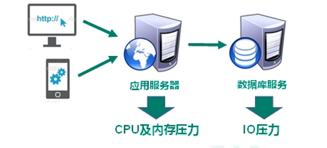

### **1.1.3.** nosql作用: **解决CPU及内存压力**

 

 

### **1.1.4.**  nosql作用:**解决IO压力**

 


## **1.2**  **NoSQL数据库**

**1.1.1.**  **NoSQL****数据库概述**

NoSQL(NoSQL = **Not Only SQL** )，意即“不仅仅是SQL”，泛指**非关系型的数据库**。 

NoSQL 不依赖业务逻辑方式存储，而以简单的key-value模式存储。因此大大的增加了数据库的扩展能力。

- l 不遵循SQL标准。
- l 不支持ACID。
- l 远超于SQL的性能。

# 1Redis 简介

 什么是Redis Redis是完全开源免费的，遵守BSD协议，是⼀个⾼性能（NOSQL）的key-value数据库。Redis是⼀个 开源的使⽤ANSI C语⾔编写、⽀持⽹络、可基于内存亦可持久化的⽇志型、Key-Value数据库，并提供 多种语⾔的API。

```
BSD是“Berkeley Software Distribution”的缩写，意思是“伯克利软件发⾏版”。
BSD开源协议是⼀个给与使⽤者很⼤⾃由的协议。可以⾃由的使⽤，修改源代码，也可以将修改后的代码作
为开源或者专有软件再发布。
BSD由于允许使⽤者修改或者重新发布代码，也允许使⽤或在BSD代码上开发商业软件发布和销售，因此是
对商业集成很友好的协议。
Linux:Ubuntu Redhat Centos
```

## redis存储的数据类型

# 2 Redis安装

##  2.1 安装前准备 

###  2.1.1**Redis官网**

官⽅⽹站：http://redis.io 

中⽂官⽹：http://redis.cn 

github:https://github.com/redis/redis

官⽅⽹站下载：http://redis.io/download 

##  2.2 **Redis 安装** 

参考过程:https://www.cnblogs.com/hunanzp/p/12304622.html

**Linux**

 Redis是C语⾔开发，安装Redis需要先将官⽹下载的源码进⾏编译，编译依赖GCC环境，如果没有GCC 环境，需要安装GCC

 

```sql
$ wget http://download.redis.io/releases/redis-5.0.5.tar.gz
$ tar xzf redis-5.0.5.tar.gz
$ cd redis-5.0.5
$ make
```


## 2.3  启动

Redis是一个C/S软件架构模型，我们想要启动Redis，我们得分为两步


- 启动服务端

  进入Redis的解压目录

  执行指令：`redis-server.exe [redis.conf path]`

  关闭server:在redis-cli中 `shutdown`

- 启动客户端

  执行指令：`redis-cli.exe [-h] [-p]`

  [-h] 和[-p]可以省略，默认是127.0.0.1 和 6379

  测试是否连接成功:`ping` 返回 `pong` 成功

### 2.3.2 redis 端口号为啥叫6379

link:http://oldblog.antirez.com/post/redis-as-LRU-cache.html

Today on Twitter I saw a tweet related to the ability to remember the Redis port number. There is a trick, the Redis port number, 6379, is **MERZ** at the phone keyboard.

Is it a coincidence that it sounds not random enough? Actually not ;) I selected 6379 because of MERZ, and not the other way around.


# 4. 配置


```properties
# Redis 默认不是以守护进程(后台)的⽅式运⾏，可以通过该配置项修改，使⽤yes启动守护进程
# 在windows上面不支持
daemonize no

# 当客户端闲置多长时间后关闭连接
# 0表示不关闭连接
timeout 0

# 端口号
# 一般我们也不需要去修改端口号
port 6379

# 绑定的主机地址：意思是只有下面的这个ip地址才能访问这个Redis服务器
# 0.0.0.0 这个表示所有的ip地址都可以访问这个Redis
bind 127.0.0.1
# bind 0.0.0.0 

# 日志级别的配置
loglevel verbose

# 这个是数据库的数量的设置 默认使用的是第一个库，编号是0
databases 16

# 密码的配置
requirepass foobared
```

## 4.2 持久化配置(面试重点)

持久化：持久化是指Redis本身是把数据存储在内存中的，但是Redis支持我们可以把内存中的数据持久化到磁盘，来保存数据

`AOF` stands for Append Only File. It's the change-log style persistent format.

`RDB` is for Redis Database File. It's the snapshot style persistence format.

### 4.2.1 RDB

> RDB is for Redis Database Backup(备份) file

RDB这种持久化的配置相当于照快照，照快照其实就是给内存中的数据拍照，保存的是数据的状态

**dump**：这个指令其实就是相当于给内存中的数据照快照。JVM是天然的支持快照这种技术的


> dump相关的面试题：如何解决内存溢出的问题？
>
> **快照:内存溢出解决方案**
>
> 通过查看jvm快照,在哪个对象看看内容有问题.

```properties
# 持久化生成文件的名字
dbfilename dump.rdb

# 文件保存的路径
dir D:\soft\Redis-x64-3.2.100\tmp

# RDB持久化的策略
save 900 1
save 300 10
save 60 10000
```

结论：RDB可能会丢失上一次持久化之后所有写入的数据

### 4.2.2 AOF

Append only file：这种持久化的方式是通过追加日志文件来做的。具体一点来说，AOF这种持久化的方式会把所有Redis服务收到的写入命令追加写入到日志文件中。如何恢复数据呢？其实就是去执行日志文件里面的写命令来恢复整个数据库的内容

```properties
# AOF持久化方式的总开关 yes|no
appendonly no

# 三种模式
# appendfsync always
appendfsync everysec
# appendfsync no

# 保存文件的位置
# 和RDB是同一个配置
dir D:\soft\Redis-x64-3.2.100\tmp

# 文件的名字
appendfilename "appendonly.aof"
```

结论：AOF这种持久化的方式理论上来说是可以做到不丢数据的。配置为 appendfsync always 的时候就可以不丢数据。一般不建议大家使用这种模式，因为配置了这种模式之后，写数据的效率会比较低，所以如果使用AOF，一般配置everysec这种模式，这种模式在效率和数据的安全性之间做了一个平衡。

### 4.2.3 区别

- RDB保存的是一整块内存，保存的是一个内存的状态，AOF是通过追加日志文件的方式写入命令
- RDB恢复数据比较快，AOF恢复数据相对来说比较慢
- RDB这种方式可能丢数据，AOF理论上可以做到不丢数据

那我们以后在公司里面一般使用哪种持久化方式呢？

> 两种可以同时使用，当AOF开启的时候，Redis去重建整个数据库的时候，会优先以AOF这持久化的策略去重建数据库

----


# 5.数据结构(重点)

[数据结构和命令紧密相连,redis常用命令](https://redis.io/commands)

> 命令其他参考:[菜鸟教程](https://www.runoob.com/redis/redis-commands.html)

Redis支持五种数据结构

## 5.1 string 

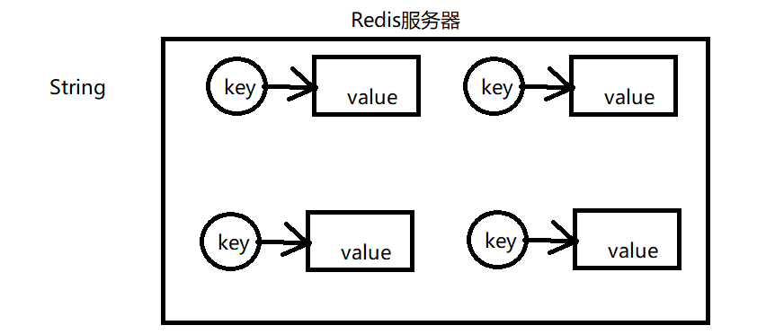

```properties
SET key value
GET key
INCR 可以对应的key的数值（整型的数值）加⼀( 原⼦操作)
INCRBY 给数值加上⼀个数
SETEX expire 过期
SETNX not exist key不存在的时候再去赋值
```

应用场景：很常⻅的场景⽤于统计⽹站访问数量 pv（Page view），当前在线⼈数等。incr命令(++操 作)

## 5.2 list

是个**栈**.

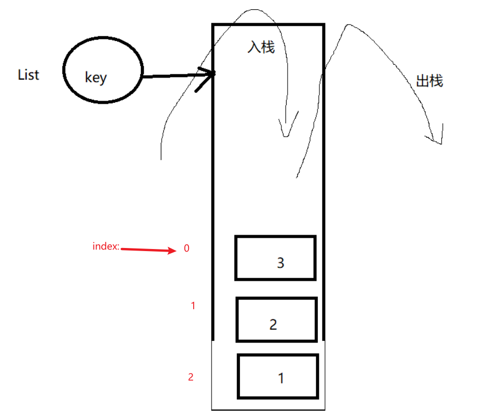

- list里面的元素有顺序
- list里面的元素可以重复

| 序号                                                         |
| :----------------------------------------------------------- |
| [LLEN key](https://www.runoob.com/redis/lists-llen.html)<br/>获取列表长度 |
| [LPOP key](https://www.runoob.com/redis/lists-lpop.html)<br/>移出并获取列表的第一个元素 |
| [ LPUSH key value1 [value2\]](https://www.runoob.com/redis/lists-lpush.html) 将一个或多个值插入到列表头部 |
| [LPUSHX key value](https://www.runoob.com/redis/lists-lpushx.html)<br/>将一个值插入到已存在的列表头部 |
| [LPUSHX key value](https://www.runoob.com/redis/lists-lpushx.html)<br/>将一个值插入到已存在的列表头部 |
| [LREM key count value](https://www.runoob.com/redis/lists-lrem.html)<br/>移除列表元素 |
| [LRANGE key start stop](https://www.runoob.com/redis/lists-lrange.html)<br/>获取列表指定范围内的元素 |
| [ LSET key index value](https://www.runoob.com/redis/lists-lset.html) 通过索引设置列表元素的值 |
| [RPUSHX key value](https://www.runoob.com/redis/lists-rpushx.html)<br/>为已存在的列表添加值 |

```properties
操作命令：
LPUSH 后⾯的元素放在栈顶
LPOP 返回第⼀个元素，并且在列表上删除该元素 （栈顶）
LLEN 返回当前的list列表的⻓度
LINDEX 返回当前的list的指定index下标的元素。没有返回nil，0表示栈顶的元素
LINSERT 插⼊的位置是按照index的顺序，Before的话得注意 index的值
LPUSHX 如果list存在，再去push
LRANGE 可以⽅便的查看某个index范围内的list的值。输⼊的index是从0开始，显示的标号是从1
开始的。
LREM 删除list⾥的指定的前⼏个（指定value的）元素
删除指定位置的元素：没有
LSET 设置指定的位置的元素的值 （修改） 输⼊的index是从0开始，显示的标号是从1开始的。
```

应用场景：

- 最新消息排行榜（例如bilibili）
- 可以去实现消息队列，在列表的一端推入消息，在另一边取出消息

## 5.3 hash

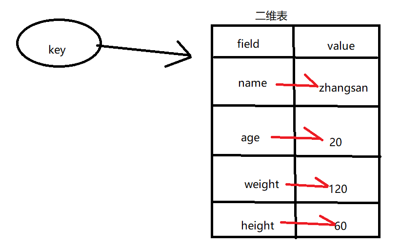

二维表

存的是key-value.

| 序号 | 命令及描述                                                   |
| :--- | :----------------------------------------------------------- |
| 1    | [HDEL key field1 [field2\]](https://www.runoob.com/redis/hashes-hdel.html) 删除一个或多个哈希表字段 |
| 2    | [HEXISTS key field](https://www.runoob.com/redis/hashes-hexists.html) 查看哈希表 key 中，指定的字段是否存在。 |
| 3    | [HGET key field](https://www.runoob.com/redis/hashes-hget.html) 获取存储在哈希表中指定字段的值。 |
| 4    | [HGETALL key](https://www.runoob.com/redis/hashes-hgetall.html) 获取在哈希表中指定 key 的所有字段和值 |
| 5    | [HINCRBY key field increment](https://www.runoob.com/redis/hashes-hincrby.html) 为哈希表 key 中的指定字段的整数值加上增量 increment 。 |
| 6    | [HINCRBYFLOAT key field increment](https://www.runoob.com/redis/hashes-hincrbyfloat.html) 为哈希表 key 中的指定字段的浮点数值加上增量 increment 。 |
| 7    | [HKEYS key](https://www.runoob.com/redis/hashes-hkeys.html) 获取所有哈希表中的字段 |
| 8    | [HLEN key](https://www.runoob.com/redis/hashes-hlen.html) 获取哈希表中字段的数量 |
| 9    | [HMGET key field1 [field2\]](https://www.runoob.com/redis/hashes-hmget.html) 获取所有给定字段的值 |
| 10   | [HMSET key field1 value1 [field2 value2 \]](https://www.runoob.com/redis/hashes-hmset.html) 同时将多个 field-value (域-值)对设置到哈希表 key 中。 |
| 11   | [HSET key field value](https://www.runoob.com/redis/hashes-hset.html) 将哈希表 key 中的字段 field 的值设为 value 。 |
| 12   | [HSETNX key field value](https://www.runoob.com/redis/hashes-hsetnx.html) 只有在字段 field 不存在时，设置哈希表字段的值。 |
| 13   | [HVALS key](https://www.runoob.com/redis/hashes-hvals.html) 获取哈希表中所有值。 |
| 14   | [HSCAN key cursor [MATCH pattern\] [COUNT count]](https://www.runoob.com/redis/hashes-hscan.html) 迭代哈希表中的键值对。 |

```properties
#将哈希表 key 中的域 field 的值设为 value 。
#如果 key 不存在，⼀个新的哈希表被创建并进⾏ HSET 操作。
#如果域 field 已经存在于哈希表中，旧值将被覆盖。
HSET key field value

#返回哈希表 key 中给定域 field 的值。如果不存在，返回nil
HGET 

# 查看哈希表 key 中，给定域 field 是否存在。
HEXISTS key field

#返回哈希表 key 中，所有的域和值。
#在返回值⾥，紧跟每个域名(field name)之后是域的值(value)，所以返回值的⻓度是哈希表⼤⼩的两倍。
HGETALL key

# 返回哈希表 key 中的所有值。
HKEYS key

# 返回哈希表 key 中所有域的值。
HVALS key

# 返回哈希表 key 中值的数量。
HLEN

# 为哈希表 key 中的域 field 的值加上增量 increment 
# 增量也可以为负数，相当于对给定域进⾏减法操作
HINCRBY key field increment

#返回哈希表 key 中，⼀个或多个给定域的值。
HMGET key field [field ...]

# 同时将多个 field-value (域-值)对设置到哈希表 key 中。
HMSET key field value [field value ...]

# 将哈希表 key 中的域 field 的值设置为 value ，当且仅当域 field 不存在。
# 若域 field 已经存在，该操作⽆效。
# 如果 key 不存在，⼀个新哈希表被创建并执⾏ HSETNX 命令。
HSETNX key field value
```

应用场景：可以用来存取对象


## 5.4 set

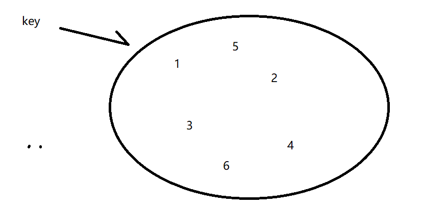

Redis 的 Set 是 String 类型的无序集合。集合成员是唯一的，这就意味着集合中不能出现重复的数据。

集合对象的编码可以是 intset 或者 hashtable。


Redis 中集合是通过哈希表实现的，所以添加，删除，查找的复杂度都是 O(1)。


因为这个数据结构里面存放的是没有顺序的元素。所有无序集合有两个特点

- 集合里面的元素不能重复
- 集合里面的元素没有顺序


| 序号 | 命令及描述                                                   |
| :--- | :----------------------------------------------------------- |
| 1    | [SADD key member1 [member2\]](https://www.runoob.com/redis/sets-sadd.html) 向集合添加一个或多个成员 |
| 2    | [SCARD key](https://www.runoob.com/redis/sets-scard.html) 获取集合的成员数 |
| 3    | [SDIFF key1 [key2\]](https://www.runoob.com/redis/sets-sdiff.html) 返回第一个集合与其他集合之间的差异。 |
| 4    | [SDIFFSTORE destination key1 [key2\]](https://www.runoob.com/redis/sets-sdiffstore.html) 返回给定所有集合的差集并存储在 destination 中 |
| 5    | [SINTER key1 [key2\]](https://www.runoob.com/redis/sets-sinter.html) 返回给定所有集合的交集 |
| 6    | [SINTERSTORE destination key1 [key2\]](https://www.runoob.com/redis/sets-sinterstore.html) 返回给定所有集合的交集并存储在 destination 中 |
| 7    | [SISMEMBER key member](https://www.runoob.com/redis/sets-sismember.html) 判断 member 元素是否是集合 key 的成员 |
| 8    | [SMEMBERS key](https://www.runoob.com/redis/sets-smembers.html) 返回集合中的所有成员 |
| 9    | [SMOVE source destination member](https://www.runoob.com/redis/sets-smove.html) 将 member 元素从 source 集合移动到 destination 集合 |
| 10   | [SPOP key](https://www.runoob.com/redis/sets-spop.html) 移除并返回集合中的一个随机元素 |
| 11   | [SRANDMEMBER key [count\]](https://www.runoob.com/redis/sets-srandmember.html) 返回集合中一个或多个随机数 |
| 12   | [SREM key member1 [member2\]](https://www.runoob.com/redis/sets-srem.html) 移除集合中一个或多个成员 |
| 13   | [SUNION key1 [key2\]](https://www.runoob.com/redis/sets-sunion.html) 返回所有给定集合的并集 |
| 14   | [SUNIONSTORE destination key1 [key2\]](https://www.runoob.com/redis/sets-sunionstore.html) 所有给定集合的并集存储在 destination 集合中 |
| 15   | [SSCAN key cursor [MATCH pattern\] [COUNT count]](https://www.runoob.com/redis/sets-sscan.html) 迭代集合中的元素 |

```properties
SADD key member [member ...]
#将⼀个或多个 member 元素加⼊到集合 key 当中，已经存在于集合的 member 元素将被忽略。
#假如 key 不存在，则创建⼀个只包含 member 元素作成员的集合。
#当 key 不是集合类型时，返回⼀个错误。

SMEMBERS key
#返回集合 key 中的所有成员。
#不存在的 key 被视为空集合。

SISMEMBER key member
# 判断 member 元素是否集合 key 的成员。

SCARD key
#返回集合 key 的基数(集合中元素的数量)。

SPOP key
#移除并返回集合中的⼀个随机元素。
#如果只想获取⼀个随机元素，但不想该元素从集合中被移除的话，可以使⽤ SRANDMEMBER 命令。

SRANDMEMBER key [count]
#如果命令执⾏时，只提供了 key 参数，那么返回集合中的⼀个随机元素。
#随机取出 count个元素（不删除）

SINTER key [key ...]
#返回⼀个集合的全部成员，该集合是所有给定集合的交集。
#不存在的 key 被视为空集。

SINTERSTORE destination key [key ...]
#这个命令类似于 SINTER 命令，但它将结果保存到 destination 集合，⽽不是简单地返回结果集。
#如果 destination 集合已经存在，则将其覆盖。

SUNION key [key ...]
#返回⼀个集合的全部成员，该集合是所有给定集合的并集。
#不存在的 key 被视为空集。

SUNIONSTORE destination key [key ...]
#这个命令类似于 SUNION 命令，但它将结果保存到 destination 集合，⽽不是简单地返回结果集。
#如果 destination 已经存在，则将其覆盖。

SDIFF key [key ...]
#返回⼀个集合的全部成员，该集合是所有给定集合之间的差集。
#不存在的 key 被视为空集。

SDIFFSTORE destination key [key ...]
#这个命令的作⽤和 SDIFF 类似，但它将结果保存到 destination 集合，⽽不是简单地返回结果集。
#如果 destination 集合已经存在，则将其覆盖。 destination 可以是 key 本身。

SMOVE source destination member
#将 member 元素从 source 集合移动到 destination 集合。SMOVE 是原⼦性操作。

SREM key member [member ...]
#移除集合 key 中的⼀个或多个 member 元素，不存在的 member 元素会被忽略。当 key 不是集合类型，返回⼀个错误
```

应用场景：

- 好友推荐

  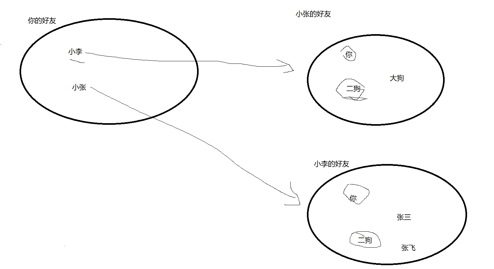

## 5.5 sort set

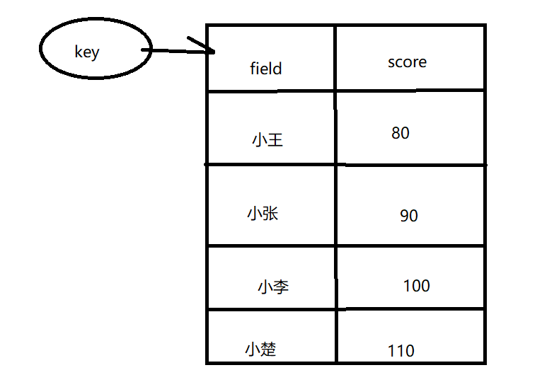

命令

```properties
ZADD key score member [[score member] [score member] ...]
# 将⼀个或多个 member 元素及其 score 值加⼊到有序集 key 当中。

ZCARD key
#返回有序集 key 的基数。

ZSCORE key member
#返回有序集 key 中，成员 member 的 score 值。
#如果 member 元素不是有序集 key 的成员，或 key 不存在，返回 nil 。

ZCOUNT key min max
#返回有序集 key 中， score 值在 min 和 max 之间(默认包括 score 值等于 min 或 max )的成员的数量。

ZINCRBY key increment member
#为有序集 key 的成员 member 的 score 值加上增量 increment 。

ZRANGE key start stop [WITHSCORES]
# 显示一个排名区间内的成员，排名从0开始，按照分数从小到大来排序的
#返回有序集 key 中，指定区间内的成员。
#其中成员的位置按 score 值递增(从⼩到⼤)来排序。
#具有相同 score 值的成员按字典序(lexicographical order )来排列。

ZRANGEBYSCORE key min max [WITHSCORES] [LIMIT offset count]
#返回有序集 key 中，所有 score 值介于 min 和 max 之间(包括等于 min 或 max )的成员。
#有序集成员按 score 值递增(从⼩到⼤)次序排列。
#根据指定的分值范围去查找

ZRANK key member
#返回有序集 key 中成员 member 的排名。其中有序集成员按 score 值递增(从⼩到⼤)顺序排列。


ZREVRANGE key start stop [WITHSCORES]
#返回有序集 key 中，指定区间内的成员。
#其中成员的位置按 score 值递减(从⼤到⼩)来排列。

ZREVRANGEBYSCORE
# 返回一个分数区间内的成员，按照分数从高到低排序

ZREVRANK key member
#返回有序集 key 中成员 member 的排名。其中有序集成员按 score 值递减(从⼤到⼩)排序。
#排名以 0 为底，也就是说， score 值最⼤的成员排名为 0 。
#使⽤ ZRANK 命令可以获得成员按 score 值递增(从⼩到⼤)排列的排名。

ZREM key member [member ...]
#移除有序集 key 中的⼀个或多个成员，不存在的成员将被忽略。
#当 key 存在但不是有序集类型时，返回⼀个错误。

ZREMRANGEBYRANK key start stop
#移除有序集 key 中，指定排名(rank)区间内的所有成员。
#区间分别以下标参数 start 和 stop 指出，包含 start 和 stop 在内。

ZREMRANGEBYSCORE key min max
#移除有序集 key 中，所有 score 值介于 min 和 max 之间(包括等于 min 或 max )的成员
```

作用场景：

- 积分排行榜

## 其他命令

- keys pattern: 根据正则表达式去匹配key
- auth password：密码认证
- flushdb ：清空当前的数据库（危险）
- flushall：清空所有的数据库（危险）

- save：手动持久化
- bgsave：后台持久化


# 6. [Jedis客户端(相当于JDBC)](https://github.com/redis/jedis)

github project:https://github.com/redis/jedis

> For more usage examples check the tests.
>
> Please check the [wiki](http://github.com/redis/jedis/wiki). There are lots of cool things you should know, including information about connection pooling.

Java for redis，其实就是一个Java的Redis客户端（Java的redis客户端不仅仅只有这一个）

如何使用呢？

- 导包

  ```xml
  <!--jedis-->
  <dependency>
      <groupId>redis.clients</groupId>
      <artifactId>jedis</artifactId>
      <version>2.9.0</version>
  </dependency>
  ```

- 配置

  配置一个Jedis对象(主要操作class)

  ```
  /*jedis 重写了 redis的全部数据结构操作方法*/
  /*也就是锁,只要按照linux三redis命令正常操作就是了*/
  ```

  ```java
  static Jedis jedis;
  
  @BeforeClass
  public static void init(){
  
      // 指定 ip和端口号
      jedis = new Jedis("localhost",6379);
  
      // 设置密码
      jedis.auth("cskaoyan");
  
  }
  ```

- 使用

  和命令是一致的

  ```java
  @Test
  public void test01(){
  
      jedis.setnx("name","张飞");
  
  }
  
  @Test
  public void test02(){
  
      String name = jedis.get("name");
  
      System.out.println(name);
  
  }
  
  @Test
  public void testHash(){
  
      jedis.hset("user","name","老王");
      jedis.hset("user","age","50");
  
  }
  @Test
  public void testHashGet(){
  
      String name = jedis.hget("user", "name");
      String age = jedis.hget("user", "age");
  
      System.out.println("name:" + name + ", age:" + age);
  }
  
  .....
  ```


# 7.[reids图形化客户端](https://github.com/qishibo/AnotherRedisDesktopManager)

link:https://github.com/qishibo/AnotherRedisDesktopManager

实际画面:

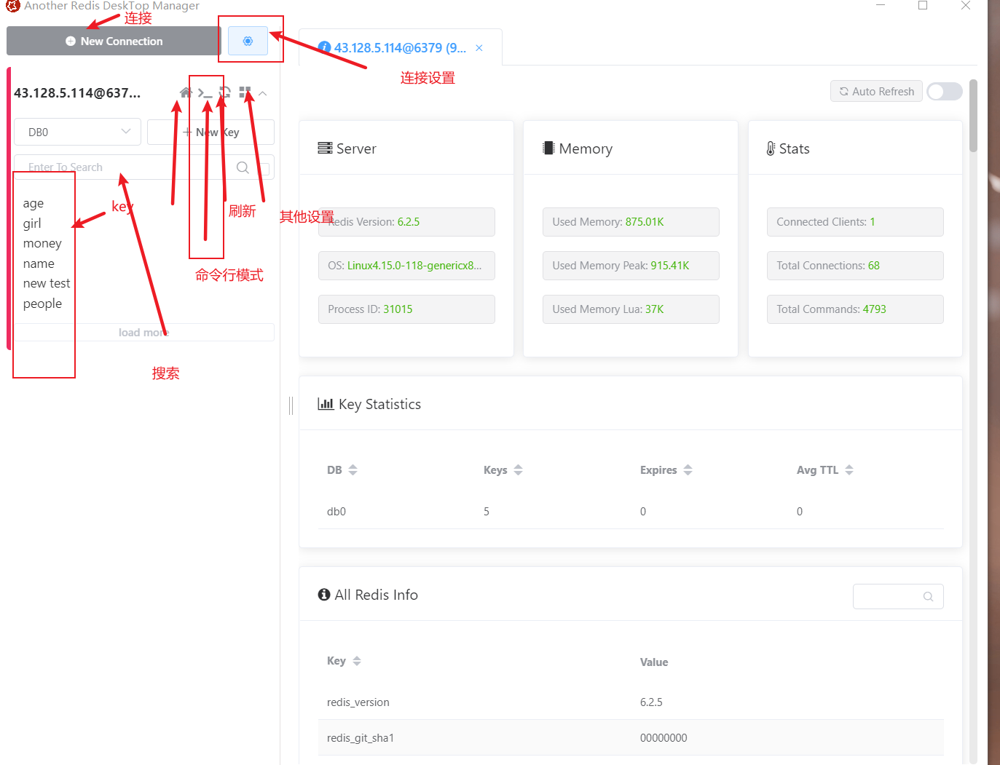


## 那么如何使用:

服务端配置:

[访问远程Redis服务。Connect to Remote Redis Server](https://blog.csdn.net/kinginblue/article/details/51619445)

[Redis 密码设置和查看密码](https://www.cnblogs.com/suanshun/p/7699084.html)

### 连接

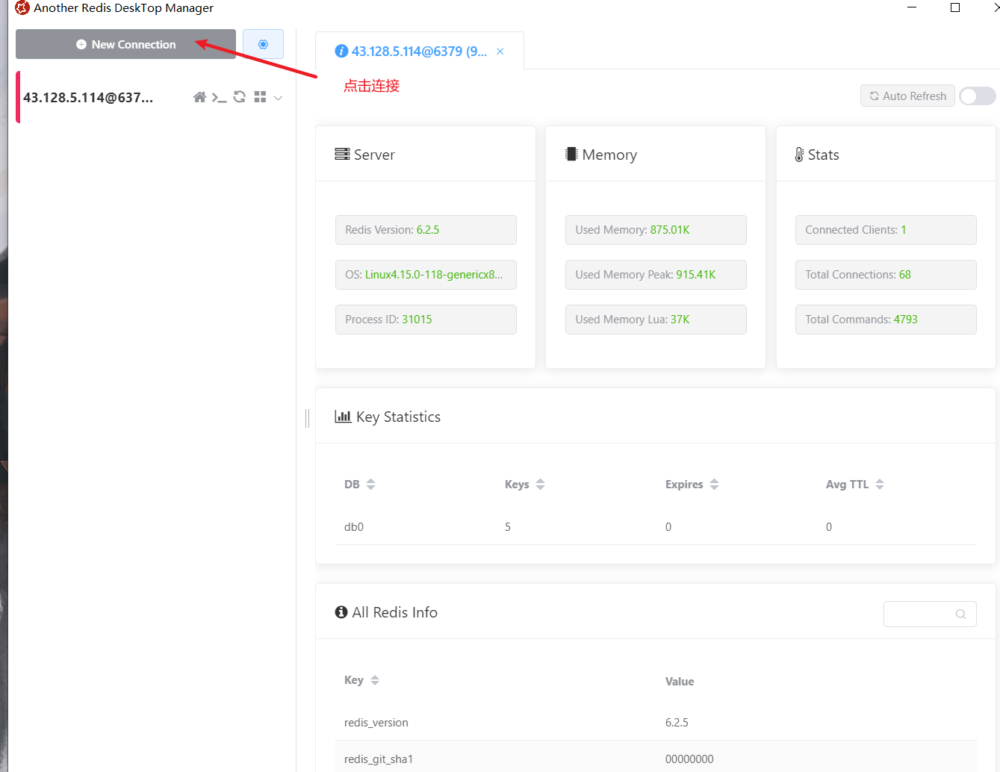配置连接

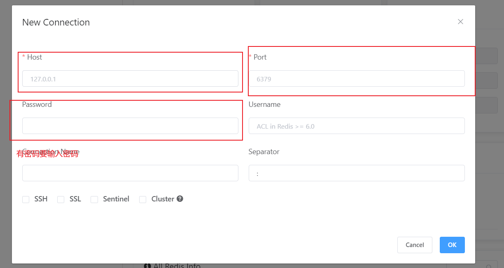

**点击连接**

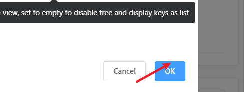

redis状态

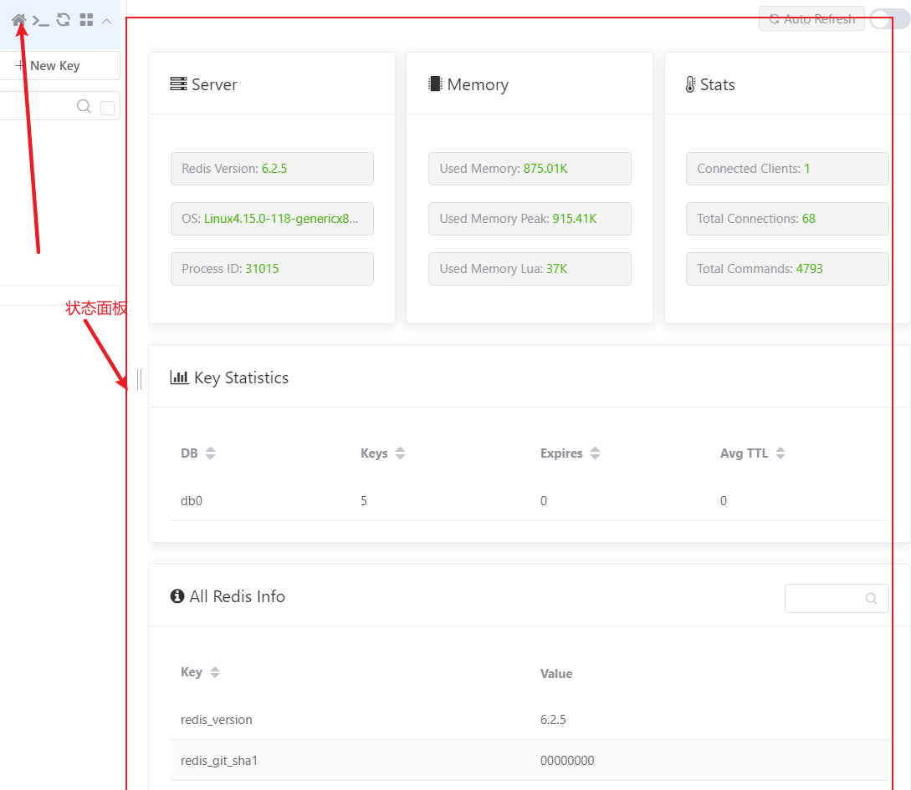

**命令行**

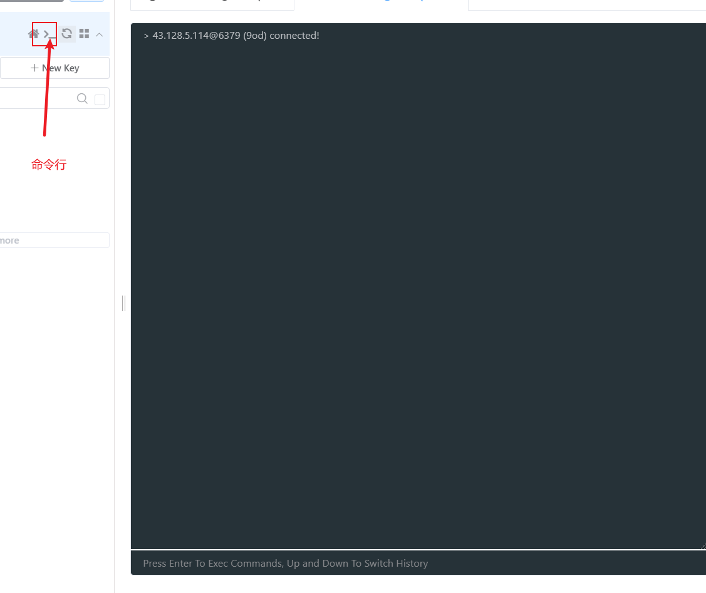

关闭连接

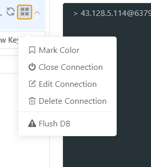

# 8 内存淘汰策略(重点):

Redis官⽅给的警告，当**内存不足**时，Redis会根据配置的缓存策略**淘汰部分的Keys**，以保证写⼊成功。 当无淘汰策略时或者没有找到适合淘汰的Key时，Redis直接返回 out of memory错误。

 **最⼤缓存配置** 

在Redis中，允许⽤户设置的最⼤使⽤内存⼤⼩ maxmemory 512G 

**Redis提供8种（5.0以后）数据淘汰策略：** volatile-lru：从已设置过期时间的数据集中挑选最近最少使⽤的数据淘汰

 volatile-lfu：从已设置过期的Keys中，删除⼀段时间内使⽤次数最少使⽤ 的key volatile-ttl：从已设置过期时间的数据集中挑选最近将要过期的数据进⾏淘汰 

volatile-random：从已设置过期时间的数据集中随机选择数据淘汰 

allkeys-lru：从数据集中挑选最近最少使⽤的数据淘汰 

allkeys-lfu：从所有的keys中，删除⼀段时间内使⽤次数最少的key 

**allkeys-random**：从数据集中随机选择数据淘汰 no-enviction（驱逐）：禁⽌驱逐数据（不采⽤任何淘汰策略。默认即此配置），内存不⾜时，针 对写操作，返回错误信息 

**建议**：了解了Redis的淘汰策略之后，在平时使⽤时应尽量主动设置/更新key的expire时间，主动剔除 不活跃的旧数据，有助于提升查询性能


在公司中常用**volatile-random** ,因为一般redis中存放的是常用的数据缓存,却不是敏感数据,所以就算有确实也可以.


# 补充

## 1 常规配置

### linu搜索增加操作

命令模式下

```
/vlaue 
```

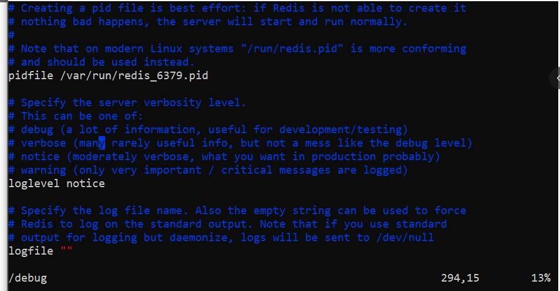


## 2 其他

> 其他参考
>
> [访问远程Redis服务。Connect to Remote Redis Server](https://blog.csdn.net/kinginblue/article/details/51619445)
>
> [Redis 密码设置和查看密码](https://www.cnblogs.com/suanshun/p/7699084.html)

