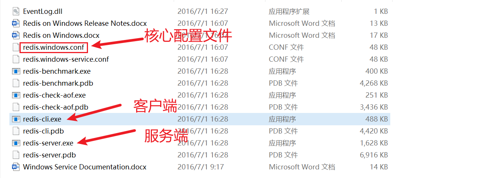
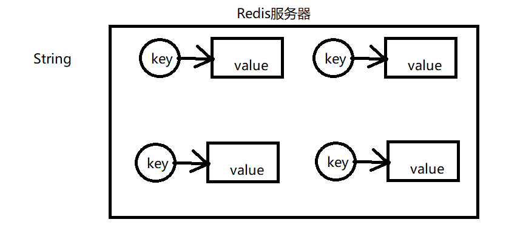
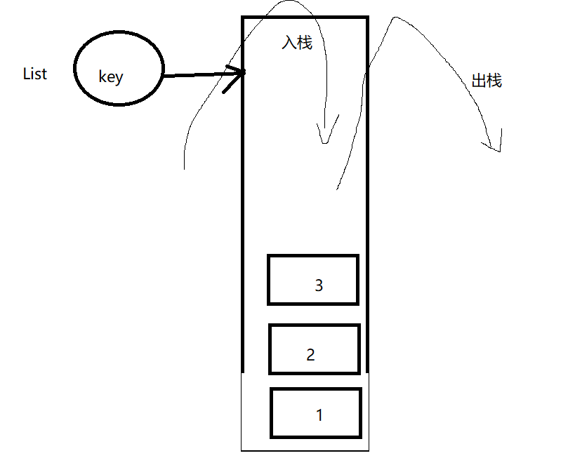
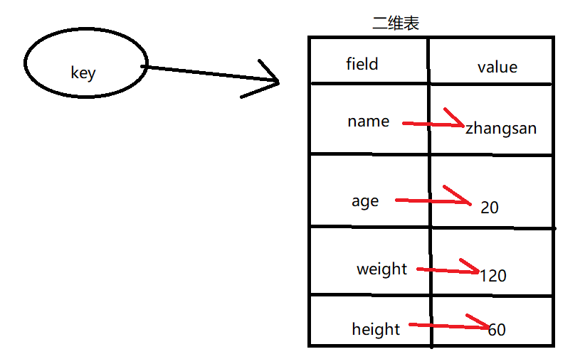
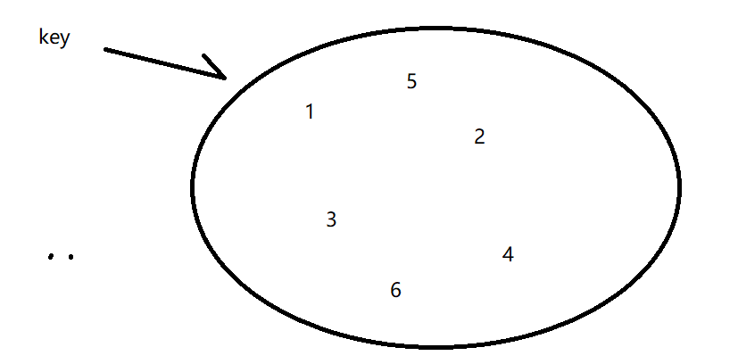
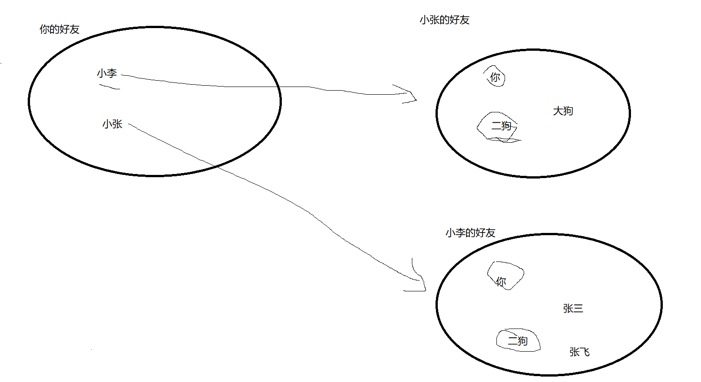
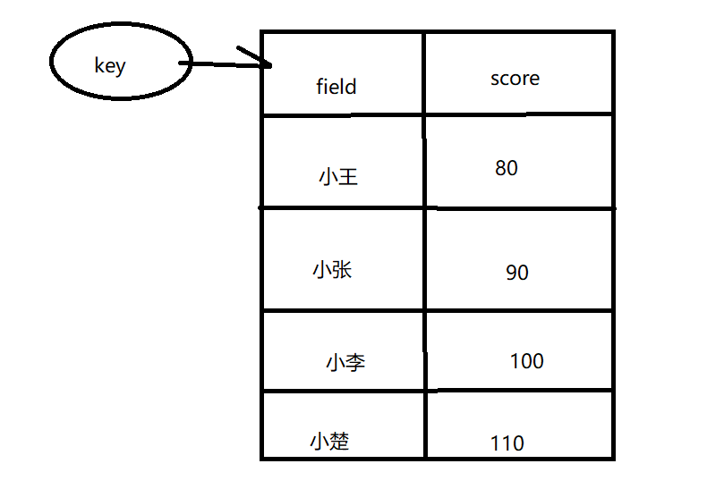

> # Redis
>

## 1. 简介

Redis是一个高性能的NoSQL数据库；Redis是一个缓存中间件，更多的是提供一个缓存的功能

关键词：支持网络、NoSQL、高性能、key-value

## 2. 安装

- 下载

  [下载地址](https://github.com/microsoftarchive/redis/releases/download/win-3.2.100/Redis-x64-3.2.100.zip)

- 解压

  解压路径不要中文或者是空格

  

- 配置环境变量

## 3. 启动

Redis是一个C/S软件架构模型，我们想要启动Redis，我们得分为两步

不推荐大家在windows上面双击启动

- 启动服务端

  进入Redis的解压目录

  执行指令：`redis-server.exe redis.windows.conf`

- 启动客户端

  执行指令：`redis-cli.exe [-h] [-p]`

  [-h] 和[-p]可以省略，默认是127.0.0.1 和 6379


## 4. 配置

### 4.1. 常规配置

```properties
# Redis 默认不是以守护进程(后台)的⽅式运⾏，可以通过该配置项修改，使⽤yes启动守护进程
# 在windows上面不支持
daemonize no

# 当客户端闲置多长时间后关闭连接
# 0表示不关闭连接
timeout 0

# 端口号
# 一般我们也不需要去修改端口号
port 6379

# 绑定的主机地址：意思是只有下面的这个ip地址才能访问这个Redis服务器
# 0.0.0.0 这个表示所有的ip地址都可以访问这个Redis
bind 127.0.0.1
# bind 0.0.0.0 

# 日志级别的配置
loglevel verbose

# 这个是数据库的数量的设置 默认使用的是第一个库，编号是0
databases 16

# 密码的配置
requirepass foobared
```

### 4.2 持久化配置

持久化：持久化是指Redis本身是把数据存储在内存中的，但是Redis支持我们可以把内存中的数据持久化到磁盘，来保存数据

#### RDB

RDB这种持久化的配置相当于照快照，照快照其实就是给内存中的数据拍照，保存的是数据的状态

dump：这个指令其实就是相当于给内存中的数据照快照。JVM是天然的支持快照这种技术的

dump相关的面试题：如何解决内存溢出的问题？

```properties
# 持久化生成文件的名字
dbfilename dump.rdb

# 文件保存的路径
dir D:\soft\Redis-x64-3.2.100\tmp

# RDB持久化的策略
save 900 1
save 300 10
save 60 10000
```


结论：RDB可能会丢失上一次持久化之后所有写入的数据

#### AOF

Append only file：这种持久化的方式是通过追加日志文件来做的。具体一点来说，AOF这种持久化的方式会把所有Redis服务收到的写入命令追加写入到日志文件中。如何恢复数据呢？其实就是去执行日志文件里面的写命令来恢复整个数据库的内容

```properties
# AOF持久化方式的总开关 yes|no
appendonly no

# 三种模式
# appendfsync always
appendfsync everysec
# appendfsync no

# 保存文件的位置
# 和RDB是同一个配置
dir D:\soft\Redis-x64-3.2.100\tmp

# 文件的名字
appendfilename "appendonly.aof"
```

结论：AOF这种持久化的方式理论上来说是可以做到不丢数据的。配置为 appendfsync always 的时候就可以不丢数据。一般不建议大家使用这种模式，因为配置了这种模式之后，写数据的效率会比较低，所以如果使用AOF，一般配置everysec这种模式，这种模式在效率和数据的安全性之间做了一个平衡。

#### 区别

- RDB保存的是一整块内存，保存的是一个内存的状态，AOF是通过追加日志文件的方式写入命令
- RDB恢复数据比较快，AOF恢复数据相对来说比较慢
- RDB这种方式可能丢数据，AOF理论上可以做到不丢数据

那我们以后在公司里面一般使用哪种持久化方式呢？

> 两种可以同时使用，当AOF开启的时候，Redis去重建整个数据库的时候，会优先以AOF这持久化的策略去重建数据库

## 5. 数据结构

Redis支持五种数据结构

### 5.1 string 



```properties
SET key value
GET key
INCR 可以对应的key的数值（整型的数值）加⼀( 原⼦操作)
INCRBY 给数值加上⼀个步⻓
SETEX expire 过期
SETNX not exist key不存在的时候再去赋值
```

应用场景：很常⻅的场景⽤于统计⽹站访问数量 pv（Page view），当前在线⼈数等。incr命令(++操 作)

### 5.2 list



- list里面的元素有顺序
- list里面的元素可以重复

```properties
操作命令：
LPUSH 后⾯的元素放在栈顶
LPOP 返回第⼀个元素，并且在列表上删除该元素 （栈顶）
LLEN 返回当前的list列表的⻓度
LINDEX 返回当前的list的指定index下标的元素。没有返回nil，0表示栈顶的元素
LINSERT 插⼊的位置是按照index的顺序，Before的话得注意 index的值
LPUSHX 如果list存在，再去push
LRANGE 可以⽅便的查看某个index范围内的list的值。输⼊的index是从0开始，显示的标号是从1
开始的。
LREM 删除list⾥的指定的前⼏个（指定value的）元素
删除指定位置的元素：没有
LSET 设置指定的位置的元素的值 （修改） 输⼊的index是从0开始，显示的标号是从1开始的。
```

应用场景：

- 最新消息排行榜（例如bilibili）
- 可以去实现消息队列，在列表的一端推入消息，在另一边取出消息

### 5.3 hash


```properties
#将哈希表 key 中的域 field 的值设为 value 。
#如果 key 不存在，⼀个新的哈希表被创建并进⾏ HSET 操作。
#如果域 field 已经存在于哈希表中，旧值将被覆盖。
HSET key field value

#返回哈希表 key 中给定域 field 的值。如果不存在，返回nil
HGET 

# 查看哈希表 key 中，给定域 field 是否存在。
HEXISTS key field

#返回哈希表 key 中，所有的域和值。
#在返回值⾥，紧跟每个域名(field name)之后是域的值(value)，所以返回值的⻓度是哈希表⼤⼩的两倍。
HGETALL key

# 返回哈希表 key 中的所有值。
HKEYS key

# 返回哈希表 key 中所有域的值。
HVALS key

# 返回哈希表 key 中值的数量。
HLEN

# 为哈希表 key 中的域 field 的值加上增量 increment 
# 增量也可以为负数，相当于对给定域进⾏减法操作
HINCRBY key field increment

#返回哈希表 key 中，⼀个或多个给定域的值。
HMGET key field [field ...]

# 同时将多个 field-value (域-值)对设置到哈希表 key 中。
HMSET key field value [field value ...]

# 将哈希表 key 中的域 field 的值设置为 value ，当且仅当域 field 不存在。
# 若域 field 已经存在，该操作⽆效。
# 如果 key 不存在，⼀个新哈希表被创建并执⾏ HSETNX 命令。
HSETNX key field value
```

应用场景：可以用来存取对象


### 5.4 set



因为这个数据结构里面存放的是没有顺序的元素。所有无序集合有两个特点

- 集合里面的元素不能重复
- 集合里面的元素没有顺序

```properties
SADD key member [member ...]
#将⼀个或多个 member 元素加⼊到集合 key 当中，已经存在于集合的 member 元素将被忽略。
#假如 key 不存在，则创建⼀个只包含 member 元素作成员的集合。
#当 key 不是集合类型时，返回⼀个错误。

SMEMBERS key
#返回集合 key 中的所有成员。
#不存在的 key 被视为空集合。

SISMEMBER key member
# 判断 member 元素是否集合 key 的成员。

SCARD key
#返回集合 key 的基数(集合中元素的数量)。

SPOP key
#移除并返回集合中的⼀个随机元素。
#如果只想获取⼀个随机元素，但不想该元素从集合中被移除的话，可以使⽤ SRANDMEMBER 命令。

SRANDMEMBER key [count]
#如果命令执⾏时，只提供了 key 参数，那么返回集合中的⼀个随机元素。
#随机取出 count个元素（不删除）

SINTER key [key ...]
#返回⼀个集合的全部成员，该集合是所有给定集合的交集。
#不存在的 key 被视为空集。

SINTERSTORE destination key [key ...]
#这个命令类似于 SINTER 命令，但它将结果保存到 destination 集合，⽽不是简单地返回结果集。
#如果 destination 集合已经存在，则将其覆盖。

SUNION key [key ...]
#返回⼀个集合的全部成员，该集合是所有给定集合的并集。
#不存在的 key 被视为空集。

SUNIONSTORE destination key [key ...]
#这个命令类似于 SUNION 命令，但它将结果保存到 destination 集合，⽽不是简单地返回结果集。
#如果 destination 已经存在，则将其覆盖。

SDIFF key [key ...]
#返回⼀个集合的全部成员，该集合是所有给定集合之间的差集。
#不存在的 key 被视为空集。

SDIFFSTORE destination key [key ...]
#这个命令的作⽤和 SDIFF 类似，但它将结果保存到 destination 集合，⽽不是简单地返回结果集。
#如果 destination 集合已经存在，则将其覆盖。 destination 可以是 key 本身。

SMOVE source destination member
#将 member 元素从 source 集合移动到 destination 集合。SMOVE 是原⼦性操作。

SREM key member [member ...]
#移除集合 key 中的⼀个或多个 member 元素，不存在的 member 元素会被忽略。当 key 不是集合类型，返回⼀个错误
```

应用场景：

- 好友推荐

  

### 5.5 sort set



命令

```properties
ZADD key score member [[score member] [score member] ...]
# 将⼀个或多个 member 元素及其 score 值加⼊到有序集 key 当中。

ZCARD key
#返回有序集 key 的基数。

ZSCORE key member
#返回有序集 key 中，成员 member 的 score 值。
#如果 member 元素不是有序集 key 的成员，或 key 不存在，返回 nil 。

ZCOUNT key min max
#返回有序集 key 中， score 值在 min 和 max 之间(默认包括 score 值等于 min 或 max )的成员的数量。

ZINCRBY key increment member
#为有序集 key 的成员 member 的 score 值加上增量 increment 。

ZRANGE key start stop [WITHSCORES]
# 显示一个排名区间内的成员，排名从0开始，按照分数从小到大来排序的
#返回有序集 key 中，指定区间内的成员。
#其中成员的位置按 score 值递增(从⼩到⼤)来排序。
#具有相同 score 值的成员按字典序(lexicographical order )来排列。

ZRANGEBYSCORE key min max [WITHSCORES] [LIMIT offset count]
#返回有序集 key 中，所有 score 值介于 min 和 max 之间(包括等于 min 或 max )的成员。
#有序集成员按 score 值递增(从⼩到⼤)次序排列。
#根据指定的分值范围去查找

ZRANK key member
#返回有序集 key 中成员 member 的排名。其中有序集成员按 score 值递增(从⼩到⼤)顺序排列。


ZREVRANGE key start stop [WITHSCORES]
#返回有序集 key 中，指定区间内的成员。
#其中成员的位置按 score 值递减(从⼤到⼩)来排列。

ZREVRANGEBYSCORE
# 返回一个分数区间内的成员，按照分数从高到低排序

ZREVRANK key member
#返回有序集 key 中成员 member 的排名。其中有序集成员按 score 值递减(从⼤到⼩)排序。
#排名以 0 为底，也就是说， score 值最⼤的成员排名为 0 。
#使⽤ ZRANK 命令可以获得成员按 score 值递增(从⼩到⼤)排列的排名。

ZREM key member [member ...]
#移除有序集 key 中的⼀个或多个成员，不存在的成员将被忽略。
#当 key 存在但不是有序集类型时，返回⼀个错误。

ZREMRANGEBYRANK key start stop
#移除有序集 key 中，指定排名(rank)区间内的所有成员。
#区间分别以下标参数 start 和 stop 指出，包含 start 和 stop 在内。

ZREMRANGEBYSCORE key min max
#移除有序集 key 中，所有 score 值介于 min 和 max 之间(包括等于 min 或 max )的成员
```

作用场景：

- 积分排行榜

### 其他命令

- keys pattern: 根据正则表达式去匹配key
- auth password：密码认证
- flushdb ：情空当前的数据库（危险）
- flushall：清空所有的数据库（危险）

- save：手动持久化
- bgsave：后台持久化


## 6. Jedis客户端

Java for redis，其实就是一个Java的Redis客户端（Java的redis客户端不仅仅只有这一个）

如何使用呢？

- 导包

  ```xml
  <!--jedis-->
  <dependency>
      <groupId>redis.clients</groupId>
      <artifactId>jedis</artifactId>
      <version>2.9.0</version>
  </dependency>
  ```

- 配置

  配置一个Jedis对象

  ```java
  static Jedis jedis;
  
  @BeforeClass
  public static void init(){
  
      // 指定 ip和端口号
      jedis = new Jedis("localhost",6379);
  
      // 设置密码
      jedis.auth("cskaoyan");
  
  }
  ```

- 使用

  和命令是一致的

  ```java
  @Test
  public void test01(){
  
      jedis.setnx("name","张飞");
  
  }
  
  @Test
  public void test02(){
  
      String name = jedis.get("name");
  
      System.out.println(name);
  
  }
  
  @Test
  public void testHash(){
  
      jedis.hset("user","name","老王");
      jedis.hset("user","age","50");
  
  }
  @Test
  public void testHashGet(){
  
      String name = jedis.hget("user", "name");
      String age = jedis.hget("user", "age");
  
      System.out.println("name:" + name + ", age:" + age);
  }
  
  .....
  ```


## 7. 图形化界面客户端

[下载地址](https://github.com/qishibo/AnotherRedisDesktopManager/releases)

## 8 .内存淘汰策略

