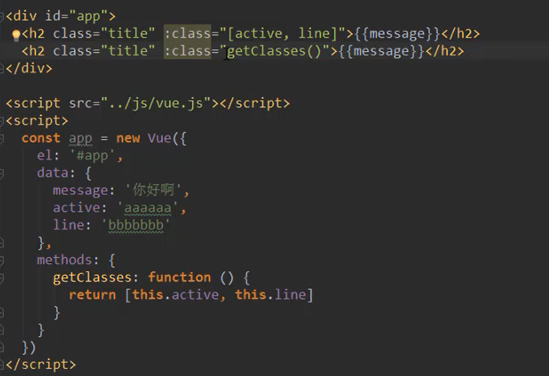

# vue study

相关阅读:

[node js](node_js.md)

[elementUI.md](elementUI.md)

[项目开发流程.md](项目开发流程.md)


视频教程(初学视频速度快,不费脑.也知道大概架构和思路):https://www.bilibili.com/video/BV15741177Eh?p=19

官方文档:vue2:https://cn.vuejs.org/v2/guide/installation.html

以前学习的vue:https://github.com/ytwotap/TyporaRecord/blob/3658f18ca7246f611c6202ad4ca8fb26d7176813/js/js%E6%A1%86%E6%9E%B6study/vue%20%E5%AD%A6%E4%B9%A0.md

**code**:https://github.com/ytwotap/TyporaRecord/tree/onenote/3-front-end%20development/FE/code

写代码思路:

1.思考思考实现的功能,注意是按照Vue核心设计思路.

2.看指令集,使用相应的指令集实现,如文本信息,属性,v-model,事件(v-on),重复生成(v-for).实现.

3.实现不了的先晚上找大概过程和代码,在文档中看详解.(文档没有的别乱写)

# **vue核心设计思路**


# 安装

### 开发工具安装

#### [Vue Devtools](https://cn.vuejs.org/v2/guide/installation.html#Vue-Devtools)

在使用 Vue 时，我们推荐在你的浏览器上安装 [Vue Devtools](https://github.com/vuejs/vue-devtools#vue-devtools)。它允许你在一个更友好的界面中审查和调试 Vue 应用。

### 使用cdn vue;

对于制作原型或学习，你可以这样使用最新版本：

```
<script src="https://cdn.jsdelivr.net/npm/vue@2.6.14/dist/vue.js"></script>
```

对于生产环境，我们推荐链接到一个明确的版本号和构建文件，以避免新版本造成的不可预期的破坏：

```
<script src="https://cdn.jsdelivr.net/npm/vue@2.6.14"></script>
```

### 使用npm vue

在用 Vue 构建大型应用时推荐使用 NPM 安装[[1\]](https://cn.vuejs.org/v2/guide/installation.html#footnote-1)。NPM 能很好地和诸如 [webpack](https://webpack.js.org/) 或 [Browserify](http://browserify.org/) 模块打包器配合使用。同时 Vue 也提供配套工具来开发[单文件组件](https://cn.vuejs.org/v2/guide/single-file-components.html)。

```
# 最新稳定版
$ npm install vue
```

环境对比和版本等:https://cn.vuejs.org/v2/guide/installation.html#%E5%AF%B9%E4%B8%8D%E5%90%8C%E6%9E%84%E5%BB%BA%E7%89%88%E6%9C%AC%E7%9A%84%E8%A7%A3%E9%87%8A


# 文档基础入门

## 介绍:

Vue (读音 /vjuː/，类似于 **view**) 是一套用于构建用户界面的**渐进式框架**。

Vue 被设计为可以自底向上逐层应用。Vue 的核心库只关注视图层，不仅易于上手，还便于与第三方库或既有项目整合。另一方面，当与[现代化的工具链](https://cn.vuejs.org/v2/guide/single-file-components.html)以及各种[支持类库](https://github.com/vuejs/awesome-vue#libraries--plugins)结合使用时，Vue 也完全能够为复杂的单页应用提供驱动。

## [声明式渲染](https://cn.vuejs.org/v2/guide/index.html#声明式渲染)

所有东西都是**响应式的**

code:

```html
<!DOCTYPE html>
<html lang="en">
<head>
    <meta charset="UTF-8">
    <title>Title</title>
<!--    <script src="https://cdn.jsdelivr.net/npm/vue@2.6.14"></script>-->
    <script src="./vue.js">

    </script>
</head>
<body>
<!--{{ } }: 按照vue语法取解释,叫插值表达式-->
<!--{{ } }: 对应绑定的vue对象种,根据表达式计算,显示结果 -->
<div id="app">
    {{ message }}
    <hr>
    {{message2}}
</div>
<div class="yt">
</div>
<script>
    /*创建一个 vue 对象*/
    //一旦vue对象篡改了,立即 (放在后面)查找el的属性,根据el属性所指向的标签(id)
    //吧这个vue对象和html的标签建立联系
    //绑定的html作用域由html-->html+vue作用域
    //重新解释作用域vue的语法.
    //注意:绑定只能绑定div上
    var app = new Vue({ //和el 和 data 同级的都是vue 对象 语法固定 的固定属性,冰冷自定义设置.
        el: '#app',
        data: { //data是专门存储自定义参数的地方
            message: 'Hello world and vue!',
            message2: 'yt, go go go '
        }
    })
</script>
</body>
</html>
```

打开你的浏览器的 JavaScript 控制台 (就在这个页面打开)，并修改 `app.message` 的值:


注意我们**不再和 HTML 直接交互了**。**一个 Vue 应用会将其挂载到一个 DOM 元素上** (**对于这个例子是 `#app`**) 然后对其进行完全控制。那个 HTML 是我们的入口，但其余都会发生在新创建的 Vue 实例内部。

## 指令绑定操作属性

```html
<!DOCTYPE html>
<html lang="en">
<head>
    <meta charset="UTF-8">
    <title>Title</title>
    <!--    <script src="https://cdn.jsdelivr.net/npm/vue@2.6.14"></script>-->
    <script src="../vue.js">

    </script>
</head>
<body>

<div id="app-2">
    <!--v-bind attribute 被称为指令-->
    <!--    指令带有前缀 v- -->
    <!--是 Vue 提供的特殊 attribute,会在渲染的 DOM 上应用特殊的响应式行为-->
    <!--v-blind:将这个元素节点的 title attribute 和 Vue 实例的 message property 保持一致-->
    <span v-bind:title="message">
        鼠标悬停,查看此处动态绑定信息;
    </span>
    <!--A <span> element which is used to color a part of a text:-->
    <!--The <span> tag is much like the <div> element,
     but <div> is a block-level element and <span> is an inline element.-->
    <span>
        test
    </span>
</div>

</div>
<script>
    var app2 = new Vue({
        el: '#app-2',
        data: {
            message: '页面加载于' + new Date().toLocaleDateString()
        }
    })
</script>
</body>
</html>
```

## 操作html结构--v-if:

```html
<!DOCTYPE html>
<html lang="en">
<head>
    <meta charset="UTF-8">
    <title>Title</title>
    <!--    <script src="https://cdn.jsdelivr.net/npm/vue@2.6.14"></script>-->
    <script src="../vue.js">

    </script>
</head>
<body>
<!--
条件
-->
<div id="app-2">
    <span id="app-3">
        <!--继续在控制台输入 app3.seen = false，你会发现之前显示的消息消失了。-->
        <!--不仅可以把数据绑定到 DOM 文本或 attribute，还可以绑定到 DOM 结构-->
        <p v-if="seen">new , you will see me!</p>
    </span>
</div>

</div>
<script>
    var app3 = new Vue({
        el: '#app-3',
        data: {
            seen: true
        }
    })
</script>
</body>
</html>
```


### 


## v-for

```html
<!DOCTYPE html>
<html lang="en">
<head>
    <meta charset="UTF-8">
    <title>Title</title>
    <!--    <script src="https://cdn.jsdelivr.net/npm/vue@2.6.14"></script>-->
    <script src="../vue.js">

    </script>
</head>
<body>
<!--
条件
-->
<div id="app-4">
    <!--
            v-for 指令可以绑定数组的数据来渲染一个项目列表：
    -->
<!--有序列表-->
    <ol>
        <!--v-for-->
        <!--v-for 放在哪,就会for循环相应的结构-->
        <!--todos 列表名 -->
        <!--todo相当于foreach 中的参数 -->
        <!--text 相当于 key value中的 key-->
<!--        输入 app4.todos.push({ text: '新项目' })-->
        <!--也就是说 , todos 相当于栈结构-->
        <!--但是使用pop好像没啥效果??-->
        <li v-for="todo in todos">
            {{todo.text}}
        </li>
    </ol>
</div>

<script>
    var app4 = new Vue({
        el: '#app-4',
        data: {
            todos: [
                {text: '学习 js'},
                {text: '学习 vue'},
                {text: '搞个大新闻'},
            ]
        }
    })
</script>
</body>
</html>
```


methods 参数的使用:

```html
<!DOCTYPE html>
<html lang="en">
<head>
    <meta charset="UTF-8">
    <title>Title</title>
    <!--    <script src="https://cdn.jsdelivr.net/npm/vue@2.6.14"></script>-->
    <script src="../vue.js">

    </script>
</head>
<body>
<!--处理用户输入-->

<div id="app-5">
    <p>{{ message }}</p>
    <!--注意在 reverseMessage 方法中，我们更新了应用的状态，
    但没有触碰 DOM——所有的 DOM 操作都由 Vue 来处理，你编写的代码只需要关注逻辑层面即可。-->
    <button v-on:click="reverseMessage">反转消息</button>
</div>


<script>
    var app5 = new Vue({
        el: '#app-5',
        data: {
            message: 'Hello Vue.js ! 尤雨溪不懂vue.js?'
        },
        /*notion : this is methods, don't method.*/
        methods: {
            reverseMessage: function () {
                this.message = this.message.split('').reverse().join('')
            }
        }
    })
    // var app6 = new Vue({
    //     el: '#app-5',
    //     data: {
    //         message: 'Hello Vue.js!'
    //     },
    //     methods: {
    //         reverseMessage: function () {
    //             this.message = this.message.split('').reverse().join('')
    //         }
    //     }
    // })
</script>
</body>
</html>
```


## 处理表单

```html
<!DOCTYPE html>
<html lang="en">
<head>
    <meta charset="UTF-8">
    <title>Title</title>
    <!--    <script src="https://cdn.jsdelivr.net/npm/vue@2.6.14"></script>-->
    <script src="../vue.js">

    </script>
</head>
<body>
<!--处理用户输入-- use vue-model-->

<div id="app-6">
    <p>{{ message }}</p>
    <!--v-model 指令，它能轻松实现表单输入和应用状态之间的双向绑定。-->
    <!--在input中输入,就会在 message 中显示.-->
    <input type="text" v-model="message">
    <hr>
    <p>
        {{text}}
    </p>
    <!--使用password是会直接解析密码的-->
    <input type="password" v-model="text">
</div>


<script>
   var app6=new Vue({
       el:'#app-6',
       data:{
           message:"hello you",
           text: 'text'
       }
   })

</script>
</body>
</html>
```

## 组件使用

组件系统是 Vue 的另一个重要概念，因为它是一种抽象，允许我们使用小型、独立和通常可复用的组件构建大型应用。仔细想想，几乎任意类型的应用界面都可以抽象为一个组件树：


在 Vue 里，一个组件本质上是一个拥有预定义选项的一个 Vue 实例。

example:

```html
<!DOCTYPE html>
<html lang="en">
<head>
    <meta charset="UTF-8">
    <title>Title</title>
    <!--    <script src="https://cdn.jsdelivr.net/npm/vue@2.6.14"></script>-->
    <script src="../vue.js">

    </script>
</head>
<body>
<!--组件系统-->

<!--创建组件实例-->
<!--名为 todo-item-->
<div id="app-7">
    <!--
         现在我们为每个 todo-item 提供 todo 对象
         todo 对象是变量，即其内容可以是动态的。
         我们也需要为每个组件提供一个“key”，稍后再
         作详细解释。
       -->
    <ol>
    <!-- 创建一个 todo-item 组件的实例 -->
        <todo-item
                v-for="item in groceryList"
                v-bind:todo="item"
                v-bind:key="item.id"
        ></todo-item>
    </ol>
</div>


<script>
    //定义vue组件"todo-item"
    /*组件:实质是在js中预定义的Vue实例*/
    Vue.component('todo-item', {
        // todo-item 组件现在接受一个
        // "prop"，类似于一个自定义 attribute。
        // 这个 prop 名为 todo。
        props: ['todo'],
        template: '<li>{{todo.text}}</li>'
    })

    var app7 = new Vue({
        el: '#app-7',
        data: {
            groceryList: [
                { id: 0, text: '蔬菜' },
                { id: 1, text: '奶酪' },
                { id: 2, text: '随便其它什么人吃的东西' }
            ]
        }
    })
</script>
</body>
</html>
```


----


# Vue实例:


## 创建vue实例和相关数据方法

```html
    <!DOCTYPE html>
    <html lang="en">
    <head>
        <meta charset="UTF-8">
        <title>Title</title>
        <script src="../vue.js"></script>
    </head>
    <body>
    <script>
        /*
        实例:
        每个 Vue 应用都是通过用 Vue 函数创建一个新的 Vue 实例开始的：
        *  vm (ViewModel 的缩写)
        * 可以传入一个选项对象
        * 通过 new Vue 创建的根 Vue 实例
        * ，以及可选的嵌套的、可复用的组件树组成
        *
        *
        * 根实例
    └─ TodoList
       ├─ TodoItem
       │  ├─ TodoButtonDelete
       │  └─ TodoButtonEdit
       └─ TodoListFooter
          ├─ TodosButtonClear
          └─ TodoListStatistics
          *
          *
          * 明白所有的 Vue 组件都是 Vue 实例，
          *
          * 并且接受相同的选项对象 (一些根实例特有的选项除外)。
        * */
    
        /*
        数据和方法
    
        * */
        //数据对象
        var data={a:1}
        var vm=new Vue({
            // 将 data 对象中的所有的 property 加入到 Vue 的响应式系统中
        data: data,
            /*提前创建 ,否则后面如果先操作b将会无法响应式使用*/
            b:0
        })
    
        /*这些数据改变时，视图会进行重渲染*/
        // 只有当实例被创建时就已经存在于 data 中的 property 才是响应式的
        /*唯一的例外是使用 Object.freeze()，这会阻止修改现有的 property，也意味着响应系统无法再追踪变化。*/
        // 效果:
    /*data.a==vm.a
    true*/
    
        /*data.a
    2
    vm.a=3
    3*/
    </script>
    </body>
    </html>
```


除了数据 property，Vue 实例还暴露了一些有用的实例 property 与方法。它们都有前缀 `$`，以便与用户定义的 property 区分开来。例如：

```js
var data = { a: 1 }
var vm = new Vue({
  el: '#example',
  data: data
})

vm.$data === data // => true
vm.$el === document.getElementById('example') // => true

// $watch 是一个实例方法
vm.$watch('a', function (newValue, oldValue) {
  // 这个回调将在 `vm.a` 改变后调用
})
```

以后你可以在 [API 参考](https://cn.vuejs.org/v2/api/#实例-property)中查阅到完整的实例 property 和方法的列表。


## 实例生命周期钩子(实例生命周期回调函数)

> ps:这个b取名真的怪,钩子??? 沟子???

```html
<!DOCTYPE html>
<html lang="en">
<head>
    <meta charset="UTF-8">
    <title>Title</title>
    <script src="../vue.js"></script>
</head>
<body>
<!--生命周期钩子-->
<div id="dis" v-if="isTrue">
    数据显示
</div>
<script>
    /*
    每个 Vue 实例在被创建时都要经过一系列的初始化过程——例如，
    需要设置数据监听、编译模板、将实例挂载到 DOM 并在数据变化时更新 DOM 等。
    同时在这个过程中也会运行一些叫做生命周期钩子的函数，这给了用户在不同阶段添加自己的代码的机会。
    * */

    //created 钩子可以用来在一个实例被创建之后执行代码：
    var appLife = new Vue({
        el: '#dis',
        data: {
            a: 1,
            isTrue:true

        },
        /*被create后*/
        created: function () {
            //'this' point vm 实例
            //控制台输出
            console.log('a is: ' + this.a)
//输出"a is : 1"
        },
        /*加载前*/
        beforeMount: function () {
            console.log("BeforeMount is invoked")
        },
        /*加载vue conppnent*/
        mounted: function () {
            console.log("Mount is invoked")
        },
/*更新vue*/
        updated: function () {
            console.log("Mount is invoked")
        },
        /*这个可能打印不出来 ,但是可以 通知用来通知后台网页关闭*/
        beforeDestroy() {
            console.log("beforeDestroy is invoked")
            alert("Destroy??")
        }
    })
</script>
</body>
</html>
```


也有一些其它的钩子，在实例生命周期的不同阶段被调用，如 [`mounted`](https://cn.vuejs.org/v2/api/#mounted)、[`updated`](https://cn.vuejs.org/v2/api/#updated) 和 [`destroyed`](https://cn.vuejs.org/v2/api/#destroyed)。生命周期钩子的 `this` 上下文指向调用它的 Vue 实例。

> 不要在选项 property 或回调上使用[箭头函数](https://developer.mozilla.org/zh-CN/docs/Web/JavaScript/Reference/Functions/Arrow_functions)，比如 `created: () => console.log(this.a)` 或 `vm.$watch('a', newValue => this.myMethod())`。因为箭头函数并没有 `this`，`this` 会作为变量一直向上级词法作用域查找，直至找到为止，经常导致 `Uncaught TypeError: Cannot read property of undefined` 或 `Uncaught TypeError: this.myMethod is not a function` 之类的错误。

## [生命周期图示](https://cn.vuejs.org/v2/guide/instance.html#生命周期图示)(重点记忆)


# 模板语法

Vue.js 使用了基于 HTML 的模板语法，允许开发者声明式地将 DOM 绑定至底层 Vue 实例的数据。所有 Vue.js 的模板都是合法的 HTML，所以能被遵循规范的浏览器和 HTML 解析器解析。

在底层的实现上，Vue 将模板编译成虚拟 DOM 渲染函数。结合响应系统，Vue 能够智能地计算出最少需要重新渲染多少组件，并把 DOM 操作次数减到最少。

如果你熟悉虚拟 DOM 并且偏爱 JavaScript 的原始力量，你也可以不用模板，[直接写渲染 (render) 函数](https://cn.vuejs.org/v2/guide/render-function.html)，使用可选的 JSX 语法。

## [插值](https://cn.vuejs.org/v2/guide/syntax.html#插值)

### 文本


### [v-once](https://cn.vuejs.org/v2/api/#v-once)

- **不需要表达式**

- **详细**：

  只渲染元素和组件**一次**。随后的重新渲染，元素/组件及其所有的子节点将被视为静态内容并跳过。这可以用于优化更新性能。


### v-html:

> 你的站点上动态渲染的任意 HTML 可能会非常危险，因为它很容易导致 [XSS 攻击](https://en.wikipedia.org/wiki/Cross-site_scripting)。请只对可信内容使用 HTML 插值，**绝不要**对用户提供的内容使用插值。


## v-bind

#### 对象绑定(用的比较多)


#### 数组语法(用的比较少)




### 作业:v-for 


#### 实现:

etc...


# [指令](https://cn.vuejs.org/v2/api/#)

### [v-slot](https://cn.vuejs.org/v2/api/#v-slot)

- **缩写**：`#`

- **预期**：可放置在函数参数位置的 JavaScript 表达式 (在[支持的环境下](https://cn.vuejs.org/v2/guide/components-slots.html#解构插槽-Props)可使用解构)。可选，即只需要在为插槽传入 prop 的时候使用。

- **参数**：插槽名 (可选，默认值是 `default`)

- **限用于**

  - `<template>`
  - [组件](https://cn.vuejs.org/v2/guide/components-slots.html#独占默认插槽的缩写语法) (对于一个单独的带 prop 的默认插槽)

- **用法**：

  提供具名插槽或需要接收 prop 的插槽。

- **示例**：

  ```
  <!-- 具名插槽 -->
  <base-layout>
    <template v-slot:header>
      Header content
    </template>
  
    Default slot content
  
    <template v-slot:footer>
      Footer content
    </template>
  </base-layout>
  
  <!-- 接收 prop 的具名插槽 -->
  <infinite-scroll>
    <template v-slot:item="slotProps">
      <div class="item">
        {{ slotProps.item.text }}
      </div>
    </template>
  </infinite-scroll>
  
  <!-- 接收 prop 的默认插槽，使用了解构 -->
  <mouse-position v-slot="{ x, y }">
    Mouse position: {{ x }}, {{ y }}
  </mouse-position>
  ```

  更多细节请查阅以下链接。

- **参考**：

  - [组件 - 插槽](https://cn.vuejs.org/v2/guide/components-slots.html)
  - [RFC-0001](https://github.com/vuejs/rfcs/blob/master/active-rfcs/0001-new-slot-syntax.md)

### [v-bind](https://cn.vuejs.org/v2/api/#v-bind)

这个绑定可以实现v-for 的值传递,即是可以实现

```html
<div v-for="item in item" :key="item.id">
	//此处必须绑定才是Vue语法.
    	
<div>	
```


- **缩写**：`:`

- **预期**：`any (with argument) | Object (without argument)`

- **参数**：`attrOrProp (optional)`

- **修饰符**：

  - `.prop` - 作为一个 DOM property 绑定而不是作为 attribute 绑定。([差别在哪里？](https://stackoverflow.com/questions/6003819/properties-and-attributes-in-html#answer-6004028))
  - `.camel` - (2.1.0+) 将 kebab-case attribute 名转换为 camelCase。(从 2.1.0 开始支持)
  - `.sync` (2.3.0+) 语法糖，会扩展成一个更新父组件绑定值的 `v-on` 侦听器。

- **用法**：

  动态地绑定一个或多个 attribute，或一个组件 prop 到表达式。

  在绑定 `class` 或 `style` attribute 时，支持其它类型的值，如数组或对象。可以通过下面的教程链接查看详情。

  在绑定 prop 时，prop 必须在子组件中声明。可以用修饰符指定不同的绑定类型。

  没有参数时，可以绑定到一个包含键值对的对象。注意此时 `class` 和 `style` 绑定不支持数组和对象。

- **示例**：

  ```
  <!-- 绑定一个 attribute -->
  
  
  <!-- 动态 attribute 名 (2.6.0+) -->
  <button v-bind:[key]="value"></button>
  
  <!-- 缩写 -->
  
  
  <!-- 动态 attribute 名缩写 (2.6.0+) -->
  <button :[key]="value"></button>
  
  <!-- 内联字符串拼接 -->
  
  
  <!-- class 绑定 -->
  <div :class="{ red: isRed }"></div>
  <div :class="[classA, classB]"></div>
  <div :class="[classA, { classB: isB, classC: isC }]">
  
  <!-- style 绑定 -->
  <div :style="{ fontSize: size + 'px' }"></div>
  <div :style="[styleObjectA, styleObjectB]"></div>
  
  <!-- 绑定一个全是 attribute 的对象 -->
  <div v-bind="{ id: someProp, 'other-attr': otherProp }"></div>
  
  <!-- 通过 prop 修饰符绑定 DOM attribute -->
  <div v-bind:text-content.prop="text"></div>
  
  <!-- prop 绑定。“prop”必须在 my-component 中声明。-->
  <my-component :prop="someThing"></my-component>
  
  <!-- 通过 $props 将父组件的 props 一起传给子组件 -->
  <child-component v-bind="$props"></child-component>
  
  <!-- XLink -->
  <svg><a :xlink:special="foo"></a></svg>
  ```

  `.camel` 修饰符允许在使用 DOM 模板时将 `v-bind` property 名称驼峰化，例如 SVG 的 `viewBox` property：

  ```
  <svg :view-box.camel="viewBox"></svg>
  ```

  在使用字符串模板或通过 `vue-loader`/`vueify` 编译时，无需使用 `.camel`。

- **参考**：

  - [Class 与 Style 绑定](https://cn.vuejs.org/v2/guide/class-and-style.html)
  - [组件 - Props](https://cn.vuejs.org/v2/guide/components.html#通过-Prop-向子组件传递数据)
  - [组件 - `.sync` 修饰符](https://cn.vuejs.org/v2/guide/components-custom-events.html#sync-修饰符)


### [v-model](https://cn.vuejs.org/v2/api/#v-model)

- **预期**：随表单控件类型不同而不同。

- **限制**：

  - `<input>`
  - `<select>`
  - `<textarea>`
  - components

- **修饰符**：

  - [`.lazy`](https://cn.vuejs.org/v2/guide/forms.html#lazy) - 取代 `input` 监听 `change` 事件
  - [`.number`](https://cn.vuejs.org/v2/guide/forms.html#number) - 输入字符串转为有效的数字
  - [`.trim`](https://cn.vuejs.org/v2/guide/forms.html#trim) - 输入首尾空格过滤

- **用法**：

  在表单控件或者组件上创建双向绑定。细节请看下面的教程链接。

- **参考**：

  - [表单控件绑定](https://cn.vuejs.org/v2/guide/forms.html)
  - [组件 - 在输入组件上使用自定义事件](https://cn.vuejs.org/v2/guide/components-custom-events.html#将原生事件绑定到组件)

### [v-on](https://cn.vuejs.org/v2/api/#v-on)

- **缩写**：`@`

- **预期**：`Function | Inline Statement | Object`

- **参数**：`event`

- **修饰符**：

  - `.stop` - 调用 `event.stopPropagation()`。
  - `.prevent` - 调用 `event.preventDefault()`。
  - `.capture` - 添加事件侦听器时使用 capture 模式。
  - `.self` - 只当事件是从侦听器绑定的元素本身触发时才触发回调。
  - `.{keyCode | keyAlias}` - 只当事件是从特定键触发时才触发回调。
  - `.native` - 监听组件根元素的原生事件。
  - `.once` - 只触发一次回调。
  - `.left` - (2.2.0) 只当点击鼠标左键时触发。
  - `.right` - (2.2.0) 只当点击鼠标右键时触发。
  - `.middle` - (2.2.0) 只当点击鼠标中键时触发。
  - `.passive` - (2.3.0) 以 `{ passive: true }` 模式添加侦听器

- **用法**：

  绑定事件监听器。事件类型由参数指定。表达式可以是一个方法的名字或一个内联语句，如果没有修饰符也可以省略。

  用在普通元素上时，只能监听[**原生 DOM 事件**](https://developer.mozilla.org/zh-CN/docs/Web/Events)。用在自定义元素组件上时，也可以监听子组件触发的**自定义事件**。

  在监听原生 DOM 事件时，方法以事件为唯一的参数。如果使用内联语句，语句可以访问一个 `$event` property：`v-on:click="handle('ok', $event)"`。

  从 `2.4.0` 开始，`v-on` 同样支持不带参数绑定一个事件/监听器键值对的对象。注意当使用对象语法时，是不支持任何修饰器的。

- **示例**：

  ```
  <!-- 方法处理器 -->
  <button v-on:click="doThis"></button>
  
  <!-- 动态事件 (2.6.0+) -->
  <button v-on:[event]="doThis"></button>
  
  <!-- 内联语句 -->
  <button v-on:click="doThat('hello', $event)"></button>
  
  <!-- 缩写 -->
  <button @click="doThis"></button>
  
  <!-- 动态事件缩写 (2.6.0+) -->
  <button @[event]="doThis"></button>
  
  <!-- 停止冒泡 -->
  <button @click.stop="doThis"></button>
  
  <!-- 阻止默认行为 -->
  <button @click.prevent="doThis"></button>
  
  <!-- 阻止默认行为，没有表达式 -->
  <form @submit.prevent></form>
  
  <!--  串联修饰符 -->
  <button @click.stop.prevent="doThis"></button>
  
  <!-- 键修饰符，键别名 -->
  <input @keyup.enter="onEnter">
  
  <!-- 键修饰符，键代码 -->
  <input @keyup.13="onEnter">
  
  <!-- 点击回调只会触发一次 -->
  <button v-on:click.once="doThis"></button>
  
  <!-- 对象语法 (2.4.0+) -->
  <button v-on="{ mousedown: doThis, mouseup: doThat }"></button>
  ```

  在子组件上监听自定义事件 (当子组件触发“my-event”时将调用事件处理器)：

  ```
  <my-component @my-event="handleThis"></my-component>
  
  <!-- 内联语句 -->
  <my-component @my-event="handleThis(123, $event)"></my-component>
  
  <!-- 组件中的原生事件 -->
  <my-component @click.native="onClick"></my-component>
  ```

- **参考**：

  - [事件处理器](https://cn.vuejs.org/v2/guide/events.html)
  - [组件 - 自定义事件](https://cn.vuejs.org/v2/guide/components.html#监听子组件事件)


### [v-show](https://cn.vuejs.org/v2/api/#v-show)

- **预期**：`any`

- **用法**：

  根据表达式之真假值，切换元素的 `display` CSS property。

  当条件变化时该指令触发过渡效果。

- **参考**：[条件渲染 - v-show](https://cn.vuejs.org/v2/guide/conditional.html#v-show)

### [v-if](https://cn.vuejs.org/v2/api/#v-if)

- **预期**：`any`

- **用法**：

  根据表达式的值的 [truthiness](https://developer.mozilla.org/zh-CN/docs/Glossary/Truthy) 来有条件地渲染元素。在切换时元素及它的数据绑定 / 组件被销毁并重建。如果元素是 `<template>`，将提出它的内容作为条件块。

  当条件变化时该指令触发过渡效果。

  当和 `v-if` 一起使用时，`v-for` 的优先级比 `v-if` 更高。详见[列表渲染教程](https://cn.vuejs.org/v2/guide/list.html#v-for-with-v-if)

- **参考**：[条件渲染 - v-if](https://cn.vuejs.org/v2/guide/conditional.html)

### [v-else](https://cn.vuejs.org/v2/api/#v-else)

- **不需要表达式**

- **限制**：前一兄弟元素必须有 `v-if` 或 `v-else-if`。

- **用法**：

  为 `v-if` 或者 `v-else-if` 添加“else 块”。

  ```
  <div v-if="Math.random() > 0.5">
    Now you see me
  </div>
  <div v-else>
    Now you don't
  </div>
  ```

- **参考**：[条件渲染 - v-else](https://cn.vuejs.org/v2/guide/conditional.html#v-else)

### [v-else-if](https://cn.vuejs.org/v2/api/#v-else-if)

> 2.1.0 新增

- **类型**：`any`

- **限制**：前一兄弟元素必须有 `v-if` 或 `v-else-if`。

- **用法**：

  表示 `v-if` 的“else if 块”。可以链式调用。

  ```
  <div v-if="type === 'A'">
    A
  </div>
  <div v-else-if="type === 'B'">
    B
  </div>
  <div v-else-if="type === 'C'">
    C
  </div>
  <div v-else>
    Not A/B/C
  </div>
  ```

- **参考**：[条件渲染 - v-else-if](https://cn.vuejs.org/v2/guide/conditional.html#v-else-if)

### [v-for](https://cn.vuejs.org/v2/api/#v-for)

- **预期**：`Array | Object | number | string | Iterable (2.6 新增)`

- **用法**：

  基于源数据多次渲染元素或模板块。此指令之值，必须使用特定语法 `alias in expression`，为当前遍历的元素提供别名：

  ```
  <div v-for="item in items">
    {{ item.text }}
  </div>
  ```

  另外也可以为数组索引指定别名 (或者用于对象的键)：

  ```
  <div v-for="(item, index) in items"></div>
  <div v-for="(val, key) in object"></div>
  <div v-for="(val, name, index) in object"></div>
  ```

  `v-for` 的默认行为会尝试原地修改元素而不是移动它们。要强制其重新排序元素，你需要用特殊 attribute `key` 来提供一个排序提示：

  ```
  <div v-for="item in items" :key="item.id">
    {{ item.text }}
  </div>
  ```

  从 2.6 起，`v-for` 也可以在实现了[可迭代协议](https://developer.mozilla.org/zh-CN/docs/Web/JavaScript/Reference/Iteration_protocols#可迭代协议)的值上使用，包括原生的 `Map` 和 `Set`。不过应该注意的是 Vue 2.x 目前并不支持可响应的 `Map` 和 `Set` 值，所以无法自动探测变更。

  当和 `v-if` 一起使用时，`v-for` 的优先级比 `v-if` 更高。详见[列表渲染教程](https://cn.vuejs.org/v2/guide/list.html#v-for-with-v-if)

  `v-for` 的详细用法可以通过以下链接查看教程详细说明。

- **参考**：

  - [列表渲染](https://cn.vuejs.org/v2/guide/list.html)
  - [key](https://cn.vuejs.org/v2/guide/list.html#key)

### [v-pre](https://cn.vuejs.org/v2/api/#v-pre)

- **不需要表达式**

- **用法**：

  跳过这个元素和它的子元素的编译过程。可以用来显示原始 Mustache 标签。跳过大量没有指令的节点会加快编译。

- **示例**：

  ```
  <span v-pre>{{ this will not be compiled }}</span>
  ```


### [v-once](https://cn.vuejs.org/v2/api/#v-once)

- **不需要表达式**

- **详细**：

  只渲染元素和组件**一次**。随后的重新渲染，元素/组件及其所有的子节点将被视为静态内容并跳过。这可以用于优化更新性能。

  ```
  <!-- 单个元素 -->
  <span v-once>This will never change: {{msg}}</span>
  <!-- 有子元素 -->
  <div v-once>
    <h1>comment</h1>
    <p>{{msg}}</p>
  </div>
  <!-- 组件 -->
  <my-component v-once :comment="msg"></my-component>
  <!-- `v-for` 指令-->
  <ul>
    <li v-for="i in list" v-once>{{i}}</li>
  </ul>
  ```

- **参考**：

  - [数据绑定语法- 插值](https://cn.vuejs.org/v2/guide/syntax.html#插值)
  - [组件 - 对低开销的静态组件使用 `v-once`](https://cn.vuejs.org/v2/guide/components-edge-cases.html#通过-v-once-创建低开销的静态组件)


### [v-cloak](https://cn.vuejs.org/v2/api/#v-cloak)

- **不需要表达式**

- **用法**：

  这个指令保持在元素上直到关联实例结束编译。和 CSS 规则如 `[v-cloak] { display: none }` 一起用时，这个指令可以隐藏未编译的 Mustache 标签直到实例准备完毕。

- **示例**：

  ```
  [v-cloak] {
    display: none;
  }
  ```

  ```
  <div v-cloak>
    {{ message }}
  </div>
  ```

  

  不会显示，直到编译结束。

----

# 计算属性和侦听器

## [计算属性](https://cn.vuejs.org/v2/guide/computed.html#计算属性)

模板内的表达式非常便利，但是设计它们的初衷是用于简单运算的。在模板中放入太多的逻辑会让模板过重且难以维护。例如：

```
<div id="example">
  {{ message.split('').reverse().join('') }}
</div>
```

在这个地方，模板不再是简单的声明式逻辑。你必须看一段时间才能意识到，这里是想要显示变量 `message` 的翻转字符串。当你想要在模板中的多处包含此翻转字符串时，就会更加难以处理。

所以，对于任何复杂逻辑，你都应当使用**计算属性**。

### [基础例子](https://cn.vuejs.org/v2/guide/computed.html#基础例子)

```
<div id="example">
  <p>Original message: "{{ message }}"</p>
  <p>Computed reversed message: "{{ reversedMessage }}"</p>
</div>
var vm = new Vue({
  el: '#example',
  data: {
    message: 'Hello'
  },
  computed: {
    // 计算属性的 getter
    reversedMessage: function () {
      // `this` 指向 vm 实例
      return this.message.split('').reverse().join('')
    }
  }
})
```

结果：

Original message: "Hello"

Computed reversed message: "olleH"

这里我们声明了一个计算属性 `reversedMessage`。我们提供的函数将用作 property `vm.reversedMessage` 的 getter 函数：

```
console.log(vm.reversedMessage) // => 'olleH'
vm.message = 'Goodbye'
console.log(vm.reversedMessage) // => 'eybdooG'
```

你可以打开浏览器的控制台，自行修改例子中的 vm。`vm.reversedMessage` 的值始终取决于 `vm.message` 的值。

你可以像绑定普通 property 一样在模板中绑定计算属性。Vue 知道 `vm.reversedMessage` 依赖于 `vm.message`，因此当 `vm.message` 发生改变时，所有依赖 `vm.reversedMessage` 的绑定也会更新。而且最妙的是我们已经以声明的方式创建了这种依赖关系：计算属性的 getter 函数是没有副作用 (side effect) 的，这使它更易于测试和理解。

### [计算属性缓存 vs 方法](https://cn.vuejs.org/v2/guide/computed.html#计算属性缓存-vs-方法)

你可能已经注意到我们可以通过在表达式中调用方法来达到同样的效果：

```
<p>Reversed message: "{{ reversedMessage() }}"</p>
// 在组件中
methods: {
  reversedMessage: function () {
    return this.message.split('').reverse().join('')
  }
}
```

我们可以将同一函数定义为一个方法而不是一个计算属性。两种方式的最终结果确实是完全相同的。然而，不同的是**计算属性是基于它们的响应式依赖进行缓存的**。只在相关响应式依赖发生改变时它们才会重新求值。这就意味着只要 `message` 还没有发生改变，多次访问 `reversedMessage` 计算属性会立即返回之前的计算结果，而不必再次执行函数。

这也同样意味着下面的计算属性将不再更新，因为 `Date.now()` 不是响应式依赖：

```
computed: {
  now: function () {
    return Date.now()
  }
}
```

相比之下，每当触发重新渲染时，调用方法将**总会**再次执行函数。

我们为什么需要缓存？假设我们有一个性能开销比较大的计算属性 **A**，它需要遍历一个巨大的数组并做大量的计算。然后我们可能有其他的计算属性依赖于 **A**。如果没有缓存，我们将不可避免的多次执行 **A** 的 getter！如果你不希望有缓存，请用方法来替代。

## 监听器

虽然计算属性在大多数情况下更合适，但有时也需要一个自定义的侦听器。这就是为什么 Vue 通过 `watch` 选项提供了一个更通用的方法，来响应数据的变化。当需要在数据变化时执行异步或开销较大的操作时，这个方式是最有用的。

```
<!DOCTYPE html>
<html lang="en">
<head>
    <meta charset="UTF-8">
    <title>Title</title>
    <script src="../vue.js">

    </script>
    <script>
        [v - cloak]
        {
            display:none;
        }
    </script>
</head>
<body>
<!--监听属性改变,属性改变触发事件-->
<div id="root">
    <p>{{num}}</p>
    <hr>
    {{msg}} <input type="text" v-model="msg">
</div>

<script>
    /*设置时间延时*/
    var app = new Vue({
        el: '#root',
        data: {
            msg: "zs",
            num: 0
        },
        watch: {
            /*监听一个属性改变.*/
            /*方法名就是属性名*/
            msg: function () {
                this.num++;
            },
            num:function (){
                console.log("num change")
            }
        }
    })

</script>
</body>
</html>
```

# 模板

```html
<!DOCTYPE html>
<html lang="en">
<head>
    <meta charset="UTF-8">
    <title>Title</title>
    <script src="../vue.js">

    </script>
    <script>
        [v - cloak]
        {
            display:none;
        }
    </script>
</head>
<body>
<!--监听属性改变,属性改变触发事件-->
<div id="root">
 {{msg}}
    <hr>
    <div>
        {{num}}
    </div>

</div>

<script>
    /*设置时间延时*/
    var app = new Vue({
        el: '#root',
        data: {
            msg: "zs",
            num:0,
        },
        /*写在template 和 上面是一样的 只是加载时间不一样.
        * 但是这儿字符串过长,Vue项目单独抽取出来. 
        * 好处:将 所有东西转换在Vue中 封装起来.(联系java对象.)
        * */
        template: "<div><div @click='f'>template</div></div>",
        methods:{
            f:function (){
                alert("test")
            }
        }
    })
    //template : 一个字符串模板作为Vue实例的标识作用
//    模板将为替换挂载元素,挂载元素的内容将会被忽略
    /*挂载:解析html代码--> 生成 节点,加载到 dom上.*/
</script>
</body>
</html>
```

# 组件

通常一个应用会以一棵嵌套的组件树的形式来组织：


例如，你可能会有页头、侧边栏、内容区等组件，每个组件又包含了其它的像导航链接、博文之类的组件。

```html
<!DOCTYPE html>
<html lang="en">
<head>
    <meta charset="UTF-8">
    <title>Title</title>
    <script src="../vue.js">

    </script>

</head>
<body>
<!--监听属性改变,属性改变触发事件-->
<div id="root">
    <!--0-先加载html
    1-new Vue 对象
    2-发现#root
    3-发现component arr
    4-to 替换 自定义标签-->
    <tops></tops>
    <hr>
    <alia1></alia1>
    <hr>
    <alia2></alia2>
    <hr>
    <alia3></alia3>
</div>

<script>
    /*模板绑定对象*/
    var top1 = {
        /*3 .template 关键字 , 是模板关键*/

        template: "<div>{{ss}}-<button @click='f'> 点我</button></div>",
        data() {
            /*模板对象 定义数据*/
            return ss = "zs";
        },
        methods:
            {
                /*调用方法*/
                f: function () {
                    /*这个有问题,赋值失败*/
                    this.ss = "ls"
                    alert(ss)
                }
            }

    };
    var top2 = {
        template: "<button>template</button>"
    };
    var top3 = {
        template: "<button>template</button>"
    };
    var top4 = {
        template: "<button>template</button>"
    };
    new Vue({
        el: "#root",
        data: {},
        /*1 组件关键字*/
        components: {
            /*2 .tops--别名 top1--对象*/
            tops: top1,
            alia1: tozssss2: top3,
            alia3: top4,
        }
    })
</script>
</body>
</html>
```

# 选项 / 生命周期钩子

- [beforeCreate](https://cn.vuejs.org/v2/api/#beforeCreate)
- **[created](https://cn.vuejs.org/v2/api/#created)**
- [beforeMount](https://cn.vuejs.org/v2/api/#beforeMount)
- **[mounted](https://cn.vuejs.org/v2/api/#mounted)**
- [beforeUpdate](https://cn.vuejs.org/v2/api/#beforeUpdate)
- [updated](https://cn.vuejs.org/v2/api/#updated)
- [activated](https://cn.vuejs.org/v2/api/#activated)
- [deactivated](https://cn.vuejs.org/v2/api/#deactivated)
- [beforeDestroy](https://cn.vuejs.org/v2/api/#beforeDestroy)
- [destroyed](https://cn.vuejs.org/v2/api/#destroyed)
- [errorCaptured](https://cn.vuejs.org/v2/api/#errorCaptured)


> 一般是先早点请求后端数据 所以一般放在 create 和 Mount 回调函数中.

**note:前端服务器和后端流程**


