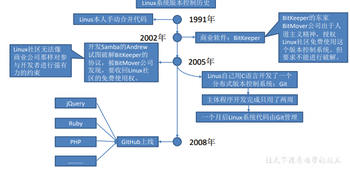
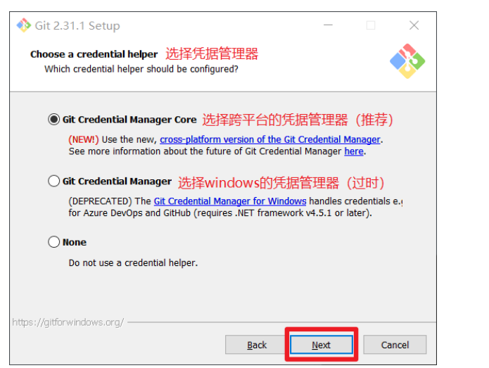
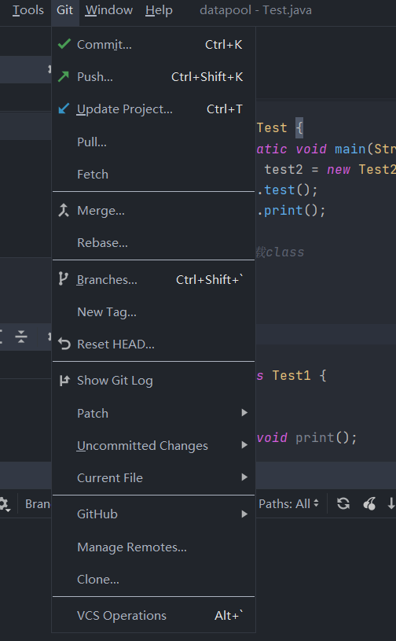

Git 

[TOC]

# model(核心)


## 相关连接

官网:https://git-scm.com/

doc:https://git-scm.com/doc

book(git 官方推荐):https://git-scm.com/book/en/v2

相关视频：[尚硅谷git教程哔哩哔哩](https://www.bilibili.com/video/BV1vy4y1s7k6?p=41)

课程目标:

 

版本：V2.0 

#  第1章 Git 概述 


Git is a [free and open source](https://git-scm.com/about/free-and-open-source) distributed version control system designed to handle everything from small to very large projects with speed and efficiency.

Git is [easy to learn](https://git-scm.com/doc) and has a [tiny footprint with lightning fast performance](https://git-scm.com/about/small-and-fast). It outclasses SCM tools like Subversion, CVS, Perforce, and ClearCase with features like [cheap local branching](https://git-scm.com/about/branching-and-merging), convenient [staging areas](https://git-scm.com/about/staging-area), and [multiple workflows](https://git-scm.com/about/distributed).

Git 是一个免费的、开源的`分布式版本控制系统`，可以快速高效地处理从小型到大型的各种项目。 
Git 易于学习，占地面积小，性能极快。 它具有廉价的本地库，方便的暂存区域和多个工作流分支等特性。其性能优于 Subversion、CVS、Perforce 和 ClearCase 等版本控制工具。 

### 1.1 何为版本控制 

版本控制是一种记录文件内容变化，以便将来查阅特定版本修订情况的系统。 
版本控制其实最重要的是可以记录文件修改历史记录，从而让用户能够查看历史版本，方便版本切换。 


### 1.2为什么需要版本控制

个人开发过渡到团队协作。 


### 1.3 版本控制工具 

#### 	1.集中式版本控制工具 

​		CVS、**SVN(Subversion)**、VSS…… 


​		集中化的版本控制系统诸如 CVS、SVN 等，都有一个单一的集中管理的服务器，保存所有文件的修订版本，而协同工作的人们都通过客户端连到这台服务器，取出最新的文件或者提交更新。多年以来，这已成为版本控制系统的标准做法。 
​		这种做法带来了许多好处，每个人都可以在一定程度上看到项目中的其他人正在做些什么。而管理员也可以轻松掌控每个开发者的权限，并且管理一个集中化的版本控制系统，要远比在各个客户端上维护本地数据库来得轻松容易。 
​		事分两面，有好有坏。这么做显而易见的缺点是中央服务器的单点故障。如果服务器宕
机一小时，那么在这一小时内，谁都无法提交更新，也就无法协同工作。 

### 	2.分布式版本控制工具 


​		**Git**、Mercurial、Bazaar、Darcs…… 
像 Git 这种分布式版本控制工具，客户端提取的不是最新版本的文件快照，而是把代码仓库完整地镜像下来（本地库）。这样任何一处协同工作用的文件发生故障，事后都可以用其他客户端的本地仓库进行恢复。因为每个客户端的每一次文件提取操作，实际上都是一次对整个文件仓库的完整备份。 
​		分布式的版本控制系统出现之后,解决了集中式版本控制系统的缺陷: 

1.	服务器断网的情况下也可以进行开发（因为版本控制是在本地进行的） 
2.	每个客户端保存的也都是整个完整的项目（包含历史记录，更加安全） 


### 1.4 Git 简史 



### 1.5 Git 工作机制  


### 1.6 Git 和代码托管中心 

代码托管中心是基于网络服务器的远程代码仓库，一般我们简单称为远程库。 
➢	局域网 
✓	GitLab 
➢	互联网 
✓	GitHub（外网） 
✓	Gitee 码云（国内网站） 

# 第2章 Git 安装 

官网地址： https://git-scm.com/docs/git

 查看 GNU 协议，可以直接点击下一步。 

  选择 Git 安装位置，要求是非中文并且没有空格的目录，然后下一步。 


Git 选项配置，推荐默认设置，然后下一步。 


Git 安装目录名，不用修改，直接点击下一步。 


Git 的默认编辑器，建议使用默认的 Vim 编辑器，然后点击下一步。 

  默认分支名设置，选择让 Git 决定，分支名默认为 master，下一步。  


修改 Git 的环境变量，选第一个，不修改环境变量，只在 Git Bash 里使用 Git。  

  

选择后台客户端连接协议，选默认值 OpenSSL，然后下一步。  


配置 Git 文件的行末换行符，Windows 使用 CRLF，Linux 使用 LF，选择第一个自动转换，然后继续下一步。  


 选择 Git 终端类型，选择默认的 Git Bash 终端，然后继续下一步。 

  选择 Git pull 合并的模式，选择默认，然后下一步。 


选择 Git 的[凭据管理器](https://support.microsoft.com/zh-cn/windows/%E8%AE%BF%E9%97%AE%E5%87%AD%E6%8D%AE%E7%AE%A1%E7%90%86%E5%99%A8-1b5c916a-6a16-889f-8581-fc16e8165ac0)，选择默认的跨平台的凭据管理器，然后下一步。 


  

其他配置，选择默认设置，然后下一步。 


实验室功能，技术还不成熟，有已知的 bug，不要勾选，然后点击右下角的 Install 按钮，开始安装 Git。 


  点击 Finsh 按钮，Git 安装成功！ 


右键任意位置，在右键菜单里选择 **Git Bash Here** 即可打开 Git Bash 命令行终端。 


在 Git Bash 终端里输入 **git --version** 查看 git 版本，如图所示，说明 Git 安装成功。 

 

# 第 3 章 Git 常用命令 

| 命令名称                             | 作用                                 |
| ------------------------------------ | ------------------------------------ |
| git config --global user.name 用户名 | git config --global user.name 用户名 |
| git config --global user.email 邮箱  | 设置用户签名                         |
| **git init**                         | **初始化本地库**                     |
| **git status**                       | **查看本地库状态**                   |
| **git add filename**                 | **添加到暂存区**                     |
| **git commit -m "日志信息" 文件名**  | **提交到本地库**                     |
| **git reflog**（git log）            | **查看历史记录**                     |
| **git reset --hard 版本号**          | **版本穿梭**                         |
| 代码：                               |                                      |

```bash
git
;
12824@ytwoap-computer MINGW64 ~
$ git
usage: git [--version] [--help] [-C <path>] [-c <name>=<value>]
           [--exec-path[=<path>]] [--html-path] [--man-path] [--info-path]
           [-p | --paginate | -P | --no-pager] [--no-replace-objects] [--bare]
           [--git-dir=<path>] [--work-tree=<path>] [--namespace=<name>]
           [--super-prefix=<path>] [--config-env=<name>=<envvar>]
           <command> [<args>]

These are common Git commands used in various situations:

start a working area (see also: git help tutorial)
   clone             Clone a repository into a new directory
   init              Create an empty Git repository or reinitialize an existing one

work on the current change (see also: git help everyday)
   add               Add file contents to the index
   mv                Move or rename a file, a directory, or a symlink
   restore           Restore working tree files
   rm                Remove files from the working tree and from the index
   sparse-checkout   Initialize and modify the sparse-checkout

examine the history and state (see also: git help revisions)
   bisect            Use binary search to find the commit that introduced a bug
   diff              Show changes between commits, commit and working tree, etc
   grep              Print lines matching a pattern
   log               Show commit logs
   show              Show various types of objects
   status            Show the working tree status

grow, mark and tweak your common history
   branch            List, create, or delete branches
   commit            Record changes to the repository
   merge             Join two or more development histories together
   rebase            Reapply commits on top of another base tip
   reset             Reset current HEAD to the specified state
   switch            Switch branches
   tag               Create, list, delete or verify a tag object signed with GPG

collaborate (see also: git help workflows)
   fetch             Download objects and refs from another repository
   pull              Fetch from and integrate with another repository or a local branch
   push              Update remote refs along with associated objects

'git help -a' and 'git help -g' list available subcommands and some
concept guides. See 'git help <command>' or 'git help <concept>'
to read about a specific subcommand or concept.
See 'git help git' for an overview of the system.

12824@ytwoap-computer MINGW64 ~
$ git --version
git version 2.32.0.windows.2

12824@ytwoap-computer MINGW64 ~
$ git status
fatal: not a git repository (or any of the parent directories): .git

12824@ytwoap-computer MINGW64 ~
$ ls
'3D Objects'/
 AppData/
'Application Data'@
 Contacts/
 Cookies@
 Desktop/
 Documents/
 Favorites/
 IdeaProjects/
 Intel/
 IntelGraphicsProfiles/
 Links/
'Local Settings'@
 Music/
'My Documents'@
 NTUSER.DAT
 NTUSER.DAT{53b39e88-18c4-11ea-a811-000d3aa4692b}.TM.blf
 NTUSER.DAT{53b39e88-18c4-11ea-a811-000d3aa4692b}.TMContainer00000000000000000001.regtrans-ms
 NTUSER.DAT{53b39e88-18c4-11ea-a811-000d3aa4692b}.TMContainer00000000000000000002.regtrans-ms
 NetHood@
 OneDrive/
 PCManger/
 Pictures/
 PrintHood@
 Recent@
 Roaming/
'Saved Games'/
 Searches/
 SendTo@
 Templates@
 Videos/
 WebstormProjects/
 ansel/
 java_error_in_idea64_13216.log
 node_modules/
 ntuser.dat.LOG1
 ntuser.dat.LOG2
12824@ytwoap-computer MINGW64 /f/gittest (master)
$ ls
hello.txt

12824@ytwoap-computer MINGW64 /f/gittest (master)
$ vim hello.txt

12824@ytwoap-computer MINGW64 /f/gittest (master)
$ ls
hello.txt

12824@ytwoap-computer MINGW64 /f/gittest (master)
$ git status
On branch master

No commits yet

Untracked files:
  (use "git add <file>..." to include in what will be committed)
        hello.txt

nothing added to commit but untracked files present (use "git add" to track)

12824@ytwoap-computer MINGW64 /f/gittest (master)
$ git add hellp.txt
fatal: pathspec 'hellp.txt' did not match any files

12824@ytwoap-computer MINGW64 /f/gittest (master)
$ git add hello.txt
warning: LF will be replaced by CRLF in hello.txt.
The file will have its original line endings in your working directory

12824@ytwoap-computer MINGW64 /f/gittest (master)
$ git status
On branch master

No commits yet

Changes to be committed:
  (use "git rm --cached <file>..." to unstage)
        new file:   hello.txt


12824@ytwoap-computer MINGW64 /f/gittest (master)
$ git rm --cached hello.txt
rm 'hello.txt'

12824@ytwoap-computer MINGW64 /f/gittest (master)
$ git status
On branch master

No commits yet

Untracked files:
  (use "git add <file>..." to include in what will be committed)
        hello.txt

nothing added to commit but untracked files present (use "git add" to track)

12824@ytwoap-computer MINGW64 /f/gittest (master)
$ ls
hello.txt

12824@ytwoap-computer MINGW64 /f/gittest (master)
$ git add hello.txt
warning: LF will be replaced by CRLF in hello.txt.
The file will have its original line endings in your working directory

12824@ytwoap-computer MINGW64 /f/gittest (master)
$ git status
On branch master

No commits yet

Changes to be committed:
  (use "git rm --cached <file>..." to unstage)
        new file:   hello.txt


12824@ytwoap-computer MINGW64 /f/gittest (master)
$ git commit "first commit" hello.txt
error: pathspec 'first commit' did not match any file(s) known to git

12824@ytwoap-computer MINGW64 /f/gittest (master)
$ ls
hello.txt

12824@ytwoap-computer MINGW64 /f/gittest (master)
$ git status
On branch master

No commits yet

Changes to be committed:
  (use "git rm --cached <file>..." to unstage)
        new file:   hello.txt


12824@ytwoap-computer MINGW64 /f/gittest (master)
$ git reflog
fatal: your current branch 'master' does not have any commits yet

12824@ytwoap-computer MINGW64 /f/gittest (master)
$ ls
hello.txt

12824@ytwoap-computer MINGW64 /f/gittest (master)
$ git status
On branch master

No commits yet

Changes to be committed:
  (use "git rm --cached <file>..." to unstage)
        new file:   hello.txt


12824@ytwoap-computer MINGW64 /f/gittest (master)
$ git log
fatal: your current branch 'master' does not have any commits yet

12824@ytwoap-computer MINGW64 /f/gittest (master)
$ git commit "first" hello.txt
error: pathspec 'first' did not match any file(s) known to git

12824@ytwoap-computer MINGW64 /f/gittest (master)
$ ls
hello.txt

12824@ytwoap-computer MINGW64 /f/gittest (master)
$ git status
On branch master

No commits yet

Changes to be committed:
  (use "git rm --cached <file>..." to unstage)
        new file:   hello.txt


12824@ytwoap-computer MINGW64 /f/gittest (master)
$ git commit -m "first" hello.txt
warning: LF will be replaced by CRLF in hello.txt.
The file will have its original line endings in your working directory
[master (root-commit) 9e010e7] first
 1 file changed, 2 insertions(+)
 create mode 100644 hello.txt

12824@ytwoap-computer MINGW64 /f/gittest (master)
$ git log
commit 9e010e774dcb116a1aa5ec05d50917823107bc9c (HEAD -> master)
Author: ytwotap <1282490594@qq.com>
Date:   Wed Aug 4 17:40:03 2021 +0800

    first

12824@ytwoap-computer MINGW64 /f/gittest (master)
$ git relog
git: 'relog' is not a git command. See 'git --help'.

The most similar command is
        reflog

12824@ytwoap-computer MINGW64 /f/gittest (master)
$ git log
commit 9e010e774dcb116a1aa5ec05d50917823107bc9c (HEAD -> master)
Author: ytwotap <1282490594@qq.com>
Date:   Wed Aug 4 17:40:03 2021 +0800

    first

12824@ytwoap-computer MINGW64 /f/gittest (master)
$

```

## 3.1 设置用户签名 

### 1）	基本语法 

```bash
git config --global user.name 用户名 

git config --global user.email 邮箱 
```


### 2）	案例实操

全局范围的签名设置： 

Layne@LAPTOP-Layne MINGW64  /d/Git-Space/SH0720 (master) 

```bash
$ git config --global user.name Layne 
Layne@LAPTOP-Layne MINGW64 /d/Git-Space/SH0720 (master) 
$ git config --global user.email Layne@atguigu.com 
Layne@LAPTOP-Layne MINGW64 /d/Git-Space/SH0720 (master) 
$ cat ~/.gitconfig 
[user]  name = Layne 
 email = Layne@atguigu.com 

```


说明： 
		签名的作用是区分不同操作者身份。用户的签名信息在每一个版本的提交信息中能够看到，以此确认本次提交是谁做的。Git 首次安装必须设置一下用户签名，否则无法提交代码。 

※注意：这里设置用户签名和将来登录 GitHub（或其他代码托管中心）的账号没有任何关系。 

## 3.2 初始化本地库  

**1）	基本语法** 

git init 

**2）	案例实操** 

```bash
Layne@LAPTOP-Layne MINGW64 /d/Git-Space/SH0720 
$ git init 
Initialized empty Git repository in D:/Git-Space/SH0720/.git/  
Layne@LAPTOP-Layne MINGW64 /d/Git-Space/SH0720 (master) 
$ ll -a total 4 drwxr-xr-x 1 Layne 197609 0 11月 25 14:07 ./ drwxr-xr-x 1 Layne 197609 0 11月 25 14:07 ../ 
drwxr-xr-x 1 Layne 197609 0 11月 25 14:07 .git/   （.git 初始化的效
果，生成git） 
```

**3)结果**


## 3.3 查看本地库状态 

### 1）	基本语法 

```bash
git status 
```


#### 2）	案例实操 

3.3.1 首次查看（工作区没有任何文件）

```bash
$ git status
On branch master

No commits yet

Changes to be committed:
  (use "git rm --cached <file>..." to unstage)
        new file:   hello.txt


12824@ytwoap-computer MINGW64 /f/gittest (master)
```

3.3.2 新增文件（hello.txt）

```bash
Layne@LAPTOP-Layne MINGW64 /d/Git-Space/SH0720 (master)
$ vim hello.txt
hello git! hello atguigu!
hello git! hello atguigu!
hello git! hello atguigu!
hello git! hello atguigu!
hello git! hello atguigu!
hello git! hello atguigu!
hello git! hello atguigu!
hello git! hello atguigu!
hello git! hello atguigu!
hello git! hello atguigu!
hello git! hello atguigu!
hello git! hello atguigu!
hello git! hello atguigu!
hello git! hello atguigu!
hello git! hello atguigu!
hello git! hello atguigu!

```


### 3.3.3 再次查看（检测到未追踪的文件） 

```bash
Layne@LAPTOP-Layne MINGW64 /d/Git-Space/SH0720 (master) 
$ git status 
On branch master 

No commits yet 

Untracked files: 
  (use "git add <file>..." to include in what will be committed) 
         hello.txt 

nothing added to commit but untracked files present (use "git add" to track) 
```

## 3.4 添加暂存区 

### 3.4.1 将工作区的文件添加到暂存区 

**1）	基本语法** 

```bash
git add 文件名 
```

**2）	案例实操** 

```bash
Layne@LAPTOP-Layne MINGW64 /d/Git-Space/SH0720 (master) 
$ git add hello.txt warning: LF will be replaced by CRLF in hello.txt. 
The file will have its original line endings in your working directory. 
```

### 3.4.2 查看状态（检测到暂存区有新文件） 

```bash
Layne@LAPTOP-Layne MINGW64 /d/Git-Space/SH0720 (master) 
$ git status 
On branch master 

No commits yet 

Changes to be committed: 
  (use "git rm --cached <file>..." to unstage) 

​    new file:   hello.txt 
```


### 3.5 提交本地库 

```bash
12824@ytwoap-computer MINGW64 /f/gittest (master)
$ vim hello.txt

12824@ytwoap-computer MINGW64 /f/gittest (master)
$ git status
On branch master
Changes not staged for commit:
  (use "git add <file>..." to update what will be committed)
  (use "git restore <file>..." to discard changes in working directory)
        modified:   hello.txt

no changes added to commit (use "git add" and/or "git commit -a")

12824@ytwoap-computer MINGW64 /f/gittest (master)
$ git add hello.txt
warning: LF will be replaced by CRLF in hello.txt.
The file will have its original line endings in your working directory
git
12824@ytwoap-computer MINGW64 /f/gittest (master)
$ git status
On branch master
Changes to be committed:
  (use "git restore --staged <file>..." to unstage)
        modified:   hello.txt


12824@ytwoap-computer MINGW64 /f/gittest (master)
$ git relog
git: 'relog' is not a git command. See 'git --help'.

The most similar command is
        reflog

12824@ytwoap-computer MINGW64 /f/gittest (master)
$ git reflog
9e010e7 (HEAD -> master) HEAD@{0}: commit (initial): first

12824@ytwoap-computer MINGW64 /f/gittest (master)
$ git commit -m "two" hello.txt
warning: LF will be replaced by CRLF in hello.txt.
The file will have its original line endings in your working directory
[master c450c67] two
 1 file changed, 2 insertions(+), 1 deletion(-)

12824@ytwoap-computer MINGW64 /f/gittest (master)
$ git status
On branch master
nothing to commit, working tree clean

12824@ytwoap-computer MINGW64 /f/gittest (master)
$   git log
commit c450c676b3380bd71c991bf12c0832547314d392 (HEAD -> master)
Author: ytwotap <1282490594@qq.com>
Date:   Wed Aug 4 17:46:51 2021 +0800

    two

commit 9e010e774dcb116a1aa5ec05d50917823107bc9c
Author: ytwotap <1282490594@qq.com>
Date:   Wed Aug 4 17:40:03 2021 +0800

    first

12824@ytwoap-computer MINGW64 /f/gittest (master)
$ vim hello.txt
git
12824@ytwoap-computer MINGW64 /f/gittest (master)
$ git status
On branch master
Changes not staged for commit:
  (use "git add <file>..." to update what will be committed)
  (use "git restore <file>..." to discard changes in working directory)
        modified:   hello.txt

no changes added to commit (use "git add" and/or "git commit -a")

12824@ytwoap-computer MINGW64 /f/gittest (master)
$ git add hello.txt
warning: LF will be replaced by CRLF in hello.txt.
The file will have its original line endings in your working directory

12824@ytwoap-computer MINGW64 /f/gittest (master)
$ git commit -m "333" hello.txt
warning: LF will be replaced by CRLF in hello.txt.
The file will have its original line endings in your working directory
[master 30fae09] 333
 1 file changed, 1 insertion(+)

12824@ytwoap-computer MINGW64 /f/gittest (master)
$ git reflog
30fae09 (HEAD -> master) HEAD@{0}: commit: 333
c450c67 HEAD@{1}: commit: two
9e010e7 HEAD@{2}: commit (initial): first

12824@ytwoap-computer MINGW64 /f/gittest (master)
$

```

### 3.5.1 将暂存区的文件提交到本地库 

**1）	基本语法** 
git commit -m "日志信息" 文件名 

### 3.5.2 查看状态（没有文件需要提交） 

```bash
Layne@LAPTOP-Layne MINGW64 /d/Git-Space/SH0720 (master) 
$ git status On branch master 
nothing to commit, working tree clean 
```

## 3.6 修改文件（hello.txt） 

```bash
Layne@LAPTOP-Layne MINGW64 /d/Git-Space/SH0720 (master) 
$ vim hello.txt 
hello git! hello atguigu! 2222222222222 hello git! hello atguigu! hello git! hello atguigu! hello git! hello atguigu! hello git! hello atguigu! hello git! hello atguigu! hello git! hello atguigu! hello git! hello atguigu! hello git! hello atguigu! hello git! hello atguigu! hello git! hello atguigu! hello git! hello atguigu! hello git! hello atguigu! hello git! hello atguigu! hello git! hello atguigu! hello git! hello atguigu! 
```

### 3.6.1 查看状态（检测到工作区有文件被修改） 

```bash
Layne@LAPTOP-Layne MINGW64 /d/Git-Space/SH0720 (master) $ git status 
On branch master 
Changes not staged for commit: 
  (use "git add <file>..." to update what will be committed)   (use "git checkout -- <file>..." to discard changes in working directory) 

  modified:   hello.txt 

no changes added to commit (use "git add" and/or "git commit -a") 
```

### 3.6.2 将修改的文件再次添加暂存区 

```bash
Layne@LAPTOP-Layne MINGW64 /d/Git-Space/SH0720 (master) 
$ git add hello.txt warning: LF will be replaced by CRLF in hello.txt. 
The file will have its original line endings in your working directory. 
```

### 3.6.3 查看状态（工作区的修改添加到了暂存区） 

```bash
Layne@LAPTOP-Layne MINGW64 /d/Git-Space/SH0720 (master) 
$ git status 
On branch master Changes to be committed: 
  (use "git reset HEAD <file>..." to unstage) 

modified:   hello.txt 
```


### 3.7 历史版本 

```bash

12824@ytwoap-computer MINGW64 /f/gittest (master)
$ git reset --hard 9e010e7
HEAD is now at 9e010e7 first

12824@ytwoap-computer MINGW64 /f/gittest (master)
$ git status
On branch master
nothing to commit, working tree clean

12824@ytwoap-computer MINGW64 /f/gittest (master)
$ git reflog
9e010e7 (HEAD -> master) HEAD@{0}: reset: moving to 9e010e7
30fae09 HEAD@{1}: commit: 333
c450c67 HEAD@{2}: commit: two
9e010e7 (HEAD -> master) HEAD@{3}: commit (initial): first

12824@ytwoap-computer MINGW64 /f/gittest (master)
$ git reset --hard 30fae09
HEAD is now at 30fae09 333

12824@ytwoap-computer MINGW64 /f/gittest (master)
$ git reflog
30fae09 (HEAD -> master) HEAD@{0}: reset: moving to 30fae09
9e010e7 HEAD@{1}: reset: moving to 9e010e7
30fae09 (HEAD -> master) HEAD@{2}: commit: 333
c450c67 HEAD@{3}: commit: two
9e010e7 HEAD@{4}: commit (initial): first

```


### 3.7.1 查看历史版本 

1）	基本语法 
git reflog  查看版本信息

 git log  查看版本详细信息 


### 3.7.2 版本穿梭 

1）	基本语法 
git reset --hard 版本号 

Git 切换版本，底层其实是移动的 HEAD 指针，具体原理如下图所示。 


# 第 4 章 Git 分支操作


 


## 4.1 [什么是分支](https://git-scm.com/about)  

在版本控制过程中，同时推进多个任务，为每个任务，我们就可以创建每个任务的单独分支。使用分支意味着程序员可以把自己的工作从开发主线上分离开来，开发自己分支的时候，不会影响主线分支的运行。对于初学者而言，分支可以简单理解为副本，一个分支就是一个单独的副本。（分支底层其实也是指针的引用） 

## 4.2 分支的好处

同时并行推进多个功能开发，提高开发效率。 

各个分支在开发过程中，如果某一个分支开发失败，不会对其他分支有任何影响。失败的分支删除重新开始即可。 


## 4.2-1  分支模型

单master

master-dev

master-dev-developer（features）


## 4.3 分支的操作 

###  	4.3.1 命令


| 命令名称                                                     | 作用                                                |      |
| ------------------------------------------------------------ | --------------------------------------------------- | ---- |
| git branch 分支名                                            | 创建分支                                            |      |
| git branch -v                                                | 查看分支                                            |      |
| git checkout 分支名                                          | 切换分支(和git switch 区别)                         |      |
| [git-switch   [<options>] ](https://git-scm.com/docs/git-switch) | Switch branches(point the url to see other command) |      |
| git merge 分支名                                             | 把指定的分支合并到当前分支上                        |      |
|                                                              |                                                     |      |

### 4.3.2 实际操作

```bash
12824@ytwoap-computer MINGW64 /f/gittest (master)
$ git branch -v
* master 30fae09 333

12824@ytwoap-computer MINGW64 /f/gittest (master)
$ git branch hot-fix

12824@ytwoap-computer MINGW64 /f/gittest (master)
$ git branch -v
  hot-fix 30fae09 333
* master  30fae09 333

12824@ytwoap-computer MINGW64 /f/gittest (master)
$ git checkout hot-fix
Switched to branch 'hot-fix'

12824@ytwoap-computer MINGW64 /f/gittest (hot-fix)
$ git branch -v
* hot-fix 30fae09 333
  master  30fae09 333

12824@ytwoap-computer MINGW64 /f/gittest (hot-fix)
$ vim hello.txt

12824@ytwoap-computer MINGW64 /f/gittest (hot-fix)
$ git status
On branch hot-fix
Changes not staged for commit:
  (use "git add <file>..." to update what will be committed)
  (use "git restore <file>..." to discard changes in working directory)
        modified:   hello.txt

no changes added to commit (use "git add" and/or "git commit -a")

12824@ytwoap-computer MINGW64 /f/gittest (hot-fix)
$ git add hell.txt
fatal: pathspec 'hell.txt' did not match any files

12824@ytwoap-computer MINGW64 /f/gittest (hot-fix)
$ git add hello.txt

12824@ytwoap-computer MINGW64 /f/gittest (hot-fix)
$ git add hell.txt
12824@ytwoap-computer MINGW64 /f/gittest (hot-fix)
$ git status
On branch hot-fix
Changes to be committed:
  (use "git restore --staged <file>..." to unstage)
        modified:   hello.txt


12824@ytwoap-computer MINGW64 /f/gittest (hot-fix)
$ git commit -m "hot" hello.txt
[hot-fix 7e88e12] hot
 1 file changed, 3 deletions(-)

12824@ytwoap-computer MINGW64 /f/gittest (hot-fix)
$ git status
On branch hot-fix
nothing to commit, working tree clean

12824@ytwoap-computer MINGW64 /f/gittest (hot-fix)
$ git reflog
7e88e12 (HEAD -> hot-fix) HEAD@{0}: commit: hot
30fae09 (master) HEAD@{1}: checkout: moving from master to hot-fix
30fae09 (master) HEAD@{2}: reset: moving to 30fae09
9e010e7 HEAD@{3}: reset: moving to 9e010e7
30fae09 (master) HEAD@{4}: commit: 333
c450c67 HEAD@{5}: commit: two
9e010e7 HEAD@{6}: commit (initial): first

12824@ytwoap-computer MINGW64 /f/gittest (hot-fix)
$ git log
commit 7e88e126bff44826c8dde7a396025819142d88aa (HEAD -> hot-fix)
Author: ytwotap <1282490594@qq.com>
Date:   Wed Aug 4 18:30:02 2021 +0800

    hot

commit 30fae093ab660b414e0bb0d18bf856bdb7c7ce1c (master)
Author: ytwotap <1282490594@qq.com>
Date:   Wed Aug 4 17:51:16 2021 +0800

    333

commit c450c676b3380bd71c991bf12c0832547314d392
Author: ytwotap <1282490594@qq.com>
Date:   Wed Aug 4 17:46:51 2021 +0800

    two

commit 9e010e774dcb116a1aa5ec05d50917823107bc9c
Author: ytwotap <1282490594@qq.com>
Date:   Wed Aug 4 17:40:03 2021 +0800

    first

12824@ytwoap-computer MINGW64 /f/gittest (hot-fix)
$ git checkout master
Switched to branch 'master'

12824@ytwoap-computer MINGW64 /f/gittest (master)
$ ls
hello.txt

12824@ytwoap-computer MINGW64 /f/gittest (master)
$ vim hello.txt

12824@ytwoap-computer MINGW64 /f/gittest (master)
$ git merge hot-fix
Updating 30fae09..7e88e12
Fast-forward
 hello.txt | 3 ---
 1 file changed, 3 deletions(-)

12824@ytwoap-computer MINGW64 /f/gittest (master)
$ vim hello.txt

12824@ytwoap-computer MINGW64 /f/gittest (master)
$ git reflog
7e88e12 (HEAD -> master, hot-fix) HEAD@{0}: merge hot-fix: Fast-forward
30fae09 HEAD@{1}: checkout: moving from hot-fix to master
7e88e12 (HEAD -> master, hot-fix) HEAD@{2}: commit: hot
30fae09 HEAD@{3}: checkout: moving from master to hot-fix
30fae09 HEAD@{4}: reset: moving to 30fae09
9e010e7 HEAD@{5}: reset: moving to 9e010e7
30fae09 HEAD@{6}: commit: 333
c450c67 HEAD@{7}: commit: two
9e010e7 HEAD@{8}: commit (initial): first

12824@ytwoap-computer MINGW64 /f/gittest (master)
$ git reset --hard 30fae09
HEAD is now at 30fae09 333

12824@ytwoap-computer MINGW64 /f/gittest (master)
$ vim hello.txt

12824@ytwoap-computer MINGW64 /f/gittest (master)
$ git reflog
30fae09 (HEAD -> master) HEAD@{0}: reset: moving to 30fae09
7e88e12 (hot-fix) HEAD@{1}: merge hot-fix: Fast-forward
30fae09 (HEAD -> master) HEAD@{2}: checkout: moving from hot-fix to master
7e88e12 (hot-fix) HEAD@{3}: commit: hot
30fae09 (HEAD -> master) HEAD@{4}: checkout: moving from master to hot-fix
30fae09 (HEAD -> master) HEAD@{5}: reset: moving to 30fae09
9e010e7 HEAD@{6}: reset: moving to 9e010e7
30fae09 (HEAD -> master) HEAD@{7}: commit: 333
c450c67 HEAD@{8}: commit: two
9e010e7 HEAD@{9}: commit (initial): first
g
12824@ytwoap-computer MINGW64 /f/gittest (master)
$ git log
commit 30fae093ab660b414e0bb0d18bf856bdb7c7ce1c (HEAD -> master)
Author: ytwotap <1282490594@qq.com>
Date:   Wed Aug 4 17:51:16 2021 +0800

    333

commit c450c676b3380bd71c991bf12c0832547314d392
Author: ytwotap <1282490594@qq.com>
Date:   Wed Aug 4 17:46:51 2021 +0800

    two

commit 9e010e774dcb116a1aa5ec05d50917823107bc9c
Author: ytwotap <1282490594@qq.com>
Date:   Wed Aug 4 17:40:03 2021 +0800

    first

12824@ytwoap-computer MINGW64 /f/gittest (master)
$ git branch hot-fix
fatal: A branch named 'hot-fix' already exists.

12824@ytwoap-computer MINGW64 /f/gittest (master)
$ git reflog
30fae09 (HEAD -> master) HEAD@{0}: reset: moving to 30fae09
7e88e12 (hot-fix) HEAD@{1}: merge hot-fix: Fast-forward
30fae09 (HEAD -> master) HEAD@{2}: checkout: moving from hot-fix to master
7e88e12 (hot-fix) HEAD@{3}: commit: hot
30fae09 (HEAD -> master) HEAD@{4}: checkout: moving from master to hot-fix
30fae09 (HEAD -> master) HEAD@{5}: reset: moving to 30fae09
9e010e7 HEAD@{6}: reset: moving to 9e010e7
30fae09 (HEAD -> master) HEAD@{7}: commit: 333
c450c67 HEAD@{8}: commit: two
9e010e7 HEAD@{9}: commit (initial): first

12824@ytwoap-computer MINGW64 /f/gittest (master)
$ git checkout hot-fix
Switched to branch 'hot-fix'

12824@ytwoap-computer MINGW64 /f/gittest (hot-fix)
$ vim hello.txt

12824@ytwoap-computer MINGW64 /f/gittest (hot-fix)
$ cat hello.txt
hello world! welcome to git word!

12824@ytwoap-computer MINGW64 /f/gittest (hot-fix)
$

```

##  4.4 冲突合并

![6. 解决合并的冲突【教程1 操作分支】| 猴子都能懂的GIT入门| 贝格乐（Backlog）](data:image/png;base64,iVBORw0KGgoAAAANSUhEUgAAAV4AAACQCAMAAAB3YPNYAAABOFBMVEX///+BtBn/qABmZmb/Zmbp88x4rwCDtSHp8d//pgD/YmJ8sQD0+O+10Yv/ogD/09PT09P/9+7/yof/kpL/W1uSkpKvznZbW1u51JLv99Sry3n/+/a8vLymyWf/ior/xnz/v2j/ulnQ4rj/4L3f7b7/dXWDg4N2dnb29vb/rQDg6cRAQD//7u6vr69paWny8vKkqpL/vr7/m5v/4eH/ra2goKD/79fI0LCBhXS6waTZ2dn/sbH/bW3/mprm5ubp8tbF26ebw1FTVU1jZlsnJiqOk3/Z4r5wdGbB24qSvjz/f39SUlKoqKikyGGOvDfO4a//szf/2aH/57n/9uL/2Kv/7cr/x2L/zXLDy6w3NzeHjHmqsZYKABgeGyTO457JzcD/tDD/wE7/yon/1IX/4Kf/2ZP/0HL/sDgRmAg0AAAOcklEQVR4nO2dC1vayhaGE1ohIYhQK0UDXlAgIKhcrTcg3grsAgpF6u45HCiy9///B2fNECDcKrmJ0XzPUwyhLFdeFmvWTGZGgjAkST6eZJ4V6WYX7ac+FSZJ3vWcvAWzy7ZoT3UpnszvrT+npb2CJbxoT3Upkt9bel7rTbNv0Z7qUqR3fQ68S3sGXlkS8N4ew8Px7e0xUhgdoufHx7dhA68SCXhvroDn1dGvy8v9/f3jpZ+XX+Hk1eX+5bcTA68CCXi/7t8ure/fHF0f/fr1K7x0c73/c2lp/+rX0eXjsYFXvgZ4T25vEd6f4XB46fjyZv8G8H4NL93u/23gla8+3uvHx8frm6PHS9D6r+vbm8vbHt6rbwZe+RpE76+Tn48oOZycnCz9fX3z7frEwKtc47kXZdrbx8ury8dvYYT35PrIwCtfIrxLKHqvvoEej9eXjv5zu7//7eq/qKQw8MqVgPfkCArco58nXxHdb+jJ8c3x0c3NzdGtUZgp0FivLdyT0WtTSUanWFPNibdi4JUlsrA3B991L2PglSOvma+MDe4KREXay5OF7KI91aVsPEOOqFDBdJtl8UnGUlm0ozqVrbkhlpfhMd6yxSs6mzdiVx3ZSkxzHd2dcBk3L7WQjyxA4i1YjKZME7EbTH49z7gW7cdbVbZcaPKMkWy1Up4pk95FO/F2ZWMYI3g11J4lv2gXXkiRFamKzG2bO3XM0Mn/pp/PaHili1Bk87NUrc7Ll4t++CJRgVNNr/bFlfz8UaqsyTltOz5IV0DTq31xbVql412d07bniwy+ml7ti0uMdzZpq/glA+/8EuE9X/XPwlv0iwCrhXf6q5pe7YtriNfqj8StVoQRP6BY7h/HOG5F9eg9iK69J7woes+Lm0XgvAnReg6hXDy3Fjf91jgR3ySSViV4g8FA8CAQOPgQDASCH+Ao8CGQ8QThKTyDF98+Xqs/ET+LRCJxfyISSZwnV/z+yGocDlfjsfPPyvAGTzOHHBS10eDp4WEmEOUOuRQ8eFKZw0wqdXp4GnwHeLlkIrF6dhEnYhcx/1nC7yfOIkn/SsT68TzGbSrCe+gIAFZHZs0RSBEpLrMWTUH0BjhP0JOJEh4I63eAN57kuEj8YwK6cucY7woXiXDE52JCnERk4Y3+lXH89Z0LOA45IpUiuMNUMBMNwE+IYWII903jTV5sbqJk4D8jkoC3SMQiyWI85o8kiufnKuBNcR5uLch9TwUCGeIg4zkgPMFUNEq8h6bN6ieSK5FYYuWCWFnhVi+4lQQRhxOR2BmRSCTiipID5/krcwrR6yEcDsKR4TyZ0w+Ow6jj0MM5vr+L6P14Hi8Wz2JnRWs8FkvCs1gy7vefxZL+zSSoqATvQSrwJbX2JZAKRD3R79GAxxMNfgh4UkF4Ggx+fw/RK9S48E+oeNFzq/Bo1aBbMV2aXu2Lyxhz0FQGXk21KgPvxZy25eA90PRqX1wrn62TyfUZJea0nQlI5vvFo+nVvrxWLlZ72jzvw/Wv/kkX89IliMPUmqBB6XWw9ke9NbpDrfTwWv3J+fnNK64/ppByzP0eKocnn7m1uaVM9Sa+NbWxnu1Zz1GDMxzuN1g/SwjOmQq7kfHlysB6Lwt/CTq4eU1QXouwyYaloP7cySwvWCct/J7q1sMi6/2PL4LzQlEFuJXCwHpJsI6DVwJcmxveLeAlSXOJev4tEmTLD6zDD7NLXeuU18wMXGeYfG8XkDi0basrKljnzeTQd7KJrDsgeAOeueESrAtsMGWXO5db5sEOU1BzKw3KizwruHJgvYAOeTUzRJbH1jfAuquMDnux8dFajM0PYKbCBfTR8csD62gPl7UvwaiEGQy2DWSjSaFPhqXC4C9TVhZhOdFGMrYS2LPkBOs+5G9B2T4zbtExhbwtVLB1G1WxwDMeDmPW2PzTQ2ZbzyJveR/FYus5FHku4vTgu6TpIW7k4ZAnm0d8ZTrXk0tkzoU8HPJkvQIB+eJLQ3OIrmjiMgs8zC7AKz9ymY2hdfRp5YfWKQhgpnkqbe5NtgzfqJF4Ar5m96z/Po82zOV+evFBw+AdmbiN+CpqPXnzIL3kwNaG+DVbiSSV7RLEMP0WjMibSWaEA8WTktekQPCWR9+CIqys5Au8wTDlHD6yuSB1jWYayBZjH6dEQfMgVDfIlHfUVJYH4Erm4aOvcg8HVSDHZ0WHy2PAn5XNMhYAyIqFJJUE2AZaPbOMjrJgqTn2akVhgPE4maMjH/ya8Un3TQgwJS0HasDK2Ghuip8QONKsh+EbMB5LEHNgWr56i49QK1sxk4XxWEKNnXLrqAKDetI7bh1iTolxwbqbRbP6meVxWlmoWyXhhUQ72Y5VxhZvyRKqwCA3lCasL6ti3Uuh3DABAOV2Fay7bKgoyU1Yl5odpgKoqOAhKkd9Xij0J6y71bHO75WmAXCpgRfqjwrPWCa7mPxEPv6zoEs1+f/D5ecdmMfHEnx446kXPjyLOta9gHeyiWiqghco8kx5somAC5K0jsI1Da9K0VuCGmQKXpWi14UWoE7iVSd6oZs1FS8/DdcfBLm3oA1eC1TkUz9stxoALG5ieu5VAy9TbuIO4eSHV5CYe31QOYy3viw0PoxZvvAFotaXyJnJiS4aqkuUWO/RzWE3J0PJxpOKrePKDJXsEx+eDXKSpKKSmtKJQsVNnpIv1HibcVIIM+RE+4ASu1uBdR4BwC5XJnpEOLFbKvKN21Dd2yt33RM9IpzYLZIKMxZiabxShuBVNKgD3Qphje2UftWUjpw0QfqzCP2qyS7alF8oTajP0vMuW54YG0C/MC+tTwhdNGZ0r2SULxStkd0Q+j0EzuLM8ohDaARJ0YgGz/D97yeyNdJ0orSmqMNJMMMBU9f4FxulNakdThZ1YcV8fVA3SfsGjGuDHHxlcRdN1Olmc4pHJPnhqIqtMMoXj/ZNdOQkiRneTKBQGyLqdONGQ2LwCj4OAsLmAroKd4LxihIiTmaDE5QLJU5l4+niVJZFTdHg/kcWjcZNdPElWhcHmhnVP/0TeCRcRmTY0DgmU85XsuFmCY0Zq7rxdxZbL+R9WV+zgKxPtEZKFLZg602wnsfWFY3njAuPzzN8M5yt5MuM3JFqiCmmV87ge228utuqZ/EowMB6Sd27xWF+YJ3EIxFKjNV2xWLRn1FA98kE6wwpcz9/G5jpVePQKi+re68RrFfKZrJv3a22dSpnGfherijLDHWTfai2E1l3D6ybeZ9s67awqwyfkYWvqH35PeuoWCXLJYWXP8O6r2QB3wte+Zff1xZtEkSH6r1TVKVEIuuu8Cv+UxSoI2x+xf4Jqt31+dKfFu2LFOkFb1vAS7dqi/ZFivSBt96na7I/LdoXSdIFXmdokBpCi/ZFmvSAl8V0aRrRTS/aGWnSAV62gem2oHWjOzrbU08HeOsoeOlWukvTd7pq1wg94GVRzUubaoTzX/p+0c5I1evHm8bBW4Wjp/aifZGs14/33g50t1FHmKgv2hfJevV4WVzy/li0GzL1+vFCbqDvdFaPDfT68aLcsONctBsypQ+82zordwfSB96tRXshVwZeTWXg1VQGXk1l4NVUBl5NZeDVVAZeTWXg1VQGXk1l4NVUBl5NpSneWvdhB9RQMjfhDeDV5k/wpdv0QB3ZI4pV3eNlchoYdnZp2kTTdrsd872ryrTzpGu8aKWcwm0ypoptAFN7q3G/u/u7bQLQoa48Qw/oXpDM9y5eeBkto77dB6Br6tbQMDjrTLdRCMuKX3wvyCQ39BcvtIRlyvJthbq3m+i2aM7HE+SJlpwbZh10F/5ONb9eXDk0QX3KIl1FqoXGZ9Q8wZkt6bd06mher123uQG+fXjpg6L1gpOCZi00OimB7dAy5t/hab20Sa83MpFw+CrdZAuL6q9kAyr28VCt3dF2qXOYWDwnXc/B29sACS0vCSu+G0uZhS9BNUS3JmbUQCnRlhSGbLU38VTau16dqN7f/2ZcPsqmCDFlFnZa+EGPtGs9Ve10aH5QzvRuw4Tp6nYKSV9oUzscwLx3Y1mB0K6BlmXIMj/s9PbEb6lDMbH1+9Nc+r2108bzpU3jOVyPsjFMf32bImEbkCCm4iVQ90uC8Fx/3U1HnyrWZVFnpxu8jK8yK3olCuA29J13Bwq7SLNKewnx4Rm5VyJbe2hbv721cdmyOZ5UsBnLYEOWZWpW5WCi7fMr1O7W30joCrIpVNYs7EMIdS/9e8w4qns/OSVIr7P2NBNltghL0z9N9NqIzpsoAhYpqtwfl0+HxrMvGnNosNW3UAcsSuxw4KJrN9l3xCNmLTxi1r3r6m3p1KsUWhFBt+6F/FlroEIAlQFwUm8r/16lnGg83W56uN996uJ7biZ8P7Njh3rLiGDlcnZNwr02O/op3GuroZsPENZGDlYqNt0WbmNCFHeEgGW37LjLYORgFVTrtgFm6+EJ+gcsVm+BMO7vdtg/atG+60lsY9AbG+zM8OdOm+7Wvi9SXenDOZJvbbxj7dDPAx3nu71op/UjMd7ZpGnxSwbe+SXG2wrNghsKiT+F7UU7rR/tiHd5a8+I3069PtwNzsArQWK8jRauDHDlAC0YTQvHD877qnOI3sA7v8R4q+2HGltvQyfZeW9qPIVa1XYrzVZb3XqozRp45UiMl/2nnn6o/24T3U4amLb+JRq1p3a6DqUukTYZeGVoBO/DvbP+1G7VarvdEMLLPjl3f6QJO711byQHWRrF23roOKut9naVeICM8C/bdXYbne7TD7ud/WE38ErXWHKoP1Tr/7CdhvNhi+08sY10/SFd7bD3T70d4Qy8EiXGu9verqfr2/R9Ov3D1LpP7+7utNPp3TsTnPhk1L1yJOpWoDosFELzdaAXgR7xqKVwwm7glaOxMYf+DCf8aBo8Gp1imTKGdDSVgVdT3dul8pW5kOidqjtjmGwm3ZC2dP8PxZJSK8q+bbIAAAAASUVORK5CYII=)

### 4.1 example:

```bash
12824@ytwoap-computer MINGW64 /f/gittest (hot-fix)
$ vim hello.txt
git
12824@ytwoap-computer MINGW64 /f/gittest (hot-fix)
$ git add hello.txt

12824@ytwoap-computer MINGW64 /f/gittest (hot-fix)
$ git commit -m "master confit" hello.txt
[hot-fix 77ef15b] master confit
 1 file changed, 1 insertion(+)

12824@ytwoap-computer MINGW64 /f/gittest (hot-fix)
$ git status
On branch hot-fix
nothing to commit, working tree clean

12824@ytwoap-computer MINGW64 /f/gittest (hot-fix)
$ git checkout master
Switched to branch 'master'

12824@ytwoap-computer MINGW64 /f/gittest (master)
$ git merge hot-fix
Updating 30fae09..77ef15b
Fast-forward
 hello.txt | 4 +---
 1 file changed, 1 insertion(+), 3 deletions(-)

12824@ytwoap-computer MINGW64 /f/gittest (master)
$ git reflog
77ef15b (HEAD -> master, hot-fix) HEAD@{0}: merge hot-fix: Fast-forward
30fae09 HEAD@{1}: checkout: moving from hot-fix to master
77ef15b (HEAD -> master, hot-fix) HEAD@{2}: commit: master confit
7e88e12 HEAD@{3}: checkout: moving from master to hot-fix
30fae09 HEAD@{4}: reset: moving to 30fae09
7e88e12 HEAD@{5}: merge hot-fix: Fast-forward
30fae09 HEAD@{6}: checkout: moving from hot-fix to master
7e88e12 HEAD@{7}: commit: hot
30fae09 HEAD@{8}: checkout: moving from master to hot-fix
30fae09 HEAD@{9}: reset: moving to 30fae09
9e010e7 HEAD@{10}: reset: moving to 9e010e7
30fae09 HEAD@{11}: commit: 333
c450c67 HEAD@{12}: commit: two
9e010e7 HEAD@{13}: commit (initial): first

12824@ytwoap-computer MINGW64 /f/gittest (master)
$ git reset --hard ^C

12824@ytwoap-computer MINGW64 /f/gittest (master)
$ git reset --hard 30fae09
HEAD is now at 30fae09 333

12824@ytwoap-computer MINGW64 /f/gittest (master)
$ git status
On branch master
nothing to commit, working tree clean

12824@ytwoap-computer MINGW64 /f/gittest (master)
$ cat hello.txt
hello world! welcome to git word!
i can not use copy ! but this is not importanti!
version is change!
3333333333

12824@ytwoap-computer MINGW64 /f/gittest (master)
$ vim hello.txt

12824@ytwoap-computer MINGW64 /f/gittest (master)
$ cat hello.txt
hello world! welcome to git word!
i can not use copy ! but this is not importanti!
version is change!
3333333333
test2 confit


12824@ytwoap-computer MINGW64 /f/gittest (master)
$ git merge hot-fix
error: Your local changes to the following files would be overwritten by merge:
        hello.txt
Please commit your changes or stash them before you merge.
Aborting
Updating 30fae09..77ef15b

12824@ytwoap-computer MINGW64 /f/gittest (master)
$ git add hello.txt

12824@ytwoap-computer MINGW64 /f/gittest (master)
$ git commit -m "change in before maerge" hello.txt
[master 2679631] change in before maerge
 1 file changed, 2 insertions(+)

12824@ytwoap-computer MINGW64 /f/gittest (master)
$ git merge hot-fix
Auto-merging hello.txt
CONFLICT (content): Merge conflict in hello.txt
Automatic merge failed; fix conflicts and then commit the result.

12824@ytwoap-computer MINGW64 /f/gittest (master|MERGING)
$ cat hello.txt
hello world! welcome to git word!
<<<<<<< HEAD
i can not use copy ! but this is not importanti!
version is change!
3333333333
test2 confit

=======
fsfsdf
>>>>>>> hot-fix

12824@ytwoap-computer MINGW64 /f/gittest (master|MERGING)
$ git commit -m "merge confit fix"
error: Committing is not possible because you have unmerged files.
hint: Fix them up in the work tree, and then use 'git add/rm <file>'
hint: as appropriate to mark resolution and make a commit.
fatal: Exiting because of an unresolved conflict.
U       hello.txt

12824@ytwoap-computer MINGW64 /f/gittest (master|MERGING)
$ git status
On branch master
You have unmerged paths.
  (fix conflicts and run "git commit")
  (use "git merge --abort" to abort the merge)

Unmerged paths:
  (use "git add <file>..." to mark resolution)
        both modified:   hello.txt

no changes added to commit (use "git add" and/or "git commit -a")

12824@ytwoap-computer MINGW64 /f/gittest (master|MERGING)
$ cat hello.txt
hello world! welcome to git word!
<<<<<<< HEAD
i can not use copy ! but this is not importanti!
version is change!
3333333333
test2 confit

=======
fsfsdf
>>>>>>> hot-fix

12824@ytwoap-computer MINGW64 /f/gittest (master|MERGING)
$ git add hello.txt

12824@ytwoap-computer MINGW64 /f/gittest (master|MERGING)
$ git commit -m "merge confit fix"
[master a291b7d] merge confit fix

12824@ytwoap-computer MINGW64 /f/gittest (master)
$ cat hello.txt
hello world! welcome to git word!
<<<<<<< HEAD
i can not use copy ! but this is not importanti!
version is change!
3333333333
test2 confit

=======
fsfsdf
>>>>>>> hot-fix

12824@ytwoap-computer MINGW64 /f/gittest (master)
$

```

### 	4.2 冲突合并原理:


# 第 5 章 Git 团队协作机制 

## 5.1 团队内协作 

原理:


## 5.2 跨团队协作 


"**Pull Request** 是一种通知机制。 你修改了他人的代码，将你的修改通知原来的作者，希望他合并你的修改，这就是Pull Request。" Pull Request 本质上是一种软件的合作方式，是将涉及不同功能的代码，纳入主干的一种流程。 这个过程中，还可以进行讨论、审核和修改代码。

# 第 6 章 GitHub 操作 

GitHub 网址：https://github.com/ 
Ps:全球最大同性交友网站，技术宅男的天堂，新世界的大门，你还在等什么? 


| 命令名称                           | 作用                                                     |
| ---------------------------------- | -------------------------------------------------------- |
| git remote -v                      | 查看当前所有远程地址别名                                 |
| git remote add 别名 远程地址       | 起远程库别名                                             |
| git push 别名 分支                 | 推送本地分支上的内容到远程仓库                           |
| git clone 远程地址                 | 将远程仓库的内容克隆到本地                               |
| git pull 远程库地址别名 远程分支名 | 将远程仓库对于分支最新内容拉下来后与当前本地分支直接合并 |
|                                    |                                                          |


## 6.1 创建远程仓库


## 6.2 创建远程仓库别名 

```bash
git remote -v 查看当前所有远程地址别名 

git remote add 别名 远程地
```

远程库连接：https://github.com/ytwotap/gittest.git、

### **远程库和别名： example**

```bash
12824@ytwoap-computer MINGW64 /f/gittest (master)
$ git remote -v

12824@ytwoap-computer MINGW64 /f/gittest (master)
$ git remote add gittest https://github.com/ytwotap/gittest.git

12824@ytwoap-computer MINGW64 /f/gittest (master)
$ git remote -v
gittest https://github.com/ytwotap/gittest.git (fetch)
gittest https://github.com/ytwotap/gittest.git (push)

```

## 6.3 远程推送(设置ssh)

### 1. ssh连接 or Https 连接:


1. [凭据管理器](https://support.microsoft.com/zh-cn/windows/%E8%AE%BF%E9%97%AE%E5%87%AD%E6%8D%AE%E7%AE%A1%E7%90%86%E5%99%A8-1b5c916a-6a16-889f-8581-fc16e8165ac0)

   > 凭据管理器使你能够查看和删除用于登录网站、连接的应用程序和网络的已保存凭据。
   
   

```bash
git push gittest 
```

> note: 这里有个坑,建议使用ssh连接

### 2 使用ssl连接github(不推荐)

### **3 ssh连接github**

大概需要三个步骤：
一、本地生成密钥对；
二、设置github上的公钥；
三、修改git的remote url为git协议。

**使用ssh连接官方文档**:https://docs.github.com/cn/github/authenticating-to-github/connecting-to-github-with-ssh


## 6.4  克隆远程仓库到本地 

1. ​	基本语法 

   ```bash
   git clone 远程地址 
   ```

   

2) 步骤

   这个地址为远程仓库地址，克隆结果：初始化本地仓库 

   ### clone:

   ```bash
   12824@ytwoap-computer MINGW64 /f
   $ ls
   '$RECYCLE.BIN'/                尚硅谷Java数据结构和算法/
    33th.sql                      计算机基础.zip
   'System Volume Information'/   计算机基础.zip.baiduyun.downloading
    gittest/                      计算机基础.zip.baiduyun.downloading.cfg
    git尚硅谷/                    课件笔记源码资料/
    test/                         课件笔记源码资料.zip
    wangdao/
   
   12824@ytwoap-computer MINGW64 /f
   $ mkdir python
   
   12824@ytwoap-computer MINGW64 /f
   $ git clone git@github.com:ytwotap/love_eat_python.git
   Cloning into 'love_eat_python'...
   remote: Enumerating objects: 34, done.
   remote: Counting objects: 100% (34/34), done.
   remote: Compressing objects: 100% (32/32), done.
   remote: Total 34 (delta 1), reused 34 (delta 1), pack-reused 0
   Receiving objects: 100% (34/34), 15.26 KiB | 1.70 MiB/s, done.
   Resolving deltas: 100% (1/1), done.
   
   12824@ytwoap-computer MINGW64 /f
   $ cd love_eat_python
   
   12824@ytwoap-computer MINGW64 /f/love_eat_python (master)
   $
   
   ```

   小结：clone 会做如下操作。1、拉取代码。2、初始化本地仓库。


## 6.5 邀请加入团队 

1）选择邀请合作者 


2）填入想要合作的人


3 ）复制地址并通过微信钉钉等方式发送给该用户，复制内容如下：


4）	在 atguigulinghuchong 这个账号中的地址栏复制收到邀请的链接，点击接受邀请。 


5）	成功之后可以在 atguigulinghuchong 这个账号上看到 git-Test 的远程仓库。 


6）	令狐冲可以修改内容并 push 到远程仓库。 

```bash
--编辑clone下来的文件 
Layne@LAPTOP-Layne MINGW64 /d/Git-Space/pro-linghuchong/git-shTest
(master) 
$ vim hello.txt  
Layne@LAPTOP-Layne MINGW64 /d/Git-Space/pro-linghuchong/git-shTest
(master) $ cat hello.txt 
hello git! hello atguigu! 2222222222222 hello git! hello atguigu! 33333333333333 hello git! hello atguigu! hello git! hello atguigu! hello git! hello atguigu! 我是最帅的，比岳不群还帅 hello git! hello atguigu! hello git! hello atguigu! hello git! hello atguigu! hello git! hello atguigu! hello git! hello atguigu! hello git! hello atguigu! hello git! hello atguigu! hello git! hello atguigu! hello git! hello atguigu! 
hello git! hello atguigu! master test 
hello git! hello atguigu! hot-fix test 
--将编辑好的文件添加到暂存区 
Layne@LAPTOP-Layne MINGW64 /d/Git-Space/pro-linghuchong/git-shTest
(master) 
$ git add hello.txt 
--将暂存区的文件上传到本地库 
Layne@LAPTOP-Layne MINGW64 /d/Git-Space/pro-linghuchong/git-shTest 
(master) 
$ git commit -m "lhc commit" hello.txt 
[master 5dabe6b] lhc commit 
 1 file changed, 1 insertion(+), 1 deletion(-) 
--将本地库的内容push到远程仓库 
Layne@LAPTOP-Layne MINGW64 /d/Git-Space/pro-linghuchong/git-shTest 
(master) 
$ git push origin master 
Logon failed, use ctrl+c to cancel basic credential prompt. Username for 'https://github.com': atguigulinghuchong 
Counting objects: 3, done. 
Delta compression using up to 12 threads. 
Compressing objects: 100% (2/2), done. 
Writing objects: 100% (3/3), 309 bytes | 309.00 KiB/s, done. Total 3 (delta 1), reused 0 (delta 0) remote: Resolving deltas: 100% (1/1), completed with 1 local object. 
To https://github.com/atguiguyueyue/git-shTest.git    7cb4d02..5dabe6b  master -> master 

```

7）回到 atguiguyueyue 的 GitHub 远程仓库中可以看到，最后一次是 lhc 提交的。 


### 6.5.1 拉取远程库内容 

1）	基本语法 
git pull 远程库地址别名 远程分支名 
2）	案例实操 
--将远程仓库对于分支最新内容拉下来后与当前本地分支直接合并 

## 6.跨团队协作 

1）	将远程仓库的地址复制发给邀请跨团队协作的人，比如东方不败。 


2）	在东方不败的 GitHub 账号里的地址栏复制收到的链接，然后点击 Fork 将项目叉到自己的本地仓库。 

 


3）	东方不败就可以在线编辑**fork**过来的文件。 


4）	编辑完毕后，填写描述信息并点击左下角绿色按钮提交。

 

5）	接下来点击上方的 Pull 请求，并创建一个新的请求。 


6）	回到岳岳 GitHub 账号可以看到有一个 Pull request 请求。 


进入到聊天室，可以讨论代码相关内容。

 

7）	如果代码没有问题，可以点击 Merge pull reque 合并代码。 


### 团队协作


### 跨团队协作

pull request 推送到其他人。


# 第 7 章 IDEA 集成 Git 

## 7.1 配置 Git 忽略文件 

**问题 1:为什么要忽略他们？**

答：与项目的实际功能无关，不参与服务器上部署运行。把它们忽略掉能够屏蔽 IDE 工具之间的差异。 
**问题 2：怎么忽略？** 
1）创建忽略规则文件 xxxx.ignore（前缀名随便起，建议是 git.ignore） 

这个文件的存放位置原则上在哪里都可以，为了便于让~/.gitconfig 文件引用，建议也放在用户家目录下 

 

工作区的根目录下有个文件**.gitignore**

忽略管理：当你产生一些新的文件的变化，你不去追踪这些变化，把它放到忽略管理

 

使用忽略管理的原因：在开发过程中，会产生一些文件，比如字节码文件，编译后的文件，这些文件不需要管理，为了避免管理产生的问题，进行忽略管理

 

**songgeniupi.txt      忽略单个文件**

***.class          忽略某个类型的文件**

**target/          忽略某个目录下文件**


注意：只有没有追踪过的文件可以忽略管理，如果你这个文件已经管理过了（远程仓库当前版本包含这个文件），就忽略不掉了


### 1.1.1 已经管理的文件还有机会忽略吗

让该文件处于一个未管理的状态，让他从远程仓库消失。

在本地仓库产生变化，产生的是删除文件的变化，push到远程仓库


### 1.1.1 注意

.gitignore是否需要管理？可以管理也可以不管理

.gitignore这个文件是否是我给他管理起来他才生效？不是，只需要放在工作区根目录（.git文件夹所在的目录）就生效

### 模板


git.ignore 文件模版内容如下： 

```
# Compiled class file
*.class
# Log file
*.log
# BlueJ files
*.ctxt
# Mobile Tools for Java (J2ME)
.mtj.tmp/
# Package Files #
*.jar
*.war
*.nar
*.ear
*.zip
*.tar.gz
*.rar
# virtual machine crash logs, see 
http://www.java.com/en/download/help/error_hotspot.xml
hs_err_pid*
.classpath
.project
.settings
target
.idea
*.iml
```

2）在.gitconfig 文件中引用忽略配置文件（此文件在 Windows 的家目录中） 

```
[user]  name = Layne 
 email = Layne@atguigu.com 
[core]  excludesfile = C:/Users/asus/git.ignore 
注意：这里要使用“正斜线（/）”，不要使用“反斜线（\）” 
```


## 7.2 定位 Git 程序 


选择要创建 Git 本地仓库的工程。 


## 7.3 git使用





创建和切换分支：


合并分支：


# 第 8 章 IDEA 集成 GitHub 

插件：


添加github账号:

如果出现 401 等情况连接不上的，是因为网络原因，可以使用以下方式连接： 

**然后去 GitHub 账户上设置 token。** 

  **github在idea中的使用：**


点击登录。 

new 文件 从 github上直接拉取


使用url


使用自己登录的库


 

## 8.1 idea中整合git的命令行


# 第 9 章 国内代码托管中心-码云 

1. 安装码云插件gitte
2. 登录
3. 之后和github插件一样。

> 可以从github到导入到gitte


## 9.1 简介 

众所周知，GitHub 服务器在国外，使用 GitHub 作为项目托管网站，如果网速不好的话，严重影响使用体验，甚至会出现登录不上的情况。针对这个情况，大家也可以使用国内的项目托管网站-码云。 
码云是开源中国推出的基于 Git 的代码托管服务中心，网址是 https://gitee.com/ ，使用方式跟 GitHub 一样，而且它还是一个中文网站，如果你英文不是很好它是最好的选择。 

 

## 9.2 码云复制 GitHub 项目 

码云提供了直接复制 GitHub 项目的功能，方便我们做项目的迁移和下载。 
具体操作如下： 

 将 GitHub 的远程库 HTTPS 链接复制过来，点击创建按钮即可。 

如果 GitHub 项目更新了以后，在码云项目端可以手动重新同步，进行更新！ 

## 9.3 IDEA集成码云

**idea集合码云教程:**https://gitee.com/help/articles/4117#article-header5

Idea 默认不带码云插件，我们第一步要安装 Gitee 插件。 如图所示，在 Idea 插件商店搜索 Gitee，然后点击右侧的 Install 按钮。


## 9.4   仓库成员的管理

只有仓库成员才可以push，不管你是公开的还是私有


第一次push的时候，需要输入用户名和密码

如果输错了


 

说明密码输错了authen

没有权限 401

 

# 第 10 章 自建代码托管平台-GitLab 

## 10.1 GitLab 简介 

GitLab 是由 GitLabInc.开发，使用 MIT 许可证的基于网络的 Git 仓库管理工具，且具有 wiki 和 issue 跟踪功能。使用 Git 作为代码管理工具，并在此基础上搭建起来的 web 服务。 
GitLab 由乌克兰程序员 DmitriyZaporozhets 和 ValerySizov 开发，它使用 Ruby 语言写
成。后来，一些部分用 Go 语言重写。截止 2018 年 5 月，该公司约有 290 名团队成员，以
及 2000 多名开源贡献者。GitLab 被 IBM，Sony，JülichResearchCenter，NASA，Alibaba，
Invincea，O’ReillyMedia，Leibniz-Rechenzentrum(LRZ)，CERN，SpaceX 等组织使用。 

## 10.2 GitLab 官网地址 

官网地址：https://about.gitlab.com/ 安装说明：https://about.gitlab.com/installation/ 

## Git，GitHub与GitLab的区别

- Git是一种版本控制系统，是一种工具，用于代码的存储和版本控制。
- GitHub是一个基于Git实现的在线代码仓库，是目前全球最大的代码托管平台，可以帮助程序员之间互相交流和学习。
- GitLab是一个基于Git实现的在线代码仓库软件，你可以用GitLab自己搭建一个类似于GitHub一样的仓库，但是GitLab有完善的管理界面和权限控制，一般用于在企业、学校等内部网络搭建Git私服。
- GitHub和GiLlab两个都是基于Web的Git远程仓库，它们都提供了分享开源项目的平台，为开发团队提供了存储、分享、发布和合作开发项目的中心化云存储的场所。从代码的私有性上来看，GitLab 是一个更好的选择。但是对于开源项目而言，GitHub 依然是代码托管的首选。

## 10.3 GitLab 使用

安装 

配置

使用 

参考:[GitLab 尚硅谷](尚硅谷技术课程系列之Git V2.0.pdf)

