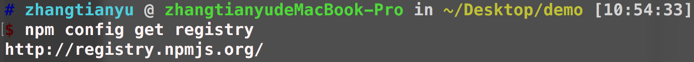
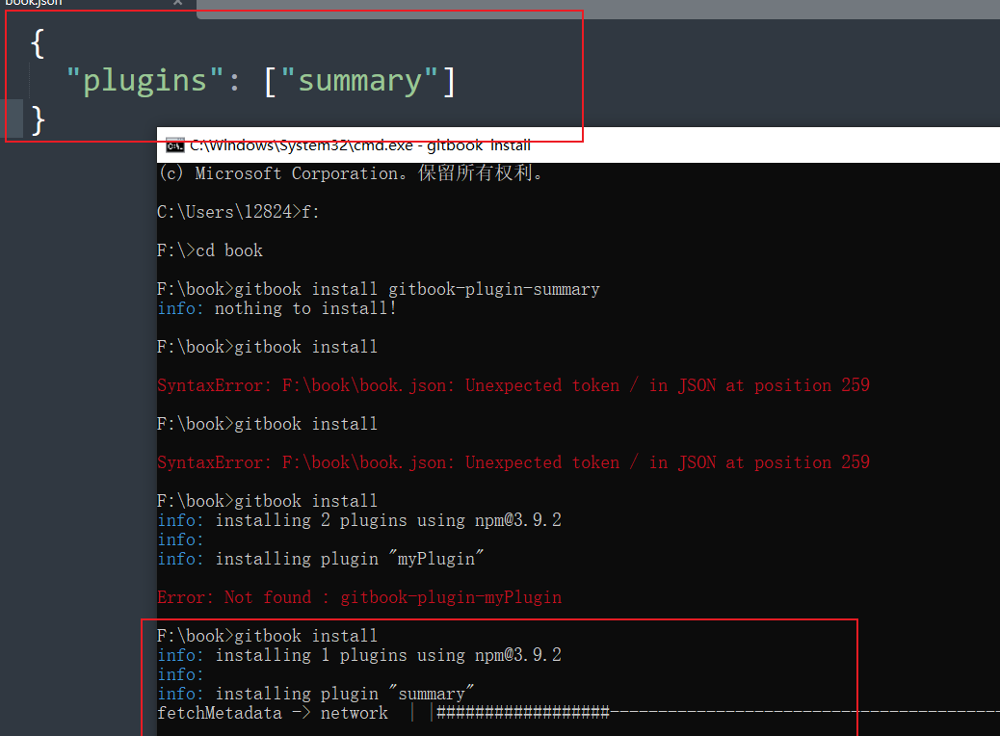
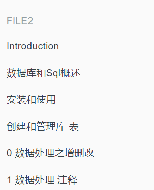
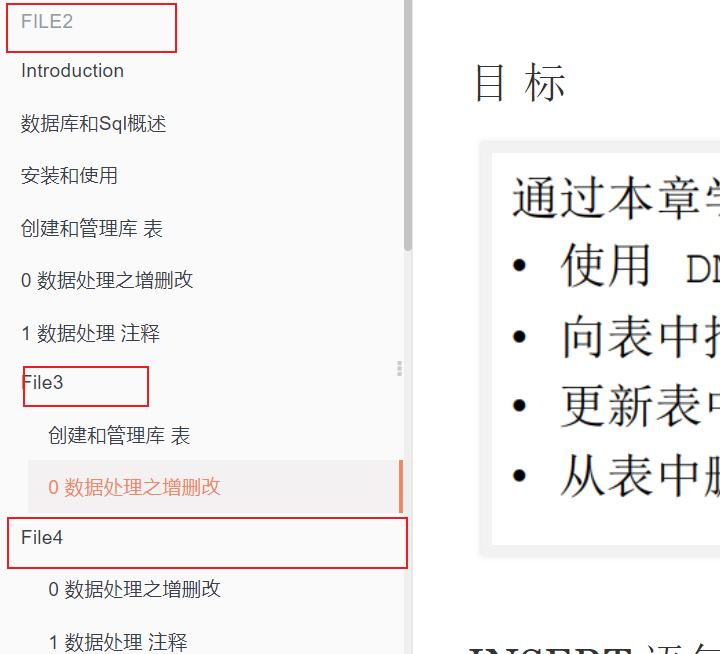
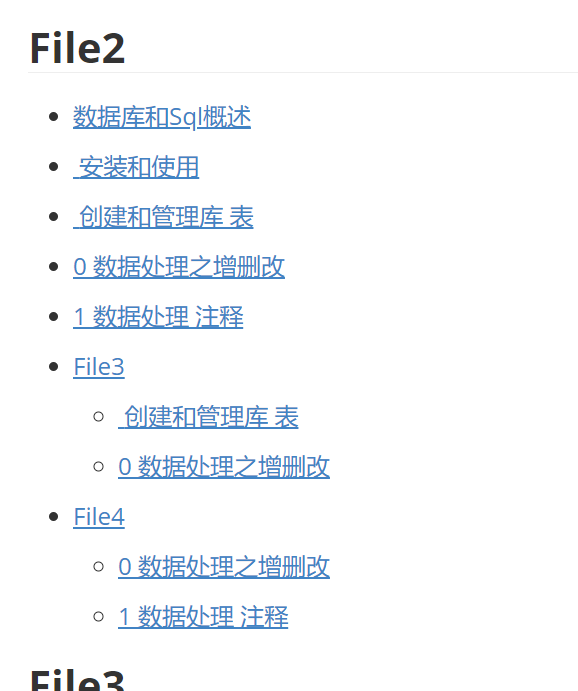
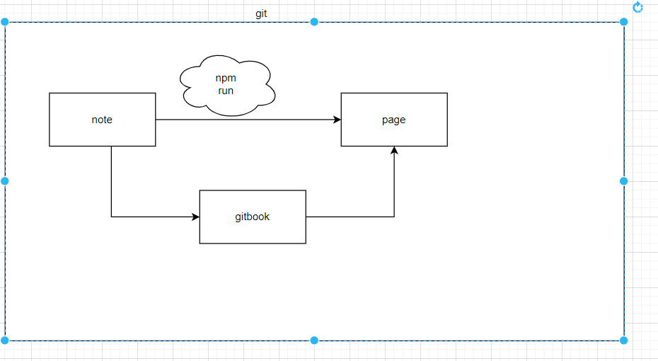
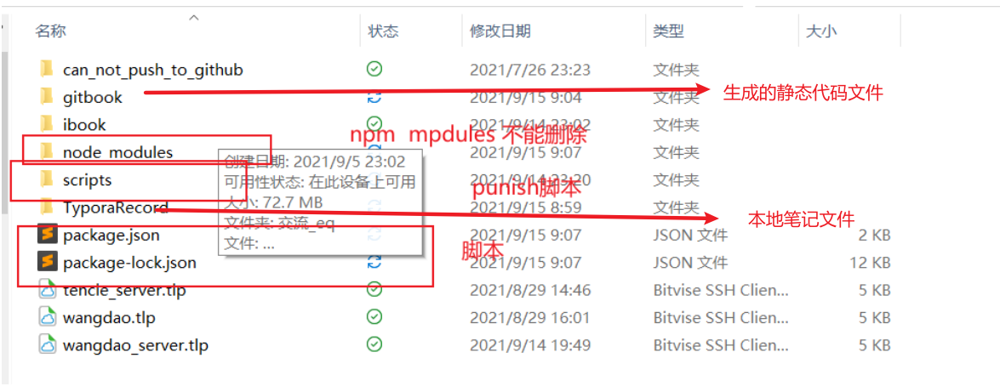

# gitbook

> doc:https://github.com/GitbookIO/gitbook
>
> 教程记录:https://tonydeng.github.io/gitbook-zh/gitbook-howtouse/howtouse/README.html
>
> 或教程:https://www.chengweiyang.cn/gitbook/introduction/README.html

> record:2021-09-13  11-12点 1hour没搞定
>

概念:

能干嘛

`A powerful, simple editing experience.`

Empower anyone in your team to collaborate on your docs through our powerful editor, no coding or design required.


## 1 Setup and Installation of GitBook

Getting GitBook installed and ready-to-go should only take a few minutes.

### 1.1 legacy.gitbook.com

[legacy.gitbook.com](https://legacy.gitbook.com/) is an easy to use solution to write, publish and host books. It is the easiest solution for publishing your content and collaborating on it.

It integrates well with the [GitBook Editor](https://legacy.gitbook.com/editor).

### 1.2 Local Installation

##### Requirements

[node.js下载地址](https://nodejs.org/zh-cn/download/releases/)

Installing GitBook is easy and straightforward. Your system just needs to meet these two requirements:

- NodeJS (v4.0.0 and above is recommended) 

  > 注意:node版本有可能导致错误,具体请看**问题** 部分

  

- Windows, Linux, Unix, or Mac OS X


##### 

##### Install with NPM

The best way to install GitBook is via **NPM**. At the terminal prompt, simply run the following command to install GitBook:

```
$ npm install gitbook-cli -g
```

`gitbook-cli` is an utility to install and use multiple versions of GitBook on the same system. It will automatically install the required version of GitBook to build a book.

```java
gitbook -V
```

查看是否安装成功

安装要很久,只要有 **"/"** 转就是正常的.

可能要几个小时,最好晚上挂着下.


##### 换源

- 查看当前npm仓库地址命令：`npm config get registry`，提示如下图：




直接安装cnpm 安装淘宝提供的cnpm，并更改服务器地址为淘宝的国内地址， 命令：`npm install -g cnpm --registry=https://registry.npm.taobao.org`，以后安装直接采用`cpm`替代`npm`， 例如原生npm命令为：`npm install uniq --save`，cnpm命令为：`cnpm install uniq --save`


##### Create a book

GitBook can setup a boilerplate book:

```
$ gitbook init
```


在这里插入图片描述

**README.md（书籍的介绍在这个文件里）**

**SUMMARY.md（书籍的目录结构在这里配置）**


If you wish to create the book into a new directory, you can do so by running `  ./directory`

Preview and serve your book using:

```
$ gitbook serve
```

Or **build the static website using:**

```
$ gitbook build
```

注意:gitbook build的时间 是根据 SUMMARY.md的文件的多少决定了文件的访问速度.


##### Install pre-releases

`gitbook-cli` makes it easy to download and install other versions of GitBook to test with your book:

```
$ gitbook fetch beta
```

Use `gitbook ls-remote` to list remote versions available for install.

##### Debugging

You can use the options `--log=debug` and `--debug` to get better error messages (with stack trace). For example:

```
$ gitbook build ./ --log=debug --debug
```


# 2 插件

- npm 安装插件
- 配置项目book.json

- 在项目中安装插件

```
gitbook install 
```

- 运行

> doc:https://chrisniael.gitbooks.io/gitbook-documentation/content/format/plugins.html

插件是扩展 GitBook 功能（电子书和网站）最好的方式。现在插件可以做很多事：支持数学公式的显示，使用 Google Analytic 追踪访问，...

## 2.1 如何查找插件？

gitbook 还支持许多插件，用户可以从 [NPM](https://www.npmjs.com/) 上搜索 gitbook 的插件，[gitbook 文档](https://github.com/GitbookIO/plugin) 推荐插件的命名方式为：

- gitbook-plugin-X: 插件
- gitbook-theme-X: 主题

所以，可以通过以上两种方式来搜索 gitbook 的插件或者主题。


## 2.2 如何安装插件？




## 2.3 常用插件

> #### 插件列表:[插件](./插件使用.md)

### 2.3.1 主题:

**啥是主题?**

一些插件的集合.有序,经过设计.使用主题可以保证快速搭配.不在需要其他的东西

**和插件的关系**

就是一些插件集合,或者说**比较多的改变**导致名字的变化


**主题推荐**:

**gitbook-plugin-theme-door** 推荐


含有Header导航，Sidebar导航以及MiniMap导航的gitbook主题

----

### 2.3.2 插件

[codeblock-filename](https://www.npmjs.com/package/gitbook-plugin-codeblock-filename) 可以为代码添加一个文件名，以便显示当前代码段属于的文件。

----

[multipart](https://www.npmjs.com/package/gitbook-plugin-multipart) 插件可以将书籍分成几个部分，例如：

- GitBook Basic
- GitBook Advanced

对有非常多章节的书籍非常有用，分成两部分后，各个部分的章节都从 1 开始编号。

和安装其它插件一样，执行以下命令：

```bash
$ npm install gitbook-plugin-multipart -g
```

然后编辑 `book.json` 添加 multipart 到 plugins 中：

```json
    "plugins": [
        "multipart"
    ],
```

----

[Disqus](https://disqus.com/) 是一个非常流行的为网站集成评论系统的工具，同样，gitbook 也可以集成 disqus 以便可以和读者交流。

安装:

```bash
$ npm install gitbook-plugin-disqus -g
```

然后，修改 `book.json` 配置文件，添加插件的配置内容：

```json
{
    "plugins": ["disqus"],
    "pluginsConfig": {
        "disqus": {
            "shortName": "introducetogitbook"
        }
    }  
}
```

注意：上面的 `shortName` 的值就是你在 disqus 上创建的 website 获得的唯一关键字。

----


### [summary](https://www.npmjs.com/package/gitbook-plugin-summary)目录自动生成


这里用一个**自动生成目录的插件**给大家介绍使用方法

名字叫:[gitbook-plugin-summary](https://links.jianshu.com/go?to=https%3A%2F%2Fplugins.gitbook.com%2Fplugin%2Fgensum)

First you need to install the package using

```
$ npm i gitbook-plugin-summary --save
```

afterwards, you need to add to your `book.json` the plugin, like this

```
{
  "plugins": [
    "summary"
  ]
}
```

install summary to this gitbook rep

```
gitbook install 
```

and finally run the command

```
$ gitbook serve
```


#### 实验

预计 能生成目录

操作 导入包 summery

Gitbook serve 启动

生成目录

##### 结果:

单个目录:



多文件生成


多级目录生成的样式:



SUMMARY.md效果




> 其他连接:
>
> 插件集合:https://segmentfault.com/a/1190000019664545

# 3 问题:

### gitbook -V 无法正常运行 -->版本问题 10.21.0 可以

gitbook -V

```cmd
CLI version: 2.3.2
```

没有出现

```cmd
CLI version: 2.3.2
Installing GitBook 3.2.3
```


### 1.[node 版本问题 可能是 .更换node的版本尝试.](https://blog.csdn.net/Lowerce/article/details/107579261)--ok

> link:https://blog.csdn.net/qq_43528771/article/details/107949010

目前Node.js的最新稳定版本的`v12.18.3`。但这个版本对GitBook可能不兼容（在后续安装和启动 GitBook 命令时会出现错误提示），建议直接安装`v10.22.0`。

[node.js下载地址](https://nodejs.org/zh-cn/download/releases/)

**注意:node -v 没反应,配置环境变量后还是没反应.记得重启才能生效**

使用10.22.0 test  失败;还是不行.

使用10.21.0test 

## 2.gitbook -V / 问题	

在安装gitbook 有点慢 等等就是了


# 4 :star:[git page](https://pages.github.com/) 使用

> doc:https://pages.github.com/

为啥要使用git page 

可以直接看文档 比较有规律


首先gitbook 生成 index文件 ->提交远程仓库－＞设置　githubpage 页面  (注意分支,需要为index.html分支)-> 根据访问地址访问了.:arrow_double_down:

> 默认git page 直接访问index.html


步骤如下：


1. 在 github 上建立项目 repository。

2. 进入该 repository 的 Settings。

3. 在 Options 里面， 找到 GitHub Pages。

4. 为项目选择用于主页的分支， 然后保存。

5. 然后就可以在浏览器输入 https://username.github.io/projectname 来访问项目主页了。

> 当然前提是在该分支下有用于展示的 html 文件	，比如 index.html


# gitbook脚本化(第一次失败)

**直接失败**



项目结构:



> link:https://happypeter.github.io/gitbook/github/script.html

使用自动化脚本，一个命令来上一节中的所有操作。

### [使用npm-scripts发布Github Pages](https://segmentfault.com/a/1190000013090598)

所以，我们采用一个 npm 包`npm-scripts`，来帮助我们完成上面的操作

```
cd my-note/
npm i gh-pages
```

然后创建 my-note/scripts/deploy-gh-pages.js

里面的内容是：

```js
'use strict';

var ghpages = require('gh-pages');

main();

function main() {
    ghpages.publish('./gh-pages', console.error.bind(console));
}
```

上面的脚本的作用，就是把当前文件夹下的 gh-pages 文件夹中的所有内容，push 到本仓库的 gh-pages 分支。

然后添加几个 npm 脚本 `deploy` （ deploy 就是部署的意思），还有 `build` （意思是编译），还有 `publish`（意思是发布），如下：

```json
"scripts": {
 "start": "gitbook serve ./content ./gh-pages",
 "build": "gitbook build ./content ./gh-pages",
 "deploy": "node ./scripts/deploy-gh-pages.js",
 "publish": "npm run build&&npm run deploy"
},
```

这样，以后我修改了书稿，只需运行

```
npm run publish
```

如果命令返回 `undefined` 字样，表示没有出现错误，部署成功。 就可以把最新的书稿 push 到远端仓库的 gh-pages 分支了。也就是可以到 https://happypeter.github.io/my-note 这个链接，看到书了。

这样，大功告成。


### 问题:

gitbook每次编辑后,都会抱一个错误,导致已经通过gitbook serve启动的服务停止,报错信息为:gitbook编辑后报错:Error: ENOENT: no such file or directory, stat '/usr/local/var/www/……/_book/gitbook/gitbook-plugin-livereload/plugin.js'

背景为新安装了一个gitbook,每次我编辑了项目中的md文件后都会抱上面的错误,导致我通过gitbook serve启动的服务停止,不能正常的进行刚编辑过的gitbook的浏览了.

刚开始报错的时候没有在意,后楼又有几次修改编辑文件,发现每次修改后gitbook服务都会停止并且报上面的错误.才发现这不是我一时操作的失误,而是gitbok有问题了,找了一会问题,没有思路,就百度了一下,原来使gitbook本身的bug,原来是gitbook的一个配置给配置错了.具体的改动方法如下:

1.找到gitbook的配置文件地址(Mac系统)在用户目录下: cd ~ 可以跳转到当前用户的用户目录

2.找到`C:\Users\12824\.gitbook\versions\3.2.3\lib\output\website`文件,然后找到这个文件里面的所有的confirm配置项(一共2个地方),将原来的值true更改为false.

confirm: false
一共有2个地方,更改一下就可以了
————————————————
版权声明：本文为CSDN博主「suchcl」的原创文章，遵循CC 4.0 BY-SA版权协议，转载请附上原文出处链接及本声明。
原文链接：https://blog.csdn.net/hbysj/article/details/90930330


**问题:**

**gitbook buid 会覆盖git** 

解决:将生成的静态代码文件分开放,放在其他位置.后者git下的文件中.

**更新:**

每次只是会更新改变的部分


### 子目录可能解决方法

https://qastack.cn/programming/36782467/set-subdirectory-as-website-root-on-github-pages


可能:

https://gist.github.com/cobyism/4730490


https://segmentfault.com/q/1010000005890714


https://segmentfault.com/q/1010000005890714


### 使用下面的实战:

[在github上建立gh-pages分支](https://www.jianshu.com/p/2352c5a6f229)

[GitHub page` 和 `gitbook` 结合使用](https://learnku.com/articles/43793)

[git subtree教程](https://segmentfault.com/a/1190000012002151)

git[菜鸟教程](https://www.runoob.com/git/git-tutorial.html)

> 放弃 上面失败

## 脚本完成gitbookbuid和上传(重点)

需求:

完成gitbook build 和 gitbook的上传 . 

假设:

使用 node和 js脚本实现

1. 用node 实现脚本命令buid并调用js复制到gitpage 的git目录
2. js实现文件复制_book下的全部文件到git目录下.
3. node实现命令推送 
   1. add 
   2. commit
   3. push


### 1.用node 实现脚本命令

脚本build

```
"build": "gitbook build ",
```

使用复制脚本实现远程仓库的上传

    "deploy": "node ./scripts/deploy.js",
    "publish": "npm run build&&npm run deploy"


全部文件:

**package.json**

```
{
  "name": "TyporaRecord",
  "version": "1.0.0",
  "description": "这个是记录 typedf 的 资料\r this is my computer recode .\r so i study record in the repository. it math and all that i study knowledge。",
  "main": "index.js",
  "dependencies": {
    "gh-pages": "^3.2.3",
    "gitbook-plugin-code": "^0.1.0",
    "gitbook-plugin-hide-element": "^0.0.4",
    "gitbook-plugin-search-pro-fixed": "^1.0.1",
    "gitbook-plugin-splitter": "^0.0.8",
    "gitbook-plugin-theme-door": "^1.0.1"
  },
  "devDependencies": {},
  "scripts": {
    "test": "echo \"Error: no test specified\" && exit 1",
    "start": "gitbook serve ",
    "build": "gitbook build ",
    "deploy": "node ./scripts/deploy.js",
    "publish": "npm run build&&npm run deploy"
  },
  "repository": {
    "type": "git",
    "url": "git+https://github.com/ytwotap/TyporaRecord.git"
  },
  "keywords": [],
  "author": "",
  "license": "ISC",
  "bugs": {
    "url": "https://github.com/ytwotap/TyporaRecord/issues"
  },
  "homepage": "https://github.com/ytwotap/TyporaRecord#readme"
}

```


### 2.实现复制 和文件过滤 .git

**文件复制脚本:**

 **./scripts/deploy.js**: **./scripts/deploy.js**

```js
var fs = require('fs');
var path = require('path');

// 根目录
let BASEPATHURL = path.resolve(__dirname, '..')

// 移动目录
let startFileDirectory = BASEPATHURL + "\\_book"
// 放置目录
let endFileDirectory = "E:\\githubdown\\gitbook-page-test\\docs"

var startDate = new Date().getTime()

// 删除复制执行
rmDirFile(endFileDirectory, () => {
    console.log("全部删除完成，开始复制")
    copyDir(startFileDirectory, endFileDirectory, (res) => {
        console.log("全部复制完成")
        console.log("修改文件内容")
        // replaceText(endFileDirectory)
    })
});


// 删除
function rmDirFile(path, cb) {
    let files = [];
    console.log("开始删除")
    if (fs.existsSync(path)) {
        var count = 0
        var checkEnd = function () {
            console.log("进度", count)
            ++count == files.length && cb && cb()
        }
        files = fs.readdirSync(path);
        files.forEach(function (file, index) {

            let curPath = path + "/" + file;
            if (fs.statSync(curPath).isDirectory()) {
                /*防止文件被删除*/
                if (file != ".git") {
                    rmDirFile(curPath, checkEnd);
                } else {
                    console.log("文件夹删除跳过:" + curPath);
                    checkEnd();
                }
            } else {

                fs.unlinkSync(curPath);
                console.log("删除文件完成", curPath);
                /*检查是否结束*/
                checkEnd();
            }
        });
        // 如果删除文件夹为放置文件夹根目录  不执行删除
        if (path == endFileDirectory) {
            console.log("删除文件夹完成", path)
        } else {
            fs.rmdirSync(path);
        }
        //为空时直接回调
        files.length === 0 && cb && cb()
    } else {
        cb && cb()
    }
}

// 复制文件
function copyFile(srcPath, tarPath, cb) {
    var rs = fs.createReadStream(srcPath)
    rs.on('error', function (err) {
        if (err) {
            console.log('read error', srcPath)
        }
        cb && cb(err)
    })

    var ws = fs.createWriteStream(tarPath)
    ws.on('error', function (err) {
        if (err) {
            console.log('write error', tarPath)
        }
        cb && cb(err)
    })

    ws.on('close', function (ex) {
        cb && cb(ex)
    })

    rs.pipe(ws)
    console.log("复制文件完成", srcPath)
}

// 复制文件夹所有
function copyDir(srcDir, tarDir, cb) {
    if (fs.existsSync(tarDir)) {
        fs.readdir(srcDir, function (err, files) {
            var count = 0
            var checkEnd = function () {
                console.log("进度", count)
                ++count == files.length && cb && cb()
            }

            if (err) {
                checkEnd()
                return
            }

            files.forEach(function (file) {
                var srcPath = path.join(srcDir, file)
                var tarPath = path.join(tarDir, file)

                fs.stat(srcPath, function (err, stats) {
                    if (stats.isDirectory()) {
                        fs.mkdir(tarPath, function (err) {
                            if (err) {
                                console.log(err)
                                return
                            }

                            copyDir(srcPath, tarPath, checkEnd)
                            console.log("复制文件完成", srcPath)
                        })
                    } else {
                        copyFile(srcPath, tarPath, checkEnd)
                        console.log("复制文件完成", srcPath)
                    }
                })
            })

            //为空时直接回调
            files.length === 0 && cb && cb()
        })

    } else {
        fs.mkdir(tarDir, function (err) {
            if (err) {
                console.log(err)
                return
            }
            console.log('创建文件夹', tarDir)
            copyDir(srcDir, tarDir, cb)
        })
    }

}
 
```


### 3 调用远程js上传

git add .

git commit -a 

git push


```json
  "scripts": {
    "test": "echo \"Error: no test specified\" && exit 1",
    "start": "gitbook serve ",
    "build": "gitbook build ",
    "deploy": "node ./scripts/deploy.js",
    "commitoperator": "npm run cd&&npm run add&&npm run commit",
    "cd": "cd e&&cd E:\\githubdown\\gitbook-page-test",
    "add": "git add .",
    "commit": "git commmit -m 'auto commit for npm'",
    "push": " git push origin master",
    "allrun": "npm run build&&npm run deploy&&npm run commitoperator&&npm run push"
  },
```


#### shell使用:

[使用ShellJS提升你的开发效率（一）](https://juejin.cn/post/6844903847064764429)

cd:

```js
const shell = require("shelljs");  // 执行文件操作
shell.cd('lib');//进入`lib`目录
```

git:

[node脚本， 封装git命令](https://blog.csdn.net/github_39506988/article/details/97042662)

```js
// require('shelljs/global'); 全局执行的shelljs 

const shell = require("shelljs");  // 执行文件操作

// 执行git提交命令
shell.exec(`git pull`)


shell.exec('git add .')
shell.exec(`git commit -m "${commit}"`)
shell.exec(`git pull`)
shell.exec('git push')

```


#### 4.设置全局作用域使用npm .


#### 5.本身电脑commit提交不上去问题.


#### 6.文件复制过滤,除了md png jpg 等文件 其他文件都不要复制.

传入过滤数组

```js
filter = []
//Determines whether the specified callback function returns true for any element of an array.

//根据标志判断是否复制
let filterFlag = filter.some(item => item === filename)
```


### 7.new think

/*移动源文件 到临时目录进行编译 防止污染环境 且 编译文件过滤*/


#### note:

##### [Node.js fs.readdir()用法及代碼示例](https://vimsky.com/zh-tw/examples/usage/node-js-fs-readdir-method.html)

fs.readdir()方法用於異步讀取給定目錄的內容。此方法的回調返回目錄中所有文件名的數組。 options參數可用於更改從方法返回文件的格式。

**用法:**

```
fs.readdir( path, options, callback )
```

**參數：**此方法接受上述和以下所述的三個參數：


- **path:**它保存必須從中讀取內容的目錄路徑。它可以是字符串，緩衝區或URL。

- options:

  它是一個對象，可用於指定將影響方法的可選參數。它具有兩個可選參數：

  - **encoding:**它是一個字符串值，該字符串值指定給回調參數指定的文件名使用哪種編碼。默認值為“ utf8”。
  - **withFileTypes:**這是一個布爾值，它指定是否將文件作為fs.Dirent對象返回。默認值為“ false”。

- callback:

  執行該方法時將調用該函數。

  - **err:**如果操作失敗，將引發此錯誤。
  - **files:**它是包含目錄中文件的String，Buffer或fs.Dirent對象的數組

**範例1：**本示例使用fs.readdir()方法返回目錄中的文件名或文件對象。

```
// Node.js program to demonstrate the 
// fs.readdir() method 
  
// Import the filesystem module 
const fs = require('fs'); 
  
// Function to get current filenames 
// in directory 
fs.readdir(__dirname, (err, files) => { 
  if (err) 
    console.log(err); 
  else { 
    console.log("\nCurrent directory filenames:"); 
    files.forEach(file => { 
      console.log(file); 
    }) 
  } 
}) 
  
// Function to get current filenames 
// in directory with "withFileTypes" 
// set to "true"  
  
fs.readdir(__dirname,  
  { withFileTypes:true }, 
  (err, files) => { 
  console.log("\nCurrent directory files:"); 
  if (err) 
    console.log(err); 
  else { 
    files.forEach(file => { 
      console.log(file); 
    }) 
  } 
})
```

**輸出：**

```
Current directory filenames:
index.js
package.json
text_file_a.txt
text_file_b.txt

Current directory files:
Dirent { name:'index.js', [Symbol(type)]:1 }
Dirent { name:'package.json', [Symbol(type)]:1 }
Dirent { name:'text_file_a.txt', [Symbol(type)]:1 }
Dirent { name:'text_file_b.txt', [Symbol(type)]:1 }
```

**範例2：**本示例使用fs.readdir()方法僅返回擴展名為“.txt”的文件名。

```
// Node.js program to demonstrate the 
// fs.readdir() method 
  
// Import the filesystem module 
const fs = require('fs'); 
const path = require('path'); 
  
// Function to get current filenames 
// in directory with specific extension 
fs.readdir(__dirname, (err, files) => { 
  if (err) 
    console.log(err); 
  else { 
    console.log("\Filenames with the .txt extension:"); 
    files.forEach(file => { 
      if (path.extname(file) == ".txt") 
        console.log(file); 
    }) 
  } 
})
```

**輸出：**

```
Filenames with the .txt extension:
text_file_a.txt
text_file_b.txt
```


##### 判断字符串结尾

```java
function confirmEnding(str, target) {
    if(str.endsWith(target)){
        return true;
    }else{
        return false;
    }
}
/*判断字符串结尾 是啥*/
var t=confirmEnding("Bastian", "n");
console.log(t);
```

##### JavaScript 数组遍历方法的对比

### **`forEach`** 语句

`forEach` 方法对数组的每个元素执行一次提供的CALLBACK函数,forEach是一个数组方法，可以用来把一个函数套用在一个数组中的每个元素上，`forEach`为每个数组元素执行callback函数只可用于数组.遍历一个数组让数组每个元素做一件事情.那些已删除（使用delete方法等情况）或者未初始化的项将被跳过（但不包括那些值为 undefined 的项）（例如在稀疏数组上)；不像map() 或者reduce() ，它总是返回 undefined值，并且不可链式调用。典型用例是在一个链的最后执行副作用。

代码:

```
var arr = [1,5,8,9]
arr.forEach(function(item) {
    console.log(item);
})
```


foreach 无法跳出循环:

```java
function judgenoFilter(filename){
    //获取每个参数
    notfilter.forEach(function(item) {
        /*对参数进行判断末尾值*/
        var t=confirmEnding(filename,item);
        console.log(item)
        if (t==true){//含有 返回

            return true;
        }
    })
    //无,false
    return false;
}
```


gitbook buid 会build 所有页面吗??

会将所有页面生成.


自动化完成:


copy js脚本:

```js
var fs = require('fs');
var path = require('path');

// 根目录
let BASEPATHURL = path.resolve(__dirname, '..')

// 移动目录
let startFileDirectory = "C:\\Users\\12824\\OneDrive\\2-学习\\TyporaRecord"
// 放置目录
// let endFileDirectory = "E:\\githubdown\\gitbook-page-test"
let endFileDirectory = "f:\\test"

var startDate = new Date().getTime()
/*确定哪些文件结尾的能通过过滤器*/
var notfilter = [".md", ".png", ".jpg", ".json",".js"];

/*可以使用的文件夹和文件 */

var notfilterFile = ["1-java基础知识", "2-mysql基础", "3-front-end_development", "4-扩展工具",
    "5-web", "6-框架", "7-software", "8-设计模式", "learn how to learn", "10-个人项目",
    "11-project", "node_modules", "scripts","book.json","package.json","README.md","SUMMARY.md"];
/*需要指定过滤的文件(当前数组下的文件名不会被复制)*/
var filterSpecFile = ["02_二维数组的使用.md"]
// 删除复制执行
rmDirFile(endFileDirectory, () => {
    console.log("全部删除完成，开始复制")
    copyDir(startFileDirectory, endFileDirectory, (res) => {
        console.log("全部复制完成")
        console.log("修改文件内容")
        // replaceText(endFileDirectory)
    })
});


// 删除
function rmDirFile(path, cb) {
    let files = [];
    console.log("开始删除")
    if (fs.existsSync(path)) {
        var count = 0
        var checkEnd = function () {
            console.log("进度", count)
            ++count == files.length && cb && cb()
        }
        files = fs.readdirSync(path);
        files.forEach(function (file, index) {

            let curPath = path + "/" + file;
            if (fs.statSync(curPath).isDirectory()) {
                /*防止文件被删除*/
                if (file != ".git") {
                    rmDirFile(curPath, checkEnd);
                } else {
                    console.log("文件夹删除跳过:" + curPath);
                    checkEnd();
                }
            } else {

                fs.unlinkSync(curPath);
                console.log("删除文件完成", curPath);
                /*检查是否结束*/
                checkEnd();
            }
        });
        // 如果删除文件夹为放置文件夹根目录  不执行删除
        if (path == endFileDirectory) {
            console.log("删除文件夹完成", path)
        } else {
            fs.rmdirSync(path);
        }
        //为空时直接回调
        files.length === 0 && cb && cb()
    } else {
        cb && cb()
    }
}

// 复制文件
function copyFile(srcPath, tarPath, cb) {
    var rs = fs.createReadStream(srcPath)
    rs.on('error', function (err) {
        if (err) {
            console.log('read error', srcPath)
        }
        cb && cb(err)
    })

    var ws = fs.createWriteStream(tarPath)
    ws.on('error', function (err) {
        if (err) {
            console.log('write error', tarPath)
        }
        cb && cb(err)
    })

    ws.on('close', function (ex) {
        cb && cb(ex)
    })

    rs.pipe(ws)
    console.log("复制文件完成", srcPath)
}

// 复制文件夹所有
function copyDir(srcDir, tarDir, cb) {
    if (fs.existsSync(tarDir)) {
        fs.readdir(srcDir, function (err, files) {
                var count = 0
                var checkEnd = function () {
                    console.log("进度", count)
                    ++count == files.length && cb && cb()
                }

                if (err) {
                    checkEnd()
                    return
                }

                files.forEach(function (file) {
                    var srcPath = path.join(srcDir, file)
                    var tarPath = path.join(tarDir, file)

                    fs.stat(srcPath, function (err, stats) {
                        if (!judgenoFilter(srcPath, notfilterFile)) {
                            console.log("跳过文件夹创建 ", srcPath)
                            return
                        }
                        if (stats.isDirectory()) {
                            fs.mkdir(tarPath, function (err) {
                                if (err) {
                                    console.log(err)
                                    return
                                }
                                if (judgenoFilter(srcPath, notfilterFile)) {
                                    copyDir(srcPath, tarPath, checkEnd)
                                    console.log("复制文件完成 ", srcPath)
                                } else {
                                    console.log("跳过文件复制 ", srcPath)
                                }

                            })
                        } else {
                            /*指定的文件 和 过滤特定文件*/
                            if (judgenoFilter(file, notfilter) && !judgenoFilter(file, filterSpecFile)) {

                                copyFile(srcPath, tarPath, checkEnd)
                                console.log("复制文件完成", srcPath)

                            } else {
                                console.log("跳过", srcPath)
                            }
                        }
                    })
                })

                //为空时直接回调
                files.length === 0 && cb && cb()
            }
        )
    } else {
        fs.mkdir(tarDir, function (err) {
            if (err) {
                console.log(err)
                return
            }
            console.log('创建文件夹', tarDir)
            copyDir(srcDir, tarDir, cb)
        })
    }

}

/**
 * 判断是否能通过过滤器验证
 * @param filename
 * @returns {boolean}
 */

/*test fareach 和返回值*/
function judgenoFilter(filename, yourfilter) {

    var rusult = false;

    //获取每个参数
    yourfilter.forEach(function (item) {
        /*对参数进行判断末尾值*/
        var t = confirmEnding(filename, item);
        if (t == true) {//含有 返回
            rusult = true;
        }
    })

    if (rusult) {
        return true;
    }
    //无,false
    return false;
}

/*判断是不是以特定字符结尾*/
function confirmEnding(str, target) {
    if (str.search(target) != -1) {
        return true;
    } else {
        return false;
    }
}
 
```


git 提交 和 gitbook 脚本

```js
const shell = require("shelljs");  // 执行文件操作

shell.cd('E:\\temporary');
/*先根据配置文件安装*/
shell.exec('gitbook install ')
/*build 到 git 目录下 */
shell.exec('gitbook build . E:\\githubdown\\ytwotap.github.io\\docs')

/*cd 到 git目录*/
shell.cd('E:\\githubdown\\ytwotap.github.io');
shell.exec('git add .');
/*完成自动commit*/
shell.exec(`git commit -m "auto commit for js"`);

/*完成推送.. 这个 有点问题 可以手动来*/
shell.exec('git push');
```

