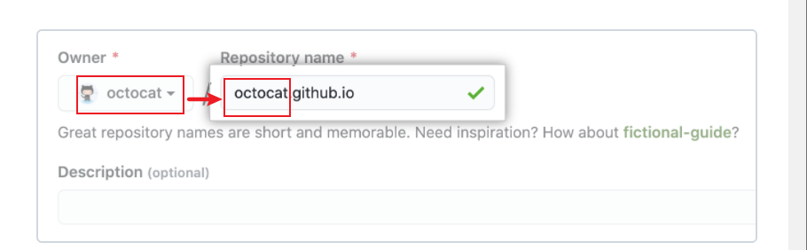

# gitpage 

You can use GitHub Pages to host a website about yourself, your organization, or your project directly from a GitHub repository.

## 1. [About GitHub Pages](https://docs.github.com/cn/pages/getting-started-with-github-pages/about-github-pages#)

GitHub Pages is a static site hosting service that takes HTML, CSS, and JavaScript files straight from a repository on GitHub, optionally runs the files through a build process, and publishes a website. You can see examples of GitHub Pages sites in the [GitHub Pages examples collection](https://github.com/collections/github-pages-examples).

## 2.start gitpage

To get started, see "[Creating a GitHub Pages site](https://docs.github.com/cn/articles/creating-a-github-pages-site)."

### 创建 GitHub Pages 站点

您可以在新仓库或现有仓库中创建 GitHub Pages 站点。

详情:https://docs.github.com/cn/pages/getting-started-with-github-pages/creating-a-github-pages-site#creating-your-site

重点:

**输入仓库的名称和说明（可选）。 如果您创建的是用户或组织站点，仓库名称必须为 `<user>.github.io` 或 `<organization>.github.io`。**

### [创建站点](https://docs.github.com/cn/pages/getting-started-with-github-pages/creating-a-github-pages-site#creating-your-site)

必须先在 GitHub 上有站点的仓库，然后才可创建站点。 如果未在现有仓库中创建站点，请参阅“[为站点创建仓库](https://docs.github.com/cn/pages/getting-started-with-github-pages/creating-a-github-pages-site#creating-a-repository-for-your-site)”。

1. 在 GitHub 上，导航到站点的仓库。
2. 确定要使用的发布源。 更多信息请参阅“[关于 GitHub Pages](https://docs.github.com/cn/articles/about-github-pages#publishing-sources-for-github-pages-sites)”。
3. 如果所选发布源已存在，请导航到发布源。 如果所选发布源不存在，则创建发布源。
4. 在发布源的根目录中，创建一个名为 `index.md`、包含要在网站主页上显示的内容的文件。
5. 配置发布源。 更多信息请参阅“[配置 GitHub Pages 站点的发布来源](https://docs.github.com/cn/articles/configuring-a-publishing-source-for-your-github-pages-site#choosing-a-publishing-source)”。
6. 在仓库名称下，单击 **Settings（设置）**。

7. 在左侧边栏中，单击 **Pages（页面）**

要查看您已发布的站点，请在“GitHub Pages”下点击您的站点 URL。

**注：**对站点的更改在推送到 GitHub 后，**最长可能需要 20 分钟才会发布**。 如果一小时后仍然在浏览器中看不到您的更改，请参阅“[关于 GitHub Pages 站点的 Jekyll 构建错误](https://docs.github.com/cn/articles/about-jekyll-build-errors-for-github-pages-sites)”。

### [后续步骤](https://docs.github.com/cn/pages/getting-started-with-github-pages/creating-a-github-pages-site#next-steps)

#### 目录结构问题

您可以通过创建更多新文件向网站添加更多页面。 每个文件都将在网站上与发布源**相同的目录结构**中。 

例如，如果项目网站的发布源是 `gh-pages` 分支，并且您在 `gh-pages` 分支上创建了名为 `/about/contact-us.md` 的新文件，该文件将在 `https://<user>.github.io/<repository>/about/contact-us.html` 下。

## 3. [Types of GitHub Pages sites](https://docs.github.com/cn/pages/getting-started-with-github-pages/about-github-pages#)

hree types of GitHub Pages sites

 **project, user, and organization.**

To publish a user site, you must create a repository owned by your user account that's named `<username>.github.io`

To publish an organization site, you must create a repository owned by an organization that's named `<organization>.github.io`. Unless you're using a custom domain, user and organization sites are available at `http(s)://<username>.github.io` or `http(s)://<organization>.github.io`.

You can only create **one user or organization site** for each account on GitHub. Project sites, whether owned by an organization or a user account, are unlimited.

## 4.[Publishing sources for GitHub Pages sites](https://docs.github.com/cn/pages/getting-started-with-github-pages/about-github-pages#)

The publishing source for your GitHub Pages site is the branch and folder where the source files for your site are stored.

The default publishing source for project sites is the root of the `gh-pages` branch.

If you want to keep the source files for your site in a different location, you can change the publishing source for your site. You can publish your site from any branch in the repository, either from the root of the repository on that branch, `/`, or from the `/docs`

If you choose the `/docs` folder of any branch as your publishing source, GitHub Pages will read everything to publish your site, including the *CNAME* file, from the `/docs` folder.

## 5.[Static site generators](https://docs.github.com/cn/pages/getting-started-with-github-pages/about-github-pages#static-site-generators)

GitHub Pages publishes any static files that you push to your repository. You can create your own static files or use a static site generator to build your site for you

We recommend Jekyll, a static site generator with built-in support for GitHub Pages and a simplified build process. For more information, see "[About GitHub Pages and Jekyll](https://docs.github.com/cn/articles/about-github-pages-and-jekyll)."

### 6. [Guidelines for using GitHub Pages](https://docs.github.com/cn/pages/getting-started-with-github-pages/about-github-pages#)

- GitHub Pages sites created after June 15, 2016 and using `github.io` domains are served over HTTPS. If you created your site before June 15, 2016, you can enable HTTPS support for traffic to your site. For more information, see "[Securing your GitHub Pages with HTTPS](https://docs.github.com/cn/articles/securing-your-github-pages-site-with-https)."
- GitHub Pages 站点不应该用于敏感事务，例如发送密码或信用卡号码。
- Your use of GitHub Pages is subject to the [GitHub Terms of Service](https://docs.github.com/cn/articles/github-terms-of-service), including the prohibition on reselling.

### [Usage limits](https://docs.github.com/cn/pages/getting-started-with-github-pages/about-github-pages#usage-limits)

GitHub Pages source repositories have a recommended limit of 1GB. 

### [Further reading](https://docs.github.com/cn/pages/getting-started-with-github-pages/about-github-pages#further-reading)

- [GitHub Pages](https://lab.github.com/githubtraining/github-pages) on GitHub Learning Lab
- "[GitHub Pages](https://docs.github.com/cn/rest/reference/repos#pages)"

