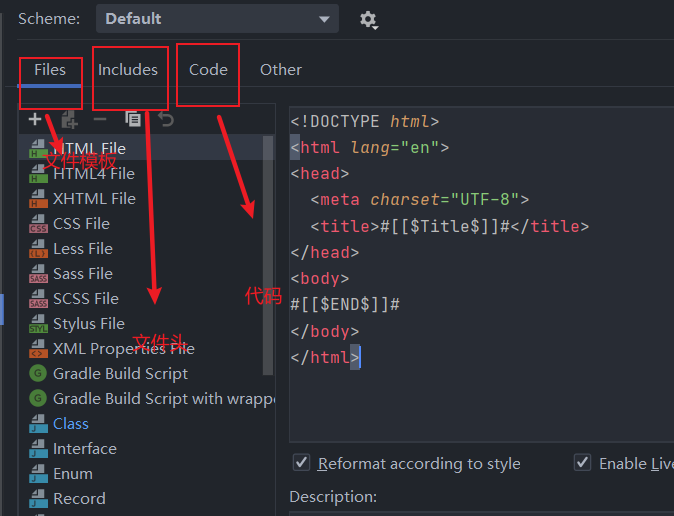

## 模板设置和 头设置

在框架源码或者是开源项目中设置文件注解头

```java
/**
 * 类<code>Doc</code>用于：TODO
 * 创建的用户表
 *
 * @author 12824
 * @version 1.0
 * @date 2021-08-03
 */
```

或者 文件模板


在哪设置:

`seeting -> file and code templete `



