# Maven

> maven配置:[00-maven注意事项-重要.pdf](./00-maven注意事项-重要.pdf)(常用配置注意实现 了解)
>
> module:[如何生成Module.md](./如何生成Module.md)
>
> 阿里云:[在Intelij IDEA中修改maven为国内镜像（阿里）.md](./在Intelij IDEA中修改maven为国内镜像（阿里）.md)

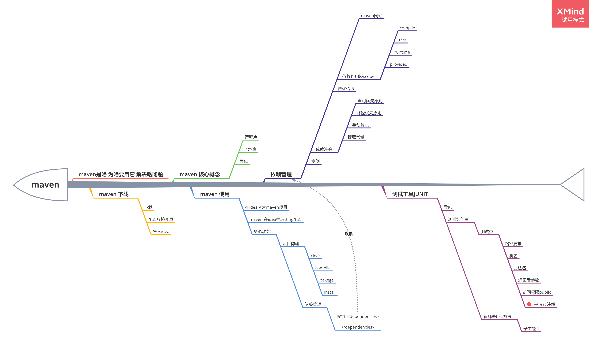

## 1. 介绍

Maven是一个项目管理工具。Maven这个项目管理工具可以帮助我们做什么呢？

- 项目构建

  项目构建其实就是指可以帮助我们编译、测试、打包等等

- 依赖管理

  依赖管理其实就是可以帮助我们管理项目的依赖，也就是管理导包

## 2. 安装与配置

从服务器下载或者到 http://maven.apache.org/download.cgi 下载

maven的是一个Java的开源项目，如何选择Maven的版本呢？

- JDK	JDK8
- IDEA  2018.3
- Maven 3.5.3

### 2.1 解压

直接把压缩包解压即可。

解压的目录的路径里面，不要带有中文，不要带有空格

### 2.2 配置环境变量

- 配置 maven_home

  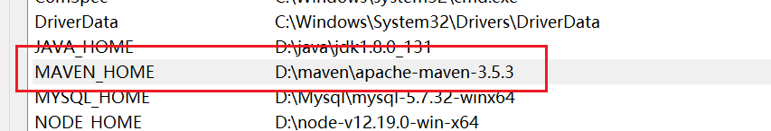

- 在path中加入maven_home

  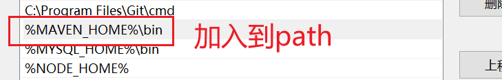


如何去检测环境变量是否已经配置好呢？

打开cmd窗口，执行`mvn -v`

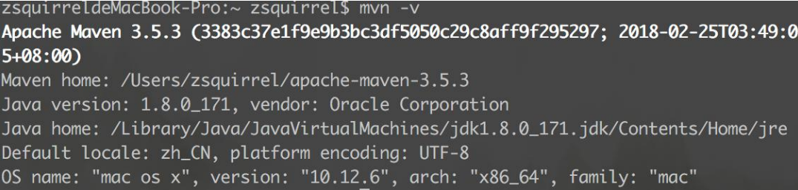


出现上图信息，表示maven安装配置成功


### 2.3 核心概念

- 本地仓库

  本地仓库其实就是我们使用了maven之后，maven会有一个专门的目录去统一的管理jar包

- 中央仓库

  maven会自动下载jar包，那么去哪个地方下载jar包呢？这个远程的地址就是中央仓库

  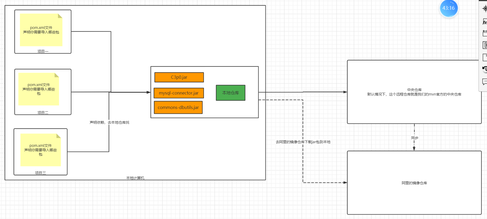

  

### 2.4 配置mvn

- 本地仓库

  打开setting.xml配置文件，在配置中加入

  `<localRepository>D:\maven\repo</localRepository>` 

  标签内的内容其实就是我们本地仓库的地址

- 远程仓库

  在<mirrors> 标签里面，加入以下内容即可

  ```xml
  	<mirror> 
  		<id>nexus-aliyun</id> 
  		<mirrorOf>central</mirrorOf> 
  		<name>Nexus aliyun</name> 
  		<url>http://maven.aliyun.com/nexus/content/groups/public</url> 
  	</mirror>
  ```

## 3. 使用

在idea如何使用maven呢？

### 3.1 新建一个Maven工程

第一步：我们创建项目的时候需要选择创建maven项目

第二步：配置组名、项目名、版本号等等

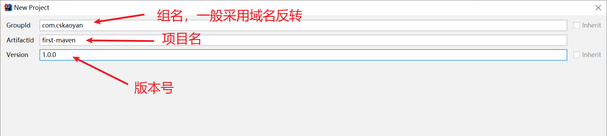

第三步：配置项目地址，项目名等等

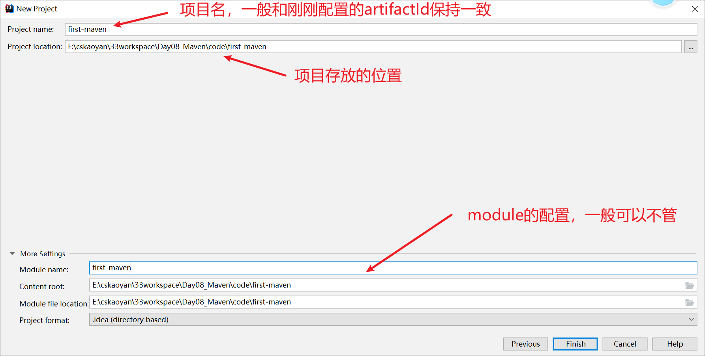


### 3.2 配置idea关于Maven的配置

这个配置也可以在新建maven工程之前去配置

#### 3.2.1 配置当前项目

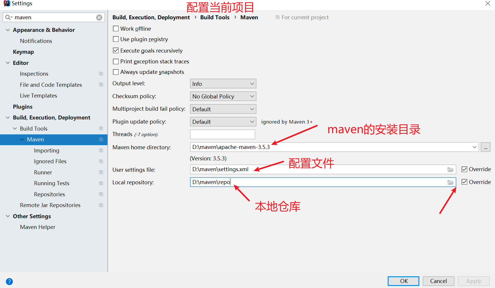

#### 3.2.2 配置项目的默认配置

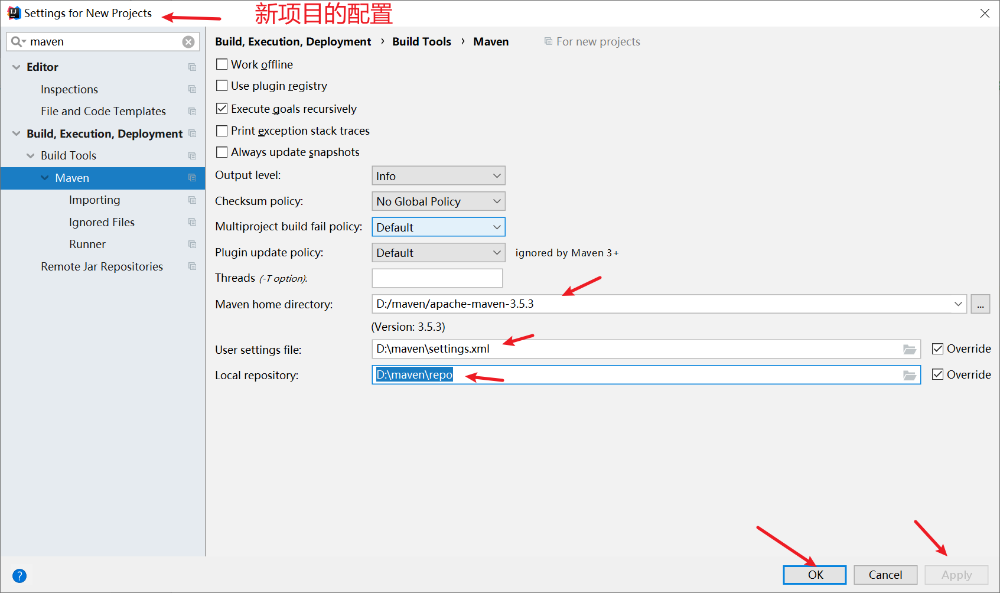

建议大家，第一次配置，配置完了以后，检查一下


### 3.3 项目构建

项目构建的目录对应关系

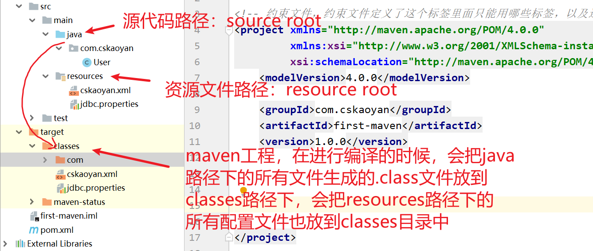


项目构建其实就是去对项目进行编译，打包，测试等等内容。这些项目构建都可以使用maven的命令来完成


- clean

  其实就是清除class文件，具体来说其实就是去删除掉target文件夹

  `mvn clean`

- compile

  这个其实就是编译的意思，也就是通过这个指令可以帮助我们去编译项目，生成class文件

- package 

  这个指令其实就是可以帮助我们把当前的maven工程，打包。打成一个jar包或者是war包

  `mvn package`

  在打包之前，我们需要去声明打包的格式，如何声明呢？

  在pom在xml文件中，声明打包的格式

  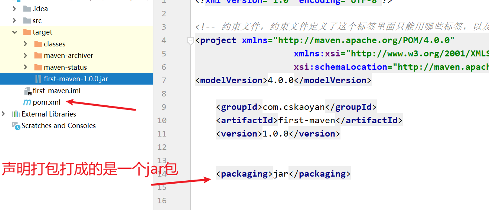

  注意，在打包之前，我们需要去执行编译，在执行package的时候，会帮助我们去执行compile指令


- install

  安装的意思。其实就是可以把我们的jar包给你复制到你的本地仓库中去。

  `mvn install`
  
  这个指令，其实就是可以帮助我们去编译项目，然后给我们打包项目，然后再把我们生产的jar包放到本地仓库中去。


问题：如何去本地仓库中找对应的jar包呢？

其实就是根据groupId、artifactId以及version来找对应的文件夹，一层一层找，就可以找到对应的jar包

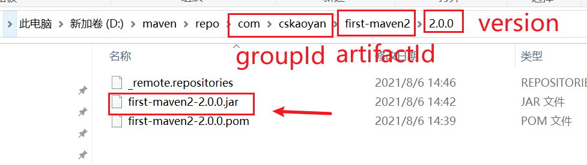


其实我们groupId，artifactId和version就组成了我们这个maven项目的坐标。每一个maven工程，都必须有一个独一无二的坐标。

- groupId：域名反转
- artifactId：应用名
- version：版本号


其实maven有很多指令，我们上面介绍的4个指令是其中最重要的4个。

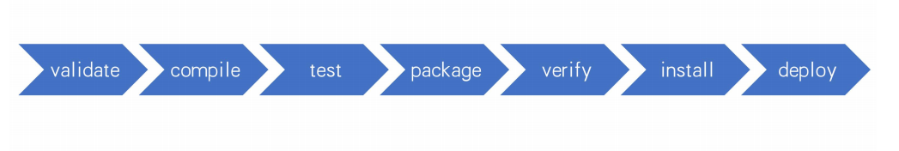

其实我们上面执行的一些指令，在idea中有一个插件，这个插件是一个maven的可视化插件，我们可以利用这个可视化插件帮助我们去执行maven指令。

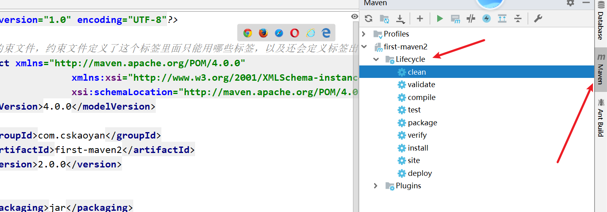


### 3.4 依赖管理

#### 3.4.1 如何导包

其实就是在pom.xml文件中声明jar的坐标，把坐标放到<dependencies> 这个标签中

```xml
<!-- 声明这个项目需要导入哪些包-->
<dependencies>
	
    <!-- 导入MySQL的驱动包-->
    <!-- https://mvnrepository.com/artifact/mysql/mysql-connector-java -->
    <dependency>
        <groupId>mysql</groupId>
        <artifactId>mysql-connector-java</artifactId>
        <version>5.1.47</version>
    </dependency>

</dependencies>
```


#### 3.4.2 scope的传递范围

- compile

  compile这种scope是默认的传递范围，不管是在编译、测试、运行的时候都有效

- test

  test其实就是只能在你测试的时候才能用，程序正常运行的时候是没有用的。

  具体来说，其实就是假如一个包的scope的值是test，那么这个包就只能在 src/test/java 这个路径下才能导入，在src/main/java 路径下是导入不进去的。

- provided

  对于src/main/java 路径有效，对于src/test/java 路径也是有效的，但是在运行的时候会失效

- runtime

  runtime这个传递范围只有在运行的时候生效，在编译的时候是不能生效的

#### 3.4.3 依赖传递

依赖的传递是指我们的项目可以去传递依赖。

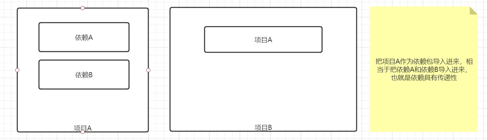


#### 3.4.4 依赖冲突

在同一个项目里面，导入了同一个jar的不同版本，这样就会造成jar包冲突，那我们如何去解决依赖冲突的问题呢？

##### 3.4.4.1 声明优先原则

也就是谁先声明，以谁为准

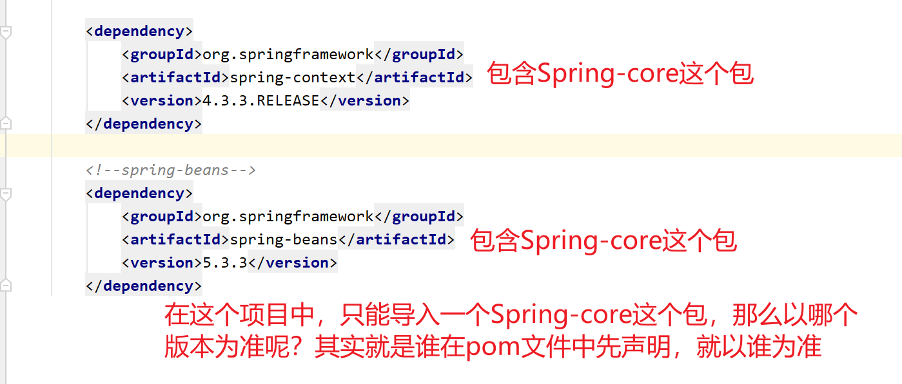

##### 3.4.4.2 就近原则

就近原则是指哪个版本的jar到当前项目，传递的次数比较少，就以谁为准。

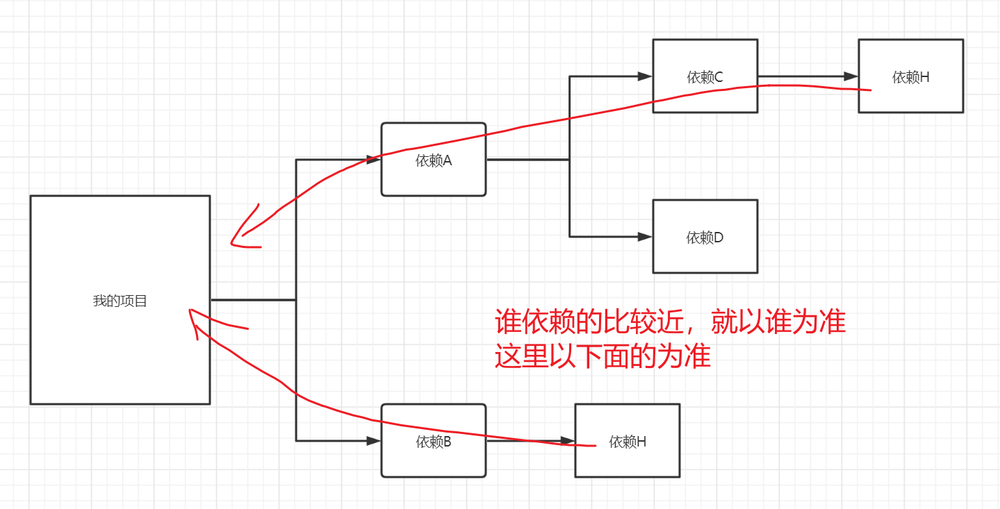


##### 3.4.4.3 手动排除

手动排除是指我们的项目比较大的情况下，我们的就近原则和声明原则是不太可靠的，需要我们进行手动排除

```xml
<dependency>
    <groupId>org.springframework</groupId>
    <artifactId>spring-jdbc</artifactId>
    <version>5.1.17.RELEASE</version>

    <!-- 手动排除掉传递过来的依赖 -->
    <exclusions>

        <exclusion>
            <artifactId>spring-core</artifactId>
            <groupId>org.springframework</groupId>
        </exclusion>

        <exclusion>
            <groupId>org.springframework</groupId>
            <artifactId>spring-beans</artifactId>
        </exclusion>
    </exclusions>
</dependency>
```

##### 3.4.4.4 提取常量

因为项目大了以后，版本号难以控制，所以我们可以把版本号提取出来

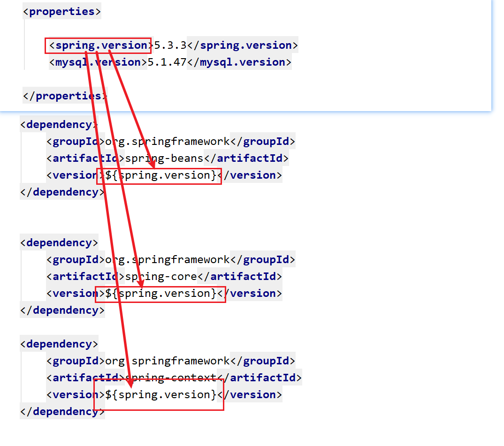


提取常量有几个好处：

1. 常量可以反复使用
2. 方便我们对于这个项目的依赖做一个集中管理

提取常量可以从根本上预防依赖冲突的问题。


## 4. 案例

重新构建一下我们之前的代码。以C3P0为例

- 导包

```xml

    <dependencies>

        <!-- 数据库的驱动包 -->
        <dependency>
            <groupId>mysql</groupId>
            <artifactId>mysql-connector-java</artifactId>
            <version>5.1.47</version>
        </dependency>

        <!-- c3p0-->
        <dependency>
            <groupId>com.mchange</groupId>
            <artifactId>c3p0</artifactId>
            <version>0.9.5.2</version>
        </dependency>

        <!-- 依赖已经传递过来了，所以我们不用导入这个包-->
        <!--<dependency>-->
            <!--<groupId>com.mchange</groupId>-->
            <!--<artifactId>mchange-commons-java</artifactId>-->
            <!--<version>0.2.20</version>-->
        <!--</dependency>-->

        <!-- dbutils -->
        <dependency>
            <groupId>commons-dbutils</groupId>
            <artifactId>commons-dbutils</artifactId>
            <version>1.7</version>
        </dependency>

    </dependencies>
```

- 配置

  我们需要把C3p0的配置以及其他的所有的配置文件都放到resources目录下

  

  

  都放在这个目录下了之后，我们读取文件流的方式发生了一点改变。我们需要通过类加载器去获取文件流

  ```java
     // 加载配置文件
              Properties properties = new Properties();
  //            FileInputStream fileInputStream = new FileInputStream("druid.properties");
  
              // 通过类加载器来找
              ClassLoader classLoader = DruidUtils.class.getClassLoader();
  
  //            URL url = classLoader.getResource("druid.properties");
  //
  //            // 这个path是一个绝对路径，通过类加载器来获取
  //            String path = url.getPath();
  //
  //
  //            FileInputStream fileInputStream = new FileInputStream(path);
  
  			// 通过类加载器来获取
  			// 这一步就相当于上面被注释的3行
              InputStream stream = classLoader.getResourceAsStream("druid.properties");
  
              properties.load(stream);
  ```

  其他的和之前的是一样的。需要注意的是我们的java代码需要写在 src/main/java 路径下


# 测试工具 JUNIT

这个是一个测试工具，可以帮助我们去运行我们自己写的代码。

如何使用呢？

- 导包

  ```xml
  <!-- 测试工具 junit-->
  <dependency>
      <groupId>junit</groupId>
      <artifactId>junit</artifactId>
      <version>4.12</version>
  </dependency>
  ```

- 写测试类

  有三个要求（规范）

  - 规范1：我们必须把测试类写在 src/test/java路径下
  - 规范2：我们测试类的名字必须是这个格式的：XxxxTest
  - 规范3：我们测试方法的名字必须是 testXxx()
  - 规范4：测试方法必须是无参的，没有返回值，是public的，不能是静态的

  ```java
  // 写测试方法
  // 一定要使用 org.junit包下的@Test注解
  @Test
  public void testSelectUserById() throws SQLException {
  
      QueryRunner queryRunner = new QueryRunner(DruidUtils.getDataSource());
  
      Account account = queryRunner.query("select * from account where id = ?", new BeanHandler<>(Account.class),1);
  
      System.out.println(account);
  
  }
  ```

  

需要注意测试方法执行的顺序：

beforeClass...
before....
test03....
after....
before....
Account{id=1, name='风华哥', money=200, role='boss'}
after....
before....
[Account{id=1, name='风华哥', money=200, role='boss'}, Account{id=2, name='长风', money=100, role='年轻的打工人'},'}]
after....
afterClass...

```java
package com.cskaoyan;

import com.cskaoyan.utils.DruidUtils;
import org.apache.commons.dbutils.QueryRunner;
import org.apache.commons.dbutils.handlers.BeanHandler;
import org.apache.commons.dbutils.handlers.BeanListHandler;
import org.junit.*;

import java.sql.SQLException;
import java.util.List;

public class AccountTest {


    @Test
    public  void testSelectUserById() throws SQLException {

        QueryRunner queryRunner = new QueryRunner(DruidUtils.getDataSource());

        Account account = queryRunner.query("select * from account where id = ?", new BeanHandler<>(Account.class),1);

        System.out.println(account);

    }


    @Test
    public void testSelectUserList() throws SQLException {

        QueryRunner queryRunner = new QueryRunner(DruidUtils.getDataSource());

        List<Account> accounts = queryRunner.query("select * from account", new BeanListHandler<Account>(Account.class));

        System.out.println(accounts);

    }

    @Test
    public void test03(){

        System.out.println("test03....");

    }

    // 这个是在测试方法执行之前执行
    @Before
    public void before(){

        System.out.println("before....");

    }
    // 这个是在测试方法执行之后执行
    @After
    public void after(){

        System.out.println("after....");

    }

    // 这个是在类被初始化的时候执行
    @BeforeClass
    public static void beforeClass(){
        System.out.println("beforeClass...");
    }

    // 是在类被销毁的时候执行
    @AfterClass
    public static void afterClass(){
        System.out.println("afterClass...");
    }

}
```


# 补充 

## 添加 maven 依赖哪里找

1. 在maven 远程库中找

2. 在idea中能直接搜索

   在`pom.xml`文件中点击右键,或者 `alt+insert`

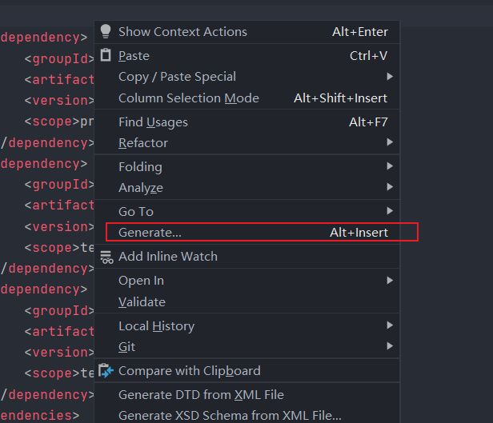

选择`dependency`

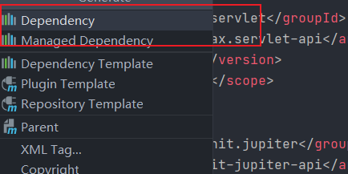

直接在 `Search For Artifact` 上操作.

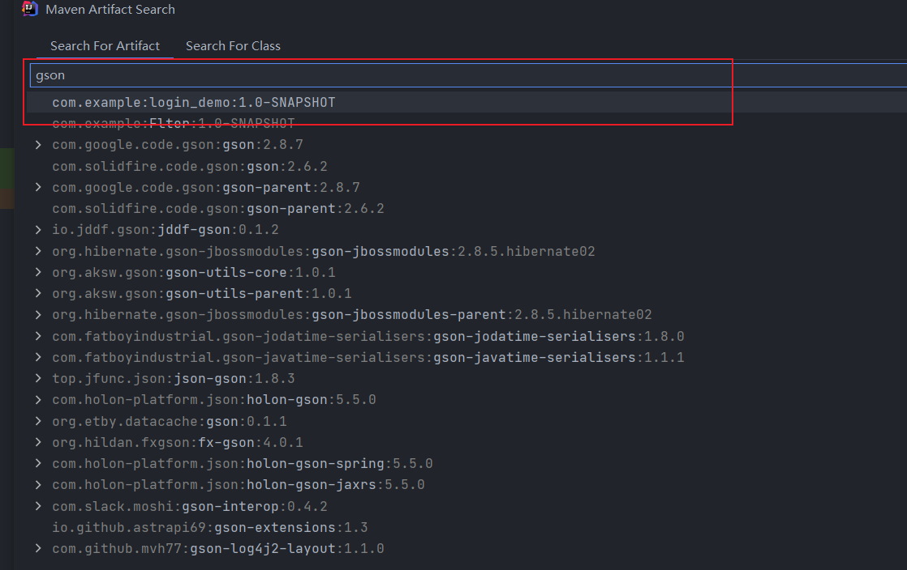

