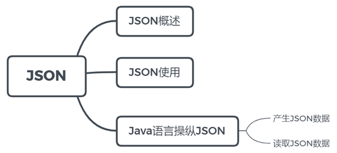
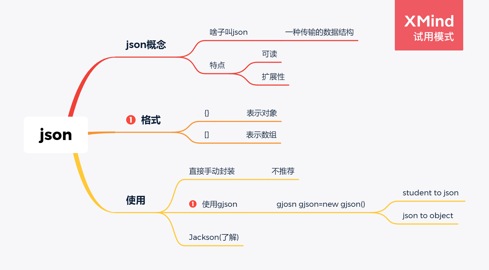
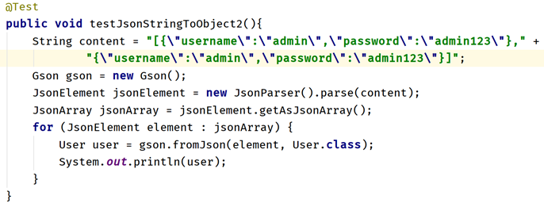
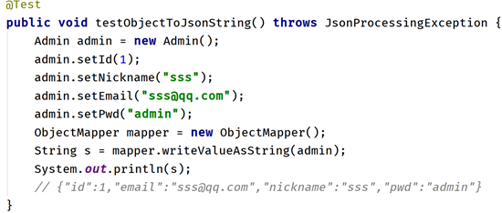
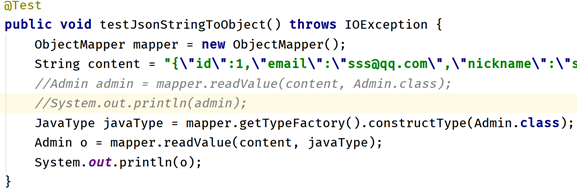
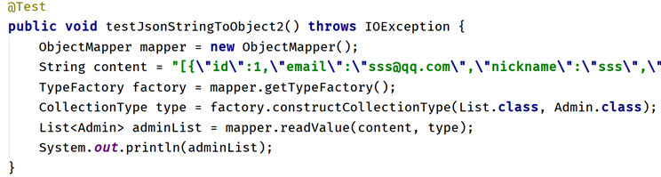
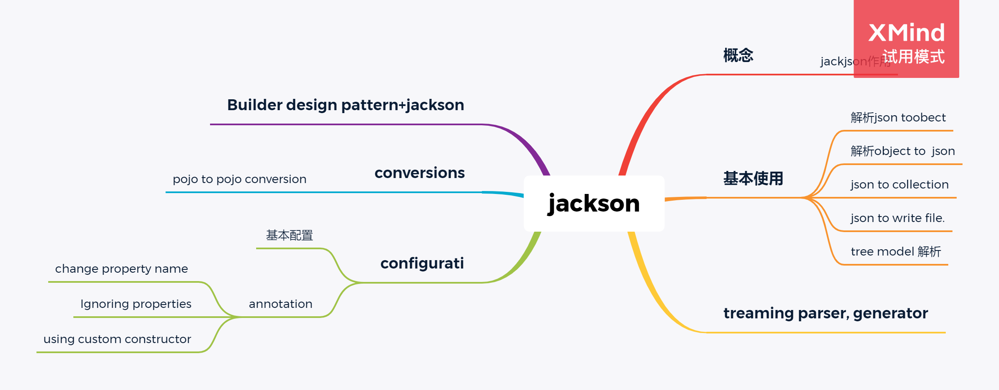

# json
>gson学习:https://www.yiibai.com/gson/gson_null_support.html
>json校验网站:https://www.bejson.com/
>
>code:https://github.com/ytwotap/Web/tree/main/json



## JSON

### 1. json 概念

JSON(JavaScript Object Notation) 是一种轻量级的数据交换格式。它基于JavaScript（Standard ECMA-262 3rd Edition - December 1999）的一个子集，它利用了JavaScript的一些模式来表示结构化数据。

它是一种数据格式，而非编程语言

Json并不从属于JavaScript

很多编程语言都有针对Json的解析器 


**JSON是一个数据格式。说白了就是js里面的对象（数据的结构）**

表示一个学生信息  student   name、age、province

{name:"jingtian", age:26,province:"henan"}   ---js里面的对象


json数据如何写？如何理解？

记住以下几个结论就可以了

**如果看到{}表示的是一个对象**

**如果看到的是[]表示的是一个数组或者集合**


xml之前是作为一个数据交互的格式。手机客户端和服务器之间进行数据交换，采用什么样的数据格式来交互彼此的数据呢？

xml。xml相较于key=value型数据，最大的优势是可以表示数据之间的关系。可以表现出层级的关系。

xml渐渐地被人们抛弃了。主要是传输的效率不是特别的高（xml具有非常严格的标签）

后面被json取代了。

而目前xml主要用在一些框架、软件的配置文件中。

### 2. json格式


```js
var country = {name:"中国",province:[{name:"黑龙江", cities:["哈尔滨","大庆"]},
                {name:"广东", cities:["广州","深圳"]},
                {name:"台湾", cities:["台北","高雄"]},
                {name:"新建", cities:["乌鲁木齐","喀什"]}]}
```

 var country ={
            "name":"中国",
             "province":[{"name":"黑龙江",”cities”:["哈尔滨","大庆"]},
		          {"name":"广东","cities":["广州","深圳","珠海"]},
		          {"name":"台湾","cities":["台北","高雄"]},
		          {"name":"新疆","cities":["乌鲁木齐"]}
                                   ]
                   }


两者之间有什么样的区别呢？

第一种写法指的是js的对象（json）；第二种的写法你可以认为是js对象的字符串（json字符串）

可以通俗的理解为前者相当于java对象，后者相当于调用了toString方法


**在前后端进行数据传输的过程中，一般情况下，我们都是以json字符串的形式来进行传输的。**


比如说登录页面，之前提交参数是通过form表单，以key=value型进行提交

其实你也可以使用json字符串的形式进行提交 

{"username":"admin","password":"admin"}


### 3. 使用json

java语言也是可以使用json相关的数据的。

#### 1.将java对象转成json字符串

​	**前后端进行交互，后端查询数据库拿到了相关数据，比如商品信息数据，需要返回给前端，需要将java对象转成json字符串，交给前端进行进一步处理**


```java
public class MainTest {

    public static void main(String[] args) {
        //将java对象转成json字符串
        //  {“name”:"admin", "province":"hubei"}
        Student student = new Student();
        student.setName("张三");
        student.setProvince("湖北省");
        // bejson.com  可以校验json的格式是否正确
        String jsonStr = "{\"name\":\"" + student.getName() + "\",\"province\":\"" + student.getProvince() + "\"}";
        System.out.println(jsonStr);
    }
}
```

比较麻烦。并且很多都是重复性的机械性操作，如果接下来需要我们去处理list、map等，更为繁琐

可以借助于一些类库  第三方的jar包。

google-gson

alibaba-fastjson

SpringMVC----jackson


#### 2.将json字符串转成java对象(重点)

##### gjson

> [gjson个人笔记补充学习](./补充_2_gjson.md)

> 可以使用**gson** and **json**.

​	tojson

```java
 Gson gson = new Gson();
        String s = gson.toJson(student);
```

json to object

```java
 Gson gson = new Gson();
        //反射
        Student student = gson.fromJson(jsonStr, Student.class);
```

分离:




> 关于json空对象问题:https://www.yiibai.com/gson/gson_null_support.html

##### jackson

> doc-github: https://github.com/FasterXML/jackson-docs
>
> **study course(keynote)** :https://github.com/FasterXML/jackson-databind/








详细:

**前后端进行交互，前端页面提交了请求参数，比如登录，后端需要接收到该请求参数，然后将其保存到数据库中。**

```java
import com.google.gson.Gson;
import com.google.gson.JsonArray;
import com.google.gson.JsonElement;
import com.google.gson.JsonParser;
import org.junit.Test;

import java.util.ArrayList;
import java.util.List;

public class JSONTest {

    @Test
    public void testObjectToJson(){
        Student student = new Student();
        student.setName("张三");
        student.setAge(25);

        Gson gson = new Gson();
        String s = gson.toJson(student);
        System.out.println(s);
    }

    @Test
    public void testObjectToJson2(){
        Student student = new Student();
        student.setName("张三");
        student.setAge(25);

        Student student2 = new Student();
        student2.setName("李四");
        student2.setAge(26);

        List<Student> students = new ArrayList<>();
        students.add(student);
        students.add(student2);

        Gson gson = new Gson();
        String s = gson.toJson(students);
        System.out.println(s);
    }

    @Test
    public void testJsonToObject(){
        String jsonStr = "{\"name\":\"张三\",\"age\":25}";
        Gson gson = new Gson();
        //反射
        Student student = gson.fromJson(jsonStr, Student.class);
        System.out.println(student);
    }

    @Test
    public void testJsonToObject2(){
        String str = "[{\"name\":\"张三\",\"age\":25},{\"name\":\"李四\",\"age\":26}]";
        Gson gson = new Gson();
        // List<Student>
        //可以先对json字符串进行解析
        JsonElement jsonElement = new JsonParser().parse(str);
        //根据最外侧的括号进而判断接下来选择哪个方法
        //如果是[] getAsJsonArray  ；如果是{} getAsJsonObject
        JsonArray jsonArray = jsonElement.getAsJsonArray();
        for (JsonElement element : jsonArray) {
            //element其实就是对{"name":"张三","age":25}的封装
            Student student = gson.fromJson(element, Student.class);
            System.out.println(student);
        }
    }
}
```


# 补充:jackjson



jackson-databind ，数据绑定包， 提供基于"对象绑定" 解析的相关 API （ ObjectMapper ） 和"树模型" 解析的相关 API （JsonNode）；基于"对象绑定" 解析的 API 和"树模型"解析的 API 依赖基于"流模式"解析的 API。

>
> 链接：https://juejin.cn/post/6844904166809157639


1. 依赖:

```xml
   <!--note: databind 不是 core
    databind =core+annotation 包

    -->
    <!-- https://mvnrepository.com/artifact/com.fasterxml.jackson.core/jackson-core -->
    <dependency>
        <groupId>com.fasterxml.jackson.core</groupId>
        <artifactId>jackson-databind</artifactId>
        <version>2.12.4</version>
    </dependency>

```

## (重点 记住)1 minute tutorial: POJOs to JSON and back

The most common usage is to take piece of JSON, and construct a Plain Old Java Object ("POJO") out of it. So let's start there. With simple 2-property POJO like this:

```java
// Note: can use getters/setters as well; here we just use public fields directly:
public class MyValue {
  public String name;
  public int age;
  // NOTE: if using getters/setters, can keep fields `protected` or `private`
}
```

we will need a `com.fasterxml.jackson.databind.ObjectMapper` instance, used for all data-binding, so let's construct one:

```java
ObjectMapper mapper = new ObjectMapper(); // create once, reuse
```

The default instance is fine for our use -- we will learn later on how to configure mapper instance if necessary. Usage is simple:

```
MyValue value = mapper.readValue(new File("data.json"), MyValue.class);
// or:
value = mapper.readValue(new URL("http://some.com/api/entry.json"), MyValue.class);
// or:
value = mapper.readValue("{\"name\":\"Bob\", \"age\":13}", MyValue.class);
```

And if we want to write JSON, we do the reverse:

```
mapper.writeValue(new File("result.json"), myResultObject);
// or:
byte[] jsonBytes = mapper.writeValueAsBytes(myResultObject);
// or:
String jsonString = mapper.writeValueAsString(myResultObject);
```

So far so good?

## 3 minute tutorial: Generic collections, Tree Model

Beyond dealing with simple Bean-style POJOs, you can also handle JDK `List`s, `Map`s:

```
Map<String, Integer> scoreByName = mapper.readValue(jsonSource, Map.class);
List<String> names = mapper.readValue(jsonSource, List.class);

// and can obviously write out as well
mapper.writeValue(new File("names.json"), names);
```

as long as JSON structure matches, and types are simple. If you have POJO values, you need to indicate actual type (note: this is NOT needed for POJO properties with `List` etc types):

```
Map<String, ResultValue> results = mapper.readValue(jsonSource,
   new TypeReference<Map<String, ResultValue>>() { } );
// why extra work? Java Type Erasure will prevent type detection otherwise
```

(note: no extra effort needed for serialization, regardless of generic types)

But wait! There is more!

While dealing with `Map`s, `List`s and other "simple" Object types (Strings, Numbers, Booleans) can be simple, Object traversal can be cumbersome. This is where Jackson's [Tree model](https://github.com/FasterXML/jackson-databind/wiki/JacksonTreeModel) can come in handy:

```java
// can be read as generic JsonNode, if it can be Object or Array; or,
// if known to be Object, as ObjectNode, if array, ArrayNode etc:
ObjectNode root = mapper.readTree("stuff.json");
String name = root.get("name").asText();
int age = root.get("age").asInt();

// can modify as well: this adds child Object as property 'other', set property 'type'
root.with("other").put("type", "student");
String json = mapper.writeValueAsString(root);

// with above, we end up with something like as 'json' String:
// {
//   "name" : "Bob", "age" : 13,
//   "other" : {
//      "type" : "student"
//   }
// }
```

Tree Model can be more convenient than data-binding, especially in cases where structure is highly dynamic, or does not map nicely to Java classes.

## 5 minute tutorial: Streaming parser, generator

As convenient as data-binding (to/from POJOs) can be; and as flexible as Tree model can be, there is one more canonical processing model available: incremental (aka "streaming") model. It is the underlying processing model that data-binding and Tree Model both build upon, but it is also exposed to users who want ultimate performance and/or control over parsing or generation details.

For in-depth explanation, look at [Jackson Core component](https://github.com/FasterXML/jackson-core). But let's look at a simple teaser to whet your appetite.

```java
ObjectMapper mapper = ...;
// First: write simple JSON output
File jsonFile = new File("test.json");
// note: method added in Jackson 2.11 (earlier would need to use
// mapper.getFactory().createGenerator(...)
JsonGenerator g = f.createGenerator(jsonFile, JsonEncoding.UTF8);
// write JSON: { "message" : "Hello world!" }
g.writeStartObject();
g.writeStringField("message", "Hello world!");
g.writeEndObject();
g.close();

// Second: read file back
try (JsonParser p = mapper.createParser(jsonFile)) {
  JsonToken t = p.nextToken(); // Should be JsonToken.START_OBJECT
  t = p.nextToken(); // JsonToken.FIELD_NAME
  if ((t != JsonToken.FIELD_NAME) || !"message".equals(p.getCurrentName())) {
   // handle error
  }
  t = p.nextToken();
  if (t != JsonToken.VALUE_STRING) {
   // similarly
  }
  String msg = p.getText();
  System.out.printf("My message to you is: %s!\n", msg);
}
```

## 10 minute tutorial: configuration

There are two entry-level configuration mechanisms you are likely to use: [Features](https://github.com/FasterXML/jackson-databind/wiki/JacksonFeatures) and [Annotations](https://github.com/FasterXML/jackson-annotations).

### Commonly used Features

Here are examples of configuration features that you are most likely to need to know about.

Let's start with higher-level data-binding configuration.

```java
// SerializationFeature for changing how JSON is written

// to enable standard indentation ("pretty-printing"):
mapper.enable(SerializationFeature.INDENT_OUTPUT);
// to allow serialization of "empty" POJOs (no properties to serialize)
// (without this setting, an exception is thrown in those cases)
mapper.disable(SerializationFeature.FAIL_ON_EMPTY_BEANS);
// to write java.util.Date, Calendar as number (timestamp):
mapper.disable(SerializationFeature.WRITE_DATES_AS_TIMESTAMPS);

// DeserializationFeature for changing how JSON is read as POJOs:

// to prevent exception when encountering unknown property:
mapper.disable(DeserializationFeature.FAIL_ON_UNKNOWN_PROPERTIES);
// to allow coercion of JSON empty String ("") to null Object value:
mapper.enable(DeserializationFeature.ACCEPT_EMPTY_STRING_AS_NULL_OBJECT);
```

In addition, you may need to change some of low-level JSON parsing, generation details:

```java
// JsonParser.Feature for configuring parsing settings:

// to allow C/C++ style comments in JSON (non-standard, disabled by default)
// (note: with Jackson 2.5, there is also `mapper.enable(feature)` / `mapper.disable(feature)`)
mapper.configure(JsonParser.Feature.ALLOW_COMMENTS, true);
// to allow (non-standard) unquoted field names in JSON:
mapper.configure(JsonParser.Feature.ALLOW_UNQUOTED_FIELD_NAMES, true);
// to allow use of apostrophes (single quotes), non standard
mapper.configure(JsonParser.Feature.ALLOW_SINGLE_QUOTES, true);

// JsonGenerator.Feature for configuring low-level JSON generation:

// to force escaping of non-ASCII characters:
mapper.configure(JsonGenerator.Feature.ESCAPE_NON_ASCII, true);
```

Full set of features are explained on [Jackson Features](https://github.com/FasterXML/jackson-databind/wiki/JacksonFeatures) page.

### Annotations: changing property names

The simplest annotation-based approach is to use `@JsonProperty` annotation like so:

```
public class MyBean {
   private String _name;

   // without annotation, we'd get "theName", but we want "name":
   @JsonProperty("name")
   public String getTheName() { return _name; }

   // note: it is enough to add annotation on just getter OR setter;
   // so we can omit it here
   public void setTheName(String n) { _name = n; }
}
```

There are other mechanisms to use for systematic naming changes: see [Custom Naming Convention](https://github.com/FasterXML/jackson-databind/wiki/JacksonCustomNamingConvention) for details.

Note, too, that you can use [Mix-in Annotations](https://github.com/FasterXML/jackson-databind/wiki/JacksonMixinAnnotations) to associate all annotations.

### Annotations: Ignoring properties

There are two main annotations that can be used to to ignore properties: `@JsonIgnore` for individual properties; and `@JsonIgnoreProperties` for per-class definition

```java
// means that if we see "foo" or "bar" in JSON, they will be quietly skipped
// regardless of whether POJO has such properties
@JsonIgnoreProperties({ "foo", "bar" })
public class MyBean
{
   // will not be written as JSON; nor assigned from JSON:
   @JsonIgnore
   public String internal;

   // no annotation, public field is read/written normally
   public String external;

   @JsonIgnore
   public void setCode(int c) { _code = c; }

   // note: will also be ignored because setter has annotation!
   public int getCode() { return _code; }
}
```

As with renaming, note that annotations are "shared" between matching fields, getters and setters: if only one has `@JsonIgnore`, it affects others. But it is also possible to use "split" annotations, to for example:

```java
public class ReadButDontWriteProps {
   private String _name;
   @JsonProperty public void setName(String n) { _name = n; }
   @JsonIgnore public String getName() { return _name; }
}
```

in this case, no "name" property would be written out (since 'getter' is ignored); but if "name" property was found from JSON, it would be assigned to POJO property!

For a more complete explanation of all possible ways of ignoring properties when writing out JSON, check ["Filtering properties"](http://www.cowtowncoder.com/blog/archives/2011/02/entry_443.html) article.

### Annotations: using custom constructor

Unlike many other data-binding packages, Jackson does not require you to define "default constructor" (constructor that does not take arguments). While it will use one if nothing else is available, you can easily define that an argument-taking constructor is used:

```java
public class CtorBean
{
  public final String name;
  public final int age;

  @JsonCreator // constructor can be public, private, whatever
  private CtorBean(@JsonProperty("name") String name,
    @JsonProperty("age") int age)
  {
      this.name = name;
      this.age = age;
  }
}
```

Constructors are especially useful in supporting use of [Immutable objects](http://www.cowtowncoder.com/blog/archives/2010/08/entry_409.html).

Alternatively, you can also define "factory methods":

```java
public class FactoryBean
{
    // fields etc omitted for brevity

    @JsonCreator
    public static FactoryBean create(@JsonProperty("name") String name) {
      // construct and return an instance
    }
}
```

Note that use of a "creator method" (`@JsonCreator` with `@JsonProperty` annotated arguments) does not preclude use of setters: you can mix and match properties from constructor/factory method with ones that are set via setters or directly using fields.

## Tutorial: fancier stuff, conversions

One useful (but not very widely known) feature of Jackson is its ability to do arbitrary POJO-to-POJO conversions. Conceptually you can think of conversions as sequence of 2 steps: first, writing a POJO as JSON, and second, binding that JSON into another kind of POJO. Implementation just skips actual generation of JSON, and uses more efficient intermediate representation.

Conversions work between any compatible types, and invocation is as simple as:

```java
ResultType result = mapper.convertValue(sourceObject, ResultType.class);
```

and as long as source and result types are compatible -- that is, if to-JSON, from-JSON sequence would succeed -- things will "just work". But here are couple of potentially useful use cases:

```java
// Convert from List<Integer> to int[]
List<Integer> sourceList = ...;
int[] ints = mapper.convertValue(sourceList, int[].class);
// Convert a POJO into Map!
Map<String,Object> propertyMap = mapper.convertValue(pojoValue, Map.class);
// ... and back
PojoType pojo = mapper.convertValue(propertyMap, PojoType.class);
// decode Base64! (default byte[] representation is base64-encoded String)
String base64 = "TWFuIGlzIGRpc3Rpbmd1aXNoZWQsIG5vdCBvbmx5IGJ5IGhpcyByZWFzb24sIGJ1dCBieSB0aGlz";
byte[] binary = mapper.convertValue(base64, byte[].class);
```

Basically, Jackson can work as a replacement for many Apache Commons components, for tasks like base64 encoding/decoding, and handling of "dyna beans" (Maps to/from POJOs).

## Tutorial: Builder design pattern + Jackson

The Builder design pattern is a creational design pattern and can be used to create complex objects step by step. If we have an object that needs multiple checks on other dependencies, In such cases, it is preferred to use builder design pattern.

Let's consider the person structure, which has some optional fields

```java
public class Person {
    private final String name;
    private final Integer age;
 
    // getters
}
```

Let’s see how we can employ its power in deserialization. First of all, let’s declare a private all-arguments constructor, and a Builder class.

```java
private Person(String name, Integer age) {
    this.name = name;
    this.age = age;
}
 
static class Builder {
    String name;
    Integer age;
    
    Builder withName(String name) {
        this.name = name;
        return this;
    }
    
    Builder withAge(Integer age) {
        this.age = age;
        return this;
    }
    
    public Person build() {
        return new Person(name, age);
    } 
}
```

First of all, we need to mark our class with `@JsonDeserialize` annotation, passing a builder parameter with a fully qualified domain name of a builder class. After that, we need to annotate the builder class itself as `@JsonPOJOBuilder`.

```java
@JsonDeserialize(builder = Person.Builder.class)
public class Person {
    //...
    
    @JsonPOJOBuilder
    static class Builder {
        //...
    }
}
```

A simple unit test will be:

```java
String json = "{\"name\":\"Hassan\",\"age\":23}";
Person person = new ObjectMapper().readValue(json, Person.class);
 
assertEquals("Hassan", person.getName());
assertEquals(23, person.getAge().intValue());
```

If your builder pattern implementation uses other prefixes for methods or uses other names than build() for the builder method Jackson also provide a handy way for you.

For example, if you have a builder class uses the "set" prefix for its methods and use the create() method instead of build() for building the whole class, you have to annotate your class like:

```java
@JsonPOJOBuilder(buildMethodName = "create", withPrefix = "set")
static class Builder {
    String name;
    Integer age;
    
    Builder setName(String name) {
        this.name = name;
        return this;
    }
    
    Builder setAge(Integer age) {
        this.age = age;
        return this;
    }
    
    public Person create() {
        return new Person(name, age);
    } 
}
```

Overall, Jackson library is very powerful in deserializing objects using builder pattern.

