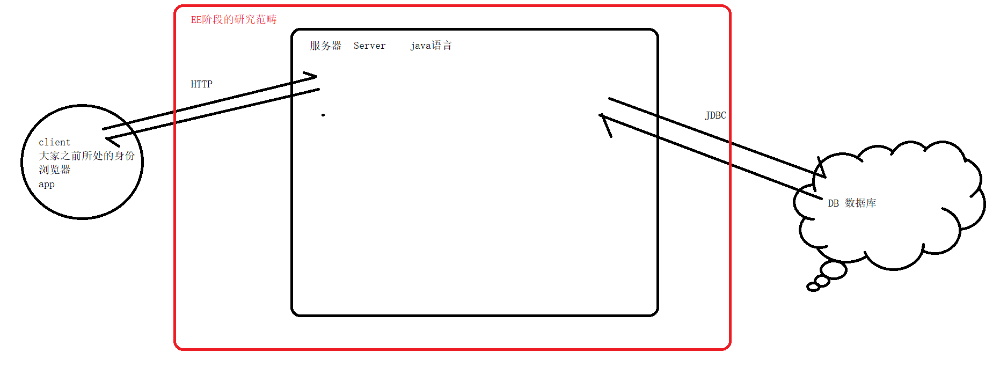

# 概述

 ---------------------[study ppt(ppt perfect) 重点](./预习课件)---------------------

web 个人 code:https://github.com/ytwotap/Web

实际就是对**浏览器->服务器**这个访问流程进行了学习.

## 简介:

time:2周左右。

1周的基础知识阶段

1周的项目

### **web开发步骤进阶**

**基本的web服务->静态web服务->动态web服务->tomcat代理->框架spring**

**和普通的java区别在于多了与web的交互. 即 在网络通信方面进行了拓展**

**model:**

**主要围绕服务器开发。**京东、淘宝

### **EE阶段的含义。**

Enterprise Edition。企业版。 SE。

SE主要面向的是个人开发者

EE更多面向的是企业开发者

企业开发相较于个人开发有一些区别的？企业级应用比较复杂，如果单纯使用SE阶段的API来去开发的话，的确也可以完成，但是会很麻烦；sun公司制定了一个EE，对于SE的API的一个封装，之前需要去写几十行SE的API来完成的功能，使用EE的API的话，只需要一行代码即可。

但是大家更为熟悉的是作为客户端的角色。

在学习EE阶段时，需要大家做一个身份的转变。

接口

回顾一下面向对象部分的内容：封装、继承、**多态**

大家在学习EE阶段的时候，可能会觉得有些抽象。项目一

### **建议：**

1.建议大家多做笔记。自己去做笔记。

2.课堂上面可以做一部分笔记的。不需要记录的非常详细，可以以思维导图，大纲的形式，千万不要自己上课自己去敲代码。

3.不要过多依赖于视频。

4.每天一定要把课堂的代码敲一遍。最好的方式：就是根据自己的记忆或者理解，自己去把代码写出来，能写多少写多少 

5.提问。建议大家多提问。如何去问？能否持续地学习。初中级开发--------->  高级开发--------> 架构师

​	提问的时候多注重自己的思考，自己思考过后再去提问。多问**how、why**，尽量不要问what

6.**debug**。一定要自己学会debug。idea 的debug。

