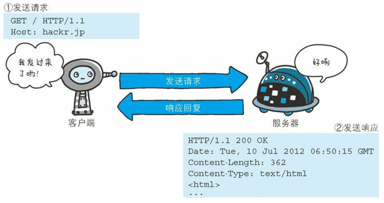
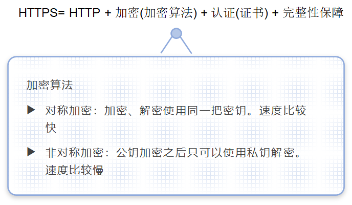

## 1、HTTP

> 参考:[http协议](./http协议)
>
> https:[第七章 net security](onenote:https://d.docs.live.net/e790efa1a5ba307f/Documents/kaoyan/网络typro.one#第七章 net security&section-id={9EDF695B-5406-17B4-A069-319092656491}&page-id={5FC3FF2F-391B-4B96-AC0A-044A207B0B24}&end) ([Web 视图](https://onedrive.live.com/view.aspx?resid=E790EFA1A5BA307F!3600&id=documents&wd=target(网络typro.one|9EDF695B-5406-47B4-A069-319092656491%2F第七章 net security|5FC3FF2F-391B-4B96-AC0A-044A207B0B24%2F)))

> tcpone note 笔记:[第五章](onenote:https://d.docs.live.net/e790efa1a5ba307f/Documents/kaoyan/网络typro.one#第五章&section-id={9EDF695B-5406-47B4-A069-319092656491}&page-id={F4B9BF1F-658F-419F-9CEF-5E02BE10AF63}&end) ([Web 视图](https://onedrive.live.com/view.aspx?resid=E790EFA1A5BA307F!3600&id=documents&wd=target(网络typro.one|9EDF695B-5406-47B4-A069-319092656491%2F第五章|F4B9BF1F-658F-419F-9CEF-5E02BE10AF63%2F)))

**http需求位置:**


### 1.1 什么是HTTP

#### 概念:



HTTP的全称叫做超文本传输协议。

html：超文本标记语言。

两者之间的联系其实非常的紧密。介绍一下历史。tim bernes lee

毕业了以后从事的是物理行业，实验室，科研人员。

科研人员的工作是啥？

做研究、**写论文**、参加学术会议

发明了html，主要是用来写论文的

发明了http，主要是用来传输html文档的


spring的作者 搞音乐的。**my**sql的发明者。mysql、mariaDB、MaxDB 3个亲人


**超文本 传输 协议：**

超文本：超越了普通的文本。可以传输文本、音频、视频、图片等资源

传输：通讯的双方

协议：三方协议、租房协议、购房协议。指的是规范双方，双方应该去做的一些事情。

**指的就是客户端和服务器在进行通讯的时候，传输的内容、数据应该具有的格式。**


举个例子：

通讯双方A和B之间需要 传递学生的信息

学生的姓名、年龄、籍贯、性别、专业

A发送：

张三 	24	湖北省武汉市	男	java

李四	 25    上海市				男    python

王五	 24     北京市				女   c++


B如何能够解析拿到这些数据呢？

A发送的是一整串字符串

B需要做的事情：

​	1.利用换行符分割，可以分割出每个学生 

​	2.利用空格分割出5个部分，每个部分分别对应学生的姓名、年龄、籍贯、性别、专业等信息


上述案例中A和B能够正常通讯的前提是啥？

双方都遵循着固定的格式、规范，其实这就是协议。


扩展：

今后如果我希望将学生进行分宿舍，取出性别，如何能够很方便的拿到每个学生的性别呢？可能今后还需要再去统计学生的年龄，今后如何很方便的获取到其他数据呢？

可以新建一个Student类，里面包含一些属性name、age、province、gender、course，将每个学生封装到一个Student对象中

#### 网络模型

> 具体参考计算机网络:[网络typro](onenote:https://d.docs.live.net/e790efa1a5ba307f/Documents/kaoyan/网络typro.one#section-id={9EDF695B-5406-47B4-A069-319092656491}&end) ([Web 视图](https://onedrive.live.com/view.aspx?resid=E790EFA1A5BA307F!3600&id=documents&wd=target(网络typro.one|9EDF695B-5406-17B4-A069-319092656491%2F)))


因为我们的通讯双方是通过网络进行传输数据的，所以就不可避免需要利用到底层网络模型。

网络模型可以分为两种，一类是OSI参考模型，一类是TCP/IP模型

分层是逻辑上的概念，在物理上并没有实际的分层。

实际使用中，用的最多的就是TCP/IP模型。

五层：

应用层：HTTP所处的位置

传输层：TCP、UDP

网络层：IP

链路层：硬件相关

物理层：


我们在介绍HTTP时，需要用到底层的一些设施，但是并不会要求去掌握其他层非常详细的细节点。

因为每一层都是非常独立的

#### 总结:

HTTP（超文本传输协议）是一个简单地请求-响应协议，它通常运行在TCP上。

- 文本：html，字符串... ...
- 超文本：图片，音乐，视频，定位，地图
- 端口号：80

Https：安全的

- 端口号：143

### 1.2 两个时代

- HTTP1.0
  - HTTP/1.0：客户端可以与web服务器连接后，只能获得一个web资源，断开连接。
- HTTP2.0
  - HTTP/1.1：客户端可以与web服务器连接后，可以获得多个web资源。

### 1.3 HTTP工作流程


#### **1.域名解析**

域名是啥呢？其实就是一些具有特殊意义的字符来表示一个特定的网络地址。

比如jd.com  taobao.com  方便人的记忆

对于计算机来说，真正喜欢的地址是网络地址，但是人记不住。

映射其实就是域名解析，就是将域名解析成对应的ip地址。

有专门的域名解析服务器的 DNS 一般情况下网络供应商都会提供该功能。

**域名解析过程比较复杂：**

1.首先尝试从浏览器缓存中去查找是否有该域名的解析记录

2.如果没有找到，会到操作系统的缓存中查找该域名的记录

3.如果没有找到，则到hosts文件中去查找

1.如果还是没有找到，则到DNS域名解析服务器发起域名解析请求（网络供应商来提供）


#### **2.建立TCP连接**

客户端和服务器之间要想通讯，需要建立一个可靠的TCP连接。

为什么要三次握手？一次、两次不可以吗？

一次不可以，没有征得服务器同意，可能服务器此时无法接收连接

两次也不可以，网络上面的传输其实是不可靠的，可能会存在丢包延时的问题 。假设在某个时间点客户端发送了一个数据包A，但是该数据包因为网络波动并没有到达服务器，一段时间之后，客户端只能再次发送一个数据包B，数据包B顺利到达服务器，服务器也对该数据包做出了响应，但是之前的数据包A这时候又到达了服务器，服务器也对该数据包做出了响应；如果两次握手建立一个连接，那么此时建立了两个连接，但是此时客户端真实的意图仅仅希望建立一个连接，因为第一个数据包没有响应，才发送的第二个数据包。


#### **3.发送HTTP请求**

客户端随即会发送HTTP请求信息给服务器，HTTP请求信息包含很多的内容，如果希望这些信息都能够被服务器解析到，这些多部分的内容应该以特定的格式来进行传输，否则如果随意放置，那么服务器肯定无法解析出里面的内容


#### **1.做出HTTP响应**

服务器接收到了客户端传输过来的HTTP信息之后，需要解析，并对其做出响应。服务器发送的响应信息包含的内容也很多，如果希望这些数据都能够被客户端所正常接收，同样也需要去按照双方约定好的规则来进行传输。


#### **5.浏览器解析html标签**

服务器发出的HTTP响应信息返回给客户端之后，浏览器可以取出响应信息的每个部分，然后针对html标签部分进行解析


#### **6.浏览器进行渲染，显示页面**

如果浏览器在解析的过程中，发现有css标签、js标签等，同样会进行解析，渲染，最终会呈现出页面。


### 1.4 HTTP请求详解

客户端--->发请求（Request）--->服务器


HTTP协议其实就是用来规范HTTP请求信息和HTTP响应信息应当具有的格式。

HTTP请求信息一般情况下，我们也会称之为HTTP请求报文


可以分为以下几个部分：

**请求行**：进一步细分为三个部分。**请求方法、请求资源、版本协议。**

**请求头**

**空行**

**请求体**


接下来利用抓包工具对浏览器发送的请求进行抓包分析。

**fiddler**     **charles（MacOS）**

使用fiddler抓包的时候，不要去抓取主流网站，因为主流网站使用的是https，fiddler默认情况下是抓取不到的


----

#### 请求行

----

##### 请求方法

----


常见的请求方法有哪些呢？

**GET、POST（经常出现）**      HEADER、OPTIONS、PUT、DELETE（后面的很不常用）

GET和POST请求方法有什么样的区别呢？

**`本质上的区别：GET和POST本质上的区别更多在于语义上面。语义规定GET是用来查询数据的，POST是用来提交数据的。`**

查看某个商品的详细信息：GET

提交订单：POST

**注意：至于你看到的三点不同（参数是否在地址栏等）这些其实并不是GET和POST本质的区别，仅仅是浏览器的默认行为。浏览器默认将发送GET请求时的请求参数附着在地址栏上面，但是这并不是GET和POST本质的区别。我们其实完成可以使用发送HTTP请求的工具（Postman），发送一个POST请求，并且将请求参数附着在地址栏上面。**


如何发送get和post请求方法的HTTP请求呢？

**正常情况下，浏览器默认都会使用get请求方式去发送HTTP请求**（点击a标签、img src）

如何发送post请求方法的HTTP请求呢？

可以使用form表单

抓包：

get请求方法

```
GET http://www.cskaoyan.com/?username=lisi HTTP/1.1Host: www.cskaoyan.comConnection: keep-aliveUpgrade-Insecure-Requests: 1User-Agent: Mozilla/5.0 (Windows NT 10.0; Win64; x64) AppleWebKit/537.36 (KHTML, like Gecko) Chrome/92.0.4515.131 Safari/537.36Accept: text/html,application/xhtml+xml,application/xml;q=0.9,image/avif,image/webp,image/apng,*/*;q=0.8,application/signed-exchange;v=b3;q=0.9Referer: http://localhost:63342/Accept-Encoding: gzip, deflateAccept-Language: zh-CN,zh;q=0.9Cookie: cZBD_2132_saltkey=N1NxK4zF; cZBD_2132_lastvisit=1628817918; Hm_lvt_5f3c4e32676aacc710ede84276010d9b=1628821520; cZBD_2132_sid=pQveVc; cZBD_2132_lastact=1628825576%09home.php%09misc; Hm_lpvt_5f3c4e32676aacc710ede84276010d9b=1628825578
```


post请求方法：

```
POST http://www.cskaoyan.com/ HTTP/1.1Host: www.cskaoyan.comConnection: keep-aliveContent-Length: 13Cache-Control: max-age=0Upgrade-Insecure-Requests: 1Origin: http://localhost:63342Content-Type: application/x-www-form-urlencodedUser-Agent: Mozilla/5.0 (Windows NT 10.0; Win64; x64) AppleWebKit/537.36 (KHTML, like Gecko) Chrome/92.0.4515.131 Safari/537.36Accept: text/html,application/xhtml+xml,application/xml;q=0.9,image/avif,image/webp,image/apng,*/*;q=0.8,application/signed-exchange;v=b3;q=0.9Referer: http://localhost:63342/Accept-Encoding: gzip, deflateAccept-Language: zh-CN,zh;q=0.9Cookie: cZBD_2132_sid=X7CRRW; cZBD_2132_lastact=1628836209%09home.php%09misc; cZBD_2132_sendmail=1; Hm_lvt_5f3c4e32676aacc710ede84276010d9b=1628821520,1628836210; Hm_lpvt_5f3c4e32676aacc710ede84276010d9b=1628836210
```

**username=lisi**

**再次强调，虽然你看到post请求方法时，请求参数是在请求体中，get请求方法时，请求参数在地址栏，但是这并不是两者之间的区别，仅仅是浏览器这么去干的。**

---

##### 请求资源

访问两个不同的页面，观察HTTP请求报文之间有什么样的差异？

http://www.cskaoyan.com/forum-280-1.html

http://www.cskaoyan.com/forum-279-1.html


```
GET **http://www.cskaoyan.com/forum-280-1.html** HTTP/1.1Host: www.cskaoyan.comConnection: keep-aliveUpgrade-Insecure-Requests: 1User-Agent: Mozilla/5.0 (Windows NT 10.0; Win64; x64) AppleWebKit/537.36 (KHTML, like Gecko) Chrome/92.0.4515.131 Safari/537.36Accept: text/html,application/xhtml+xml,application/xml;q=0.9,image/avif,image/webp,image/apng,*/*;q=0.8,application/signed-exchange;v=b3;q=0.9Referer: http://www.cskaoyan.com/forum.phpAccept-Encoding: gzip, deflateAccept-Language: zh-CN,zh;q=0.9Cookie: cZBD_2132_saltkey=N1NxK4zF; cZBD_2132_lastvisit=1628817918; cZBD_2132_sendmail=1; cZBD_2132_sid=QkSq5f; cZBD_2132_lastact=1628836294%09home.php%09misc; Hm_lvt_5f3c4e32676aacc710ede84276010d9b=1628821520,1628836210,1628836294; Hm_lpvt_5f3c4e32676aacc710ede84276010d9b=1628836294
```


```
GET **http://www.cskaoyan.com/forum-279-1.html** HTTP/1.1
Host: www.cskaoyan.com
Connection: keep-alive
Upgrade-Insecure-Requests: 1
User-Agent: Mozilla/5.0 (Windows NT 10.0; Win64; x64) AppleWebKit/537.36 (KHTML, like Gecko) Chrome/92.0.4515.131 Safari/537.36
Accept: text/html,application/xhtml+xml,application/xml;q=0.9,image/avif,image/webp,image/apng,*/*;q=0.8,application/signed-exchange;v=b3;q=0.9
Referer: http://www.cskaoyan.com/forum.php
Accept-Encoding: gzip, deflate
Accept-Language: zh-CN,zh;q=0.9
Cookie: cZBD_2132_saltkey=N1NxK4zF; cZBD_2132_lastvisit=1628817918; cZBD_2132_sendmail=1; cZBD_2132_sid=RacnKU; cZBD_2132_lastact=1628836445%09forum.php%09forumdisplay; cZBD_2132_st_t=0%7C1628836445%7Cdb323f157913da46815a2ee508d9c2a5; cZBD_2132_forum_lastvisit=D_280_1628836445; Hm_lvt_5f3c4e32676aacc710ede84276010d9b=1628821520,1628836210,1628836294,1628836455; Hm_lpvt_5f3c4e32676aacc710ede84276010d9b=1628836455
```


通过上述请求报文分析，请求资源地址URL是不同的。

**对于服务器来说，其实只需要解析出请求资源部分，就可以知道当前客户端需要访问的是哪个页面**

----

##### 版本协议

----

**HTTP/1.1 固定写法。**当前有且只有这一种固定的写法。

HTTP/1.0  之前版本

1.0和1.1最大的区别在于1.1默认支持长连接。意味着在一个TCP连接内，可以发送多个HTTP请求。

速度是有很大的提升的


#### 请求头

---

可以类比为签订了一个协议的补充协议。请求头可以认为是对请求的额外进一步补充说明。


**Accept**:浏览器可接受的    MIME类型 */*   (大类型)/(小类型)

​	MIME：将互联网上面的资源进行分类，通过一种大类型/小类型的方式进行划分。

​	比如说可以大体分为文本、音频、视频、图片等几个大类

​	每个大类里面又有很多小类，比如文本里面有txt、html，音频里面mp3，视频里面有mp4，mkv，图片里面有jpg、png等

​	描述一个资源时，可以通过text/html   image/jpg  image/png   audio/mp3   video/mp4**Accept-Charset**: 浏览器通过这个头告诉服务器，它支持哪种字符集
**Accept-Encoding**:浏览器能够进行解码的数据编码方式，比如gzip 
**Accept-Language**: 浏览器所希望的语言种类，当服务器能够提供一种以上的语言版本时要用到,
可以在浏览器中进行设置。

访问过twitter吗？访问youtube

直接去访问，发现页面其实是中文的

**Host**:初始URL中的主机和端口 
**Referer**:包含一个URL，用户从该URL代表的页面出发访问当前请求的页面 （防盗链）
**[User-Agent](https://developer.mozilla.org/en-US/docs/Web/HTTP/Headers/User-Agent)**:The User-Agent request header is a characteristic string that lets servers and network peers identify the application, operating system, vendor, and/or version of the requesting user agent.

​		假设有两种方式来访问某个页面2，一种方式是直接访问该页面2；另外一种方式是访问页面1，然后页面1里面有一个form表单，action地址是要访问的页面2，通过点击提交按钮，也可以跳转到该页面，两种方式HTTP请求报文有没有差异呢？


第一种方式，通过页面表单跳转到当前页面

```
POST http://www.cskaoyan.com/forum-279-1.html HTTP/1.1Host: www.cskaoyan.comConnection: keep-aliveContent-Length: 9Cache-Control: max-age=0Upgrade-Insecure-Requests: 1Origin: http://localhost:63342Content-Type: application/x-www-form-urlencodedUser-Agent: Mozilla/5.0 (Windows NT 10.0; Win64; x64) AppleWebKit/537.36 (KHTML, like Gecko) Chrome/92.0.4515.131 Safari/537.36Accept: text/html,application/xhtml+xml,application/xml;q=0.9,image/avif,image/webp,image/apng,*/*;q=0.8,application/signed-exchange;v=b3;q=0.9**Referer: http://localhost:63342/**Accept-Encoding: gzip, deflateAccept-Language: zh-CN,zh;q=0.9Cookie: cZBD_2132_lastact=1628838282%09forum.php%09misc
```

username=


第二种方式，直接访问该页面

```
GET http://www.cskaoyan.com/forum-279-1.html HTTP/1.1Host: www.cskaoyan.comConnection: keep-aliveUpgrade-Insecure-Requests: 1User-Agent: Mozilla/5.0 (Windows NT 10.0; Win64; x64) AppleWebKit/537.36 (KHTML, like Gecko) Chrome/92.0.4515.131 Safari/537.36Accept: text/html,application/xhtml+xml,application/xml;q=0.9,image/avif,image/webp,image/apng,*/*;q=0.8,application/signed-exchange;v=b3;q=0.9Accept-Encoding: gzip, deflateAccept-Language: zh-CN,zh;q=0.9Cookie: cZBD_2132_saltkey=Kf2bW1fq; cZBD_2132_lastvisit=1628834690; cZBD_2132_sid=mPYL3e; cZBD_2132_st_t=0%7C1628838290%7Cf7a754bc098c78df9764e76961f69634; cZBD_2132_forum_lastvisit=D_279_1628838290; cZBD_2132_sendmail=1; Hm_lvt_5f3c4e32676aacc710ede84276010d9b=1628836210,1628836294,1628836455,1628838291; Hm_lpvt_5f3c4e32676aacc710ede84276010d9b=1628838291; cZBD_2132_lastact=1628838336%09forum.php%09misc
```


有什么用途呢？

qq空间 里面的图片---防盗链

google广告联盟：你可以自行搭建一个网站，然后通过接谷歌的广告来增收。微信公众号文章里面有广告


**Content-Type**:内容类型。一般用在响应报文中。

If-Modified-Since: Wed, 02 Feb 2011 12:04:56 GMT 服务器利用这个头与服务器的文件进行比对，如果一致，则告诉浏览器从缓存中直接读取文件。
User-Agent:浏览器类型.
**Content-Length**:表示请求消息正文的长度 。也就是请求体的长度。
**Connection**:表示是否需要持久连接。如果服务器看到这里的值为“Keep -Alive”，或者看到请求使用的是HTTP 1.1（HTTP 1.1默认进行持久连接 
**Cookie**:这是最重要的请求头信息之一 。暂时理解cookie可以给用户保存一些数据。
**Date**: Mon, 22 Aug 2011 01:55:39 GMT请求时间GMT


#### 请求体

可以用来存放大量的数据。

----

### 1.5 HTTP响应详解


#### 响应行


##### 状态码

- 200：请求响应成功
- 3XX：请求重定向
  - 重定向：你重新到我给你的新位置
- 4XX：找不到资源  404
- 5XX：服务器代码错误  500
  - 502：网关错误


----

#### 响应头

`响应头字段用于向客户端传递附加信息相邻请求头之间以\r\n进行分割`


​	

```java
//Location: http://www.cskaoyan.com/指示新的资源的位置 。搭配着重定向状态码一起使用的。(重要)​	Server: apache tomcat 指示服务器的类型​	Content-Encoding: gzip 服务器发送的数据采用的编码类型​	Content-Length: 80 告诉浏览器正文的长度​	Content-Language: zh-cn服务发送的文本的语言//Content-Type: text/html;  服务器发送的内容的MIME类型(重要)​	Last-Modified: Tue, 11 Jul 2000 18:23:51 GMT文件的最后修改时间​	Refresh: 1;url=http://www.cskaoyan.com指示客户端刷新频率。单位是秒​	Content-Disposition: attachment; filename=aaa.zip指示客户端保存文件​	Set-Cookie: SS=Q0=5Lb_nQ; path=/search服务器端发送的Cookie​	Expires: 0​	Cache-Control: no-cache (1.1)  ​	Connection: close/Keep-Alive   ​	Date: Tue, 11 Jul 2000 18:23:51 GMT
```


#### 响应体

​	**响应体里面出现的内容会呈现在浏览器的主窗口界面。**


### 1.6 HTTPS

> note:https参考:[第七章 net security](onenote:https://d.docs.live.net/e790efa1a5ba307f/Documents/kaoyan/网络typro.one#第七章 net security&section-id={9EDF695B-5406-47B4-A069-319092656491}&page-id={5FC3FF2F-391B-4B96-AC0A-044A207B0B24}&end) ([Web 视图](https://onedrive.live.com/view.aspx?resid=E790EFA1A5BA307F!3600&id=documents&wd=target(网络typro.one|9EDF695B-5406-47B4-A069-319092656491%2F第七章 net security|5FC3FF2F-391B-4B96-AC0A-044A207B0B24%2F)))

因为http协议有一些不太好的地方，所以诞生了https

http缺陷：

1.传输过程完全明文传输，不加密

2.不验证通讯另一方的身份

3.没有对报文进行完整性校验，可能会被篡改



https分别解决了三个问题

1.https采用加密来保障通讯安全

​		加密算法：对称加密（加密解密使用同一把秘钥，速度快，但是不是特别安全）、非对称加密（加密和解密用的不是同一把秘钥；公钥加密只可以使用私钥解密；速度很慢，但是非常安全）

​		**https采用的是混合加密。**

2.采用的是证书。

3.完整性校验。

#### https通信过程(理解混合加密)


### 1.7 完整HTTP请求处理流程（掌握）

以访问http://www.bing.com 为例，阐述整个请求的执行过程

1.进行域名解析。需要拿到该域名对应的ip地址。

2.如果是第一次访问，需要进行TCP三次握手，建立一个可靠的TCP连接。

3.浏览器会帮助你生成一个HTTP请求报文，依赖于现有的底层网络设施，经过TCP层，加上TCP头部，同时进行拆分成若干个小片段，经过ip层，加上ip头部，经过链路层从当前计算机中出去，在网络中一边中转一边传输

4.到达目标机器之后，从链路层进去，先经过ip层，脱去ip头部标签，再次进入到tcp层，进行重新组装，组装成原先的HTTP请求报文，同时脱去tcp头部标签，拿到了原先的HTTP请求报文

5.服务器解析发现使用的是HTTP协议发送，返回一个307状态码，同时返回一个Location响应头

6.包含重定向的HTTP响应报文会再次经过tcp层、ip层，加上tcp标签、ip标签等，再次通过链路层出去在网络中传输，传输给客户端

7.响应报文到达客户端主机之后，再次经过ip层、链路层、脱去标签，得到完整的HTTP响应报文。浏览器进行解析，发现是一个重定向

8.浏览器会再次去发起一个新的请求 https://www.bing.com，后续的处理过程和上述非常类似。经过一系列处理，又重定向到https://cn.bing.com

9.浏览器再次发起新的HTTP请求，请求报文传输到目标机器之后，服务器通过解析请求报文知道客户端想访问哪个资源页面，服务器需要去在本地硬盘上面去找该文件，然后把该文件的流写入到HTTP响应报文中

10.响应报文传输到客户端之后，客户端对HTTP响应报文进行解析，浏览器对响应体部分的html标签进行解析，如果遇到js标签、css标签、img标签，随即会再次向对应的地址发起HTTP请求

11.当浏览器取得所有的资源文件之后，对整个页面进行渲染，呈现出最终的效果来。


HTTP部分内容非常重要，对大家的要求是每学完后面的课程，要求回来回顾一下。

#### 常见面试题：

当你的浏览器中地址栏输入地址并回车的一瞬间到页面能过展示回来，经历了什么？

### 1.8 抓包工具

#### 	[fiddler配置笔记](./fiddler.md)

官网:https://www.telerik.com/fiddler

软件:[soft](./soft)

**page simple operate:**


