## 2-1、web服务器-基本概念


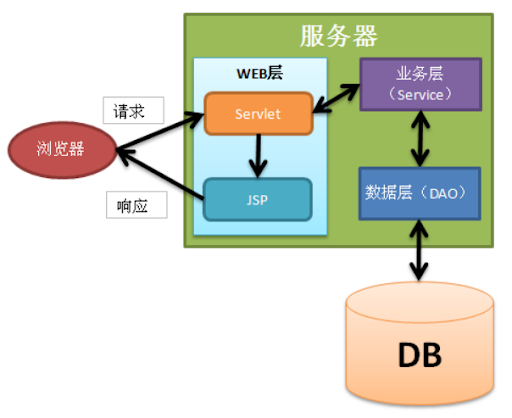

### 1.1 前言

**为啥web开发：**


- web，网页的意思，www.baidu.com

- 静态web

  - html，css，
  - 提供给所有人看的数据始终不会发生变化

- 动态web

- - 淘宝，几乎是所有的网站。

  - 提供给所有人看的数据始终会发生变化，每个人在不同的时间，在不同的地点看到的信息各不相同。
  - 技术栈：Servlet/JSP，ASP，PHP

在Java中，动态web资源开发的技术统称为JavaWeb

### 1.2 web应用程序

web应用程序：可以提供浏览器访问的程序；

- a.html、b.html.....多个web资源，这些web资源可以被外界访问，对外界提供服务；
- 访问到的任何一个页面或者资源，都存在于世界某一个角落的计算机上
- URL
- 这个统一的web资源会被放在同一个文件夹下，web应用程序-->Tomcat：服务器
- **一个web应用由多部分组成（静态web，动态web）**
  - **html，css，js**
  - **jsp，servlet**
  - **Java程序**
  - **jar包**
  - **配置文件（Properties）**

- web应用程序编写完毕后，若想提供给外界访问，需要一个服务器来统一管理

### 1.3 静态web

- *.htm, *.html，这些都是网页的后缀，如果服务器上一直存在这些东西，我们就可以直接读取


- 静态web存在的缺点
  - Web页面无法动态更新，所有用户看到都是同一页面
    - 轮播图，点击特效：微动态
    - JavaScript[实际开发中它用的最多
    - VBScript
  - 它无法和数据库交互（数据无法持久化，用户无法交互）

### 1.4 动态web

页面会动态展示："Web的页面展示效果因人而异";


缺点：

- 假如服务器的动态web资源出现错误，我们需要重新编写我们的**后台程序**，重新发布；
  - 停机维护

优点：

- Web页面可以动态更新，所有用户看到都不是同一页面
- 它可以与数据库交互（数据持久化：注册，商品信息，用户信息）

## 2-2、web服务器

**position:**

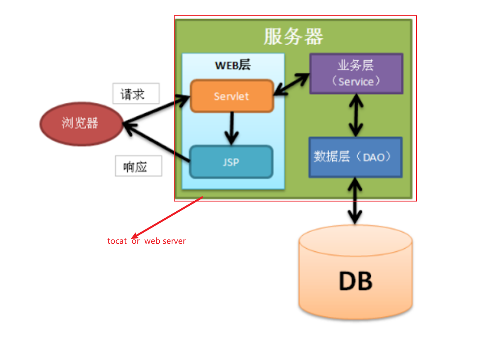

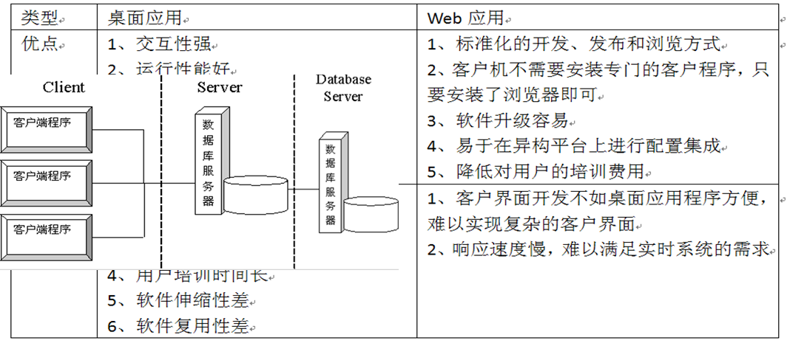

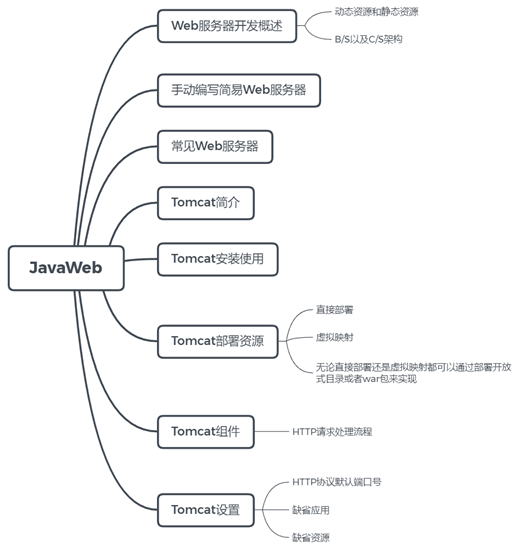

### 2.1 技术讲解

**常见web服务技术:**

ASP：

- 微软：国内最早流行
- 在HTML中嵌入了VB的脚本，ASP+COM；
- 在ASP开发中，基本一个页面都有几千行的业务代码，页面及其混乱
- 维护成高

```html
<html>	<head>	</head>    <body>        <h1>        </h1>        <h1>            <%               System.out.println("hello");              %>        </h1>    </body></html>
```

PHP：

- PHP开发速度很快，功能强大，跨平台，代码简单
- 无法承载大访问量的情况（局限性）

JSP/Servlet：

- B/S：浏览器和服务器
- C/S：客户端和服务器
  - sun公司主推的B/S架构
  - 基于java语言的（所有大公司，或者一些开源的组件，都是java写的）
  - 可以承载高并发、高可用、高性能问题带来的影响
  - 语法像ASP

**静态和动态**

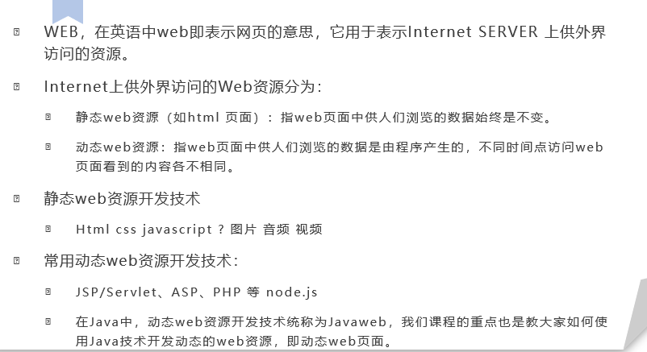

### 2.2 手动编写简易服务器(掌握实现原理)

1.需要持续去监听某个端口号，监听有无请求到来

2.当有请求到来时，我需要能够去解析出请求的意图，请求希望访问哪个资源文件，然后接下来将该文件给响应出去

```java
package com.cskaoyan.server;import java.io.IOException;import java.io.InputStream;import java.net.ServerSocket;import java.net.Socket;/** * 新建一个服务器程序 ServerSocket */public class MainServer {    public static void main(String[] args) {        try {            //创建了一个程序，监听着8090端口号            ServerSocket serverSocket = new ServerSocket(8090);            //该程序需要监听有没有程序发送请求过来，发送到当前机器的8090端口号            //这个socket就是连接进来的请求            //请求里面应当包含请求的信息，如何获取该部分信息呢？            //如果没有请求方连接进来，那么改行代码会一直阻塞等待            //你需要去做的事情，就是往当前机器的8090端口号发送请求            //可以发送任意类型的请求信息，也包含HTTP请求            Socket client = serverSocket.accept();            //获取请求方传递过来的数据，只需要将inputStream进行解析处理即可            //如果请求方发送的是文本请求信息，那么可以直接将该inputStream转成字符串            InputStream inputStream = client.getInputStream();            byte[] bytes = new byte[1024];            int length = inputStream.read(bytes);            String requestInfo = new String(bytes, 0, length);            System.out.println(requestInfo);        } catch (IOException e) {            e.printStackTrace();        }    }}
```

当前版本有没有问题？

```java
package com.cskaoyan.server;import java.io.IOException;import java.io.InputStream;import java.net.ServerSocket;import java.net.Socket;/** * 新建一个服务器程序 ServerSocket */public class MainServer2 {    public static void main(String[] args) {        try {            //创建了一个程序，监听着8090端口号            ServerSocket serverSocket = new ServerSocket(8090);            //该程序需要监听有没有程序发送请求过来，发送到当前机器的8090端口号            //这个socket就是连接进来的请求            //请求里面应当包含请求的信息，如何获取该部分信息呢？            //如果没有请求方连接进来，那么改行代码会一直阻塞等待            //你需要去做的事情，就是往当前机器的8090端口号发送请求            //可以发送任意类型的请求信息，也包含HTTP请求            while (true){                //主线程只负责去持续不断监听客户端连接进来                Socket client = serverSocket.accept();                //获取请求方传递过来的数据，只需要将inputStream进行解析处理即可                //如果请求方发送的是文本请求信息，那么可以直接将该inputStream转成字符串                new Thread(new Runnable() {                    @Override                    public void run() {                        InputStream inputStream = null;                        try {                            inputStream = client.getInputStream();                            byte[] bytes = new byte[1024];                            //这一步其实也是阻塞步骤，如果程序阻塞在read这步，那么如果有新的客户端连接进来，程序可以处理吗                            //改进的方式就是使用多线程,如何新建一个新线程？                            int length = inputStream.read(bytes);                            String requestInfo = new String(bytes, 0, length);                            System.out.println(requestInfo);                        } catch (IOException e) {                            e.printStackTrace();                        }                    }                }).start();            }        } catch (IOException e) {            e.printStackTrace();        }    }}
```

改进版可以解决很多阻塞问题。


比如浏览器输入http://localhost:8090/1.html    或者    http://localhost:8090/2.html

逻辑应该是怎么样的？

服务器应当去响应1.html的内容或者2.html的内容，

如果有的话，应当把文件的内容显示出来

如果没有的话，应当返回404状态码


应当分别去响应

```
GET **/1.html** HTTP/1.1Host: localhost:8090Connection: keep-alivesec-ch-ua: "Chromium";v="92", " Not A;Brand";v="99", "Google Chrome";v="92"sec-ch-ua-mobile: ?0Upgrade-Insecure-Requests: 1User-Agent: Mozilla/5.0 (Windows NT 10.0; Win64; x64) AppleWebKit/537.36 (KHTML, like Gecko) Chrome/92.0.4515.131 Safari/537.36Accept: text/html,application/xhtml+xml,application/xml;q=0.9,image/avif,image/webp,image/apng,*/*;q=0.8,application/signed-exchange;v=b3;q=0.9Sec-Fetch-Site: noneSec-Fetch-Mode: navigateSec-Fetch-User: ?1Sec-Fetch-Dest: documentAccept-Encoding: gzip, deflate, brAccept-Language: zh-CN,zh;q=0.9Cookie: Idea-31d5f4eb=af750744-2158-4f3c-bba9-e7eae63a38fd
```


```
GET **/2.html** HTTP/1.1Host: localhost:8090Connection: keep-alivesec-ch-ua: "Chromium";v="92", " Not A;Brand";v="99", "Google Chrome";v="92"sec-ch-ua-mobile: ?0Upgrade-Insecure-Requests: 1User-Agent: Mozilla/5.0 (Windows NT 10.0; Win64; x64) AppleWebKit/537.36 (KHTML, like Gecko) Chrome/92.0.4515.131 Safari/537.36Accept: text/html,application/xhtml+xml,application/xml;q=0.9,image/avif,image/webp,image/apng,*/*;q=0.8,application/signed-exchange;v=b3;q=0.9Sec-Fetch-Site: noneSec-Fetch-Mode: navigateSec-Fetch-User: ?1Sec-Fetch-Dest: documentAccept-Encoding: gzip, deflate, brAccept-Language: zh-CN,zh;q=0.9Cookie: Idea-31d5f4eb=af750744-2158-4f3c-bba9-e7eae63a38fd
```

接下来需要去做什么事情？


**request:**

封装对象,封装请求头和请求体.好拿到响应的消息.

```java
package main;import lombok.Data;import java.io.IOException;import java.io.InputStream;import java.net.Socket;import java.util.ArrayList;import java.util.HashMap;import java.util.List;import java.util.Map;/** * 类<code>Doc</code>用于：TODO * 将http请求报文拆解,放在成员变量中 * * @author 12824 * @version 1.0 * @date 2021-08-14 */@Datapublic class Requst {    private String method;    private String requestURL;    private String protocol;    private Map<String, String> requesHeaders = new HashMap<>();    /*请求体*/    public Requst(Socket cilent) {        /*获取请求的文本类型*/        /*解析*/        InputStream inputStream = null;        try {            inputStream = cilent.getInputStream();            /*读取输入流*/            byte[] bytes = new byte[1024];            //阻塞步骤, 新客户端连接就是阻塞队列            int read = inputStream.read(bytes);            final String requestInfo = new String(bytes, 0, read);            /*拆解请求行和请求头*/            parseRequestLine(requestInfo);        } catch (IOException e) {            e.printStackTrace();        }    }    /**     * 拆分请求行     *     * @param requestInfo 传递的消息     */    private void parseRequestLine(String requestInfo) {        /*第一次遇到\r\n*/        int index = requestInfo.indexOf("\r\n");        String requestLine = requestInfo.substring(0, index);        /*分隔空额*/        String[] parts = requestLine.split(" ");        this.method = parts[0];        this.requestURL = parts[1];        this.protocol = parts[2];    }    /**     * 如何解析请求头     * 请求头部分的特征：\r\n..........\r\n\r\n     *     * @param requestInfo     */    private void parseRequestHeaders(String requestInfo) {        int begin = requestInfo.indexOf("\r\n");        int end = requestInfo.indexOf("\r\n\r\n");        String headers = requestInfo.substring(begin + 2, end);        String[] parts = headers.split("\r\n");        for (String part : parts) {            //part 每个部分就代表了一行  也就是请求头的键值对            //再次利用：进行分割，分割出键和值            int i = part.indexOf(":");            //trim方法可以去掉字符串两端的空格            String key = part.substring(0, i).trim();            String value = part.substring(i + 1).trim();            this.requesHeaders.put(key, value);        }    }}
```


拿到请求资源

根据请求资源，然后到本地硬盘上面去找该文件是否存在，如果存在，则将文件的内容响应出去；如果不存在，则响应404


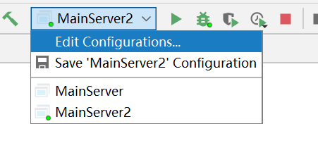


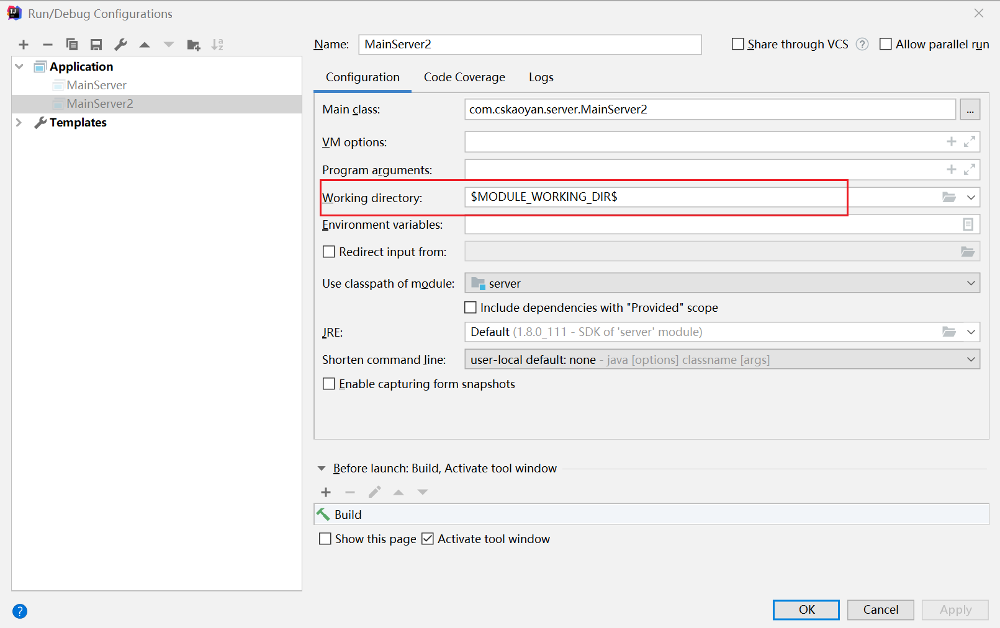

如果一个project下面设置了多个module，那么需要设置这么一个配置，如果不设置。那么工作目录指向的是project的目录，而不是当前module 的目录

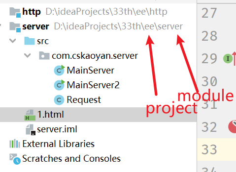

工作目录又和new File的相对路径是直接相关联的

```java
package com.cskaoyan.server;import java.io.*;import java.net.ServerSocket;import java.net.Socket;/** * 新建一个服务器程序 ServerSocket */public class MainServer2 {    public static void main(String[] args) {        try {            //创建了一个程序，监听着8090端口号            ServerSocket serverSocket = new ServerSocket(8090);            //该程序需要监听有没有程序发送请求过来，发送到当前机器的8090端口号            //这个socket就是连接进来的请求            //请求里面应当包含请求的信息，如何获取该部分信息呢？            //如果没有请求方连接进来，那么改行代码会一直阻塞等待            //你需要去做的事情，就是往当前机器的8090端口号发送请求            //可以发送任意类型的请求信息，也包含HTTP请求            while (true){                //主线程只负责去持续不断监听客户端连接进来                Socket client = serverSocket.accept();                //获取请求方传递过来的数据，只需要将inputStream进行解析处理即可                //如果请求方发送的是文本请求信息，那么可以直接将该inputStream转成字符串                new Thread(new Runnable() {                    @Override                    public void run() {                        Request request = new Request(client);                        //  /1.html   /2.html                        String reqeustURI = request.getReqeustURI();                        //相对的是什么路径？工作目录                        //这个地方的绝对路径 =  工作目录 + 里面的相对路径                        File file = new File(reqeustURI.substring(1));                        StringBuffer buffer = new StringBuffer();                        OutputStream outputStream = null;                        try {                            outputStream = client.getOutputStream();                            if(file.exists() && file.isFile()){                                //文件存在且文件不是目录，把该文件响应出去                                //client其实就是对于连接进来的客户端的封装                                //如果希望获取客户端提交过来的数据，那么使用client.getInputStream                                //如果希望向客户端返回数据，则使用client.getOutputStream                                //HTTP响应报文   响应行 响应头  响应体（文件的内容）                                // 按住alt + 鼠标                                FileInputStream fileInputStream = new FileInputStream(file);                                int length = 0;                                byte[] bytes = new byte[1024];                                buffer.append("HTTP/1.1 200 OK\r\n");                                buffer.append("Content-Type:text/html\r\n");                                buffer.append("\r\n");                                outputStream.write(buffer.toString().getBytes("utf-8"));                                while ((length = fileInputStream.read(bytes)) != -1){                                    outputStream.write(bytes, 0, length);                                }                                return;                            }                            //文件不存在，则返回404                            buffer.append("HTTP/1.1 404 Not Found\r\n");                            buffer.append("Content-Type:text/html\r\n");                            buffer.append("\r\n");                            buffer.append("<h1 style='color:red'>File Not Found</h1>");                            outputStream.write(buffer.toString().getBytes("utf-8"));                        } catch (IOException e) {                            e.printStackTrace();                        }finally {                            try {                                outputStream.close();                            } catch (IOException e) {                                e.printStackTrace();                            }                        }                    }                }).start();            }        } catch (IOException e) {            e.printStackTrace();        }    }}
```

### 2.2-2常见的静态web服务器

服务器的原理：其实就是将客户输入的网络路径进行解析，服务器需要在本地硬盘上面的指定路径去寻找该文件，最后响应出去。其实就是IO流，只不过此时不再是文件IO流


### 2.2-3 JavaEE规范：

是一个很大的范畴。指的是在企业开发过程中，为了方便企业级应用开发的方便，sun公司制定的一个标准。举例说明，假如希望获取当前请求报文的请求资源路径

选用A公司的服务器产品，A服务器将请求报文解析成了ARquest对象，设计了一套代码，从ARquest.getReqeustURI来获取请求资源路径


今后可能公司想更换服务器产品，更换成B服务器，B服务器将请求报文解析成了BRquest，获取请求资源路径的方法叫做BRquest.getResources()


之前已经写了一套获取请求资源路径的代码，此时由A产品变更到B产品，此时代码还能用吗？

不利于行业的发展，sun公司制定了一个标准。其中关于请求报文的封装这部分，制定了一个接口叫做ServletRequest，接口里面定义了一个方法叫做getRequestURI用来获取请求资源路径


各个不同服务器生产厂商全部都实现该接口

serveletRequest.getReqeustURI()

### 2.3 web服务器

> tomcat和nginx区别
>
> Web Server 的概念太宽泛了。
> 严格的来说，Apache/Nginx 应该叫做「HTTP Server」；而 Tomcat 则是一个「Application Server」，或者更准确的来说，是一个「Servlet/JSP」应用的容器（Ruby/Python 等其他语言开发的应用也无法直接运行在 Tomcat 上）。

#### 2.2.1**常用的 Web 服务**

**Tomcat**：由 Apache 组织提供的一种 Web 服务器，提供对 jsp 和 Servlet 的支持。它是一种轻量级的 javaWeb 容器（服务 器），也是当前应用最广的 JavaWeb 服务器（免费）。 

**Jboss**：是一个遵从 JavaEE 规范的、开放源代码的、纯 Java 的 EJB 服务器，它支持所有的 JavaEE 规范（免费）。 **GlassFish**： 由 Oracle 公司开发的一款 JavaWeb 服务器，是一款强健的商业服务器，达到产品级质量（应用很少）。 **Resin**：是 CAUCHO 公司的产品，是一个非常流行的服务器，对 servlet 和 JSP 提供了良好的支持， 性能也比较优良，resin 自身采用 JAVA 语言开发（收费，应用比较多）。

 **WebLogic**：是 Oracle 公司的产品，是目前应用最广泛的 Web 服务器，支持 JavaEE 规范， 而且不断的完善以适应新的开发要求，适合大型项目（收费，用的不多，适合大公司）。


服务器是一种被动的操作，用来处理用户的请求和给用户一些响应的信息；

**IIS:**

微软的;WIndows自带

**Tomcat:**

omcat 服务器是一个免费的开放源代码的Web 应用服务器，属于轻量级应用[服务器](https://baike.baidu.com/item/服务器)，在中小型系统和并发访问用户不是很多的场合下被普遍使用，是开发和调试JSP 程序的首选。对于一个初学者来说，可以这样认为，当在一台机器上配置好Apache 服务器，可利用它响应[HTML](https://baike.baidu.com/item/HTML)（[标准通用标记语言](https://baike.baidu.com/item/标准通用标记语言/6805073)下的一个应用）页面的访问请求。实际上Tomcat是Apache 服务器的扩展，但运行时它是独立运行的，所以当你运行tomcat 时，它实际上作为一个与Apache 独立的进程单独运行的。


> 配置404问题:https://blog.csdn.net/forever180/article/details/90292998


> 创建动态web项目
>
> Idea2020.2解决方法
>
> https://blog.csdn.net/qq_45738810/article/details/107842532
>
> 
>
> ​                  后续
>
> 
>
> IDEA 创建 动态 Web 项目的正确姿势
>
> 
>
> 来自 <https://www.javatt.com/p/2430> 

**Intellij IDEA** **中如何部署项目到** **Tomcat****？**

> 配置项目
>
> 
>
> 来自 <https://www.jianshu.com/p/0aca0d876319> 
>
> 
>
> https://www.jianshu.com/p/0aca0d876319

**Java****项目和Web项目的区别**

> | https://www.jianshu.com/p/3c330074082b | 从这篇文章可以看出 ，java 项目和 web 项目 结构不同 架构不同 入口 库等都不同 ，所以idea配置也不同 |
> | -------------------------------------- | ------------------------------------------------------------ |
> |                                        |                                                              |
>
> 相关链接：
>
> [Idea 2020.2 创建web](onenote:idea 教程.one#Idea 2020.2 创建web&section-id={AA8F9AC4-6214-4205-89C9-2E17F13715B3}&page-id={F5D8365D-0DDD-4774-9926-5201A03D765C}&end&base-path=https://d.docs.live.net/e790efa1a5ba307f/Documents/teach yousel computer science)

### 2.4、Tomcat


官网:  http://tomcat.apache.org/    

特别注意:tomcat**版本别太高,**不是后面会出现tomcat版本问题.一般**8.5**就可以了.

**model:**(model is think logic picture)

tomcat

#### 简介

Tomcat是在SUN公司推出的小型Servlet/JSP调试工具的基础上发展起来的一个优秀的Servlet容器，Tomcat本身完全用Java语言编写。目前是Apache开源软件组织的一个软件项目，它的官方网址为[http://tomcat.apache.org](http://tomcat.apache.org/)。得到了广大开源代码志愿者的大力支持，且可以和目前大部分的主流Web服务器(Apache服务器)一起工作，它运行稳定、可靠且高效。已成为目前开发企业JavaWeb应用的最佳Servlet容器选择之一。

我们后面的Java Web学习都是基于Tomcat服务器的。

#### 下载

link:•http://tomcat.apache.org

ü tar.gz文件是Linux操作系统下的安装版本

ü exe文件是Windows系统下的安装版本x86 x64

ü zip文件是Windows系统下的压缩版本 (建议)

**Tomcat 服务器和 Servlet 版本的对应关系**

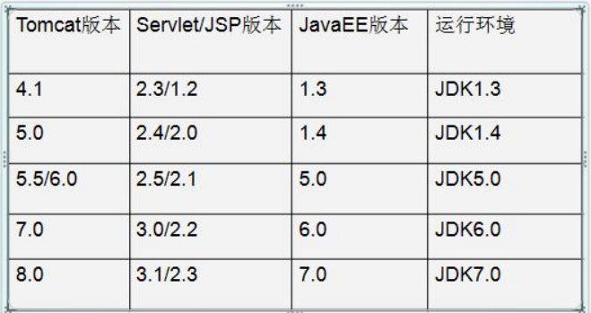


Servlet 程序从 2.5 版本是现在世面使用最多的版本（xml 配置） 到了 Servlet3.0 之后。就是注解版本的 Servlet 使用。 


- Tomcat的端口号：8080(本机设置后)
- mysql默认端口号：3306
- http：80
- https:443

**Tomcat目录结构**

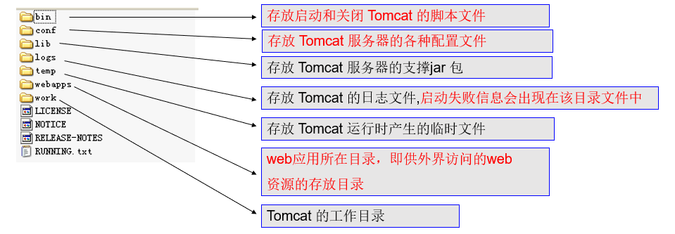

#### **启动**

**将包放在一个没有中文的路径,之后直接启动.**

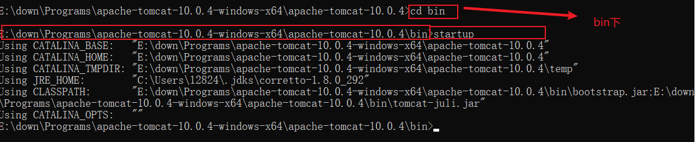

```
startup #启动
```

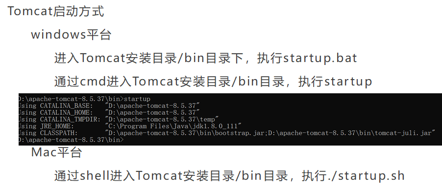


> **Tomcat**启动失败常见问题
>
> 1.端口号被占用（修改端口号即可）
>
> 2.启动过程一闪而过（一般是没有配置环境变量JAVA_HOME所致）

#### **Tomcat**停止

**windows平台**

进入Tomcat安装目录/bin目录下，执行

`shutdown.bat`

通过cmd进入Tomcat安装目录/bin目录，执行

`shutdown`

在Tomcat启动成功窗口执行

`ctrl + c`

**Mac平台**

通过shell进入Tomcat安装目录/bin目录，执行./shutdown.sh

#### **Tomcat**部署资源(掌握)

**什么是部署资源？**

**部署资源其实是服务器将本地的资源文件发布到网络上，供网络用户来访问。**所以用户输入一个网络路径，服务器需要识别出这个网路路径并在本地硬盘中找到对应的文件，响应给客户端。

**如何部署资源？**

在**Tomcat中最小的单元是应用**，如果希望部署一个资源文件，那么就**需要将该资源文件放置在一个应用中**。如何设置并部署应用呢？

**直接部署**

直接在Tomcat的webapps目录中**新建一个目录，该目录就是一个应用**，目录的名称就是应用的名称

**虚拟映射**

如果资源目录及文件没有放置在tomcat的webapp目录中，也希望可以部署，那么tomcat提供了虚拟映射，通过这种方式也可以访问到对应资源文件。

##### **直接部署**

**开放式目录**

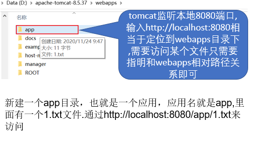

**war包**

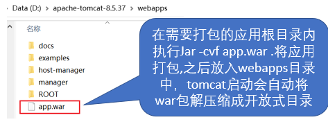

##### **虚拟映射**

虚拟映射就是**不需要将应用放在webapps目录下部署应用的方式.同样也可以用来部署开放式目录和war包**，这里不再赘述.以**开放式目录为例**来讲述.

1.开放目录:conf/Catalina/localhost目录下新增应用名.xml文件

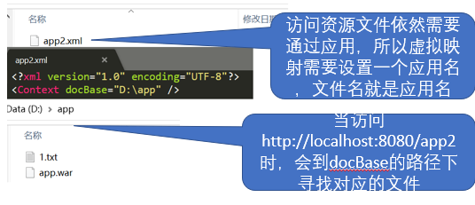

2.conf/server.xml文件Host节点新增Context节点

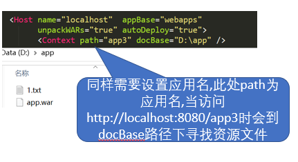

```xml
<Host name="localhost"  appBase="webapps"            unpackWARs="true" autoDeploy="true">            <!-- 配置 虚拟映射  -->            <Context path="app3" docBase="D:\app"/>
```

`tomcat最小单位是应用.`

**app2.xml** 

```xml
<?xml version="1.0" encoding="UTF-8"><Context docBase="path"/>
```

接下来访问http://localhost:8080/app2,就直接定位到了path路径下了.

> 未完成

##### 本质理解:

把握核心,将服务器的部署资源,其实就是**将用户输入的网路路径转换成本地硬盘路径**

所以,将文件防止在webapps里面还是外面,并没有多大影响.只是需要将文件路径响应出去就可以了.

**分析:**

直接部署如何拿到绝对路径?

文件放在webapps路径下,tomcat知道tocat的文件硬盘路径,只有在拼接网络路径path.就可以定位到绝对路径了.即

`E:\down\mark02-webPack\apache-tomcat-10.0.4-windows-x64\apache-tomcat-10.0.4\webapps\path`


**虚拟映射相似.**


#### tomcat 组件(掌握)


##### 架构


在conf/server.xml中,配置了 server service connector engine host等

```xml
 <Service name="Catalina">    <!--The connectors can use a shared executor, you can define one or more named thread pools-->    <!--    <Executor name="tomcatThreadPool" namePrefix="catalina-exec-"        maxThreads="150" minSpareThreads="4"/>    -->    <!-- A "Connector" represents an endpoint by which requests are received         and responses are returned. Documentation at :         HTTP Connector: /docs/config/http.html         AJP  Connector: /docs/config/ajp.html         Define a non-SSL/TLS HTTP/1.1 Connector on port 8080    -->
```

connector :

```xml
<Connector port="8080" protocol="HTTP/1.1"               connectionTimeout="20000"               redirectPort="8443" />    <!-- A "Connector" using the shared thread pool-->    <!--    <Connector executor="tomcatThreadPool"               port="8080" protocol="HTTP/1.1"               connectionTimeout="20000"               redirectPort="8443" />    -->
```

engine:


```xml
<Engine name="Catalina" defaultHost="localhost">  <!--For clustering, please take a look at documentation at:      /docs/cluster-howto.html  (simple how to)      /docs/config/cluster.html (reference documentation) -->  <!--  <Cluster className="org.apache.catalina.ha.tcp.SimpleTcpCluster"/>  -->
```

```xml
<host name="localhost"  appBase="webapps"            unpackWARs="true" autoDeploy="true">            <!-- 配置 虚拟映射  -->            <Context path="app3" docBase="D:\app"/>        <!-- SingleSignOn valve, share authentication between web applications             Documentation at: /docs/config/valve.html -->        <!--        <Valve className="org.apache.catalina.authenticator.SingleSignOn" />        -->
```

上面host重点.

#### http请求处理流程(掌握)

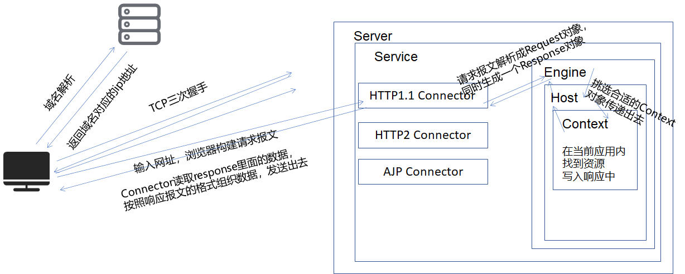

1. 浏览器内输入对应的网址，首先进行域名解析，拿到对应的ip地址
2. 进行三次TCP连接，建立一个可靠的连接
3. 浏览器构建请求报文，利用TCP、IP协议及网卡等硬件发送出去，在网络上一边中转一边传输
4. 到达目标服务器主机，被监听着指定端口的程序接收，也就是Tomcat的Connector
5. Connector将请求报文进行解析成Request对象，同时生成一个Response对象
6. Connector将两个对象传递给Engine
7. Engine挑选Host，将两个对象传给Host，Host进而挑选合适的Context传递对象
8. 在Context内寻找合适的资源，找到则将资源写入Response中，找不到则向Response中写入未找到信息
9. Request和Response对象依次返回，直至返回给Connector
10. Connector读取Response里面的数据，按照响应报文的格式组织数据
11. 响应报文利用TCP、IP协议及网卡等硬件设备发送出去，在网络上一边中转一边传输
12. 响应报文到达客户端，客户端读取响应报文里面的内容，对其进行解析，渲染，呈现出页面里面的内容


#### 伪代码实现:

```
Connector {
    
    
    request
    response
        
        
    engine(request,response)
        
   //读取response里面的数据
    
    
}


engine{
    
    host(request,response);
    
}

host{
    
    Context(request,response);
}

```


#### tomcat设置(掌握)

**缺省端口**

前1024个端口号一般都是操作系统在使用，只有一个特殊的80端口号是给HTTP协议预留的，所以如果使用http协议访问却没有指明端口号，那么使用的便是80端口号，比如http://localhost/app/1.txt

**conf/server.xml:**

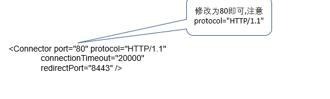

**缺省应用**

Tomcat的webapps目录下的大多数目录里面的资源都可以通过/应用名/资源路径方式访问到，唯独ROOT应用下的资源通过这种方式访问不到，访问时直接去掉应用名即可

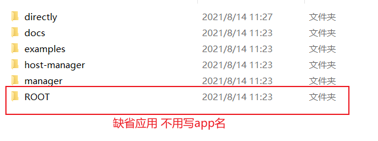

访问的时候直接是http://localhost/1.txt就是访问ROOT应用下的1.txt，千万不要写成http://localhost/ROOT/1.txt哦

如何设置ROOT应用?

1. 直接部署
2. 在 conf/Catalina/localhost 下新增 ROOT.xml文件即可.


**缺省资源**

细心的同学可能发现当输入如下网址比如http://localhost/manager，其中manager是一个应用但是这里面并没有指出访问哪个资源文件，那么页面显示的是哪个文件呢？

```xml
<!-- ==================== Default Welcome File List ===================== -->  <!-- When a request URI refers to a directory, the default servlet looks  -->  <!-- for a "welcome file" within that directory and, if present, to the   -->  <!-- corresponding resource URI for display.                              -->  <!-- If no welcome files are present, the default servlet either serves a -->  <!-- directory listing (see default servlet configuration on how to       -->  <!-- customize) or returns a 404 status, depending on the value of the    -->  <!-- listings setting.                                                    -->  <!--                                                                      -->  <!-- If you define welcome files in your own application's web.xml        -->  <!-- deployment descriptor, that list *replaces* the list configured      -->  <!-- here, so be sure to include any of the default values that you wish  -->  <!-- to use within your application.                                       --><!-- 默认加载资源 -->    <welcome-file-list>        <welcome-file>index.html</welcome-file>        <welcome-file>index.htm</welcome-file>        <welcome-file>index.jsp</welcome-file>    </welcome-file-list>
```

#### **高难度面试题**

请你谈谈网站是如何进行访问的？

1. 输入一个域名；回车

2. 检查本机的C:\Windows\System32\drivers\etc\hosts配置文件下有没有这个域名的映射

   1.有：直接返回对应的IP地址，这个地址中，有我们需要的web程序，可以直接访问

   ```java
   127.0.0.1		www.test.com
   ```

   2.没有：去DNS服务器找，找到返回，找不到报错

### 补充: 发布一个web网站

- 将自己写的网站，放到服务器(Tomcat)中指定的web应用的文件夹（webapps）下，就可以访问了网站应该有的结构

**目录:**

```
--webapps : Tomcat服务器的web目录
    -ROOT
    -kritostudy : 网站的目录名
    	-WEB-INF
    		-classes : java程序
            	-lib : web应用所依赖的jar包
    		-web.xml : 网站配置文件
    	-index.html默认的首页
        -static
        	-css
                -style.css
           	-js
            -img
```

>   Tomcat  问题
>
>   [404问题](onenote:#404问题&section-id={D050B9B8-9162-4291-A7DA-FC7E10A40523}&page-id={85DE1E43-B7BF-4F93-A03A-1F555C1D02D7}&end&base-path=https://d.docs.live.net/e790efa1a5ba307f/Documents/teach yousel computer science/xml and tomcat.one) 
>
>   [创建动态web项目](onenote:#创建动态web项目&section-id={D050B9B8-9162-4291-A7DA-FC7E10A40523}&page-id={98841978-B7AC-4B0C-8C68-7704494032CD}&end&base-path=https://d.docs.live.net/e790efa1a5ba307f/Documents/teach yousel computer science/xml and tomcat.one) 
>
>   [Intellij   IDEA 中如何部署项目到 Tomcat？](onenote:#Intellij IDEA 中如何部署项目到 Tomcat？&section-id={D050B9B8-9162-4291-A7DA-FC7E10A40523}&page-id={BF463AC2-54FA-44AF-BB50-5B126ACDD794}&end&base-path=https://d.docs.live.net/e790efa1a5ba307f/Documents/teach yousel computer science/xml and tomcat.one)  

