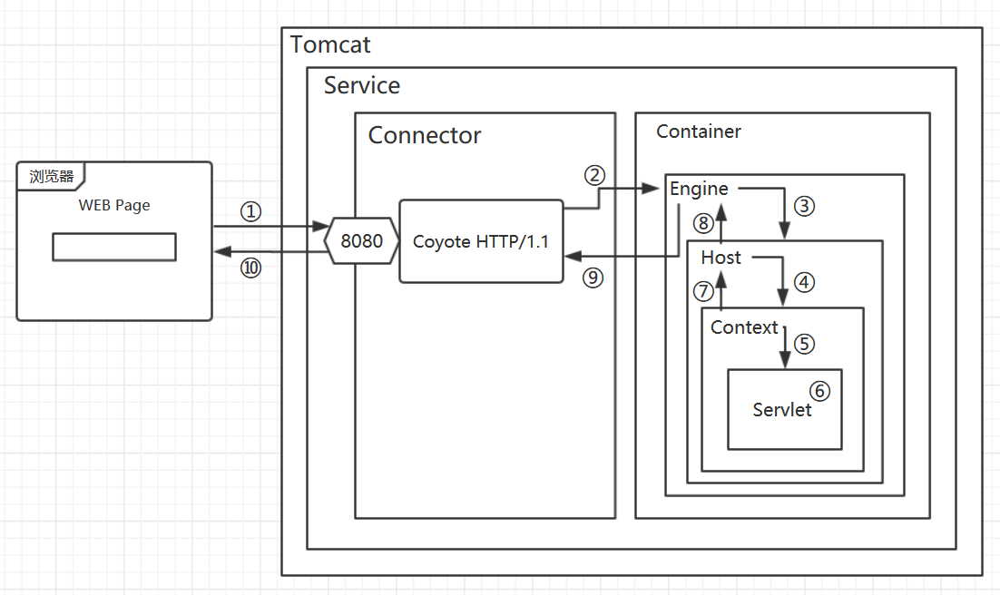
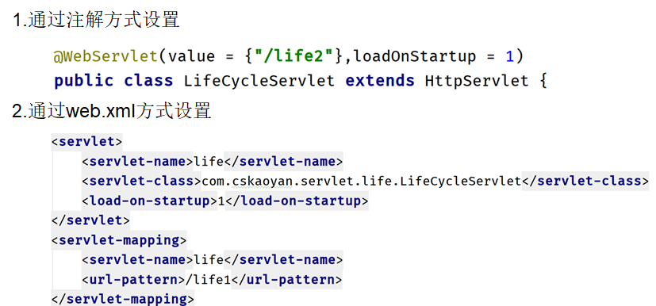
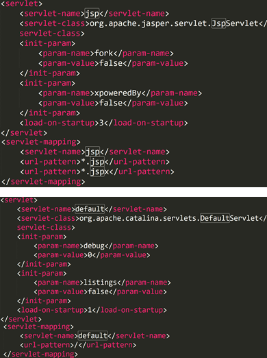
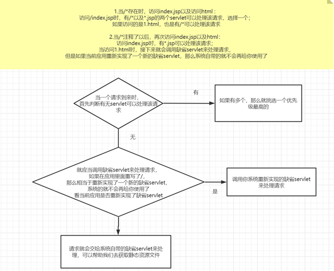
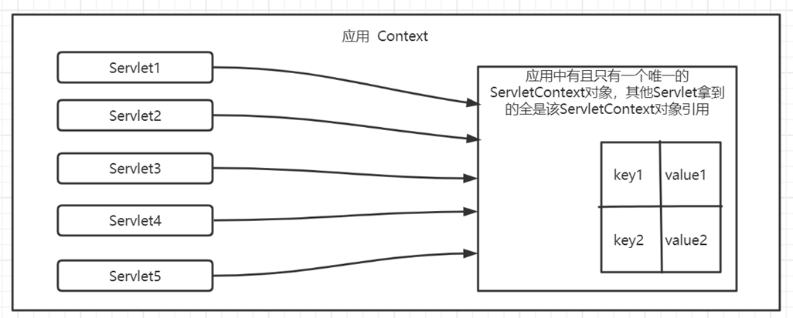
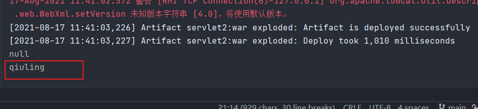

[TOC]


#  Servlet(掌握)

code:https://github.com/ytwotap/Web

官方 doc:https://docs.oracle.com/javaee/7/api/javax/servlet/Servlet.html

model:



## 概述

Servlet =  Server + applet。运行在服务器上面的一个小程序。

功能用来开发动态web资源，比如刷新浏览器，时刻显示最新的时间，比如每个用户登录，都会显示出对应的用户名。


如何去开发呢？

如果大家在今后的工作中如果遇到一个新的问题，如何去学习？

最好的方式就是看官方文档。

http://tomcat.apache.org/tomcat-8.5-doc/servletapi/

> doc:
>
> A servlet is a small Java program that runs within a Web server. Servlets receive and respond to requests from Web clients, usually across HTTP, the HyperText Transfer Protocol.
>
> To implement this interface, you can write a generic servlet that extends `javax.servlet.GenericServlet` or an HTTP servlet that extends `javax.servlet.http.HttpServlet`.

**把实现了Servlet接口的Java程序叫做------Servlet**

## 手动编写Servlet（一定要去写一遍）

**1.实现Servlet接口**

**编写：**

```java
import javax.servlet.*;


public class FirstServlet extends GenericServlet{
	
	public void service(ServletRequest req,ServletResponse res)throws ServletException,java.io.IOException{
		System.out.println("servlet");
	}
}
```

**编译：**


原因在哪？

jar包没有找到。在内存中没有这个jar包。为什么我们之前写SE阶段的代码时没有遇到这个问题呢？

原因其实在于javax.servlet的包不在jdk中。SE    EE

为什么在jdk里面就可以找得到，不在jdk里面就找不到呢？

涉及到了类加载的概念

无论是jdk里面的类，还是第三方的类，其实全部都是在硬盘上面的，但是运行的时候又要求这些类在内存中才可以正常运行。

硬盘上面的类如何加载到内存中的呢？其实就是有类加载器来完成的。

类加载器负责将硬盘上面的类加载到内存中。既然SE阶段我们使用jdk中的类没有任何问题，那就说明了有类加载器可以将jdk中的类加载到内存中。

大体可以分为三类：

1.BootStrap类加载器：负责加载jdk的一些核心类库到内存中

2.Extension类加载器：负责加载ext目录下的而一些类库到内存中

3.System类加载器：负责将classpath下的类库加载到内存中（-classpath  xxx.jar这种方式，可以将第三方的jar包加载到内存中）

**javac -classpath xxx.jar FirstServlet.java**


**运行：**


这个又是因为什么原因？

java程序的执行入口是main方法。

Servlet是无法单独运行的，必须放置在tomcat中才可以运行。


**2.将servlet部署到服务器中**

部署方式：直接部署、虚拟映射

然后执行通过http://localhost/servlet1/FirstServlet.class访问，发现文件被下载下来了？这种方式对吗？

不对。

1.直接被下载，而不是执行、运行

2.服务器上面的源代码文件能够被客户端直接下载到，没有任何安全性可言


针对问题2，我们做如下事情，在应用的根目录下，设置一个WEB-INF目录，该目录可以用来屏蔽浏览器的直接访问，也就是说任何文件只要放在WEB-INF目录下，那么都不可以被浏览器直接访问到。保障服务器源代码的安全。


今后参加工作，领导带着你去见客户，领导不想喝酒，但是想让你去陪客户喝酒，领导给你说了一个暗号，我一摸鼻子，你就要给客户敬酒


做了一个暗号，当访问/servlet1的时候，服务器就知道你想去访问当前FirstServlet，所以接下来就会执行FirstServlet

该暗号的配置有如下要求：

**class文件必须要放置在WEB-INF/classes目录下（里面存放全类名）**

**如果今后有jar包，那么需要放置在WEB-INF/lib目录下（暂时没有）**

**还需要有一个web.xml文件**


```xml
<?xml version="1.0" encoding="UTF-8"?>
<!--
 Licensed to the Apache Software Foundation (ASF) under one or more
  contributor license agreements.  See the NOTICE file distributed with
  this work for additional information regarding copyright ownership.
  The ASF licenses this file to You under the Apache License, Version 2.0
  (the "License"); you may not use this file except in compliance with
  the License.  You may obtain a copy of the License at

      http://www.apache.org/licenses/LICENSE-2.0

  Unless required by applicable law or agreed to in writing, software
  distributed under the License is distributed on an "AS IS" BASIS,
  WITHOUT WARRANTIES OR CONDITIONS OF ANY KIND, either express or implied.
  See the License for the specific language governing permissions and
  limitations under the License.
-->
<web-app xmlns="http://xmlns.jcp.org/xml/ns/javaee"
  xmlns:xsi="http://www.w3.org/2001/XMLSchema-instance"
  xsi:schemaLocation="http://xmlns.jcp.org/xml/ns/javaee
                      http://xmlns.jcp.org/xml/ns/javaee/web-app_3_1.xsd"
  version="3.1"
  metadata-complete="true">

  <servlet>
    <servlet-name>first</servlet-name>
    <servlet-class>FirstServlet</servlet-class>
    
  </servlet>
  
  <servlet-mapping>
    <servlet-name>first</servlet-name>
      <url-pattern>/servlet1</url-pattern>
  </servlet-mapping>

</web-app>

```

我们希望在页面中可以显示出时间

服务器需要将时间放置在响应报文的响应体中

res.getWriter().println(new Date());


## Servlet执行原理


以访问http://localhost/app/servlet1为例

1.浏览器地址栏输入当前地址，进行域名解析，TCP三次握手，发送HTTP请求报文，到达目标机器

2.HTTP请求报文到达目标机器之后被监听80端口号的Connector程序接收到，将请求报文进行解析成request对象，同时提供一个response对象

3.这两个对象被传给engine，engine挑选一个合适的host，默认就是localhost，将这两个对象进行进一步下发

4.host去挑选一个合适的Context，将这两个对象进行下发，会去寻找一个叫做/app的应用

5.这两个对象传给/app的应用之后，（当前应用拿到的路径有效部分为/servlet1），根据servlet配置的url-pattern和servlet-class的映射关系，去查找有没有配置响应的servlet  （/servlet1-------FirstServlet）

6.根据url-pattern拿到对应的servlet-class，**接下来会利用反射去实例化该对象，紧接着会调用该对象的service方法**，service方法恰好需要两个参数request、response，所以在执行该service方法的时候，传递过来的request、response对象会作为参数传递过去，service方法执行，往response里面写入数据

7.Context执行完毕之后，Connector会读取response里面的数据，然后按照HTTP/1.1 响应报文的格式要求，生成响应报文，然后再次返回给客户端。

8.客户端拿到响应报文之后，会读取响应报文的响应体，将响应体的内容渲染呈现在浏览器的主窗口界面


## 反射复习

```java
package com.cskaoyan.server.reflection;

public class Student {

    public void say(){
        System.out.println("I am li lei");
    }
}
```

```java
package com.cskaoyan.server.reflection;

import java.lang.reflect.InvocationTargetException;
import java.lang.reflect.Method;

public class StudentTest {

    public static void main(String[] args) throws ClassNotFoundException, IllegalAccessException, InstantiationException, NoSuchMethodException, InvocationTargetException {
        //尝试利用反射来让say方法执行
        Class<?> aClass = Class.forName("com.cskaoyan.server.reflection.Student");
        // 这个object其实就是一个student对象
        Object o = aClass.newInstance();
        //拿到该对象的say方法
        Method say = aClass.getMethod("say");
        //调用say方法
        say.invoke(o);
    }
}
```

## 使用IDEA开发Servlet

建议大家一定要自己手动去编写Servlet，对于你理解servlet的流程很有帮助。

自己手动开发有很多事情需要自己去完成的，并且这部分工作都是重复性的，所以可以利用工具来简化，使用IDEA开发Servlet


编写完Servlet之后，接下来


如果希望设置应用名为ROOT，那么设置/即可

最后点击debug按钮运行即可。


之后编写代码，编写完之后，如果希望代码能够生效，这个时候可以不用重启服务器


再次选择刚刚选择的debug模式，会弹出一个对话框

1.更新静态资源文件

2.更新class文件以及静态资源文件

3.重新部署

4.重启服务器

程度是逐渐加深的。方便大家记忆建议大家每次都选择第三个。


## 开发Servlet的方式二

1.编写类实现Servlet接口（1.继承GenericServlet   **2.继承HttpServlet**）


 A subclass of `HttpServlet` must override at least one method, usually one of these:

- `doGet`, if the servlet supports HTTP GET requests
- `doPost`, for HTTP POST requests
- `doPut`, for HTTP PUT requests
- `doDelete`, for HTTP DELETE requests
- `init` and `destroy`, to manage resources that are held for the life of the servlet
- `getServletInfo`, which the servlet uses to provide information about itself


```java
package com.cskaoyan.servlet;

import javax.servlet.ServletException;
import javax.servlet.http.HttpServlet;
import javax.servlet.http.HttpServletRequest;
import javax.servlet.http.HttpServletResponse;
import java.io.IOException;

public class SecondServlet extends HttpServlet {

    /**
     * 当以get请求访问当前servlet时，会进入到doGet方法中
     * @param req
     * @param resp
     * @throws ServletException
     * @throws IOException
     */
    @Override
    protected void doGet(HttpServletRequest req, HttpServletResponse resp) throws ServletException, IOException {
        //super.doGet(req, resp);
        System.out.println("doget");
    }

    /**
     * 当以post方法访问当前servlet时，会进入到doPost方法中
     * @param req
     * @param resp
     * @throws ServletException
     * @throws IOException
     */
    @Override
    protected void doPost(HttpServletRequest req, HttpServletResponse resp) throws ServletException, IOException {
        //super.doPost(req, resp);
        System.out.println("doPost");
    }
}
```

如何验证？

需要一个form表单，分别使用get方法和post方法向当前servlet发送请求

直接在浏览器地址栏输入servlet的地址，那么就是以get方法访问当前servlet


post：

新建一个form.html

```html
<!DOCTYPE html>
<html lang="en">
<head>
    <meta charset="UTF-8">
    <title>Title</title>
</head>
<body>
    <form action="http://localhost/app2/servlet2" method="post">
        <input type="submit">
    </form>
</body>
</html>
```

接下来怎么做？

先访问form.html,点击submit提交按钮，会向servlet发起post请求


## 问题：为什么继承HttpServlet没有service方法

service方法是Servlet接口中定义的，那么所有servlet都应当有该方法

因为父类已经实现好了

反复强调一点：**servlet的service方法是程序的执行入口**。

```java
public void service(ServletRequest req, ServletResponse res) throws ServletException, IOException {
    HttpServletRequest request;
    HttpServletResponse response;
    try {
        request = (HttpServletRequest)req;
        response = (HttpServletResponse)res;
    } catch (ClassCastException var6) {
        throw new ServletException("non-HTTP request or response");
    }

    this.service(request, response);
}
```

接下来，在自身的service方法中，做了如下逻辑：

**首先先判断请求方法是啥，如果方法是get，那么会调用doGet方法**

**如果是post方法，那么会调用doPost方法**

继承HttpServlet的执行逻辑：

**程序入口一定是service方法，接下来，会进一步根据请求方法的不同，分发到不同的doXX方法中**

There's almost no reason to override the `service` method.

为什么没有必要在继承HttpServlet时，重写service方法


为什么要分发到不同的方法中呢？比如doGet和doPost？

可以更加精细化。比如登录仅允许使用post方法，那么代码逻辑就写在doPost中，如果提交的是get方法，那么就不会有任何响应。


## 开发Servlet方式三

可以针对servlet的配置做一些改变，比如之前使用web.xml方式进行配置，还可以使用注解来进行配置

```java
package com.cskaoyan.servlet;

import javax.servlet.ServletException;
import javax.servlet.annotation.WebServlet;
import javax.servlet.http.HttpServlet;
import javax.servlet.http.HttpServletRequest;
import javax.servlet.http.HttpServletResponse;
import java.io.IOException;
//@WebServlet(name = "third", urlPatterns = "/servlet3")
//该注解还可以进一步简化，将name属性去掉
//@WebServlet(urlPatterns = "/servlet3")
//还可以进一步简化，如果注解内就只有一个值，那么默认情况下表示的就是url-pattern的值
//value和urlPattern表示的是同一个含义
@WebServlet("/servlet3")
//@WebServlet(value = "/servlet3",loadOnStartup = )
public class ThirdServlet extends HttpServlet {

    @Override
    protected void doGet(HttpServletRequest req, HttpServletResponse resp) throws ServletException, IOException {
        System.out.println("third doget");
    }

    @Override
    protected void doPost(HttpServletRequest req, HttpServletResponse resp) throws ServletException, IOException {

    }
}
```

## IDEA如何和tomcat关联在一起

idea和tomcat整合以后，帮助我们部署了资源

如何部署的？

直接部署、虚拟映射

在本地安装的tomcat中均没有发现部署的痕迹。


介绍一个变量地址


CATALINA_BASE:         C:\Users\song\.IntelliJIdea2019.3\system\tomcat\Unnamed_servlet_6

这个地方，你可以理解为idea会复制tomcat的配置文件过来，**在此处利用这些配置文件，重新开启一个新的tomcat实例对象，利用这个新的tomcat来部署资源（过程了解即可）**


在该处conf/Catalina/localhost目录下，发现了应用名.xml文件。

```xml
<Context path="/app2" docBase="D:\ideaProjects\33th\servlet\out\artifacts\servlet_war_exploded" />
```


可以发现：

开发环境中的web目录里面的文件会复制到部署根目录中

开发环境中的src目录下的源代码文件，经过编译之后，也会到部署根目录WEB-INF/classes目录下


其实中间是存在着一个复制规则的。


结论：

开发环境其实和最终的部署根目录不是一个地方。如果在开发时，在web目录中新建了一个静态资源页面，那么访问的时候显示404，那么一定要记得去部署根目录里面确认一下，凡是最终都要以部署根目录里面的文件为准。

如果开发环境的web目录中有，但是部署根目录里面没有，那么需要做如下设置


1.重新部署  redeploy按钮

如果该方式不行，那么执行

2.rebuild project，然后再次执行操作1

如果还是不行，那么将部署根目录全部删除，然后再次执行2，再次执行1


## 将SE项目改造成EE项目（多写几遍）


## Servlet的生命周期

生命周期函数。从出生到死亡整个过程。

This interface defines methods to initialize a servlet, to service requests, and to remove a servlet from the server. These are known as life-cycle methods and are called in the following sequence:

1. The servlet is constructed, then initialized with the `init` method.
2. Any calls from clients to the `service` method are handled.
3. The servlet is taken out of service, then destroyed with the `destroy` method, then garbage collected and finalized.

In addition to the life-cycle methods, this interface provides the `getServletConfig` method, which the servlet can use to get any startup information, and the `getServletInfo` method, which allows the servlet to return basic information about itself, such as author, version, and copyright.


init：当servlet被创建出来的时候，会调用init方法来完成一些初始化工作。


**service：客户端的请求都会交给service方法来处理。service方法是servlet程序执行入口。很重要。**


destroy：当servlet被销毁的时候，会调用该方法来销毁。


**有什么用呢？**

在servlet的执行阶段会触发该方法，如果恰好你也需要在该阶段去做一些事情，那么你可以把代码逻辑写到对应的生命周期函数中。比如你希望在servlet的初始化时做一些算法、预加载、JDBC操作，那么就可以把代码逻辑写在init方法中；比如你希望在servlet被销毁之前，将一些数据保存到硬盘上面，那么你可以在destroy方法中写入一些持久化相关代码逻辑。


**这三个方法分别会在什么时候触发呢？**

```java
package com.cskaoyan.servlet.life;

import javax.servlet.ServletException;
import javax.servlet.annotation.WebServlet;
import javax.servlet.http.HttpServlet;
import javax.servlet.http.HttpServletRequest;
import javax.servlet.http.HttpServletResponse;
import java.io.IOException;

/**
 * 注意：继承HttpServlet没有service方法
 * 那么doGet和doPost放在一起，可以当做service方法来看待
 */
@WebServlet(value = "/life",loadOnStartup = 1)
public class LifeCycleServlet extends HttpServlet {

    /**
     * 只有在第一次访问当前servlet时，才会执行
     * servlet被创建出来之后，然后执行init完成初始化
     * servlet只被创建出来一个对象（单例：一个class只有一个对象）
     * 既然只有一个对象，多个请求访问时有没有安全问题？
     * 如果没有设置成员变量，一般是没有问题的
     * 还有一点补充：
     * init还可以设置一个参数load-on-startup设置非负数，随着应用的加载而执行
     * 执行的时机会稍微提前一些，原先没有设置或者设置的是负数（第一次访问时执行）
     * @throws ServletException
     */
    @Override
    public void init() throws ServletException {
        System.out.println("servlet被创建，做一些初始化算法操作");
    }

    protected void doPost(HttpServletRequest request, HttpServletResponse response) throws ServletException, IOException {

    }

    /**
     * 客户端每次访问当前servlet，都会触发service方法
     * @param request
     * @param response
     * @throws ServletException
     * @throws IOException
     */
    protected void doGet(HttpServletRequest request, HttpServletResponse response) throws ServletException, IOException {
        System.out.println("客户端访问了当前servlet");
    }

    /**
     * 应用被卸载、服务器被销毁
     */
    @Override
    public void destroy() {
        System.out.println("servle将要被销毁，将关键数据持久化到硬盘上面");
    }
}
```

其中对于init()，默认情况下为第一次访问当前servlet之前会调用，但是可以设置一个load-on-startup参数为一个非负数，这样init()会随着应用的加载而执行。




## url-pattern(重点)

### 1 web.xml配置问题

1.由于客户端是通过URL地址访问web服务器中的资源，Servlet也不可能像普通静态资源一样直接访问，即便直接访问class文件也是下载该文件。所以Servlet程序若想被外界访问，必须把servlet程序映射到一个URL地址上，这个工作在web.xml文件中使用<servlet>元素和<servlet-mapping>元素完成(或者注解)。

2.<servlet>元素用于注册Servlet，它包含有两个主要的子元素：<servlet-name>和<servlet-class>，分别用于设置Servlet的注册名称和Servlet的完整类名。

3.一个<servlet-mapping>元素用于映射一个已注册的Servlet的一个对外访问路径，它包含有两个子元素：<servlet-name>和<url-pattern>，分别用于指定Servlet的注册名称和Servlet的对外访问路径。

### servlet与url-pattern关系

1.一个Servlet可以设置多个Url-pattern

2.多个Servlet不可以设置同一个Url-pattern 

3.Servlet的Url-pattern写法只有/xxxxx和*.xxx这两种方式是有效的。比如/abc/*、*.do等。其中*表示匹配任意字符。

> 其中2和3的报错信息一定要学会自己分析

### url-pattern优先级

结论：

1.  /开头的 优先级要高于*.后缀
2. 如果都是/开头，那么匹配程度越高，越优先执行


### url-pattern合法写法

**url-pattern的合法写法有哪些呢？**

只有两种写法，一种是/xxxxx，还有一种是*.xxxxx，除此之外的写法全部都是非法的、

反面教材：

比如叫做  servlet2，一定要/开头，否则启动过程会报错

**大家需要做的事情，就是晚上自己主动去复现该错误，看看能否找到错误信息**

````
org.apache.catalina.LifecycleException: Failed to start component [StandardEngine[Catalina].StandardHost[localhost].StandardContext[/app2]]
	at org.apache.catalina.util.LifecycleBase.start(LifecycleBase.java:167)
	at org.apache.catalina.core.ContainerBase.addChildInternal(ContainerBase.java:754)
	at org.apache.catalina.core.ContainerBase.addChild(ContainerBase.java:730)
	at org.apache.catalina.core.StandardHost.addChild(StandardHost.java:734)
	at org.apache.catalina.startup.HostConfig.manageApp(HostConfig.java:1736)
	at sun.reflect.NativeMethodAccessorImpl.invoke0(Native Method)
	at sun.reflect.NativeMethodAccessorImpl.invoke(NativeMethodAccessorImpl.java:62)
	at sun.reflect.DelegatingMethodAccessorImpl.invoke(DelegatingMethodAccessorImpl.java:43)
	at java.lang.reflect.Method.invoke(Method.java:498)
	at org.apache.tomcat.util.modeler.BaseModelMBean.invoke(BaseModelMBean.java:300)
	at com.sun.jmx.interceptor.DefaultMBeanServerInterceptor.invoke(DefaultMBeanServerInterceptor.java:819)
	at com.sun.jmx.mbeanserver.JmxMBeanServer.invoke(JmxMBeanServer.java:801)
	at org.apache.catalina.mbeans.MBeanFactory.createStandardContext(MBeanFactory.java:483)
	at org.apache.catalina.mbeans.MBeanFactory.createStandardContext(MBeanFactory.java:432)
	at sun.reflect.NativeMethodAccessorImpl.invoke0(Native Method)
	at sun.reflect.NativeMethodAccessorImpl.invoke(NativeMethodAccessorImpl.java:62)
	at sun.reflect.DelegatingMethodAccessorImpl.invoke(DelegatingMethodAccessorImpl.java:43)
	at java.lang.reflect.Method.invoke(Method.java:498)
	at org.apache.tomcat.util.modeler.BaseModelMBean.invoke(BaseModelMBean.java:300)
	at com.sun.jmx.interceptor.DefaultMBeanServerInterceptor.invoke(DefaultMBeanServerInterceptor.java:819)
	at com.sun.jmx.mbeanserver.JmxMBeanServer.invoke(JmxMBeanServer.java:801)
	at com.sun.jmx.remote.security.MBeanServerAccessController.invoke(MBeanServerAccessController.java:468)
	at javax.management.remote.rmi.RMIConnectionImpl.doOperation(RMIConnectionImpl.java:1468)
	at javax.management.remote.rmi.RMIConnectionImpl.access$300(RMIConnectionImpl.java:76)
	at javax.management.remote.rmi.RMIConnectionImpl$PrivilegedOperation.run(RMIConnectionImpl.java:1309)
	at java.security.AccessController.doPrivileged(Native Method)
	at javax.management.remote.rmi.RMIConnectionImpl.doPrivilegedOperation(RMIConnectionImpl.java:1408)
	at javax.management.remote.rmi.RMIConnectionImpl.invoke(RMIConnectionImpl.java:829)
	at sun.reflect.GeneratedMethodAccessor35.invoke(Unknown Source)
	at sun.reflect.DelegatingMethodAccessorImpl.invoke(DelegatingMethodAccessorImpl.java:43)
	at java.lang.reflect.Method.invoke(Method.java:498)
	at sun.rmi.server.UnicastServerRef.dispatch(UnicastServerRef.java:324)
	at sun.rmi.transport.Transport$1.run(Transport.java:200)
	at sun.rmi.transport.Transport$1.run(Transport.java:197)
	at java.security.AccessController.doPrivileged(Native Method)
	at sun.rmi.transport.Transport.serviceCall(Transport.java:196)
	at sun.rmi.transport.tcp.TCPTransport.handleMessages(TCPTransport.java:568)
	at sun.rmi.transport.tcp.TCPTransport$ConnectionHandler.run0(TCPTransport.java:826)
	at sun.rmi.transport.tcp.TCPTransport$ConnectionHandler.lambda$run$0(TCPTransport.java:683)
	at java.security.AccessController.doPrivileged(Native Method)
	at sun.rmi.transport.tcp.TCPTransport$ConnectionHandler.run(TCPTransport.java:682)
	at java.util.concurrent.ThreadPoolExecutor.runWorker(ThreadPoolExecutor.java:1142)
	at java.util.concurrent.ThreadPoolExecutor$Worker.run(ThreadPoolExecutor.java:617)
	at java.lang.Thread.run(Thread.java:745)
**Caused by: java.lang.IllegalArgumentException: Invalid <url-pattern> [abc] in servlet mapping**
	at org.apache.catalina.core.StandardContext.addServletMappingDecoded(StandardContext.java:3217)
	at org.apache.catalina.core.StandardContext.addServletMappingDecoded(StandardContext.java:3204)
	at org.apache.catalina.startup.ContextConfig.configureContext(ContextConfig.java:1376)
	at org.apache.catalina.startup.ContextConfig.webConfig(ContextConfig.java:1156)
	at org.apache.catalina.startup.ContextConfig.configureStart(ContextConfig.java:769)
	at org.apache.catalina.startup.ContextConfig.lifecycleEvent(ContextConfig.java:299)
	at org.apache.catalina.util.LifecycleBase.fireLifecycleEvent(LifecycleBase.java:94)
	at org.apache.catalina.core.StandardContext.startInternal(StandardContext.java:5176)
	at org.apache.catalina.util.LifecycleBase.start(LifecycleBase.java:150)
	... 43 more

16-Aug-2021 17:50:47.446 涓ラ噸 [RMI TCP Connection(26)-127.0.0.1] org.apache.tomcat.util.modeler.BaseModelMBean.invoke Exception invoking method manageApp
 java.lang.IllegalStateException: ContainerBase.addChild: start: org.apache.catalina.LifecycleException: Failed to start component [StandardEngine[Catalina].StandardHost[localhost].StandardContext[/app2]]
	at org.apache.catalina.core.ContainerBase.addChildInternal(ContainerBase.java:758)
	at org.apache.catalina.core.ContainerBase.addChild(ContainerBase.java:730)
	at org.apache.catalina.core.StandardHost.addChild(StandardHost.java:734)
	at org.apache.catalina.startup.HostConfig.manageApp(HostConfig.java:1736)
	at sun.reflect.NativeMethodAccessorImpl.invoke0(Native Method)
	at sun.reflect.NativeMethodAccessorImpl.invoke(NativeMethodAccessorImpl.java:62)
	at sun.reflect.DelegatingMethodAccessorImpl.invoke(DelegatingMethodAccessorImpl.java:43)
	at java.lang.reflect.Method.invoke(Method.java:498)
	at org.apache.tomcat.util.modeler.BaseModelMBean.invoke(BaseModelMBean.java:300)
	at com.sun.jmx.interceptor.DefaultMBeanServerInterceptor.invoke(DefaultMBeanServerInterceptor.java:819)
	at com.sun.jmx.mbeanserver.JmxMBeanServer.invoke(JmxMBeanServer.java:801)
	at org.apache.catalina.mbeans.MBeanFactory.createStandardContext(MBeanFactory.java:483)
	at org.apache.catalina.mbeans.MBeanFactory.createStandardContext(MBeanFactory.java:432)
	at sun.reflect.NativeMethodAccessorImpl.invoke0(Native Method)
	at sun.reflect.NativeMethodAccessorImpl.invoke(NativeMethodAccessorImpl.java:62)
	at sun.reflect.DelegatingMethodAccessorImpl.invoke(DelegatingMethodAccessorImpl.java:43)
	at java.lang.reflect.Method.invoke(Method.java:498)
	at org.apache.tomcat.util.modeler.BaseModelMBean.invoke(BaseModelMBean.java:300)
	at com.sun.jmx.interceptor.DefaultMBeanServerInterceptor.invoke(DefaultMBeanServerInterceptor.java:819)
	at com.sun.jmx.mbeanserver.JmxMBeanServer.invoke(JmxMBeanServer.java:801)
	at com.sun.jmx.remote.security.MBeanServerAccessController.invoke(MBeanServerAccessController.java:468)
	at javax.management.remote.rmi.RMIConnectionImpl.doOperation(RMIConnectionImpl.java:1468)
	at javax.management.remote.rmi.RMIConnectionImpl.access$300(RMIConnectionImpl.java:76)
	at javax.management.remote.rmi.RMIConnectionImpl$PrivilegedOperation.run(RMIConnectionImpl.java:1309)
	at java.security.AccessController.doPrivileged(Native Method)
	at javax.management.remote.rmi.RMIConnectionImpl.doPrivilegedOperation(RMIConnectionImpl.java:1408)
	at javax.management.remote.rmi.RMIConnectionImpl.invoke(RMIConnectionImpl.java:829)
	at sun.reflect.GeneratedMethodAccessor35.invoke(Unknown Source)
	at sun.reflect.DelegatingMethodAccessorImpl.invoke(DelegatingMethodAccessorImpl.java:43)
	at java.lang.reflect.Method.invoke(Method.java:498)
	at sun.rmi.server.UnicastServerRef.dispatch(UnicastServerRef.java:324)
	at sun.rmi.transport.Transport$1.run(Transport.java:200)
	at sun.rmi.transport.Transport$1.run(Transport.java:197)
	at java.security.AccessController.doPrivileged(Native Method)
	at sun.rmi.transport.Transport.serviceCall(Transport.java:196)
	at sun.rmi.transport.tcp.TCPTransport.handleMessages(TCPTransport.java:568)
	at sun.rmi.transport.tcp.TCPTransport$ConnectionHandler.run0(TCPTransport.java:826)
	at sun.rmi.transport.tcp.TCPTransport$ConnectionHandler.lambda$run$0(TCPTransport.java:683)
	at java.security.AccessController.doPrivileged(Native Method)
	at sun.rmi.transport.tcp.TCPTransport$ConnectionHandler.run(TCPTransport.java:682)
	at java.util.concurrent.ThreadPoolExecutor.runWorker(ThreadPoolExecutor.java:1142)
	at java.util.concurrent.ThreadPoolExecutor$Worker.run(ThreadPoolExecutor.java:617)
	at java.lang.Thread.run(Thread.java:745)

16-Aug-2021 17:50:47.448 涓ラ噸 [RMI TCP Connection(26)-127.0.0.1] org.apache.tomcat.util.modeler.BaseModelMBean.invoke Exception invoking method createStandardContext
 javax.management.RuntimeOperationsException: Exception invoking method manageApp
	at org.apache.tomcat.util.modeler.BaseModelMBean.invoke(BaseModelMBean.java:308)
	at com.sun.jmx.interceptor.DefaultMBeanServerInterceptor.invoke(DefaultMBeanServerInterceptor.java:819)
	at com.sun.jmx.mbeanserver.JmxMBeanServer.invoke(JmxMBeanServer.java:801)
	at org.apache.catalina.mbeans.MBeanFactory.createStandardContext(MBeanFactory.java:483)
	at org.apache.catalina.mbeans.MBeanFactory.createStandardContext(MBeanFactory.java:432)
	at sun.reflect.NativeMethodAccessorImpl.invoke0(Native Method)
	at sun.reflect.NativeMethodAccessorImpl.invoke(NativeMethodAccessorImpl.java:62)
	at sun.reflect.DelegatingMethodAccessorImpl.invoke(DelegatingMethodAccessorImpl.java:43)
	at java.lang.reflect.Method.invoke(Method.java:498)
	at org.apache.tomcat.util.modeler.BaseModelMBean.invoke(BaseModelMBean.java:300)
	at com.sun.jmx.interceptor.DefaultMBeanServerInterceptor.invoke(DefaultMBeanServerInterceptor.java:819)
	at com.sun.jmx.mbeanserver.JmxMBeanServer.invoke(JmxMBeanServer.java:801)
	at com.sun.jmx.remote.security.MBeanServerAccessController.invoke(MBeanServerAccessController.java:468)
	at javax.management.remote.rmi.RMIConnectionImpl.doOperation(RMIConnectionImpl.java:1468)
	at javax.management.remote.rmi.RMIConnectionImpl.access$300(RMIConnectionImpl.java:76)
	at javax.management.remote.rmi.RMIConnectionImpl$PrivilegedOperation.run(RMIConnectionImpl.java:1309)
	at java.security.AccessController.doPrivileged(Native Method)
	at javax.management.remote.rmi.RMIConnectionImpl.doPrivilegedOperation(RMIConnectionImpl.java:1408)
	at javax.management.remote.rmi.RMIConnectionImpl.invoke(RMIConnectionImpl.java:829)
	at sun.reflect.GeneratedMethodAccessor35.invoke(Unknown Source)
	at sun.reflect.DelegatingMethodAccessorImpl.invoke(DelegatingMethodAccessorImpl.java:43)
	at java.lang.reflect.Method.invoke(Method.java:498)
	at sun.rmi.server.UnicastServerRef.dispatch(UnicastServerRef.java:324)
	at sun.rmi.transport.Transport$1.run(Transport.java:200)
	at sun.rmi.transport.Transport$1.run(Transport.java:197)
	at java.security.AccessController.doPrivileged(Native Method)
	at sun.rmi.transport.Transport.serviceCall(Transport.java:196)
	at sun.rmi.transport.tcp.TCPTransport.handleMessages(TCPTransport.java:568)
	at sun.rmi.transport.tcp.TCPTransport$ConnectionHandler.run0(TCPTransport.java:826)
	at sun.rmi.transport.tcp.TCPTransport$ConnectionHandler.lambda$run$0(TCPTransport.java:683)
	at java.security.AccessController.doPrivileged(Native Method)
	at sun.rmi.transport.tcp.TCPTransport$ConnectionHandler.run(TCPTransport.java:682)
	at java.util.concurrent.ThreadPoolExecutor.runWorker(ThreadPoolExecutor.java:1142)
	at java.util.concurrent.ThreadPoolExecutor$Worker.run(ThreadPoolExecutor.java:617)
	at java.lang.Thread.run(Thread.java:745)
Caused by: java.lang.IllegalStateException: ContainerBase.addChild: start: org.apache.catalina.LifecycleException: Failed to start component [StandardEngine[Catalina].StandardHost[localhost].StandardContext[/app2]]
	at org.apache.catalina.core.ContainerBase.addChildInternal(ContainerBase.java:758)
	at org.apache.catalina.core.ContainerBase.addChild(ContainerBase.java:730)
	at org.apache.catalina.core.StandardHost.addChild(StandardHost.java:734)
	at org.apache.catalina.startup.HostConfig.manageApp(HostConfig.java:1736)
	at sun.reflect.NativeMethodAccessorImpl.invoke0(Native Method)
	at sun.reflect.NativeMethodAccessorImpl.invoke(NativeMethodAccessorImpl.java:62)
	at sun.reflect.DelegatingMethodAccessorImpl.invoke(DelegatingMethodAccessorImpl.java:43)
	at java.lang.reflect.Method.invoke(Method.java:498)
	at org.apache.tomcat.util.modeler.BaseModelMBean.invoke(BaseModelMBean.java:300)
	... 34 more


## url-pattern注意事项

1.一个servlet可不可以配置多个url-pattern？可以。

```java
@WebServlet(value = {"/life3","/life2"},loadOnStartup = 1)
```

```xml
 <servlet-mapping>
      <servlet-name></servlet-name>
      <url-pattern></url-pattern>
      <url-pattern></url-pattern>
    </servlet-mapping>
```


2.多个servlet可不可以配置同一个url-pattern？不可以。**自己主动去复现该错误信息**


 org.apache.catalina.LifecycleException: Failed to start component [StandardEngine[Catalina].StandardHost[localhost].StandardContext[/app2]]
	at org.apache.catalina.util.LifecycleBase.start(LifecycleBase.java:167)
	at org.apache.catalina.core.ContainerBase.addChildInternal(ContainerBase.java:754)
	at org.apache.catalina.core.ContainerBase.addChild(ContainerBase.java:730)
	at org.apache.catalina.core.StandardHost.addChild(StandardHost.java:734)
	at org.apache.catalina.startup.HostConfig.manageApp(HostConfig.java:1736)
	at sun.reflect.NativeMethodAccessorImpl.invoke0(Native Method)
	at sun.reflect.NativeMethodAccessorImpl.invoke(NativeMethodAccessorImpl.java:62)
	at sun.reflect.DelegatingMethodAccessorImpl.invoke(DelegatingMethodAccessorImpl.java:43)
	at java.lang.reflect.Method.invoke(Method.java:498)
	at org.apache.tomcat.util.modeler.BaseModelMBean.invoke(BaseModelMBean.java:300)
	at com.sun.jmx.interceptor.DefaultMBeanServerInterceptor.invoke(DefaultMBeanServerInterceptor.java:819)
	at com.sun.jmx.mbeanserver.JmxMBeanServer.invoke(JmxMBeanServer.java:801)
	at org.apache.catalina.mbeans.MBeanFactory.createStandardContext(MBeanFactory.java:483)
	at org.apache.catalina.mbeans.MBeanFactory.createStandardContext(MBeanFactory.java:432)
	at sun.reflect.NativeMethodAccessorImpl.invoke0(Native Method)
	at sun.reflect.NativeMethodAccessorImpl.invoke(NativeMethodAccessorImpl.java:62)
	at sun.reflect.DelegatingMethodAccessorImpl.invoke(DelegatingMethodAccessorImpl.java:43)
	at java.lang.reflect.Method.invoke(Method.java:498)
	at org.apache.tomcat.util.modeler.BaseModelMBean.invoke(BaseModelMBean.java:300)
	at com.sun.jmx.interceptor.DefaultMBeanServerInterceptor.invoke(DefaultMBeanServerInterceptor.java:819)
	at com.sun.jmx.mbeanserver.JmxMBeanServer.invoke(JmxMBeanServer.java:801)
	at com.sun.jmx.remote.security.MBeanServerAccessController.invoke(MBeanServerAccessController.java:468)
	at javax.management.remote.rmi.RMIConnectionImpl.doOperation(RMIConnectionImpl.java:1468)
	at javax.management.remote.rmi.RMIConnectionImpl.access$300(RMIConnectionImpl.java:76)
	at javax.management.remote.rmi.RMIConnectionImpl$PrivilegedOperation.run(RMIConnectionImpl.java:1309)
	at java.security.AccessController.doPrivileged(Native Method)
	at javax.management.remote.rmi.RMIConnectionImpl.doPrivilegedOperation(RMIConnectionImpl.java:1408)
	at javax.management.remote.rmi.RMIConnectionImpl.invoke(RMIConnectionImpl.java:829)
	at sun.reflect.GeneratedMethodAccessor35.invoke(Unknown Source)
	at sun.reflect.DelegatingMethodAccessorImpl.invoke(DelegatingMethodAccessorImpl.java:43)
	at java.lang.reflect.Method.invoke(Method.java:498)
	at sun.rmi.server.UnicastServerRef.dispatch(UnicastServerRef.java:324)
	at sun.rmi.transport.Transport$1.run(Transport.java:200)
	at sun.rmi.transport.Transport$1.run(Transport.java:197)
	at java.security.AccessController.doPrivileged(Native Method)
	at sun.rmi.transport.Transport.serviceCall(Transport.java:196)
	at sun.rmi.transport.tcp.TCPTransport.handleMessages(TCPTransport.java:568)
	at sun.rmi.transport.tcp.TCPTransport$ConnectionHandler.run0(TCPTransport.java:826)
	at sun.rmi.transport.tcp.TCPTransport$ConnectionHandler.lambda$run$0(TCPTransport.java:683)
	at java.security.AccessController.doPrivileged(Native Method)
	at sun.rmi.transport.tcp.TCPTransport$ConnectionHandler.run(TCPTransport.java:682)
	at java.util.concurrent.ThreadPoolExecutor.runWorker(ThreadPoolExecutor.java:1142)
	at java.util.concurrent.ThreadPoolExecutor$Worker.run(ThreadPoolExecutor.java:617)
	at java.lang.Thread.run(Thread.java:745)
**Caused by: java.lang.IllegalArgumentException: The servlets named [com.cskaoyan.servlet.life.LifeCycleServlet] and [com.cskaoyan.servlet.life.LifeCycleServlet2] are both mapped to the url-pattern [/life] which is not permitted**
	at org.apache.tomcat.util.descriptor.web.WebXml.addServletMappingDecoded(WebXml.java:339)
	at org.apache.tomcat.util.descriptor.web.WebXml.addServletMapping(WebXml.java:332)
	at org.apache.catalina.startup.ContextConfig.processAnnotationWebServlet(ContextConfig.java:2395)
	at org.apache.catalina.startup.ContextConfig.processClass(ContextConfig.java:2071)
	at org.apache.catalina.startup.ContextConfig.processAnnotationsStream(ContextConfig.java:2060)
	at org.apache.catalina.startup.ContextConfig.processAnnotationsWebResource(ContextConfig.java:1952)
	at org.apache.catalina.startup.ContextConfig.processAnnotationsWebResource(ContextConfig.java:1946)
	at org.apache.catalina.startup.ContextConfig.processAnnotationsWebResource(ContextConfig.java:1946)
	at org.apache.catalina.startup.ContextConfig.processAnnotationsWebResource(ContextConfig.java:1946)
	at org.apache.catalina.startup.ContextConfig.processAnnotationsWebResource(ContextConfig.java:1946)
	at org.apache.catalina.startup.ContextConfig.processClasses(ContextConfig.java:1220)
	at org.apache.catalina.startup.ContextConfig.webConfig(ContextConfig.java:1134)
	at org.apache.catalina.startup.ContextConfig.configureStart(ContextConfig.java:769)
	at org.apache.catalina.startup.ContextConfig.lifecycleEvent(ContextConfig.java:299)
	at org.apache.catalina.util.LifecycleBase.fireLifecycleEvent(LifecycleBase.java:94)
	at org.apache.catalina.core.StandardContext.startInternal(StandardContext.java:5176)
	at org.apache.catalina.util.LifecycleBase.start(LifecycleBase.java:150)
	... 43 more

16-Aug-2021 17:57:02.520 涓ラ噸 [RMI TCP Connection(34)-127.0.0.1] org.apache.tomcat.util.modeler.BaseModelMBean.invoke Exception invoking method manageApp
 java.lang.IllegalStateException: ContainerBase.addChild: start: org.apache.catalina.LifecycleException: Failed to start component [StandardEngine[Catalina].StandardHost[localhost].StandardContext[/app2]]
	at org.apache.catalina.core.ContainerBase.addChildInternal(ContainerBase.java:758)
	at org.apache.catalina.core.ContainerBase.addChild(ContainerBase.java:730)
	at org.apache.catalina.core.StandardHost.addChild(StandardHost.java:734)
	at org.apache.catalina.startup.HostConfig.manageApp(HostConfig.java:1736)
	at sun.reflect.NativeMethodAccessorImpl.invoke0(Native Method)
	at sun.reflect.NativeMethodAccessorImpl.invoke(NativeMethodAccessorImpl.java:62)
	at sun.reflect.DelegatingMethodAccessorImpl.invoke(DelegatingMethodAccessorImpl.java:43)
	at java.lang.reflect.Method.invoke(Method.java:498)
	at org.apache.tomcat.util.modeler.BaseModelMBean.invoke(BaseModelMBean.java:300)
	at com.sun.jmx.interceptor.DefaultMBeanServerInterceptor.invoke(DefaultMBeanServerInterceptor.java:819)
	at com.sun.jmx.mbeanserver.JmxMBeanServer.invoke(JmxMBeanServer.java:801)
	at org.apache.catalina.mbeans.MBeanFactory.createStandardContext(MBeanFactory.java:483)
	at org.apache.catalina.mbeans.MBeanFactory.createStandardContext(MBeanFactory.java:432)
	at sun.reflect.NativeMethodAccessorImpl.invoke0(Native Method)
	at sun.reflect.NativeMethodAccessorImpl.invoke(NativeMethodAccessorImpl.java:62)
	at sun.reflect.DelegatingMethodAccessorImpl.invoke(DelegatingMethodAccessorImpl.java:43)
	at java.lang.reflect.Method.invoke(Method.java:498)
	at org.apache.tomcat.util.modeler.BaseModelMBean.invoke(BaseModelMBean.java:300)
	at com.sun.jmx.interceptor.DefaultMBeanServerInterceptor.invoke(DefaultMBeanServerInterceptor.java:819)
	at com.sun.jmx.mbeanserver.JmxMBeanServer.invoke(JmxMBeanServer.java:801)
	at com.sun.jmx.remote.security.MBeanServerAccessController.invoke(MBeanServerAccessController.java:468)
	at javax.management.remote.rmi.RMIConnectionImpl.doOperation(RMIConnectionImpl.java:1468)
	at javax.management.remote.rmi.RMIConnectionImpl.access$300(RMIConnectionImpl.java:76)
	at javax.management.remote.rmi.RMIConnectionImpl$PrivilegedOperation.run(RMIConnectionImpl.java:1309)
	at java.security.AccessController.doPrivileged(Native Method)
	at javax.management.remote.rmi.RMIConnectionImpl.doPrivilegedOperation(RMIConnectionImpl.java:1408)
	at javax.management.remote.rmi.RMIConnectionImpl.invoke(RMIConnectionImpl.java:829)
	at sun.reflect.GeneratedMethodAccessor35.invoke(Unknown Source)
	at sun.reflect.DelegatingMethodAccessorImpl.invoke(DelegatingMethodAccessorImpl.java:43)
	at java.lang.reflect.Method.invoke(Method.java:498)
	at sun.rmi.server.UnicastServerRef.dispatch(UnicastServerRef.java:324)
	at sun.rmi.transport.Transport$1.run(Transport.java:200)
	at sun.rmi.transport.Transport$1.run(Transport.java:197)
	at java.security.AccessController.doPrivileged(Native Method)
	at sun.rmi.transport.Transport.serviceCall(Transport.java:196)
	at sun.rmi.transport.tcp.TCPTransport.handleMessages(TCPTransport.java:568)
	at sun.rmi.transport.tcp.TCPTransport$ConnectionHandler.run0(TCPTransport.java:826)
	at sun.rmi.transport.tcp.TCPTransport$ConnectionHandler.lambda$run$0(TCPTransport.java:683)
	at java.security.AccessController.doPrivileged(Native Method)
	at sun.rmi.transport.tcp.TCPTransport$ConnectionHandler.run(TCPTransport.java:682)
	at java.util.concurrent.ThreadPoolExecutor.runWorker(ThreadPoolExecutor.java:1142)
	at java.util.concurrent.ThreadPoolExecutor$Worker.run(ThreadPoolExecutor.java:617)
	at java.lang.Thread.run(Thread.java:745)
[2021-08-16 05:57:02,533] Artifact servlet:war exploded: Error during artifact deployment. See server log for details.

16-Aug-2021 17:57:02.521 涓ラ噸 [RMI TCP Connection(34)-127.0.0.1] org.apache.tomcat.util.modeler.BaseModelMBean.invoke Exception invoking method createStandardContext
 javax.management.RuntimeOperationsException: Exception invoking method manageApp
	at org.apache.tomcat.util.modeler.BaseModelMBean.invoke(BaseModelMBean.java:308)
	at com.sun.jmx.interceptor.DefaultMBeanServerInterceptor.invoke(DefaultMBeanServerInterceptor.java:819)
	at com.sun.jmx.mbeanserver.JmxMBeanServer.invoke(JmxMBeanServer.java:801)
	at org.apache.catalina.mbeans.MBeanFactory.createStandardContext(MBeanFactory.java:483)
	at org.apache.catalina.mbeans.MBeanFactory.createStandardContext(MBeanFactory.java:432)
	at sun.reflect.NativeMethodAccessorImpl.invoke0(Native Method)
	at sun.reflect.NativeMethodAccessorImpl.invoke(NativeMethodAccessorImpl.java:62)
	at sun.reflect.DelegatingMethodAccessorImpl.invoke(DelegatingMethodAccessorImpl.java:43)
	at java.lang.reflect.Method.invoke(Method.java:498)
	at org.apache.tomcat.util.modeler.BaseModelMBean.invoke(BaseModelMBean.java:300)
	at com.sun.jmx.interceptor.DefaultMBeanServerInterceptor.invoke(DefaultMBeanServerInterceptor.java:819)
	at com.sun.jmx.mbeanserver.JmxMBeanServer.invoke(JmxMBeanServer.java:801)
	at com.sun.jmx.remote.security.MBeanServerAccessController.invoke(MBeanServerAccessController.java:468)
	at javax.management.remote.rmi.RMIConnectionImpl.doOperation(RMIConnectionImpl.java:1468)
	at javax.management.remote.rmi.RMIConnectionImpl.access$300(RMIConnectionImpl.java:76)
	at javax.management.remote.rmi.RMIConnectionImpl$PrivilegedOperation.run(RMIConnectionImpl.java:1309)
	at java.security.AccessController.doPrivileged(Native Method)
	at javax.management.remote.rmi.RMIConnectionImpl.doPrivilegedOperation(RMIConnectionImpl.java:1408)
	at javax.management.remote.rmi.RMIConnectionImpl.invoke(RMIConnectionImpl.java:829)
	at sun.reflect.GeneratedMethodAccessor35.invoke(Unknown Source)
	at sun.reflect.DelegatingMethodAccessorImpl.invoke(DelegatingMethodAccessorImpl.java:43)
	at java.lang.reflect.Method.invoke(Method.java:498)
	at sun.rmi.server.UnicastServerRef.dispatch(UnicastServerRef.java:324)
	at sun.rmi.transport.Transport$1.run(Transport.java:200)
	at sun.rmi.transport.Transport$1.run(Transport.java:197)
	at java.security.AccessController.doPrivileged(Native Method)
	at sun.rmi.transport.Transport.serviceCall(Transport.java:196)
	at sun.rmi.transport.tcp.TCPTransport.handleMessages(TCPTransport.java:568)
	at sun.rmi.transport.tcp.TCPTransport$ConnectionHandler.run0(TCPTransport.java:826)
	at sun.rmi.transport.tcp.TCPTransport$ConnectionHandler.lambda$run$0(TCPTransport.java:683)
	at java.security.AccessController.doPrivileged(Native Method)
	at sun.rmi.transport.tcp.TCPTransport$ConnectionHandler.run(TCPTransport.java:682)
	at java.util.concurrent.ThreadPoolExecutor.runWorker(ThreadPoolExecutor.java:1142)
	at java.util.concurrent.ThreadPoolExecutor$Worker.run(ThreadPoolExecutor.java:617)
	at java.lang.Thread.run(Thread.java:745)
Caused by: java.lang.IllegalStateException: ContainerBase.addChild: start: org.apache.catalina.LifecycleException: Failed to start component [StandardEngine[Catalina].StandardHost[localhost].StandardContext[/app2]]
	at org.apache.catalina.core.ContainerBase.addChildInternal(ContainerBase.java:758)
	at org.apache.catalina.core.ContainerBase.addChild(ContainerBase.java:730)
	at org.apache.catalina.core.StandardHost.addChild(StandardHost.java:734)
	at org.apache.catalina.startup.HostConfig.manageApp(HostConfig.java:1736)
	at sun.reflect.NativeMethodAccessorImpl.invoke0(Native Method)
	at sun.reflect.NativeMethodAccessorImpl.invoke(NativeMethodAccessorImpl.java:62)
	at sun.reflect.DelegatingMethodAccessorImpl.invoke(DelegatingMethodAccessorImpl.java:43)
	at java.lang.reflect.Method.invoke(Method.java:498)
	at org.apache.tomcat.util.modeler.BaseModelMBean.invoke(BaseModelMBean.java:300)
	... 34 more
````


## 缺省servlet(重点)

1.如果某个Servlet的映射路径仅仅为一个正斜杠（/），那么这个Servlet就成为当前Web应用程序的缺省Servlet。

2.凡是在web.xml文件中找不到匹配的<servlet-mapping>元素的URL，它们的访问请求都将交给缺省Servlet处理，也就是说，缺省Servlet用于处理所有其他Servlet都不处理的访问请求。

3.在<tomcat的安装目录>\conf\web.xml文件中，注册了一个名称为org.apache.catalina.servlets.DefaultServlet的Servlet，并将这个Servlet设置为了缺省Servlet。

4.当访问Tomcat服务器中的某个静态HTML文件和图片时，实际上是在访问这个缺省Servlet。


**实际上，访问jsp其实本质上来说就是访问servlet，该servlet的url-pattern是   *.jsp**,至于为什么会显示页面的内容，不是目前讨论的重点。


**1.特殊的Url-pattern：/*和/**

 **/***的优先级比较高(高于*****.xxxx);/是缺省Servlet的Url-pattern，作用是专门用来处理没有任何servlet可以处理的请求。一般情况下，是不会设置任何servlet去匹配静态资源的，所以**缺省servlet也通常用作静态资源文件处理。**

**2.项目中同时设置了/*和/时，访问项目中的jsp页面以及静态资源文件均无法访问的原因？**

> ​     访问jsp页面实际上访问的是一个servlet。如果设置了**/***，那么**/***的优先级高于**.jsp，所以会显示**/的内容，即jsp页面无法正常显示;**/**去除，留下/，访问jsp页面时有*.jsp可以处理当前请求，所以请求交给*.jsp来处理；访问静态资源，交给缺省servlet，但是如果项目中设置了/，相当于实现了一个新的缺省Servlet，系统自带的缺省Servlet就不会再给当前应用使用，所以此时会显示出/的内容。即如果不清楚逻辑应该如何实现，不要设置/*和/的servlet url-pattern.
>



**缺省**Servlet的执行流程




## **ServletConfig**对象(了解)

1.在Servlet的配置文件中，可以使用一个或多个<init-param>标签为某个servlet配置一些初始化参数。

2.当servlet配置了初始化参数后，web容器在创建servlet实例对象时，会自动将这些初始化参数封装到ServletConfig对象中，并在调用servlet的init方法时，将ServletConfig对象传递给servlet。或者在继承自GenericServlet的servlet中调用getServletConfig()拿到ServletConfig对象。

3.进而，程序员通过ServletConfig对象就可以得到当前servlet的初始化参数信息。阅读ServletConfig API，并举例说明该对象的作用：

1.获得字符集编码

2.获得数据库连接信息

## **ServletContext对象**(重点)

doc:https://tomcat.apache.org/tomcat-8.0-doc/servletapi/javax/servlet/ServletContext.html

**一个WEB应用中的所有Servlet共享同一个ServletContext对象**



1.WEB容器在启动时，它会为每个WEB应用程序都创建一个对应的**ServletContext对象**，它代表当前web应用。

2.**ServletConfig对象中维护了ServletContext对象的引用**，开发人员在编写servlet时，可以通过ServletConfig.getServletContext()获得ServletContext对象。

3.由于**一个WEB应用中的所有Servlet共享同一个ServletContext对象**，因此Servlet对象之间可以**通过ServletContext对象来实现通讯**。ServletContext对象通常也被称之为context域对象。

4.查看ServletContext API文档，了解ServletContext对象的功能。

- ServletContext域
- 获取全局性初始化参数
- 获取EE项目文件的绝对路径

**使用:**

```java
package context;

import javax.jws.WebService;
import javax.servlet.ServletConfig;
import javax.servlet.ServletContext;
import javax.servlet.ServletException;
import javax.servlet.annotation.WebServlet;
import javax.servlet.http.HttpServlet;
import javax.servlet.http.HttpServletRequest;
import javax.servlet.http.HttpServletResponse;
import java.io.IOException;

/**
 * 类<code>Doc</code>用于：TODO
 *
 * @author 12824
 * @version 1.0
 * @date 2021-08-17
 */
@WebServlet("/domain1")
public class DomainServlet1 extends HttpServlet {
    @Override
    protected void doGet(HttpServletRequest req, HttpServletResponse resp) throws ServletException, IOException {
        final ServletConfig servletConfig = getServletConfig();
        final ServletContext servletContext = servletConfig.getServletContext();
        servletContext.setAttribute("name","qiuling");
    }
}

```

```java
package context;

import javax.servlet.ServletConfig;
import javax.servlet.ServletContext;
import javax.servlet.ServletException;
import javax.servlet.annotation.WebServlet;
import javax.servlet.http.HttpServlet;
import javax.servlet.http.HttpServletRequest;
import javax.servlet.http.HttpServletResponse;
import java.io.IOException;

/**
 * 类<code>Doc</code>用于：TODO
 *
 * @author 12824
 * @version 1.0
 * @date 2021-08-17
 */
@WebServlet("/domain2")
public class DomainServlet2 extends HttpServlet {
    @Override
    protected void doGet(HttpServletRequest req, HttpServletResponse resp) throws ServletException, IOException {
        final ServletConfig servletConfig = getServletConfig();
        final ServletContext servletContext = servletConfig.getServletContext();
        final String name = (String) servletContext.getAttribute("name");
        if (name!=null){
            System.out.println(name);
        }
    }
}

```




## 请求执行流程(非常重要)

访问http://localhost/app/1.html    http://localhost/app/servlet1

前面的步骤和之前介绍的都是完全相同的，所以这里不再展开，主要围绕Context应用来展开


Host传递request、response对象交给对应的/app应用时，该应用拿到的有效路径为/1.html或者/servlet1

根据请求的地址去找有没有servlet可以处理该请求，如果有，则交给对应的servlet来处理

如果没有，则交给缺省servlet来处理，如果你的应用中重新写了一个/，重新实现了一个新的缺省servlet，那么最终会用你自己实现的，而不是tomcat提供的，（tomcat提供的缺省servlet是实现了逻辑的，主要的功能逻辑就是把该资源路径当做一个静态资源文件来看待，docBase  + 路径，file，流，写入到socket中）

访问一个静态资源页面，能够显示出来， 不是理所当然的事情，就是因为有缺省servlet来处理，才可以显示出来的（tomcat中）

tomcat的web.xml文件中

```xml
The default servlet for all web applications, that serves static     -->
  <!-- resources.  It processes all requests that are not mapped to other   -->
  <!-- servlets with servlet mappings (defined either here or in your own   -->
  <!-- web.xml file). -->

<servlet>
        <servlet-name>default</servlet-name>
        <servlet-class>org.apache.catalina.servlets.DefaultServlet</servlet-class>
        <init-param>
            <param-name>debug</param-name>
            <param-value>0</param-value>
        </init-param>
        <init-param>
            <param-name>listings</param-name>
            <param-value>false</param-value>
        </init-param>
        <load-on-startup>1</load-on-startup>
    </servlet>
<servlet-mapping>
        <servlet-name>default</servlet-name>
        <url-pattern>/</url-pattern>
    </servlet-mapping>
```


## 获取web项目的路径问题

### 获取file文件路径.

```java
 final File file = new File("1.txt");
        //E:\down\mark02-webPack\apache-tomcat-8.5.69\bin\1.txt
        System.out.println(file.getAbsolutePath());
```

### 获取web 项目 的绝对路径

  /**使用docBase +相对路径=绝对路径

```java
     * 使用getRealPath("")得到docBase路径
              * 或者 getRrealPath("相对路径");
              */
```


```java
package context;

import javax.servlet.ServletConfig;
import javax.servlet.ServletContext;
import javax.servlet.ServletException;
import javax.servlet.annotation.WebServlet;
import javax.servlet.http.HttpServlet;
import javax.servlet.http.HttpServletRequest;
import javax.servlet.http.HttpServletResponse;
import java.io.File;
import java.io.IOException;

/**
 * 类<code>Doc</code>用于：TODO
 *
 * @author 12824
 * @version 1.0
 * @date 2021-08-17
 */
@WebServlet("/path")
public class PathServlet3 extends HttpServlet {
    @Override
    protected void doGet(HttpServletRequest req, HttpServletResponse resp) throws ServletException, IOException {
        //获取绝对路径
        final File file = new File("1.txt");
        //E:\down\mark02-webPack\apache-tomcat-8.5.69\bin\1.txt
        System.out.println(file.getAbsolutePath());

        /**使用docBase +相对路径=绝对路径
         * 使用getRealPath("")得到docBase路径
         * 或者 getRrealPath("相对路径");
         */
        final ServletConfig servletConfig = getServletConfig();
        final ServletContext servletContext = servletConfig.getServletContext();
//        E:\githubdown\Web\servlet2\out\artifacts\servlet2_war_exploded\
        final String docBase = servletContext.getRealPath("");
        System.out.println(docBase);
//        E:\githubdown\Web\servlet2\out\artifacts\servlet2_war_exploded\1.txt
        final String realPath = servletContext.getRealPath("1.txt");
        System.out.println(realPath);
    }
}
```

常见使用场景(举个例子):

略!

----


## 如何debug

**1.首先要抓包，需要确认状态码是404还是失败。如果是404，服务器启动成功了；如果是失败，意味着服务器压根没有启动成功。举个例子，监听端口号是8080，你访问额时候是80；**如果状态码是500，那么意味着服务器代码出现了bug，一定要去找到错误信息，如果没有，你应当自己想方设法将错误信息打印出来？how？**一行一行代码执行，看哪一步出现了问题，try catch代码包裹起来，然后打印e.printStackTrace();**

2.排查故障。看logs目录里面的日志文件。日志文件按照时间降序来排序，修改时间是刚刚的。找到刚刚时间点的错误信息。

3.学着去分析错误日志。分不清哪些是异常，哪些是日志？标准不是看信息是否是红字来判断是否是异常，应该去查看是否有at at这种标志，还有一个是XXXXException  caused by

4.建议大家如果感觉bug记不住的话，那么随手记录下来。如果有精力，可以自己录一个非常短的视频。

