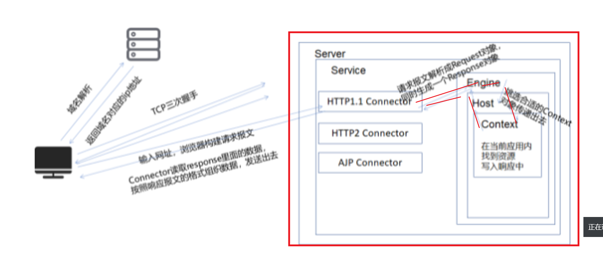
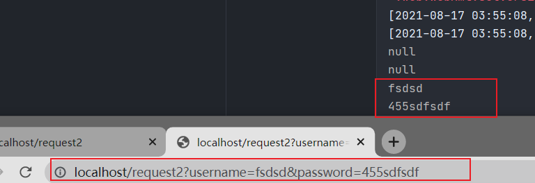
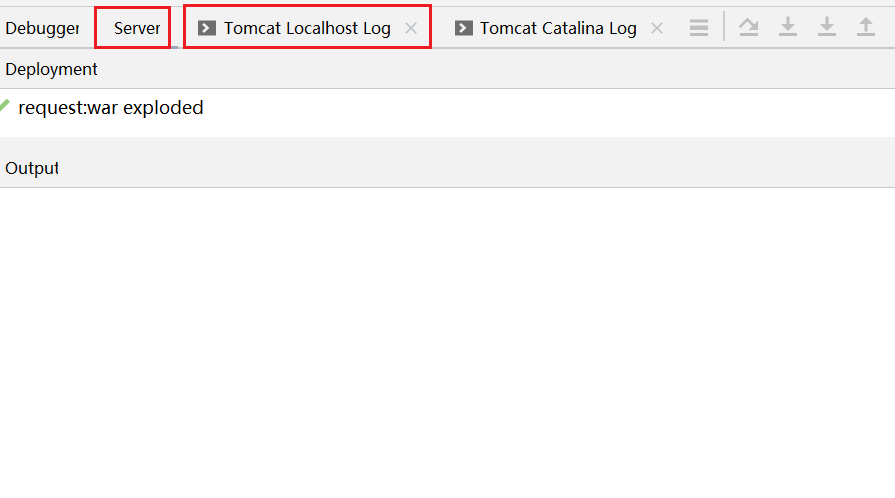
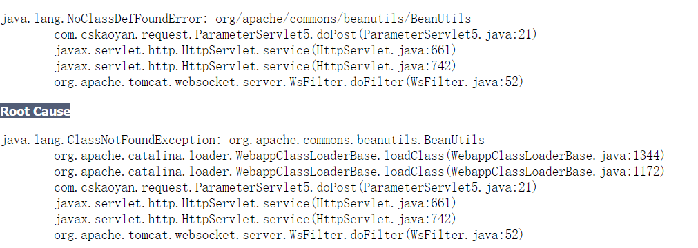
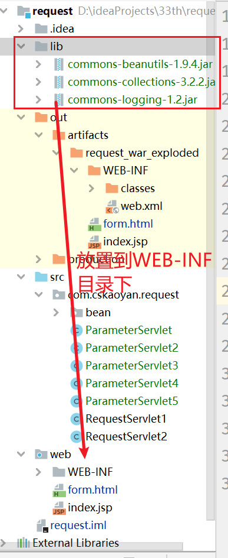
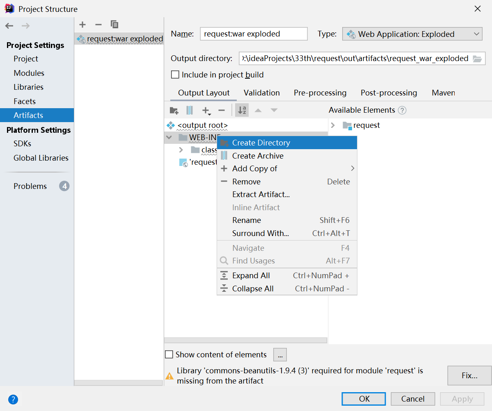
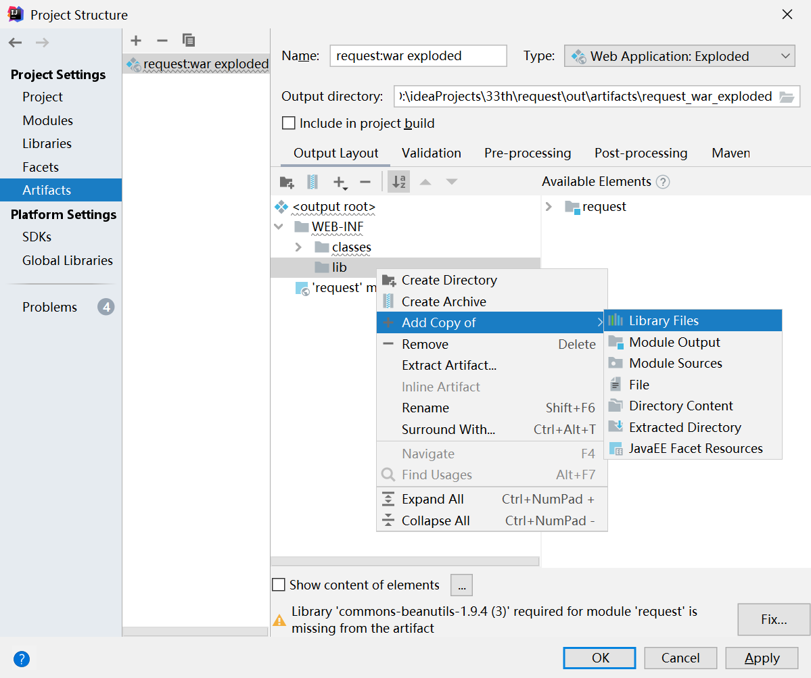
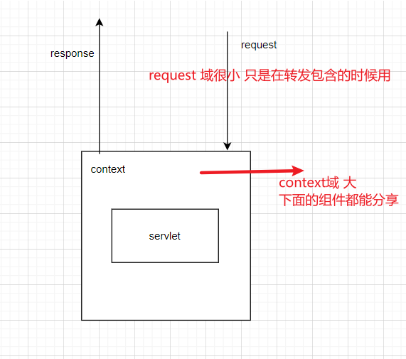

[TOC]


# ServletRequest

api:https://tomcat.apache.org/tomcat-8.0-doc/servletapi/javax/servlet/ServletRequest.html

这个就是tomcat的request封装.如下:




## 介绍:

Defines an object to provide client request information to a servlet. The servlet container creates a `ServletRequest` object and passes it as an argument to the servlet's `service` method.

A `ServletRequest` object provides data including parameter name and values, attributes, and an input stream. Interfaces that extend `ServletRequest` can provide additional protocol-specific data (for example, HTTP data is provided by [`HttpServletRequest`](https://tomcat.apache.org/tomcat-8.0-doc/servletapi/javax/servlet/http/HttpServletRequest.html).


**See Also:**

[`HttpServletRequest`](https://tomcat.apache.org/tomcat-8.0-doc/servletapi/javax/servlet/http/HttpServletRequest.html)

ServletRequest对象其实是tomcat创建的一个关于用户请求信息的封装，其实也就是请求报文的封装。

我们之前提到过，如果使用不同的服务器产品，那么可能解析之后的请求报文的封装对象各不相同，今后我使用某一个公司的服务器产品获取请求资源，接下来更换服务器产品之后，大概率我需要重新去实现一套新的代码逻辑，因为这两个对象不是一样的，获取请求资源的方法也是不同的，非常不利于行业的发展。

sun公司制定了这么一个标准，ServletRequest就是针对请求报文的封装，里面定义了非常多的方法，各个服务器需要对其进行实现，虽然实现的逻辑各不相同，但是需要保障最终调用同一个方法，返回的结果时一致的。

Animal animal = new Pig();

animal.run();

ServletRequest request = new XXXRequest();/new YYYRequest();

request.getProtocol();

```javascript
HttpServletRequest  extends ServletRequest
```

父子接口的关系。

ServletRequest其实是对于请求报文的封装，但是请求报文有很多种协议，HTTP、AJP，

HttpServletRequest是对于HTTP请求报文的封装。当发送HTTP请求报文时才可以解析成HTTPServletRequest

但是一般情况下，99%的情况下，我们发送的都是HTTP请求，所以这两个接口、对象你可以认为是一致的

## 使用:

### 常见方法

其实就是对于请求报文的封装，，那么肯定可以将原先的请求报文加以还原。

HTTP请求报文

```java
package com.cskaoyan.request;

import javax.servlet.ServletException;
import javax.servlet.ServletInputStream;
import javax.servlet.annotation.WebServlet;
import javax.servlet.http.HttpServlet;
import javax.servlet.http.HttpServletRequest;
import javax.servlet.http.HttpServletResponse;
import java.io.IOException;
import java.util.Enumeration;

@WebServlet("/request1")
public class RequestServlet1 extends HttpServlet {
    protected void doPost(HttpServletRequest request, HttpServletResponse response) throws ServletException, IOException {

    }

    /**
     * requestURL = 访问协议：主机、端口号 + requestURI
     * @param request
     * @param response
     * @throws ServletException
     * @throws IOException
     */
    protected void doGet(HttpServletRequest request, HttpServletResponse response) throws ServletException, IOException {
        //利用request提供的方法，将HTTP请求报文给它还原出来
        String method = request.getMethod();
        String requestURI = request.getRequestURI();
        String requestURL = request.getRequestURL().toString();
        String protocol = request.getProtocol();
        System.out.println(method + " " + requestURI + " " + protocol);
        System.out.println(method + " " + requestURL + " " + protocol);

        //获取请求头 Enumeration当做iterator来使用即可
        Enumeration<String> headerNames = request.getHeaderNames();
        while (headerNames.hasMoreElements()){
            String headerName = headerNames.nextElement();
            String headerValue = request.getHeader(headerName);
            System.out.println(headerName + ":" + headerValue);
        }

        //请求体的获取方式，今天暂时用不到，可以先介绍一下
//        ServletInputStream inputStream = request.getInputStream();
    }
}
```

除此之外还有一些方法，比如可以获取客户机和服务器主机的相关信息。

```java
package com.cskaoyan.request;

import javax.servlet.ServletException;
import javax.servlet.annotation.WebServlet;
import javax.servlet.http.HttpServlet;
import javax.servlet.http.HttpServletRequest;
import javax.servlet.http.HttpServletResponse;
import java.io.IOException;
import java.util.Enumeration;

@WebServlet("/request2")
public class RequestServlet2 extends HttpServlet {
    protected void doPost(HttpServletRequest request, HttpServletResponse response) throws ServletException, IOException {

    }


    protected void doGet(HttpServletRequest request, HttpServletResponse response) throws ServletException, IOException {
       //获取客户机和服务器主机的相关信息
        //获取服务器信息
        String localAddr = request.getLocalAddr();
        //服务器监听的端口号
        int localPort = request.getLocalPort();
        //获取客户机信息
        String remoteAddr = request.getRemoteAddr();
        //客户端使用的端口号
        int remotePort = request.getRemotePort();
        //打印，大家可以相互之间访问来测试
        //黑名单：将指定ip来源加入黑名单
        System.out.println(localAddr + "===" + localPort);
        System.out.println(remoteAddr + "----" + remotePort);
    }
}
```


### 获取请求参数

客户机在和服务通讯的时候,主要是数据的传输,比如用户登录,注册,提交一个订单.用户的数据提交到服务器上去的.


**这些数据通过http传送到服务器中,封装到request对象中,服务器需要做的事情就是利用一些方法将这些请求参数进行获取.**

最常见的提交请求参数的形式是通过form表单或者直接在浏览器中进行提交

比如请求方法:

http://localhost/app/submit?usrname=xxxx&categryId=xxxx

```
GET http://192.168.1.26/app/request2?username=xxx&category=xxxxy HTTP/1.1
Host: 192.168.1.26
Connection: keep-alive
Upgrade-Insecure-Requests: 1
User-Agent: Mozilla/5.0 (Windows NT 10.0; Win64; x64) AppleWebKit/537.36 (KHTML, like Gecko) Chrome/92.0.4515.131 Safari/537.36 Edg/92.0.902.73
Accept: text/html,application/xhtml+xml,application/xml;q=0.9,image/webp,image/apng,*/*;q=0.8,application/signed-exchange;v=b3;q=0.9
Accept-Encoding: gzip, deflate
Accept-Language: zh-CN,zh;q=0.9,en;q=0.8,en-GB;q=0.7,en-US;q=0.6
```

还可以用post方法:

```html
<form action="xxxx" method="post">
	<input type="text" name="username"></input>
    <input type="submit" ></input>
</form>
```

无论是get还是post请求方式,请求产生的参数形式是?

```xml
POST http://192.168.1.26/app/request2 HTTP/1.1
Host: 192.168.1.26
Connection: keep-alive
Content-Length: 29
Cache-Control: max-age=0
Upgrade-Insecure-Requests: 1
Origin: http://192.168.1.26
Content-Type: application/x-www-form-urlencoded
User-Agent: Mozilla/5.0 (Windows NT 10.0; Win64; x64) AppleWebKit/537.36 (KHTML, like Gecko) Chrome/92.0.4515.131 Safari/537.36 Edg/92.0.902.73
Accept: text/html,application/xhtml+xml,application/xml;q=0.9,image/webp,image/apng,*/*;q=0.8,application/signed-exchange;v=b3;q=0.9
Referer: http://192.168.1.26/app/form.html
Accept-Encoding: gzip, deflate
Accept-Language: zh-CN,zh;q=0.9,en;q=0.8,en-GB;q=0.7,en-US;q=0.6

username=admin&password=aaaaa
```

总结:

无论是在地址栏后面附着请求参数，还是使用form表单发送post请求提交请求参数，**都是key=value&key=value类型的数据**


**只要请求参数的格式是key=value&key=value型，那么都可以使用接下来介绍的获取请求参数的API来获取，无论请求参数在请求行还是在请求体。**但是如果请求参数的格式是json类型（**{"key":"value","key:"value"}**），不可以使用该方法来获取。

#### 单个获取

##### code:

```java
package request;

import javax.servlet.ServletException;
import javax.servlet.annotation.WebServlet;
import javax.servlet.http.HttpServlet;
import javax.servlet.http.HttpServletRequest;
import javax.servlet.http.HttpServletResponse;
import java.io.IOException;
import java.util.Enumeration;

/**
 * 类<code>Doc</code>用于：TODO
 *
 * @author 12824
 * @version 1.0
 * @date 2021-08-17
 */
@WebServlet("/request2")
public class GetRequest2 extends HttpServlet {
    @Override
    protected void doGet(HttpServletRequest req, HttpServletResponse resp) throws ServletException, IOException {
        final String username = req.getParameter("username");
        final String password = req.getParameter("password");
        System.out.println(username);
        System.out.println(password);
    }

    @Override
    protected void doPost(HttpServletRequest req, HttpServletResponse resp) throws ServletException, IOException {
        final String username = req.getParameter("username");
        final String password = req.getParameter("password");
        System.out.println(username);
        System.out.println(password);
    }
}
```

##### 结果:



#### 多个获取:

如果页面内提交过来的请求参数非常多，服务器需要再次去扩充，然后去适配前端页面的参数的修改。也就是说每当前端页面增加了一个表单，那么服务器就需要再次去增加一行代码来获取对应的请求参数。

```html
<!DOCTYPE html>
<html lang="en">
<head>
    <meta charset="UTF-8">
    <title>Title</title>
</head>
<body>
    <form action="http://192.168.1.26/app/param" method="post">
        <input type="text" name="username"><br>
        <input type="password" name="password"><br>
        <input type="radio" name="gender" value="male">男
        <input type="radio" name="gender" value="female">女<br>
        <input type="checkbox" name="hobby" value="java">java
        <input type="checkbox" name="hobby" value="c++">c++
        <input type="checkbox" name="hobby" value="python">python<br>
        <input type="submit">
    </form>
</body>
</html>
```

如何做到当前前端页面的表单增加时，服务器的逻辑不需要修改、增加

```java
package com.cskaoyan.request;

import javax.servlet.ServletException;
import javax.servlet.annotation.WebServlet;
import javax.servlet.http.HttpServlet;
import javax.servlet.http.HttpServletRequest;
import javax.servlet.http.HttpServletResponse;
import java.io.IOException;
import java.util.Arrays;
import java.util.Enumeration;

@WebServlet("/param2")
public class ParameterServlet2 extends HttpServlet {
    protected void doPost(HttpServletRequest request, HttpServletResponse response) throws ServletException, IOException {
        Enumeration<String> names = request.getParameterNames();
        while (names.hasMoreElements()){
            String key = names.nextElement();
            //这个方法无法获取到提交多个请求参数的情形
            //也就是无法获取到checkbox类型的参数
//            String value = request.getParameter(key);
            String[] values = request.getParameterValues(key);
            System.out.println(key + ":" + Arrays.toString(values));
        }
    }

    protected void doGet(HttpServletRequest request, HttpServletResponse response) throws ServletException, IOException {

    }
}
```

### 获取请求参数到javaBean中

javaBean:java 对象

bean:

1. 成员变量private, 提供public 的get set.
2. 一定要有无参构造函数

#### 使用反射手动实现

```java
package work4;

import javax.servlet.ServletException;
import javax.servlet.annotation.WebServlet;
import javax.servlet.http.HttpServlet;
import javax.servlet.http.HttpServletRequest;
import javax.servlet.http.HttpServletResponse;
import java.io.IOException;
import java.lang.reflect.Field;
import java.lang.reflect.Method;
import java.util.Enumeration;

/**
 * 类<code>Doc</code>用于：TODO
 *
 * @author 12824
 * @version 1.0
 * @date 2021-08-17
 */

@WebServlet("/reflect")
public class Reflex extends HttpServlet {
    @Override
    protected void doPost(HttpServletRequest req, HttpServletResponse resp) throws ServletException, IOException {
        try {
            /*反射实现*/
            /*获取class类*/
            final Class<?> aClass = Class.forName("work4.User");
            /*得到参数*/
            final Enumeration<String> parameterNames = req.getParameterNames();
            /*输出封装的对象*/
            final User o = (User)aClass.newInstance();
            while (parameterNames.hasMoreElements()) {
                String value = parameterNames.nextElement();
                final String key = req.getParameter(value);
                /*反射利用参数得到方法*/
                /*调整提议个字母大写,符合方法名*/
                final String start = value.substring(0, 1);
                final String s = start.toUpperCase();
                final String end = value.substring(1);
                /*首字母大写name*/
                String valueMethod=s+end;
                /*反射获取成员变量类型*/
                final Field field = aClass.getDeclaredField(value);

                //方法大写
                final Method set = aClass.getMethod("set"+valueMethod, field.getType());
                /*处理传入的参数类型 不为string*/
                if (field.getType().getTypeName().equals("int")){
                    set.invoke(o,Integer. parseInt(key));
                }else
                {
                    /*将参数对应的值填入*/
                    set.invoke(o,key);
                }

                /*循环前面步骤*/
            }

            System.out.println(o.toString());
        } catch (Exception e) {
            e.printStackTrace();
        }
        //在运行是拿到请求参数和key
        //将value->setvalue.
        //利用反射去执行setvalue方法.传入key去设置
    }
}

```


#### 使用BeanUtilsBean工具

doc:https://commons.apache.org/proper/commons-beanutils/


a `populate()` method is provided that accepts a `java.util.Map` containing a set of property values (keyed by property name), and calls all of the appropriate setters whenever the underlying bean has a property with the same name as one of the request parameters. So, you can perform the all-in-one property setting operation like this:

```java
     HttpServletRequest request = ...;
     MyBean bean = ...;
     HashMap map = new HashMap();
     Enumeration names = request.getParameterNames();
     while (names.hasMoreElements()) {
       String name = (String) names.nextElement();
       map.put(name, request.getParameterValues(name));
     }
     BeanUtils.populate(bean, map);
```

#### 外部jar包导入到web中:

**如果状态码出现500，那么表示的是服务器发生异常。去找错误日志。**

查看tomcat的log



这两处都需要查看。



出现这个问题，是什么原因？

类没有找到。

编译问题还是运行问题？运行问题。（如果是编译问题，那么无法编译通过）

EE阶段所特有的一个表现。

EE项目是无法独立运行的，必须由tomcat服务器来调用才可以运行，相应的这些jar包，也是需要通过tomcat提供的类加载器去加载到内存的。但是tomcat的类加载器只会到你的应**用WEB-INF/lib目录下**寻找jar包，如果找不到，则不会加载。不加载，则运行时无法找到该jar包。


如何把jar包放到WEB-INF/lib目录下？

**方式一：**



web目录其实是一个功能性目录，表示的是对部署根目录做了一个映射，凡是web目录里面出现的文件，都会复制到部署根目录中，WEB-INF目录下存放了一个lib目录，那么也会同步过去

**方式二：**





实现

```java
package bean;

import org.apache.commons.beanutils.BeanUtils;
import org.apache.commons.beanutils.BeanUtilsBean;

import javax.servlet.ServletException;
import javax.servlet.http.HttpServlet;
import javax.servlet.http.HttpServletRequest;
import javax.servlet.http.HttpServletResponse;
import java.io.IOException;
import java.lang.reflect.InvocationTargetException;

/**
 * 类<code>Doc</code>用于：TODO
 *使用工具类来完成赋值操作.
 * @author 12824
 * @version 1.0
 * @date 2021-08-17
 */
public class ParameterServlet2 extends HttpServlet {
    @Override
    protected void doGet(HttpServletRequest req, HttpServletResponse resp) throws ServletException, IOException {
        //使用beanuils使用 实际也是利用反射来实现的
        final User user = new User();
        try {
            req.setCharacterEncoding("UTF-8");
            BeanUtils.populate(user, req.getParameterMap());
            System.out.println(user.toString());
        } catch (IllegalAccessException e) {
            e.printStackTrace();
        } catch (InvocationTargetException e) {
            e.printStackTrace();
        }
    }
}
```

### 请求参数是中午乱码

#### post方式进行提交

如果用户提交过来的请求参数是中文

**为什么会出现乱码问题？**

在发送HTTP请求报文时，中文是何种编码格式？UTF-8

HTTP请求报文到达服务器，被服务器解析，封装到Request对象中，此时取出中文，发现已经乱码了。说明了再解析的过程中出现了问题。


**如何解决呢？**

```java
void setCharacterEncoding(java.lang.String env)
                   throws java.io.UnsupportedEncodingException
```

Overrides the name of the character encoding used in **the body of this request.** This method must be called prior to reading request parameters or reading input using getReader().

注意事项：

**1该方法可以重写请求体里面的编码格式**

**2该方法必须要在读取请求参数之前调用**

```java
package com.cskaoyan.request;

import com.cskaoyan.request.bean.User;
import org.apache.commons.beanutils.BeanUtils;

import javax.servlet.ServletException;
import javax.servlet.annotation.WebServlet;
import javax.servlet.http.HttpServlet;
import javax.servlet.http.HttpServletRequest;
import javax.servlet.http.HttpServletResponse;
import java.io.IOException;
import java.lang.reflect.InvocationTargetException;

@WebServlet("/param5")
public class ParameterServlet5 extends HttpServlet {
    protected void doPost(HttpServletRequest request, HttpServletResponse response) throws ServletException, IOException {
        request.setCharacterEncoding("utf-8");
        //可以使用一个工具类，来帮助我们完成赋值操作
        //找jar包
        User user = new User();
        try {
            //实际上也是利用反射来实现的
            BeanUtils.populate(user, request.getParameterMap());
        } catch (IllegalAccessException e) {
            e.printStackTrace();
        } catch (InvocationTargetException e) {
            e.printStackTrace();
        }
        System.out.println(user);
    }

    protected void doGet(HttpServletRequest request, HttpServletResponse response) throws ServletException, IOException {

    }
}
```

#### get方法进行提交

没有乱码问题。


### EE debug

**很有用,是sout干不了的.**

1. 学会打断点,清楚程序的执行流程,在程序执行通路上打断打点.一般建议在程序入口的地方,也就是service方法第一行代码.
2. 打完断点触发代码.


## 网络路径

最熟悉的写法应当是http://localhost/app/1.html这种写法，全路径写法

### 全路径

完整的网络路径

可以写，但是有些部分不是特别的合适。

localhost这个地方不是特别的合适


开发环境

个人开发环境：个人电脑---localhost可以的，但是代码开发完毕之后，需要到测试服务器上面去测试

公司测试环境：本机的环境和生产环境相差比较大，尽可能去模拟生产环境下可能出现的问题，所以会有一个测试环境，该环境应当尽可能和生产环境保持一致。   ip、域名

正式的生产环境：jd.com  taobao.com

每当更换一个环境，你的代码如果写成了全路径，那么都需要更改一下。

针对localhost主机这部分，不可以直接写死，应当写在一些配置文件里面，从配置文件里面去读取这个数值，然后填充到路径里面

### 相对路径

相对当前页面的一个相对应的路径

比如当前表单页面是

http://localhost/app/1.html

里面有一个form表单提交的地址是
http://localhost/app/submit

相对路径应该如何写呢？

submit即可。

推荐吗？**不是特别推荐**。过分依赖于当前页面所在的路径。

如果把页面所在的位置更换一下，那么最终提交的路径地址也需要随着更换。


### /开头的路径

写法：  /应用名/资源路径

比如提交的servlet地址：/app/submit

无论页面所在哪个目录下， 始终是不需要更改的。 **推荐**。


**疑惑：注意上面指的全部都是网络路径。和我们之前介绍的file等路径不同，file路径是硬盘路径。**

**浏览器里面输入的是网络路径  http://localhost/app/1.html**

**发送一个HTTP请求报文，发往localhost的80端口号 请求资源是/app/1.html**

**tomcat解析处理-------》/app的应用（有效的路径是/1.html---------》  docBase  +  /1.html ------   realPath------file）**


## 转发包含(了解)

场景：

登录，提交请求参数到servlet，servlet处理完毕之后，需要跳转到一个页面，如何跳转到一个页面呢？

假设一个servlet做了一些逻辑，接下来想调用另外一个servlet，如何调用另外一个servlet呢？


可以使用转发来实现。主要用在页面跳转中，但是今后项目开发过程中，java主要位于服务端，主要负责提供数据即可，页面的渲染、跳转由前端来实现（前后端分离）。但是在学习EE知识的过程中需要给大家去举一些页面跳转的例子，所以需要用到这部分，所以会稍微讲解一下。

可以使用转发来实现。主要用在页面跳转中，但是今后项目开发过程中，java主要位于服务端，主要负责提供数据即可，页面的渲染、跳转由前端来实现（前后端分离）。但是在学习EE知识的过程中需要给大家去举一些页面跳转的例子，所以需要用到这部分，所以会稍微讲解一下。

```java
package com.cskaoyan.request.forward;

import javax.servlet.RequestDispatcher;
import javax.servlet.ServletException;
import javax.servlet.annotation.WebServlet;
import javax.servlet.http.HttpServlet;
import javax.servlet.http.HttpServletRequest;
import javax.servlet.http.HttpServletResponse;
import java.io.IOException;

@WebServlet("/dis1")
public class DispatcherServlet extends HttpServlet {
    protected void doPost(HttpServletRequest request, HttpServletResponse response) throws ServletException, IOException {

    }

    protected void doGet(HttpServletRequest request, HttpServletResponse response) throws ServletException, IOException {
        //首先访问dis1，紧接着转发给dis2
        //应当给tomcat发送一个指令， 告诉tomcat，我想调用另外一个servlet
        //传的是另外一个组件dis2的网络路径 /开头
        //转发的时候，其实只能在当前应用下去转发调用组件
        //自动帮你添加应用名
        RequestDispatcher dispatcher = request.getRequestDispatcher("/dis2");
        dispatcher.forward(request, response);
    }
}
```

通过上述案例，我们发现/开头的路径，在转发里面只需要写/资源路径即可，不需要写应用名，但是之前介绍网络路径的时候，又强调应该是/应用名/资源路径，如何区分记忆呢？

**转发的这个路径是唯一的一个特例，其他都是/应用名/资源路径**

**看路径解析执行的主体是浏览器还是服务器，如果是浏览器，那么浏览器无法得知你的应用名是啥，所以必须要写/应用名/资源路径，如果路径的解析执行主体是服务器，那么执行/资源路径即可**

比如a href、img src、 form action 这些解析主体是谁？浏览器

上述所说的规律都是针对/开头的路径。


登录案例，登录成功，打印输出欢迎页面

```html
<!DOCTYPE html>
<html lang="en">
<head>
    <meta charset="UTF-8">
    <title>Title</title>
</head>
<body>
    <form action="http://localhost/app/login" method="post">
        <input type="text" name="username"><br>
        <input type="password" name="password"><br>
        <input type="submit">
    </form>
</body>
</html>
```

```java
package com.cskaoyan.request;

import javax.servlet.ServletException;
import javax.servlet.annotation.WebServlet;
import javax.servlet.http.HttpServlet;
import javax.servlet.http.HttpServletRequest;
import javax.servlet.http.HttpServletResponse;
import java.io.IOException;

@WebServlet("/login")
public class LoginServlet extends HttpServlet {
    protected void doPost(HttpServletRequest request, HttpServletResponse response) throws ServletException, IOException {
        //登录的逻辑：获取请求参数  用户名、密码
        String username = request.getParameter("username");
        String password = request.getParameter("password");
        // JDBC  查询
        if("admin".equals(username) && "admin".equals(password)){
            //表示登录成功，跳转到另外一个servlet
            request.getRequestDispatcher("/view").forward(request, response);
        }
    }

    protected void doGet(HttpServletRequest request, HttpServletResponse response) throws ServletException, IOException {

    }
}
```

```java
package com.cskaoyan.request;

import javax.servlet.ServletException;
import javax.servlet.annotation.WebServlet;
import javax.servlet.http.HttpServlet;
import javax.servlet.http.HttpServletRequest;
import javax.servlet.http.HttpServletResponse;
import java.io.IOException;

@WebServlet("/view")
public class ViewServlet extends HttpServlet {
    protected void doPost(HttpServletRequest request, HttpServletResponse response) throws ServletException, IOException {
        //输出内容到客户端
        response.getWriter().println("login success");
    }

    protected void doGet(HttpServletRequest request, HttpServletResponse response) throws ServletException, IOException {

    }
}
```


包含：**不是一个重点。包含主要用在一个页面包含另外一个页面中。**java语言很少去涉及到页面相关，vue来实现，所以这部分内容基本没什么用。


## 5. request域(重点)

request对象中其实内部存了一个map，只要能够拿到同一个request对象，那么就可以进行数据的共享


哪些情况下可以拿到同一个request对象？转发的两个组件之间


输入一个地址，频繁的去刷新当前页面，发送了多个请求，多个请求之间是不是同一个request对象？不是。

```java
package com.cskaoyan.request;

import javax.servlet.ServletException;
import javax.servlet.annotation.WebServlet;
import javax.servlet.http.HttpServlet;
import javax.servlet.http.HttpServletRequest;
import javax.servlet.http.HttpServletResponse;
import java.io.IOException;

@WebServlet("/login")
public class LoginServlet extends HttpServlet {
    protected void doPost(HttpServletRequest request, HttpServletResponse response) throws ServletException, IOException {
        //登录的逻辑：获取请求参数  用户名、密码
        String username = request.getParameter("username");
        String password = request.getParameter("password");
        // JDBC  查询
        if("admin".equals(username) && "admin".equals(password)){
            //表示登录成功，跳转到另外一个servlet
            request.setAttribute("username", username);
            request.getRequestDispatcher("/view").forward(request, response);
        }
    }

    protected void doGet(HttpServletRequest request, HttpServletResponse response) throws ServletException, IOException {

    }
}
```


```java
package com.cskaoyan.request;

import javax.servlet.ServletException;
import javax.servlet.annotation.WebServlet;
import javax.servlet.http.HttpServlet;
import javax.servlet.http.HttpServletRequest;
import javax.servlet.http.HttpServletResponse;
import java.io.IOException;

@WebServlet("/view")
public class ViewServlet extends HttpServlet {
    protected void doPost(HttpServletRequest request, HttpServletResponse response) throws ServletException, IOException {
        //输出内容到客户端
        String username = (String) request.getAttribute("username");
        response.getWriter().println("login success " + username);
    }

    protected void doGet(HttpServletRequest request, HttpServletResponse response) throws ServletException, IOException {

    }
}
```


#### **request域和 context域区别(重点)**



**context域**很大，凡是一个应用下的任意组件，均可以进行数据的共享

**reqeust域**很小，即便访问的是同一个地址，那么彼此之间多个request对象也不是同一个，所以无法进行数据的共享，只有转发的两个组件之间可以进行数据的共享。

