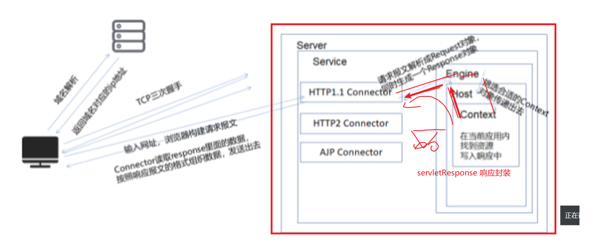
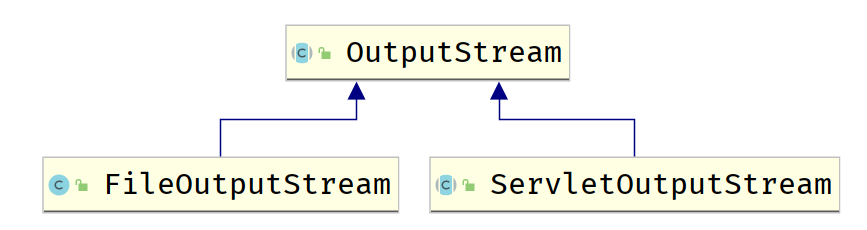
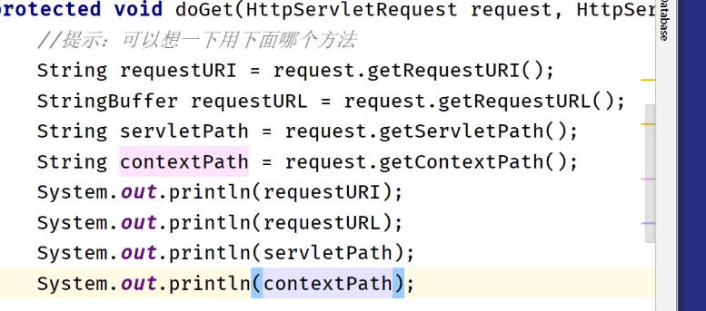

[toc]


# servletResponse




> api:https://tomcat.apache.org/tomcat-8.0-doc/servletapi/javax/servlet/ServletResponse.html

## 1.概述 

**Interface ServletResponse**

- Defines an object to assist a servlet in sending a response to the client. The servlet container creates a `ServletResponse` object and passes it as an argument to the servlet's `service` method.

  To send binary data in a MIME body response, use the [`ServletOutputStream`](https://tomcat.apache.org/tomcat-8.0-doc/servletapi/javax/servlet/ServletOutputStream.html) returned by [`getOutputStream()`](https://tomcat.apache.org/tomcat-8.0-doc/servletapi/javax/servlet/ServletResponse.html#getOutputStream()). To send character data, use the `PrintWriter` object returned by [`getWriter()`](https://tomcat.apache.org/tomcat-8.0-doc/servletapi/javax/servlet/ServletResponse.html#getWriter()). To mix binary and text data, for example, to create a multipart response, use a `ServletOutputStream` and manage the character sections manually.

  The charset for the MIME body response can be specified explicitly using the [`setCharacterEncoding(java.lang.String)`](https://tomcat.apache.org/tomcat-8.0-doc/servletapi/javax/servlet/ServletResponse.html#setCharacterEncoding(java.lang.String)) and [`setContentType(java.lang.String)`](https://tomcat.apache.org/tomcat-8.0-doc/servletapi/javax/servlet/ServletResponse.html#setContentType(java.lang.String)) methods, or implicitly using the [`setLocale(java.util.Locale)`](https://tomcat.apache.org/tomcat-8.0-doc/servletapi/javax/servlet/ServletResponse.html#setLocale(java.util.Locale)) method. Explicit specifications take precedence over implicit specifications. If no charset is specified, ISO-8859-1 will be used. The `setCharacterEncoding`, `setContentType`, or `setLocale` method must be called before `getWriter` and before committing the response for the character encoding to be used.

  See the Internet RFCs such as [RFC 2045](http://www.ietf.org/rfc/rfc2045.txt) for more information on MIME. Protocols such as SMTP and HTTP define profiles of MIME, and those standards are still evolving.

  - **See Also:**

    [`ServletOutputStream`](https://tomcat.apache.org/tomcat-8.0-doc/servletapi/javax/servlet/ServletOutputStream.html)

- https://tomcat.apache.org/tomcat-8.0-doc/servletapi/javax/servlet/ServletResponse.html)

代表了将来的响应报文,

代表了将来的响应报文。服务器为了今后设置响应报文方便，预先先给我们提供了一个response对象，在执行service方法的时候，可以往response中塞入一些数据，里面有很多的成员变量，不同的成员变量接下来在响应报文中对应的部分也不同。最终connector读取response里面的数据，然后生成响应报文。（**购物时的小推车，方便购物结算**）

ServletResponse 是**子类**

## 2.常见方法

### 2.1 方法

既然response代表了响应报文，那么就应该有可以设置响应报文各个部分的方法。

**响应行** **响应头** **响应体**

```java
 //设置响应报文
        //向银行
        resp.setStatus(200);

        //设置编码问题
        resp.setCharacterEncoding("gbk");
        //响应头
        resp.setHeader("resp", "封装响应头");
        resp.setHeader("server","tomcat");
        //响应体
        resp.getWriter().println("this is response test" +
                "我的十九届");
```

### 2.2 response伪代码

封装是如何实现的?

```
class Response{
    
    int status;
    
    Map responseHeaders;
    
    byte[] body;
    
    
    setStatus{status = xxx}
    
    setHeader{responseHeaders.put(key,value)}
    
    body = xxxx
}


Connector{
    
    response(){
        HTTP/1.1 + status
        responseHeaders.forEach()----{key: value\r\n}
        
        body
    }
}
```

## 3.输出字符数据(重点)

### 3.3 解决编码问题

```java
package com.cskaoyan.response;

import javax.servlet.ServletException;
import javax.servlet.annotation.WebServlet;
import javax.servlet.http.HttpServlet;
import javax.servlet.http.HttpServletRequest;
import javax.servlet.http.HttpServletResponse;
import java.io.IOException;

@WebServlet("/char")
public class CharacterServlet extends HttpServlet {
    protected void doPost(HttpServletRequest request, HttpServletResponse response) throws ServletException, IOException {

    }

    protected void doGet(HttpServletRequest request, HttpServletResponse response) throws ServletException, IOException {
        //输出字符数据所用的方法一定要记住
        response.setCharacterEncoding("utf-8");
        response.getWriter().println("hello world");
        //输出中文会有乱码问题
        //如何解决乱码问题？根据设置request乱码的经验来
        response.getWriter().println("欢迎您!!!");
    }
}
```

设置成utf-8之后，乱码由之前的？？？变成了娆㈣繋鎮�，说明了设置了之后使用的编码格式支持中文了

设置了发送个客户端的响应报文的编码格式为utf-8，浏览器拿到之后解析乱码了，说明了浏览器使用的不是utf-8

```java
package com.cskaoyan.response;

import javax.servlet.ServletException;
import javax.servlet.annotation.WebServlet;
import javax.servlet.http.HttpServlet;
import javax.servlet.http.HttpServletRequest;
import javax.servlet.http.HttpServletResponse;
import java.io.IOException;

@WebServlet("/char")
public class CharacterServlet extends HttpServlet {
    protected void doPost(HttpServletRequest request, HttpServletResponse response) throws ServletException, IOException {

    }

    protected void doGet(HttpServletRequest request, HttpServletResponse response) throws ServletException, IOException {
        //输出字符数据所用的方法一定要记住
        response.setCharacterEncoding("gbk");
        response.getWriter().println("hello world");
        //输出中文会有乱码问题
        //如何解决乱码问题？根据设置request乱码的经验来
        response.getWriter().println("欢迎您!!!");
    }
}
```

尝试将服务器编码格式改成gbk，发现此时乱码问题解决了，但是可以采用这种方式解决吗？

为什么设置成gbk，解决了乱码呢？说明了浏览器使用的是gbk。简体中文版操作系统、浏览器的语音中文，gbk编码格式。


有可能一个用户在美国，访问中文网站，操作系统、浏览器语言不是中文，utf-8，此时又乱码了，没有根本解决这个问题


浏览器其实是支持多编码格式的，但是只会选择一个默认的编码格式，如果你告诉浏览器使用哪个编码格式，其实完全ok。之前乱码主要问题是服务器和浏览器没有沟通好使用哪个编码格式。

**服务器设置一个编码格式，将使用的编码格式告诉给客户端**

如何告诉给客户端？肯定要通过HTTP响应报文，响应头、响应体

响应头：

```java
package com.cskaoyan.response;

import javax.servlet.ServletException;
import javax.servlet.annotation.WebServlet;
import javax.servlet.http.HttpServlet;
import javax.servlet.http.HttpServletRequest;
import javax.servlet.http.HttpServletResponse;
import java.io.IOException;

@WebServlet("/char2")
public class CharacterServlet2 extends HttpServlet {
    protected void doPost(HttpServletRequest request, HttpServletResponse response) throws ServletException, IOException {

    }

    protected void doGet(HttpServletRequest request, HttpServletResponse response) throws ServletException, IOException {
        //输出字符数据所用的方法一定要记住
//        response.setCharacterEncoding("utf-8");

        //设置的编码格式告诉给客户端，通过响应头告诉
        //设置Content-Type其实这个头有两个功能：
        //1.告诉给客户端使用的编码格式
        //2.服务器也会主动设置该编码格式，所以上面的setCharacterEncoding其实可以直接省略
        response.setHeader("Content-Type","text/html;charset=utf-8");
        response.getWriter().println("欢迎您!!!");
    }
}
```

响应体：

```java
package com.cskaoyan.response;

import javax.servlet.ServletException;
import javax.servlet.annotation.WebServlet;
import javax.servlet.http.HttpServlet;
import javax.servlet.http.HttpServletRequest;
import javax.servlet.http.HttpServletResponse;
import java.io.IOException;

@WebServlet("/char3")
public class CharacterServlet3 extends HttpServlet {
    protected void doPost(HttpServletRequest request, HttpServletResponse response) throws ServletException, IOException {

    }

    protected void doGet(HttpServletRequest request, HttpServletResponse response) throws ServletException, IOException {
        //输出字符数据所用的方法一定要记住
        response.setCharacterEncoding("utf-8");

        response.getWriter().println("<!DOCTYPE html>\n" +
                "<html lang=\"en\">\n" +
                "<head>\n" +
                "    <meta charset=\"UTF-8\">\n" +
                "    <title>Title</title>\n" +
                "</head>\n" +
                "<body>");

        response.getWriter().println("欢迎您!!!");
        response.getWriter().println("</body>\n" +
                "</html>");
    }
}
```

实际上，jsp的原理其实就是方式二

 响应头中

## 4.输出字节数据(重点)

ServletOutputStream

Provides an output stream for sending binary data to the client.



两个类应有相似之处的，都是输出流，但是彼此之间应该还是有差异的，差异体现在输出的目的地不同的

ServletOutputStream（写入到response的 byte[]数组中）代码逻辑应该和FileOutputStream（写入到文件中）非常的类似。

作业:



### 缺省Servlet

```java
package com.cskaoyan.response;

import javax.servlet.ServletContext;
import javax.servlet.ServletException;
import javax.servlet.ServletOutputStream;
import javax.servlet.annotation.WebServlet;
import javax.servlet.http.HttpServlet;
import javax.servlet.http.HttpServletRequest;
import javax.servlet.http.HttpServletResponse;
import java.io.File;
import java.io.FileInputStream;
import java.io.IOException;

/**
 * 实现缺省Servlet：要求url-pattern为  /
 * 此时静态资源文件均无法正常显示，你需要做的事情就是在设置了/的前提下
 * 依然可以正常访问到资源页面
 */
@WebServlet("/")
public class MyDefaultServlet extends HttpServlet {
    protected void doPost(HttpServletRequest request, HttpServletResponse response) throws ServletException, IOException {

    }

    protected void doGet(HttpServletRequest request, HttpServletResponse response) throws ServletException, IOException {
        //提示：可以想一下用下面哪个方法
        //   /app   /page/1.html      docBase + /1.html
        //设置了Content-Type text/html;charset=utf-8
        // servletPath = reqeustURI - 应用名
        // 通过判断文件的后缀名  html txt等，设置该头，其他不设置 /1.jpeg
        //tomcat会判断你请求资源的文件后缀名，然后设置对应的MIME类型
        String servletPath = request.getServletPath();
        ServletContext servletContext = getServletContext();
        String realPath = servletContext.getRealPath(servletPath);
        File file = new File(realPath);
        //file有可能是不存在的
        if(file.exists() && file.isFile()){
            //file存在，并且不是目录
            FileInputStream fileInputStream = new FileInputStream(file);
            //就把他当做FileOutputStream来看待，只是写出的目的地不同罢了
            ServletOutputStream outputStream = response.getOutputStream();
            int length = 0;
            byte[] bytes = new byte[1024];
            while ((length = fileInputStream.read(bytes)) != -1){
                outputStream.write(bytes,0, length);
            }
            fileInputStream.close();
            outputStream.close();
            return;
        }
        //文件不存在  404
        response.setStatus(404);
        response.getWriter().println("<h1>File Not Found</h1>");
    }
}
```


## 5.定时刷新

概念：发送了一个refresh响应头，那么该响应头会告诉浏览器刷新当前页面或者跳转到一个指定的页面

### 5.1 刷新

用法一：

**可以一直刷新当前页面，比如再页面上面显示时间**

```java
   resp.setHeader("refresh", "1");
```

### 5.2 页面重定位

跳转到其他页面，比如登录成功之后，跳转到另外一个页面。

```java
  resp.getWriter().println("post");
        //经过重新几秒后,向url重新发送请求
        resp.setHeader("refresh", "2;url="+req.getContextPath()+"/post.html");
```


## 6.重定向


概念：

**服务区返回301、302、307状态码，同时还会返回一个Location响应头，当浏览器拿到响应报文之后，会再次向Location的地址发起一个新的请求。**


另外一种页面跳转方式，比如访问www.bing.com时，那么就用了重定向

```java
resp.setStatus(302);
resp.setHeader("Location", req.getContextPath()+"/index.html");
```

此外还有另外一种方式。EE规范为了我们编写重定向方便，又设计了另外一个方法，

```java
resp.sendRedirect(req.getContextPath()+"/form2.html");
```

**转发、定时刷新、重定向 都可以用来进行页面跳转**

### 实例

登录案例，登录成功，跳转到一个页面

```java
package com.cskaoyan.response.login;

import javax.servlet.ServletException;
import javax.servlet.annotation.WebServlet;
import javax.servlet.http.HttpServlet;
import javax.servlet.http.HttpServletRequest;
import javax.servlet.http.HttpServletResponse;
import java.io.IOException;

@WebServlet("/login")
public class LoginServlet extends HttpServlet {
    protected void doPost(HttpServletRequest request, HttpServletResponse response) throws ServletException, IOException {
        response.setContentType("text/html;charset=utf-8");
        String username = request.getParameter("username");
        String password = request.getParameter("password");
        if("admin".equals(username) && "admin".equals(password)){
            //登录成功
            response.getWriter().println("登录成功，即将跳转至个人页面");
            response.setHeader("refresh", "2;url=" + request.getContextPath() + "/view");
        }
    }

    protected void doGet(HttpServletRequest request, HttpServletResponse response) throws ServletException, IOException {

    }
}
```

```java
package com.cskaoyan.response.login;

import javax.servlet.ServletException;
import javax.servlet.annotation.WebServlet;
import javax.servlet.http.HttpServlet;
import javax.servlet.http.HttpServletRequest;
import javax.servlet.http.HttpServletResponse;
import java.io.IOException;

@WebServlet("/view")
public class ViewServlet extends HttpServlet {
    protected void doPost(HttpServletRequest request, HttpServletResponse response) throws ServletException, IOException {

    }

    protected void doGet(HttpServletRequest request, HttpServletResponse response) throws ServletException, IOException {
        response.getWriter().println("info page");
    }
}
```

还可以使用重定向来实现

```java
package com.cskaoyan.response.login;

import javax.servlet.ServletException;
import javax.servlet.annotation.WebServlet;
import javax.servlet.http.HttpServlet;
import javax.servlet.http.HttpServletRequest;
import javax.servlet.http.HttpServletResponse;
import java.io.IOException;

@WebServlet("/login")
public class LoginServlet extends HttpServlet {
    protected void doPost(HttpServletRequest request, HttpServletResponse response) throws ServletException, IOException {
        response.setContentType("text/html;charset=utf-8");
        String username = request.getParameter("username");
        String password = request.getParameter("password");
        if("admin".equals(username) && "admin".equals(password)){
            //登录成功
            response.getWriter().println("登录成功，即将跳转至个人页面");
            response.sendRedirect(request.getContextPath() + "/view");
        }
    }

    protected void doGet(HttpServletRequest request, HttpServletResponse response) throws ServletException, IOException {

    }
}
```


三种方式都可以用来进行页面跳转

如果你希望使用request域共享数据，那么可以使用转发

如果希望页面跳转的过程中更具有交互性，可以使用定时刷新

## 7.下载

浏览器有下载操作和打开操作.

默认打开操作.

那么如何执行下载操作?

告诉浏览器直接下载,而不是浏览.

有个请求头.

我们这里所说的下载指的是针对浏览器原先可以执行打开的文件，我们可以设置一个响应头，告诉浏览器将这个文件直接下载而不是打开操作。

```java
package com.cskaoyan.response.download;

import javax.servlet.ServletException;
import javax.servlet.ServletOutputStream;
import javax.servlet.annotation.WebServlet;
import javax.servlet.http.HttpServlet;
import javax.servlet.http.HttpServletRequest;
import javax.servlet.http.HttpServletResponse;
import java.io.File;
import java.io.FileInputStream;
import java.io.IOException;

@WebServlet("/download")
public class DownLoadServlet extends HttpServlet {
    protected void doPost(HttpServletRequest request, HttpServletResponse response) throws ServletException, IOException {

    }

    protected void doGet(HttpServletRequest request, HttpServletResponse response) throws ServletException, IOException {
        //将应用根目录下的1.jpeg下载到本地
        //逻辑和执行访问打开操作基本一模一样，只是需要多加一个响应头
        //只需要写这么一个响应头，那么原先可以打开的图片就会执行下载操作
        response.setHeader("Content-Disposition", "attachment;filename=1.jpeg");
        ServletOutputStream outputStream = response.getOutputStream();
        String realPath = getServletContext().getRealPath("1.jpeg");
        FileInputStream fileInputStream = new FileInputStream(new File(realPath));
        int length = 0;
        byte[] bytes = new byte[1024];
        while ((length = fileInputStream.read(bytes)) != -1){
            outputStream.write(bytes, 0, length);
        }
        fileInputStream.close();
        //可以关，也可以不关，如果不关，那么tomcat会在最后帮你关
        outputStream.close();

    }
}
```

使用场景：

管理系统，表格的数据，**导出数据到excel功能**（1.使用专门的类库将数据写入到excel中， 2将该文件下载到本地硬盘上面）

## 8.流 下载总结等总结

```javA
<!DOCTYPE html>
<html lang="en">
<head>
    <meta charset="UTF-8">
    <title>Title</title>
</head>
<body>
    <a href="/app/1.jpeg">直接访问图片</a>
    <a href="/app/stream">通过servlet访问图片</a>
    <a href="/app/download">下载图片</a>
    
    <a href="/app/pic?op=view">通过servlet访问图片-update1</a>
    <a href="/app/pic?op=download">下载图片-update1</a>

    <a href="/app/pic/view">通过servlet访问图片-update2</a>
    <a href="/app/pic/download">下载图片-update2</a>

</body>
</html>
```

针对2和3，一个是通过servlet显示图片，一个是通过servlet下载图片，两者之间的代码其实非常相近，写到两个servlet中有些浪费。功能上面也比较接近，完全可以合并到一个servlet中。**高内聚** 低耦合

其实可以合并到一个servlet中。

**1.一个servlet可以设置多个url-pattern**

**2.请求同一个地址，但是携带了一个op的请求参数，利用op的值， 分发到不同的方法中，download使用stream的代码，外加一个响应头即可。**

```java
package com.cskaoyan.response.pic;

import javax.servlet.ServletException;
import javax.servlet.ServletOutputStream;
import javax.servlet.annotation.WebServlet;
import javax.servlet.http.HttpServlet;
import javax.servlet.http.HttpServletRequest;
import javax.servlet.http.HttpServletResponse;
import java.io.File;
import java.io.FileInputStream;
import java.io.IOException;

@WebServlet("/pic")
public class PicServlet1 extends HttpServlet {
    protected void doPost(HttpServletRequest request, HttpServletResponse response) throws ServletException, IOException {

    }

    protected void doGet(HttpServletRequest request, HttpServletResponse response) throws ServletException, IOException {
        String op = request.getParameter("op");
        if("view".equals(op)){
            view(request, response);
        }else if("download".equals(op)){
            download(request, response);
        }
    }

    private void download(HttpServletRequest request, HttpServletResponse response) throws IOException {
        response.setHeader("Content-Disposition", "attachment;filename=1.jpeg");
        view(request, response);
    }

    private void view(HttpServletRequest request, HttpServletResponse response) throws IOException {
        ServletOutputStream outputStream = response.getOutputStream();
        String realPath = getServletContext().getRealPath("1.jpeg");
        FileInputStream fileInputStream = new FileInputStream(new File(realPath));
        int length = 0;
        byte[] bytes = new byte[1024];
        while ((length = fileInputStream.read(bytes)) != -1){
            outputStream.write(bytes, 0, length);
        }
        fileInputStream.close();
        //可以关，也可以不关，如果不关，那么tomcat会在最后帮你关
        outputStream.close();

    }
}
```


**3.通过请求地址去区分。**

```java
package com.cskaoyan.response.pic;

import javax.servlet.ServletException;
import javax.servlet.ServletOutputStream;
import javax.servlet.annotation.WebServlet;
import javax.servlet.http.HttpServlet;
import javax.servlet.http.HttpServletRequest;
import javax.servlet.http.HttpServletResponse;
import java.io.File;
import java.io.FileInputStream;
import java.io.IOException;

@WebServlet("/pic/*")
public class PicServlet2 extends HttpServlet {
    protected void doPost(HttpServletRequest request, HttpServletResponse response) throws ServletException, IOException {

    }

    protected void doGet(HttpServletRequest request, HttpServletResponse response) throws ServletException, IOException {
        String requestURI = request.getRequestURI();
        // /app/pic/view， 希望识别出最后一部分，把前面部分替换即可
        String op = requestURI.replace(request.getContextPath() + "/pic/", "");
        if("view".equals(op)){
            view(request, response);
        }else if("download".equals(op)){
            download(request, response);
        }
    }

    private void download(HttpServletRequest request, HttpServletResponse response) throws IOException {
        response.setHeader("Content-Disposition", "attachment;filename=1.jpeg");
        view(request, response);
    }

    private void view(HttpServletRequest request, HttpServletResponse response) throws IOException {
        ServletOutputStream outputStream = response.getOutputStream();
        String realPath = getServletContext().getRealPath("1.jpeg");
        FileInputStream fileInputStream = new FileInputStream(new File(realPath));
        int length = 0;
        byte[] bytes = new byte[1024];
        while ((length = fileInputStream.read(bytes)) != -1){
            outputStream.write(bytes, 0, length);
        }
        fileInputStream.close();
        //可以关，也可以不关，如果不关，那么tomcat会在最后帮你关
        outputStream.close();

    }
}
```

