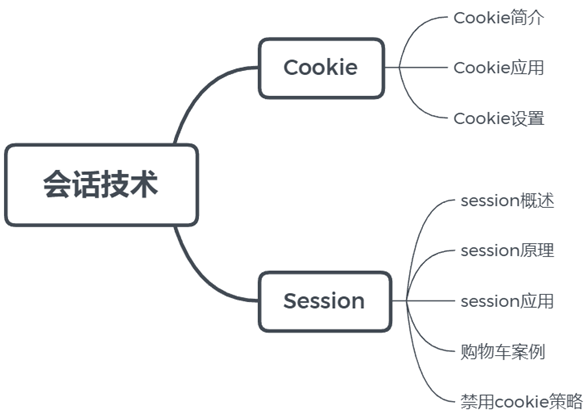
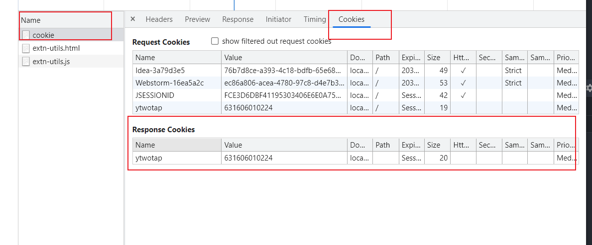
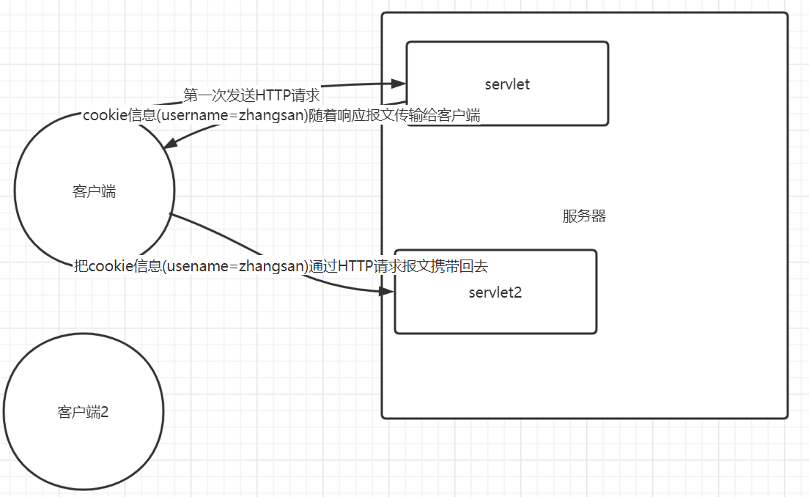
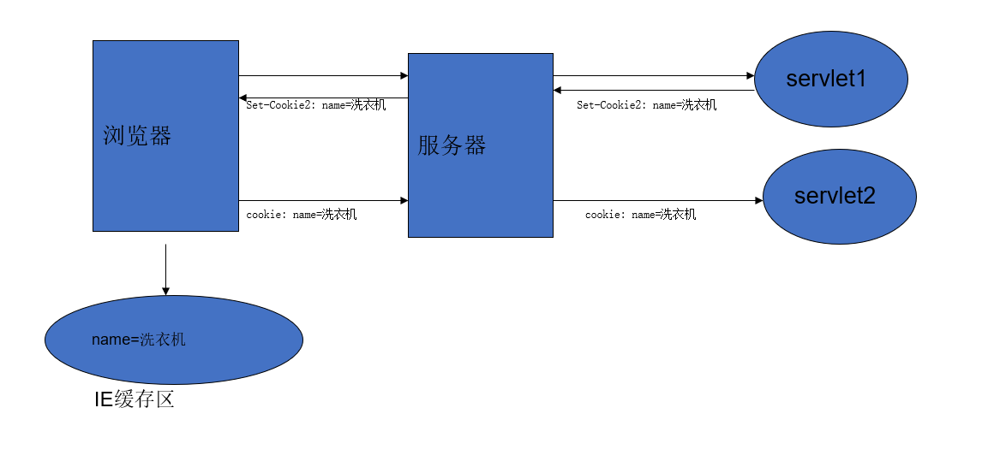
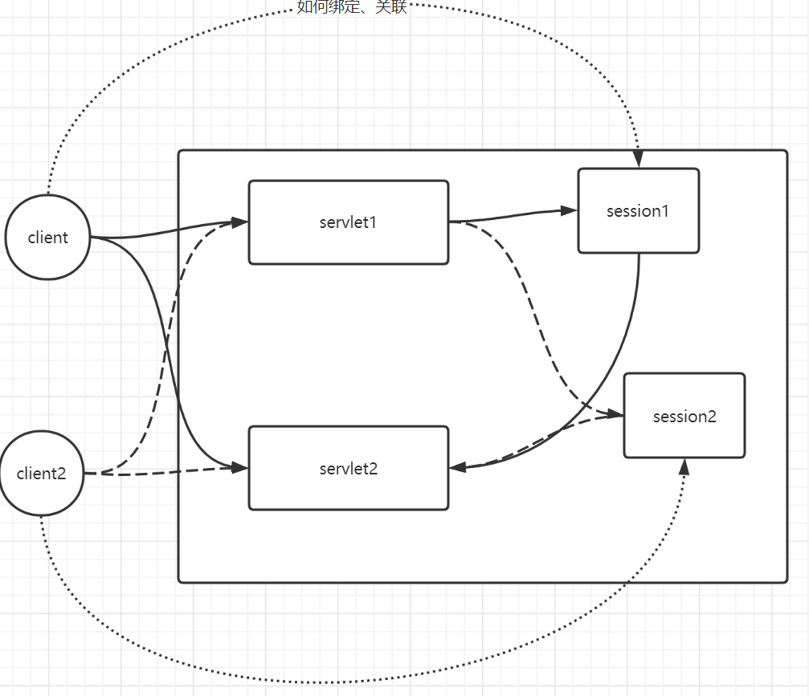
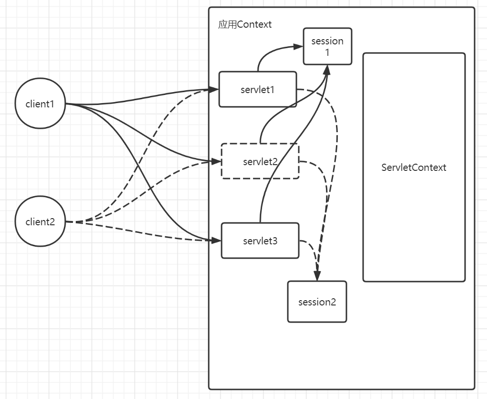
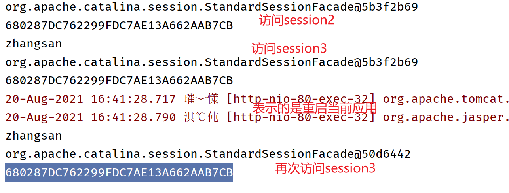
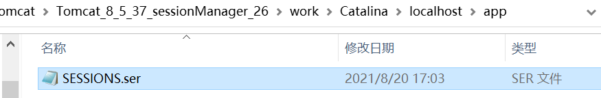
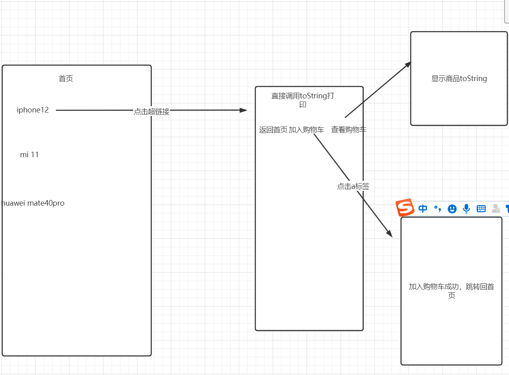

# 会话技术



## 1 会话

#### 1.1**什么是会话**

**会话**：u会话可简单理解为：用户开一个浏览器，点击多个超链接，访问同一个服务器多个web资源，然后关闭浏览器，整个过程称之为一个会话。

但是因为HTTP协议是一个**无状态协议**.在服务器看来所有的请求都是完全相同的，服务器并不能区分多个请求来自于同一个客户端还是来自于多个客户端.

#### 1.2 **会话过程中要解决的一些问题？**

每个用户在使用浏览器与服务器进行会话的过程中，不可避免各自会产生一些数据，程序要想办法为每个用户保存这些数据。

例如：用户点击超链接通过一个servlet购买了一个商品，程序应该想办法保存用户购买的商品，以便于用户点结帐servlet时，结帐servlet可以得到用户购买的商品为用户结帐。


**有状态会话**: 一个同学来过教师，下次再来教室，我们会知道这个同学曾经来过，称之为有状态会话。

**你能怎么证明你是升达的学生？**

​	你							升达

1.学生证 		升达给你发学生证

2.学校登记 	升达标记你来过了

**一个网站，怎么证明你来过了？**

​	客户端					服务端

1.服务端给客户端一个信件，客户端下次访问服务器带上信件就可以了 。Cookie

2.服务器登记你来过了，下次你来的时候我来匹配你。Session

## 2保存会话的两种技术

**Cookie**

- 客户端技术（响应，请求）

**Session**

- 服务器技术，利用这个技术可以保存用户的会话信息。我们可以把信息或者数据放在Session中

常见例子：网站登陆之后，下次就不需要再次登录。

#### 2.1 如何在google chrome查看cookie



### 

## 客户端技术

代表是cookie。一小部分数据。**该数据的产生是在服务器上面产生**的，产生之后，数据会随着HTTP响应报文（响应头）传输给客户端，**客户端会随即将该数据保存在浏览器中**，当浏览器下次再去访问服务器时，浏览器就会把该cookie信息再次携带回给服务器（请求头），服务器就知道了请求来自于哪个客户端。



cookie的本质：

**数据的产生是在服务器，服务器产生这个数据之后，接下来通过set-Cookie响应头，将该数据返回给客户端，客户端会将该数据保存，当客户端下次再去访问服务器时，通过Cookie请求头将信息再次携带回给服务器，服务器取出cookie请求头里面的信息，就可以知道了是哪个客户端**。

### Cookie的使用

> doc:https://tomcat.apache.org/tomcat-0-doc/servletapi/javax/servlet/http/Cookie.html

Creates a cookie, a small amount of information sent by a servlet to a Web browser, saved by the browser, and later sent back to the server. A cookie's value can uniquely identify a client, so cookies are commonly used for session management.

A cookie has a name, a single value, and optional attributes such as a comment, path and domain qualifiers, a maximum age, and a version number. Some Web browsers have bugs in how they handle the optional attributes, so use them sparingly to improve the interoperability of your servlets.

The servlet sends cookies to the browser by using the [`HttpServletResponse.addCookie(javax.servlet.http.Cookie)`](https://tomcat.apache.org/tomcat-0-doc/servletapi/javax/servlet/http/HttpServletResponse.html#addCookie(javax.servlet.http.Cookie)) method, which adds fields to HTTP response headers to send cookies to the browser, one at a time. The browser is expected to support 20 cookies for each Web server, 300 cookies total, and may limit cookie size to 4 KB each.

The browser returns cookies to the servlet by adding fields to HTTP request headers. Cookies can be retrieved from a request by using the [`HttpServletRequest.getCookies()`](https://tomcat.apache.org/tomcat-0-doc/servletapi/javax/servlet/http/HttpServletRequest.html#getCookies()) method. Several cookies might have the same name but different path attributes.

Cookies affect the caching of the Web pages that use them. HTTP 1.0 does not cache pages that use cookies created with this class. This class does not support the cache control defined with HTTP 1.1.

This class supports both the Version 0 (by Netscape) and Version 1 (by RFC 2109) cookie specifications. By default, cookies are created using Version 0 to ensure the best interoperability.

- **See Also:**

  [Serialized Form](https://tomcat.apache.org/tomcat-0-doc/servletapi/serialized-form.html#javax.servlet.http.Cookie)


Cookie是客户端(浏览器)技术，服务器程序把每个用户的数据以**cookie的形式**写给用户各自的浏览器。当用户使用浏览器再去访问服务器中的web资源时，就会**带着各自的数据**去访问。这样，WEB服务器就能通过cookie去识别用户了。web资源处理的就是用户各自的数据了。

####  **Cookie**的本质

Cookie的本质其实就是在服务器生成一小部分数据，数据放入响应报文中，以Set-Cookie:key=value响应头的形式发送给客户端.客户端将key=value保存，下次访问服务器时，将数据放入请求报文中，以Cookie:key=value请求头的形式传输给服务器.




Creates a cookie, a small amount of information sent by a servlet to a Web browser, saved by the browser, and later sent back to the server. A cookie's value can uniquely identify a client, so cookies are commonly used for session management.


```java
package com.cskaoyan.cookie;

import javax.servlet.ServletException;
import javax.servlet.annotation.WebServlet;
import javax.servlet.http.Cookie;
import javax.servlet.http.HttpServlet;
import javax.servlet.http.HttpServletRequest;
import javax.servlet.http.HttpServletResponse;
import java.io.IOException;

@WebServlet("/cookie")
public class CookieServlet extends HttpServlet {
    protected void doPost(HttpServletRequest request, HttpServletResponse response) throws ServletException, IOException {

    }

    protected void doGet(HttpServletRequest request, HttpServletResponse response) throws ServletException, IOException {
        //cookie是一个class，直接new一个cookie对象
        Cookie cookie = new Cookie("username", "zhangsan");
        //通过set-Cookie:usename=zhangsan发送给客户端
        //实际上EE规范同样给我们提供了一个简便的方式，用来发送cookie给客户端
        //开发者只需要调用该方法，那么服务器会帮我们去取出key和value值，然后生成set-Cookie响应头
        response.addCookie(cookie);
    }
}
```

通过HTTP去访问，应当去看什么东西？

1.第一次访问主要关注set-Cookie响应头（此时正常情况下来说，应该是不会有cookie请求头）

2.第二次访问主要关注Cookie请求头


### 案例一

使用cookie来实现登录功能，要求，用户输入用户名、密码进行登录，登录成功之后页面显示出当前用户的用户名。

在学习cookie之前，如果我希望可以在页面显示用户的用户名，可以怎么做？可以用转发。

login.html--------->LoginServlet(username  reqeust域)---------转发到另外一个servlet（取出username）


```html
<!DOCTYPE html>
<html lang="en">
<head>
    <meta charset="UTF-8">
    <title>Title</title>
</head>
<body>
    <form action="/app/login" method="post">
        <input type="text" name="username"><br>
        <input type="password" name="password"><br>
        <input type="submit">
    </form>
</body>
</html>
```

```java
package com.cskaoyan.cookie;

import javax.servlet.ServletException;
import javax.servlet.annotation.WebServlet;
import javax.servlet.http.Cookie;
import javax.servlet.http.HttpServlet;
import javax.servlet.http.HttpServletRequest;
import javax.servlet.http.HttpServletResponse;
import java.io.IOException;

@WebServlet("/login")
public class LoginServlet extends HttpServlet {
    protected void doPost(HttpServletRequest request, HttpServletResponse response) throws ServletException, IOException {
        response.setContentType("text/html;charset=utf-8");
        String username = request.getParameter("username");
        //假设进行校验，用户名、密码校验通过   JDBC
        Cookie cookie = new Cookie("username", username);
        response.addCookie(cookie);
        //登录完成之后进行页面的跳转
        response.getWriter().println("登录成功，即将跳转至个人主页");
        response.setHeader("refresh","2;url=" + request.getContextPath() + "/info");
    }

    protected void doGet(HttpServletRequest request, HttpServletResponse response) throws ServletException, IOException {

    }
}
```

```java
package com.cskaoyan.cookie;

import javax.servlet.ServletException;
import javax.servlet.annotation.WebServlet;
import javax.servlet.http.Cookie;
import javax.servlet.http.HttpServlet;
import javax.servlet.http.HttpServletRequest;
import javax.servlet.http.HttpServletResponse;
import java.io.IOException;

@WebServlet("/info")
public class InfoServlet extends HttpServlet {
    protected void doPost(HttpServletRequest request, HttpServletResponse response) throws ServletException, IOException {

    }

    protected void doGet(HttpServletRequest request, HttpServletResponse response) throws ServletException, IOException {
        //从请求头里面取出cookie信息，显示在页面上
        //该API的原理相当于在HTTP请求报文被拆封成request对象时，将请求头进行封装
        //相当于获取指定的请求头，然后封装成cookie[]
        Cookie[] cookies = request.getCookies();
        if(cookies != null){
            for (Cookie cookie : cookies) {
                if("username".equals(cookie.getName())){
                    response.getWriter().println(cookie.getValue());
                }
            }
        }
    }
}
```

### 案例二

​	显示上次访问当前页面的时间。


```java
package com.cskaoyan.cookie;

import javax.servlet.ServletException;
import javax.servlet.annotation.WebServlet;
import javax.servlet.http.Cookie;
import javax.servlet.http.HttpServlet;
import javax.servlet.http.HttpServletRequest;
import javax.servlet.http.HttpServletResponse;
import java.io.IOException;
import java.util.Date;

@WebServlet("/last")
public class LastLoginServlet extends HttpServlet {
    protected void doPost(HttpServletRequest request, HttpServletResponse response) throws ServletException, IOException {

    }

    protected void doGet(HttpServletRequest request, HttpServletResponse response) throws ServletException, IOException {
        //生成一个cookie信息
        Cookie[] cookies = request.getCookies();
        if(cookies != null){
            for (Cookie cookie : cookies) {
                if("lastLogin".equals(cookie.getName())){
                    String value = cookie.getValue();
                    // Long.parseLong----Integer.parsetInt  "111111"--->11111
                    Date date = new Date(Long.parseLong(value));
                    response.getWriter().println(date);
                }
            }
        }
        // cookie的value指里面不可以有空格
        Cookie cookie = new Cookie("lastLogin", System.currentTimeMillis() + "");
        response.addCookie(cookie);
    }
}
```

### cookie设置

#### 设置存活时间

如果cookie没有设置存活时间，则cookie默认情况下是存储在浏览器的内存中的，浏览器关闭，则cookie失效；如果希望cookie能够持久化保存，则应当设置一个时间。

```java
Cookie cookie = new Cookie("lastLogin", System.currentTimeMillis() + "");
//单位是秒
cookie.setMaxAge(180);
response.addCookie(cookie);
```

设置正数，表示存活多少秒

设置负数，表示的是存活在浏览器内存中，和没有设置是一样的

**设置0，表示的是删除cookie**

```java
package com.cskaoyan.cookie;

import javax.servlet.ServletException;
import javax.servlet.annotation.WebServlet;
import javax.servlet.http.Cookie;
import javax.servlet.http.HttpServlet;
import javax.servlet.http.HttpServletRequest;
import javax.servlet.http.HttpServletResponse;
import java.io.IOException;
import java.util.Date;

@WebServlet("/last")
public class LastLoginServlet extends HttpServlet {
    protected void doPost(HttpServletRequest request, HttpServletResponse response) throws ServletException, IOException {

    }

    protected void doGet(HttpServletRequest request, HttpServletResponse response) throws ServletException, IOException {
        //生成一个cookie信息
        Cookie[] cookies = request.getCookies();
        if(cookies != null){
            for (Cookie cookie : cookies) {
                if("lastLogin".equals(cookie.getName())){
                    String value = cookie.getValue();
                    // Long.parseLong----Integer.parsetInt  "111111"--->11111
                    Date date = new Date(Long.parseLong(value));
                    response.getWriter().println(date);
                    //特别注意一点：这里设置maxAge=0只是服务器设置了cookie对象
                    //但是你要清楚cookie是保存在哪的？保存在客户端的？
                    //服务器是没法直接删除cookie的，服务器给客户端发送了一个指示，让客户端去删除cookie
                    response.addCookie(cookie);
                }
            }
        }
        // cookie的value指里面不可以有空格
        Cookie cookie = new Cookie("lastLogin", System.currentTimeMillis() + "");
        //单位是秒
//        cookie.setMaxAge(180);

        response.addCookie(cookie);
    }
}
```

```java
package com.cskaoyan.cookie;

import javax.servlet.ServletException;
import javax.servlet.annotation.WebServlet;
import javax.servlet.http.Cookie;
import javax.servlet.http.HttpServlet;
import javax.servlet.http.HttpServletRequest;
import javax.servlet.http.HttpServletResponse;
import java.io.IOException;
import java.util.Date;

@WebServlet("/last2")
public class LastLoginServlet2 extends HttpServlet {
    protected void doPost(HttpServletRequest request, HttpServletResponse response) throws ServletException, IOException {

    }

    protected void doGet(HttpServletRequest request, HttpServletResponse response) throws ServletException, IOException {
        //生成一个cookie信息
        Cookie[] cookies = request.getCookies();
        if(cookies != null){
            for (Cookie cookie : cookies) {
                if("lastLogin".equals(cookie.getName())){
                    String value = cookie.getValue();
                    // Long.parseLong----Integer.parsetInt  "111111"--->11111
                    Date date = new Date(Long.parseLong(value));
                    response.getWriter().println(date);
                    //特别注意一点：这里设置maxAge=0只是服务器设置了cookie对象
                    //但是你要清楚cookie是保存在哪的？保存在客户端的？
                    //服务器是没法直接删除cookie的，服务器给客户端发送了一个指示，让客户端去删除cookie
                    cookie.setMaxAge(0);
                    response.addCookie(cookie);
                }
            }
        }
    }
}
```

首先在last中生成一个cookie信息，在last2中我们获取到该cookie信息，打印出来，同时设置MaxAge=0

同时还需要再次设置response.addCookie(cookie)将该cookie的设置返回给客户端，客户端拿到该设置以后就会删除该cookie，下次再次访问时，就不会携带cookie了、

#### 设置路径

默认情况下，当访问当前主机下所有资源时都会携带cookie，可以设置一个path，仅当访问指定路径时才会携带cookie。有的页面，访问静态资源文件不需要携带cookie，只设置访问某个html时才携带cookie

```java
package com.cskaoyan.cookie;

import javax.servlet.ServletException;
import javax.servlet.annotation.WebServlet;
import javax.servlet.http.Cookie;
import javax.servlet.http.HttpServlet;
import javax.servlet.http.HttpServletRequest;
import javax.servlet.http.HttpServletResponse;
import java.io.IOException;

@WebServlet("/path")
public class PathServlet extends HttpServlet {
    protected void doPost(HttpServletRequest request, HttpServletResponse response) throws ServletException, IOException {

    }

    protected void doGet(HttpServletRequest request, HttpServletResponse response) throws ServletException, IOException {
        Cookie cookie = new Cookie("name", "path");
        cookie.setPath(request.getContextPath() + "/path2");
        response.addCookie(cookie);
    }
}
```

```java
package com.cskaoyan.cookie;

import javax.servlet.ServletException;
import javax.servlet.annotation.WebServlet;
import javax.servlet.http.Cookie;
import javax.servlet.http.HttpServlet;
import javax.servlet.http.HttpServletRequest;
import javax.servlet.http.HttpServletResponse;
import java.io.IOException;

@WebServlet("/path2")
public class PathServlet2 extends HttpServlet {
    protected void doPost(HttpServletRequest request, HttpServletResponse response) throws ServletException, IOException {

    }

    protected void doGet(HttpServletRequest request, HttpServletResponse response) throws ServletException, IOException {
        Cookie[] cookies = request.getCookies();
        if(cookies != null){
            for (Cookie cookie : cookies) {
                if("name".equals(cookie.getName())){
                    response.getWriter().println(cookie.getValue());
                }
            }
        }
    }
}
```

在path中生成了一个cookie，设置了路径是访问path2会携带，也就是说访问path时，不会携带cookie的，只有访问path2时才会携带cookie。


其中，关于删除cookie有一个注意事项，如果cookie没有设置path，则直接设置MaxAge=0就表示删除cookie

如果cookie设置了path，在删除cookie时，还需要将原先的path再写一遍

```java
package com.cskaoyan.cookie;

import javax.servlet.ServletException;
import javax.servlet.annotation.WebServlet;
import javax.servlet.http.Cookie;
import javax.servlet.http.HttpServlet;
import javax.servlet.http.HttpServletRequest;
import javax.servlet.http.HttpServletResponse;
import java.io.IOException;

@WebServlet("/path")
public class PathServlet extends HttpServlet {
    protected void doPost(HttpServletRequest request, HttpServletResponse response) throws ServletException, IOException {

    }

    protected void doGet(HttpServletRequest request, HttpServletResponse response) throws ServletException, IOException {
        Cookie cookie = new Cookie("name", "path");
        cookie.setPath(request.getContextPath() + "/path2");
        response.addCookie(cookie);
    }
}
```

```java
package com.cskaoyan.cookie;

import javax.servlet.ServletException;
import javax.servlet.annotation.WebServlet;
import javax.servlet.http.Cookie;
import javax.servlet.http.HttpServlet;
import javax.servlet.http.HttpServletRequest;
import javax.servlet.http.HttpServletResponse;
import java.io.IOException;

@WebServlet("/path2")
public class PathServlet2 extends HttpServlet {
    protected void doPost(HttpServletRequest request, HttpServletResponse response) throws ServletException, IOException {

    }

    protected void doGet(HttpServletRequest request, HttpServletResponse response) throws ServletException, IOException {
        Cookie[] cookies = request.getCookies();
        if(cookies != null){
            for (Cookie cookie : cookies) {
                if("name".equals(cookie.getName())){
                    response.getWriter().println(cookie.getValue());
                    cookie.setMaxAge(0);
                    cookie.setPath(request.getContextPath() + "/path2");
                    response.addCookie(cookie);
                }
            }
        }
    }
}
```

#### 设置域名

总的原则是浏览器是不允许设置和当前域名无关的cookie的，比如当前域名 localhost，设置了一个域名叫做aaa.com的cookie，浏览器是不允许的。


比如你申请了一个aaa.com的域名

sub.aaa.com域名属于你的吗？是的

third.sub.aaa.com域名属于你的吗？也是的

如果你设置了一个父级域名的cookie，比如设置了一个cookie的domain是aaa.com，那么接下来当你访问当前域名的子域名时，浏览器会自动帮你携带cookie，可以实现cookie的共享

设置了一个域名叫做jd.com的cookie

当你访问product.jd.com时,account.jd.com时，search.jd.com时都可以携带cookie信息。


在hosts文件中做了如下设置

127.0.0.1     ccc.com
127.0.0.1     sub.ccc.com
127.0.0.1     third.sub.ccc.com


```java
package com.cskaoyan.cookie;

import javax.servlet.ServletException;
import javax.servlet.annotation.WebServlet;
import javax.servlet.http.Cookie;
import javax.servlet.http.HttpServlet;
import javax.servlet.http.HttpServletRequest;
import javax.servlet.http.HttpServletResponse;
import java.io.IOException;

@WebServlet("/domain")
public class DomainServlet extends HttpServlet {
    protected void doPost(HttpServletRequest request, HttpServletResponse response) throws ServletException, IOException {

    }

    protected void doGet(HttpServletRequest request, HttpServletResponse response) throws ServletException, IOException {
        Cookie cookie = new Cookie("key", "doamin");
        //如果设置了改行代码，那么一定不用通过localhost来范文
        cookie.setDomain("ccc.com");
        response.addCookie(cookie);
    }
}
```

操作流程：

ccc.com/app/domain  该地址下生成一个一个cookie

紧接着访问sub.ccc.com/app以及third.sub.ccc.com/app时，发现请求头中均携带了刚刚生成的cookie信息，那么可以用来进行全局性的cookie共享

集团系统的cookie信息共享，尤其是用户的登录状态。


客户端技术的优点：

1.存储在客户端，减轻服务器的压力


缺点：

1.只可以存储字符类型，如果希望存储对象，很不方便

2.cookie存储的容量一般有限制，如果数据很大，则无法存储

3.cookie存储在客户端，不是特别安全，只可以存储一些非敏感数据


## 服务器技术

代表是session。核心其实就是在服务器内存中开辟一块空间，来给用户存储数据。


当客户端访问服务器时，服务器会给当前用户的浏览器开辟一块内存空间，那么这个内存空间就和当前的这个浏览器做一个绑定，接下来，等后续浏览器再次访问该服务时，那么就利用这块内存空间来给浏览器来提供服务，可以用来存取数据。

每有一个浏览器访问，那么就会开辟一块内存空间。二者之间做了一个绑定。




实际上，上图只有一个问题，那么就是client和session对象（内存空间）如何关联在一起

实际上就是通过cookie来关联的。session底层依赖于cookie的

**客户端访问服务时，服务器在某个场景下，会生成一个session对象（开辟一块内存空间），紧接着将该session对象的id值通过cookie返回给客户端（set-Cookie：JSESSIONID=xxxx），客户端下次访问时，就会将该id再次通过cookie请求头携带回来（Cookie:JSESSIONID=xxxx）,服务器通过去取出cookie里面的JSESSIONID的值，就可以拿到对应的session对象，就可以进行数据的共享。**


### session的使用

1.创建session对象？

EE规范给我们提供了一个方法，叫做**request.getSession();**


```
HttpSession getSession()
```

Returns the current session associated with this request, or if the request does not have a session, creates one.


```
HttpSession getSession(boolean create)
```

Returns the current `HttpSession` associated with this request or, if there is no current session and `create` is true, returns a new session.

If `create` is `false` and the request has no valid `HttpSession`, this method returns `null`.


对于方式二，如果create是true，那么它和方式一是完全等价的。


对于方式二，如果create是false，那么它有则返回，没有则返回null，不会去创建。

```java
package com.cskaoyan.session;import javax.servlet.ServletException;import javax.servlet.annotation.WebServlet;import javax.servlet.http.HttpServlet;import javax.servlet.http.HttpServletRequest;import javax.servlet.http.HttpServletResponse;import javax.servlet.http.HttpSession;import java.io.IOException;@WebServlet("/session1")public class SessionServlet extends HttpServlet {    protected void doPost(HttpServletRequest request, HttpServletResponse response) throws ServletException, IOException {    }    protected void doGet(HttpServletRequest request, HttpServletResponse response) throws ServletException, IOException {        //创建一个session对象        HttpSession session = request.getSession();        System.out.println(session);        System.out.println(session.getId());    }}
```


思考一个问题：

抓包关注什么？

第一次访问肯定会创建一个session对象，创建完session对象肯定会将session的id通过set-Cookie响应头发送给客户端。

**第二次访问该servlet，还能不能看到创建过程？能或者不能其实取决于此时有没有session对象？如何判断有没有session对象呢？其实就是根据请求报文中请求头中有没有携带有效的JSESSIONID，如果携带了一个有效的JSESSIONID，那么就可以根据id找到session对象，找到的话，则不会创建新的session对象；如果没有携带一个有效的JSESSIONID，那么就找不到session对象，找不到的话，就会创建一个新的session对象。**


2.session对象的使用

session其实也是一个域，session域。

方法和之前介绍的context域、request域的方法一模一样。


### getSession()方法的执行逻辑

request.getSession()方法，可以创建或者返回一个session对象。如果当前请求有关联的session对象，那么就返回， 如果没有关联的session对象，则创建一个新的。什么叫关联呢？

**就是看请求头中有没有携带有效的Cookie:JSESSIONID,如果携带了有效的id，那么就可以根据该id找到对应的session对象，则直接将该session对象返回，那么后续也就不会创建，也就不会有发送set-Cookie响应头的过程；如果没有携带有效的id，则会创建一个新的**。


### 登录案例

使用session来实现。

```java
package com.cskaoyan.session;

import javax.servlet.ServletException;
import javax.servlet.annotation.WebServlet;
import javax.servlet.http.*;
import java.io.IOException;

@WebServlet("/login")
public class LoginServlet extends HttpServlet {
    protected void doPost(HttpServletRequest request, HttpServletResponse response) throws ServletException, IOException {
        response.setContentType("text/html;charset=utf-8");
        String username = request.getParameter("username");
        //假设进行校验，用户名、密码校验通过   JDBC
        HttpSession session = request.getSession();
        session.setAttribute("username", username);
        //登录完成之后进行页面的跳转
        response.getWriter().println("登录成功，即将跳转至个人主页");
        response.setHeader("refresh","2;url=" + request.getContextPath() + "/info");
    }

    protected void doGet(HttpServletRequest request, HttpServletResponse response) throws ServletException, IOException {

    }
}
```

```java
package com.cskaoyan.session;

import javax.servlet.ServletException;
import javax.servlet.annotation.WebServlet;
import javax.servlet.http.*;
import java.io.IOException;

@WebServlet("/info")
public class InfoServlet extends HttpServlet {
    protected void doPost(HttpServletRequest request, HttpServletResponse response) throws ServletException, IOException {

    }

    protected void doGet(HttpServletRequest request, HttpServletResponse response) throws ServletException, IOException {
        HttpSession session = request.getSession();
        String username = (String) session.getAttribute("username");
        response.getWriter().println(username);
    }
}
```

### 三个域区别

context、request、session域

只要能够拿到同一个对象，那么就可以共享数据。

context域：整个应用中有且只有一个，无论哪个客户端访问，访问哪个servlet，拿到的都是同一个

request域：非常小。每次请求都会创建新的request对象，只有转发两个组件可以共享

session域：和用户具有强相关性。每个浏览器访问服务器，正常情况下来说，都会创建一个session对象，只要是同一个浏览器，那么访问不同servlet时，拿到的也都是同一个session对象。不同的浏览器拿到的肯定不是同一个session对象。





### 关闭浏览器，session会销毁吗，数据会丢失吗？

```java
package com.cskaoyan.session;

import javax.servlet.ServletException;
import javax.servlet.annotation.WebServlet;
import javax.servlet.http.HttpServlet;
import javax.servlet.http.HttpServletRequest;
import javax.servlet.http.HttpServletResponse;
import javax.servlet.http.HttpSession;
import java.io.IOException;

@WebServlet("/session2")
public class SessionServlet2 extends HttpServlet {
    protected void doPost(HttpServletRequest request, HttpServletResponse response) throws ServletException, IOException {

    }

    protected void doGet(HttpServletRequest request, HttpServletResponse response) throws ServletException, IOException {
        //创建一个session对象
        HttpSession session = request.getSession();
        session.setAttribute("key", "zhangsan");
        System.out.println(session);
        System.out.println(session.getId());
    }
}
```

```java
package com.cskaoyan.session;

import javax.servlet.ServletException;
import javax.servlet.annotation.WebServlet;
import javax.servlet.http.HttpServlet;
import javax.servlet.http.HttpServletRequest;
import javax.servlet.http.HttpServletResponse;
import javax.servlet.http.HttpSession;
import java.io.IOException;

@WebServlet("/session3")
public class SessionServlet3 extends HttpServlet {
    protected void doPost(HttpServletRequest request, HttpServletResponse response) throws ServletException, IOException {

    }

    protected void doGet(HttpServletRequest request, HttpServletResponse response) throws ServletException, IOException {
        //创建一个session对象
        HttpSession session = request.getSession();
        Object key = session.getAttribute("key");
        System.out.println(key);
        System.out.println(session);
        System.out.println(session.getId());
    }
}
```

```
// 访问session2org.apache.catalina.session.StandardSessionFacade@179d29a5F92C51A91C2E856E8ABC163EB7B75670//访问session3zhangsanorg.apache.catalina.session.StandardSessionFacade@179d29a5F92C51A91C2E856E8ABC163EB7B75670///-------关闭浏览器，再次访问session3nullorg.apache.catalina.session.StandardSessionFacade@5b3f2b69680287DC762299FDC7AE13A662AAB7CB
```


session没有被销毁，但是数据此时已经取不到了，丢失了。

既然没有销毁，为什么打印session的地址和id都变了呢？

**关闭浏览器之后，cookie默认情况下存在于浏览器内存中，关闭浏览器，则把cookie给丢失了，再次访问时不会携带cookie:JSESSIONID=xxx,如果不携带，则会创建一个新的session对象。**

原先的session对象，此时还没有被销毁，类似于一种不可达的状态。

你在瑞士银行有一顿黄金，但是你把密码忘了。


### 关闭服务器，session会销毁吗，数据会丢失吗？

session对象会销毁。

数据不会丢失。

验证：**千万不要通过关闭idea tomcat的关闭按钮或者重新部署来验证，否则你得不出结论**。

可以使用tomcat提供的应用的后台管理系统来关闭应用

1.需要保障本地安装的tomcat里面有manger应用

2.需要在本地安装的tomcat  conf/tomcat-users.xml文件中新增如下标签

```xml
<role rolename="manager-gui"/><user username="tomcat" password="tomcat" roles="manager-gui"/>
```

更改完毕，重启服务器，访问manager



说明了啥？

原先session在服务器即将被关闭之前，将session的id以及session里面存储的数据，全部序列化到本地硬盘上面了

重启服务器时，重新分配了一些新的session对象，将这些sessionid以及数据塞入到新的对象中。





此外还可以采用另外一种方式来验证，**直接用本地安装的tomcat来部署idea里面的应用**。


### session的生命周期

session对象的创建：

​	request.getSession() 来创建

使用：

​	session.setAttribute()

​	getAttribute

​	removeAttribute

session对象的销毁：

​	应用被卸载、服务器被关闭，但是此时数据不会丢失

​	数据会以序列化的形式持久化到本地硬盘上面

数据的销毁：

​	1.session的有效期到达（默认有效期是30min，如果30min没人访问，那么session数据被销毁，只要30min有人访问了，那么重新开始倒计时）

<session-config>
        <session-timeout>30</session-timeout>
    </session-config>

​	2.主动调用session.invalidate()方法（登录成功，session写入数据；注销按钮）


### 购物车案例

1.首页可以显示出几条商品信息（就用超链接显示商品信息）


2.当用户点击某个超链接时，进入到该商品的详情页，显示商品的信息（直接调用对象的toString），在该页面还有三个a标签。一个是返回首页，一个是加入购物车，一个是查看购物车


3.点击加入购物车按钮，会将当前商品加入到购物车中，回显加入购物车成功，返回首页


4.点击查看购物车，那么可以显示出当前购物车里面的商品信息（直接显示商品的toString）




说明：不要求考虑数量问题。


### cookie被禁用了后如何使用!!(了解)

实验演示禁用Cookie后servlet共享数据导致的问题。

解决方案：**URL重写**

1. `response. encodeRedirectURL(java.lang.String url)` 

​		用于对sendRedirect方法后的url地址进行重写。

2. `response. encodeURL(java.lang.String url)`

​		用于对表单action和超链接的url地址进行重写 

**附加：**

Session的失效 invalidate()立刻实效

Web.xml文件配置session失效时间


----

## Cookie和Session的的区别

Cookie 和 Session都是用来跟踪浏览器用户身份的会话方式，但是两者的应用场景不太一样。

**Cookie 一般用来保存用户信息** 比如①我们在 Cookie 中保存已经登录过得用户信息，下次访问网站的时候页面可以自动帮你登录的一些基本信息给填了；②一般的网站都会有保持登录也就是说下次你再访问网站的时候就不需要重新登录了，这是因为用户登录的时候我们可以存放了一个 Token 在 Cookie 中，下次登录的时候只需要根据 Token 值来查找用户即可(为了安全考虑，重新登录一般要将 Token 重写)；③登录一次网站后访问网站其他页面不需要重新登录。**Session 的主要作用就是通过服务端记录用户的状态。** 典型的场景是购物车，当你要添加商品到购物车的时候，系统不知道是哪个用户操作的，因为 HTTP 协议是无状态的。服务端给特定的用户创建特定的 Session 之后就可以标识这个用户并且跟踪这个用户了。

Cookie 数据保存在客户端(浏览器端)，Session 数据保存在服务器端。

Cookie 存储在客户端中，而Session存储在服务器上，相对来说 Session 安全性更高。如果使用 Cookie 的一些敏感信息不要写入 Cookie 中，最好能将 Cookie 信息加密然后使用到的时候再去服务器端解密。


