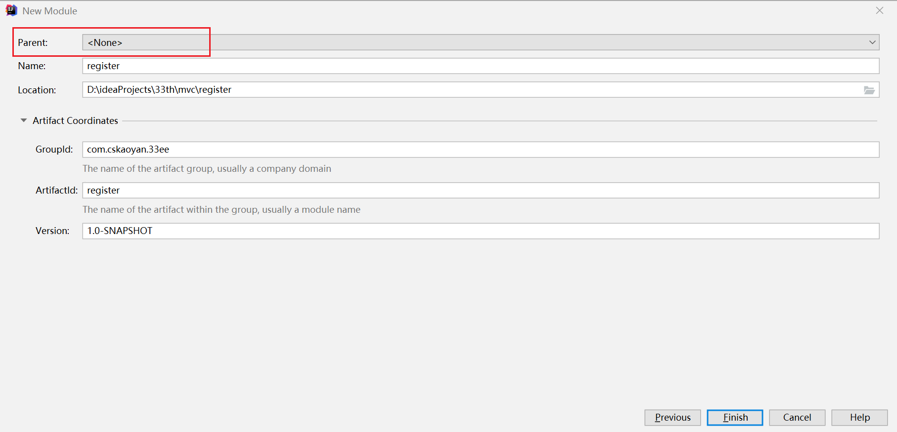
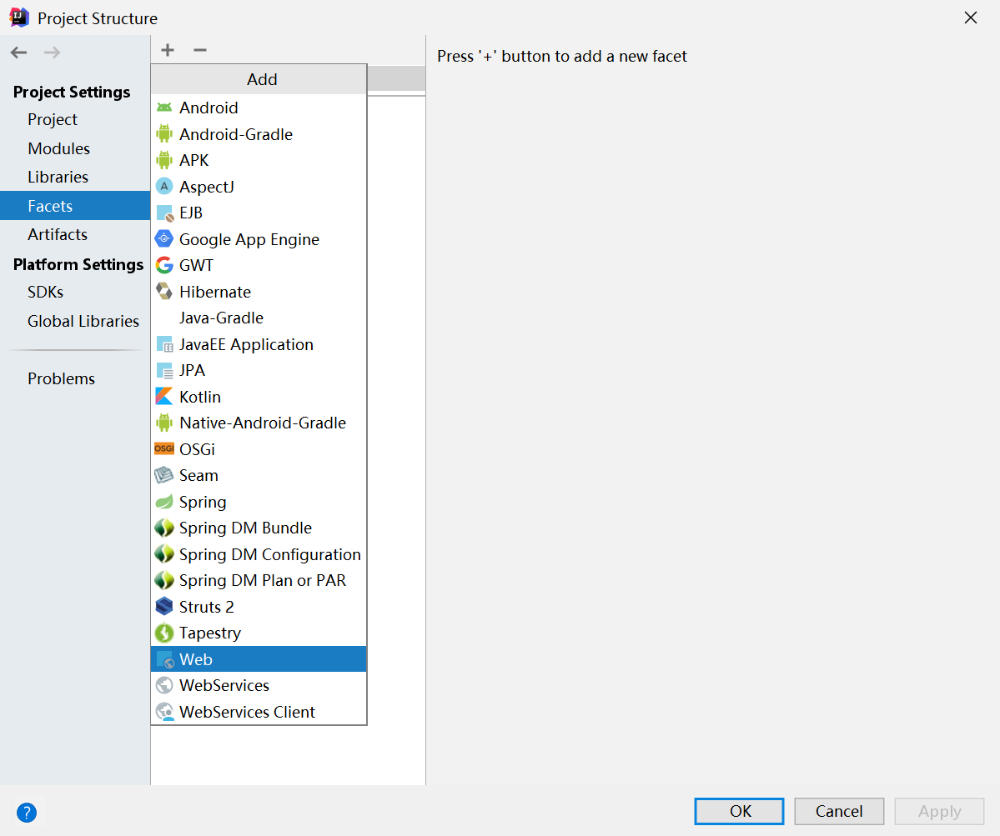
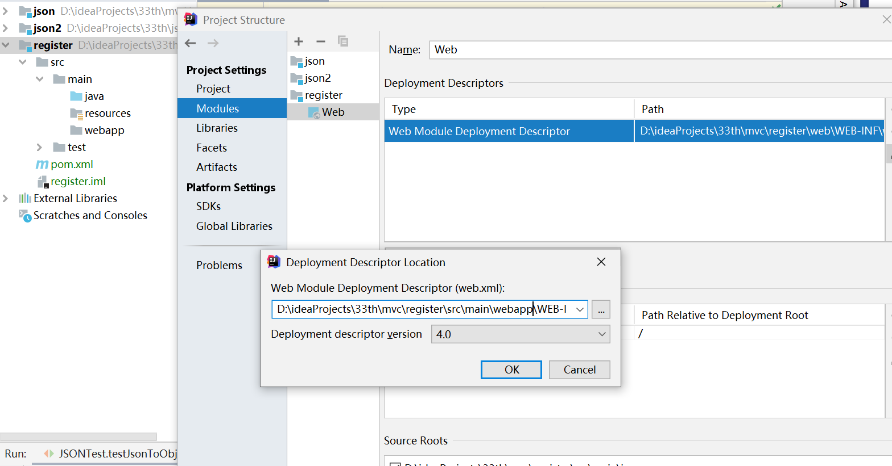
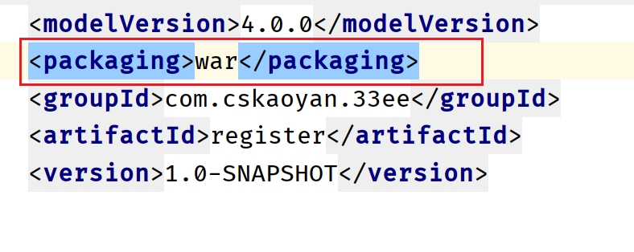
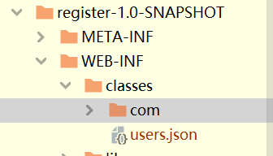
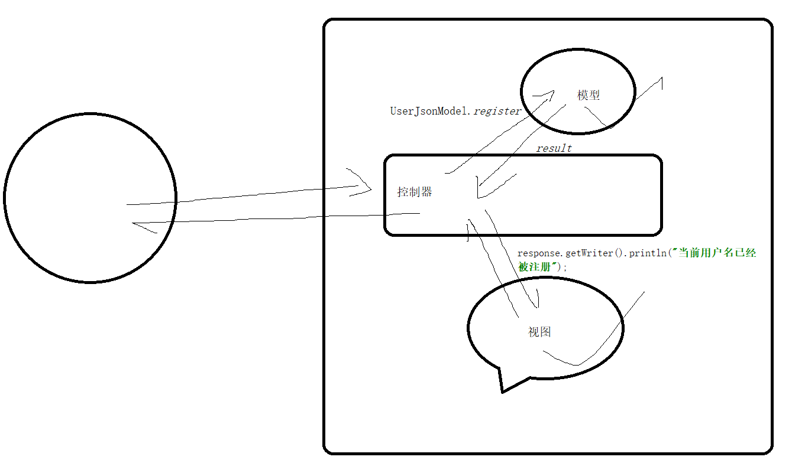
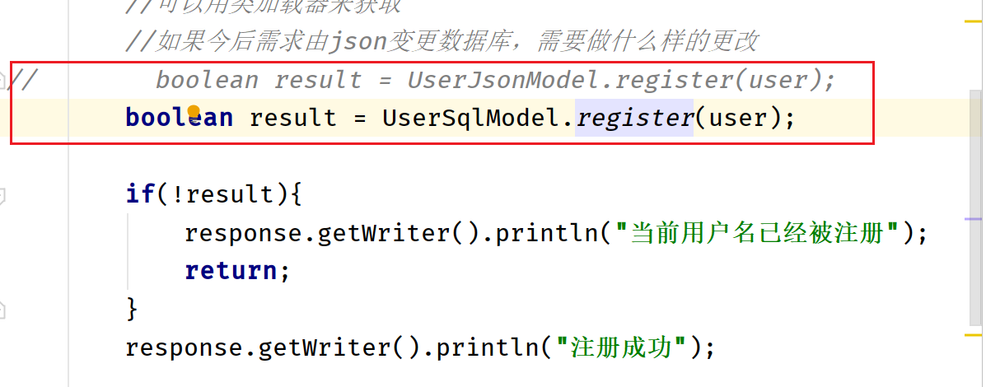
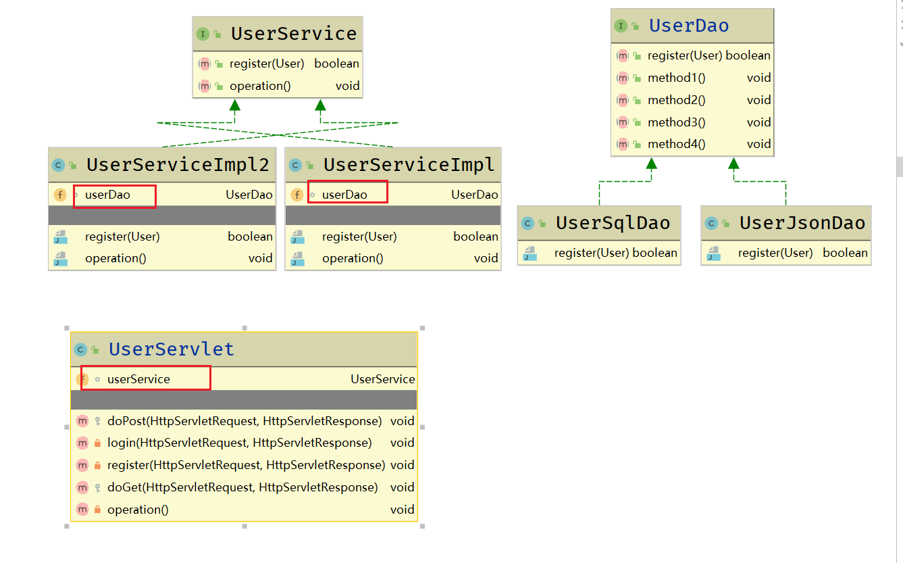

# MVC

## JSON

JSON是一个数据格式。说白了就是js里面的对象（数据的结构）

表示一个学生信息  student   name、age、province

{name:"jingtian", age:26,province:"henan"}   ---js里面的对象


json数据如何写？如何理解？

记住以下几个结论就可以了

**如果看到{}表示的是一个对象**

**如果看到的是[]表示的是一个数组或者集合**


xml之前是作为一个数据交互的格式。手机客户端和服务器之间进行数据交换，采用什么样的数据格式来交互彼此的数据呢？

xml。xml相较于key=value型数据，最大的优势是可以表示数据之间的关系。可以表现出层级的关系。

xml渐渐地被人们抛弃了。主要是传输的效率不是特别的高（xml具有非常严格的标签）

后面被json取代了。

而目前xml主要用在一些框架、软件的配置文件中。


```js
var country = {name:"中国",province:[{name:"黑龙江", cities:["哈尔滨","大庆"]},
                {name:"广东", cities:["广州","深圳"]},
                {name:"台湾", cities:["台北","高雄"]},
                {name:"新建", cities:["乌鲁木齐","喀什"]}]}
```

 var country ={
            "name":"中国",
             "province":[{"name":"黑龙江",”cities”:["哈尔滨","大庆"]},
		          {"name":"广东","cities":["广州","深圳","珠海"]},
		          {"name":"台湾","cities":["台北","高雄"]},
		          {"name":"新疆","cities":["乌鲁木齐"]}
                                   ]
                   }


两者之间有什么样的区别呢？

第一种写法指的是js的对象（json）；第二种的写法你可以认为是js对象的字符串（json字符串）

可以通俗的理解为前者相当于java对象，后者相当于调用了toString方法


**在前后端进行数据传输的过程中，一般情况下，我们都是以json字符串的形式来进行传输的。**


比如说登录页面，之前提交参数是通过form表单，以key=value型进行提交

其实你也可以使用json字符串的形式进行提交 

{"username":"admin","password":"admin"}


### 使用json

java语言也是可以使用json相关的数据的。

1.将java对象转成json字符串

​	**前后端进行交互，后端查询数据库拿到了相关数据，比如商品信息数据，需要返回给前端，需要将java对象转成json字符串，交给前端进行进一步处理**


```java
public class MainTest {

    public static void main(String[] args) {
        //将java对象转成json字符串
        //  {“name”:"admin", "province":"hubei"}
        Student student = new Student();
        student.setName("张三");
        student.setProvince("湖北省");
        // bejson.com  可以校验json的格式是否正确
        String jsonStr = "{\"name\":\"" + student.getName() + "\",\"province\":\"" + student.getProvince() + "\"}";
        System.out.println(jsonStr);
    }
}
```

比较麻烦。并且很多都是重复性的机械性操作，如果接下来需要我们去处理list、map等，更为繁琐

可以借助于一些类库  第三方的jar包。

google-gson

alibaba-fastjson

SpringMVC----jackson


2.将json字符串转成java对象

​	**前后端进行交互，前端页面提交了请求参数，比如登录，后端需要接收到该请求参数，然后将其保存到数据库中。**

```java
import com.google.gson.Gson;
import com.google.gson.JsonArray;
import com.google.gson.JsonElement;
import com.google.gson.JsonParser;
import org.junit.Test;

import java.util.ArrayList;
import java.util.List;

public class JSONTest {

    @Test
    public void testObjectToJson(){
        Student student = new Student();
        student.setName("张三");
        student.setAge(25);

        Gson gson = new Gson();
        String s = gson.toJson(student);
        System.out.println(s);
    }

    @Test
    public void testObjectToJson2(){
        Student student = new Student();
        student.setName("张三");
        student.setAge(25);

        Student student2 = new Student();
        student2.setName("李四");
        student2.setAge(26);

        List<Student> students = new ArrayList<>();
        students.add(student);
        students.add(student2);

        Gson gson = new Gson();
        String s = gson.toJson(students);
        System.out.println(s);
    }

    @Test
    public void testJsonToObject(){
        String jsonStr = "{\"name\":\"张三\",\"age\":25}";
        Gson gson = new Gson();
        //反射
        Student student = gson.fromJson(jsonStr, Student.class);
        System.out.println(student);
    }

    @Test
    public void testJsonToObject2(){
        String str = "[{\"name\":\"张三\",\"age\":25},{\"name\":\"李四\",\"age\":26}]";
        Gson gson = new Gson();
        // List<Student>
        //可以先对json字符串进行解析
        JsonElement jsonElement = new JsonParser().parse(str);
        //根据最外侧的括号进而判断接下来选择哪个方法
        //如果是[] getAsJsonArray  ；如果是{} getAsJsonObject
        JsonArray jsonArray = jsonElement.getAsJsonArray();
        for (JsonElement element : jsonArray) {
            //element其实就是对{"name":"张三","age":25}的封装
            Student student = gson.fromJson(element, Student.class);
            System.out.println(student);
        }
    }
}
```

## 案例

写一个案例，通过案例引入MVC

注册登录的系统。

注册页面有一个表单，表单提交数据到服务器端，需要将数据进行保存

登录页面也有一个表单，表单提交请求参数，通过和服务器存储的数据进行比对，判断用户输入的用户名、密码是否正确


需求：

首先将数据存储在json格式的文件中（不要去考虑存储在json文件中是否有性能上的问题，这个不是重点，我们只是想利用两种存储方式，进行需求变更的时候，体会如何设计才能够让代码变更尽可能少。实际是不会存储在json文件的），后续进行需求的变更，变更为使用数据库存储


### 新建Maven EE项目

还是和之前一样创建Maven项目，需要做的操作主要在新建完项目之后。



1、需要在src\main下面新建一个webapp目录

2.接下来，需要将webapp目录设置为facet web





注意一下路径

3、设置artifacts



只需要设置这一行代码足以。

```xml
<dependency>
            <groupId>javax.servlet</groupId>
            <artifactId>javax.servlet-api</artifactId>
            <version>3.1.0</version>
            <scope>provided</scope>
        </dependency>
```

关于servlet的坐标一定要记得设置provided，表示的是编译的时候需要jar包，但是运行时不需要jar包，为什么呢？因为运行时由容器来提供，tomcat来提供该jar包。


整合Maven EE项目，新建一个配置文件，放置在resources目录下，如何获取该文件的路径呢？

执行package指令，通过去观察该文件编译之后的路径，发现



classes目录下。

该目录其实就是当前应用的classpath.完全可以利用类加载器来获取该文件的绝对路径。

首先应用中的class文件位于硬盘上面的，运行时肯定是位于内存中的，这个过程是由来加载器来完成的

类加载器既然可以将你的class文件加载到内存中，那么知不知道你的class文件在硬盘上面的位置？

肯定知道。既然可以知道路径，那么接下来我们就可以利用类加载器给我们提供的一个API来获取位于classpath目录下的文件的绝对路径。

```java
package com.cskaoyan.register;

import com.google.gson.Gson;
import com.google.gson.JsonArray;
import com.google.gson.JsonElement;
import com.google.gson.JsonParser;
import org.apache.commons.beanutils.BeanUtils;
import org.apache.commons.lang3.StringUtils;

import javax.servlet.annotation.WebServlet;
import javax.servlet.http.HttpServletRequest;
import javax.servlet.http.HttpServletResponse;
import java.io.*;
import java.lang.reflect.InvocationTargetException;
import java.net.URL;
import java.util.ArrayList;
import java.util.Enumeration;
import java.util.List;
import java.util.Map;

@WebServlet("/user/*")
public class UserServlet extends javax.servlet.http.HttpServlet {
    protected void doPost(javax.servlet.http.HttpServletRequest request, javax.servlet.http.HttpServletResponse response) throws javax.servlet.ServletException, IOException {
        String requestURI = request.getRequestURI();
        String action = requestURI.replace(request.getContextPath() + "/user/", "");
        if("register".equals(action)){
            register(request, response);
        }
    }

    /**
     * 注册的逻辑
     * 取出用户名、密码，先进行校验
     * 将用户名密码进行持久化保存（首先先判断用户名是否被占用）
     * @param request
     * @param response
     */
    private void register(HttpServletRequest request, HttpServletResponse response) throws IOException {
        User user = new User();
        Map<String, String[]> params = request.getParameterMap();
        try {
            BeanUtils.populate(user, params);
        } catch (IllegalAccessException e) {
            e.printStackTrace();
        } catch (InvocationTargetException e) {
            e.printStackTrace();
        }
        //对参数进行一些校验
        //判断用户名、密码是否为空等
        if(!user.valid()){
            //这种情况下提示比较模糊，valid方法返回值指定一个规则
            //200 OK  404 为空  500 两次密码不一致
            response.getWriter().println("参数不合法");
            return;
        }
        //注册的具体业务逻辑 先使用json文件来存储数据，后续更换为数据库
        //如果配置文件放在WEB-INF中，如何处理？如何获取该文件的路径 servletContext.getRealPath();
        //如果放在resources目录下，怎么获取呢？
        //可以用类加载器来获取
        ClassLoader classLoader = UserServlet.class.getClassLoader();
        //这个方法可以用来获取classpath目录下某个文件的资源信息
        //在EE项目中，classpath指的就是WEB-INF/classes目录
        URL resource = classLoader.getResource("users.json");
        String path = resource.getPath();
        //这个获取流的方法其实就相当于域对上面这个方法又做了一层封装
        //classLoader.getResourceAsStream()
        File file = new File(path);
        //读取users.json文件里面的内容，形成字符串
        BufferedReader bufferedReader = new BufferedReader(new FileReader(file));
        //content就是文件的内容
        String content = bufferedReader.readLine();
        Gson gson = new Gson();
        List<User> userList = new ArrayList<>();
        if(!StringUtils.isEmpty(content)){
            //不为空，表示之前有人注册过；如果为空，表示之前没人注册过
            JsonElement jsonElement = new JsonParser().parse(content);
            JsonArray jsonArray = jsonElement.getAsJsonArray();
            //需要判断当前用户名是否已经被注册
            for (JsonElement element : jsonArray) {
                User u = gson.fromJson(element, User.class);
                if(user.getUsername().equals(u.getUsername())){
                    response.getWriter().println("当前用户名已经被注册");
                    return;
                }
                userList.add(u);
            }
        }
        //表示注册成功，然后写回文件中
        userList.add(user);
        //如何把一个字符串写入文件
        FileWriter fileWriter = new FileWriter(file);
        fileWriter.write(gson.toJson(userList));
        fileWriter.flush();
        fileWriter.close();
        response.getWriter().println("注册成功");

    }

    protected void doGet(javax.servlet.http.HttpServletRequest request, javax.servlet.http.HttpServletResponse response) throws javax.servlet.ServletException, IOException {

    }
}
```

### 代码变更

如果今后我需要将使用json文件来存储改为使用数据库来存储，那么需要变更的地方有哪些？

```java
//注册的具体业务逻辑 先使用json文件来存储数据，后续更换为数据库
//如果配置文件放在WEB-INF中，如何处理？如何获取该文件的路径 servletContext.getRealPath();
//如果放在resources目录下，怎么获取呢？
//可以用类加载器来获取
ClassLoader classLoader = UserServlet.class.getClassLoader();
//这个方法可以用来获取classpath目录下某个文件的资源信息
//在EE项目中，classpath指的就是WEB-INF/classes目录
URL resource = classLoader.getResource("users.json");
String path = resource.getPath();
//这个获取流的方法其实就相当于域对上面这个方法又做了一层封装
//classLoader.getResourceAsStream()
File file = new File(path);
//读取users.json文件里面的内容，形成字符串
BufferedReader bufferedReader = new BufferedReader(new FileReader(file));
//content就是文件的内容
String content = bufferedReader.readLine();
Gson gson = new Gson();
List<User> userList = new ArrayList<>();
if(!StringUtils.isEmpty(content)){
    //不为空，表示之前有人注册过；如果为空，表示之前没人注册过
    JsonElement jsonElement = new JsonParser().parse(content);
    JsonArray jsonArray = jsonElement.getAsJsonArray();
    //需要判断当前用户名是否已经被注册
    for (JsonElement element : jsonArray) {
        User u = gson.fromJson(element, User.class);
        if(user.getUsername().equals(u.getUsername())){
            response.getWriter().println("当前用户名已经被注册");
            return;
        }
        userList.add(u);
    }
}
//表示注册成功，然后写回文件中
userList.add(user);
//如何把一个字符串写入文件
FileWriter fileWriter = new FileWriter(file);
fileWriter.write(gson.toJson(userList));
fileWriter.flush();
fileWriter.close();
```

这部分代码是需要变更的，但是里面却也嵌套着一行不需要变更的代码

```java
        response.getWriter().println("当前用户名已经被注册");
        return;
```
这部分显示的代码是不需要变的


在需要变化的代码中紧紧包裹着不需要变化的代码。如何能够在更改需要变更的代码时，不会对其他不需要变更的代码产生影响。两者之间是紧密耦合在一起的。

问题：

**需要变更的代码块中紧紧耦合着不需要变化的代码，当代码变更时，不太容易维护。**


### 如何处理需要变化的代码

注释


### MVC设计模式

整个应用按照MVC设计模式会被划分成三个部分，model、view、controller

模型：封装的是数据模型（可以理解为我们使用的对象，即User），和对user的相关操作，有注册、登录等。

视图：对数据模型的一种显示。对user的显示。个人主页

控制器：利用控制器将模型和视图进行解耦。请求首先分发到控制器上面，控制器通过去调用模型的一个或者多个方法，返回一个结果，根据结果再调用视图，通过这种方式将模型和视图进行解耦。


模型部分：

```java
ClassLoader classLoader = UserServlet.class.getClassLoader();
//这个方法可以用来获取classpath目录下某个文件的资源信息
//在EE项目中，classpath指的就是WEB-INF/classes目录
URL resource = classLoader.getResource("users.json");
String path = resource.getPath();
//这个获取流的方法其实就相当于域对上面这个方法又做了一层封装
//classLoader.getResourceAsStream()
File file = new File(path);
//读取users.json文件里面的内容，形成字符串
BufferedReader bufferedReader = new BufferedReader(new FileReader(file));
//content就是文件的内容
String content = bufferedReader.readLine();
Gson gson = new Gson();
List<User> userList = new ArrayList<>();
if(!StringUtils.isEmpty(content)){
    //不为空，表示之前有人注册过；如果为空，表示之前没人注册过
    JsonElement jsonElement = new JsonParser().parse(content);
    JsonArray jsonArray = jsonElement.getAsJsonArray();
    //需要判断当前用户名是否已经被注册
    for (JsonElement element : jsonArray) {
        User u = gson.fromJson(element, User.class);
        if(user.getUsername().equals(u.getUsername())){
          
        }
        userList.add(u);
    }
}
//表示注册成功，然后写回文件中
userList.add(user);
//如何把一个字符串写入文件
FileWriter fileWriter = new FileWriter(file);
fileWriter.write(gson.toJson(userList));
fileWriter.flush();
fileWriter.close();
```

视图部分（页面）：

```java
response.getWriter().println("当前用户名已经被注册");
return;


response.getWriter().println("注册成功");

```

MVC其实主要的职责就是将模型和视图的部分进行解耦

```java
for (JsonElement element : jsonArray) {
        User u = gson.fromJson(element, User.class);
        if(user.getUsername().equals(u.getUsername())){
            response.getWriter().println("当前用户名已经被注册");
            return;
        }
        userList.add(u);
    }
}
```

就是这个地方存在问题，需要解耦。

控制器：除了这两个部分之外的servlet的部分。通俗的来说，你可以认为servlet就是在充当controller


```java
package com.cskaoyan.register.mvc;

import com.cskaoyan.register.User;
import com.google.gson.Gson;
import com.google.gson.JsonArray;
import com.google.gson.JsonElement;
import com.google.gson.JsonParser;
import org.apache.commons.beanutils.BeanUtils;
import org.apache.commons.lang3.StringUtils;

import javax.servlet.annotation.WebServlet;
import javax.servlet.http.HttpServletRequest;
import javax.servlet.http.HttpServletResponse;
import java.io.*;
import java.lang.reflect.InvocationTargetException;
import java.net.URL;
import java.util.ArrayList;
import java.util.List;
import java.util.Map;

@WebServlet("/user_bak/*")
public class UserServlet extends javax.servlet.http.HttpServlet {
    protected void doPost(HttpServletRequest request, HttpServletResponse response) throws javax.servlet.ServletException, IOException {
        String requestURI = request.getRequestURI();
        String action = requestURI.replace(request.getContextPath() + "/user/", "");
        if("register".equals(action)){
            register(request, response);
        }
    }

    /**
     * 注册的逻辑
     * 取出用户名、密码，先进行校验
     * 将用户名密码进行持久化保存（首先先判断用户名是否被占用）
     * @param request
     * @param response
     */
    private void register(HttpServletRequest request, HttpServletResponse response) throws IOException {
        User user = new User();
        Map<String, String[]> params = request.getParameterMap();
        try {
            BeanUtils.populate(user, params);
        } catch (IllegalAccessException e) {
            e.printStackTrace();
        } catch (InvocationTargetException e) {
            e.printStackTrace();
        }
        //对参数进行一些校验
        //判断用户名、密码是否为空等
        if(!user.valid()){
            //这种情况下提示比较模糊，valid方法返回值指定一个规则
            //200 OK  404 为空  500 两次密码不一致
            response.getWriter().println("参数不合法");
            return;
        }
        //注册的具体业务逻辑 先使用json文件来存储数据，后续更换为数据库
        //如果配置文件放在WEB-INF中，如何处理？如何获取该文件的路径 servletContext.getRealPath();
        //如果放在resources目录下，怎么获取呢？
        //可以用类加载器来获取
        //如果今后需求由json变更数据库，需要做什么样的更改
//        boolean result = UserJsonModel.register(user);
        boolean result = UserSqlModel.register(user);

        if(!result){
            response.getWriter().println("当前用户名已经被注册");
            return;
        }
        response.getWriter().println("注册成功");

    }

    protected void doGet(HttpServletRequest request, HttpServletResponse response) throws javax.servlet.ServletException, IOException {

    }
}

```

```java
package com.cskaoyan.register.mvc;

import com.cskaoyan.register.User;
import com.google.gson.Gson;
import com.google.gson.JsonArray;
import com.google.gson.JsonElement;
import com.google.gson.JsonParser;
import org.apache.commons.lang3.StringUtils;

import java.io.*;
import java.net.URL;
import java.util.ArrayList;
import java.util.List;

public class UserJsonModel {

    public static boolean register(User user) throws IOException {
        ClassLoader classLoader = UserJsonModel.class.getClassLoader();
        //这个方法可以用来获取classpath目录下某个文件的资源信息
        //在EE项目中，classpath指的就是WEB-INF/classes目录
        URL resource = classLoader.getResource("users.json");
        String path = resource.getPath();
        //这个获取流的方法其实就相当于域对上面这个方法又做了一层封装
        //classLoader.getResourceAsStream()
        File file = new File(path);
        //读取users.json文件里面的内容，形成字符串
        BufferedReader bufferedReader = new BufferedReader(new FileReader(file));
        //content就是文件的内容
        String content = bufferedReader.readLine();
        Gson gson = new Gson();
        List<User> userList = new ArrayList<>();
        if(!StringUtils.isEmpty(content)){
            //不为空，表示之前有人注册过；如果为空，表示之前没人注册过
            JsonElement jsonElement = new JsonParser().parse(content);
            JsonArray jsonArray = jsonElement.getAsJsonArray();
            //需要判断当前用户名是否已经被注册
            for (JsonElement element : jsonArray) {
                User u = gson.fromJson(element, User.class);
                if(user.getUsername().equals(u.getUsername())){
                    return false;
                }
                userList.add(u);
            }
        }
        //表示注册成功，然后写回文件中
        userList.add(user);
        //如何把一个字符串写入文件
        FileWriter fileWriter = new FileWriter(file);
        fileWriter.write(gson.toJson(userList));
        fileWriter.flush();
        fileWriter.close();
        return true;
    }
}
```





此时我们的代码已经符合MVC设计模式了，代码已经足够完美了嘛？


### 进一步改进成接口

为了今后扩展方便，如果希望更改的地方足够的小，我应当满足如下几个特点：

**1.不同模型的方法名都应当叫做register（方法名都应当相同）**

**2.方法里面的参数类型都相同**

**3.方法的返回值都是相同的类型（都是boolean、都是int）**

只有满足这三个条件，那么今后代码的改动才是最小的。只需要变更一个类名即可。


分析上述三点的特征，是什么的特征？接口

进一步引出三层架构。

三层架构不是MVC，其实是在MVC设计模式基础上，又进一步将代码进行解耦分离，然后形成三层架构。

此时MVC存在的问题：

1.上述三个点没有做约束

2.注册的逻辑、登录的逻辑、查询的逻辑，当需要更改的时候，全部都需要将UserJsonModel变更为UserSqlModel改动的地方其实也不少。


说明：在引入三层架构时，我们将之前模型中关于数据模型操作部分的代码进行一个改名操作，比如之前的UserJsonModel变更为UserJsonDao，引入了dao的概念。 Data Access Object。专门用来和数据进行打交道的地方。

所以，接下来，我们需要设计一个接口，叫做UserDao，有两个不同的实现类UserJsonDao和UserSqlDao

```java
package com.cskaoyan.register.level3;

import com.cskaoyan.register.User;

public interface UserDao {
    
    boolean register(User user);
}
```

```java
package com.cskaoyan.register.level3;

import com.cskaoyan.register.User;
import com.google.gson.Gson;
import com.google.gson.JsonArray;
import com.google.gson.JsonElement;
import com.google.gson.JsonParser;
import org.apache.commons.lang3.StringUtils;

import java.io.*;
import java.net.URL;
import java.util.ArrayList;
import java.util.List;

public class UserJsonDao implements UserDao{

    public boolean register(User user) {
        ClassLoader classLoader = UserJsonDao.class.getClassLoader();
        //这个方法可以用来获取classpath目录下某个文件的资源信息
        //在EE项目中，classpath指的就是WEB-INF/classes目录
        URL resource = classLoader.getResource("users.json");
        String path = resource.getPath();
        //这个获取流的方法其实就相当于域对上面这个方法又做了一层封装
        //classLoader.getResourceAsStream()
        File file = new File(path);
        //读取users.json文件里面的内容，形成字符串
        BufferedReader bufferedReader = null;
        try {
            bufferedReader = new BufferedReader(new FileReader(file));
            //content就是文件的内容
            String content = bufferedReader.readLine();
            Gson gson = new Gson();
            List<User> userList = new ArrayList<>();
            if(!StringUtils.isEmpty(content)){
                //不为空，表示之前有人注册过；如果为空，表示之前没人注册过
                JsonElement jsonElement = new JsonParser().parse(content);
                JsonArray jsonArray = jsonElement.getAsJsonArray();
                //需要判断当前用户名是否已经被注册
                for (JsonElement element : jsonArray) {
                    User u = gson.fromJson(element, User.class);
                    if(user.getUsername().equals(u.getUsername())){
                        return false;
                    }
                    userList.add(u);
                }
            }
            //表示注册成功，然后写回文件中
            userList.add(user);
            //如何把一个字符串写入文件
            FileWriter fileWriter = new FileWriter(file);
            fileWriter.write(gson.toJson(userList));
            fileWriter.flush();
            fileWriter.close();
        } catch (FileNotFoundException e) {
            e.printStackTrace();
        } catch (IOException e) {
            e.printStackTrace();
        }
        return true;
    }
}
```

```java
package com.cskaoyan.register.level3;

import com.cskaoyan.register.User;

public class UserSqlDao implements UserDao{
    public  boolean register(User user) {
        return false;
    }
}
```

此时在servlet中，写法如下：

```java
package com.cskaoyan.register.level3;

import com.cskaoyan.register.User;
import org.apache.commons.beanutils.BeanUtils;

import javax.servlet.annotation.WebServlet;
import javax.servlet.http.HttpServletRequest;
import javax.servlet.http.HttpServletResponse;
import java.io.IOException;
import java.lang.reflect.InvocationTargetException;
import java.util.Map;

@WebServlet("/user/*")
public class UserServlet extends javax.servlet.http.HttpServlet {
    protected void doPost(HttpServletRequest request, HttpServletResponse response) throws javax.servlet.ServletException, IOException {
        String requestURI = request.getRequestURI();
        String action = requestURI.replace(request.getContextPath() + "/user/", "");
        if("register".equals(action)){
            register(request, response);
        }
    }

    /**
     * 注册的逻辑
     * 取出用户名、密码，先进行校验
     * 将用户名密码进行持久化保存（首先先判断用户名是否被占用）
     * @param request
     * @param response
     */
    private void register(HttpServletRequest request, HttpServletResponse response) throws IOException {
        User user = new User();
        Map<String, String[]> params = request.getParameterMap();
        try {
            BeanUtils.populate(user, params);
        } catch (IllegalAccessException e) {
            e.printStackTrace();
        } catch (InvocationTargetException e) {
            e.printStackTrace();
        }
        //对参数进行一些校验
        //判断用户名、密码是否为空等
        if(!user.valid()){
            //这种情况下提示比较模糊，valid方法返回值指定一个规则
            //200 OK  404 为空  500 两次密码不一致
            response.getWriter().println("参数不合法");
            return;
        }
        //注册的具体业务逻辑 先使用json文件来存储数据，后续更换为数据库
        //如果配置文件放在WEB-INF中，如何处理？如何获取该文件的路径 servletContext.getRealPath();
        //如果放在resources目录下，怎么获取呢？
        //可以用类加载器来获取
        //如果今后需求由json变更数据库，需要做什么样的更改
        //这一行代码可以进一步写成成员变量
        UserDao userDao = new UserJsonDao();
        boolean result = userDao.register(user);
////        boolean result = UserJsonModel.register(user);
//        boolean result = UserSqlDao.register(user);

        if(!result){
            response.getWriter().println("当前用户名已经被注册");
            return;
        }
        response.getWriter().println("注册成功");

    }

    protected void doGet(HttpServletRequest request, HttpServletResponse response) throws javax.servlet.ServletException, IOException {

    }
}
```

```java
    UserDao userDao = new UserJsonDao();
    boolean result = userDao.register(user);
```
关于第一行代码，可以进一步将其写成成员变量，为什么呢？

因为在当前servlet中，我们处理注册、登录等逻辑，所以此时可以将userDao变成成员变量，那么接下来在处理登录、查询等逻辑时，会同步发生变化，所改动的地方进一步减少。


```java
package com.cskaoyan.register.level3;

import com.cskaoyan.register.User;
import org.apache.commons.beanutils.BeanUtils;

import javax.servlet.annotation.WebServlet;
import javax.servlet.http.HttpServletRequest;
import javax.servlet.http.HttpServletResponse;
import java.io.IOException;
import java.lang.reflect.InvocationTargetException;
import java.util.Map;

@WebServlet("/user/*")
public class UserServlet extends javax.servlet.http.HttpServlet {

    UserDao userDao = new UserJsonDao();

    protected void doPost(HttpServletRequest request, HttpServletResponse response) throws javax.servlet.ServletException, IOException {
        String requestURI = request.getRequestURI();
        String action = requestURI.replace(request.getContextPath() + "/user/", "");
        if("register".equals(action)){
            register(request, response);
        }else if("login".equals(action)){
            login(request, response);
        }
    }

    private void login(HttpServletRequest request, HttpServletResponse response) {
        //userDao.login();
    }

    /**
     * 注册的逻辑
     * 取出用户名、密码，先进行校验
     * 将用户名密码进行持久化保存（首先先判断用户名是否被占用）
     * @param request
     * @param response
     */
    private void register(HttpServletRequest request, HttpServletResponse response) throws IOException {
        User user = new User();
        Map<String, String[]> params = request.getParameterMap();
        try {
            BeanUtils.populate(user, params);
        } catch (IllegalAccessException e) {
            e.printStackTrace();
        } catch (InvocationTargetException e) {
            e.printStackTrace();
        }
        //对参数进行一些校验
        //判断用户名、密码是否为空等
        if(!user.valid()){
            //这种情况下提示比较模糊，valid方法返回值指定一个规则
            //200 OK  404 为空  500 两次密码不一致
            response.getWriter().println("参数不合法");
            return;
        }
        //注册的具体业务逻辑 先使用json文件来存储数据，后续更换为数据库
        //如果配置文件放在WEB-INF中，如何处理？如何获取该文件的路径 servletContext.getRealPath();
        //如果放在resources目录下，怎么获取呢？
        //可以用类加载器来获取
        //如果今后需求由json变更数据库，需要做什么样的更改
        //这一行代码可以进一步写成成员变量
        boolean result = userDao.register(user);
////        boolean result = UserJsonModel.register(user);
//        boolean result = UserSqlDao.register(user);

        if(!result){
            response.getWriter().println("当前用户名已经被注册");
            return;
        }
        response.getWriter().println("注册成功");

    }

    protected void doGet(HttpServletRequest request, HttpServletResponse response) throws javax.servlet.ServletException, IOException {

    }
}
```

今后，再次进行需求变更，register方法内部的代码还需要变化吗？

不需要，只需要变更成员变量userDao的指向即可。


此时三层架构已经具有了雏形，有两层。

一个是展示层  controller


**业务层  service**（为什么需要有service？此时发现代码已经设计的还不错了，基本的需求也是可以很好额实现了，那为什么还需要有service呢？）

假设如果此时业务场景有些复杂，比如再做一个试验，评估两种方式操作性能上的差异。

操作1：

dao.method1();

dao.method2();


操作2：

dao.method1();

dao.method3();

dao.method4();


需要去评估这两种操作方式的性能差异，如何能够在尽量不修改代码的前提下，去更换操作方式？

中间引入一个service层之后，那么今后你再次进行变更，**只需要扩展代码，而不是修改现有的代码逻辑**

```java
//去做一个试验  评估两种操作性能
    //你发现你又处于一种反复去修改代码去适配需求变更的地步
    private void operation(){       
        //方式1：
//        userDao.method1();
//        userDao.method2();
        //方式2：
        userDao.method1();
        userDao.method3();
        userDao.method4();
    }
```

这个地方可以进一步优化

```java
package com.cskaoyan.register.level3;

import com.cskaoyan.register.User;

public interface UserService {
    
    boolean register(User user);
    
    void operation();
}
```

```java
package com.cskaoyan.register.level3;

import com.cskaoyan.register.User;

public class UserServiceImpl implements UserService {

    UserDao userDao = new UserJsonDao();

    @Override
    public boolean register(User user) {
        return userDao.register(user);
    }

    @Override
    public void operation() {
        userDao.method1();
        userDao.method2();
    }
}
```

```java
package com.cskaoyan.register.level3;

import com.cskaoyan.register.User;

public class UserServiceImpl2 implements UserService {

    UserDao userDao = new UserJsonDao();

    @Override
    public boolean register(User user) {
        return userDao.register(user);
    }

    @Override
    public void operation() {
        userDao.method1();
        userDao.method3();
        userDao.method4();
    }
}
```

```java
package com.cskaoyan.register.level3;

import com.cskaoyan.register.User;
import org.apache.commons.beanutils.BeanUtils;

import javax.servlet.annotation.WebServlet;
import javax.servlet.http.HttpServletRequest;
import javax.servlet.http.HttpServletResponse;
import java.io.IOException;
import java.lang.reflect.InvocationTargetException;
import java.util.Map;

@WebServlet("/user/*")
public class UserServlet extends javax.servlet.http.HttpServlet {

    //UserDao userDao = new UserJsonDao();

    UserService userService = new UserServiceImpl();

    protected void doPost(HttpServletRequest request, HttpServletResponse response) throws javax.servlet.ServletException, IOException {
        String requestURI = request.getRequestURI();
        String action = requestURI.replace(request.getContextPath() + "/user/", "");
        if("register".equals(action)){
            register(request, response);
        }else if("login".equals(action)){
            login(request, response);
        }
    }

    private void login(HttpServletRequest request, HttpServletResponse response) {
        //userDao.login();
    }

    /**
     * 注册的逻辑
     * 取出用户名、密码，先进行校验
     * 将用户名密码进行持久化保存（首先先判断用户名是否被占用）
     * @param request
     * @param response
     */
    private void register(HttpServletRequest request, HttpServletResponse response) throws IOException {
        User user = new User();
        Map<String, String[]> params = request.getParameterMap();
        try {
            BeanUtils.populate(user, params);
        } catch (IllegalAccessException e) {
            e.printStackTrace();
        } catch (InvocationTargetException e) {
            e.printStackTrace();
        }
        //对参数进行一些校验
        //判断用户名、密码是否为空等
        if(!user.valid()){
            //这种情况下提示比较模糊，valid方法返回值指定一个规则
            //200 OK  404 为空  500 两次密码不一致
            response.getWriter().println("参数不合法");
            return;
        }
        //注册的具体业务逻辑 先使用json文件来存储数据，后续更换为数据库
        //如果配置文件放在WEB-INF中，如何处理？如何获取该文件的路径 servletContext.getRealPath();
        //如果放在resources目录下，怎么获取呢？
        //可以用类加载器来获取
        //如果今后需求由json变更数据库，需要做什么样的更改
        //这一行代码可以进一步写成成员变量
        boolean result = userService.register(user);
////        boolean result = UserJsonModel.register(user);
//        boolean result = UserSqlDao.register(user);

        if(!result){
            response.getWriter().println("当前用户名已经被注册");
            return;
        }
        response.getWriter().println("注册成功");

    }

    protected void doGet(HttpServletRequest request, HttpServletResponse response) throws javax.servlet.ServletException, IOException {

    }

    //去做一个试验  评估两种操作性能
    //你发现你又处于一种反复去修改代码去适配需求变更的地步
    private void operation(){
        //方式1：
//        userDao.method1();
//        userDao.method2();
        //方式2：
//        userDao.method1();
//        userDao.method3();
//        userDao.method4();
        userService.operation();
    }
}
```



controller引用service，service引用dao


展示层

业务层

数据层

通俗的说也可以认为是

controller

service

dao

一个项目至少应当保证有三层。


一个是数据层  dao


service和dao的代码其实就是对之前model，也就是对数据模型的操作部分的代码进行进一步解耦。

引入三层架构之后，整个程序的执行入口依然是位于servlet的service方法