# spring ioc

> code:https://github.com/ytwotap/spring_study
>

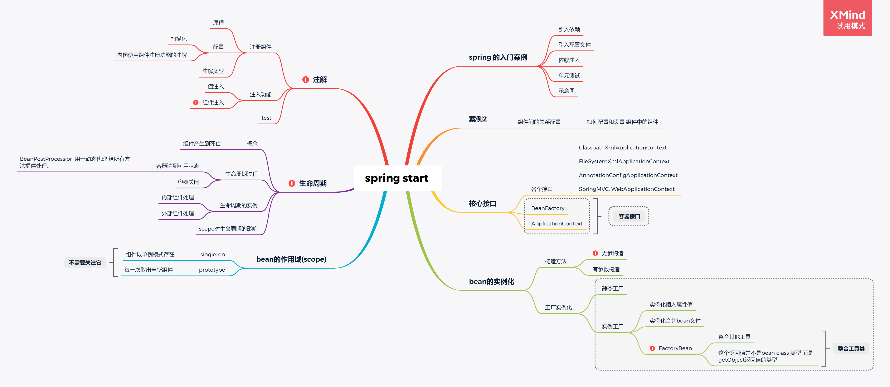

# 1   Spring的入门案例1

开始使用Spring

## 1.1  创建一个maven工程，提供一个userService

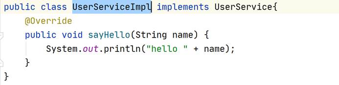

## 1.2  引入依赖

spring-context、core、expression、beans、aop

jcl

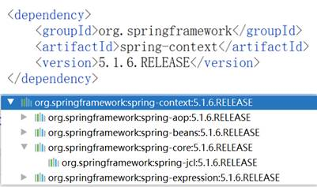

## 1.3  引入配置文件

目的是啥？引入一些配置、注册组件（控制反转）

xml格式 → 头 schema约束 → 我们可以写哪一些标签、标签里的属性、标签里的子标签、标签的顺序

 

引入Spring的schema约束：

1、 已有的配置文件

2、 Spring官网

3、 创建文件模板

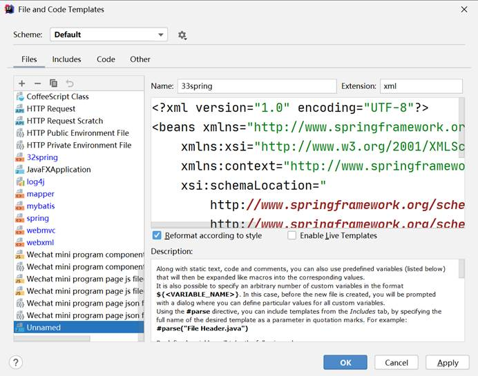

## 1.4  控制反转（注册组件）

在Spring配置文件中注册组件

将实例交给Spring容器来进行管理，我们要知道实例是谁

使用的是全限定类名

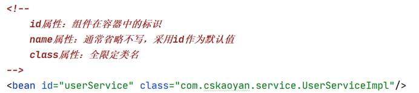

## 1.5  依赖注入

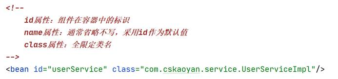

## 1.6  单元测试

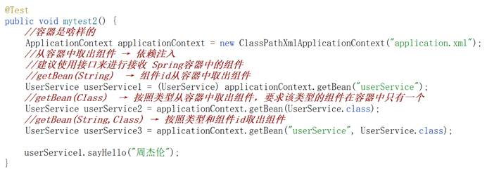

## 1.7  示意图

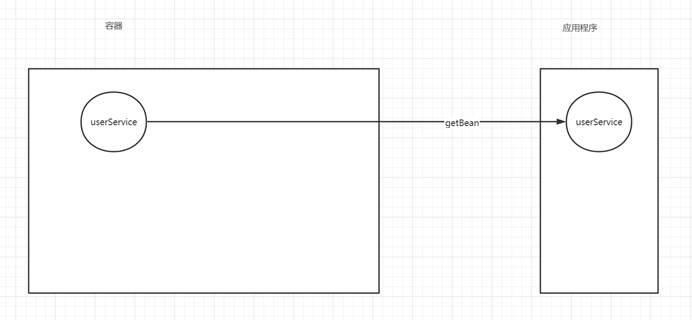

# 2   Spring的入门案例2

维护Spring容器中的组件之间的关系

再注册一个dao组件

## 2.1  配置组件之间的依赖关系

property子标签调用set方法来完成的

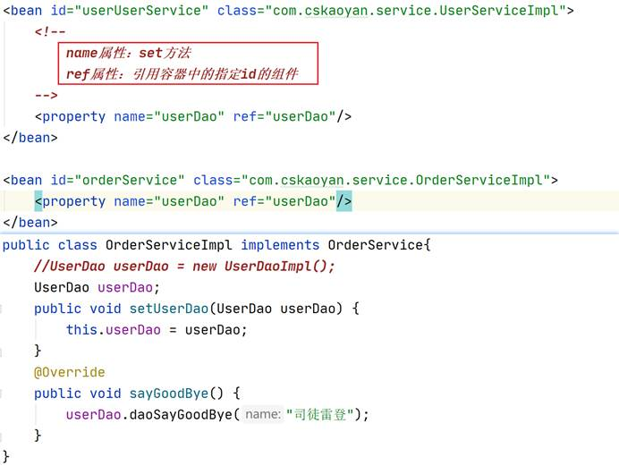

## 2.2  示意图

关注这个过程

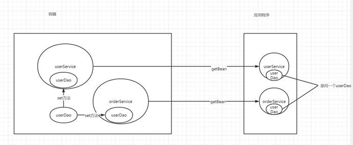

# 3   Spring的核心接口

## 3.1  ApplicationContext接口

 容器

ClasspathXmlApplicationContext

FileSystemXmlApplicationContext

AnnotationConfigApplicationContext

SpringMVC: WebApplicationContext

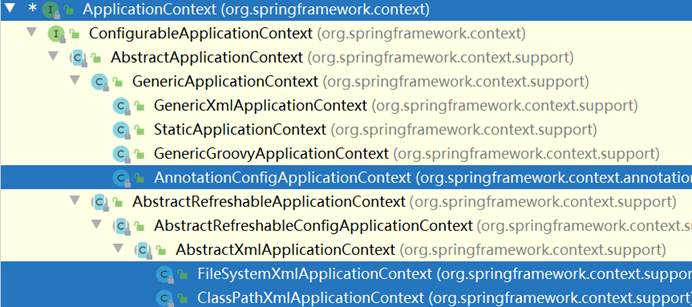

## 3.2  BeanFactory接口

生产bean，生产全部bean，容器。ApplicationContext接口继承了BeanFactory接口

 

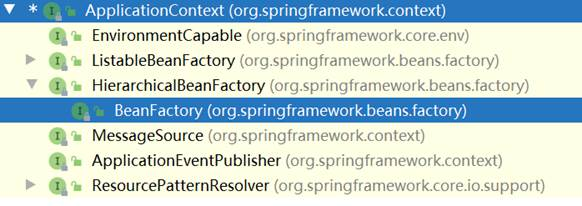

 

# 4   Spring容器中的Bean的实例化

Spring核心 控制反转，控制实例的生成

## 4.1  构造方法

### 4.1.1 ★无参构造方法

默认使用的就是无参构造方法，最常用的方式

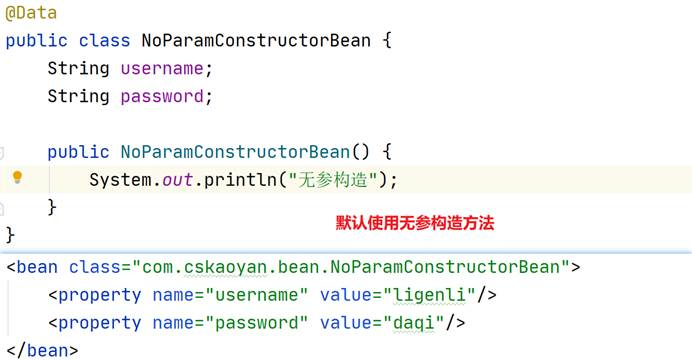

### 4.1.2 有参构造方法

## 4.2  工厂

### 4.2.1 静态工厂

工厂里的生产方法是静态方法

### 4.2.2 实例工厂

工厂里的方法不是静态的方法

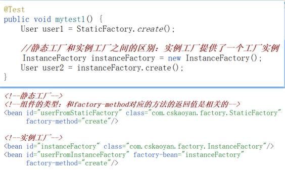

### 4.2.3 单元测试

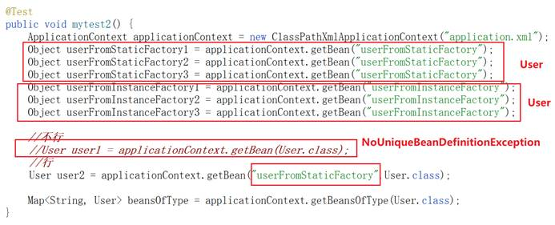

### 4.2.4 ★FactoryBean → 工厂方法

#### 4.2.4.1      FactoryBean接口

getObject

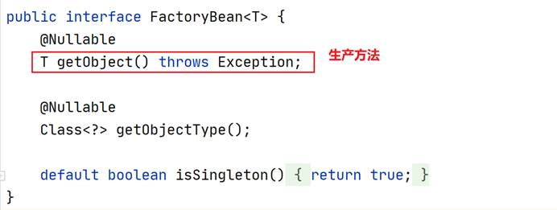

#### 4.2.4.2 自定义FactoryBean

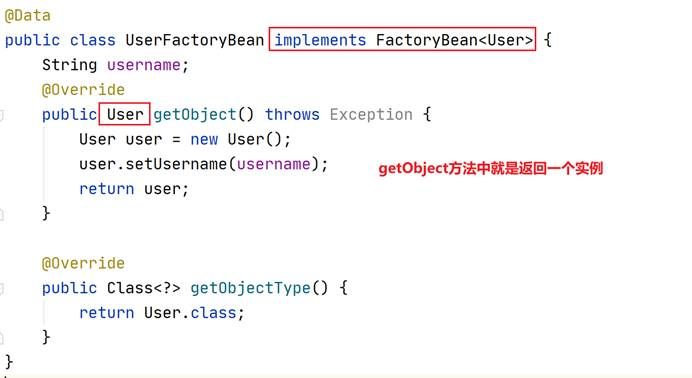

#### 4.2.4.3 注册组件

通过FactoryBean注册的组件类型：和getObject方法的返回值是相关的

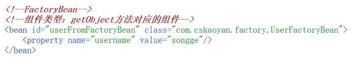

#### 4.2.4.4 BeanFactory和FactoryBean

都可以注册组件

**BeanFactory：生产的是全部组件**

FactoryBean：注册的特定类型的组件

# 5   Bean的作用域

singleton：组件在容器中以单例的形式存在。组件默认的作用域就是singleton。最常用的

prototype：原型。每一次取出都是一个全新的组件，每一次取出都实例化

## 5.1  组件注册

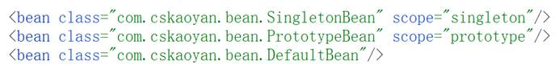

## 5.2  单元测试

通过内存地址查看是否是同一个实例

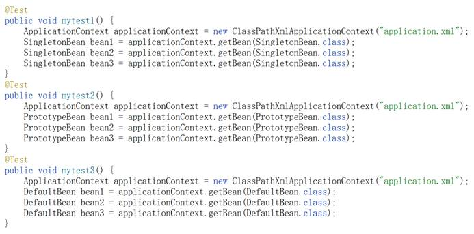

# 6   ★生命周期

什么是生命周期，为什么要使用生命周期？

容器中的组件的生命，产生开始到容器关闭时候经过哪一些方法？

 

容器中的组件要到达一个可用状态，可以依赖注入了（可以从容器中取出了）

最终是要使用组件（对象）提供的方法

 

在组件到达可用状态之前会执行一些方法，准备这个实例

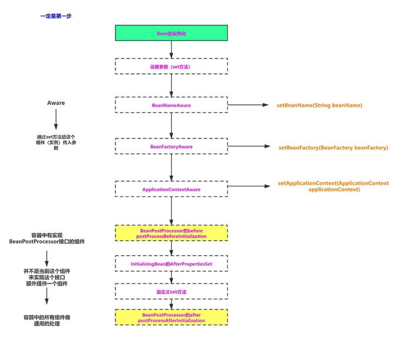

## 6.1  Aware

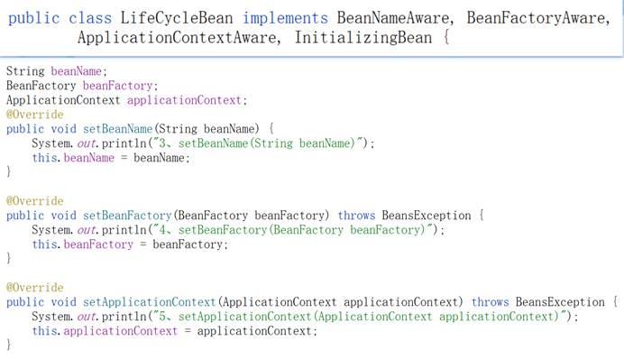

## 6.2  ★BeanPostProcessor

接口

容器中的所有组件都会执行到

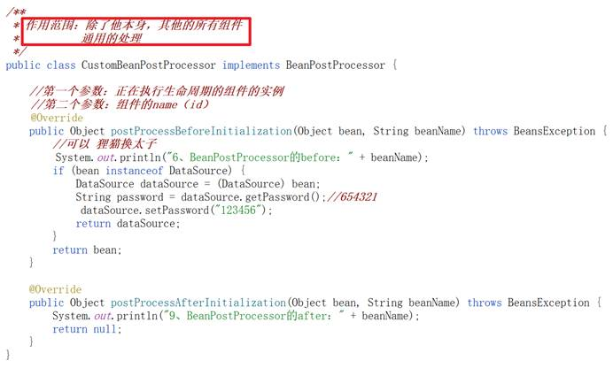

## 6.3  容器关闭

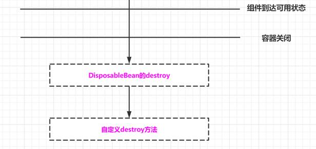

## 6.4  Scope对生命周期的影响

**singleton**：生命周期在容器初始化开始（立即加载）

**protoype**：获得组件的时候才开始生命期，没有destroy

## 6.5  小结

**生命周期的方法是否一定都执行到：不一定**

**为什么还要提供呢：在准备阶段提供这些方法能够执行到，提供不同的参数，这些方法之间存在先后顺序**

# 7   ★★★注解

## 7.1  注册组件

之前写了个bean标签

使用注解来注册组件，设置了一个包目录，找到所有的类，遍历，是否包含组件注册功能的注解

### 7.1.1 扫描包配置

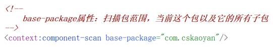

### 7.1.2 类上使用组件注册功能的注解

@Component

@Service

@Repository

@Controller(SpringMVC阶段才会去使用)

**可以使用注解的value属性指定组件id；如果没有使用value属性，默认的组件id是类名的首字母小写**

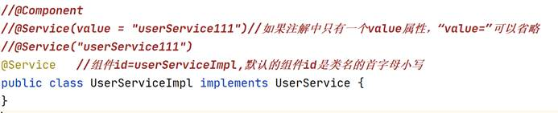

## 7.2  注入功能

**容器中的组件里才可以使用注入功能**

### 7.2.1 值注入

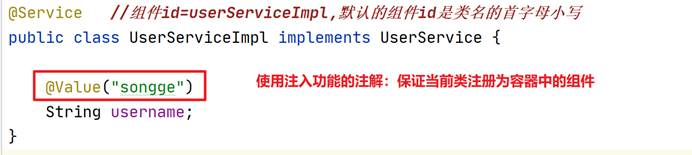

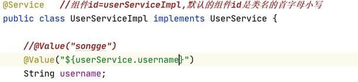

### 7.2.2 组件注入

其实维护的是组件之间的依赖关系

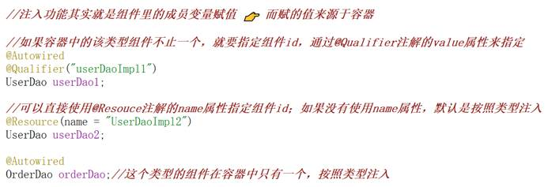

@Autowired注解是最常用的，默认按照类型注入

### 7.2.3 小结

注入功能：为容器中的组件的成员变量赋值，维护组件之间的依赖关系

注意：注入功能要在容器中的组件里使用

## 7.3  scope和生命周期

@Scope：直接写在类上

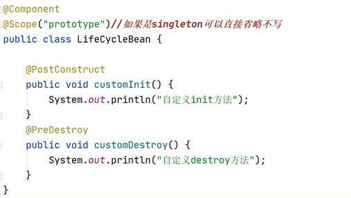

## 7.4  单元测试

目的是为了方便的测试组件提供的方法

从容器中取出组件 

👉 之前取出方式：applicationContext.getBean

👉 当前：注入功能的注解

 

**相当于把单元测试类当成是容器中的组件，使用注入功能的注解**

### 7.4.1 引入依赖

spring-test

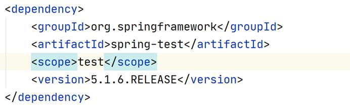

### 7.4.2 加载配置文件

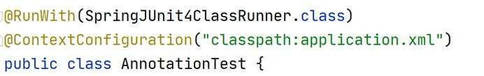

### 7.4.3 单元测试的使用

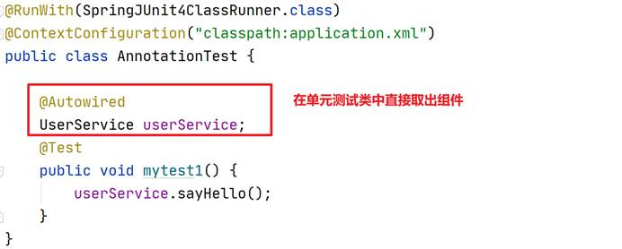

# 补充

## Spring依赖注入和new object()的差别。 

Sping为什么使用依赖注入而不使用实例化对象的方式？ 

首先说明一下概念 

依赖注入(Dependency of Injection)和控制反转(Inversion of Control 简称：ioc)是一个概念。 

具体含义： 

   当某个角色(java实例class A，调用者)需要另一个角色(另一个Java实例class B，被调用者)的协助时，在传统的程序设计过程中通常由调用者来创建被调用者的实例(在class A里面 初始化class B)。 
但在Spring里，创建被调用者实例的工作不再由调用者来完成。因此成为控制反转(ioc)。创建被调用者实例的工作由Spring容器来完成，然后注入调用者。因此也称为依赖注入

不管是依赖注入还是控制反转，都说明Spring采用动态灵活的方式来管理各种对象，对象与对象之间的具体实现互相透明。

在理解依赖注入之前，看如下这个问题在各种社会形态里如何解决:一个人(Java实例，调用者)需要一把斧子(Java实例，被调用者)。

\- **原始社会里，几乎没有社会分工。需要斧子的人(调用者)只能自己去磨一把斧子(被调用者)。对应的情形为:Java程序里的调用者自己创建被调用者。** 
\- **进入工业社会，工厂出现。斧子不再由普通人完成，而在工厂里被生产出来，此时需要斧子的人(调用者)找到工厂，购买斧子，无须关心斧子的制造过程。对应Java程序的简单工厂的设计模式。** 
\- **进入“按需分配”社会，需要斧子的人不需要找到工厂，坐在家里发出一个简单指令:需要斧子。斧子就自然出现在他面前。对应Spring的依赖注入。**

- 第一种情况下，Java实例的调用者创建被调用的Java实例，必然要求被调用的Java类出现在调用者的代码里。无法实现二者之间的松耦合。
- 第二种情况下，调用者无须关心被调用者具体实现过程，只需要找到符合某种标准(接口)的实例，即可使用。此时调用的代码面向接口编程，可以让调用者和被调用者解耦，这也是工厂模式大量使用的原因。但调用者需要自己定位工厂，调用者与特定工厂耦合在一起。
- 第三种情况下，调用者无须自己定位工厂，程序运行到需要被调用者时，系统自动提供被调用者实例。事实上，调用者和被调用者都处于Spring的管理下，二者之间的依赖关系由Spring提供。

所谓依赖注入，是指程序运行过程中，如果需要调用另一个对象协助时，无须在代码中创建被调用者，而是依赖于外部的注入。Spring的依赖注入对调用者和被调用者几乎没有任何要求，完全支持对POJO之间依赖关系的管理。依赖注入通常有三种: 

- set设值注入 
- 构造函数注入 
- spring注解注入

# Spring-Bean实例是如何依赖注入？

> [link](https://cloud.tencent.com/developer/article/1486215)

那什么是依赖注入呢?

> 所谓依赖注入，就是由IOC容器在运行期间，动态地将某种依赖关系注入到对象之中。再完成IOC容器初始化之后，也就是所谓的Bean加载完成后，我们需要对这些Bean进行调用和获取，这个过程就叫依赖注入。

那什么时候会触发依赖注入呢?

1. 通过getBean()方法获取Bean对象。
2. 给Bean配置了懒加载，ApplicationContext启动完成后调用getBean()来实例化对象。

> 现在计算机性能已经足够，不是特殊要求下尽量别做懒加载，这样的话可以减少web运行时的调用时间开销。

好了，介绍完这些就开始我们的DI之旅。
