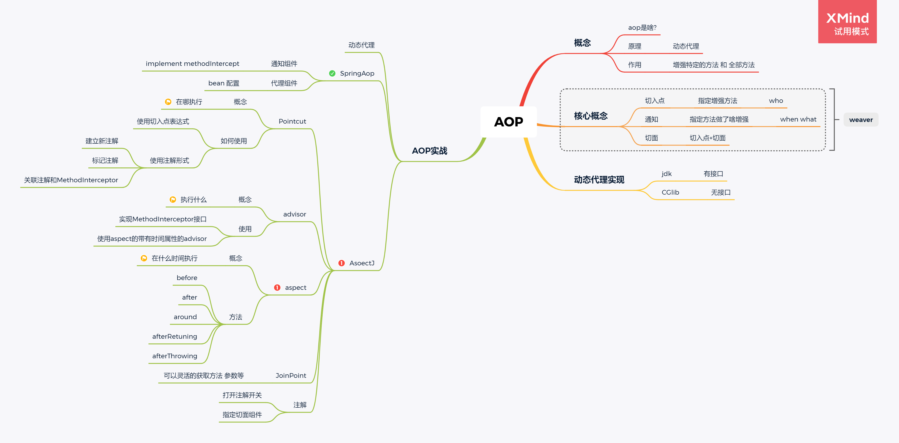

# AOP

> code:https://github.com/ytwotap/spring_study

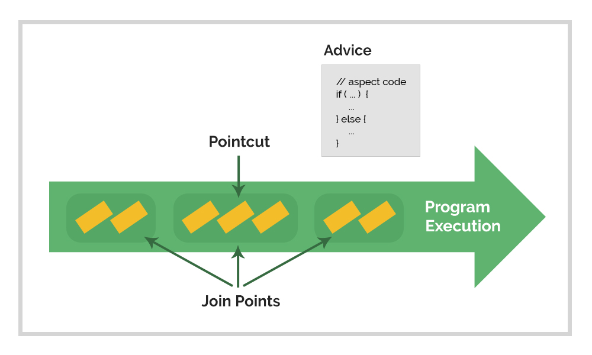

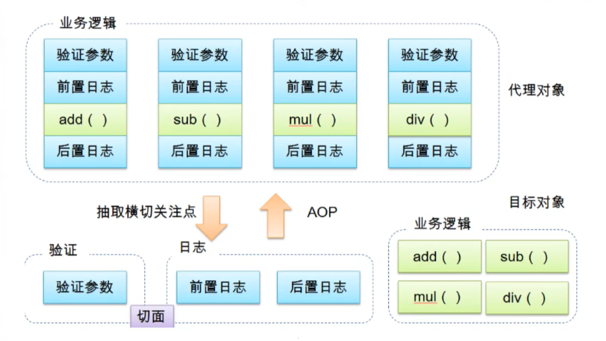

# 1   AOP

Aspect Oriented Programming面向切面编程

增强

 

**动态代理**：增强的是委托类的全部方法

**AOP**：增强的是容器中的组件里**特定（有机会选择）**的方法

 

**范围**：容器中的组件

 

把一些和核心业务无关的内容提取出来，通用的事情，比如参数校验、事务、程序状态检测、日志

 

# 2   核心术语

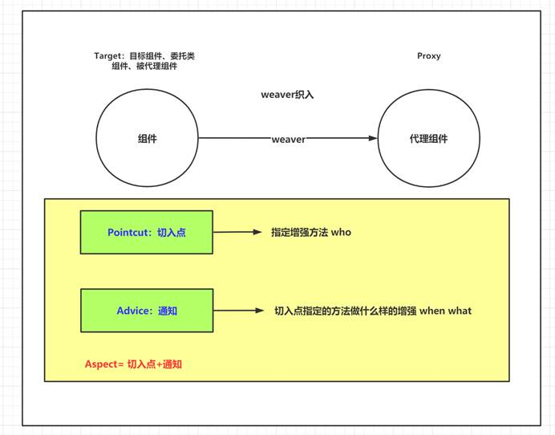

通过切入点指定容器中的组件里的方法，通知指导他们做增强

 

如果方法在切入点增强的范围内，该方法对应的组件就会被增强（变成Proxy）


- 横切关注点：跨越应用程序多个模块的方法或功能。即是，与我们业务逻辑无关的，但是我们需要关注的部分，就是横切关注点，如日志、安全、缓存、事务等等……
- 切面（ASPECT）：横切关注点被模块化的特殊对象，即是一个类。
- 通知（Advice）：切面必须要完成的工作，即是类中的一个方法。
- 目标（Target）：被通知对象。
- 代理（Proxy）：向目标对象应用通知之后创建的对象。
- 切入点（PointCut）：切面通知执行的“地点”的定义。
- 连接点（jointPoint）：与切入点匹配的执行点。

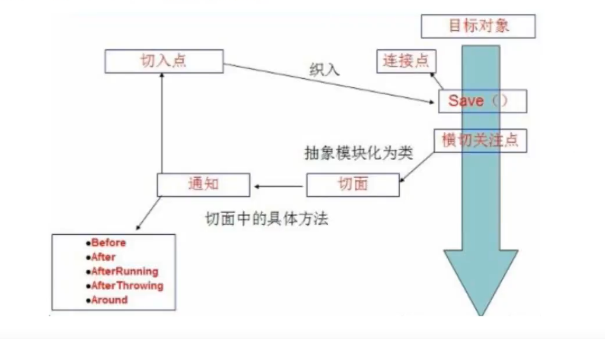

# 3   动态代理

**AOP底层就是使用动态代理来进行增强：JDK动态代理和CGlib动态代理都有使用。**

如果有接口的实现，用的是JDK动态代理

如果没有接口实现，用的是CGlib动态代理

# 4   AOP实战

## 4.1  动态代理

参考昨天作业

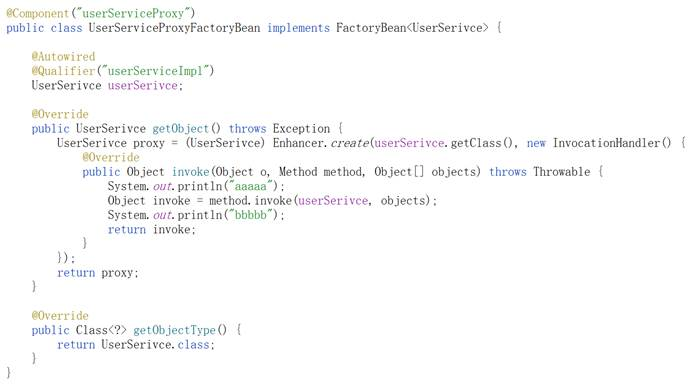

## 4.2  SpringAOP

类似于UserServiceProxyFactoryBean

### 4.2.1 通知组件 (advice)

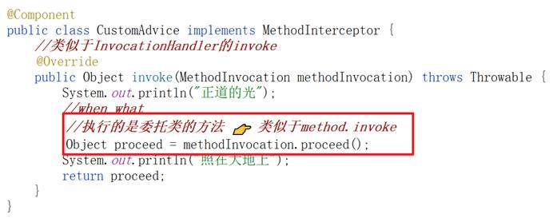

### 4.2.2 代理组件

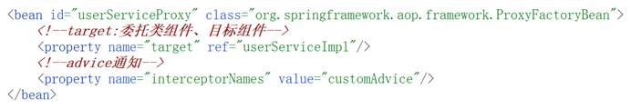

### 4.2.3 哪里不够好

繁琐：**注册代理组件、取出**

**方法的指定不灵活**


----

## 4.3  ★★AspectJ(spring aop中使用)

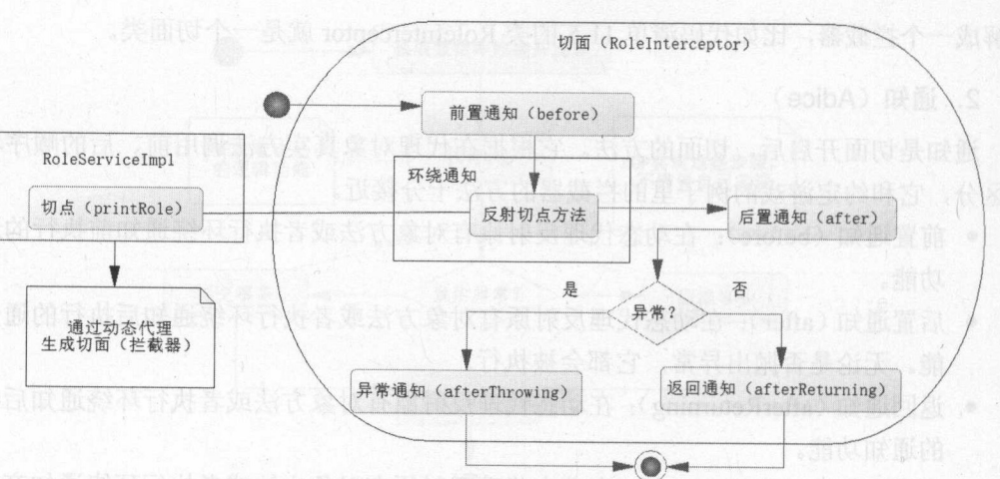

> 指导:https://www.baeldung.com/aspectj
>
> doc:https://www.eclipse.org/aspectj/

### 4.3.0 AspectJ是啥

**AspectJ是Eclipse旗下的一个项目。至于它和Spring AOP的关系，不妨可将Spring AOP看成是Spring这个庞大的集成框架为了集成AspectJ而出现的一个模块。**

**毕竟很多地方都是直接用到AspectJ里面的代码。典型的比如@Aspect，@Around，@Pointcut注解等等。而且从相关概念以及语法结构上而言，两者其实非常非常相似。比如Pointcut的表达式语法以及Advice的种类，都是一样一样的。**

在这里使用的AspectJ是spring aop基于aspectJ实现的功能.

从 AOP 的功能完善程度来讲，AspectJ 支持编译期织入、编译后织入和类加载时织入，并且提供了一套 AspectJ 语法，非常强大。**在 AspectJ 面前，spring-aop 就是个“小弟弟”。**

spring-aop 之所以和 AspectJ 产生关联，主要是因为借鉴了 AspectJ 语法（这套语法一般使用注解实现，用于定义`Aspect`、`Pointcut`、`Advice`等），**包括使用到 AspectJ 的注解以及解析语法的类。**如果我们希望**在 spring-aop 中使用 AspectJ 注解语法，需要额外引入 aspectjweaver 包。**

那么，它们的**区别**在哪里呢？

最大的区别在于两者实现AOP的底层原理不太一样：

**Spring AOP: 基于代理(Proxying)**
**AspectJ: 基于字节码操作(Bytecode Manipulation)**
用一张图来表示AspectJ使用的字节码操作，就一目了然了：


通过编织阶段(Weaving Phase)，对目标Java类型的字节码进行操作，将需要的Advice逻辑给编织进去，形成新的字节码。毕竟JVM执行的都是Java源代码编译后得到的字节码，所以AspectJ相当于在这个过程中做了一点手脚，让Advice能够参与进来。


> link:https://www.cnblogs.com/ZhangZiSheng001/p/13671149.html

----

狸猫换太子


**注册过程中不需要一一指定委托类组件，取出过程也不需要指定组件id**

### 4.3.1 Pointcut

切入点：指定增强方法（容器中的组件的方法）。

**切入点表达式** **👉 配置文件中配置**

**标签<aop:pointcut id expression/>，作为<aop:config>的子标签**

#### 4.3.1.1  引入aop的schema

可以手动改造，也可以输入aop:通过提示来引入（**一定不要引入错了schema**）

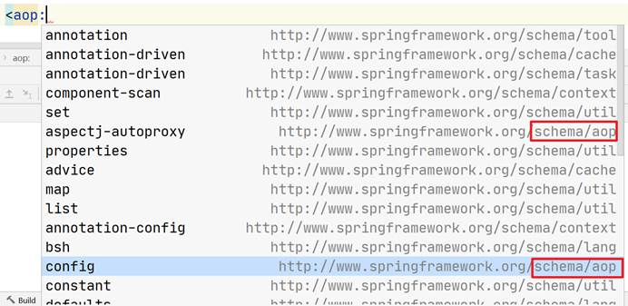

#### 4.3.1.2  execution(修饰符 返回值 包名、类名、方法名(形参))

判断方法（容器中的组件的方法）是否满足表达式，如果满足就增强

 

1、 能否省略

2、 能否通配

3、 特殊用法

##### 4.3.1.2.1   修饰符

修饰符可以省略 👉 代表任意修饰符

##### 4.3.1.2.2   返回值

返回值不能省略

返回值可以使用*作为通配符

JavaBean类要写全类名

##### 4.3.1.2.3   包名、类名、方法名

可以部分省略，头和尾（包名的第一级、方法名）不能省略，中间的**任意一部分**都可以省略。

使用..进行省略

通配符：可以使用通配符

##### 4.3.1.2.4   形参

可以省略不写，省略不写代表的是无参方法

可以通配：

*****👉单个任意类型的参数

**..**  👉任意参数：数量上的任意、类型上的任意

JavaBean要写全类名

#### 4.3.1.3 @annotation(自定义注解的全类名)

注解加在哪个方法（容器中的组件的方法）上，哪个方法就被增强


使用自定义注解 指定增强的方法

 

在容器中的组件里，给哪一个方法增加上自定义的注解，哪一个方法就被增强

 

如果多个方法要被增强，没有什么特别的规律，没有办法使用execution这种写法，可以使用自定义注解这种写法

 

##### 1.2.1 注解的定义

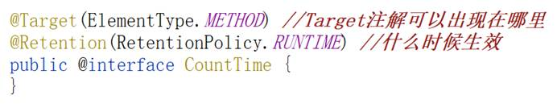

##### 1.2.2 切入点

@annotation(自定义注解的全类名)

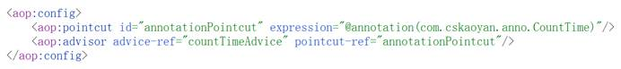

##### 1.2.3 使用

**注意：在容器中的组件的方法上使用**

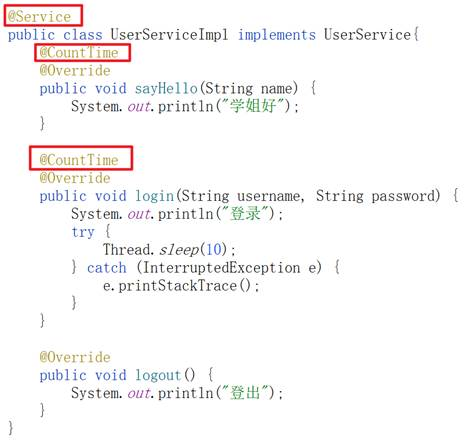

### 4.3.1-1 advisor

```xml
<aop:advisor advice-ref pointcut(-ref)/>
```

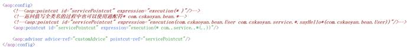


### 4.3.2   ★★aspect


pointcut + advice

aspect给我们提供了一些通知：**通知是在什么时间做什么事情，做的事情是我们自己写的，但是aspect给我们提供了时间**

 

before、after、around、after-returning、after-throwing 相对于委托类方法的时间

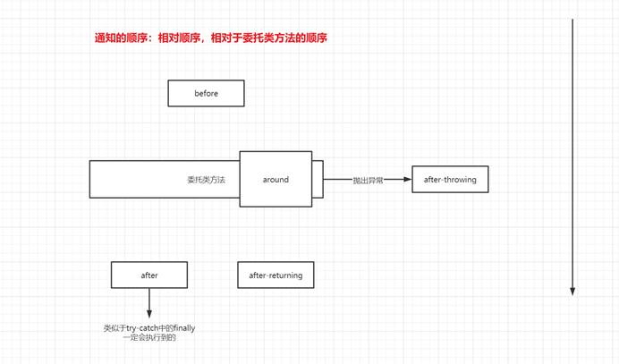

#### 2.1  切面中的通知方法

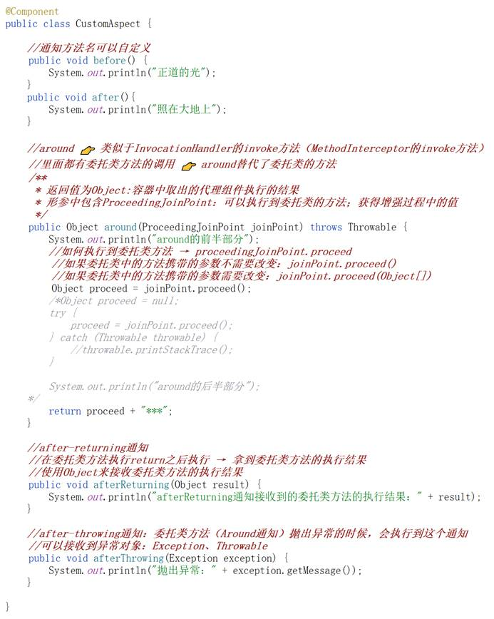

### 4.3.3  配置

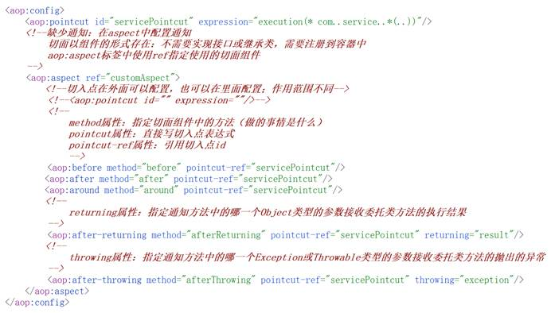

#### 4.3.3.3  after-throwing通知

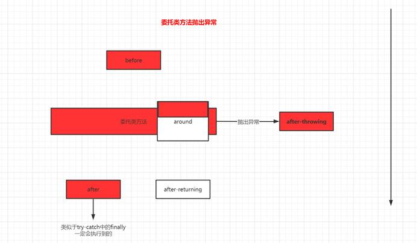

#### 4.3.3.4  小结

使用通知的话是否全部通知都会使用：通常只用一到两个

重构周末作业，使用什么通知：around

相对时间：相对于委托类方法的执行时间

 

增加这些通知方法：在代理对象执行方法的时候，会在对应的时机调用切面组件中的通知方法

#### 4.3.3.5  JoinPoint 连接点

增强过程中的点，增强过程就是执行通知的方法，拿到过程中的值

提供了获得增强过程中的值的方法

| getThis      | 代理对象   |
| ------------ | ---------- |
| getTarget    | 委托类对象 |
| getSignature | 方法相关的 |
| getArguments | 参数       |

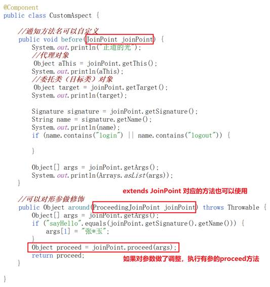

#### 4.3.3.6  ★注解

将我们aspectj使用aspect的这种形式使用注解和类表达出来，干掉aop:aspect标签

##### 4.3.3.6.1 打开注解开关

<aop:aspectj-autoproxy/>

##### 4.3.3.6.2 配置切面类

指定了切面组件

切入点配置

指定切面组件中方法使用什么通知方法

通知方法对应的切入点或切入点表达式

returning和throwing指定形参来接收委托类方法执行结果或抛出的异常

##### 4.3.3.6.2.1 指定切面组件

组件上增加一个新的注解@Aspect

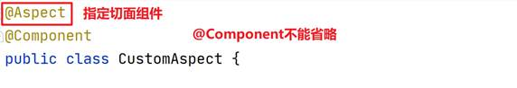

##### 4.3.3.6.2.2 切入点配置

以方法的形式存在，引入一个新的注解@Pointcut

**id的配置、表达式的配置**

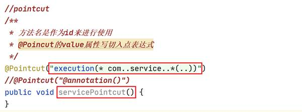

###### 4.3.3.6.2.3  通知注解

@Before、@After、@Around、@AfterReturning、@AfterThrowing

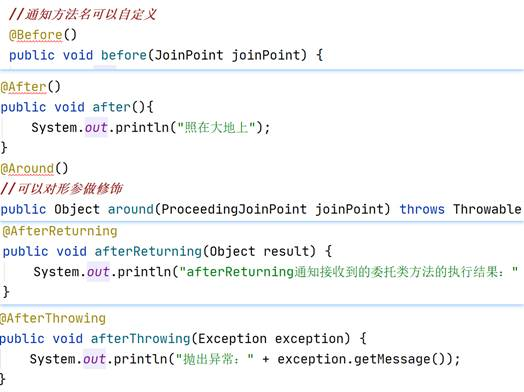

###### 4.3.3.6.2.4 引用切入点表达式或切入点id

通知注解的value属性中

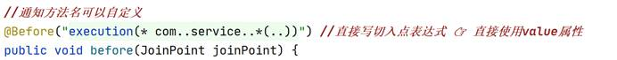

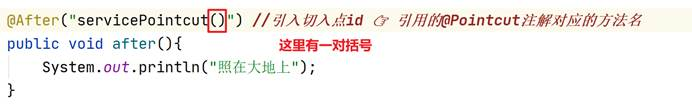

###### 4.3.3.6.2.5 returning属性和throwing属性

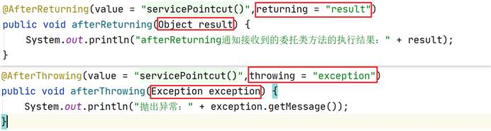


# [面试官：什么是AOP？Spring AOP和AspectJ的区别是什么？](https://segmentfault.com/a/1190000022019122)


`AOP（Aspect Orient Programming）`，它是面向对象编程的一种补充，主要应用于处理一些具有横切性质的系统级服务，如日志收集、事务管理、安全检查、缓存、对象池管理等。

AOP实现的关键就在于AOP框架自动创建的AOP代理，AOP代理则可分为静态代理和动态代理两大类，其中静态代理是指使用AOP框架提供的命令进行编译，从而在编译阶段就可生成 AOP 代理类，因此也称为编译时增强；而动态代理则在运行时借助于JDK动态代理、CGLIB等在内存中“临时”生成AOP动态代理类，因此也被称为运行时增强。

面向切面的编程（AOP） 是一种编程范式，旨在通过允许横切关注点的分离，提高模块化。AOP提供切面来将跨越对象关注点模块化。

AOP要实现的是在我们写的代码的基础上进行一定的包装，如在方法执行前、或执行后、或是在执行中出现异常后这些地方进行拦截处理或叫做增强处理

## Aop的概念

**Pointcut**：是一个（组）基于正则表达式的表达式，有点绕，就是说他本身是一个表达式，但是他是基于正则语法的。通常一个pointcut，会选取程序中的某些我们感兴趣的执行点，或者说是程序执行点的集合。

**JoinPoint**：通过pointcut选取出来的集合中的具体的一个执行点，我们就叫JoinPoint.

**Advice**：在选取出来的JoinPoint上要执行的操作、逻辑。关于５种类型，我不多说，不懂的同学自己补基础。

**Aspect**：就是我们关注点的模块化。这个关注点可能会横切多个对象和模块，事务管理是横切关注点的很好的例子。它是一个抽象的概念，从软件的角度来说是指在应用程序不同模块中的某一个领域或方面。又pointcut 和advice组成。

**Weaving**：把切面应用到目标对象来创建新的 advised 对象的过程。

## AspectJ是什么？能做什么？

AspectJ是一个易用的功能强大的`AOP框架`

AspectJ全称是Eclipse AspectJ， 其官网地址是：[http://www.eclipse.org/aspectj/](https://link.segmentfault.com/?url=http%3A%2F%2Fwww.eclipse.org%2Faspectj%2F)，目前最新版本为：1.9.0

引用官网描述：

- a seamless aspect-oriented extension to the Javatm programming language（一种基于Java平台的面向切面编程的语言）
- Java platform compatible（兼容Java平台，可以无缝扩展）
- easy to learn and use（易学易用）

可以单独使用，也可以整合到其它框架中。

单独使用AspectJ时需要使用专门的编译器ajc。

java的编译器是javac，AspectJ的编译器是ajc，aj是首字母缩写，c即compiler。

## AspectJ和Spring AOP的区别？

相信作为Java开发者我们都很熟悉Spring这个框架，在spring框架中有一个主要的功能就是AOP，提到AOP就往往会想到AspectJ，下面我对AspectJ和Spring AOP作一个简单的比较：

### Spring AOP

1、基于动态代理来实现，默认如果使用接口的，用JDK提供的动态代理实现，如果是方法则使用CGLIB实现

2、Spring AOP需要依赖IOC容器来管理，并且只能作用于Spring容器，使用纯Java代码实现

3、在性能上，由于Spring AOP是基于动态代理来实现的，在容器启动时需要生成代理实例，在方法调用上也会增加栈的深度，使得Spring AOP的性能不如AspectJ的那么好

### AspectJ

- AspectJ来自于Eclipse基金会
- AspectJ属于静态织入，通过修改代码来实现，有如下几个织入的时机：

 1、编译期织入（Compile-time weaving）： 如类 A 使用 AspectJ 添加了一个属性，类 B 引用了它，这个场景就需要编译期的时候就进行织入，否则没法编译类 B。

 2、编译后织入（Post-compile weaving）： 也就是已经生成了 .class 文件，或已经打成 jar 包了，这种情况我们需要增强处理的话，就要用到编译后织入。

 3、类加载后织入（Load-time weaving）： 指的是在加载类的时候进行织入，要实现这个时期的织入，有几种常见的方法。1、自定义类加载器来干这个，这个应该是最容易想到的办法，在被织入类加载到 JVM 前去对它进行加载，这样就可以在加载的时候定义行为了。2、在 JVM 启动的时候指定 AspectJ 提供的 agent：`-javaagent:xxx/xxx/aspectjweaver.jar`。

- AspectJ可以做Spring AOP干不了的事情，它是AOP编程的完全解决方案，Spring AOP则致力于解决企业级开发中最普遍的AOP（方法织入）。而不是成为像AspectJ一样的AOP方案
- 因为AspectJ在实际运行之前就完成了织入，所以说它生成的类是没有额外运行时开销的

### 对比总结

下表总结了 Spring AOP 和 AspectJ 之间的关键区别:

| Spring AOP                                       | AspectJ                                                      |
| ------------------------------------------------ | ------------------------------------------------------------ |
| 在纯 Java 中实现                                 | 使用 Java 编程语言的扩展实现                                 |
| 不需要单独的编译过程                             | 除非设置 LTW，否则需要 AspectJ 编译器 (ajc)                  |
| 只能使用运行时织入                               | 运行时织入不可用。支持编译时、编译后和加载时织入             |
| 功能不强-仅支持方法级编织                        | 更强大 - 可以编织字段、方法、构造函数、静态初始值设定项、最终类/方法等......。 |
| 只能在由 Spring 容器管理的 bean 上实现           | 可以在所有域对象上实现                                       |
| 仅支持方法执行切入点                             | 支持所有切入点                                               |
| 代理是由目标对象创建的, 并且切面应用在这些代理上 | 在执行应用程序之前 (在运行时) 前, 各方面直接在代码中进行织入 |
| 比 AspectJ 慢多了                                | 更好的性能                                                   |
| 易于学习和应用                                   | 相对于 Spring AOP 来说更复杂                                 |

