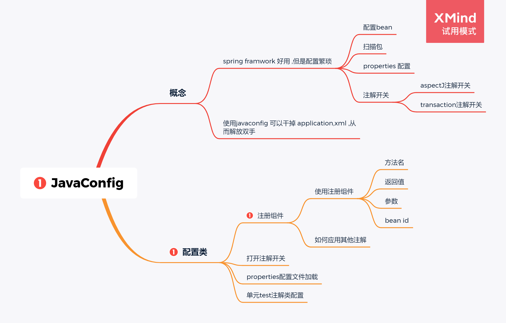
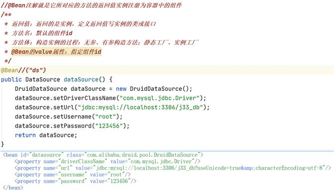
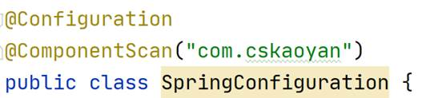
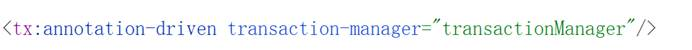
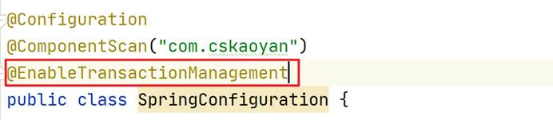
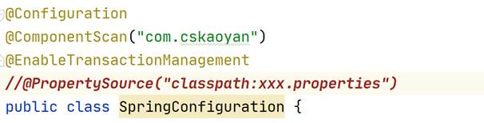
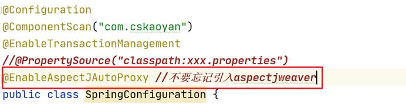
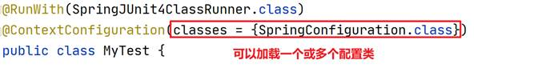

# JavaConfig




# 1   ★★★JavaConfig

什么是JavaConfig、通过注解和配置类完成Spring的相关配置

Spring配置都做了什么？ 注册组件、其他配置(扫描包配置、properties配置文件加载、aspectj注解开关、事务注解开关)

 

干掉配置文件 application.xml

## 1.1  配置类

替代的application.xml

1、 要在配置类中注册组件

2、 其他配置

@Configuration

把当前类当成是配置类，配置类也是容器中的组件

 

## 1.2  注册组件

组件注册过程以方法的形式体现出来，将这个方法的返回值(对象、实例)注册为容器中的组件



## 1.3  扫描包配置

<context:component-scan base-package/>



## 1.4  事务注解驱动





## 1.5  properties配置文件加载


```
<context:property-placeholder location/>
```

@PropertySource



## 1.6  aspectj注解开关

<aop:aspectj-autoproxy/>

@EnableAspectJAutoProxy



## 1.7  单元测试加载配置类




# code:

```java
package com.cskaoyan.config;

import com.alibaba.druid.pool.DruidDataSource;
import org.mybatis.spring.SqlSessionFactoryBean;
import org.mybatis.spring.mapper.MapperScannerConfigurer;
import org.springframework.beans.factory.annotation.Qualifier;
import org.springframework.context.annotation.Bean;
import org.springframework.context.annotation.ComponentScan;
import org.springframework.context.annotation.Configuration;
import org.springframework.jdbc.datasource.DataSourceTransactionManager;
import org.springframework.stereotype.Component;
import org.springframework.transaction.annotation.EnableTransactionManagement;

import javax.sql.DataSource;
import javax.xml.crypto.Data;

/**
 * 类<code>Doc</code>用于：
 * JavaConfig 解决 xml问题 .
 * @author 12824
 * @version 1.0
 * @date 2021-09-07 -11:12
 */
@Configuration
@ComponentScan("com.cskaoyan")
@EnableTransactionManagement //打开事务注解开关
public class SpringConfiguration {

    /*
    * @Bean 注解就是它说对应的方法的返回值实例注册为容器中的组件  value 值 为 组件id,默认值为[方法名]
    * 返回值:返回的是实例,定义返回值写实例的类或接口
    * 方法名:默认的组件id
    * 方法体:构造一个实例
    * */

    /**
     * 如何注册为bean
     * @return
     */
    @Bean(value = "ds")
    public DataSource dataSource(){
        final DruidDataSource druidDataSource = new DruidDataSource();
        druidDataSource.setDriverClassName("com.mysql.jdbc.Driver");
        druidDataSource.setUrl("jdbc:mysql://localhost:3306/33th");
        druidDataSource.setUsername("root");
        druidDataSource.setPassword("123456");
        return druidDataSource;
    }
    @Bean//(value = "ds")
    public DataSource dataSource2(){
        final DruidDataSource druidDataSource = new DruidDataSource();
        druidDataSource.setDriverClassName("com.mysql.jdbc.Driver");
        druidDataSource.setUrl("jdbc:mysql://localhost:3306/33th");
        druidDataSource.setUsername("root");
        druidDataSource.setPassword("123456");
        return druidDataSource;
    }

    /**
     * test如何引入其他bean
     * @param dataSource 形参,如果是ref,是传入的bean对象 根据bean对象构建引用.
     * @return
     */
    @Bean
    public SqlSessionFactoryBean sqlSessionFactoryBean(@Qualifier("ds") DataSource dataSource){
        final SqlSessionFactoryBean sqlSessionFactoryBean = new SqlSessionFactoryBean();
        sqlSessionFactoryBean.setDataSource(dataSource);
        return sqlSessionFactoryBean;
    }

    @Bean
    public MapperScannerConfigurer mapperScannerConfigurer(){
        final MapperScannerConfigurer mapperScannerConfigurer = new MapperScannerConfigurer();
        mapperScannerConfigurer.setBasePackage("com.cskaoyan.mapper");
        mapperScannerConfigurer.setSqlSessionFactoryBeanName("sqlSessionFactoryBean");
        return mapperScannerConfigurer;
    }

    @Bean
    public DataSourceTransactionManager transactionManager(@Qualifier("ds") DataSource dataSource) {
        return new DataSourceTransactionManager(dataSource);
    }
}
```