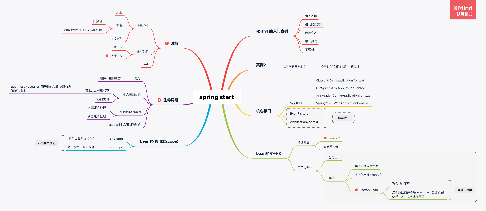

# spring相关学习

> 知识点连续性强、掌握核心

code:https://github.com/ytwotap/spring_study

## 前置知识

[01_设计模式.md](https://github.com/ytwotap/TyporaRecord/tree/master/8-%E8%AE%BE%E8%AE%A1%E6%A8%A1%E5%BC%8F)

# 1   SpringFramework

Spring框架

rod johnson：音乐学博士

 

Spring框架是啥

IOC、DI

## 1.1  IOC控制反转

Inverse of Control ：IOC、IoC

什么是控制反转

**控制：**生成实例。  应用程序控制实例的生成

UserService userService = new UserServiceImpl();

 

**反转：**将实例生成权交给了Spring

UserService userService = Spring.getXXX();

 

 

生成权为什么要反转给Spring？ 单例，让实例在Spring中以单例的形式存在，从Spring中获得实例始终保证是同一个实例。可以方便维护多个实例之间的关系

 

**容器：**Spring来管理实例的地方。 → IOC容器、Spring容器

**组件：**Spring容器中管理的实例叫组件。

## 1.2  DI 依赖注入

Dependency Inject 依赖注入

 

**应用程序和Spring容器**

**经过了控制反转，谁贫穷，谁富有。 应用程序穷、Spring容器富有**

 

依赖：

​    谁依赖谁？ 应用程序依赖Spring容器

​    为什么？ Spring容器提供了应用程序必须的外部资源

注入：

​    谁注入谁？ Spring容器注入给应用程序

​    注入了什么？注入了应用程序必须的资源、实例、值。。

## 1.3  Spring就像一个Map

map.put → 控制反转

map.get → 依赖注入

## 1.4  AOP

Aspect Oriented Programming 面向切面编程

OOP：Object Oriented Programming面向对象编程

 

AOP是在IOC和DI的基础上的做

增强：对容器中所管理的组件进行增强，动态代理 粒度更精细

# [ioc](./1_spring_IOC)

