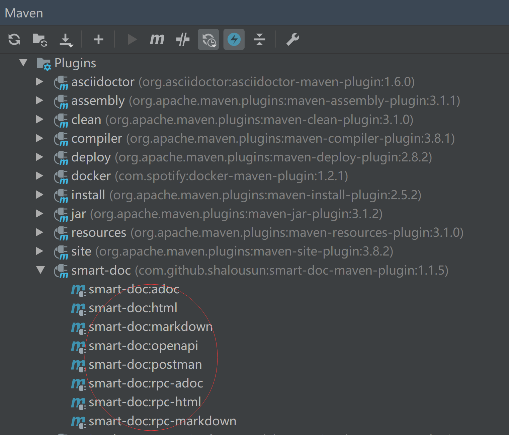
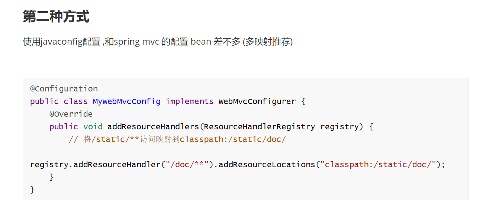
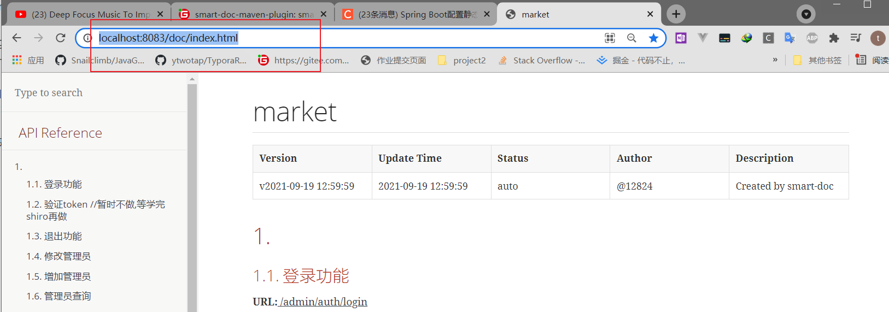
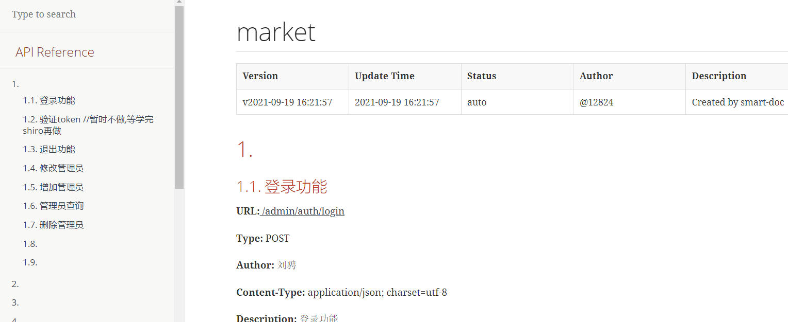

# smart  doc use 

doc:https://gitee.com/smart-doc-team/smart-doc-maven-plugin#https://gitee.com/smart-doc-team/smart-doc/wikis/smart-doc%E5%B8%B8%E8%A7%81%E9%97%AE%E9%A2%98%E8%A7%A3%E5%86%B3%E6%96%B9%E6%B3%95?sort_id=2457284

## Getting started

### Add plugin

```
<plugin>
    <groupId>com.github.shalousun</groupId>
    <artifactId>smart-doc-maven-plugin</artifactId>
    <version>【最新版】</version>
    <configuration>
        <!--指定生成文档的使用的配置文件,配置文件放在自己的项目中-->
        <configFile>./src/main/resources/smart-doc.json</configFile>
        <!--指定项目名称-->
        <projectName>测试</projectName>
        <!--smart-doc实现自动分析依赖树加载第三方依赖的源码，如果一些框架依赖库加载不到导致报错，这时请使用excludes排除掉-->
        <excludes>
            <!--格式为：groupId:artifactId;参考如下-->
            <!--1.0.7版本开始你还可以用正则匹配排除,如：poi.* -->
            <exclude>com.alibaba:fastjson</exclude>
        </excludes>
        <!--自1.0.8版本开始，插件提供includes支持,配置了includes后插件会按照用户配置加载而不是自动加载，因此使用时需要注意-->
        <!--smart-doc能自动分析依赖树加载所有依赖源码，原则上会影响文档构建效率，因此你可以使用includes来让插件加载你配置的组件-->
        <includes>
            <!--格式为：groupId:artifactId;参考如下-->
            <include>com.alibaba:fastjson</include>
        </includes>
    </configuration>
    <executions>
        <execution>
            <!--如果不需要在执行编译时启动smart-doc，则将phase注释掉-->
            <phase>compile</phase>
            <goals>
                <goal>html</goal>
            </goals>
        </execution>
    </executions>
</plugin>
```

### Create a json config

在自己的项目中创建一个json配置文件，smart-doc-maven-plugin插件会根据这个配置生成项目的接口文档。 例如在项目中创建`/src/main/resources/smart-doc.json`。配置内容参考如下。

**最小配置单元:**

```
{
   "outPath": "D://md2" //指定文档的输出路径 相对路径时请写 ./ 不要写 / eg:./src/main/resources/static/doc
}
```

> 如果你想把html文档也打包到应用中随着服务一起访问，则建议你配置路径为：src/main/resources/static/doc。 [服务访问配置参考](https://gitee.com/smart-doc-team/smart-doc/wikis/smart-doc常见问题解决方法?sort_id=2457284)

**增强版单元配置:**

```
{
  "serverUrl": "http://127.0.0.1",//服务器地址
  "isStrict": false,//是否用严格模式，严格模式强制检查注释
  "allInOne": true,//所有接口文档合并生成到一个文档
  "outPath": "src/main/resources/static/doc",//文档的输出路径
  "projectName": "smart-doc"//指定项目名称，用于显示在文档中
}
```

详细备注说明:

```
{
  "serverUrl": "http://127.0.0.1", //服务器地址,非必须。导出postman建议设置成http://{{server}}方便直接在postman直接设置环境变量
  "isStrict": false, //是否开启严格模式
  "allInOne": true,  //是否将文档合并到一个文件中，一般推荐为true
  "outPath": "D://md2", //指定文档的输出路径
  "coverOld": true,  //是否覆盖旧的文件，主要用于mardown文件覆盖
  "style":"xt256", //基于highlight.js的代码高设置,可选值很多可查看码云wiki，喜欢配色统一简洁的同学可以不设置
  "createDebugPage": true,//@since 2.0.0 smart-doc支持创建可以测试的html页面
  "packageFilters": "",//controller包过滤，多个包用英文逗号隔开
  "md5EncryptedHtmlName": false,//只有每个controller生成一个html文件是才使用
  "projectName": "smart-doc",//配置自己的项目名称
  "skipTransientField": true,//目前未实现
  "sortByTitle":false,//接口标题排序，默认为false,@since 1.8.7版本开始
  "requestFieldToUnderline":true, //自动将驼峰入参字段在文档中转为下划线格式,//@since smart-doc 1.8.7 版本开始
  "responseFieldToUnderline":true,//自动将驼峰入参字段在文档中转为下划线格式,//@since  smart-doc 1.8.7 版本开始
  "inlineEnum":true,//设置为true会将枚举详情展示到参数表中，默认关闭，//@since smart-doc 1.8.8版本开始
  "recursionLimit":7,//设置允许递归执行的次数用于避免一些对象解析卡主，默认是7，正常为3次以内，//@since smart-doc 1.8.8版本开始
  "allInOneDocFileName":"index.html",//自定义设置输出文档名称, @since smart-doc 1.9.0
  "requestExample":"true",//是否将请求示例展示在文档中，默认true，@since smart-doc 1.9.0
  "responseExample":"true",//是否将响应示例展示在文档中，默认为true，@since  smart-doc 1.9.0
  "urlSuffix":".do",//支持SpringMVC旧项目的url后缀,@since 2.1.0
  "displayActualType":false,//配置true会在注释栏自动显示泛型的真实类型短类名，@since 1.9.6
  "appKey": "xxx",// torna平台对接appKey,, @since 2.0.9
  "appToken": "xxx", //torna平台appToken,@since 2.0.9
  "secret": "xx",//torna平台secret，@since 2.0.9
  "openUrl": "torna server/api/",//torna平台地址，填写自己的私有化部署地址@since 2.0.9
  "debugEnvName":"测试环境", //torna测试环境
  "debugEnvUrl":"http://127.0.0.1",//torna
  "tornaDebug":false,//启用会推送日志
  "ignoreRequestParams":[ //忽略请求参数对象，把不想生成文档的参数对象屏蔽掉，@since smart-doc 1.9.2
      "org.springframework.ui.ModelMap"
  ],
  "dataDictionaries": [{ //配置数据字典，没有需求可以不设置
      "title": "订单状态", //数据字典的名称
      "enumClassName": "com.power.doc.enums.OrderEnum", //项目自定义数据字典枚举类名称
      "codeField": "code",//数据字典字典码对应的字段名称
      "descField": "desc"//数据字典对象的描述信息字典
  }],
  "errorCodeDictionaries": [{ //错误码列表，没有需求可以不设置
      "title": "title",
      "enumClassName": "com.power.doc.enums.ErrorCodeEnum", //项目自定义的错误码枚举类
      "codeField": "code",//错误码的code码字段名称
      "descField": "desc"//错误码的描述信息对应的字段名
  }],
  "revisionLogs": [{ //设置文档变更记录，没有需求可以不设置
      "version": "1.0", //文档版本号
      "revisionTime": "2020-12-31 10:30", //文档修订时间
      "status": "update", //变更操作状态，一般为：创建、更新等
      "author": "author", //文档变更作者
      "remarks": "desc" //变更描述
  }],
  "customResponseFields": [{ //自定义添加字段和注释，smart-doc后期遇到同名字段则直接给相应字段加注释，非必须
      "name": "code",//覆盖响应码字段
      "desc": "响应代码",//覆盖响应码的字段注释
      "value": "00000"//设置响应码的值
  }],
  "customRequestFields": [{//自定义请求字段注释设置，@since 2.1.3,非必须
      "name":"code", //属性名
      "desc":"状态码", //描述
      "ownerClassName":"com.xxx.constant.entity.Result", //属性对应的类全路径
      "value":"200", //默认值或者mock值
      "required":true, //是否必填
      "ignore":false //是否忽略
  }],
  "apiObjectReplacements": [{ // 自smart-doc 1.8.5开始你可以使用自定义类覆盖其他类做文档渲染，非必须
      "className": "org.springframework.data.domain.Pageable",
      "replacementClassName": "com.power.doc.model.PageRequestDto" //自定义的PageRequestDto替换Pageable做文档渲染
  }],
  "rpcApiDependencies":[{ // 项目开放的dubbo api接口模块依赖，配置后输出到文档方便使用者集成
      "artifactId":"SpringBoot2-Dubbo-Api",
      "groupId":"com.demo",
      "version":"1.0.0"
  }],
  "rpcConsumerConfig": "src/main/resources/consumer-example.conf",//文档中添加dubbo consumer集成配置，用于方便集成方可以快速集成
  "requestHeaders": [{ //设置请求头，没有需求可以不设置
      "name": "token",
      "type": "string",
      "desc": "desc",
      "required": false,
      "since": "-"
  }],
  "requestParams": [ //公共请求参数(通过拦截器处理的场景)，@since 2.2.3,没有需求请不要设置
    {
      "name": "configPathParam",//请求头名称
      "type": "string",//请求头类型
      "desc": "desc",//请求头描述信息
      "paramIn": "path",
      "value":"testPath",//不设置默认null
      "required": false,//是否必须
      "since": "-",//什么版本添加的改请求头
      "pathPatterns": "*",//正则表达式过滤请求头
      "excludePathPatterns":"/app/page/**" //参考请求头中的用法
    },
    {
      "name": "configQueryParam",//请求头名称
      "type": "string",//请求头类型
      "desc": "desc",//请求头描述信息
      "paramIn": "query",
      "value":"testQuery",//不设置默认null
      "required": false,//是否必须
      "since": "-",//什么版本添加的改请求头
      "pathPatterns": "*",//正则表达式过滤请求头
      "excludePathPatterns":"/app/page/**"
    }
  ],
  "apiConstants": [{//从1.8.9开始配置自己的常量类，smart-doc在解析到常量时自动替换为具体的值。非必须，根据自己需求来设置
      "constantsClassName": "com.power.doc.constants.RequestParamConstant"//项目自己定义的常量
  }],
  "responseBodyAdvice":{ //自smart-doc 1.9.8起，ResponseBodyAdvice统一返回设置，可用ignoreResponseBodyAdvice tag来忽略
       "className":"com.power.common.model.CommonResult" //通用响应体
  },
  "requestBodyAdvice":{ //自smart-doc 2.1.4 起，支持设置RequestBodyAdvice统一请求包装类。非必须
       "className":"com.power.common.model.CommonResult"
  }
}
```

**注意：** 上面的json配置完全使用smart-doc的`ApiConfig`转化成json而来。因此项目配置也可以参考smart-doc的介绍。


仅仅需要上面一行配置就能启动smart-doc-maven-plugin插件，根据自己项目情况更多详细的配置参考下面。


###  Run plugin in IDEA

当你使用Idea时，可以通过maven Helper插件选择生成何种文档。



### Generated document example

[点击查看文档生成文档效果图](https://gitee.com/smart-doc-team/smart-doc/wikis/文档效果图?sort_id=1652819)


### 配置静态映射





### 访问:

访问:http://localhost:8083/doc/index.html就可以看到文档了



或者

这届使用idea启动


### 效果


