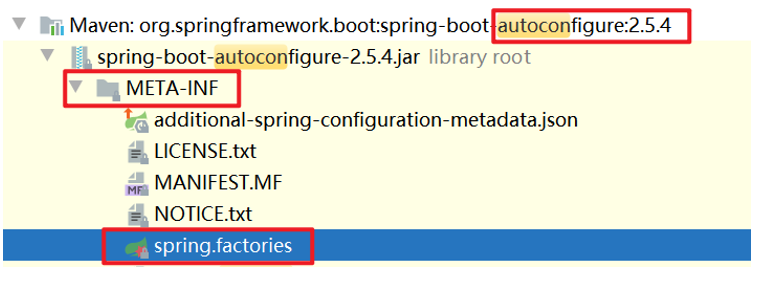
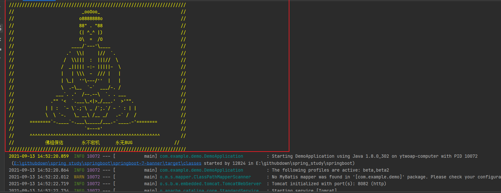
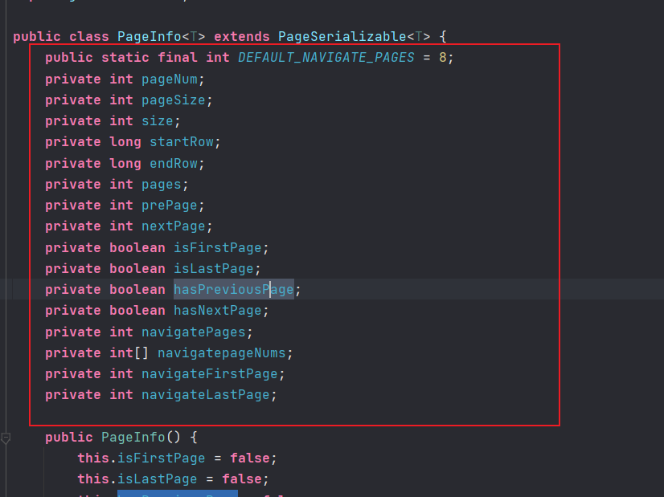
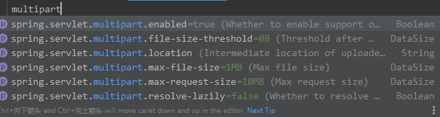

# Spring boot study 

## model:


启动流程图:


> link:https://blog.csdn.net/u014252478/article/details/88789852

# 1 为啥使用spring boot

快速去构建一个Spring应用

Spring是一个轻量级的开源框架，解决Spring用起来繁琐的问题

 

Spring当前用起来体验也不算太好

1、 引入大量的依赖

2、 注册组件，维护关联关系

配置魔鬼、配置地狱 👉 SpringBoot

 

SpringBoot采用的配置方式 → JavaConfig 

 

约定大于配置

内置tomcat，不需要挂载在外部的tomcat

启动类，以jar包的方式运行 java -jar xxx.jar

方便整合其他框架

# 2  创建SpringBoot应用


# 3   SpringBoot的核心特性

约定大于配置

SpringBoot应用帮我们做了默认的配置。

 

李阳 和 邓造坚 带早餐

李阳说阿坚，早上帮我带热干面和蛋酒，说以后帮我带早餐，如果我没有告诉你带什么吃的，就带热干面和蛋酒。

第二天，带的早餐是热干面和蛋酒

第三天，带的早餐是热干面和蛋酒

李阳说，明天给我带豆皮和豆浆

第四天，带的早餐是豆皮和豆浆

第五天，带的早餐是热干面和蛋酒

 

**如果没有指定配置，则使用默认配置；如果指定了配置，以指定的为准；如果没有指定配置，则做了默认的配置，保证程序可以正常运行。**

 

**如果你没有注册组件的话，帮你注册一些默认的组件**

# 4   ★★★约定大于配置

实现约定大于配置，注册一些默认的组件 → 自动配置类 AutoConfiguration

 

**@ConditionalOnXXX 👉 在xxx条件下生效**

**@ConditionalOnMissingXXX 👉 在XXX条件下不生效**

****

**@ConditionalOnMissingBean → 容器中没有这个组件的时候生效**

**@Bean**


`自己没有向容器中注册组件的时候生效 → @Bean注解 → 向容器中注册组件（默认组件）`

`如果容器中有这个组件，@Bean注解不生效，就不注册默认组件`


# 5   pom.xml


发布版RELEASE

预览版SNAPSHOT


## 5.1  默认的版本号


## 5.2 starter依赖

springboot应用对其他框架的支持，引入starter依赖

### 5.2.1 依赖名称

spring-boot-starter-xxx ：官方依赖

xxx-spring-boot-starter ：非官方的依赖](readme.assets/image-20210911151124250.png)

###  ★★引入依赖

1、这个框架所必须的依赖

2、starter或自动配置依赖（autoconfigure）


autoconfigure提供自动配置类

包含一个**/META-INF/spring.factories** **👉 Map<String,List<String>>**

 

有一个key叫EnableAutoConfiguration，对应的value就是自动配置类的列表





###  小结

使用SpringBoot应用的核心方式 → 引入starter依赖、核心配置


# 6  整合MyBatis

##   引入starter依赖

mybatis-spring-boot-starter

导入依赖:

```xml

        <dependency>
            <groupId>org.mybatis.spring.boot</groupId>
            <artifactId>mybatis-spring-boot-starter</artifactId>
            <version>2.2.0</version>
        </dependency>
```

属性配置:

## 1.2  datasource配置

SpringBoot会帮我们自动注册DataSource组件，但是注册组件过程中的值需要我们提供

我们在SpringBoot的配置文件中提供

properties配置文件：key=value

我们在这里就需要特定的key来为注册默认的datasource组件提供参数


----

自动配置:


## 1.3  扫描包配置


##   为什么配置这么简单

mybatis的starter → mybatis的autoconfigure → mybatis的自动配置类 → 注册组件

 

**datasource、sqlSessionFactory、mapperScannerConfigurer**


# 8  ★★springboot的配置文件 

> 注意:这个部分解释了为啥能在application.properties配置,能给其他的组件的javaConfig配置属性

##   名称

application或application(-xxx)

## 1.2  格式

properties或yml

 

application(-xxx).properties或yml


如何找到配置文件的


## yml文件配置


表达的也是键值对，也就是key=value的形式

yml文件的语法

 

spring.datasource.driver-class-name

 

点👉使用冒号、换行、（空格）缩进

等于👉冒号、**空格**

缩进的话缩进几个空格都可以，但是要注意同一级对齐


```yaml
spring:
  datasource:
    driver-class-name: com.mysql.jdbc.Driver
    url: jdbc:mysql://localhost:3306/33th?useUnicode=true&amp;characterEncoding=utf-8&amp;useSSL=false
    username: root
    password: 123456
```

> 注意:
>
> ​	yaml 需要在key: value中value加空格
>
> ​	. 是换行缩进
>
> ​	: 是等于符号


## tomcat配置:

端口号配置：默认的端口号是8080 → server.port

应用名配置：默认没有应用名    → server.servlet.context-path

```yaml
#port 端口
#context-path 应用名 default->没有应用名
server:
  port: 80
  servlet:
    context-path: /demo1
```

## :star::star::star:拿到配置文件的值

建立代码和配置文件之间的联系

组件拿到配置文件中的值

### @value

直接使用注解的value属性，采用${}的格式，可以直接你拿到配置文件中的值

yaml :

```yaml

file:
  location: f:/book

```

java 取值

```java
  @Value("${file.location}")
    String filelocation;
```

run:


问题:当数量多的时候,配置繁琐 :arrow_double_down: (不常用)

```java
@Value("${file.location}")
String filelocation;
@Value("${file.maxSize}")
String maxSize;
@Value("${file.jpgPath}")
String jpgPath;
@Value("${file.pngPath}")
String pngPath;
```


> 注意:do_not_litter:
>
> 不能作用于**静态变量（static）**；
>
> 不能作用于**常量（final）**;
>
> 不能在非注册的类中使用（类需要被注册在spring上下文中，如用@Service,@RestController,@Component等）；
>
> 使用这个类时，只能通过**依赖注入**的方式，用new的方式是不会自动注入这些配置的。
>
> 原文链接：https://blog.csdn.net/ITzhongzi/article/details/105489035

### :star::star:@ConfigurationProperties

成员变量和配置文件之间建立联系

注册组件，组件的成员变量接收配置文件中的值


```java
@Component
@Data
@ConfigurationProperties(prefix ="file")
/*配置类  string boot 大量使用了配置类*/
public class FileProperties {
    String location;
    String maxSize;
    String jpgPath;
    String pngPath;
}
```


使用:

```java
@RestController
public class HelloController {
    @Autowired
    FileProperties fileProperties;
    @RequestMapping("hello")
    public String hello() {
        return fileProperties.getLocation();
    }
}
```

### @Configuration

加载配置类

```java


@Configuration //有了这个才会被加载
@EnableConfigurationProperties(FileProperties.class)
public class FileConfiguration {
    FileProperties fileProperties;
    /*作为参数传入*/
    public FileConfiguration(FileProperties fileProperties) {
        this.fileProperties = fileProperties;
        System.out.println(fileProperties);
    }
}

```

### :star::star::star:@EnableConfigurationProperties({FileProperties.class})

**参数类:给组件提供参数**

加载@ConfigurationProperties对应的类，通常是和@ConfigurationProperties注解同时使用的

主要在配置上使用

-----

如果一个配置类只配置@ConfigurationProperties注解，而没有使用@Component，那么在IOC容器中是获取不到properties 配置文件转化的bean。**说白了 @EnableConfigurationProperties 相当于把使用  @ConfigurationProperties 的类进行了一次注入。**
 测试发现 @ConfigurationProperties 与 @EnableConfigurationProperties 关系特别大。


作者：咪雅先森
链接：https://www.jianshu.com/p/7f54da1cb2eb
来源：简书
著作权归作者所有。商业转载请联系作者获得授权，非商业转载请注明出处。

----

SpringBoot提供的自动配置类中大量使用了这样的注解


##### 结果:


### 配置文件key:

spring.datasource.driver-class-name

driverClassName驼峰命名 → driver-class-name

```yaml
#mybatis 驼峰写法在properties中变成了横杠
mybatis:
  type-aliases-package: 
```


### 配置文件组件不同值得获取

其他类型的值对应的配置文件中的value如何来写 👉 配置文件如何来提供值


#### yml文件语法


```yaml
# 数组和map等写法
file:
  location: f:/book
  maxSize: 10000
  jpgPath: /img
  pngPath: /png
#  数组或list
#     写法1 通过 , 分隔多个数据
  array1: data1,data2,data3
#     写法2: 换行 缩进 短横线 空格
  array2: 
    - data4
    - data5
    - data6
    - data7

  list1: data1,data2,data3
  
  list2:
    - data4
    - data5
    - data6
    - data7
#  Map或javaBean
#     写法1: 多一级的key作为Map中的key或JavaBean的成员变量名
#  写法2:使用大括号抱起来 key: value 多个key使用, 分隔开.
  map1:
    key1: value1
    key2: value2
  map2: {key3: vlaue3,key4: value4,key5: value5,key6: value6}
  user1:
    username: ytwotap
    password: 6666
  user2: {username: test, password: hahha}
  
```

### properties的写法

```properties
file.open=true
#list and array use
#用法1 使用, 分隔开
file.array1=data1,data2,data3
file.list1=data1,data2,data3
#用法2 使用 下标
file.array2[0]=data1
file.array2[1]=data1
file.array2[2]=data1
file.list2[0]=data1
file.list2[1]=data1
file.list2[2]=data1


#map and javaBean use
#use method 1. 多写级
file.mape.key1=value1
file.mape.key2=value1
file.mape.key3=value1
#use method 2 : 下标写key或成员变量名
file.user.[username]=username
file.user.[password]=password

```


### 多配置文件

application.properties(yml) 主配置文件

application-xxx.properties(yml) 分配置文件

主配置文件激活分配置文件，主配置文件选择哪一个或哪一些配置文件生效


主配置文件选择:

```yaml
spring:
  profiles:
    active: beta
```

####  分流

开发过程中存在不同的环境，而不同的环境下同一个key对应了不同的值

在不同的环境对应的配置文件中，使用


####  解耦


###  一个yml多个文件

一个yml配置文件可以当多个文件


### 提示

配置文件中的提示来源于autoconfigure这个依赖

/META-INF/spring-configuration-metadata.json

/META-INF/additional-spring-configuration-metadata.json

提示:


来源:


自己写提示参数类:

如果我们提供的配置类所引入的参数类，想要提示，提供这样的Json文件

spring-boot-configuration-processor →

/META-INF/spring-configuration-metedata.json

引入依赖、重新启动

1. 依赖

   ```xml
   <dependency>
       <groupId> org.springframework.boot </groupId>
       <artifactId> spring-boot-configuration-processor </artifactId>
       <optional> true </optional>
   </dependency>
   ```

2.配置类

```java
package com.example.demo.properties;

import lombok.Data;
import org.springframework.boot.context.properties.ConfigurationProperties;
import org.springframework.context.annotation.Configuration;
import org.springframework.stereotype.Component;

/**
 * 类<code>Doc</code>用于：
 *
 * @author 12824
 * @version 1.0
 * @date 2021-09-13 -10:12
 */
@Component
@Data
@ConfigurationProperties(prefix ="file")
public class FileProperties {
    String location;
    String maxSize;
    String jpgPath;
    String pngPath;
}
```

3.重新启动


> 如果没有提示,
>
> 

### 默认值

设置默认值:


## banner(彩蛋)

resources目录下放一个banner.txt的文件


```txt
${AnsiColor.BRIGHT_YELLOW}
////////////////////////////////////////////////////////////////////
//                          _ooOoo_                               //
//                         o8888888o                              //
//                         88" . "88                              //
//                         (| ^_^ |)                              //
//                         O\  =  /O                              //
//                      ____/`---'\____                           //
//                    .'  \\|     |//  `.                         //
//                   /  \\|||  :  |||//  \                        //
//                  /  _||||| -:- |||||-  \                       //
//                  |   | \\\  -  /// |   |                       //
//                  | \_|  ''\---/''  |   |                       //
//                  \  .-\__  `-`  ___/-. /                       //
//                ___`. .'  /--.--\  `. . ___                     //
//              ."" '<  `.___\_<|>_/___.'  >'"".                  //
//            | | :  `- \`.;`\ _ /`;.`/ - ` : | |                 //
//            \  \ `-.   \_ __\ /__ _/   .-` /  /                 //
//      ========`-.____`-.___\_____/___.-`____.-'========         //
//                           `=---='                              //
//      ^^^^^^^^^^^^^^^^^^^^^^^^^^^^^^^^^^^^^^^^^^^^^^^^^^        //
//            佛祖保佑       永不宕机      永无BUG                //
////////////////////////////////////////////////////////////////////
```

效果:




## debug模式


```yaml
debug: true
```

效果:匹配到的类相似出来


# 9 mybatis-generator 逆向工程(可替代)

> [MyBatis Generator doc](https://mybatis.org/generator/index.html):https://mybatis.org/generator/
>
> 介绍:https://cloud.tencent.com/developer/article/1697973
>
> 

> [Mybatis-generator/通用Mapper/Mybatis-Plus对比](https://blog.csdn.net/m0_37524586/article/details/88351833)

**就是个代码生成器**

根据数据库中表：类、Mapper接口、映射文件 

**单表**


导入依赖:

```xml
     <dependency>
            <groupId>org.mybatis.generator</groupId>
            <artifactId>mybatis-generator-core</artifactId>
            <version>1.4.0</version>
        </dependency>
        <!--默认依赖 在 spring 父项目中查找-->
        <dependency>
            <groupId>mysql</groupId>
            <artifactId>mysql-connector-java</artifactId>
            <version>5.1.47</version>
        </dependency>
```


generatorConfig.xml:

```xml
<?xml version="1.0" encoding="UTF-8"?>
<!DOCTYPE generatorConfiguration
        PUBLIC "-//mybatis.org//DTD MyBatis Generator Configuration 1.0//EN"
        "http://mybatis.org/dtd/mybatis-generator-config_1_0.dtd">
<generatorConfiguration>
    <context id="testTables" targetRuntime="MyBatis3">
        <commentGenerator>
            <!-- 是否去除自动生成的注释 true：是 ： false:否 -->
            <property name="suppressAllComments" value="true" />
        </commentGenerator>
        <!--数据库连接的信息：驱动类、连接地址、用户名、密码 -->
        <jdbcConnection driverClass="com.mysql.jdbc.Driver"
                        connectionURL="jdbc:mysql://localhost:3306/j33_db"
                        userId="root"
                        password="123456">
            <!--是否去除同名表-->
            <property name="nullCatalogMeansCurrent" value="true"/>
        </jdbcConnection>
        <!--&lt;!&ndash;
            for oracle
           &ndash;&gt;
        <jdbcConnection driverClass="oracle.jdbc.OracleDriver"
            connectionURL="jdbc:oracle:thin:@127.0.0.1:1521:yycg"
            userId="yycg"
            password="yycg">
        </jdbcConnection>-->

        <!-- 默认false，
            为false把JDBC DECIMAL 和 NUMERIC 类型解析为Integer，
            为 true把JDBC DECIMAL 和 NUMERIC 类型解析为java.math.BigDecimal -->
        <!--<javaTypeResolver>
            <property name="forceBigDecimals" value="false" />
        </javaTypeResolver>-->

        <!-- javaModelGenerator javaBean生成的配置信息
             targetProject:生成PO类的位置
             targetPackage：生成PO类的类名-->
        <javaModelGenerator targetPackage="com.cskaoyan.bean"
                            targetProject=".\src\main\java">
            <!-- enableSubPackages:是否允许子包,是否让schema作为包的后缀
                 即targetPackage.schemaName.tableName -->
            <property name="enableSubPackages" value="true" />
            <!-- 从数据库返回的值是否清理前后的空格 -->
            <property name="trimStrings" value="true" />
        </javaModelGenerator>


        <!-- sqlMapGenerator Mapper映射文件的配置信息
            targetProject:mapper映射文件生成的位置
            targetPackage:生成mapper映射文件放在哪个包下-->
        <sqlMapGenerator targetPackage="com.cskaoyan.mapper"
                         targetProject=".\src\main\resources">
            <!-- enableSubPackages:是否让schema作为包的后缀 -->
            <property name="enableSubPackages" value="true" />
        </sqlMapGenerator>

        <!--
           javaClientGenerator 生成 Model对象(JavaBean)和 mapper XML配置文件 对应的Dao代码
           targetProject:mapper接口生成的位置
           targetPackage:生成mapper接口放在哪个包下

           ANNOTATEDMAPPER
           XMLMAPPER
           MIXEDMAPPER
        -->

        <javaClientGenerator type="XMLMAPPER"
                             targetPackage="com.cskaoyan.mapper"
                             targetProject=".\src\main\java">
            <!-- enableSubPackages:是否让schema作为包的后缀 -->
            <property name="enableSubPackages" value="true" />
        </javaClientGenerator><!---->
        <!-- 指定数据库表 -->

            <!-- 指定所有数据库表 -->

            <!--<table tableName="%"
                   enableCountByExample="false"
                   enableUpdateByExample="false"
                   enableDeleteByExample="false"
                   enableSelectByExample="false"
                   enableInsert="false"
                   enableDeleteByPrimaryKey="true"
                   enableSelectByPrimaryKey="true"
                   selectByExampleQueryId="false" ></table>-->

               <!-- 指定数据库表，要生成哪些表，就写哪些表，要和数据库中对应，不能写错！ -->
               <!--<table  tableName="cskaoyanmall_user"
                       enableCountByExample="false"
                       enableUpdateByExample="false"
                       enableDeleteByExample="false"
                       enableSelectByExample="false"
                       enableInsert="true"
                       enableDeleteByPrimaryKey="true"
                       enableSelectByPrimaryKey="true"
                       selectByExampleQueryId="false"
                       domainObjectName="User"
               > </table>-->
                <!--<table tableName="cskaoyanmall_user" domainObjectName="MallUser"/>-->
        <table tableName="j33_user_t" domainObjectName="User"/>
        <table tableName="j33_account_t" domainObjectName="Account"/>


        <!--      <table schema="" tableName="orders"></table>
             <table schema="" tableName="items"></table>
             <table schema="" tableName="orderdetail"></table>
      -->
               <!-- 有些表的字段需要指定java类型
                <table schema="" tableName="">
                   <columnOverride column="" javaType="" />
               </table> -->
    </context>
</generatorConfiguration>
```


### **启动类**  

Generator 类生成 对应得mapper:

```java
package com.example.demo;
import org.mybatis.generator.api.MyBatisGenerator;
import org.mybatis.generator.config.Configuration;
import org.mybatis.generator.config.xml.ConfigurationParser;
import org.mybatis.generator.internal.DefaultShellCallback;

import java.io.File;
import java.util.ArrayList;
import java.util.List;

public class Generator {
    public void generator() throws Exception{
        List<String> warnings = new ArrayList<String>();

        boolean overwrite = true; //指向逆向工程配置文件

        //new File的时候 👉 加载的是working directory的相对目录
        File configFile = new File("src/main/resources/generatorConfig.xml");

        System.out.println(configFile.getAbsolutePath());
        ConfigurationParser cp = new ConfigurationParser(warnings);
        Configuration config = cp.parseConfiguration(configFile);
        DefaultShellCallback callback = new DefaultShellCallback(overwrite);
        MyBatisGenerator myBatisGenerator =
                new MyBatisGenerator(config, callback, warnings);

        myBatisGenerator.generate(null);
    }

    public static void main(String[] args) throws Exception {
        try {
            Generator generatorSqlmap = new Generator();
            generatorSqlmap.generator();
        }
        catch (Exception e) {
            e.printStackTrace();
        }

    }
}
```

> 注意:如果出现找不到文件问题,可能是出现启动项目没配置好,调整项目的位置到model位置.


###  pojo类


###  映射文件生成


###  Mapper接口


###  指定表


###  使用Mapper接口中的方法

略


#### .1 ByPrimaryKey

创建一个主键等于一个值的条件


####  :star::star:ByExample(重要使用)

构造单表的条件

**可以排序 可以条件查询**

排序 :

```java
  goodsExample.setOrderByClause(goodsListBo.getSort() + " " + goodsListBo. getOrder());
```

通过Example类来构造条件


拼接and username like ‘%天%’


```java
 final GoodsExample goodsExample = new GoodsExample();
        /*设置排序种类 和顺序*/
        goodsExample.setOrderByClause(goodsListBo.getSort() + " " + goodsListBo. getOrder());
        final List<Goods> goods = goodsMapper.selectByExample(goodsExample);
        final PageInfo<Goods> goodsPageInfo = new PageInfo<>(goods);

```

##### 重置查询条件

那么我们想重置查询条件怎么办？

两种方法：

一种是只清空Example的oredCriteria属性。

那么可以通过Example类中的getOredCriteria() 函数获取该列表后通过clear方法清空。

public List<Criteria> getOredCriteria() {
        return oredCriteria;
    }


另外一种更彻底的方法，直接调用Example的clear() 方法，将exmple对象“重置”为初始状态。

  public void clear() {
        oredCriteria.clear();
        orderByClause = null;
        distinct = false;
        pageParam = null;
    }


得出一个结论：遇到问题，多看源码，多看官方文档。


#### 1 Selective

选择性

方法里一定是包含if标签，test属性里一定做得是非空的判断

也就是值不为null，就做sql语句的拼接


##   注意事项

1、 逆向工程不是万能的，生成对应的文件，不能保证里面没有问题

如果你数据库表的一些列名，对应sql语句的关键词 → `from` `desc`(并不是单引号、而是数字一左边的键，tab上边这个键)

映射文件里sql片段Base_Column_List、example中的and方法


2、 不建议在已有的工程中直接使用逆向工程，会覆盖掉你的POJO类和Mapper接口；建议复制黏贴过去，保证逆向工程的包目录和你项目的包目录一致，可以直接复制不需要调整

3、 如果要重新生成，先把映射文件删了，映射文件在这里做的是增量更新，已有的内容的基础上做补充

# 10 :star::star: pagehelper插件

> doc:https://github.com/pagehelper/Mybatis-PageHelper

分页 提供分页

offset

limit

### 依赖

```
<dependency>
    <groupId>com.github.pagehelper</groupId>
    <artifactId>pagehelper-spring-boot-starter</artifactId>
    <version>1.3.0</version>
</dependency>
```

##   配置dialect

什么数据库


​	  使用


```java
当前页 
private int pageNum;
每页的数量  
private int pageSize;  
当前页的数量  
private int size;  
//由于startRow和endRow不常用，这里说个具体的用法  
//可以在页面中"显示startRow到endRow 共size条数据"  

当前页面第一个元素在数据库中的行号  
private int startRow;  
当前页面最后一个元素在数据库中的行号  
private int endRow;  
总记录数  
private long total;  
总页数  
private int pages;  
结果集  
private List<T> list;  

第一页  
private int firstPage;  
前一页  
private int prePage;  

是否为第一页  
private boolean isFirstPage = false;  
是否为最后一页  
private boolean isLastPage = false;  
是否有前一页  
private boolean hasPreviousPage = false;  
是否有下一页  
private boolean hasNextPage = false;  
导航页码数  
private int navigatePages;  
所有导航页号  
private int[] navigatepageNums;  
后台分页

服务器端
service
public PageInfo<T>  methodName(int pageNum, int pageSize) {
//1 设置分页
		PageHelper.startPage(pageNum, pageSize);
		//2 查询
		List<T> list =TMapper.mapperMethod();
		//3 返回
		return new PageInfo<>(list);
	}
Web
public @ResponseBody DataGridResultInfo methodName (Vovo){
		//1 查询
		PageInfo<T> pageInfo = service. methodName (vo.getPage(), vo.getRows());
		//2 封装
		return new DataGridBean(pageInfo.getTotal() , pageInfo.getList() );
	}

浏览器端
Datagrid

$(function(){
		//绘制datagrid
		//1 准备数据
		// 1.1 列列表
		var columnArr = [[
		                  {field:'字段名1',title:'标题1',width:80}, 
		                  {field:'字段名2',title:'标题2',width:80,
		                	  formatter:function(value,rows,index){
								//filed匹配值(当前的值),当前行,当前行号
		                		  return value.info;
		                	  }
		                  }
		                  ]];
		// 1.2 工具条
		var toolbarArr = [
							{
								iconCls: 'icon-add',//按钮图标
								text : '添加用户',
								handler: showadduser//方法名
							}
		                  ];
		// 1.3 请求路径
		var url = "……";
		
		//2 准备参数
		var options = {
			"columns":columnArr,
			"toolbar":toolbarArr,
			"striped":true,				//隔行换色
			"idField":"id",				//标识字段
			"url":url,					//请求路径
			"pagination":true,
			"rownumbers":true,
			"pageSize":2,
			"pageList":[2,4,6,8]
		};
		
		//3 绘制
		$("#id值").datagrid( options );
		
	});

感觉这个很简单,没什么好写的
不用工具
<c:forEach items="${pageInfo.list}" var="p">
      <tr>
          <td>${p.属性1}</td>
<td>${p.属性2}</td>
<td>${p.属性…}</td>
</tr>
</c:forEach>

```

## 作用域:

先简单说一下结论：在PageHelper.startPage()； 在启动查询 List 数据的查询之前时，会对

最近的一个查询进行起作用，但是对于间隔的查询返回 List的数据，将不会有任何影响。

##   整合日志

logging前缀

```yaml
#  日志等级
logging:
  level:
    com.work.mapper.market_manage: trace
```


## **pageinfo:**

分页信息类,提供的分页信息一定是富裕的,取决于你使用的啥前端分页插件,就提供啥信息.




# 11 springboot web

spring-boot-starter-web

##  1.1 配置

默认配置

使用配置文件给默认配置提供参数

通过参数类（@ConfigurationProperties）来提供的

spring.web

spring.mvc

spring.resources


## 1.2  静态资源映射

### 第一种方式

mapping

location


使用这种方式 好像只能 写一个url和一个 static-locations 


### 第二种方式

使用javaconfig配置 ,和spring mvc 的配置 bean 差不多 (多映射推荐)


```java
@Configuration
public class MyWebMvcConfig implements WebMvcConfigurer {
    @Override
    public void addResourceHandlers(ResourceHandlerRegistry registry) {
        // 将/static/**访问映射到classpath:/static/doc/
     	registry.addResourceHandler("/doc/**").addResourceLocations("classpath:/static/doc/");
    }
}
```

## 1.3  Converter

转换器 addFormatters（registry） → registry.addConverter

将Converter组件注册到容器中就生效了

 

使用的是JavaConfig

## 1.4  配置类


## 1.5 补充:文件上传

### 配置文件大小

```yaml
spring:
  servlet:
  	# 1、设置配置文件上传大小
    multipart:
      max-file-size: 100M
      max-request-size: 200M    

```


----

文件上传需要使用到 MultipartResolver接口。


Spring MVC 使用 MultipartResolver接口的实现类：CommonsMultipartResolver 。CommonsMultipartResolver类是基于Apache Commons FileUpload技术实现的。 所以，SpringMVC的文件上传需要依赖Apache Commons FileUpload的组件。传送门：SpringMVC实现文件上传和下载

SpringBoot 默认使用 MultipartResolver接口的实现类：StandardServletMultipartResolver。默认配置了单文件大小限制等。所以，不需要依赖Apache Commons FileUpload的组件，即可直接使用。


```java
@Bean
public MultipartResolver multipartResolver() {
    // 默认配不配都行，如果使用CommonsMultipartResolver，注入就行

//        StandardServletMultipartResolver resolver = new StandardServletMultipartResolver(); 
        CommonsMultipartResolver resolver = new CommonsMultipartResolver();
        return resolver;
    }
```


新建一个SpringBoot项目，引入web依赖。使用默认的resolver。

```xml
    <dependency>
        <groupId>org.springframework.boot</groupId>
        <artifactId>spring-boot-starter-web</artifactId>
    </dependency>
```
### 一、文件上传

#### 1、单文件上传

MultipartFile 类封装了请求数据中的文件，此时这个文件存储在内存中或临时的磁盘文件中，需要将其转存到一个合适的位置，因为请求结束后临时存储将被清空。在 MultipartFile 接口中有如下方法：

> String getName();                   // 获取参数的名称
> String getOriginalFilename(); // 获取文件的原名称
> String getContentType();        // 文件内容的类型
> boolean isEmpty();                 // 文件是否为空
> long getSize();                        // 文件大小
> byte[] getBytes();                    // 将文件内容以字节数组的形式返回
> InputStream getInputStream(); // 将文件内容以输入流的形式返回
> void transferTo(File dest);      // 将文件内容传输到指定文件中

```

@Controller
@RequestMapping("/file")
public class FileController {

@PostMapping("/upload")
@ResponseBody
public String upload(MultipartFile file) {
    if(file.isEmpty()){
        return "文件不能为可空！";
    }
    // 使用日期来分类管理上传的文件
    String format = new SimpleDateFormat("yyyy-MM-dd").format(new Date());
    File folder = new File("D:/E/upload/" + format);
    if (!folder.exists()) {
        folder.mkdirs();
    }
    String oldName = file.getOriginalFilename();
    String newName = UUID.randomUUID().toString() + oldName.substring(oldName.lastIndexOf("."));
    File newFile = new File(folder, newName);
    try {
        //保存文件，返回文件路径
        file.transferTo(newFile);
        return folder + newName;
    } catch (IOException ioException) {
        ioException.printStackTrace();
    }
    return "error";
}

}
```

#### 2、多文件上传

1）可以和单文件上传一样，多定义几个MultipartFile对象：

    @PostMapping("/uploads2")
    @ResponseBody
    public String uploads2(MultipartFile file1, MultipartFile file2) {
        // 使用日期来分类管理上传的文件
        String format = new SimpleDateFormat("yyyy-MM-dd").format(new Date());
        File folder = new File("D:/E/upload/" + format);
        if (!folder.exists()) {
            folder.mkdirs();
        }
        try {
            String oldName = file1.getOriginalFilename();
            String newName = UUID.randomUUID().toString() + oldName.substring(oldName.lastIndexOf("."));
            File newFile = new File(folder, newName);
            //保存文件
            file1.transferTo(newFile);
     
            oldName = file2.getOriginalFilename();
            newName = UUID.randomUUID().toString() + oldName.substring(oldName.lastIndexOf("."));
            newFile = new File(folder, newName);
            //保存文件
            file2.transferTo(newFile);
            return "success";
        } catch (IOException ioException) {
            ioException.printStackTrace();
        }
        return "error";
    }
2）可以使用 MultipartFile[] 数组来接受：

    @PostMapping("/uploads")
    @ResponseBody
    public String uploads(MultipartFile[] files) {
        // 使用日期来分类管理上传的文件
        String format = new SimpleDateFormat("yyyy-MM-dd").format(new Date());
        File folder = new File("D:/E/upload/" + format);
        if (!folder.exists()) {
            folder.mkdirs();
        }
        try {
            for (MultipartFile file : files) {
                if(file.isEmpty()){
                    System.out.println("文件不能为可空！");
                    continue;
                }
                String oldName = file.getOriginalFilename();
                String newName = UUID.randomUUID().toString() + oldName.substring(oldName.lastIndexOf("."));
                File newFile = new File(folder, newName);
                //保存文件
                file.transferTo(newFile);
            }
            return "success";
        } catch (IOException ioException) {
            ioException.printStackTrace();
        }
        return "error";
    }
我使用 postman测试了一下均成功。这里简单写一下前端的代码。

<!DOCTYPE html>
<html>
<head>
    <meta charset="utf-8">
    <title>文件上传和下载</title>
</head>
<body>
    <form action='http://localhost:8080/file/upload' method='post' enctype='multipart/form-data'>
        <input type='file' name='file'>
        <button type='submit'>上传</button>
    </form>
    <a href="template/asd.jpg" download="aaname.jpg">下载</a>
</body>
</html>

<!DOCTYPE html>
<html>
<head>
    <meta charset="utf-8">
    <title>文件上传和下载</title>
</head>
<body>
    <form action='http://localhost:8080/file/upload' method='post' enctype='multipart/form-data'>
        <input type='file' name='file'>
        <button type='submit'>上传</button>
    </form>
    <a href="template/asd.jpg" download="aaname.jpg">下载</a>
</body>
</html>
3、修改 SpringBoot对文件限制的默认配置项
————————————————
版权声明：本文为CSDN博主「Charge8」的原创文章，遵循CC 4.0 BY-SA版权协议，转载请附上原文出处链接及本声明。
原文链接：https://blog.csdn.net/qq_42402854/article/details/109177610

**3、修改 SpringBoot对文件限制的默认配置项**

在 MultipartAutoConfiguration类中会看到创建的默认值，我们要自定义，添加bean配置，替换它的即可。




**方式一：在 application.yaml 配置文件中自定义：**

```yaml
spring:
  servlet:
    multipart:
      enabled: true  #是否启用http上传处理
      max-request-size: 100MB #最大请求文件的大小
      max-file-size: 900KB      #设置单个文件的大小
      file-size-threshold: 15MB  #当文件达到多少时进行磁盘写入(临时文件的存放目录)
      location: D:/E/upload/temp #当磁盘写入时的临时文件的存放目录(目录不存在会自动创建，上传完毕会自动删除临时文件)
#      resolve-lazily: false   #当前文件和参数被访问时是否再解析成文件
```

**方式二：在 配置类中自定义：**

在@Configuration注解的配置类中，增加Bean配置。通过 MultipartConfigFactory类中的得到 MultipartConfigElement。

```java
@Configuration
public class UploadConfig {
 
    @Bean
    MultipartConfigElement multipartConfigElement(){
        MultipartConfigFactory factory = new MultipartConfigFactory();
        factory.setLocation("D:/E/upload/temp");
        factory.setFileSizeThreshold(DataSize.parse("15", DataUnit.MEGABYTES)); //15MB
        factory.setMaxRequestSize(DataSize.parse("100", DataUnit.MEGABYTES)); //100MB
        factory.setMaxFileSize(DataSize.parse("90", DataUnit.KILOBYTES)); //900KB
        MultipartConfigElement element = factory.createMultipartConfig();
        return element;
    }
 
}
```

如果想使用 CommonsMultipartResolver ，添加bean配置即可：

```java
    @Bean
    public MultipartResolver multipartResolver() {
        // 默认配不配都行，如果使用CommonsMultipartResolver，注入就行
//        StandardServletMultipartResolver resolver = new StandardServletMultipartResolver();
        CommonsMultipartResolver resolver = new CommonsMultipartResolver();
        resolver.setDefaultEncoding("UTF-8");
        resolver.setMaxInMemorySize(900 * 1024); // 900KB
        resolver.setMaxUploadSize(100 * 1024 * 1024);// 上传文件大小 100M
        return resolver;
    }
```


### 二、文件下载

#### 1、固定模板文件下载

不需要后台处理，使用html的<a> 标签即可实现。

```html
<a href="template/asd.jpg" download="aaname.jpg">下载</a>
```

#### 2、后台处理文件下载

对文件的处理更加灵活，最后把文件二进制数据写到响应中即可。

注意：不同浏览器文件名乱码的问题。

这里使用了 org.apache.commons.io.FileUtils工具类来处理文件流的操作，所以添加它的依赖。你也可以自己写。

```xml
    <dependency>
        <groupId>commons-fileupload</groupId>
        <artifactId>commons-fileupload</artifactId>
        <version>1.3.3</version>
    </dependency>
```


```java

@GetMapping("/download")
@ResponseBody
public ResponseEntity<byte[]> download() throws Exception{
    //下载文件,简单new个文件
    String downloadFilePath = "D:/E/upload/2020-10-20/8d053ae3-5fcb-4a7a-ab68-6e69e706f84c.jpg";
    File downloadFile = new File(downloadFilePath);
    String downloadFilenName ="下载文件名123" + downloadFile.getName().substring(downloadFile.getName().lastIndexOf("."));
 
    HttpHeaders headers = new HttpHeaders();
    //下载显示的文件名，并解决中文名称乱码问题
    String downloadFileName = new String(downloadFilenName.getBytes("UTF-8"),"iso-8859-1");
    //通知浏览器以attachment（下载方式）打开
    headers.setContentDispositionFormData("attachment", downloadFileName);
    //applicatin/octet-stream: 二进制流数据（最常见的文件下载）
    headers.setContentType(MediaType.APPLICATION_OCTET_STREAM);
 
    // 使用下org.apache.commons.io.FileUtils工具类
    byte[] bytes = FileUtils.readFileToByteArray(downloadFile);
    return new ResponseEntity<byte[]>(bytes, headers, HttpStatus.CREATED);
}
```
这里文件操作都在本地，项目中可能会使用文件服务器，比如：FTP服务器，阿里OSS云存储等。操作大同小异。

### 后台返回的Json为null的字段不显示的方法

前提是返回的一个实体，如果是自己字符串拼凑出来的就另当别论了。

在项目pom添加

```xml
<dependency>
	<groupId>com.fasterxml.jackson.core</groupId>
	<artifactId>jackson-databind</artifactId>
	<version>2.7.9.1</version>
</dependency>
```

在实体类上添加注解@JsonInclude(value=Include.NON_NULL)


加入注解后数据只要是为null的就不显示了


#### @JsonInclude用法

JsonJsonInclude.Include.ALWAYS 这个是默认策略，任何情况下都序列化该字段，和不写这个注解是一样的效果。
JsonJsonInclude.Include.NON_NULL这个最常用，即如果加该注解的字段为null,那么就不序列化这个字段了。
JsonJsonInclude.Include.NON_ABSENT这个包含NON_NULL，即为null的时候不序列化，第二种情况是下面的英文，我也没看懂，有兴趣的朋友可以研究下给我留言。
“absent” value of a referential type (like Java 8 Optional, or {link java.utl.concurrent.atomic.AtomicReference}); that is, something that would not deference to a non-null value.
This option is mostly used to work with "Optional"s (Java 8, Guava)
JsonJsonInclude.Include.NON_EMPTY 这个属性包含NON_NULL，NON_ABSENT之后还包含如果字段为空也不序列化。这个也比较常用
JsonJsonInclude.Include.NON_DEFAULT这个也好理解，如果字段是默认值的话就不序列化。
JsonJsonInclude.Include.CUSTOM奉上英文解释，我还没研究懂
Value that indicates that separate filter Object (specified by valueFilter for value itself, and/or contentFilter for contents of structured types) is to be used for determining inclusion criteria. Filter object’s equals() method is called with value to serialize; if it returns true value is excluded (that is, filtered out); if false value is included.
JsonJsonInclude.Include.USE_DEFAULTS同上暂时没研究懂
Pseudo-value used to indicate that the higher-level defaults make sense, to avoid overriding inclusion value. For example, if returned for a property this would use defaults for the class that contains property, if any defined; and if none defined for that, then global serialization inclusion details.
**这里我们以如果为null则不序列化举例说明**
test:

```
public class User {
    @JsonInclude(JsonInclude.Include.NON_NULL)
    private String username;
    private String password;
    private Integer age;
    }

```

test code:

    public static void main(String[] args) throws IOException {
        User user = new User();
        ObjectMapper objectMapper = new ObjectMapper();
        String value = objectMapper.writeValueAsString(user);
        System.out.println(value);
    }


result:

```
{"password":null,"age":null}

```

## @JsonProperty 

此注解用于属性上，作用是把该属性的名称序列化为另外一个名称，如把trueName属性序列化为name，@JsonProperty("name")。

```java
import com.fasterxml.jackson.annotation.JsonProperty; 
   
public class Student { 
   
    @JsonProperty("name") 
    private String trueName; 
   
    public String getTrueName() { 
        return trueName; 
    } 
   
    public void setTrueName(String trueName) { 
        this.trueName = trueName; 
    } 
}  
```

test:

```java

import com.fasterxml.jackson.core.JsonProcessingException; 
import com.fasterxml.jackson.databind.ObjectMapper; 
   
public class Main { 
    public static void main(String[] args) throws JsonProcessingException { 
        Student student = new Student(); 
        student.setTrueName("张三"); 
        System.out.println(new ObjectMapper().writeValueAsString(student)); 
    } 
}  
```

得到结果

```json
{"name":"张三"} 
```

这里需要注意的是将对象转换成json字符串使用的方法是fasterxml.jackson提供的！！

```xml
<dependency>
    <groupId>com.fasterxml.jackson.core</groupId>
    <artifactId>jackson-databind</artifactId>
    <version>2.5.3</version>
</dependency>
```

`@JsonProperty`不仅仅是在序列化的时候有用，反序列化的时候也有用，比如有些接口返回的是json字符串，命名又不是标准的驼峰形式，在映射成对象的时候，将类的属性上加上@JsonProperty注解，里面写上返回的json串对应的名字.

