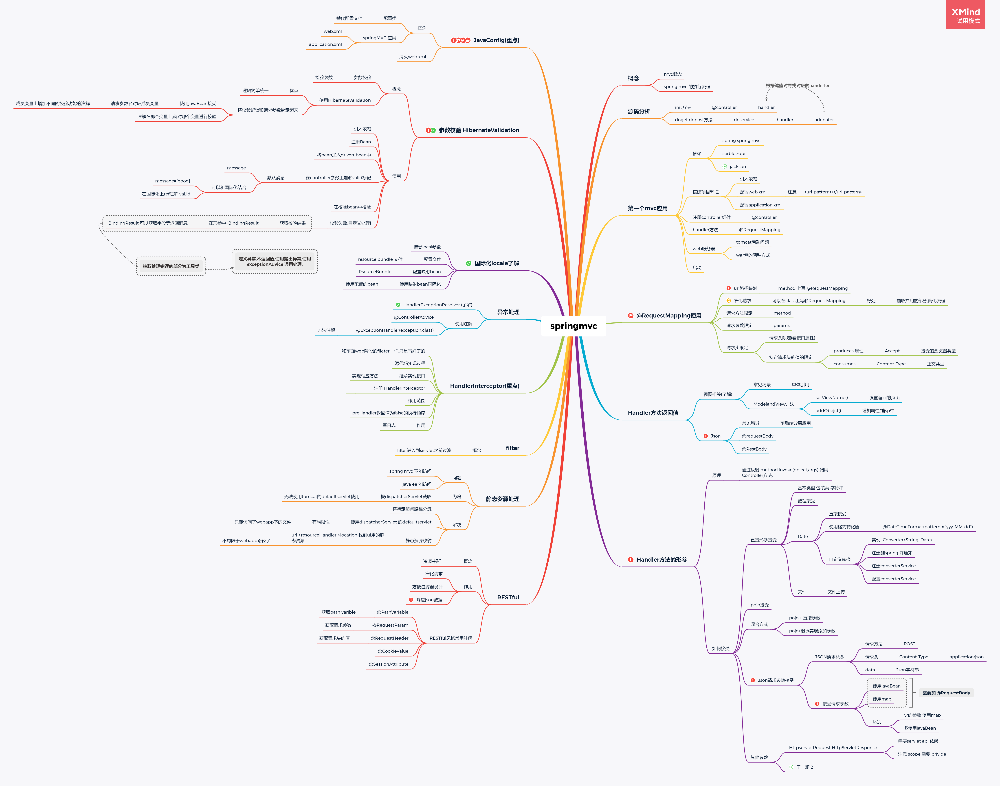

# 1   SpringMVC

> doc:https://docs.spring.io/spring-framework/docs/5.3.10-SNAPSHOT/reference/html/web.html#mvc-servlet
>
> api:https://docs.spring.io/spring-framework/docs/5.3.10-SNAPSHOT/javadoc-api/

## model:重点

这个主要的流程:

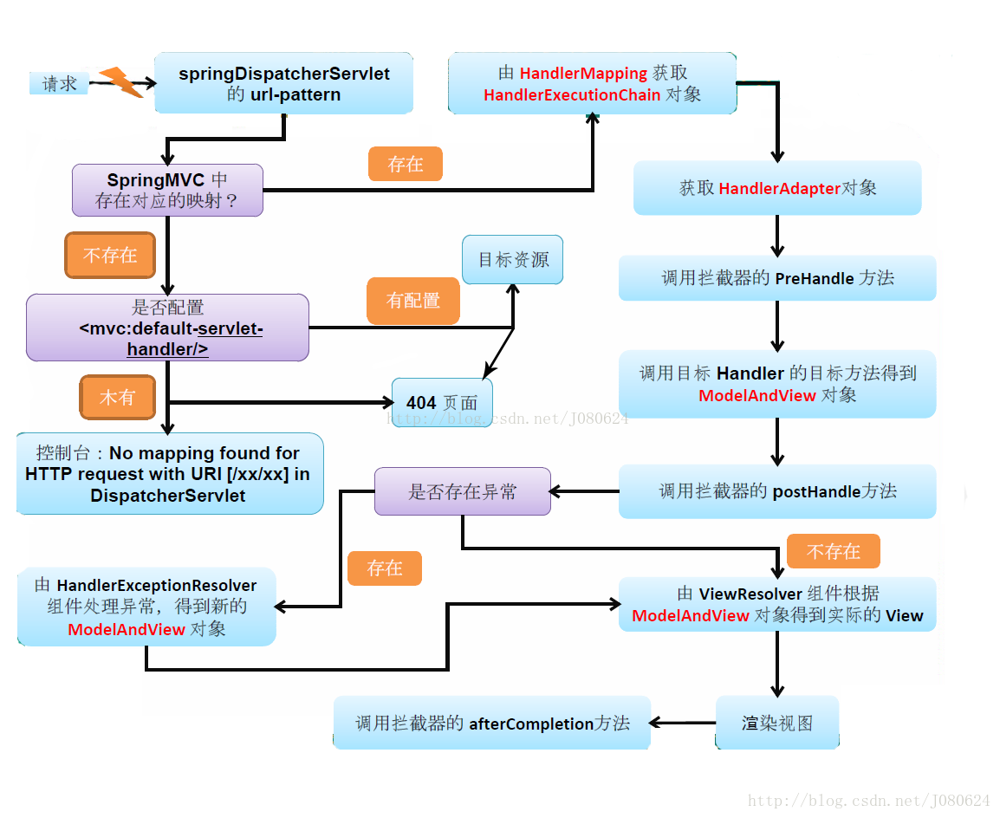

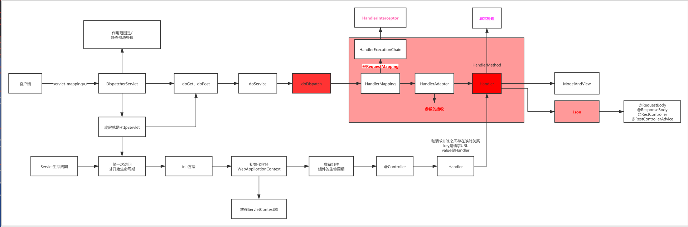


流程参考图:https://blog.csdn.net/J080624/article/details/77990164

## 容器介绍

容器初始化参考:https://blog.csdn.net/J080624/article/details/83444209

一般项目中使用Tomcat作为Web容器时会有三个容器：

ServletContext-Tomcat启动时创建，
Spring容器-Root WebApplicationContext-IOC容器
SpringMVC容器。`
Spring容器以属性(org.springframework.web.context.WebApplicationContext.ROOT)-值(Root WebApplicationContext)放置在ServletContext中，SpringMVC容器以属性(org.springframework.web.servlet.FrameworkServlet.CONTEXT.springMVC)-值(WebApplicationContext)放置在ServletContext容器中。

同时，Spring容器是SpringMVC容器的父容器！


————————————————
版权声明：本文为CSDN博主「流烟默」的原创文章，遵循CC 4.0 BY-SA版权协议，转载请附上原文出处链接及本声明。
原文链接：https://blog.csdn.net/J080624/article/details/83444209


Spring框架的基础上，MVC模式的使用

解决JavaEE使用的复杂性（Servlet、映射到对应的Servlet、分发到不同的方法上、请求参数的接收、结果的响应）

 

基于Servlet开发的


## 1.1  看代码（尽力吧）

### 1.1.1 init方法

DispatcherServlet 👉 initServletBean

this.webApplicationContext = this.initWebApplicationContext();

 

初始化WebApplicationContext并且放在ServletContext中

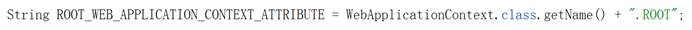

### 1.1.2 doGet、doPost方法

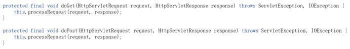

#### 1.1.2.1 HandlerMapping

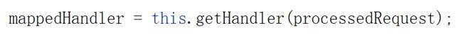

#### 1.1.2.2 HandlerAdapter

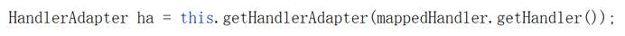

#### 1.1.2.3 Handler方法执行

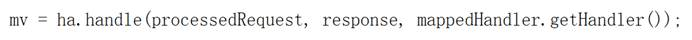

### 1.1.3 context

`DispatcherServlet` expects a `WebApplicationContext` (an extension of a plain `ApplicationContext`) for its own configuration. `WebApplicationContext` has a link to the `ServletContext` and the `Servlet` with which it is associated. It is also bound to the `ServletContext` such that applications can use static methods on `RequestContextUtils` to look up the `WebApplicationContext` if they need access to it.


## 1.2  第一个SpringMVC应用

/hello1 👉 /hello.jsp (ModelAndView中的View是这个文件) 👉 hello world

/hello2 👉 hello world

### 1.2.1 引入依赖

spring-webmvc 👉 5（spring） + 2（web\webmvc） + 1(jcl)

servlet-api (scope=provided) 编译的时候需要，而打包、运行的时候不需要

Jackson-databind(json支持) 👉 databind、annotations、core

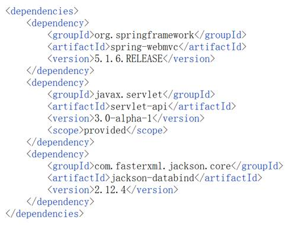

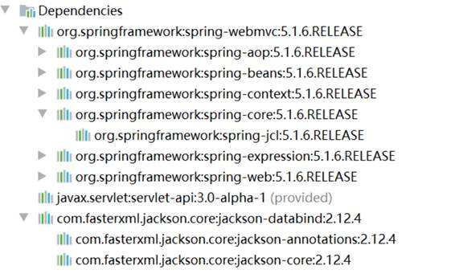

### 1.2.2 DispatcherServlet配置

> doc:[DispatcherServlet](https://docs.spring.io/spring-framework/docs/5.3.10-SNAPSHOT/reference/html/web.html#mvc-servlet)

The following example configures a `WebApplicationContext` hierarchy and `DispatcherServlet`

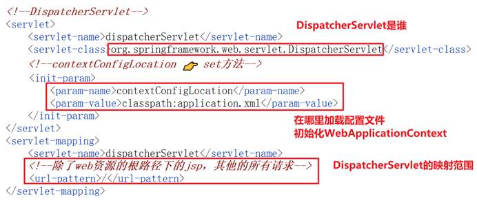

### 1.2.3 SpringMVC配置文件

application.xml

扫描包的配置

mvc:annotation-driven：注册一些必要的组件、**增加了对Json的支持**、转换器校验器的配置

 


### 1.2.4 注册Controller组件

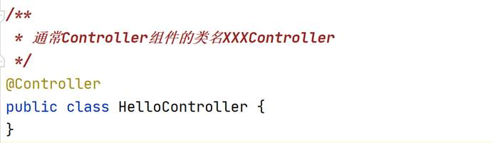

### 1.2.5 Handler方法

建立映射关系：请求URL和Handler方法之间的映射关系

@RequestMapping

value属性：请求URL

#### 原理:RequestMapping 如何和handler建立连接的

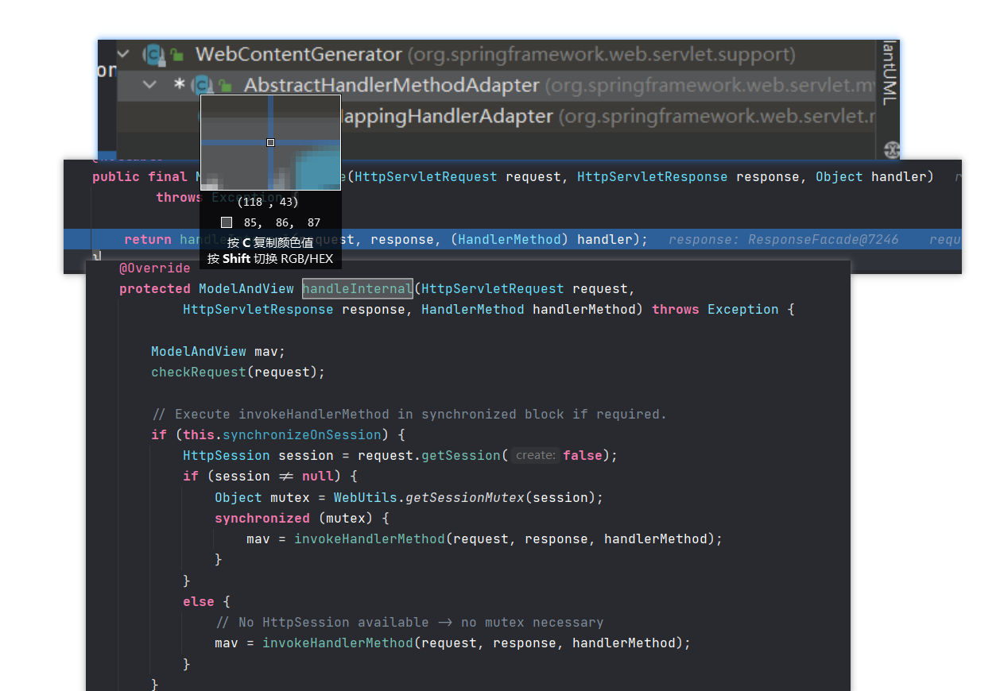

通过反射方法匹配.

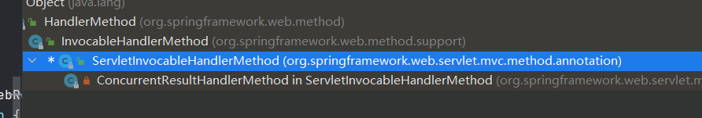

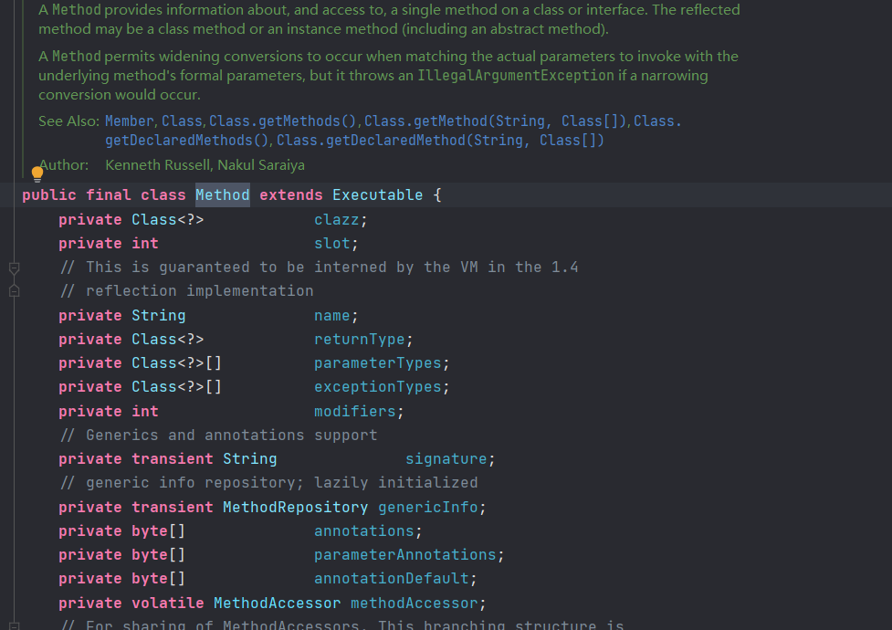

#### 1.2.5.1 ModelAndView（hello1）

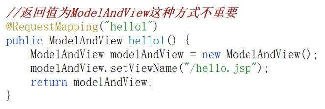

#### 1.2.5.2 Json（hello2）

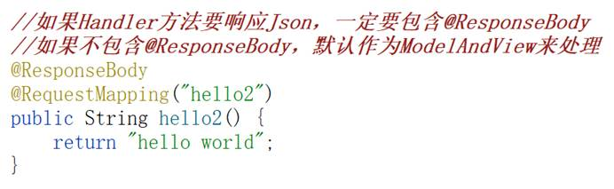

### 1.2.6 挂载SpringMVC应用

artifact 

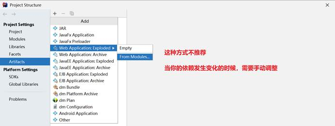

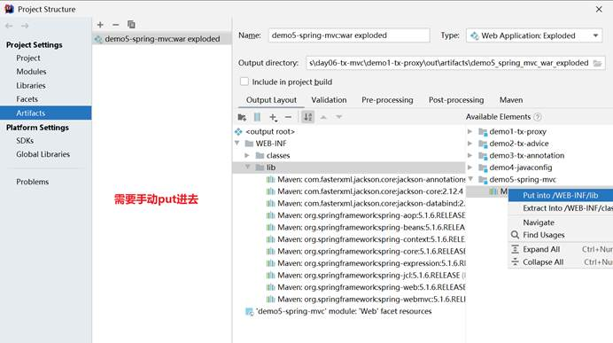

 

好用的方式 pom.xml 

<packaging>war</packaging>

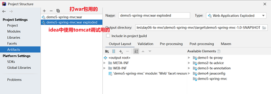


# 2   @RequestMapping的使用

核心功能：URL路径映射

## 2.1  ★★★URL路径映射

之前已经使用过了：value属性

### 2.1.1 映射多个请求URL

String[] 👉 多个请求URL

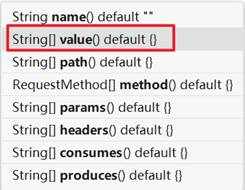

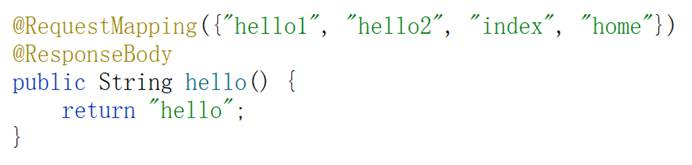

### 1.1.2 使用通配符

*

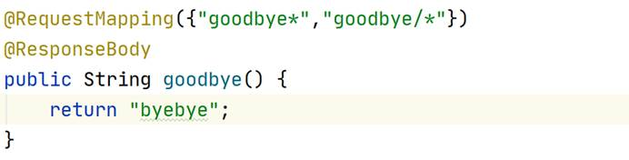

## 2.2  ★窄化请求

user/login

user/register

user/modify

user/logout


写起来简单了

方便写过滤器（拦截器） 👉 处理请求URL前缀都为user的这样的请求

## 2.3  请求方法限定 method → RequestMethod[]

多个值之间的关系是or

限定请求方法

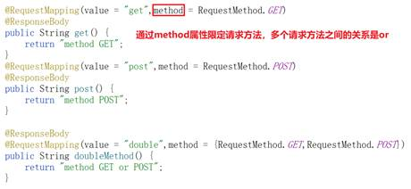

引申@GetMapping、@PostMapping

@GetMapping就是限定了请求方法为GET的@RequestMapping

@PostMapping就是限定了请求方法为POST的@RequestMapping

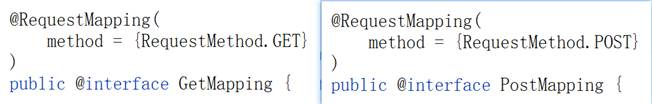

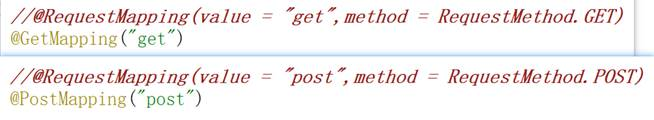

## 2.4  请求参数限定 params → String[]

限定你发送的请求要携带的参数有哪些，多个参数之间的关系是and

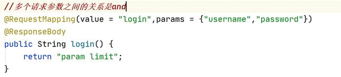

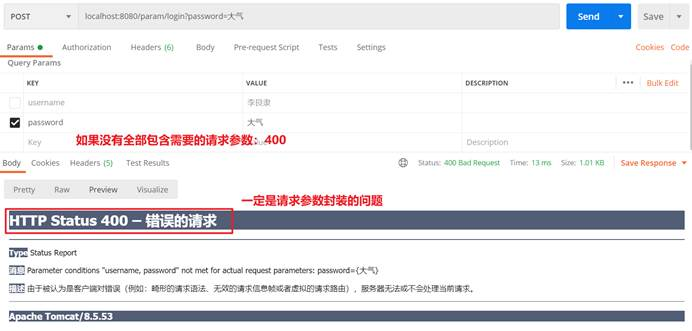

## 2.5  请求头限定 headers → String[]

要包含哪些请求头

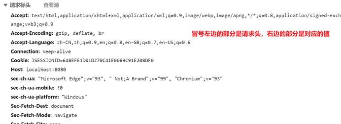

代码

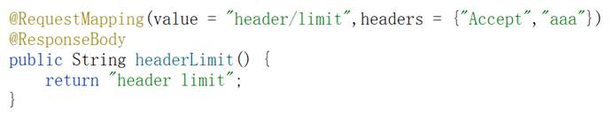

请求

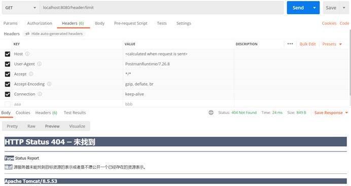

### 1.5.1 Accept对应的值的限定 produces → String[]

语法：xxx/xxx

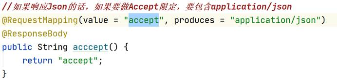

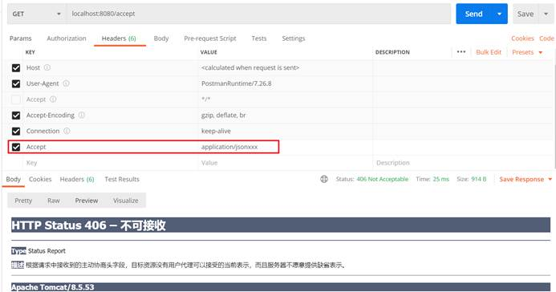

### 1.5.2 Content-Type对应的值的限定 consumes → String[]

语法：xxx/xxx

正文类型

JSON请求的Content-Type一定是application/json


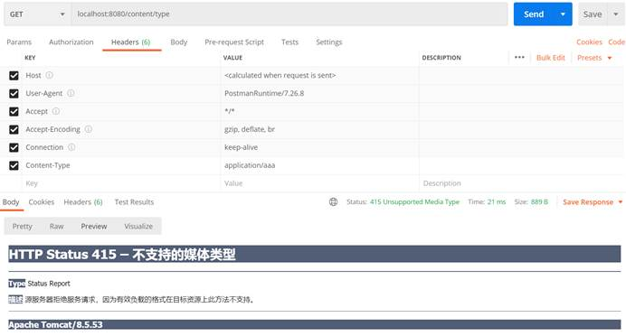

# 3  Handler方法返回值

## 3.1  视图相关

单体应用

### 3.1.1 ModelAndView

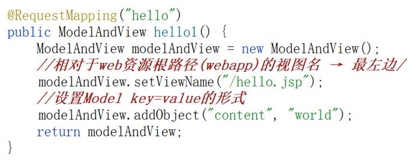


#### 补充:[el表达式](https://www.runoob.com/jsp/jsp-expression-language.html)

JSP表达式语言（EL）使得访问存储在JavaBean中的数据变得非常简单。JSP EL既可以用来创建算术表达式也可以用来创建逻辑表达式。在JSP EL表达式内可以使用整型数，浮点数，字符串，常量true、false，还有null。

P EL允许您指定一个表达式来表示属性值。一个简单的表达式语法如下：

```jsp
${expr}
```

##### EL中的基础操作符

EL表达式支持大部分Java所提供的算术和逻辑操作符：

| **操作符** | **描述**                         |
| :--------- | :------------------------------- |
| .          | 访问一个Bean属性或者一个映射条目 |
| []         | 访问一个数组或者链表的元素       |
| ( )        | 组织一个子表达式以改变优先级     |
| +          | 加                               |
| -          | 减或负                           |
| *          | 乘                               |
| / or div   | 除                               |
| % or mod   | 取模                             |
| == or eq   | 测试是否相等                     |
| != or ne   | 测试是否不等                     |
| < or lt    | 测试是否小于                     |
| > or gt    | 测试是否大于                     |
| <= or le   | 测试是否小于等于                 |
| >= or ge   | 测试是否大于等于                 |
| && or and  | 测试逻辑与                       |
| \|\| or or | 测试逻辑或                       |
| ! or not   | 测试取反                         |
| empty      | 测试是否空值                     |

#### JSP EL隐含对象

JSP EL支持下表列出的隐含对象：

| **隐含对象**     | **描述**                      |
| :--------------- | :---------------------------- |
| pageScope        | page 作用域                   |
| requestScope     | request 作用域                |
| sessionScope     | session 作用域                |
| applicationScope | application 作用域            |
| param            | Request 对象的参数，字符串    |
| paramValues      | Request对象的参数，字符串集合 |
| header           | HTTP 信息头，字符串           |
| headerValues     | HTTP 信息头，字符串集合       |
| initParam        | 上下文初始化参数              |
| cookie           | Cookie值                      |
| pageContext      | 当前页面的pageContext         |

您可以在表达式中使用这些对象，就像使用变量一样。接下来会给出几个例子来更好的理解这个概念。

### 2.1.2 String

作为视图名 → ModelAndView中的ViewName

## 3.2  ★Json

前后端分离应用

`@ResponseBody`注解会返回json数据

```java
   @RequestMapping("json")
    @ResponseBody
    public BaseRespVo json() {
        return new BaseRespVo("json data","right response",200);
    }
```

或者在类上加

`@RestBody`

# 4   Handler方法的形参

执行Handler方法是通过反射来执行

method.invoke(object,args);

形参主要是请求参数

## 1.1   ★★★请求参数接收

localhost:8080/user/register?username=songge&password=niupi&age=30&gender=male

这个请求它的请求参数是谁？

username、password、age、gender

### 1.1.1 直接在形参中接收

**请求参数名和Handler方法的形参名一致**

#### 1.1.1.1  基本类型、包装类、字符串

建议：基本类型的值建议使用对应的包装类来进行接收，避免没有传入参数，导致null值转换异常

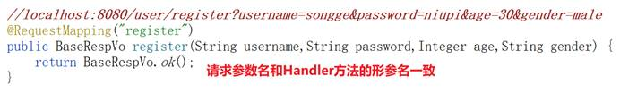

接收指定形参名的请求参数 → 直接先接收到字符串，然后将字符串转换为对应的类型

 

是因为提供了转换器： Converter

#### 1.1.1.2 数组

？hobbys=sing&hobbys=dance&hobbys=rap&hobbys=basketball

构造一个数组请求参数：多个请求参数名相同

请求参数名和Handler方法的形参名一致

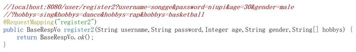

#### 1.1.1.3 Date（引出转换器）

1、直接接收：yyyy/MM/dd

2、使用指定格式的转换器：@DateTimeFormat(pattern=“日期格式”)

3、自定义转换器，自己来写转换

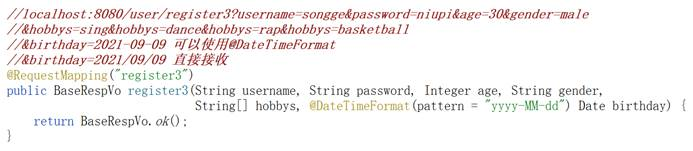

自定义转换器 → Converter接口

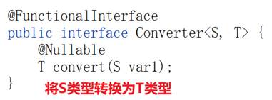

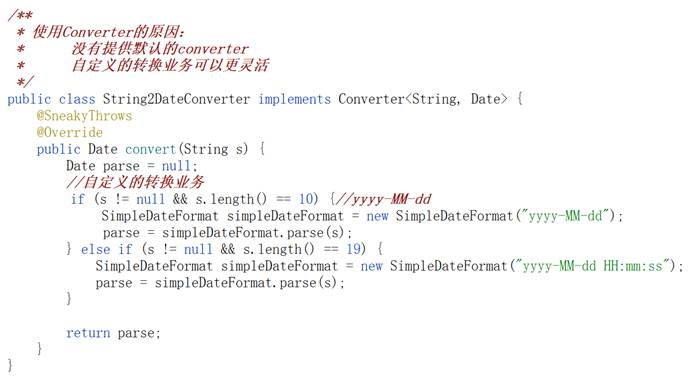

将转换器配置给SpringMVC的转换服务conversionService

1、 注册转换器组件

2、 注册一个conversionService，并且配置自定义转换器

3、 通知SpringMVC做了转换服务

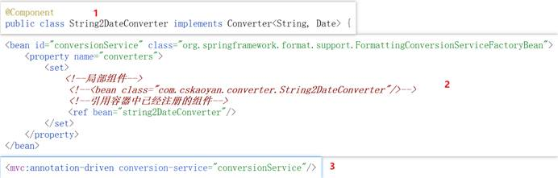

后续在JavaConfig和SpringBoot使用过程中都会简化这个过程

#### 1.1.1.4 文件

文件上传

##### 1.1.1.4.1   引入依赖

commons-io\commons-fileupload

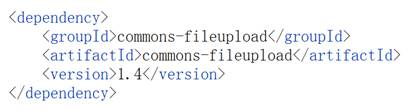

##### 1.1.1.4.2   注册multipartResolver组件

根据组件id来进行使用：注册这个组件的时候需要指定特定的组件id 👉multipartResolver

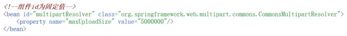

##### 1.1.1.4.3   构造请求（表单）

enctype=multipart/form-data

method=post

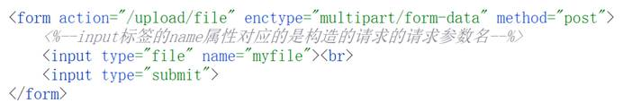

##### 1.1.1.4.4   Handler方法

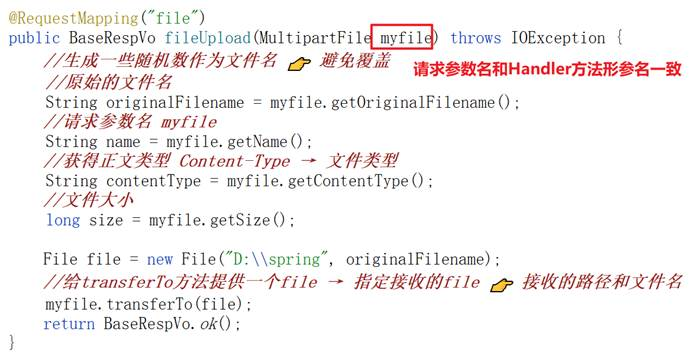

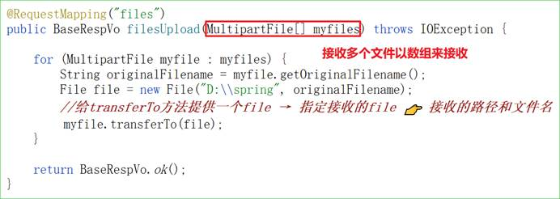


##### springboot 中配置文件大小:

```java
spring:
  application:
    name: dcbim-admin
  profiles:
    include: common,register,local
  servlet:
  	# 1、设置配置文件上传大小
    multipart:
      max-file-size: 100M
      max-request-size: 200M    

```


### 1.1.2 以Pojo类来接收

**原先在Handler方法中的这些形参，作为JavaBean的成员变量名**

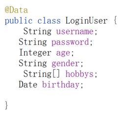

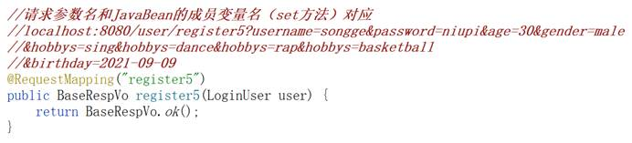

### 1.1.3 混合方式

直接接收请求参数和Pojo类接收的混合


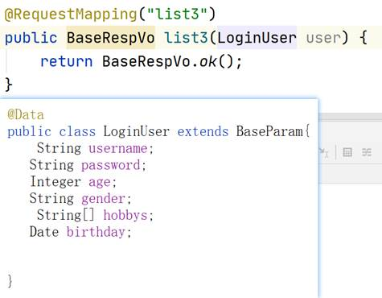

### 1.1.4 ★★★Json请求参数的接收

#### 1.1.4.1 Json请求

请求方法：POST

Content-Type：application/json

data:Json字符串

#### 1.1.4.2 接收Json请求参数

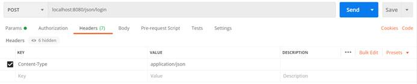


参数比较少，可以直接用Map来接收；如果需要固定参数类型，建议以JavaBean来接收

### 1.1.5 小结

先看请求URL 👉 @RequestMapping

请求方法：

GET，一定不会使用到@RequestBody注解

POST：判断请求参数中是否包含{}或[]

## 1.2  其他参数

### 1.2.1 HttpServletRequest和HttpServletResponse

当前的请求的request和response

用法就和你在servlet中的doGet和doPost


### 1.2.2 Model

Handler方法的返回值为字符串，作为viewName；Model是放在形参中的

```java
@RequestMapping("request2")
public String request2(Model model) {
    return "/hello.jsp";
}
```

--分割线--

**补充:**

Spring MVC 在调用方法前会创建一个隐含的模型对象作为模型数据的存储容器。

如果方法的入参为 Map 或 Model 类型,Spring MVC 会将隐含模型的引用传递给这些入参。在方法体内,我们可以通过这个入参对象访问到模型中的所有数据,也可以向模型中添加新的属性数据。

Model和Map使用上基本一样，具体实现代码如下图所示。

```java
@RequestMapping(value = "/testModel.do",method = RequestMethod.GET)
public String testModel(Model model){
    model.addAttribute("time",new Date());
    model.addAttribute("name","Model");
    return "hello";
}

@RequestMapping(value = "/testMap.do",method = RequestMethod.GET)
public String testMap(Map<String,Object> map){
    map.put("time",new Date());
    map.put("name","Map");
    return "hello";
}
```

上面代码所对应的hello.jsp与上面ModelAndView的hello.jsp一样。

经测试验证是可以正常工作的。
————————————————
版权声明：本文为CSDN博主「HelloWorld_EE」的原创文章，遵循CC 4.0 BY-SA版权协议，转载请附上原文出处链接及本声明。
原文链接：https://blog.csdn.net/u010412719/article/details/71835621

### 1.2.3 Cookie（不能直接放在形参中）

通过request获得cookie

### 1.2.4 Session

可以直接以HttpSession放在形参中；

也可以通过request来获得

### 1.2.5 代码

```java
package com.cskaoyan.controller;

import com.cskaoyan.bean.BaseRespVo;
import org.springframework.stereotype.Controller;
import org.springframework.ui.Model;
import org.springframework.web.bind.annotation.RequestMapping;
import org.springframework.web.bind.annotation.ResponseBody;

import javax.servlet.http.Cookie;
import javax.servlet.http.HttpServletRequest;
import javax.servlet.http.HttpServletResponse;
import javax.servlet.http.HttpSession;

/**
 * 类<code>Doc</code>用于：
 *其他参数
 *
 * @author 12824
 * @version 1.0
 *
 * @date 2021-09-09 -15:20
 */
@Controller
@RequestMapping("other")
public class OtherParamController {

    @RequestMapping("request1")
    @ResponseBody
    public BaseRespVo request1(HttpServletRequest request,
                               HttpServletResponse response) {
        return BaseRespVo.ok();
    }

    @RequestMapping("request2")
    public String request2(Model model) {
        model.addAttribute("name","jiuling");
        return "/hello.jsp";
    }

    @RequestMapping("request3")
    @ResponseBody
    public BaseRespVo request3(HttpServletRequest request) {
        Cookie[] cookies = request.getCookies();
        return BaseRespVo.ok();
    }
    @RequestMapping("request4")
    @ResponseBody
    public BaseRespVo request4(HttpServletRequest request) {
        HttpSession session = request.getSession();
        return BaseRespVo.ok();
    }

    @RequestMapping("request5")
    @ResponseBody
    public BaseRespVo request5(HttpSession session) {
        return BaseRespVo.ok();
    }
}
```

# 5   RESTful

表述性状态传递

 

user相关的请求：新增、修改、删除、查询

/user GET 查询

/user POST 新增

/user DELETE删除

/user PUT 修改

根据请求方法的不同做不同的请求

现在我们不用了，主流做的是前后端分离，**请求方法主要就是GET或POST**

/user/list

/user/update

/user/delete

/user/add

请求URL是具备一些特征的，资源+操作

方便我们去设计拦截器（过滤器），窄化请求

 

**最重要的点：响应JSON数据**

 

再讲几个注解：获得请求的组成部分，作为Handler方法的形参，让你的Handler方法能够拿到这一些

## 2.1  请求URL → @PathVariable


用户名/article/details/文章id


## 2.2  请求参数 → @RequestParam

没啥用，脱裤子放屁


## 2.3  请求头 → @RequestHeader

获得指定请求头的值，根据key获得对应的value


## 2.4  Cookie → @CookieValue

根据cookie的name获得对应的value

构造cookie：songge=niupi

### 2.4.1 浏览器


### 2.4.2 postman


### 2.4.3 获得cookiename对应的value


## 2.5  Session → @SessionAttribute

根据attributeName，拿到对应的value


# 6   静态资源处理

之前JavaEE应用我们放在web资源路径的下静态资源可以直接访问到，整合SpringMVC之后发现访问不了

 

DispatcherServlet的servlet-mapping = /


## 3.1  default这个servlet 分流


## 3.2  default-servlet-handler


前面这两种方式，处理的都是web资源根路径下的静态资源

## 3.3  静态资源映射


根据url找到对应的resourceHandler的location，输出对应的静态资源

**配置ResourceHandler，配置的就是mapping、location**

<mvc:resources mapping location/>


# 7   filter 

filter是在进入到servlet之前过滤

非常重要的一件事情，对request和response做通用的处理

要解决一个通用的编码问题 CharacterEncodingFilter


# 8   HandlerInterceptor

拦截器 接口

## 1.1  HandlerExecutionChain


## 1.2  HandlerMapping处理

```
HandlerExecutionChain mappedHandler = null;
```

mappedHandler = this.getHandler(processedRequest);


## 1.3  HandlerInterceptor提供的方法

preHandle

postHandle

afterCompletion


### 1.3.1 preHandle

如果preHandle返回值为false，则中断流程


### 1.3.2 postHandle

会接收到handler方法返回ModelAndView

```
mappedHandler.applyPostHandle(processedRequest, response, mv);

```

### 1.3.3 afterCompletion

发生异常的情况下，也是有可能执行到afterCompletion的；如果当前的HandlerInterceptor的preHandle方法的返回值为true，一定可以执行到对应的afterCompletion


### 1.3.4 小结

HandlerInterceptor是可以配置多个，多个HandlerInterceptor之间有顺序关系

preHandle的执行结果影响 Handler、postHandle、afterCompletion

如果preHandle返回结果为false，则执行不到Handler和postHandle

如果preHandle返回结果为true，则一定可以执行到对应的afterCompletion


## 1.4  HandlerInterceptor的使用

### 1.4.1 案例1

**HandlerInterceptor的作用范围一定事在DispatcherServlet作用范围内的**

自定义interceptor


### 1.4.2 作用范围

默认是全局范围

我们也可以指定作用范围


### 1.4.3 多个HandlerInterceptor的使用

多个HandlerInterceptor是有顺序的，书写顺序


最终执行情况：

preHandle123 → handler → postHandle321 → afterCompletion321

preHandle正序

postHandle和afterCompletion都倒序

### 1.4.4 如果preHandle返回值为false

意味着中断流程，Handler和postHandle都是执行不到

如果执行执行过的preHandle返回值为true，则一定可以指定到对应的afterCompletion

 

仍然3个HandlerInterceptor

如果preHandle1返回值为false，执行preHandle1

如果preHandle2返回值为false，执行preHandle1、2、afterCompletion1

如果preHandle3返回值为false，执行preHandle123、afterCompletion21

## 1.5  小结

HandlerInterceptor能做什么？

特定的范围的Handler方法，前后都会执行 →相当于对Handler方法做增强

 

通用的事情

提供了多个方法

# 9   异常处理

Handler方法的异常处理

## 2.1  HandlerExceptionResolver（了解）

过时的方式：返回值是ModelAndView

处理异常不够灵活


只要抛出异常，就会进入到resolveException中处理，形参中包含Exception对象

## 2.2  @ExceptionHandler

根据异常的类型不同，分发到不同的方法来进行处理，处理结果可以是ModelAndView，也可以是Json

 

放在要在ControllerAdvice组件中


# 10   国际化i18n

好、很棒

good → nice

good → 牛皮

good → 四个一

good → ging

同一个key在不同的环境下等于不同的value

如何区分不同的环境，可以使用不同的配置文件，提供不同语言的properties配置文件

 

web应用的环境如何区分 → Locale

## 3.1  Locale

地区信息，可以handler方法的形参中直接传入

## 3.2  LocaleResolver

管理locale信息


## 3.3  resource bundle

```java
<!--加载资源绑定文件-->
    <bean id="messageSource" class="org.springframework.context.support.ReloadableResourceBundleMessageSource">
        <property name="basename" value="classpath:param"/>
        <!--properties配置文件的字符集-->
        <property name="defaultEncoding" value="utf-8"/>
        <!--如果这个key没有对应的value，使用这个key作为value-->
        <property name="useCodeAsDefaultMessage" value="true"/>
    </bean>
```


### Resource Bundle是什么

> link:https://segmentfault.com/a/1190000016496715

可以直接通过官方的描述来了解 [https://www.jetbrains.com/hel...](https://link.segmentfault.com/?url=https%3A%2F%2Fwww.jetbrains.com%2Fhelp%2Fidea%2F2016.3%2Fresource-bundle.html)

> Resource bundle is a set of properties files that have same base name with different language-specific suffixes. A resource bundle contains at least two properties files with similar base name, for example file_en.properties and file_de.properties.

官方的描述是一堆有着相同前缀名称但有着不同语言后缀名称的属性文件的集合，且至少包含2个有着相似前缀名称的属性文件，例如`file_en.properties`和`file_de.properties`
其实从字面上理解就是资源包，为了方便统一管理繁多的国际化文件

Resource Bundle的目录结构


只是在Intellij IDEA内显示上多了一层名为Resources的Resource Bundle目录，但在实际物理目录下`Resources*.properties`等文件仍在java-calculator目录下

### 创建Resource Bundle

- `Alt + 1` 打开项目工具窗口，选中要创建Resource Bundle的目录
- `Alt + Insert` - Resource Bundle
  或者主菜单 - File - New - Resource Bundle
  或者当前目录右键 - New - Resource Bundle
  来打开创建Resource Bundle的对话框
- 填写Resource Bundle的基础名称
  勾选User XML-based properties files则会创建XML格式的属性文件
  Project locale表示项目里已经存在的区域
  Locales to add表示添加相应的区域，添加右边的`+`号即可添加，多个区域用`,`隔开
- 以创建一个基础名称为demo的Resource Bundle为例


点击`+`号添加多个区域，这里以添加zh和en为例


添加完成后，可以在Locales to add看到已经添加的区域


点击OK生成Resource Bundle


### 合并或拆分Resource Bundle

- 添加新的属性文件：直接在Resource Bundle 'demo'目录右键 - `Add Property Files to Resource Bundle`，点击`+`添加新的区域即可生成新的属性文件
- 拆分：如果不想使用Resource Bundle管理属性文件，可以在Resource Bundle目录右键 - `Dissociate Resource Bundle 'demo'`
- 合并：在同一个目录下创建多个符合相同前缀、不同语言后缀名称的属性文件时，Intellij IDEA会自动创建Resource Bundle管理这些文件
  也可以手动组合属性文件，按住`Ctrl + 鼠标左键`选中多个属性文件后右键 - `Combine to Resource Bundle`

## 3.4  MessageSource → 加载ResourceBundle

```text
/*message 是获取参数的对象,可以看作是properties对象相似的存在,只是被bin对象注入了*/
```


```java
<!--加载资源绑定文件-->
    <bean id="messageSource" class="org.springframework.context.support.ReloadableResourceBundleMessageSource">
        <!--直接找 param-->
        <property name="basename" value="classpath:param"/>
        <!--properties配置文件的字符集-->
        <property name="defaultEncoding" value="utf-8"/>
        <!--如果这个key没有对应的value，使用这个key作为value-->
        <property name="useCodeAsDefaultMessage" value="true"/>
    </bean>
```


## 3.5  根据key和locale获得ResourceBundle中的值

```java
@Autowired
MessageSource messageSource;
   @RequestMapping("hello/i18n2")
    public BaseRespVo hello(Locale locale) {
        /*国际化 , 传入的值会被  getMessage转化为 相应的key-value的value形式*/
        String good = messageSource.getMessage("good", null, locale);
        return BaseRespVo.ok(good);
    }
```


# 11   ★参数校验框架HibernateValidation

> ref-doc:https://docs.jboss.org/hibernate/validator/4.2/reference/zh-CN/html_single/#preface

请求参数的校验

 

统一校验逻辑、校验过程更简单

 

校验逻辑和请求参数直接绑定起来 → 请求参数使用JavaBean接收 → 请求参数对应成员变量 → 对成员变量做校验 → 成员变量上增加校验功能的注解

 

增加哪一个成员变量上就是对这个成员变量所对应的请求参数做校验

## 4.1  引入依赖


## 4.2  注册Validator组件


## 4.3  给SpringMVC提供校验器


## 4.4  案例

localhost:8080/register?username=songge&password=niupi&agef=30&gender=male

请求参数有username\password\age\gender

username至少6位

password至少6位


## 4.5  校验注解


## 4.6  自定义的处理

如果校验失败，进入不了handler方法

想要获得校验结果，做自定义的处理

 

在形参中放入BindingResult

hasFieldErrors方法 👉 请求参数是否有错误


## 4.7  整合思路

调用方法，如果校验失败，则抛出异常，找到ExceptionHandler处理，响应校验失败的Json数据


## 4.8  默认消息


也可以和国际化的MessageSource结合起来 👉 在message属性中提供一个key


# 12   ★★★JavaConfig

配置类 → 替代配置文件

 

SpringMVC应用 → web.xml、application.xml

## 5.1  搭建一个SpringMVC应用

application.xml → WebApplicationContext 👉 Listener（上面这个流程通常省略掉）

application-web.xml → WebApplicationContext 👉 DispatcherServlet

 

子容器可以使用父容器中的组件，父容器不能使用子容器中的组件

 

SpringMvc是子容器，Spring是父容器，可以提前完成一部分组件的准备

 

SpringMVC容器中主要注册web相关组件，主要是controller组件


## 5.2  JavaConfig

application.xml 👉 Spring配置类

application-web.xml 👉 SpringMVC配置类

web.xml 👉 web配置类

### 5.2.1 AACDSI

web.xml中做了三件事：加载Spring配置文件、加载SpringMVC配置文件、DispatcherServlet的作用范围

 

现在：加载Spring配置类、加载SpringMVC配置类、DispatcherServlet的作用范围


### 5.2.2 Spring配置类


### 5.2.3 SpringMVC配置类


### 5.2.4 SpringMVC的配置

从WebMvcConfigurer接口中来

#### 5.2.4.1 mvc:resouces mapping location

addResourceHandlers


#### 5.2.4.2 mvc:interceptors

HandlerInterceptor是谁、作用范围是什么、顺序


#### 5.2.4.3 conversionService

<mvc:annotation-driven conversion-service/>

FormattingConversionServiceFactoryBean 👉 Set converters

接收Date的时候


#### 5.2.4.4 validator

<mvc:annotation-driven validator/>

getValidator


 

 


# 补充

## 出现错误总结 :写了@RequestMapping 但是就是访问不到

问题原因:maven 编译没有编译到更改的RequestMapping  .

解决:查看是否编译.没有编译 ,重新编译


或者设置`runner`.


## 老师为什么我们要引入servlet-api 

老师为什么我们要引入servlet-api → 编译的时候需要（scope=provided）
