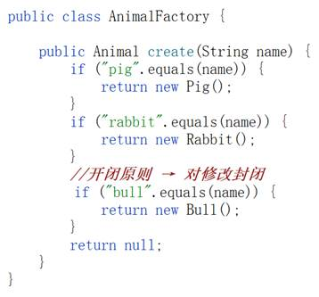
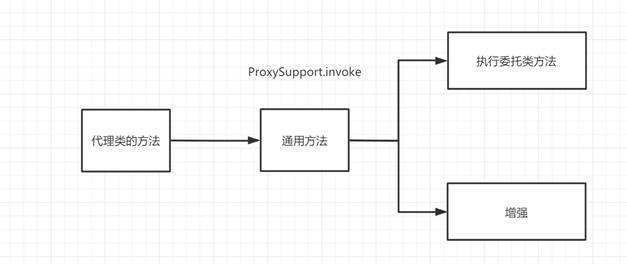
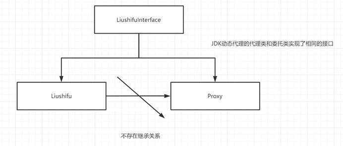

# 设计模式

code:https://github.com/ytwotap/design-pattern

> 扩展:[观察者模式](./观察者模式/观察者模式.md)
>
> [什么是代理](./proxy/什么是代理.md)
>
> [动态代理](./proxy/动态代理.md)

xmd:

# 1   设计模式的概念

经验

有经验的软件开发人员在开发实践过程中做出的总结

 

城市辐射农村、由点及面

 

灵活性、可拓展性、强壮性、代码更容易理解

 

不一定一定要去使用设计模式，要和实际结合起来

 

# 2   设计模式的原则SOLID

**S ：单一职责**

O：开闭原则。新增代码和修改代码。新增代码：开放。修改代码：封闭。

场景：所有人都忘了这个业务咋做的。

**L：里氏替代原则Lisvko** → 父类和子类的关系、子类不建议重写父类的方法，如果要重写的话，父类中方法定义为抽象方法

 

Father father = new Son();

father.method() → 调用的时候有可能调用的是子类的方法

I ：接口隔离原则，不同功能的方法放在不同的接口中。避免写大接口，将大接口拆分为小接口 → 成本高。也不要拆分的太小。

**D ：依赖倒置原则**。具体依赖于抽象。面向接口编程。

UserService userService = new UserServiceImpl();

 

# 3   具体的设计模式

理解做的事情是啥

## 3.1  单例 singleton

应用程序在运行过程中取出实例，每一次取出的是同一个实例。

单例：灵活可拓展、解耦

 

UserService userService = new UserServiceImpl2();

UserServiceImpl2()

 

有没有使用过单例呢？有 Servlet

 

如何写一个单例

MySingleton，以单例的形式存在

1、 构造方法私有

2、 提供静态方法给外部类调用

3、 包含自身类型的成员变量

### 3.1.1 线程不安全的懒加载

### 3.1.2 线程安全的懒加载

上面的案例，会有一个线程不安全

加锁

### 3.1.3 懒加载和立即加载

前面两个案例都是懒加载

当我们获得这个实例的时候才开始加载，当我们调用getInstance方法的时候才开始加载

 

实例化放在getInstance方法里面

 

立即加载：实例化要放在那里，放在getInstance方法外面，在执行getInstance方法之前

### 3.1.4 线程安全的立即加载

### 3.1.5 线程安全的懒加载（静态内部类）

#### 3.1.5.1 静态内部类的特性

分别去调用内部类方法和不调用内部类方法，多次调用内部类方法

思考一个问题：静态内部类的静态代码块儿，

执行的时机：第一次调用静态内部类的方法的时候，执行静态内部类的方法之前

执行的次数：一次

#### 3.1.5.2 线程安全的懒加载

我们要在静态内部类的静态代码块儿中写什么 → 实例化

## 3.2  工厂 factory

工厂是莫斯

生产 → 产品 

是一个什么样的工厂早什么的产品

 

你是一个什么样的工厂，就制造什么样的实例？ 目的就是为了制造实例（对象）

 

为什么要使用工厂？我们之前构造方法用的好好地，为莫斯？给我们隐藏实现细节。

有的时候还需要一些实例，但是呢提供的这个类呢并没有提供一个设置参数的方法。

在获得实例的过程中能够设置他的属性值

 

案例：MyBatis → SqlSessionFactory的Factory

 

使用工厂设计模式的过程中，类名会包含Factory，我们通常就叫XXXFactory

在工厂中也会包含生产实例的方法

### 3.2.1 简单工厂

根据传入的参数不同，生产不同的实例

AnimalFactory → Animal

### 3.2.2 工厂方法

Spring框架中大量使用的一种方式

将工厂定义为工厂接口，**由实现类来实现接口获得对应的实例**。

举例：汽车工厂。Tesla、DreamOne、Toyota

 

预告：FactoryBean → getObject

### 3.2.3 目标

当看到XXXFactoryBean，这是一个工厂设计模式，工厂设计模式一定有生产方法返回对应的实例

## 3.3  ★代理 proxy

代理是莫斯 → 帮忙

代理人战争：漂亮国阿富汗战争 → 打塔利班 

阿富汗政府军 在打塔利班

帮助漂亮国再打塔利班

 

刘师傅买早餐：一碗热干面、一碗蛋酒

委托松哥帮我带早餐：帮助刘师傅买早餐、多带了一根烤肠

 

刘师傅：委托类

松哥：代理类

**代理：不仅要做委托类要做的事情，还可以额外的增强**

 

**为什么要使用代理？代理具备通用性，针对于委托类的方法做一个通用性的增强。解耦**

**重复性的操作？service层每一个方法开启SqlSession、都要提交并关闭**

 

### 3.3.1 静态代理

静态代理需要我们自己手写代理类

带早餐案例

#### 3.3.1.1 写法一

#### 3.3.1.2 写法二

#### 3.3.1.3 小结

**代理类对应的方法和委托类方法相同**

**代理类的方法：1、委托类方法的调用 2、增强**

**代理对象去执行的方法才是增强的方法**

### 3.3.2 动态代理

代理类动态生成的不需要我们自己来写

**那么他生成的代理类做了什么样的事情呢？？**

**代理类中包含了和委托类相同的方法**

**方法里：执行委托类的代码和增强**

 

**委托类的所有方法，做一个相同的增强**

 

**代理类中的方法：调用了一个方法，调用的这个方法做的事情：执行委托类的方法、增强**

#### 3.3.2.1  JDK动态代理

生成代理对象 → 代理对象执行的方法才是一个增强的方法

代理类和委托类实现了相同的接口，代理类并没有继承委托类，这里就意味着要使用接口来接收代理对象

看一下动态代理类的样子，保存一下字节码文件 → 反编译

 

#### 3.3.2.2 Cglib动态代理

cglib提供的方法来获得的代理对象

**和jdk动态代理之间的核心的区别：委托类和代理类之间的关系，代理类继承了委托类**

**可以使用委托类来接收代理对象**

**cglib动态代理的委托类不必须要接口的实现**

 

### 3.3.3 程序员关注的点是什么

**InvocationHandler的定义 → 里面做什么样的增强**

**委托类、代理类、接口之间的关系**

**代理类执行方法 → 执行的就是InvocationHandler的invoke方法**

 

**代理：执行委托类方法、增强**

## 3.4  建造者（了解）builder

StringBuffer、StringBuilder

SqlSessionFactoryBuilder

 

建造实例 👉 也是去获得实例

工厂和建造者有啥区别：侧重点

 

举例：造人 Human 需要HumanBuilder

### 3.4.1 案例1

### 3.4.2 案例2

