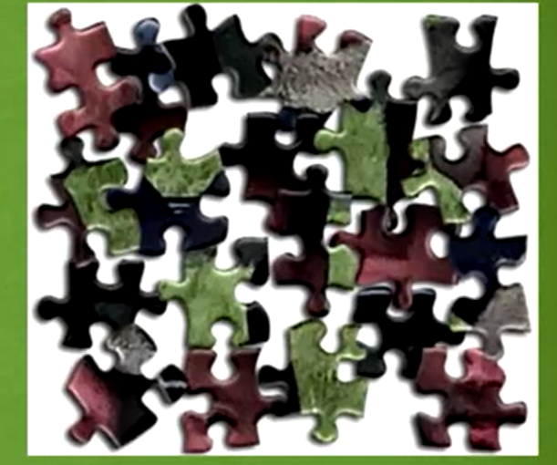
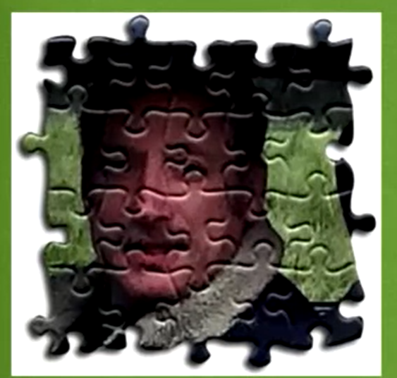
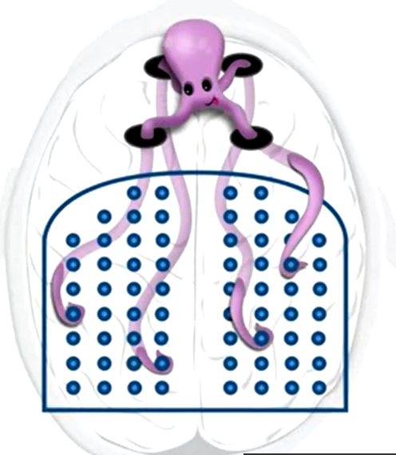
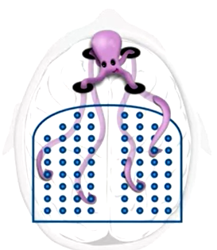
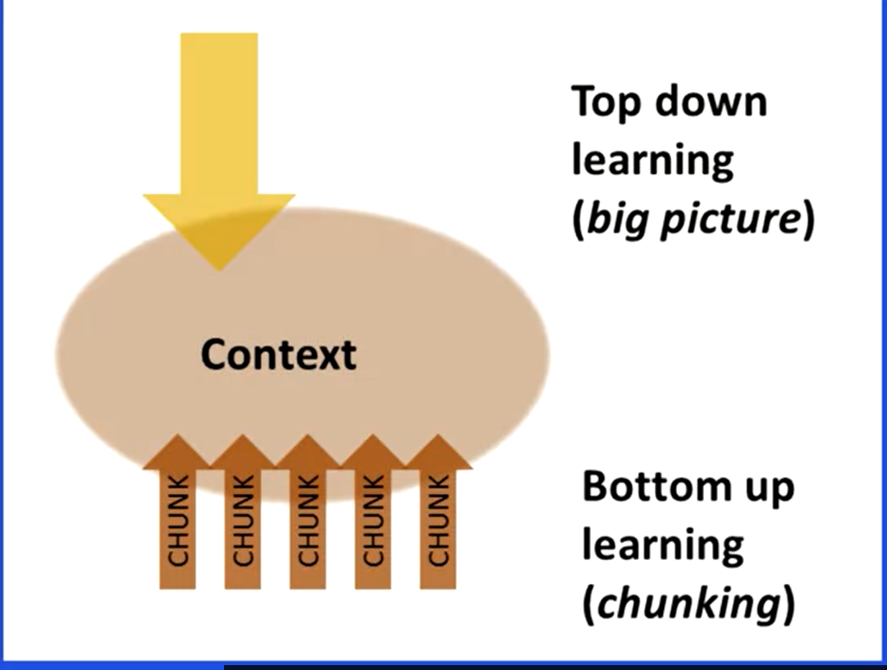
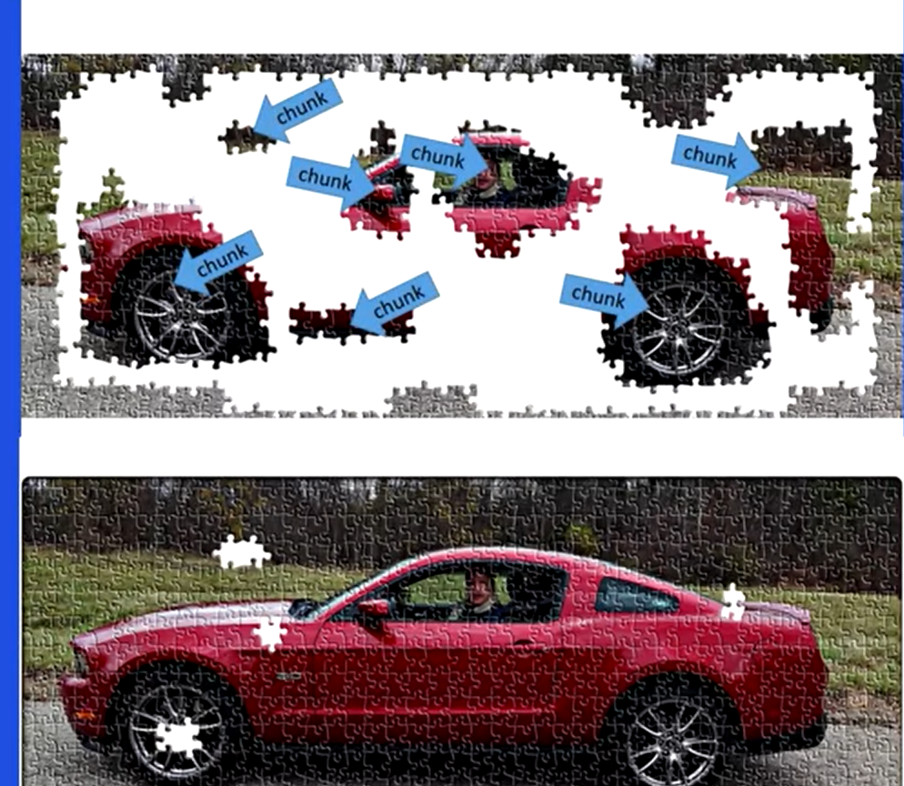

# chunks

## 1.introduction

compact packages of information that your mind can easily access.

 talk about something called overlearning,.

make your study time more valuable by interleaving.

providing intelligent variety in your studies.

## 2.what is chunk?

 

Chunking is the mental leap that helps 

you unite bits of information together through meaning. 

The new logical whole makes the chunk easier to remember, and also makes 

it easier to fit the chunk into the larger picture of what you're learning. 

Just memorizing a fact without understanding 

or context doesn't help you understand what's 

really going on or how the concept 

fits together with other concepts you're learning. 

Notice there are no interlocking puzzle edges on the 

puzzle piece to help you fit it to other pieces.

The octopus of attention that slips its tentacles 

through those four slots of working memory when necessary 

to help you make connections to information that 

you might have in various parts of your brain.

## 3 .how to from chunk

### 1  focus connection

it can be all too easy to **focus too much on  the connection** between steps and not on why an individual step works. 

### 2 How to Form a Chunk - Part 2

1. text1

    

   The first step on chunking is simply to focus your undivided attention on the information you want to chunk.

2. ​	text2

   

   The second step in chunking is to understand the basic idea you're trying to chunk, whether its understanding a concepts such as continental drift, seeing the connection between the basic elements of a plot for a story, grasping the economic principle of supply and demand, 

   or comprehending the essence of a particular type of math problem.

3. text3
	
	
	
	The third step to chunking is gaining context, so you can see not just how but also when to use this chunk.

   ​	需要在底层知识和背景知识相结合,

   ​	不仅要练习知道如何用,也要知道啥时候用.

   ​	在哪里用.有啥特殊效果.

Try taking a "picture walk" through the material to gain big picture context before diving into the details. 

